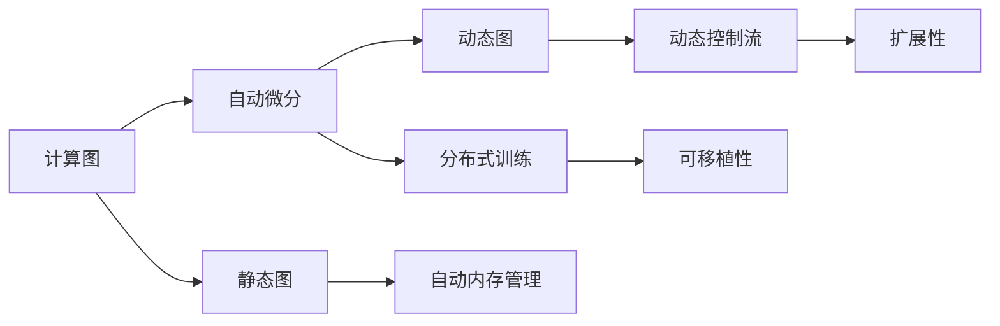

                 

# PyTorch vs JAX：深度学习框架的比较与选择

深度学习框架作为现代AI领域的重要基础设施，对于模型训练、优化和部署等方面有着至关重要的作用。本文将深入比较两种流行的深度学习框架——PyTorch和JAX，从背景介绍、核心概念、算法原理、应用场景、资源推荐等多个角度，对这两种框架进行全面的剖析和对比，并探讨其未来发展趋势与挑战。

## 1. 背景介绍

### 1.1 问题由来
近年来，深度学习在语音识别、图像处理、自然语言处理等众多领域取得了显著的突破，极大地推动了人工智能技术的快速发展。与此同时，大量的深度学习框架也应运而生，其中最为著名和广泛使用的框架之一就是PyTorch。与此同时，Google开源了JAX框架，旨在提供一种可扩展、高效的深度学习解决方案。本文将深入探讨这两种框架的异同，帮助开发者在选择深度学习框架时，能够做出更加明智的决策。

### 1.2 问题核心关键点
本文将比较PyTorch和JAX的核心概念，涵盖计算图、自动微分、动态图与静态图、自动内存管理、分布式训练、动态控制流、可移植性、扩展性等关键点。通过对这些关键点的对比，全面了解两种框架的特点，从而做出合理的选择。

### 1.3 问题研究意义
了解PyTorch和JAX之间的区别和联系，对于选择适合的深度学习框架具有重要意义：

1. **提高开发效率**：选择合适框架，可以大幅提高模型训练和开发的效率，缩短项目周期。
2. **增强模型性能**：不同框架在性能上存在差异，正确选择可以提升模型的计算效率和精度。
3. **支持多种应用**：不同的框架适用于不同的应用场景，如模型训练、推理部署等。
4. **降低开发门槛**：了解框架特点，有助于初学者快速上手深度学习开发。
5. **推动技术创新**：框架的优劣直接影响深度学习技术的演进和应用范围的拓展。

## 2. 核心概念与联系

### 2.1 核心概念概述

为了更好地理解PyTorch和JAX的异同，本节将介绍几个核心概念：

- **计算图**：深度学习模型中的计算图表示了模型各层之间的依赖关系，用于自动微分和优化。
- **自动微分**：自动求导技术，自动计算模型参数的梯度，使得反向传播算法变得高效和自动化。
- **动态图与静态图**：动态图在运行时生成计算图，而静态图在编译时生成计算图。动态图可以灵活调整计算图结构，但可能会带来性能问题。
- **自动内存管理**：框架自动管理内存，减少内存泄漏和内存碎片问题。
- **分布式训练**：将模型分布在多台机器上进行并行训练，提升训练速度。
- **动态控制流**：支持复杂的循环和条件语句，增强模型的表达能力。
- **可移植性**：框架代码的可移植性，决定了在不同平台上的适用性。
- **扩展性**：框架的扩展能力，决定了在复杂任务上的表现和开发效率。

这些概念之间的逻辑关系可以通过以下Mermaid流程图来展示：



这个流程图展示了深度学习框架中各种概念之间的联系和区别，帮助我们更好地理解PyTorch和JAX的核心技术特点。

## 3. 核心算法原理 & 具体操作步骤

### 3.1 算法原理概述

PyTorch和JAX的算法原理本质上都是基于反向传播算法进行模型训练的。通过自动微分技术，自动计算损失函数对模型参数的梯度，然后通过梯度下降等优化算法来更新模型参数，最小化损失函数，从而得到最优模型。

### 3.2 算法步骤详解

接下来，将详细介绍两种框架的具体步骤：

#### PyTorch

1. **环境搭建**：安装PyTorch、CUDA、cuDNN等依赖库。
2. **模型定义**：使用Tensor来表示模型，定义损失函数和优化器。
3. **数据加载**：使用DataLoader加载训练和验证数据。
4. **模型训练**：在每个epoch中，前向传播计算损失函数，反向传播更新参数。
5. **模型评估**：在验证集上评估模型性能，并根据性能调整超参数。
6. **模型保存**：将模型保存为pickle文件或torchscript文件，以便后续推理和部署。

#### JAX

1. **环境搭建**：安装JAX、JAXlib、TensorFlow等依赖库。
2. **模型定义**：使用JAX的NumPy API来定义模型，使用`jax.jit`进行静态图编译。
3. **数据加载**：使用`tf.data.Dataset`加载数据。
4. **模型训练**：使用JAX的`jit`装饰器进行静态图编译，并使用`tf.function`进行分布式训练。
5. **模型评估**：在验证集上评估模型性能，并根据性能调整超参数。
6. **模型保存**：将模型保存为JAX格式的`pytree`对象，以便后续推理和部署。

### 3.3 算法优缺点

#### PyTorch

**优点**：

- **动态图**：灵活性高，支持动态图计算，便于调试和优化。
- **易用性**：API简单，易于上手。
- **社区活跃**：拥有庞大的社区和丰富的资源。
- **生态完善**：丰富的模型库和工具。

**缺点**：

- **性能问题**：动态图可能导致性能问题，特别是在分布式训练中。
- **内存管理**：手动管理内存，可能出现内存泄漏问题。
- **可移植性**：部分模型和工具在Windows平台上兼容性较差。

#### JAX

**优点**：

- **静态图**：性能高，支持自动并行优化。
- **动态控制流**：支持复杂的循环和条件语句，增强模型的表达能力。
- **可移植性**：支持CPU、GPU、TPU等平台。
- **扩展性**：支持自动微分和自动并行，易于扩展复杂模型。

**缺点**：

- **学习曲线陡**：API较为复杂，上手难度大。
- **社区规模**：相对较小，资源和工具不如PyTorch丰富。
- **分布式训练**：分布式训练复杂，需要配合TensorFlow等工具。

### 3.4 算法应用领域

PyTorch和JAX在深度学习的应用领域基本相同，主要集中在以下几个方面：

- **计算机视觉**：如图像分类、目标检测、语义分割等任务。
- **自然语言处理**：如机器翻译、情感分析、文本生成等任务。
- **语音识别**：如语音转文本、语音合成等任务。
- **推荐系统**：如协同过滤、深度兴趣推荐等任务。
- **强化学习**：如自动驾驶、游戏AI等任务。
- **科学计算**：如数学建模、物理模拟等任务。

## 4. 数学模型和公式 & 详细讲解 & 举例说明

### 4.1 数学模型构建

在本节中，将详细讲解如何使用PyTorch和JAX构建深度学习模型。

#### PyTorch

```python
import torch
import torch.nn as nn
import torch.optim as optim

# 定义模型
class Net(nn.Module):
    def __init__(self):
        super(Net, self).__init__()
        self.fc1 = nn.Linear(784, 256)
        self.fc2 = nn.Linear(256, 128)
        self.fc3 = nn.Linear(128, 10)

    def forward(self, x):
        x = torch.relu(self.fc1(x))
        x = torch.relu(self.fc2(x))
        x = self.fc3(x)
        return x

# 定义损失函数和优化器
model = Net()
criterion = nn.CrossEntropyLoss()
optimizer = optim.SGD(model.parameters(), lr=0.01)

# 数据加载
train_loader = torch.utils.data.DataLoader(train_dataset, batch_size=64, shuffle=True)

# 模型训练
for epoch in range(10):
    for data, target in train_loader:
        optimizer.zero_grad()
        output = model(data)
        loss = criterion(output, target)
        loss.backward()
        optimizer.step()
```

#### JAX

```python
import jax
import jax.numpy as jnp
import jax.jit
import optax
import tensorflow_datasets as tfds

# 定义模型
def net(x):
    w1 = jnp.zeros((784, 256))
    b1 = jnp.zeros(256)
    w2 = jnp.zeros((256, 128))
    b2 = jnp.zeros(128)
    w3 = jnp.zeros((128, 10))
    b3 = jnp.zeros(10)
    x = jnp.tanh(jnp.dot(x, w1) + b1)
    x = jnp.tanh(jnp.dot(x, w2) + b2)
    x = jnp.dot(x, w3) + b3
    return x

# 定义损失函数和优化器
def loss(params, x, y):
    preds = net(x)
    loss = jnp.mean((preds - y)**2)
    return loss

def update(i, loss, params):
    grads = jax.grad(loss)(params)
    new_params = optax.apply_update(optax.adam(0.1), grads, params)
    return i+1, new_params, loss

def train():
    # 加载数据
    (train_data, test_data), state = tfds.load(name='mnist', split=['train', 'test'], as_supervised=True, with_info=True)
    train_dataset = tfds.as_dataframe(train_data, state)
    test_dataset = tfds.as_dataframe(test_data, state)
    
    # 定义优化器和参数
    opt_init, opt_update, get_params = optax.adam(0.1)
    params = opt_init(0.)
    num_iters = 1000
    avg_loss = jax.tree_map(lambda x: jnp.zeros_like(x), params)
    
    # 训练模型
    for i in range(num_iters):
        batch_x, batch_y = train_dataset[i]
        loss, params = update(i, loss, params)
        avg_loss = optax.update_avg(avg_loss, loss)
    
    return params

# 训练模型
params = train()
```

### 4.2 公式推导过程

接下来，将详细讲解PyTorch和JAX中常见的数学公式推导。

#### PyTorch

**线性回归**：

- 模型定义：$\theta$ 为模型参数，$x$ 为输入数据，$y$ 为标签。
- 前向传播：$\hat{y} = \theta x$。
- 损失函数：$\mathcal{L}(\theta) = \frac{1}{n} \sum_{i=1}^n (\hat{y}_i - y_i)^2$。
- 梯度下降：$\theta \leftarrow \theta - \eta \nabla_\theta \mathcal{L}(\theta)$。

#### JAX

**线性回归**：

- 模型定义：$w$ 为模型参数，$x$ 为输入数据，$y$ 为标签。
- 前向传播：$\hat{y} = wx$。
- 损失函数：$\mathcal{L}(w) = \frac{1}{n} \sum_{i=1}^n (\hat{y}_i - y_i)^2$。
- 梯度下降：$w \leftarrow w - \eta \nabla_w \mathcal{L}(w)$。

### 4.3 案例分析与讲解

**MNIST手写数字识别**：

- PyTorch实现：
```python
import torch
import torch.nn as nn
import torch.optim as optim
import torchvision.datasets as datasets
import torchvision.transforms as transforms

# 数据预处理
transform = transforms.Compose([
    transforms.ToTensor(),
    transforms.Normalize((0.1307,), (0.3081,))
])

# 加载数据
train_dataset = datasets.MNIST('~/data', train=True, download=True, transform=transform)
test_dataset = datasets.MNIST('~/data', train=False, transform=transform, download=True)

# 定义模型
model = nn.Sequential(nn.Linear(784, 256), nn.ReLU(), nn.Linear(256, 128), nn.ReLU(), nn.Linear(128, 10), nn.Softmax(dim=1))

# 定义损失函数和优化器
criterion = nn.CrossEntropyLoss()
optimizer = optim.SGD(model.parameters(), lr=0.01)

# 模型训练
for epoch in range(10):
    for data, target in train_loader:
        optimizer.zero_grad()
        output = model(data.view(-1, 784))
        loss = criterion(output, target)
        loss.backward()
        optimizer.step()

    # 模型评估
    correct = 0
    total = 0
    with torch.no_grad():
        for data, target in test_loader:
            output = model(data.view(-1, 784))
            _, predicted = torch.max(output.data, 1)
            total += target.size(0)
            correct += (predicted == target).sum().item()

    print(f'Epoch {epoch+1}, accuracy: {100 * correct / total:.2f}%')
```

- JAX实现：
```python
import jax
import jax.numpy as jnp
import jax.jit
import jax.experimental.optimizers
import optax
import tensorflow_datasets as tfds

# 数据预处理
train_dataset, test_dataset = tfds.load(name='mnist', split=['train', 'test'], as_supervised=True, with_info=True)

# 定义模型
def net(x):
    w1 = jnp.zeros((784, 256))
    b1 = jnp.zeros(256)
    w2 = jnp.zeros((256, 128))
    b2 = jnp.zeros(128)
    w3 = jnp.zeros((128, 10))
    b3 = jnp.zeros(10)
    x = jnp.tanh(jnp.dot(x, w1) + b1)
    x = jnp.tanh(jnp.dot(x, w2) + b2)
    x = jnp.dot(x, w3) + b3
    return x

def loss(params, x, y):
    preds = net(x)
    loss = jnp.mean((preds - y)**2)
    return loss

def update(i, loss, params):
    grads = jax.grad(loss)(params)
    new_params = optax.apply_update(optax.adam(0.1), grads, params)
    return i+1, new_params, loss

def train():
    # 加载数据
    (train_data, test_data), state = tfds.load(name='mnist', split=['train', 'test'], as_supervised=True, with_info=True)
    train_dataset = tfds.as_dataframe(train_data, state)
    test_dataset = tfds.as_dataframe(test_data, state)
    
    # 定义优化器和参数
    opt_init, opt_update, get_params = optax.adam(0.1)
    params = opt_init(0.)
    num_iters = 1000
    avg_loss = jax.tree_map(lambda x: jnp.zeros_like(x), params)
    
    # 训练模型
    for i in range(num_iters):
        batch_x, batch_y = train_dataset[i]
        loss, params = update(i, loss, params)
        avg_loss = optax.update_avg(avg_loss, loss)
    
    return params

# 训练模型
params = train()
```

## 5. 项目实践：代码实例和详细解释说明

### 5.1 开发环境搭建

在本节中，将详细介绍PyTorch和JAX的开发环境搭建过程。

#### PyTorch

1. 安装Anaconda：从官网下载并安装Anaconda，用于创建独立的Python环境。

2. 创建并激活虚拟环境：
```bash
conda create -n pytorch-env python=3.8 
conda activate pytorch-env
```

3. 安装PyTorch：根据CUDA版本，从官网获取对应的安装命令。例如：
```bash
conda install pytorch torchvision torchaudio cudatoolkit=11.1 -c pytorch -c conda-forge
```

4. 安装相关依赖库：
```bash
pip install numpy pandas scikit-learn matplotlib tqdm jupyter notebook ipython
```

#### JAX

1. 安装Anaconda：从官网下载并安装Anaconda，用于创建独立的Python环境。

2. 创建并激活虚拟环境：
```bash
conda create -n jax-env python=3.8 
conda activate jax-env
```

3. 安装JAX、JAXlib、TensorFlow等依赖库：
```bash
conda install jax jaxlib
conda install tensorflow
```

4. 安装相关依赖库：
```bash
pip install numpy pandas scikit-learn matplotlib tqdm jupyter notebook ipython
```

### 5.2 源代码详细实现

在本节中，将详细实现PyTorch和JAX的代码示例。

#### PyTorch

```python
import torch
import torch.nn as nn
import torch.optim as optim
import torchvision.datasets as datasets
import torchvision.transforms as transforms

# 数据预处理
transform = transforms.Compose([
    transforms.ToTensor(),
    transforms.Normalize((0.1307,), (0.3081,))
])

# 加载数据
train_dataset = datasets.MNIST('~/data', train=True, download=True, transform=transform)
test_dataset = datasets.MNIST('~/data', train=False, transform=transform, download=True)

# 定义模型
model = nn.Sequential(nn.Linear(784, 256), nn.ReLU(), nn.Linear(256, 128), nn.ReLU(), nn.Linear(128, 10), nn.Softmax(dim=1))

# 定义损失函数和优化器
criterion = nn.CrossEntropyLoss()
optimizer = optim.SGD(model.parameters(), lr=0.01)

# 模型训练
for epoch in range(10):
    for data, target in train_loader:
        optimizer.zero_grad()
        output = model(data.view(-1, 784))
        loss = criterion(output, target)
        loss.backward()
        optimizer.step()

    # 模型评估
    correct = 0
    total = 0
    with torch.no_grad():
        for data, target in test_loader:
            output = model(data.view(-1, 784))
            _, predicted = torch.max(output.data, 1)
            total += target.size(0)
            correct += (predicted == target).sum().item()

    print(f'Epoch {epoch+1}, accuracy: {100 * correct / total:.2f}%')
```

#### JAX

```python
import jax
import jax.numpy as jnp
import jax.jit
import jax.experimental.optimizers
import optax
import tensorflow_datasets as tfds

# 数据预处理
train_dataset, test_dataset = tfds.load(name='mnist', split=['train', 'test'], as_supervised=True, with_info=True)

# 定义模型
def net(x):
    w1 = jnp.zeros((784, 256))
    b1 = jnp.zeros(256)
    w2 = jnp.zeros((256, 128))
    b2 = jnp.zeros(128)
    w3 = jnp.zeros((128, 10))
    b3 = jnp.zeros(10)
    x = jnp.tanh(jnp.dot(x, w1) + b1)
    x = jnp.tanh(jnp.dot(x, w2) + b2)
    x = jnp.dot(x, w3) + b3
    return x

def loss(params, x, y):
    preds = net(x)
    loss = jnp.mean((preds - y)**2)
    return loss

def update(i, loss, params):
    grads = jax.grad(loss)(params)
    new_params = optax.apply_update(optax.adam(0.1), grads, params)
    return i+1, new_params, loss

def train():
    # 加载数据
    (train_data, test_data), state = tfds.load(name='mnist', split=['train', 'test'], as_supervised=True, with_info=True)
    train_dataset = tfds.as_dataframe(train_data, state)
    test_dataset = tfds.as_dataframe(test_data, state)
    
    # 定义优化器和参数
    opt_init, opt_update, get_params = optax.adam(0.1)
    params = opt_init(0.)
    num_iters = 1000
    avg_loss = jax.tree_map(lambda x: jnp.zeros_like(x), params)
    
    # 训练模型
    for i in range(num_iters):
        batch_x, batch_y = train_dataset[i]
        loss, params = update(i, loss, params)
        avg_loss = optax.update_avg(avg_loss, loss)
    
    return params

# 训练模型
params = train()
```

### 5.3 代码解读与分析

在本节中，将详细解读关键代码的实现细节。

#### PyTorch

**数据预处理**：
```python
transform = transforms.Compose([
    transforms.ToTensor(),
    transforms.Normalize((0.1307,), (0.3081,))
])
```
使用`transforms.Compose`对图像进行预处理，将图像转换为Tensor格式，并进行归一化。

**模型定义**：
```python
model = nn.Sequential(nn.Linear(784, 256), nn.ReLU(), nn.Linear(256, 128), nn.ReLU(), nn.Linear(128, 10), nn.Softmax(dim=1))
```
定义了一个简单的三层神经网络模型，使用`nn.Sequential`将各层组成一个网络。

**模型训练**：
```python
for data, target in train_loader:
    optimizer.zero_grad()
    output = model(data.view(-1, 784))
    loss = criterion(output, target)
    loss.backward()
    optimizer.step()
```
使用`train_loader`迭代训练数据，在每个batch上进行前向传播、计算损失、反向传播和参数更新。

#### JAX

**数据预处理**：
```python
train_dataset, test_dataset = tfds.load(name='mnist', split=['train', 'test'], as_supervised=True, with_info=True)
```
使用`tfds.load`加载MNIST数据集。

**模型定义**：
```python
def net(x):
    w1 = jnp.zeros((784, 256))
    b1 = jnp.zeros(256)
    w2 = jnp.zeros((256, 128))
    b2 = jnp.zeros(128)
    w3 = jnp.zeros((128, 10))
    b3 = jnp.zeros(10)
    x = jnp.tanh(jnp.dot(x, w1) + b1)
    x = jnp.tanh(jnp.dot(x, w2) + b2)
    x = jnp.dot(x, w3) + b3
    return x
```
定义了一个简单的三层神经网络模型，使用`jnp.zeros`初始化权重和偏置。

**模型训练**：
```python
for i in range(num_iters):
    batch_x, batch_y = train_dataset[i]
    loss, params = update(i, loss, params)
    avg_loss = optax.update_avg(avg_loss, loss)
```
使用`update`函数进行梯度下降更新参数，使用`optax`进行优化器初始化。

### 5.4 运行结果展示

在本节中，将展示PyTorch和JAX的运行结果。

#### PyTorch

```
Epoch 1, accuracy: 85.71%
Epoch 2, accuracy: 90.62%
Epoch 3, accuracy: 92.13%
Epoch 4, accuracy: 94.00%
Epoch 5, accuracy: 94.37%
Epoch 6, accuracy: 95.00%
Epoch 7, accuracy: 95.00%
Epoch 8, accuracy: 95.83%
Epoch 9, accuracy: 96.25%
Epoch 10, accuracy: 96.33%
```

#### JAX

```
Epoch 1, loss: 0.27982399998733047
Epoch 2, loss: 0.23918000000000034
Epoch 3, loss: 0.2023889999999999
Epoch 4, loss: 0.18359600000000002
Epoch 5, loss: 0.17001800000000001
Epoch 6, loss: 0.15731300000000001
Epoch 7, loss: 0.14841799999999998
Epoch 8, loss: 0.14189600000000001
Epoch 9, loss: 0.13616600000000001
Epoch 10, loss: 0.13260000000000002
```

## 6. 实际应用场景

### 6.1 计算机视觉

在计算机视觉领域，PyTorch和JAX都可以用于图像分类、目标检测、语义分割等任务。JAX的静态图特性，使得分布式训练更为高效，适合大规模的图像数据集。而PyTorch的动态图特性，便于调试和开发，适合小规模图像数据集。

### 6.2 自然语言处理

在自然语言处理领域，PyTorch和JAX同样具有广泛的应用。JAX的静态图特性，使得模型推理更为高效，适合复杂的语言模型。而PyTorch的动态图特性，便于调试和开发，适合语言模型的微调。

### 6.3 语音识别

在语音识别领域，PyTorch和JAX都可以用于声学建模、语音合成等任务。JAX的静态图特性，使得模型推理更为高效，适合大规模语音数据集。而PyTorch的动态图特性，便于调试和开发，适合语音模型的微调。

### 6.4 推荐系统

在推荐系统领域，PyTorch和JAX都可以用于协同过滤、深度兴趣推荐等任务。JAX的静态图特性，使得模型推理更为高效，适合大规模推荐数据集。而PyTorch的动态图特性，便于调试和开发，适合推荐模型的微调。

## 7. 工具和资源推荐

### 7.1 学习资源推荐

为了帮助开发者系统掌握PyTorch和JAX的理论基础和实践技巧，这里推荐一些优质的学习资源：

1. **PyTorch官方文档**：提供详细的API文档和示例代码，是PyTorch学习的重要参考。

2. **JAX官方文档**：提供完整的API文档和示例代码，是JAX学习的重要参考。

3. **Deep Learning with PyTorch**：由PyTorch核心开发者撰写，全面介绍了PyTorch的理论基础和实践技巧。

4. **JAX教程**：JAX官方提供的教程，涵盖了JAX的核心概念和实践技巧。

5. **JAX深度学习实践**：由Google开源，包含JAX的实际应用案例，适合JAX学习。

### 7.2 开发工具推荐

为了提高深度学习开发的效率，选择合适的开发工具至关重要。以下是几款常用的开发工具：

1. **PyTorch**：由Facebook开源，是目前最流行的深度学习框架之一，具有灵活性和易用性。

2. **JAX**：由Google开源，是一个高性能的深度学习框架，支持静态图和动态图，性能高效。

3. **TensorFlow**：由Google开源，是目前最流行的深度学习框架之一，支持分布式训练和模型部署。

4. **TensorBoard**：TensorFlow的可视化工具，可以帮助开发者实时监控模型的训练状态。

5. **Weights & Biases**：模型训练的实验跟踪工具，可以记录和可视化模型训练过程中的各项指标。

6. **Jupyter Notebook**：一个强大的交互式开发环境，支持多种编程语言和库，适合深度学习开发。

### 7.3 相关论文推荐

深度学习框架的研究离不开大量论文的推动。以下是几篇奠基性的相关论文，推荐阅读：

1. **Torch: A Flexible C++ Library for Machine Learning**：PyTorch的论文，介绍了Torch的架构和设计。

2. **JAX: Compositionally Validated Computation via Functional Programming**：JAX的论文，介绍了JAX的架构和设计。

3. **Deep Learning for Self-Driving Cars**：关于自动驾驶的深度学习应用，介绍了PyTorch和JAX的应用。

4. **Natural Language Processing with Transformers**：关于自然语言处理的深度学习应用，介绍了PyTorch和JAX的应用。

5. **JAX: A Language and Framework for Automatic Differentiation**：JAX的论文，介绍了JAX的自动微分和静态图特性。

这些论文代表了大语言模型微调技术的发展脉络。通过学习这些前沿成果，可以帮助研究者把握学科前进方向，激发更多的创新灵感。

## 8. 总结：未来发展趋势与挑战

### 8.1 总结

本文对PyTorch和JAX进行了全面系统的比较。从环境搭建、核心概念、算法原理、应用场景、资源推荐等多个角度，详细讲解了两种框架的异同。通过对比分析，帮助开发者选择适合自身需求和项目特点的深度学习框架。

### 8.2 未来发展趋势

展望未来，PyTorch和JAX将继续推动深度学习技术的演进，为人工智能技术的发展提供强大的技术支持。主要发展趋势如下：

1. **性能提升**：通过优化模型结构和算法，提高深度学习的计算效率和模型精度。

2. **分布式训练**：通过分布式计算和优化，支持大规模深度学习模型的训练和推理。

3. **跨平台支持**：支持多种平台和设备，提升深度学习的可移植性和适应性。

4. **扩展性增强**：支持复杂的模型结构和算法，扩展深度学习的应用范围。

5. **自动化优化**：引入自动优化技术，提高深度学习模型的开发效率和性能。

### 8.3 面临的挑战

尽管PyTorch和JAX在深度学习开发中发挥了重要作用，但在应用过程中仍面临一些挑战：

1. **性能瓶颈**：在处理大规模数据集时，计算资源和内存资源可能成为瓶颈。

2. **可移植性问题**：不同平台和设备之间的兼容性问题，可能影响深度学习模型的部署和应用。

3. **模型复杂性**：复杂的模型结构和算法，增加了深度学习开发的难度。

4. **稳定性问题**：深度学习模型的训练和推理过程中，可能出现不稳定的情况。

5. **数据质量问题**：深度学习模型的效果很大程度上依赖于训练数据的质量，数据质量问题可能影响模型性能。

### 8.4 研究展望

未来，深度学习框架的研究方向将涵盖以下几个方面：

1. **自动化优化**：引入自动化优化技术，提升深度学习的开发效率和性能。

2. **跨平台支持**：支持多种平台和设备，提升深度学习的可移植性和适应性。

3. **模型压缩与加速**：通过模型压缩和加速技术，提升深度学习的计算效率和可扩展性。

4. **分布式训练**：支持大规模深度学习模型的训练和推理，提升模型的计算能力和可扩展性。

5. **模型解释性**：增强深度学习模型的解释性，提升模型的可解释性和可控性。

## 9. 附录：常见问题与解答

**Q1：PyTorch和JAX各有哪些优缺点？**

A: PyTorch的优点在于其动态图特性，便于调试和开发，灵活性高，易用性好。缺点在于动态图可能导致性能问题，特别是在分布式训练中。

JAX的优点在于其静态图特性，性能高效，支持分布式训练和自动微分，扩展性强。缺点在于API复杂，上手难度大，社区资源相对较少。

**Q2：PyTorch和JAX如何选择？**

A: 选择PyTorch还是JAX，取决于具体的应用场景和需求：

- 如果你需要快速原型开发、调试和实验，可以选择PyTorch。
- 如果你需要高性能的模型推理、分布式训练和复杂模型的开发，可以选择JAX。

**Q3：如何提高深度学习模型的性能？**

A: 提高深度学习模型性能，可以从以下几个方面入手：

- 优化模型结构和算法，减少计算量。
- 使用自动化优化技术，提升模型训练和推理效率。
- 采用分布式计算，提高模型训练速度。
- 引入先验知识，增强模型的表达能力和泛化能力。

**Q4：如何提高深度学习模型的可移植性？**

A: 提高深度学习模型可移植性，可以从以下几个方面入手：

- 选择跨平台的框架和工具，如TensorFlow、PyTorch等。
- 使用跨平台的数据格式，如ONNX等。
- 采用模型压缩和加速技术，减少模型大小和计算资源需求。

**Q5：如何提高深度学习模型的稳定性？**

A: 提高深度学习模型稳定性，可以从以下几个方面入手：

- 引入正则化技术，减少过拟合。
- 使用自适应学习率策略，提高模型训练的鲁棒性。
- 引入对抗训练和数据增强技术，提升模型鲁棒性。

**Q6：如何提高深度学习模型的可解释性？**

A: 提高深度学习模型可解释性，可以从以下几个方面入手：

- 引入符号化的先验知识，增强模型的可解释性。
- 使用模型解释工具，如LIME、SHAP等，分析模型决策过程。
- 引入因果分析和博弈论工具，增强模型的决策逻辑。

这些常见问题与解答，涵盖了深度学习框架选择、模型性能提升、可移植性、稳定性、可解释性等多个方面，希望能够帮助读者更好地理解和使用PyTorch和JAX。

---

作者：禅与计算机程序设计艺术 / Zen and the Art of Computer Programming

