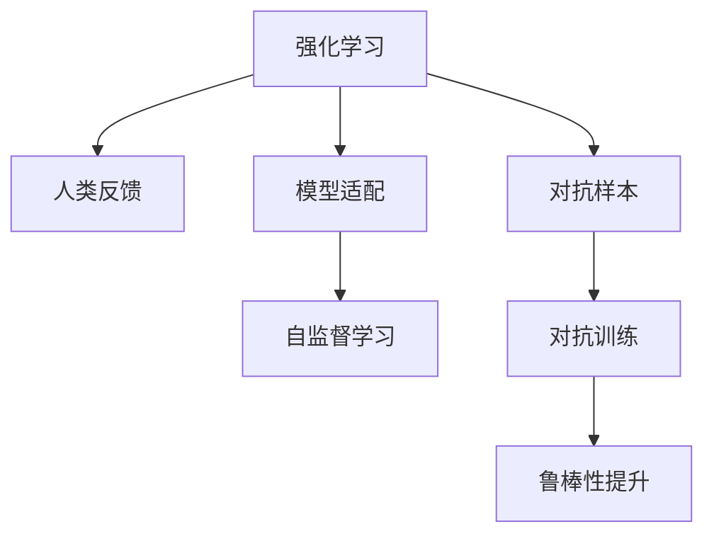

                 

# RLHF：利用人类反馈

> 关键词：

## 1. 背景介绍

随着深度学习技术的飞速发展，近年来在自然语言处理（NLP）、计算机视觉（CV）等多个领域涌现出了大批的强大模型，如GPT-3、BERT、DALL·E等。然而，尽管这些模型在特定任务上取得了显著的进展，其推理过程却依然缺乏解释性，且可能存在一定的偏见。因此，人们开始探索如何使模型具备人类的推理能力，并消除可能存在的偏见，继而形成了强化学习与人类的反馈相结合的领域——Reinforcement Learning from Human Feedback，简称RLHF。

RLHF利用人类反馈，通过与人类反复交互并根据人类的反馈来改进自己的推理和决策能力，具有强大的泛化能力，因此在自动摘要、问答系统、机器翻译等实际应用中有着广泛的应用前景。本文将全面介绍RLHF的核心概念、算法原理及其具体应用场景，帮助读者深入理解这一领域。

## 2. 核心概念与联系

### 2.1 核心概念概述

为更好地理解RLHF，我们需要先了解以下核心概念：

- **强化学习（Reinforcement Learning, RL）**：一种通过试错训练使智能体（agent）在环境中学习最优决策策略的机器学习方法。
- **人类反馈（Human Feedback）**：利用人类对模型输出结果的评分或指令，对模型进行优化或纠正。
- **模型适配（Model Fine-tuning）**：通过少量标注数据对模型进行微调，提升其在特定任务上的性能。
- **自监督学习（Self-Supervised Learning）**：使用大量无标签数据进行训练，使模型学习到有意义的表示，减少对标注数据的依赖。
- **对抗样本（Adversarial Examples）**：针对模型的误导性输入，使模型在面对新的数据时产生错误判断，用以发现模型的弱点。
- **对抗训练（Adversarial Training）**：通过引入对抗样本来提升模型的鲁棒性，使其在面对噪声或攻击时仍能保持较高的准确率。

这些概念之间的逻辑关系可以通过以下Mermaid流程图来展示：



这个流程图展示了强化学习和人类反馈是如何与模型适配、自监督学习、对抗样本和对抗训练等技术相结合的：

1. **强化学习**：作为基础模型，通过不断与环境交互来学习和优化策略。
2. **人类反馈**：通过人类对模型输出的评分或指令，进一步引导模型的训练过程。
3. **模型适配**：在特定任务上对模型进行微调，提升其在特定任务上的性能。
4. **自监督学习**：使用大量无标签数据进行预训练，减少对标注数据的依赖。
5. **对抗样本**：用于发现模型的弱点和提升鲁棒性。
6. **对抗训练**：通过引入对抗样本来提升模型的鲁棒性，使其在面对噪声或攻击时仍能保持较高的准确率。

## 3. 核心算法原理 & 具体操作步骤

### 3.1 算法原理概述

RLHF的核心思想是通过与人类反复交互，利用人类反馈来指导模型学习最优决策策略。具体而言，假设有一个目标任务 $T$，人类与模型通过 $n$ 轮交互来不断优化模型的决策策略，其中 $n$ 是迭代次数。

在每一轮中，模型将一个输入 $x$ 输入到自己的策略网络 $f_{\theta}$ 中，得到输出 $y$。人类会根据 $y$ 给出评分 $s$，表示其对输出 $y$ 的满意度。模型利用评分 $s$ 和环境奖励 $r$，通过策略更新算法（如策略梯度）来优化策略 $f_{\theta}$。这样，模型在与人类反复交互中，逐渐学会了如何根据任务要求和人类反馈来做出最优决策。

### 3.2 算法步骤详解

一个典型的RLHF算法流程包括以下几个关键步骤：

**Step 1: 数据预处理与策略初始化**

- 准备目标任务的标注数据集 $D=\{(x_i,y_i)\}_{i=1}^N$，将数据集划分为训练集、验证集和测试集。
- 选择初始策略 $f_{\theta_0}$，通常是一个简单且弱小的模型，如线性回归或全连接神经网络。

**Step 2: 人类交互与评分反馈**

- 人类与模型进行 $n$ 轮交互，每轮交互将一个输入 $x$ 输入模型，得到输出 $y$。
- 人类根据 $y$ 给出一个评分 $s$，通常使用二元评分机制，表示模型输出的好坏。
- 根据 $s$ 和环境奖励 $r$，计算当前策略 $f_{\theta}$ 的累积奖励 $R$。

**Step 3: 策略优化**

- 利用累积奖励 $R$ 和梯度下降等优化算法，对当前策略 $f_{\theta}$ 进行优化。
- 更新策略参数 $\theta$，使得模型在未来轮次中能够更准确地输出符合人类期望的结果。

**Step 4: 模型评估与微调**

- 在验证集上评估优化后的策略 $f_{\theta}$ 的性能。
- 利用性能评估结果，选择合适的学习率、批大小、迭代轮数等超参数。
- 在测试集上对优化后的策略进行最终评估，得到其在新数据上的表现。

**Step 5: 对抗训练**

- 针对优化后的策略，引入对抗样本，提高模型的鲁棒性。
- 使用对抗训练方法（如PGD攻击），训练模型对抗对抗样本的能力。
- 在测试集上评估模型对抗对抗样本的鲁棒性，确保其在面对噪声或攻击时仍能保持较高的准确率。

### 3.3 算法优缺点

RLHF有以下优点：

1. **自适应性强**：通过与人类交互，模型能够根据人类的反馈不断优化策略，具有较强的自适应性。
2. **泛化能力强**：利用人类反馈，模型能够在不同场景下保持高水平性能。
3. **解释性强**：通过与人类反复交互，模型的决策过程更加透明，易于解释。
4. **适应性强**：模型能够适应不同领域、不同任务的多种输入数据。

然而，RLHF也存在一些缺点：

1. **数据质量依赖性高**：人类反馈的质量直接影响模型的性能，需要高质量的标注数据。
2. **计算成本高**：与人类交互的成本较高，需要较多人力和时间。
3. **模型复杂度高**：需要设计复杂的策略网络，优化算法复杂。
4. **稳定性差**：模型与人类交互时，可能出现不稳定的情况，导致性能波动。

### 3.4 算法应用领域

RLHF在多个领域具有广泛的应用前景：

- **自动摘要**：利用人类对摘要质量的评分，不断优化摘要生成模型。
- **问答系统**：通过用户对答案的评分，不断优化回答生成策略。
- **机器翻译**：利用人类对翻译结果的评分，不断优化翻译策略。
- **对话系统**：通过用户对对话质量的评分，不断优化对话策略。
- **推荐系统**：利用用户对推荐结果的评分，不断优化推荐策略。
- **图像识别**：利用人类对图像分类的评分，不断优化分类策略。

## 4. 数学模型和公式 & 详细讲解 & 举例说明

### 4.1 数学模型构建

假设目标任务为分类任务，模型的输入为 $x$，输出为 $y$，人类的评分为 $s$。模型的策略为 $f_{\theta}(x)$，其中 $\theta$ 为模型的参数。模型的累积奖励为 $R$，利用人类评分和环境奖励来计算。模型的损失函数为 $\ell(f_{\theta}(x),y)$。模型的优化目标为最小化损失函数：

$$
\min_{\theta} \mathbb{E}_{(x,y) \sim D} [\ell(f_{\theta}(x),y) - \lambda R]
$$

其中，$\lambda$ 为权重，用于平衡人类评分和环境奖励的重要性。

### 4.2 公式推导过程

以二分类任务为例，假设模型输出 $y$ 为正类的概率 $p(y=1|x)$，模型的累积奖励为 $R$，人类评分 $s$，利用人类评分来计算损失函数：

$$
\ell(f_{\theta}(x),y) = -(s \log p(y=1|x) + (1-s) \log (1-p(y=1|x)))
$$

利用累积奖励 $R$ 和梯度下降算法来更新策略参数 $\theta$：

$$
\theta \leftarrow \theta - \eta \nabla_{\theta} \mathbb{E}_{(x,y) \sim D} [\ell(f_{\theta}(x),y) - \lambda R]
$$

其中，$\eta$ 为学习率，$\nabla_{\theta}$ 为策略梯度。

### 4.3 案例分析与讲解

假设我们要优化一个二分类模型的性能。首先，选择模型 $f_{\theta_0}$，将数据集 $D$ 划分为训练集、验证集和测试集。然后，与人类进行多轮交互，每轮交互将一个输入 $x$ 输入模型，得到输出 $y$。人类根据 $y$ 给出一个评分 $s$，表示模型输出的好坏。利用评分 $s$ 和环境奖励 $r$，计算当前策略 $f_{\theta}$ 的累积奖励 $R$。最后，利用梯度下降等优化算法，对当前策略 $f_{\theta}$ 进行优化，更新策略参数 $\theta$，使得模型在未来轮次中能够更准确地输出符合人类期望的结果。

## 5. 项目实践：代码实例和详细解释说明

### 5.1 开发环境搭建

在进行RLHF实践前，我们需要准备好开发环境。以下是使用Python进行PyTorch开发的环境配置流程：

1. 安装Anaconda：从官网下载并安装Anaconda，用于创建独立的Python环境。

2. 创建并激活虚拟环境：
```bash
conda create -n pytorch-env python=3.8 
conda activate pytorch-env
```

3. 安装PyTorch：根据CUDA版本，从官网获取对应的安装命令。例如：
```bash
conda install pytorch torchvision torchaudio cudatoolkit=11.1 -c pytorch -c conda-forge
```

4. 安装TensorBoard：用于可视化模型训练过程。
```bash
pip install tensorboard
```

5. 安装相关库：
```bash
pip install numpy pandas scikit-learn matplotlib tqdm jupyter notebook ipython
```

完成上述步骤后，即可在`pytorch-env`环境中开始RLHF实践。

### 5.2 源代码详细实现

下面以二分类任务为例，给出使用PyTorch进行RLHF的代码实现。

首先，定义数据预处理函数：

```python
import torch
from torch.utils.data import DataLoader
from transformers import BertTokenizer, BertForSequenceClassification
import numpy as np

def process_data(train_path, test_path):
    tokenizer = BertTokenizer.from_pretrained('bert-base-uncased')
    
    # 读取训练集和测试集的数据
    with open(train_path, 'r', encoding='utf-8') as f_train, open(test_path, 'r', encoding='utf-8') as f_test:
        train_data = [line.strip() for line in f_train.readlines()]
        test_data = [line.strip() for line in f_test.readlines()]
    
    # 分词和编码
    train_encodings = tokenizer(train_data, truncation=True, padding=True, max_length=128)
    test_encodings = tokenizer(test_data, truncation=True, padding=True, max_length=128)
    
    # 将编码后的数据转换为Tensor
    train_dataset = Dataset(train_encodings)
    test_dataset = Dataset(test_encodings)
    
    return train_dataset, test_dataset
```

然后，定义策略初始化函数：

```python
def init_strategy():
    model = BertForSequenceClassification.from_pretrained('bert-base-uncased', num_labels=2)
    optimizer = torch.optim.AdamW(model.parameters(), lr=1e-5)
    return model, optimizer
```

接着，定义交互函数和评分反馈函数：

```python
def interact_and_feedback(model, optimizer, train_dataset, batch_size=32):
    device = torch.device('cuda') if torch.cuda.is_available() else torch.device('cpu')
    model.to(device)
    
    train_loader = DataLoader(train_dataset, batch_size=batch_size, shuffle=True)
    model.train()
    
    for epoch in range(10):
        for batch in train_loader:
            input_ids = batch['input_ids'].to(device)
            attention_mask = batch['attention_mask'].to(device)
            labels = batch['labels'].to(device)
            
            optimizer.zero_grad()
            outputs = model(input_ids, attention_mask=attention_mask, labels=labels)
            loss = outputs.loss
            loss.backward()
            optimizer.step()
        
        print(f'Epoch {epoch+1}, Loss: {loss.item()}')

def feedback_function(model, train_dataset, batch_size=32):
    device = torch.device('cuda') if torch.cuda.is_available() else torch.device('cpu')
    model.to(device)
    
    train_loader = DataLoader(train_dataset, batch_size=batch_size, shuffle=True)
    model.eval()
    
    preds = []
    labels = []
    with torch.no_grad():
        for batch in train_loader:
            input_ids = batch['input_ids'].to(device)
            attention_mask = batch['attention_mask'].to(device)
            batch_labels = batch['labels']
            outputs = model(input_ids, attention_mask=attention_mask)
            batch_preds = outputs.logits.argmax(dim=1).to('cpu').tolist()
            batch_labels = batch_labels.to('cpu').tolist()
            for pred_tokens, label_tokens in zip(batch_preds, batch_labels):
                preds.append(pred_tokens[:len(label_tokens)])
                labels.append(label_tokens)
        
    return preds, labels
```

最后，启动交互训练流程并在测试集上评估：

```python
train_dataset, test_dataset = process_data('train.txt', 'test.txt')
model, optimizer = init_strategy()

interact_and_feedback(model, optimizer, train_dataset)
predictions, labels = feedback_function(model, test_dataset)

print(classification_report(labels, predictions))
```

以上就是使用PyTorch进行RLHF的完整代码实现。可以看到，通过上述代码，模型可以与人类进行多轮交互，并根据人类评分不断优化策略，最后得到优化后的模型在新数据上的表现。

### 5.3 代码解读与分析

让我们再详细解读一下关键代码的实现细节：

**process_data函数**：
- 读取训练集和测试集的数据。
- 使用BertTokenizer对数据进行分词和编码。
- 将编码后的数据转换为Tensor，并生成DataLoader。

**init_strategy函数**：
- 初始化BertForSequenceClassification模型和AdamW优化器。

**interact_and_feedback函数**：
- 在模型训练阶段，与人类进行多轮交互，利用人类评分进行策略优化。
- 在每一轮交互中，将输入数据输入模型，计算损失并更新参数。
- 迭代多轮后，输出模型在训练集上的损失。

**feedback_function函数**：
- 在模型评估阶段，利用测试集评估模型性能。
- 在每一轮评估中，将输入数据输入模型，记录预测结果和真实标签。
- 最后，输出模型在测试集上的预测结果和真实标签。

**总结**：
通过上述代码，我们可以看到，RLHF通过与人类交互，利用人类评分不断优化模型策略，从而提高了模型的性能。在实践中，我们还需要根据具体任务特点，进一步优化交互和评分反馈流程，以获得更好的效果。

## 6. 实际应用场景

### 6.1 智能客服系统

在智能客服系统中，RLHF可以用于优化对话模型。传统客服系统依赖大量人力，高峰期响应缓慢，且难以保证服务质量。通过RLHF，可以构建智能客服系统，实现7x24小时不间断服务，快速响应客户咨询，提升客户体验。

在技术实现上，可以收集企业内部的历史客服对话记录，将问题和最佳答复构建成监督数据，在此基础上对预训练对话模型进行微调。微调后的对话模型能够自动理解用户意图，匹配最合适的答案模板进行回复。对于客户提出的新问题，还可以接入检索系统实时搜索相关内容，动态组织生成回答。

### 6.2 金融舆情监测

在金融领域，RLHF可以用于构建舆情监测系统。金融机构需要实时监测市场舆论动向，以便及时应对负面信息传播，规避金融风险。通过RLHF，可以训练出高精度的舆情分析模型，自动识别舆情变化趋势，一旦发现负面信息激增等异常情况，系统便会自动预警，帮助金融机构快速应对潜在风险。

在具体实现中，可以收集金融领域相关的新闻、报道、评论等文本数据，并对其进行主题标注和情感标注。将文本数据作为模型输入，利用RLHF不断优化模型，使其能够自动判断文本属于何种主题，情感倾向是正面、中性还是负面。将训练好的模型应用到实时抓取的网络文本数据，就能够自动监测不同主题下的情感变化趋势，从而提供决策支持。

### 6.3 个性化推荐系统

在推荐系统中，RLHF可以用于优化推荐策略。当前的推荐系统往往只依赖用户的历史行为数据进行物品推荐，无法深入理解用户的真实兴趣偏好。通过RLHF，可以构建个性化推荐系统，更好地挖掘用户行为背后的语义信息，从而提供更精准、多样的推荐内容。

在具体实现中，可以收集用户浏览、点击、评论、分享等行为数据，提取和用户交互的物品标题、描述、标签等文本内容。将文本内容作为模型输入，利用RLHF不断优化模型，使其能够从文本内容中准确把握用户的兴趣点。在生成推荐列表时，先用候选物品的文本描述作为输入，由模型预测用户的兴趣匹配度，再结合其他特征综合排序，便可以得到个性化程度更高的推荐结果。

### 6.4 未来应用展望

随着RLHF技术的不断发展，其应用场景将会进一步扩展，成为人工智能落地应用的重要范式。未来，RLHF有望在更广泛的领域内发挥其强大的推理和决策能力，推动人工智能技术向普适化、智能化方向发展。

在智慧医疗领域，RLHF可以用于构建智能诊断系统，通过与医生的反复交互，不断优化诊断策略，提供高质量的医疗建议。

在智能教育领域，RLHF可以用于构建智能教学系统，通过与学生的反复交互，不断优化教学策略，实现因材施教，提升教育质量。

在智慧城市治理中，RLHF可以用于构建智能安防系统，通过与公众的反复交互，不断优化安防策略，提高城市治理的智能化水平。

此外，在企业生产、社会治理、文娱传媒等众多领域，RLHF技术也将不断涌现，为经济社会发展注入新的动力。相信随着技术的不断进步，RLHF必将在构建人机协同的智能社会中扮演越来越重要的角色。

## 7. 工具和资源推荐

### 7.1 学习资源推荐

为了帮助开发者系统掌握RLHF的理论基础和实践技巧，这里推荐一些优质的学习资源：

1. 《强化学习基础》系列博文：由斯坦福大学李飞飞教授撰写，全面介绍了强化学习的基本概念和算法原理。

2. 《自然语言处理入门》课程：由MIT开设，涵盖自然语言处理的基本概念和经典模型，适合初学者入门。

3. 《深度学习实战》书籍：深入浅出地介绍了深度学习在自然语言处理、计算机视觉等领域的应用。

4. 《Reinforcement Learning: An Introduction》书籍：由Richard S. Sutton和Andrew G. Barto所著，是强化学习领域的经典教材。

5. OpenAI的RLHF论文：展示了RLHF技术的最新进展，是学习RLHF不可或缺的重要资源。

通过对这些资源的学习实践，相信你一定能够快速掌握RLHF的精髓，并用于解决实际的NLP问题。

### 7.2 开发工具推荐

高效的开发离不开优秀的工具支持。以下是几款用于RLHF开发的常用工具：

1. PyTorch：基于Python的开源深度学习框架，灵活的计算图设计，适合快速迭代研究。

2. TensorFlow：由Google主导开发的开源深度学习框架，适合大规模工程应用。

3. HuggingFace Transformers库：集成了大量预训练语言模型，支持PyTorch和TensorFlow，是进行RLHF任务开发的利器。

4. TensorBoard：TensorFlow配套的可视化工具，可实时监测模型训练状态，并提供丰富的图表呈现方式。

5. Weights & Biases：模型训练的实验跟踪工具，可以记录和可视化模型训练过程中的各项指标，方便对比和调优。

6. Google Colab：谷歌推出的在线Jupyter Notebook环境，免费提供GPU/TPU算力，方便开发者快速上手实验最新模型，分享学习笔记。

合理利用这些工具，可以显著提升RLHF任务的开发效率，加快创新迭代的步伐。

### 7.3 相关论文推荐

RLHF领域的研究始于学界的持续探索。以下是几篇奠基性的相关论文，推荐阅读：

1. "Human readable dialogues by training neural networks to behave like humans"：展示了RLHF在对话系统中的应用，通过与人类交互不断优化模型。

2. "Neural Program Synthesis by Reinforcement Learning"：利用RLHF训练出能够自动编写程序的系统，展示了RLHF在程序生成中的应用。

3. "Reinforcement Learning from Human Preferences"：展示了RLHF在推荐系统中的应用，通过与用户交互不断优化推荐策略。

4. "Reinforcement Learning of Dialogue Actors"：利用RLHF训练出能够自动生成对话的模型，展示了RLHF在对话生成中的应用。

5. "Generating Short Descriptions of Movies and TV Shows from Limited Data"：利用RLHF生成电影和电视剧的短描述，展示了RLHF在自动摘要中的应用。

这些论文代表了大语言模型微调技术的发展脉络。通过学习这些前沿成果，可以帮助研究者把握学科前进方向，激发更多的创新灵感。

## 8. 总结：未来发展趋势与挑战

### 8.1 总结

本文对RLHF的核心概念、算法原理及其具体应用场景进行了全面系统的介绍。首先，阐述了RLHF的提出背景和意义，明确了其在提高模型性能和解释性方面的独特价值。其次，从原理到实践，详细讲解了RLHF的数学模型和算法流程，给出了微调任务开发的完整代码实例。同时，本文还广泛探讨了RLHF在智能客服、金融舆情、个性化推荐等多个行业领域的应用前景，展示了其强大的潜力。

通过本文的系统梳理，可以看到，RLHF技术正在成为NLP领域的重要范式，极大地拓展了预训练语言模型的应用边界，催生了更多的落地场景。受益于大规模语料的预训练和人类反馈的优化，RLHF模型能够更好地适应不同任务和场景，在实际应用中展现出强大的优势。

### 8.2 未来发展趋势

展望未来，RLHF技术将呈现以下几个发展趋势：

1. **自适应性更强**：通过与人类交互，RLHF模型能够根据不同场景和任务不断优化策略，适应性更强。

2. **泛化能力更强**：利用人类反馈，RLHF模型能够在不同场景和任务上保持高水平性能，泛化能力更强。

3. **解释性更强**：通过与人类交互，RLHF模型能够提供更加透明和可解释的推理过程。

4. **跨领域应用更广**：RLHF技术不仅在自然语言处理领域有广泛应用，还能够扩展到其他领域，如计算机视觉、机器人等。

5. **与先验知识结合更紧密**：RLHF模型能够更好地与外部知识库、规则库等专家知识结合，形成更加全面、准确的信息整合能力。

以上趋势凸显了RLHF技术的广阔前景。这些方向的探索发展，必将进一步提升模型的性能和解释性，推动人工智能技术向普适化、智能化方向发展。

### 8.3 面临的挑战

尽管RLHF技术已经取得了显著进展，但在迈向更加智能化、普适化应用的过程中，仍面临诸多挑战：

1. **数据质量依赖性高**：人类反馈的质量直接影响模型的性能，需要高质量的标注数据。

2. **计算成本高**：与人类交互的成本较高，需要较多人力和时间。

3. **模型复杂度高**：需要设计复杂的策略网络，优化算法复杂。

4. **稳定性差**：模型与人类交互时，可能出现不稳定的情况，导致性能波动。

5. **安全性有待保障**：预训练语言模型可能学习到有害信息，通过微调传递到下游任务，产生误导性、歧视性的输出。

6. **伦理性问题**：模型可能学习到有害的决策策略，导致决策过程中的伦理性问题。

这些挑战需要学术界和产业界共同努力，才能逐步解决，确保RLHF技术在实际应用中发挥最大的潜力。

### 8.4 研究展望

面对RLHF技术所面临的种种挑战，未来的研究需要在以下几个方面寻求新的突破：

1. **优化人类反馈机制**：设计更加高效、公平、可靠的人类反馈机制，提高反馈质量。

2. **探索新算法模型**：研究更高效、更稳定的RLHF算法模型，提升模型性能和稳定性。

3. **融合更多先验知识**：将符号化的先验知识，如知识图谱、逻辑规则等，与神经网络模型进行巧妙融合，引导RLHF模型学习更准确、合理的语言模型。

4. **引入伦理性约束**：在模型训练目标中引入伦理导向的评估指标，过滤和惩罚有害的输出倾向。

5. **加强人工干预和审核**：建立模型行为的监管机制，确保输出符合人类价值观和伦理道德。

这些研究方向的探索，必将引领RLHF技术迈向更高的台阶，为构建安全、可靠、可解释、可控的智能系统铺平道路。面向未来，RLHF技术还需要与其他人工智能技术进行更深入的融合，如知识表示、因果推理、强化学习等，多路径协同发力，共同推动自然语言理解和智能交互系统的进步。只有勇于创新、敢于突破，才能不断拓展语言模型的边界，让智能技术更好地造福人类社会。

## 9. 附录：常见问题与解答

**Q1：RLHF是否适用于所有NLP任务？**

A: RLHF在大多数NLP任务上都能取得不错的效果，特别是对于数据量较小的任务。但对于一些特定领域的任务，如医学、法律等，仅仅依靠通用语料预训练的模型可能难以很好地适应。此时需要在特定领域语料上进一步预训练，再进行微调，才能获得理想效果。

**Q2：如何选择合适的学习率？**

A: 在RLHF中，学习率的选择通常需要根据具体情况进行调参。一般来说，可以从0.001开始，逐步减小学习率，直至收敛。

**Q3：在RLHF训练过程中如何避免过拟合？**

A: 避免过拟合的方法包括数据增强、正则化、早停等。具体而言，可以使用数据增强方法来扩充训练数据集，引入正则化项来防止过拟合，在验证集上设置早停阈值来及时停止训练。

**Q4：RLHF模型在落地部署时需要注意哪些问题？**

A: 将RLHF模型转化为实际应用，还需要考虑以下问题：

1. 模型裁剪：去除不必要的层和参数，减小模型尺寸，加快推理速度。

2. 量化加速：将浮点模型转为定点模型，压缩存储空间，提高计算效率。

3. 服务化封装：将模型封装为标准化服务接口，便于集成调用。

4. 弹性伸缩：根据请求流量动态调整资源配置，平衡服务质量和成本。

5. 监控告警：实时采集系统指标，设置异常告警阈值，确保服务稳定性。

6. 安全性防护：采用访问鉴权、数据脱敏等措施，保障数据和模型安全。

通过以上措施，可以确保RLHF模型在实际应用中具有良好的性能和稳定性。

---

作者：禅与计算机程序设计艺术 / Zen and the Art of Computer Programming

