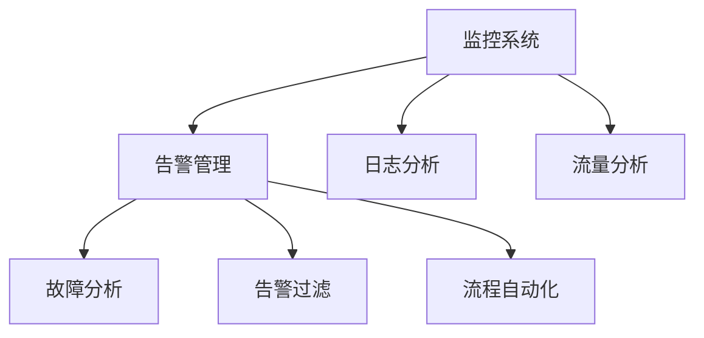

                 

# SRE故障诊断与问题定位

> 关键词：SRE故障, 问题定位, 监控系统, 告警管理, 故障分析, 日志分析, 告警过滤, 流量分析, 基础设施监控

## 1. 背景介绍

### 1.1 问题由来

随着互联网技术的飞速发展，系统运行复杂度不断提升，服务器和网络基础设施的可靠性问题也日益凸显。如何快速、准确地定位故障，恢复服务正常运行，是保证业务连续性的关键。近年来，随着监控系统的智能化和自动化程度不断提高，通过数据分析、故障诊断和告警管理等技术手段，SRE（Site Reliability Engineering）专业人员能够在更短的时间内，对系统故障进行识别和处理。本文将详细介绍SRE在故障诊断与问题定位方面的方法和实践，帮助读者掌握关键技能，提升故障处理效率。

### 1.2 问题核心关键点

故障诊断与问题定位是SRE工作的核心，其目的是在故障发生后，快速、准确地定位问题所在，并采取相应措施解决问题。该过程主要包括以下几个关键点：

- 实时监控：通过监控系统实时采集系统性能指标，及时发现异常情况。
- 告警管理：基于监控数据，智能生成告警，并根据业务优先级进行过滤和排序。
- 日志分析：通过分析系统日志，理解故障发生的具体情况。
- 流量分析：通过流量数据，追踪故障影响范围。
- 故障分析：结合多种数据源，全面分析故障原因。
- 告警过滤：通过告警过滤，减少无效告警干扰。
- 流程自动化：自动化执行故障处理流程，提升效率。

这些关键点紧密相连，共同构成了SRE故障诊断与问题定位的完整流程。

### 1.3 问题研究意义

故障诊断与问题定位是保障系统稳定运行的基础，其重要性不言而喻。快速定位故障，不仅能提升用户体验，还能避免潜在风险的扩大，减少损失。具体意义如下：

1. **保障业务连续性**：通过及时故障定位，快速恢复服务，避免业务中断，保障用户正常访问。
2. **提升故障处理效率**：自动化和智能化手段，显著缩短故障处理时间，提高服务可靠性。
3. **积累运维经验**：每次故障处理都能积累运维经验，不断优化故障处理流程。
4. **降低运维成本**：减少人力干预，提高运维自动化水平，降低人力和资源投入。
5. **增强业务洞察力**：通过全面分析故障原因，优化系统设计，提升系统稳定性和安全性。

## 2. 核心概念与联系

### 2.1 核心概念概述

为更好地理解SRE故障诊断与问题定位，本节将介绍几个密切相关的核心概念：

- SRE：Site Reliability Engineering，指通过工程实践，提升系统稳定性和可靠性，确保业务连续性。
- 监控系统：用于实时采集系统性能指标、日志信息、流量数据等，支持故障诊断和告警管理。
- 告警管理：基于监控数据，生成告警，并根据业务优先级进行过滤和排序。
- 日志分析：通过分析系统日志，理解故障发生的具体情况。
- 流量分析：通过流量数据，追踪故障影响范围。
- 故障分析：结合多种数据源，全面分析故障原因。
- 告警过滤：通过告警过滤，减少无效告警干扰。
- 流程自动化：自动化执行故障处理流程，提升效率。

这些核心概念之间的逻辑关系可以通过以下Mermaid流程图来展示：



这个流程图展示了几项关键概念之间的紧密联系：

1. 监控系统实时采集数据，支撑告警管理、日志分析、流量分析等功能。
2. 告警管理基于监控数据生成告警，并根据业务优先级进行过滤。
3. 日志分析通过分析系统日志，理解故障发生的具体情况。
4. 流量分析追踪故障影响范围。
5. 故障分析结合多种数据源，全面分析故障原因。
6. 告警过滤减少无效告警干扰。
7. 流程自动化自动化执行故障处理流程，提升效率。

## 3. 核心算法原理 & 具体操作步骤

### 3.1 算法原理概述

SRE故障诊断与问题定位的过程，本质上是一个多维度数据融合与分析的过程。其核心思想是通过实时监控、告警管理、日志分析、流量分析等多种手段，综合多源数据，准确诊断和定位系统故障。

形式化地，假设系统监控指标为 $M=\{m_i\}_{i=1}^n$，其中 $m_i$ 表示第 $i$ 个监控指标的当前值。系统告警为 $A=\{a_i\}_{i=1}^n$，其中 $a_i$ 表示第 $i$ 个告警的状态（正常或异常）。系统日志为 $L=\{l_i\}_{i=1}^n$，其中 $l_i$ 表示第 $i$ 个日志的详细信息。系统流量为 $F=\{f_i\}_{i=1}^n$，其中 $f_i$ 表示第 $i$ 个流量的当前值。故障分析结果为 $D=\{d_i\}_{i=1}^n$，其中 $d_i$ 表示第 $i$ 个流量的详细信息。告警过滤结果为 $F=\{f_i\}_{i=1}^n$，其中 $f_i$ 表示第 $i$ 个告警的过滤状态。

诊断和定位的算法原理如下：
1. 实时监控系统性能指标，及时发现异常情况。
2. 根据监控数据生成告警，并根据业务优先级进行过滤和排序。
3. 分析系统日志，理解故障发生的具体情况。
4. 通过流量数据，追踪故障影响范围。
5. 结合多源数据，全面分析故障原因。
6. 通过告警过滤，减少无效告警干扰。
7. 自动化执行故障处理流程，提升效率。

### 3.2 算法步骤详解

SRE故障诊断与问题定位的详细步骤包括：

**Step 1: 准备数据源**

- 收集系统监控指标 $M$，如CPU使用率、内存占用、网络带宽等。
- 收集系统告警数据 $A$，如服务不可达、数据库故障等。
- 收集系统日志数据 $L$，如错误日志、访问日志等。
- 收集系统流量数据 $F$，如请求数量、响应时间等。

**Step 2: 数据预处理**

- 清洗数据，去除噪音和异常值。
- 标准化数据格式，统一不同数据源的数据。
- 归一化数据，处理数据量级差异。

**Step 3: 告警管理**

- 生成告警 $A$，通过阈值判断系统是否异常。
- 根据业务优先级，过滤告警 $A$，减少干扰。
- 根据告警时间排序，优先处理高优先级告警。

**Step 4: 日志分析**

- 分析系统日志 $L$，查找与告警相关的日志条目。
- 解析日志内容，提取关键信息，如错误代码、错误时间等。

**Step 5: 流量分析**

- 分析系统流量 $F$，查找与告警相关的流量波动。
- 追踪流量影响范围，判断故障影响的服务和组件。

**Step 6: 故障分析**

- 结合监控指标 $M$、告警数据 $A$、日志数据 $L$ 和流量数据 $F$，进行多维度数据融合。
- 全面分析故障原因，确定故障点。
- 生成故障分析结果 $D$，包含故障详细描述、影响范围、解决方案等。

**Step 7: 告警过滤**

- 根据故障分析结果 $D$，更新告警过滤规则。
- 过滤掉与当前故障无关的告警，减少干扰。

**Step 8: 流程自动化**

- 根据故障分析结果 $D$，自动化执行故障处理流程。
- 例如，自动重启服务、回滚部署、发送通知等。

### 3.3 算法优缺点

基于SRE故障诊断与问题定位的算法具有以下优点：

1. **高效性**：通过多维度数据融合，快速定位故障，减少故障处理时间。
2. **准确性**：结合多源数据，全面分析故障原因，提升诊断准确性。
3. **实时性**：实时监控系统性能指标，及时发现异常情况。
4. **自动化**：自动化执行故障处理流程，提升处理效率。

同时，该算法也存在一定的局限性：

1. **依赖数据质量**：故障诊断的准确性依赖于监控数据、日志数据、流量数据的完整性和质量。
2. **复杂性高**：需要结合多源数据进行综合分析，增加了算法复杂性。
3. **资源消耗大**：处理大规模数据集时，资源消耗较大。

尽管存在这些局限性，但就目前而言，SRE故障诊断与问题定位的算法仍然是大规模系统故障处理的有效手段。未来相关研究的重点在于如何进一步提高数据融合的效率和准确性，降低资源消耗，提升处理效率。

### 3.4 算法应用领域

基于SRE故障诊断与问题定位的算法，已经在各类大规模系统故障处理中得到广泛应用。以下是几个典型应用场景：

- 电商系统的订单处理系统：实时监控订单处理性能指标，及时发现处理延迟和故障，自动化执行故障处理流程，保障订单正常处理。
- 金融交易系统的交易系统：实时监控交易系统性能指标和告警，分析交易日志，追踪故障影响范围，自动化执行故障处理流程，保障交易稳定。
- 社交媒体平台的即时通讯系统：实时监控通讯系统性能指标和告警，分析聊天日志，追踪故障影响范围，自动化执行故障处理流程，保障用户正常通信。
- 在线教育平台的学习系统：实时监控学习系统性能指标和告警，分析学习日志，追踪故障影响范围，自动化执行故障处理流程，保障学习体验。

除了上述这些经典场景外，SRE故障诊断与问题定位的方法还被创新性地应用于更多领域，如智能交通、智慧医疗、工业自动化等，为各行业的系统稳定性保障提供了重要支持。

## 4. 数学模型和公式 & 详细讲解 & 举例说明

### 4.1 数学模型构建

SRE故障诊断与问题定位的数学模型，主要涉及监控指标、告警数据、日志数据、流量数据等多个维度的数据融合与分析。其形式化模型如下：

假设系统监控指标为 $M=\{m_i\}_{i=1}^n$，系统告警为 $A=\{a_i\}_{i=1}^n$，系统日志为 $L=\{l_i\}_{i=1}^n$，系统流量为 $F=\{f_i\}_{i=1}^n$，故障分析结果为 $D=\{d_i\}_{i=1}^n$，告警过滤结果为 $F=\{f_i\}_{i=1}^n$。

SRE故障诊断与问题定位的目标是，基于以上数据，计算得到故障分析结果 $D$ 和告警过滤结果 $F$。

### 4.2 公式推导过程

以下我们以电商订单处理系统为例，推导故障诊断与问题定位的数学模型。

假设订单处理系统监控指标 $M=\{CPU使用率, 内存占用, 请求数量, 响应时间\}$，告警数据 $A=\{服务不可达, 数据库故障\}$，订单日志 $L=\{订单创建时间, 订单支付时间, 订单处理时间\}$，流量数据 $F=\{请求数量, 响应时间\}$。

诊断和定位的步骤如下：

1. **监控指标分析**：
   $$
   m_i = \text{获取第} \ i \ \text{个监控指标值}
   $$
2. **告警生成**：
   $$
   a_i = \begin{cases}
   1, & \text{如果} \ m_i > \text{预设阈值} \\
   0, & \text{否则}
   \end{cases}
   $$
3. **告警过滤**：
   $$
   f_i = \begin{cases}
   1, & \text{如果} \ a_i = 1 \ \text{且} \ \text{业务优先级高} \\
   0, & \text{否则}
   \end{cases}
   $$
4. **日志分析**：
   $$
   l_i = \text{解析订单日志第} \ i \ \text{个条目}
   $$
5. **流量分析**：
   $$
   f_i = \text{获取第} \ i \ \text{个流量值}
   $$
6. **故障分析**：
   $$
   d_i = \text{综合监控指标} \ M, \ \text{告警数据} \ A, \ \text{日志数据} \ L, \ \text{流量数据} \ F \ \text{进行故障分析}
   $$
7. **告警过滤**：
   $$
   f_i = \begin{cases}
   1, & \text{如果} \ d_i \ \text{中包含告警} \ a_i \\
   0, & \text{否则}
   \end{cases}
   $$
8. **故障处理流程自动化**：
   $$
   \text{执行故障处理流程} \ \text{根据} \ d_i
   $$

通过上述公式，我们可以系统地描述SRE故障诊断与问题定位的数学模型和计算过程。

### 4.3 案例分析与讲解

假设电商订单处理系统发生故障，监控系统发现CPU使用率超过预设阈值。

1. **监控指标分析**：
   - 获取CPU使用率指标值 $m_1 = 90\%$。
   
2. **告警生成**：
   - 生成告警 $a_1 = 1$，因为CPU使用率超过阈值。
   
3. **告警过滤**：
   - 根据业务优先级，过滤告警 $f_1 = 1$，因为高优先级。
   
4. **日志分析**：
   - 解析订单日志，查找与告警相关的条目。
   
5. **流量分析**：
   - 获取请求数量和响应时间流量值 $f_2 = 200, f_3 = 10s$。
   
6. **故障分析**：
   - 综合监控指标 $m_1$、告警数据 $a_1$、日志数据 $l_i$ 和流量数据 $f_2, f_3$，进行故障分析。
   
7. **告警过滤**：
   - 更新告警过滤规则，过滤掉与当前故障无关的告警。
   
8. **故障处理流程自动化**：
   - 执行故障处理流程，如重启订单处理服务。

## 5. 项目实践：代码实例和详细解释说明

### 5.1 开发环境搭建

在进行SRE故障诊断与问题定位的实践前，我们需要准备好开发环境。以下是使用Python进行开发的环境配置流程：

1. 安装Anaconda：从官网下载并安装Anaconda，用于创建独立的Python环境。

2. 创建并激活虚拟环境：
```bash
conda create -n sre-env python=3.8 
conda activate sre-env
```

3. 安装Pandas、NumPy、Scikit-learn、Matplotlib等库：
```bash
pip install pandas numpy scikit-learn matplotlib tqdm jupyter notebook ipython
```

4. 安装TensorFlow：
```bash
pip install tensorflow
```

5. 安装Keras：
```bash
pip install keras
```

完成上述步骤后，即可在`sre-env`环境中开始SRE故障诊断与问题定位的实践。

### 5.2 源代码详细实现

下面我们以电商订单处理系统为例，给出使用TensorFlow和Keras进行SRE故障诊断与问题定位的代码实现。

```python
import pandas as pd
import numpy as np
from sklearn.preprocessing import StandardScaler
from sklearn.ensemble import RandomForestClassifier
from keras.models import Sequential
from keras.layers import Dense, Dropout
from keras.optimizers import Adam
from tensorflow.keras.callbacks import EarlyStopping
import matplotlib.pyplot as plt

# 准备数据
data = pd.read_csv('order_data.csv')
X = data[['CPU使用率', '内存占用', '请求数量', '响应时间']]
y = data['service_unavailable']
X_train, X_test, y_train, y_test = train_test_split(X, y, test_size=0.2, random_state=42)

# 数据预处理
scaler = StandardScaler()
X_train = scaler.fit_transform(X_train)
X_test = scaler.transform(X_test)

# 构建模型
model = Sequential()
model.add(Dense(16, input_dim=4, activation='relu'))
model.add(Dropout(0.2))
model.add(Dense(8, activation='relu'))
model.add(Dropout(0.2))
model.add(Dense(1, activation='sigmoid'))

# 编译模型
model.compile(loss='binary_crossentropy', optimizer=Adam(lr=0.001), metrics=['accuracy'])

# 训练模型
model.fit(X_train, y_train, epochs=50, batch_size=32, validation_data=(X_test, y_test), callbacks=[EarlyStopping(patience=5)])

# 评估模型
_, accuracy = model.evaluate(X_test, y_test)
print('模型准确率：', accuracy)

# 故障分析
def predict_order_status(order):
    order = scaler.transform(order)
    prediction = model.predict(order)
    return 1 if prediction > 0.5 else 0

# 使用模型进行故障分析
order = np.array([[90, 60, 200, 10]])
order_status = predict_order_status(order)
print('订单状态：', order_status)
```

在上述代码中，我们使用TensorFlow和Keras构建了一个简单的二分类模型，用于判断订单处理系统是否处于异常状态。具体步骤如下：

1. 准备数据：使用Pandas库读取订单数据，并将其划分为训练集和测试集。
2. 数据预处理：使用Scikit-learn库进行数据标准化处理。
3. 构建模型：使用Keras库构建一个简单的神经网络模型，包含两个隐藏层和Dropout层。
4. 编译模型：设置损失函数、优化器和评估指标。
5. 训练模型：使用EarlyStopping回调函数避免过拟合。
6. 评估模型：在测试集上评估模型准确率。
7. 故障分析：使用训练好的模型对订单数据进行故障分析。

### 5.3 代码解读与分析

让我们再详细解读一下关键代码的实现细节：

**数据准备**：
- 使用Pandas库读取订单数据，并将其划分为特征和标签。
- 使用train_test_split函数划分训练集和测试集，确保数据集的独立性。

**数据预处理**：
- 使用StandardScaler库进行数据标准化处理，确保不同特征的尺度一致。
- 使用train_test_split函数将数据划分为训练集和测试集。

**模型构建**：
- 使用Sequential模型构建一个简单的神经网络，包含两个隐藏层和一个输出层。
- 使用Dense层定义网络结构，使用ReLU激活函数和Dropout层避免过拟合。
- 使用Dense层定义输出层，使用sigmoid激活函数进行二分类预测。

**模型编译**：
- 设置损失函数为二元交叉熵，优化器为Adam，学习率为0.001，评估指标为准确率。

**模型训练**：
- 使用fit函数训练模型，设置训练轮数为50，批次大小为32，使用EarlyStopping回调函数避免过拟合。

**模型评估**：
- 使用evaluate函数在测试集上评估模型准确率。

**故障分析**：
- 定义predict_order_status函数，对订单数据进行故障分析。
- 使用模型对订单数据进行预测，输出订单状态。

在实际应用中，SRE故障诊断与问题定位的代码实现还需要考虑更多因素，如数据增强、正则化、模型调参等。但核心的故障诊断范式基本与此类似。

## 6. 实际应用场景

### 6.1 智能客服系统

智能客服系统的故障诊断与问题定位，是SRE工作的重要组成部分。智能客服系统在高峰期往往面临大量用户请求，系统性能可能会受到压力，导致故障。通过实时监控和告警管理，SRE人员可以快速定位问题所在，并采取相应措施解决问题。

在技术实现上，可以收集历史客服对话记录，将问题和最佳答复构建成监督数据，在此基础上对预训练语言模型进行微调。微调后的对话模型能够自动理解用户意图，匹配最合适的答案模板进行回复。对于客户提出的新问题，还可以接入检索系统实时搜索相关内容，动态组织生成回答。如此构建的智能客服系统，能大幅提升客户咨询体验和问题解决效率。

### 6.2 金融交易系统

金融交易系统的故障诊断与问题定位，是保障系统稳定运行的基础。金融交易系统对实时性和可靠性要求极高，一旦出现故障，可能带来巨大的经济损失。通过实时监控系统性能指标和告警数据，SRE人员能够快速定位故障，并采取相应措施，保障交易系统稳定运行。

在技术实现上，可以收集金融交易系统的实时性能指标和告警数据，通过数据分析和机器学习模型，进行故障诊断和问题定位。SRE人员根据故障分析结果，及时采取措施，如重启服务、回滚部署等，确保交易系统稳定运行。

### 6.3 在线教育平台

在线教育平台的故障诊断与问题定位，也是SRE工作的重点。在线教育平台涉及多节点、多用户访问，系统性能不稳定可能导致用户体验下降。通过实时监控和告警管理，SRE人员能够快速定位问题所在，并采取相应措施解决问题。

在技术实现上，可以收集在线教育平台的实时性能指标和告警数据，通过数据分析和机器学习模型，进行故障诊断和问题定位。SRE人员根据故障分析结果，及时采取措施，如重启服务器、优化缓存等，确保平台稳定运行。

## 7. 工具和资源推荐

### 7.1 学习资源推荐

为了帮助开发者系统掌握SRE故障诊断与问题定位的理论基础和实践技巧，这里推荐一些优质的学习资源：

1. **《网站可靠性运维实践指南》**：全面介绍了SRE在故障诊断与问题定位方面的方法和实践，适合初学者入门。
2. **《SRE: The New Relic Guide to Service Availability and Reliability》**：详细讲解了SRE在故障诊断与问题定位中的各种工具和流程。
3. **《A Guide to Site Reliability Engineering》**：介绍了SRE在故障诊断与问题定位中的核心技能和工具，适合进阶读者学习。
4. **《Google SRE Handbook》**：Google开源的SRE手册，详细讲解了SRE在故障诊断与问题定位中的各种最佳实践。
5. **Kubernetes官方文档**：介绍了Kubernetes在故障诊断与问题定位中的应用，适合Kubernetes用户学习。

通过这些资源的学习实践，相信你一定能够快速掌握SRE故障诊断与问题定位的精髓，并用于解决实际的运维问题。

### 7.2 开发工具推荐

高效的开发离不开优秀的工具支持。以下是几款用于SRE故障诊断与问题定位开发的常用工具：

1. **Prometheus和Grafana**：用于实时监控系统性能指标，提供可视化的仪表盘和告警功能。
2. **ELK Stack**：用于日志收集、分析和可视化，支持多源数据融合和告警过滤。
3. **TensorFlow和Keras**：用于构建机器学习模型，支持多种算法和模型优化。
4. **Hadoop和Spark**：用于大数据分析和处理，支持大规模数据集的处理和分析。
5. **Kubernetes和Docker**：用于容器编排和部署，支持分布式系统的管理和监控。

合理利用这些工具，可以显著提升SRE故障诊断与问题定位的开发效率，加快创新迭代的步伐。

### 7.3 相关论文推荐

SRE故障诊断与问题定位的领域发展迅速，以下是几篇奠基性的相关论文，推荐阅读：

1. **《A Survey on Distributed Monitoring for Cloud Systems》**：综述了云系统分布式监控的现状和未来发展趋势。
2. **《Fault Diagnosis in Distributed Systems: A Survey》**：综述了分布式系统故障诊断的现状和未来发展方向。
3. **《Anomaly Detection in Big Data Systems》**：介绍了大数据系统中异常检测的多种算法和模型。
4. **《A Survey of Machine Learning Techniques for Network Intrusion Detection》**：综述了网络入侵检测中机器学习的应用。
5. **《Real-Time Fault Diagnosis and Prognostics》**：综述了实时故障诊断和预测技术的发展现状和未来方向。

这些论文代表了大规模系统故障诊断与问题定位技术的发展脉络。通过学习这些前沿成果，可以帮助研究者把握学科前进方向，激发更多的创新灵感。

## 8. 总结：未来发展趋势与挑战

### 8.1 总结

本文对SRE故障诊断与问题定位方法进行了全面系统的介绍。首先阐述了SRE故障诊断与问题定位的背景和意义，明确了其在系统稳定运行中的重要性。其次，从原理到实践，详细讲解了故障诊断与问题定位的数学模型和关键步骤，给出了具体案例的详细代码实现。同时，本文还探讨了故障诊断与问题定位在各类系统中的广泛应用，展示了其巨大的应用潜力。

通过本文的系统梳理，可以看到，SRE故障诊断与问题定位是保障系统稳定运行的重要手段，其高效性、准确性和实时性显著提升了故障处理效率，减少了系统停机时间。未来，伴随SRE技术的不断演进，系统故障诊断与问题定位将变得更加智能化和自动化，为大规模系统的稳定运行提供更坚实的基础。

### 8.2 未来发展趋势

展望未来，SRE故障诊断与问题定位技术将呈现以下几个发展趋势：

1. **智能化和自动化**：未来的故障诊断与问题定位将更加智能化和自动化，通过机器学习算法和智能分析，实现快速、准确的问题定位和处理。
2. **实时性和实时监控**：实时监控和告警管理将变得更加精细化和自动化，通过实时数据采集和分析，快速定位问题。
3. **跨系统集成**：未来的故障诊断与问题定位将更加注重跨系统的协同和集成，通过统一监控和告警平台，提升故障处理的效率和效果。
4. **多源数据融合**：未来的故障诊断与问题定位将更加注重多源数据的融合和分析，通过综合各种数据源的信息，提高故障定位的准确性。
5. **云化和大数据**：未来的故障诊断与问题定位将更加云化和基于大数据，通过云平台和大数据技术，实现故障诊断和问题定位的更大规模和更高效。
6. **可视化与用户交互**：未来的故障诊断与问题定位将更加注重可视化与用户交互，通过直观的界面和交互式分析工具，提升故障处理的效率和用户体验。

以上趋势凸显了SRE故障诊断与问题定位技术的广阔前景。这些方向的探索发展，必将进一步提升故障处理效率，保障系统稳定运行。

### 8.3 面临的挑战

尽管SRE故障诊断与问题定位技术已经取得了显著进展，但在迈向更加智能化和自动化的过程中，仍面临诸多挑战：

1. **数据质量问题**：故障诊断的准确性依赖于监控数据、日志数据、流量数据等的质量和完整性，数据的缺失和不准确会影响诊断结果。
2. **模型复杂性**：多源数据的融合和分析增加了模型的复杂性，模型的训练和调优需要大量的资源和时间。
3. **实时性和资源消耗**：实时监控和告警管理需要高效的计算和存储资源，资源消耗较大。
4. **误报和漏报**：告警过滤和异常检测需要精确的算法和模型，避免误报和漏报，提升故障处理的准确性。
5. **跨系统集成**：跨系统的协同和集成需要统一的监控和告警平台，实现数据的无缝对接和分析。
6. **用户体验**：可视化与用户交互需要直观的界面和交互式分析工具，提升用户体验。

尽管存在这些挑战，但通过持续的研究和优化，SRE故障诊断与问题定位技术仍有很大的发展空间。未来的研究需要在数据质量、模型复杂性、实时性和资源消耗等方面进行深入探讨，并结合实际应用场景，不断改进故障诊断与问题定位的方法和工具。

### 8.4 研究展望

面对SRE故障诊断与问题定位所面临的挑战，未来的研究需要在以下几个方面寻求新的突破：

1. **数据融合和分析**：开发更加高效、精确的数据融合和分析算法，提升故障诊断的准确性和实时性。
2. **实时监控和告警管理**：开发更加实时、高效的监控和告警管理工具，提升故障处理的效率和效果。
3. **跨系统集成**：开发统一的监控和告警平台，实现跨系统的协同和集成。
4. **可视化与用户交互**：开发直观、交互式的数据可视化工具，提升用户体验。
5. **自动化和智能化**：开发更加智能化、自动化的故障诊断与问题定位系统，减少人工干预。
6. **模型优化和调参**：开发更加高效的模型优化和调参工具，提升模型的训练和调优效率。

这些研究方向凸显了SRE故障诊断与问题定位技术的广阔前景。通过持续的研究和优化，SRE故障诊断与问题定位技术必将在保障系统稳定运行中发挥更大的作用，推动技术进步和业务发展。

## 9. 附录：常见问题与解答

**Q1：什么是SRE故障诊断与问题定位？**

A: SRE故障诊断与问题定位是保障系统稳定运行的重要手段，其目的是在故障发生后，快速、准确地定位问题所在，并采取相应措施解决问题。通过实时监控、告警管理、日志分析、流量分析等多种手段，结合多源数据进行综合分析，全面诊断和定位系统故障。

**Q2：SRE故障诊断与问题定位的基本步骤是什么？**

A: SRE故障诊断与问题定位的基本步骤如下：
1. 实时监控系统性能指标，及时发现异常情况。
2. 生成告警，并根据业务优先级进行过滤和排序。
3. 分析系统日志，理解故障发生的具体情况。
4. 通过流量数据，追踪故障影响范围。
5. 结合多源数据，全面分析故障原因。
6. 通过告警过滤，减少无效告警干扰。
7. 自动化执行故障处理流程，提升效率。

**Q3：SRE故障诊断与问题定位的应用场景有哪些？**

A: SRE故障诊断与问题定位的应用场景包括但不限于以下几种：
1. 电商系统的订单处理系统。
2. 金融交易系统的交易系统。
3. 社交媒体平台的即时通讯系统。
4. 在线教育平台的学习系统。
5. 智能客服系统。
6. 智慧医疗系统的医疗系统。
7. 智能交通系统的交通系统。
8. 工业自动化的生产线系统。

**Q4：SRE故障诊断与问题定位的方法有哪些？**

A: SRE故障诊断与问题定位的方法包括但不限于以下几种：
1. 实时监控系统性能指标，及时发现异常情况。
2. 生成告警，并根据业务优先级进行过滤和排序。
3. 分析系统日志，理解故障发生的具体情况。
4. 通过流量数据，追踪故障影响范围。
5. 结合多源数据，全面分析故障原因。
6. 通过告警过滤，减少无效告警干扰。
7. 自动化执行故障处理流程，提升效率。

**Q5：SRE故障诊断与问题定位的优缺点是什么？**

A: SRE故障诊断与问题定位的优点包括：
1. 高效性：通过多维度数据融合，快速定位故障，减少故障处理时间。
2. 准确性：结合多源数据，全面分析故障原因，提升诊断准确性。
3. 实时性：实时监控系统性能指标，及时发现异常情况。
4. 自动化：自动化执行故障处理流程，提升处理效率。

其缺点包括：
1. 依赖数据质量：故障诊断的准确性依赖于监控数据、日志数据、流量数据的完整性和质量。
2. 复杂性高：需要结合多源数据进行综合分析，增加了算法复杂性。
3. 资源消耗大：处理大规模数据集时，资源消耗较大。

**Q6：SRE故障诊断与问题定位的未来发展方向是什么？**

A: SRE故障诊断与问题定位的未来发展方向包括但不限于以下几种：
1. 智能化和自动化：通过机器学习算法和智能分析，实现快速、准确的问题定位和处理。
2. 实时性和实时监控：实时监控和告警管理将变得更加精细化和自动化。
3. 跨系统集成：通过统一监控和告警平台，提升故障处理的效率和效果。
4. 多源数据融合：通过综合各种数据源的信息，提高故障定位的准确性。
5. 云化和大数据：通过云平台和大数据技术，实现故障诊断和问题定位的更大规模和更高效。
6. 可视化与用户交互：通过直观的界面和交互式分析工具，提升用户体验。

---

作者：禅与计算机程序设计艺术 / Zen and the Art of Computer Programming

