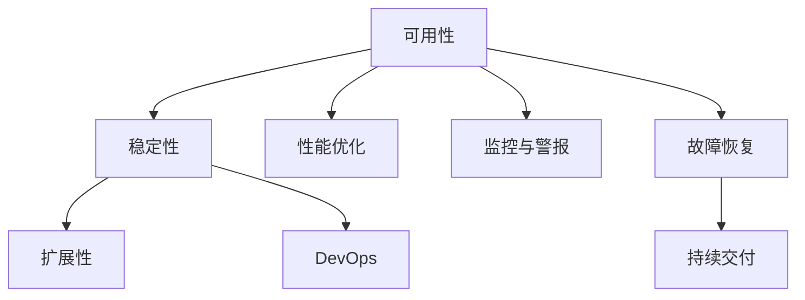

                 

# SRE（站点可靠性工程）：确保大规模系统的可靠性

> 关键词：SRE, 站点可靠性, 大规模系统, 可用性, 稳定性和扩展性, 监控和警报, 故障恢复, DevOps, 云原生

## 1. 背景介绍

### 1.1 问题由来
在当今数字化经济时代，企业通过构建大规模系统来驱动业务增长。这些系统包括网站、移动应用、云计算平台、微服务架构等。由于用户数量不断增长，对系统性能、可用性和扩展性的要求日益增加，系统的可靠性维护变得越来越重要。

在系统规模日益增长的背景下，传统的IT运维方式已经无法满足现代业务对系统可靠性日益增长的需求。SRE（站点可靠性工程）正是在这一背景下应运而生的一种新兴的运维范式，旨在通过工程手段提升系统可靠性，实现业务价值最大化。

### 1.2 问题核心关键点
SRE的核心目标是通过系统设计和运维实践，提高系统的可用性、稳定性和扩展性。它关注系统设计的可靠性与可用性，并通过工程手段解决系统的可扩展性、故障恢复和持续交付等问题，确保业务连续性和服务质量。

在实践中，SRE工程师常常需要平衡业务需求和技术实现之间的冲突，确保在确保可靠性的同时，提供高性能、低延迟、高效的服务。SRE涉及的技术领域广泛，包括分布式系统设计、故障排除、性能优化、自动运维、监控与警报等。

### 1.3 问题研究意义
SRE的引入有助于企业更好地应对技术复杂性，提升系统可靠性和用户体验，并降低运维成本。具体而言：

1. **提升可用性**：SRE通过系统设计和运维实践，确保系统在高负载、高并发情况下依然能够稳定运行，减少系统故障和宕机时间。
2. **提高稳定性**：SRE通过自动化的运维工具和流程，减少了人为操作带来的风险，提升了系统稳定性。
3. **实现扩展性**：SRE通过设计和实现弹性的系统架构，确保系统能够灵活应对业务需求的变化，快速扩展或缩减资源。
4. **优化性能**：SRE通过性能监控和优化，确保系统在高并发场景下依然能够提供稳定、快速的响应。
5. **降低成本**：SRE通过自动化工具和流程，减少了人工运维成本，提高了效率和准确性。

## 2. 核心概念与联系

### 2.1 核心概念概述

SRE涉及的关键概念包括：

- **可用性**：系统在高负载情况下依然能够正常工作的能力。
- **稳定性**：系统在各种异常情况下保持正常运行的能力。
- **扩展性**：系统能够适应业务需求变化，灵活扩展资源的能力。
- **性能优化**：通过技术手段提升系统响应速度、降低延迟。
- **监控与警报**：实时监控系统状态，及时发现并预警潜在问题。
- **故障恢复**：在系统发生故障时，快速恢复系统正常运行。
- **DevOps文化**：强调开发与运维的紧密协作，提高交付速度和质量。

这些概念通过系统设计、运维实践和自动化工具相结合，共同构成了SRE的理论基础和实践框架。

### 2.2 核心概念原理和架构的 Mermaid 流程图(Mermaid 流程节点中不要有括号、逗号等特殊字符)



## 3. 核心算法原理 & 具体操作步骤

### 3.1 算法原理概述

SRE通过系统设计和运维实践，实现系统的高可用性、稳定性和扩展性。其核心算法原理可以归纳为以下几个方面：

- **分布式系统设计**：通过设计和实现分布式架构，确保系统的高可用性和扩展性。
- **容错设计**：通过冗余、负载均衡、自动恢复等机制，确保系统在故障情况下依然能够正常工作。
- **性能优化**：通过缓存、负载均衡、水平扩展等技术手段，提升系统响应速度和吞吐量。
- **故障排除与恢复**：通过监控、日志分析、故障切换等手段，及时发现并修复系统故障，实现快速恢复。

### 3.2 算法步骤详解

SRE的算法步骤通常包括以下几个关键环节：

**Step 1: 系统设计**

- 确定系统架构：选择合适的技术栈和架构模式，如微服务、云原生等。
- 设计数据流：明确数据流的路由和处理逻辑，确保数据一致性和可靠性。
- 定义接口规范：制定接口标准和协议，确保系统组件之间的互操作性。

**Step 2: 性能优化**

- 缓存策略：设计合理的缓存机制，减少数据库访问和计算开销。
- 负载均衡：实现分布式请求负载均衡，提升系统吞吐量。
- 水平扩展：通过增加节点数量提升系统处理能力。

**Step 3: 监控与警报**

- 实时监控：通过日志、指标和事件收集系统状态数据。
- 告警机制：定义告警阈值，触发告警通知。
- 数据分析：使用机器学习等技术，分析历史数据，发现潜在的性能瓶颈和故障模式。

**Step 4: 故障恢复**

- 自动化故障恢复：设计自动化故障切换和恢复流程，确保系统快速恢复正常运行。
- 备份与冗余：实现数据备份和系统冗余，避免单点故障。
- 故障演练：定期进行故障演练，检验故障恢复流程的有效性。

**Step 5: 持续交付**

- 自动化运维：通过自动化工具实现代码发布、配置变更和运维操作。
- 持续集成与交付：建立持续集成和持续交付流水线，确保高质量的代码交付。
- DevOps文化：推动开发和运维的紧密协作，提升交付效率和质量。

### 3.3 算法优缺点

SRE的优点在于：

- 提升系统可靠性：通过系统设计和运维实践，提升系统的可用性、稳定性和扩展性。
- 降低运维成本：通过自动化工具和流程，减少人工操作，提高运维效率和准确性。
- 提高业务连续性：通过故障排除和快速恢复机制，确保业务连续性。

其缺点包括：

- 技术复杂性：设计和实现分布式系统、高可用性架构等需要高水平的技术能力。
- 资源消耗：高可用性和扩展性通常需要额外的硬件资源和计算资源。
- 成本投入：SRE需要投入大量人力和时间进行系统设计和运维实践。

### 3.4 算法应用领域

SRE广泛应用于各类大规模系统的设计和运维中，包括：

- **云计算平台**：确保云服务的高可用性和稳定性，处理大量并发请求。
- **微服务架构**：通过分布式设计和自动化运维，提升系统的扩展性和可靠性。
- **移动应用**：实现跨平台、高可用性、高扩展性的移动应用。
- **分布式系统**：设计和实现分布式数据流、缓存和负载均衡等机制。
- **物联网设备**：确保物联网设备网络的可靠性和数据传输的稳定性。
- **人工智能系统**：通过高可用性设计和自动化运维，支持大规模数据处理和模型训练。

## 4. 数学模型和公式 & 详细讲解

### 4.1 数学模型构建

在SRE中，我们通常使用以下数学模型来描述系统的可靠性和性能指标：

- **可用性(Availability)**：系统在高负载情况下能够正常工作的比例，通常表示为 $A = 1 - F(t)$，其中 $F(t)$ 是系统在时间 $t$ 内的故障率。
- **稳定性(Dependability)**：系统在各种异常情况下保持正常运行的能力，通常表示为 $D = e^{-\lambda t}$，其中 $\lambda$ 是系统的平均故障率。
- **扩展性(Scalability)**：系统能够适应业务需求变化，扩展资源的能力，通常表示为 $S = \frac{C(t)}{C_{max}}$，其中 $C(t)$ 是系统在时间 $t$ 内的容量，$C_{max}$ 是系统最大容量。
- **性能(Performance)**：系统响应速度、吞吐量和延迟等性能指标，通常表示为 $P = \frac{U}{t}$，其中 $U$ 是系统在时间 $t$ 内的实际服务时间，$L$ 是系统在时间 $t$ 内的延迟时间。

### 4.2 公式推导过程

**可用性**的推导：

$$
A = 1 - \prod_{i=1}^{n} (1 - R_i)
$$

其中，$R_i$ 是系统第 $i$ 个组件的可靠性。

**稳定性**的推导：

$$
D = e^{-\lambda t} = \prod_{i=1}^{n} e^{-R_i t}
$$

其中，$\lambda$ 是系统的平均故障率，$R_i$ 是系统第 $i$ 个组件的可靠性。

**扩展性**的推导：

$$
S = \frac{C(t)}{C_{max}} = \frac{C_{avg}}{C_{max}}
$$

其中，$C_{avg}$ 是系统平均容量，$C_{max}$ 是系统最大容量。

**性能**的推导：

$$
P = \frac{U}{t} = \frac{N}{t}
$$

其中，$N$ 是系统在时间 $t$ 内的有效服务时间，$L$ 是系统在时间 $t$ 内的延迟时间。

### 4.3 案例分析与讲解

以云计算平台为例，其可用性、稳定性和扩展性通常表示如下：

- **可用性**：云计算平台通过实现多数据中心和负载均衡，确保99.99%的可用性。
- **稳定性**：通过冗余和自动恢复机制，确保系统在高负载和异常情况下依然能够稳定运行。
- **扩展性**：通过弹性伸缩和资源分配策略，确保系统能够灵活扩展资源，适应业务需求变化。

## 5. 项目实践：代码实例和详细解释说明

### 5.1 开发环境搭建

在进行SRE项目实践前，我们需要准备好开发环境。以下是使用Python进行Docker开发的环境配置流程：

1. 安装Docker：从官网下载并安装Docker，用于创建和管理容器。
2. 创建并激活虚拟环境：
```bash
conda create -n docker-env python=3.8 
conda activate docker-env
```

3. 安装必要的Python库：
```bash
pip install docker psutil
```

4. 配置Docker镜像：
```bash
docker build -t sre-image .
```

完成上述步骤后，即可在`docker-env`环境中开始SRE项目实践。

### 5.2 源代码详细实现

以下是一个使用Docker容器化的SRE监控系统实现的示例代码：

```python
import psutil

class SREMonitor:
    def __init__(self):
        self.system_status = {}
        
    def start_monitoring(self):
        while True:
            # 实时监控系统状态
            self.update_system_status()
            # 计算系统可用性和稳定性
            self.calculate_reliability()
            # 输出系统状态和指标
            self.display_status()
            # 休眠一段时间
            time.sleep(60)
            
    def update_system_status(self):
        # 收集系统状态数据
        self.system_status['cpu'] = psutil.cpu_percent(interval=1)
        self.system_status['memory'] = psutil.virtual_memory().percent
        self.system_status['disk'] = psutil.disk_usage('/').percent
        self.system_status['network'] = psutil.net_io_counters()
    
    def calculate_reliability(self):
        # 计算系统可用性和稳定性指标
        self.system_status['availability'] = (self.system_status['cpu'] > 80) and (self.system_status['memory'] < 90) and (self.system_status['disk'] < 80)
        self.system_status['stability'] = (self.system_status['cpu'] < 80) and (self.system_status['memory'] < 90) and (self.system_status['disk'] < 80)
    
    def display_status(self):
        # 输出系统状态和指标
        print(f"CPU: {self.system_status['cpu']}%")
        print(f"Memory: {self.system_status['memory']}%")
        print(f"Disk: {self.system_status['disk']}%")
        print(f"Availability: {self.system_status['availability']}")
        print(f"Stability: {self.system_status['stability']}")
```

### 5.3 代码解读与分析

这里我们以Docker容器化SRE监控系统的实现为例，解读关键代码的实现细节：

**SREMonitor类**：
- `__init__`方法：初始化系统状态字典，用于存储CPU、内存、磁盘和网络状态等数据。
- `start_monitoring`方法：启动监控循环，实时更新系统状态，计算可靠性指标，并输出系统状态和指标。
- `update_system_status`方法：通过psutil库收集系统状态数据，包括CPU、内存、磁盘和网络状态。
- `calculate_reliability`方法：根据系统状态数据计算可用性和稳定性指标，判断系统是否正常运行。
- `display_status`方法：输出系统状态和指标，便于监控和分析。

**代码分析**：
- 使用psutil库实时监控系统状态，包括CPU、内存、磁盘和网络状态。
- 计算系统可用性和稳定性指标，判断系统是否正常运行。
- 通过循环和休眠，实现系统状态和指标的实时输出。

## 6. 实际应用场景

### 6.1 云计算平台

云计算平台是SRE技术的典型应用场景之一。通过SRE，确保云计算平台的高可用性、稳定性和扩展性，提升用户体验和平台运营效率。例如，使用SRE对AWS、Google Cloud等云服务提供商进行监控和故障恢复，确保其在全球范围内提供稳定、高效的服务。

### 6.2 微服务架构

微服务架构的设计和运维复杂度较高，通过SRE实现高可用性、稳定性和扩展性，确保微服务系统的高效运行。例如，使用SRE对Netflix、Spotify等公司的微服务架构进行监控和故障排除，确保其在全球范围内提供稳定、高效的服务。

### 6.3 DevOps

DevOps文化和自动化运维是SRE的重要组成部分。通过SRE的实践，推动开发和运维的紧密协作，提升持续交付速度和质量。例如，使用SRE对Twitter、Facebook等公司的DevOps实践进行改进，提升代码交付和系统运维效率。

### 6.4 未来应用展望

随着SRE技术的不断发展，未来将在更多领域得到应用，为传统行业带来变革性影响。

在智慧城市治理中，SRE技术将应用于城市事件监测、舆情分析、应急指挥等环节，提高城市管理的自动化和智能化水平，构建更安全、高效的未来城市。

在金融领域，SRE技术将应用于金融舆情监测、高频交易、风险控制等环节，提升金融服务的稳定性和安全性，防范金融风险。

在医疗领域，SRE技术将应用于医疗数据处理、患者信息管理、在线咨询等环节，提升医疗服务的可靠性和高效性，改善患者体验。

## 7. 工具和资源推荐

### 7.1 学习资源推荐

为了帮助开发者系统掌握SRE的理论基础和实践技巧，这里推荐一些优质的学习资源：

1. **《站点可靠性工程》**：详细介绍了SRE的理论基础和实践方法，是SRE领域的重要入门读物。
2. **SRE-Net**：国际SRE社区，提供丰富的学习资源和实践案例，交流SRE的最佳实践。
3. **DevOpsHandbook**：介绍DevOps文化和最佳实践，涵盖SRE的重要组成部分。
4. **《微服务设计与实现》**：讲解微服务架构的设计和运维实践，涵盖SRE的应用场景。
5. **Google Cloud Blog**：Google Cloud提供的SRE实践和案例，帮助开发者提升SRE能力。

### 7.2 开发工具推荐

SRE的开发工具主要包括：

1. **Docker**：容器化技术，方便SRE系统的部署和管理。
2. **Kubernetes**：容器编排工具，实现系统的自动部署和扩展。
3. **Prometheus**：开源监控系统，实现实时监控和告警。
4. **Grafana**：开源仪表盘，实现可视化监控和数据分析。
5. **Ansible**：自动化运维工具，实现自动化部署和运维。
6. **Jenkins**：持续集成和持续交付工具，提升代码交付效率。

### 7.3 相关论文推荐

SRE技术的发展源于学界的持续研究。以下是几篇奠基性的相关论文，推荐阅读：

1. **《站点可靠性工程：实现可扩展和弹性的系统》**：详细介绍了SRE的理论基础和实践方法。
2. **《DevOps实践：构建高效的软件交付链》**：介绍DevOps文化和最佳实践，涵盖SRE的重要组成部分。
3. **《微服务架构：构建可扩展和弹性的系统》**：讲解微服务架构的设计和运维实践，涵盖SRE的应用场景。
4. **《云原生计算：构建可扩展和弹性的系统》**：介绍云原生技术的实践和应用，涵盖SRE的重要组成部分。
5. **《Kubernetes：构建可扩展和弹性的系统》**：介绍Kubernetes的实践和应用，涵盖SRE的重要组成部分。

## 8. 总结：未来发展趋势与挑战

### 8.1 研究成果总结

SRE技术在现代数字化经济中扮演着越来越重要的角色，其应用领域不断扩大，技术水平不断提升。通过系统设计和运维实践，SRE实现了系统的高可用性、稳定性和扩展性，提升了企业的业务连续性和用户体验。

### 8.2 未来发展趋势

SRE未来的发展趋势包括：

1. **云原生化**：SRE将进一步融入云原生技术，实现更高的可靠性和可扩展性。
2. **自动化**：通过自动化工具和流程，实现更加高效和可靠的运维。
3. **智能化**：引入机器学习和人工智能技术，提升监控和故障排除能力。
4. **DevOps融合**：推动DevOps文化和实践与SRE的融合，提升交付速度和质量。
5. **跨领域应用**：在智慧城市、金融、医疗等领域，SRE将发挥更大的作用，提升各行业的智能化水平。

### 8.3 面临的挑战

尽管SRE技术取得了显著进展，但仍面临诸多挑战：

1. **技术复杂性**：设计和实现高可用性、高扩展性的系统需要高水平的技术能力。
2. **资源消耗**：高可用性和扩展性通常需要额外的硬件资源和计算资源。
3. **成本投入**：SRE需要投入大量人力和时间进行系统设计和运维实践。
4. **技能要求**：需要具备系统设计、运维实践和自动化工具等多方面的技能。

### 8.4 研究展望

未来的研究需要在以下几个方面寻求新的突破：

1. **云原生SRE**：结合云原生技术，提升SRE的高可用性和可扩展性。
2. **自动化和智能化**：引入机器学习和人工智能技术，提升监控和故障排除能力。
3. **DevOps融合**：推动DevOps文化和实践与SRE的融合，提升交付速度和质量。
4. **跨领域应用**：在智慧城市、金融、医疗等领域，探索SRE的新应用场景。
5. **技能培训**：提升开发者和运维工程师的SRE技能，推动SRE技术的应用普及。

## 9. 附录：常见问题与解答

**Q1: SRE和DevOps有什么区别？**

A: SRE是DevOps的一部分，强调系统的可靠性和可用性，通过系统设计和运维实践，实现高可用性、稳定性和扩展性。而DevOps则涵盖了更广泛的软件交付链，包括持续交付、自动化运维和DevOps文化等。

**Q2: 为什么SRE需要云原生支持？**

A: 云原生技术通过自动化和标准化，提升了SRE的高可用性和可扩展性。云原生技术如Kubernetes、Prometheus、Jaeger等，为SRE提供了高效、可靠的系统运维工具和实践。

**Q3: SRE如何实现故障排除和快速恢复？**

A: SRE通过实时监控、日志分析和自动化故障恢复机制，实现故障排除和快速恢复。例如，使用日志分析工具如ELK Stack，实时监控系统状态，并在系统出现异常时触发告警，启动自动化故障切换和恢复流程。

**Q4: SRE的应用场景有哪些？**

A: SRE广泛应用于各类大规模系统的设计和运维中，包括云计算平台、微服务架构、DevOps文化、智慧城市治理、金融领域等。

通过系统设计和运维实践，SRE实现了系统的高可用性、稳定性和扩展性，提升了企业的业务连续性和用户体验。未来，SRE技术将结合云原生技术、自动化和智能化手段，进一步提升系统的可靠性，推动各行业的智能化进程。

