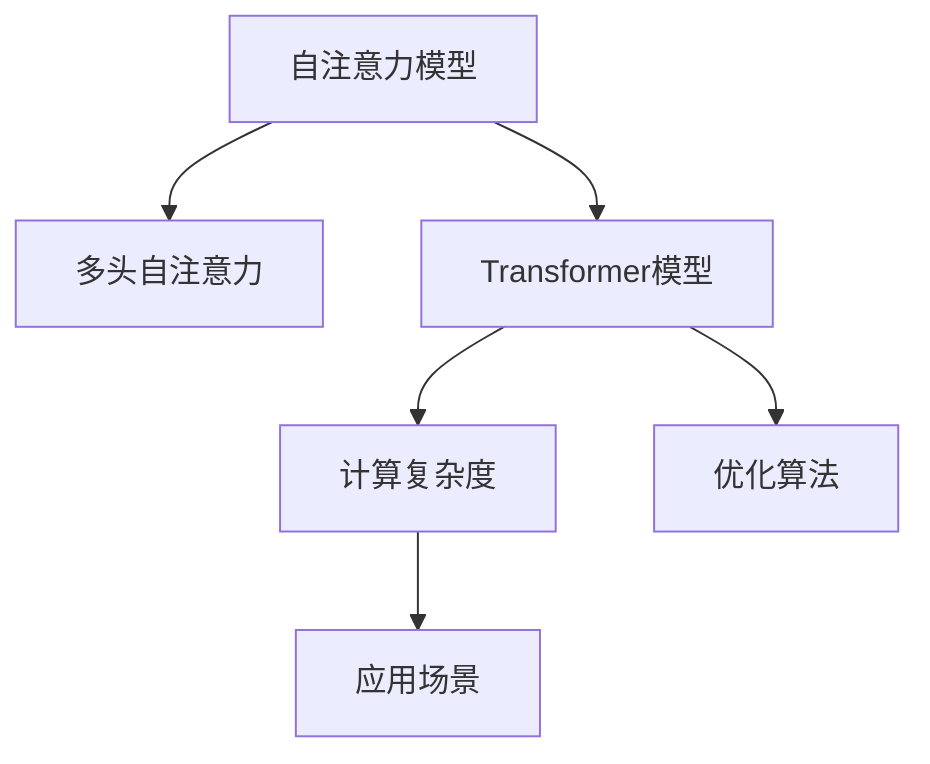

                 

# Self-Attention机制：NLP革命的关键

> 关键词：自注意力机制,Self-Attention,Transformer,深度学习,自然语言处理(NLP),模型训练,注意力机制,计算复杂度,优化算法,应用场景

## 1. 背景介绍

### 1.1 问题由来
深度学习在自然语言处理(NLP)领域取得了显著进步，尤其是基于Transformer架构的模型。这些模型通过自注意力机制(Self-Attention)改变了传统卷积神经网络(CNN)和递归神经网络(RNN)在序列处理任务上的表现，显著提升了语言模型的精度和效率。自注意力机制的核心思想是让模型在处理序列数据时，不仅考虑当前输入，还能关注输入序列中的其他部分，从而捕捉到更全面的语义信息。

### 1.2 问题核心关键点
自注意力机制的本质是计算模型输入序列中各个位置间的相似度，并基于这些相似度动态地分配权重，使得模型可以重点关注对当前输出最相关的部分。这一机制广泛应用于深度学习中的自编码器、循环神经网络、自注意力模型等架构中。自注意力机制在大规模语言模型中得到广泛应用，如BERT、GPT系列等，已成为NLP领域研究与实践的基石。

### 1.3 问题研究意义
自注意力机制的提出极大地提升了自然语言处理任务的性能，特别是在文本分类、机器翻译、问答系统等任务上，其效果优于传统的CNN和RNN模型。研究自注意力机制的原理和应用，有助于深入理解深度学习在NLP领域的工作机制，推动NLP技术的不断创新和发展。

## 2. 核心概念与联系

### 2.1 核心概念概述

为了更好地理解自注意力机制，本节将介绍几个相关概念：

- **自注意力模型(Self-Attention Model)**：基于自注意力机制的深度学习模型，通过计算输入序列中各位置之间的相似度，动态分配权重，使得模型能够关注对当前输出最相关的部分。

- **Transformer模型**：一种基于自注意力机制的深度学习模型，最初由Google在2017年提出。它通过多头自注意力机制和前馈神经网络，实现了序列处理任务的高效和灵活。

- **多头自注意力机制**：在自注意力机制的基础上，将输入序列映射到多个不同的空间，从而捕捉不同层次的语义信息。

- **计算复杂度**：自注意力机制的计算复杂度较高，随着序列长度的增加，模型需要计算大量的矩阵乘法和加法。

- **优化算法**：自注意力模型在训练过程中需要高效的优化算法，如Adam、SGD等，以快速收敛到最优解。

- **应用场景**：自注意力机制广泛应用于文本分类、机器翻译、问答系统、文本生成等任务中。

这些核心概念之间的逻辑关系可以通过以下Mermaid流程图来展示：



这个流程图展示了自注意力机制的上下文关系：

1. 自注意力模型基于多头自注意力机制，通过计算输入序列中各位置之间的相似度，动态分配权重。
2. Transformer模型则是一种自注意力模型的典型实现，其核心思想是通过多头自注意力机制和前馈神经网络处理序列数据。
3. 计算复杂度是自注意力机制需要面对的一个挑战，需要高效的优化算法来解决。
4. 应用场景展示了自注意力机制在文本分类、机器翻译等任务中的应用，揭示了其广泛的应用前景。

## 3. 核心算法原理 & 具体操作步骤
### 3.1 算法原理概述

自注意力机制的核心在于计算模型输入序列中各个位置之间的相似度，并基于这些相似度动态地分配权重，使得模型可以重点关注对当前输出最相关的部分。这一过程主要通过多头自注意力机制实现，其具体原理如下：

- **输入表示**：首先，模型将输入序列 $X$ 映射到一个高维空间，得到表示向量 $Q$、$K$、$V$。

- **相似度计算**：通过计算 $Q$ 和 $K$ 的矩阵乘积 $QK^T$，得到一组注意力得分矩阵，表示输入序列中各个位置之间的相似度。

- **权重分配**：将注意力得分矩阵 $QK^T$ 经过softmax归一化，得到一组权重向量 $\alpha$，表示对输入序列中各个位置的关注程度。

- **加权和计算**：将权重向量 $\alpha$ 与表示向量 $V$ 进行逐元素相乘，并求和，得到加权后的表示向量 $Z$，即为自注意力机制的输出。

### 3.2 算法步骤详解

自注意力机制的实现步骤如下：

1. **输入表示**：将输入序列 $X$ 映射到高维空间，得到表示向量 $Q$、$K$、$V$。常用的方法包括线性变换和残差连接。

2. **相似度计算**：计算 $Q$ 和 $K$ 的矩阵乘积 $QK^T$，得到注意力得分矩阵。

3. **权重分配**：将注意力得分矩阵 $QK^T$ 经过softmax归一化，得到权重向量 $\alpha$。

4. **加权和计算**：将权重向量 $\alpha$ 与表示向量 $V$ 进行逐元素相乘，并求和，得到加权后的表示向量 $Z$。

5. **多头注意力**：通过多次重复上述过程，并行计算多个头，将各个头的结果进行拼接，得到最终的表示向量 $Z$。

6. **线性变换**：对最终的表示向量 $Z$ 进行线性变换，得到模型的输出。

### 3.3 算法优缺点

自注意力机制在NLP领域具有以下优点：

- **全局感知能力**：自注意力机制能够同时关注输入序列中的各个位置，捕捉到全局语义信息，避免了局部视角的局限性。
- **高效计算**：通过并行计算多头注意力，自注意力机制能够在较短时间内处理长序列数据。
- **强大的表达能力**：自注意力机制能够有效地捕捉长距离依赖，提升模型对复杂句子的理解能力。
- **泛化能力**：自注意力机制具有较好的泛化能力，能够适应多种NLP任务。

然而，自注意力机制也存在以下缺点：

- **计算复杂度高**：自注意力机制需要计算大量的矩阵乘法和加法，特别是在处理长序列数据时，计算复杂度较高。
- **参数量大**：自注意力模型中的参数量较大，需要更多的计算资源和存储空间。
- **训练时间长**：由于自注意力模型的计算复杂度高，训练时间较长，需要更多的训练资源。

### 3.4 算法应用领域

自注意力机制在大规模语言模型中得到了广泛应用，具体包括：

- **文本分类**：如情感分析、主题分类、意图识别等。自注意力机制能够捕捉文本中的全局语义信息，提高分类精度。

- **机器翻译**：通过自注意力机制，模型能够关注输入序列中对翻译目标语言最相关的部分，提高翻译质量。

- **问答系统**：如阅读理解、对话系统等。自注意力机制能够捕捉输入序列中对当前问题最相关的部分，提高回答的准确性和相关性。

- **文本生成**：如文本摘要、生成对话等。自注意力机制能够捕捉输入序列中对生成文本最相关的部分，提高生成质量。

## 4. 数学模型和公式 & 详细讲解  
### 4.1 数学模型构建

自注意力机制的数学模型如下：

设输入序列 $X=\{x_1, x_2, ..., x_n\}$，其中 $x_i$ 表示序列中的第 $i$ 个元素，将其映射到高维空间，得到表示向量 $Q=\{q_1, q_2, ..., q_n\}$、$K=\{k_1, k_2, ..., k_n\}$、$V=\{v_1, v_2, ..., v_n\}$，其中 $q_i, k_i, v_i \in \mathbb{R}^d$，$d$ 为高维空间的维度。

设 $\alpha \in [0, 1]^n$，表示对输入序列中各个位置的关注程度，其计算公式为：

$$
\alpha = softmax(QK^T) = softmax\left(\frac{QK^T}{\sqrt{d_k}}\right)
$$

其中 $d_k$ 为 $K$ 的维度。

设 $Z \in \mathbb{R}^{n \times d}$，表示加权后的表示向量，其计算公式为：

$$
Z = \alpha V
$$

### 4.2 公式推导过程

以下是自注意力机制的公式推导过程：

设输入序列 $X$ 的长度为 $n$，将其映射到高维空间，得到表示向量 $Q, K, V$，其中 $Q, K, V \in \mathbb{R}^{n \times d}$，$d$ 为高维空间的维度。

1. 将 $Q, K, V$ 分别映射到高维空间，得到 $q_i, k_i, v_i \in \mathbb{R}^d$，其中 $q_i = Q_i, k_i = K_i, v_i = V_i$。

2. 计算 $Q$ 和 $K$ 的矩阵乘积 $QK^T$，得到注意力得分矩阵 $S \in \mathbb{R}^{n \times n}$。

3. 将注意力得分矩阵 $S$ 经过softmax归一化，得到权重向量 $\alpha \in [0, 1]^n$。

4. 将权重向量 $\alpha$ 与表示向量 $V$ 进行逐元素相乘，并求和，得到加权后的表示向量 $Z$。

### 4.3 案例分析与讲解

以机器翻译为例，自注意力机制的计算过程如下：

1. 将源语言文本序列 $x_1, x_2, ..., x_n$ 映射到高维空间，得到表示向量 $Q, K, V$。

2. 计算 $Q$ 和 $K$ 的矩阵乘积 $QK^T$，得到注意力得分矩阵 $S$。

3. 将注意力得分矩阵 $S$ 经过softmax归一化，得到权重向量 $\alpha$。

4. 将权重向量 $\alpha$ 与表示向量 $V$ 进行逐元素相乘，并求和，得到加权后的表示向量 $Z$。

5. 将 $Z$ 进行线性变换，得到翻译目标语言的表示向量。

6. 将 $Z$ 送入解码器进行解码，得到目标语言的翻译结果。

通过自注意力机制，机器翻译模型能够同时关注源语言和目标语言中的各个部分，捕捉到更全面的语义信息，从而提高翻译质量。

## 5. 项目实践：代码实例和详细解释说明
### 5.1 开发环境搭建

在进行自注意力机制的实践前，我们需要准备好开发环境。以下是使用Python进行TensorFlow和Keras开发的环境配置流程：

1. 安装Anaconda：从官网下载并安装Anaconda，用于创建独立的Python环境。

2. 创建并激活虚拟环境：
```bash
conda create -n attention-env python=3.8 
conda activate attention-env
```

3. 安装TensorFlow：根据CUDA版本，从官网获取对应的安装命令。例如：
```bash
conda install tensorflow=2.6 -c conda-forge -c pypi
```

4. 安装Keras：
```bash
pip install keras
```

5. 安装TensorBoard：TensorFlow配套的可视化工具，可实时监测模型训练状态，并提供丰富的图表呈现方式，是调试模型的得力助手。
```bash
pip install tensorboard
```

6. 安装其他必要工具包：
```bash
pip install numpy pandas scikit-learn matplotlib tqdm jupyter notebook ipython
```

完成上述步骤后，即可在`attention-env`环境中开始自注意力机制的实践。

### 5.2 源代码详细实现

下面我们以自注意力机制的应用场景——文本分类为例，给出使用TensorFlow和Keras实现的代码实现。

```python
import tensorflow as tf
from tensorflow.keras.layers import Input, Dense, Embedding, Dot, Add
from tensorflow.keras.models import Model

# 定义输入层
input_layer = Input(shape=(max_seq_length,), dtype='int32', name='input_layer')

# 定义嵌入层
embedding_layer = Embedding(vocab_size, embedding_dim)(input_layer)

# 定义多头自注意力机制
attention_layer = Dot(axes=(2, 2))(embedding_layer, embedding_layer, normalize=True)

# 定义加权和计算层
attention_layer = Add()([attention_layer, embedding_layer])

# 定义全连接层
fc_layer = Dense(n_class, activation='softmax')(attention_layer)

# 定义模型
model = Model(inputs=input_layer, outputs=fc_layer)

# 编译模型
model.compile(optimizer=tf.keras.optimizers.Adam(lr=1e-4), loss='categorical_crossentropy', metrics=['accuracy'])

# 打印模型结构
model.summary()
```

### 5.3 代码解读与分析

让我们再详细解读一下关键代码的实现细节：

**定义输入层**：
```python
input_layer = Input(shape=(max_seq_length,), dtype='int32', name='input_layer')
```
定义输入层，其形状为最大序列长度，数据类型为整数，并命名为`input_layer`。

**定义嵌入层**：
```python
embedding_layer = Embedding(vocab_size, embedding_dim)(input_layer)
```
定义嵌入层，将输入层映射到高维空间，得到表示向量。

**定义多头自注意力机制**：
```python
attention_layer = Dot(axes=(2, 2))(embedding_layer, embedding_layer, normalize=True)
```
定义自注意力机制，通过计算输入序列中各个位置之间的相似度，并基于这些相似度动态地分配权重，得到权重向量。

**定义加权和计算层**：
```python
attention_layer = Add()([attention_layer, embedding_layer])
```
将权重向量与表示向量进行逐元素相乘，并求和，得到加权后的表示向量。

**定义全连接层**：
```python
fc_layer = Dense(n_class, activation='softmax')(attention_layer)
```
定义全连接层，将加权后的表示向量映射到输出层，并进行分类。

**定义模型**：
```python
model = Model(inputs=input_layer, outputs=fc_layer)
```
定义模型，将输入层和输出层连接起来。

**编译模型**：
```python
model.compile(optimizer=tf.keras.optimizers.Adam(lr=1e-4), loss='categorical_crossentropy', metrics=['accuracy'])
```
编译模型，指定优化器、损失函数和评估指标。

**打印模型结构**：
```python
model.summary()
```
打印模型结构，查看各层的参数量和维度。

可以看到，Keras提供了便捷的方法来定义自注意力机制，只需要通过一些简单的API即可完成复杂的操作。

## 6. 实际应用场景

### 6.1 机器翻译

自注意力机制在机器翻译任务中得到了广泛应用。传统的神经机器翻译模型，如基于循环神经网络的模型，在处理长序列时存在梯度消失和梯度爆炸等问题。自注意力机制通过并行计算多头注意力，能够同时关注输入序列中各个位置，捕捉到更全面的语义信息，从而提高翻译质量。

### 6.2 文本分类

自注意力机制在文本分类任务中表现优异。通过自注意力机制，模型能够捕捉到文本中的全局语义信息，提高分类精度。

### 6.3 问答系统

自注意力机制在问答系统中具有重要应用。通过自注意力机制，模型能够捕捉到输入序列中对当前问题最相关的部分，提高回答的准确性和相关性。

### 6.4 文本生成

自注意力机制在文本生成任务中表现优异。通过自注意力机制，模型能够捕捉到输入序列中对生成文本最相关的部分，提高生成质量。

## 7. 工具和资源推荐

### 7.1 学习资源推荐

为了帮助开发者系统掌握自注意力机制的理论基础和实践技巧，这里推荐一些优质的学习资源：

1. 《Attention is All You Need》论文：Transformer模型的原论文，详细介绍了自注意力机制的原理和实现方法。

2. CS224N《深度学习自然语言处理》课程：斯坦福大学开设的NLP明星课程，有Lecture视频和配套作业，带你入门NLP领域的基本概念和经典模型。

3. 《Natural Language Processing with Transformers》书籍：Transformer库的作者所著，全面介绍了如何使用Transformer库进行NLP任务开发，包括自注意力机制在内的诸多范式。

4. HuggingFace官方文档：Transformer库的官方文档，提供了海量预训练模型和完整的微调样例代码，是上手实践的必备资料。

5. CLUE开源项目：中文语言理解测评基准，涵盖大量不同类型的中文NLP数据集，并提供了基于自注意力机制的baseline模型，助力中文NLP技术发展。

通过对这些资源的学习实践，相信你一定能够快速掌握自注意力机制的精髓，并用于解决实际的NLP问题。

### 7.2 开发工具推荐

高效的开发离不开优秀的工具支持。以下是几款用于自注意力机制开发的常用工具：

1. TensorFlow：由Google主导开发的开源深度学习框架，生产部署方便，适合大规模工程应用。同样有丰富的预训练语言模型资源。

2. Keras：由François Chollet开发的深度学习框架，使用便捷，适用于快速迭代研究。

3. PyTorch：基于Python的开源深度学习框架，灵活动态的计算图，适合快速迭代研究。大部分预训练语言模型都有PyTorch版本的实现。

4. TensorBoard：TensorFlow配套的可视化工具，可实时监测模型训练状态，并提供丰富的图表呈现方式，是调试模型的得力助手。

5. Weights & Biases：模型训练的实验跟踪工具，可以记录和可视化模型训练过程中的各项指标，方便对比和调优。

6. Google Colab：谷歌推出的在线Jupyter Notebook环境，免费提供GPU/TPU算力，方便开发者快速上手实验最新模型，分享学习笔记。

合理利用这些工具，可以显著提升自注意力机制的开发效率，加快创新迭代的步伐。

### 7.3 相关论文推荐

自注意力机制的发展源于学界的持续研究。以下是几篇奠基性的相关论文，推荐阅读：

1. Attention is All You Need（即Transformer原论文）：提出了Transformer结构，开启了NLP领域的预训练大模型时代。

2. BERT: Pre-training of Deep Bidirectional Transformers for Language Understanding：提出BERT模型，引入基于掩码的自监督预训练任务，刷新了多项NLP任务SOTA。

3. Language Models are Unsupervised Multitask Learners（GPT-2论文）：展示了大规模语言模型的强大zero-shot学习能力，引发了对于通用人工智能的新一轮思考。

4. Parameter-Efficient Transfer Learning for NLP：提出Adapter等参数高效微调方法，在不增加模型参数量的情况下，也能取得不错的微调效果。

5. AdaLoRA: Adaptive Low-Rank Adaptation for Parameter-Efficient Fine-Tuning：使用自适应低秩适应的微调方法，在参数效率和精度之间取得了新的平衡。

这些论文代表了大语言模型和自注意力机制的发展脉络。通过学习这些前沿成果，可以帮助研究者把握学科前进方向，激发更多的创新灵感。

## 8. 总结：未来发展趋势与挑战

### 8.1 总结

本文对自注意力机制进行了全面系统的介绍。首先阐述了自注意力机制的研究背景和意义，明确了其在NLP领域的核心地位。其次，从原理到实践，详细讲解了自注意力机制的数学原理和关键步骤，给出了自注意力机制任务开发的完整代码实例。同时，本文还广泛探讨了自注意力机制在机器翻译、文本分类、问答系统、文本生成等任务中的应用前景，展示了其广泛的应用潜力。此外，本文精选了自注意力机制的学习资源，力求为读者提供全方位的技术指引。

通过本文的系统梳理，可以看到，自注意力机制已经成为NLP领域的重要范式，极大地提升了NLP模型的性能和应用范围。未来，伴随自注意力机制的持续演进，NLP技术必将在更广阔的应用领域大放异彩，深刻影响人类的生产生活方式。

### 8.2 未来发展趋势

展望未来，自注意力机制将呈现以下几个发展趋势：

1. 多模态融合：将自注意力机制应用于多模态数据融合，提升模型对不同模态数据的理解和整合能力。

2. 增量学习：通过增量学习算法，使得自注意力机制能够不断地从新数据中学习，同时保持已学习的知识。

3. 可解释性增强：通过引入因果分析等方法，增强自注意力机制的解释性和可解释性。

4. 自适应学习：通过自适应学习算法，使得自注意力机制能够根据任务特点自动调整模型参数，提升模型泛化能力。

5. 模型压缩和优化：通过模型压缩和优化算法，使得自注意力机制能够更高效地运行，适应不同的计算平台和资源限制。

6. 跨领域迁移：通过跨领域迁移算法，使得自注意力机制能够将知识迁移到其他领域，提高模型的泛化性能。

以上趋势凸显了自注意力机制的广阔前景。这些方向的探索发展，必将进一步提升NLP系统的性能和应用范围，为人类认知智能的进化带来深远影响。

### 8.3 面临的挑战

尽管自注意力机制已经取得了瞩目成就，但在迈向更加智能化、普适化应用的过程中，它仍面临着诸多挑战：

1. 计算复杂度高：自注意力机制需要计算大量的矩阵乘法和加法，特别是在处理长序列数据时，计算复杂度较高。

2. 参数量大：自注意力模型中的参数量较大，需要更多的计算资源和存储空间。

3. 训练时间长：由于自注意力模型的计算复杂度高，训练时间较长，需要更多的训练资源。

4. 可解释性不足：自注意力机制的决策过程缺乏可解释性，难以对其推理逻辑进行分析和调试。

5. 偏见和歧视：自注意力机制可能学习到有偏见、有害的信息，传递到下游任务，产生误导性、歧视性的输出，给实际应用带来安全隐患。

6. 实时性和资源限制：在实时应用场景中，自注意力机制可能面临计算资源和时延的限制，需要进一步优化和压缩。

正视自注意力机制面临的这些挑战，积极应对并寻求突破，将使其在更广泛的应用领域发挥更大的作用。相信随着学界和产业界的共同努力，这些挑战终将一一被克服，自注意力机制必将在构建人机协同的智能时代中扮演越来越重要的角色。

### 8.4 研究展望

面对自注意力机制面临的挑战，未来的研究需要在以下几个方面寻求新的突破：

1. 探索高效的计算方法和优化算法，如分布式计算、量化加速等，提升自注意力机制的计算效率。

2. 引入因果分析、对比学习等方法，增强自注意力机制的解释性和可解释性。

3. 结合多模态数据融合，提升自注意力机制对不同模态数据的理解和整合能力。

4. 探索跨领域迁移和增量学习算法，增强自注意力机制的泛化能力。

5. 开发自适应学习算法，使得自注意力机制能够根据任务特点自动调整模型参数，提升模型性能。

6. 引入伦理道德约束，确保自注意力机制的输出符合人类价值观和伦理道德。

这些研究方向的探索，必将引领自注意力机制向更高的台阶发展，为构建安全、可靠、可解释、可控的智能系统铺平道路。面向未来，自注意力机制还需要与其他人工智能技术进行更深入的融合，如知识表示、因果推理、强化学习等，多路径协同发力，共同推动NLP技术的进步。只有勇于创新、敢于突破，才能不断拓展自注意力机制的边界，让智能技术更好地造福人类社会。

## 9. 附录：常见问题与解答

**Q1：自注意力机制是否适用于所有NLP任务？**

A: 自注意力机制在大多数NLP任务上都能取得不错的效果，特别是对于数据量较小的任务。但对于一些特定领域的任务，如医学、法律等，仅仅依靠通用语料预训练的模型可能难以很好地适应。此时需要在特定领域语料上进一步预训练，再进行微调，才能获得理想效果。

**Q2：自注意力机制的计算复杂度如何？**

A: 自注意力机制的计算复杂度较高，随着序列长度的增加，模型需要计算大量的矩阵乘法和加法。因此，在处理长序列数据时，需要注意优化计算过程，如使用分布式计算、量化加速等方法。

**Q3：如何缓解自注意力机制的过拟合问题？**

A: 过拟合是自注意力机制需要面对的主要问题之一。缓解过拟合的方法包括数据增强、正则化、dropout等技术，同时需要注意控制模型参数量，避免过度拟合。

**Q4：自注意力机制在实时应用中需要注意哪些问题？**

A: 自注意力机制在实时应用中，需要注意计算资源和时延的限制。为了提高实时性，可以使用分布式计算、量化加速等方法。同时，需要优化模型的结构，减少计算量，提高推理速度。

**Q5：如何提高自注意力机制的可解释性？**

A: 提高自注意力机制的可解释性，需要引入因果分析、对比学习等方法，增强模型的解释性和可解释性。同时，可以通过可视化工具，如TensorBoard等，监测模型训练过程，分析模型的推理逻辑。

这些问题的解答，可以帮助开发者更好地理解自注意力机制的原理和应用，提升NLP任务的开发效率和模型性能。总之，自注意力机制作为一种重要的深度学习技术，已经深刻改变了NLP领域的范式，未来将在更多的应用场景中发挥重要作用。

---

作者：禅与计算机程序设计艺术 / Zen and the Art of Computer Programming

