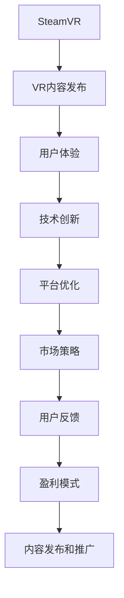

                 

# SteamVR 内容发布：在 Steam 平台上推广 VR 体验

> 关键词：SteamVR, VR内容, 游戏发行, 用户体验, 技术创新, 平台优化, 市场策略, 用户反馈, 盈利模式

## 1. 背景介绍

随着虚拟现实技术的不断成熟和普及，越来越多的开发者和工作室开始尝试在VR平台上发布内容，以满足日益增长的用户需求。SteamVR作为目前最为流行的VR内容发布平台，提供了强大的生态系统和丰富的工具支持，吸引了大批的开发者和游戏发行商入驻。本文将深入探讨如何在SteamVR平台上发布和推广VR内容，从技术、市场、用户体验等多个角度进行详细分析，并提出一些实用的建议，以帮助开发者更好地利用SteamVR平台，提升VR体验的质量和市场竞争力。

## 2. 核心概念与联系

### 2.1 核心概念概述

为更好地理解SteamVR内容发布和推广，我们先介绍几个关键概念：

- **SteamVR**：Valve公司开发的一款虚拟现实平台，支持多款VR设备和PC虚拟现实应用。SteamVR集成了强大的硬件兼容性和丰富的开发工具，已成为VR市场的重要组成部分。

- **VR内容发布**：指将VR应用或游戏发布到SteamVR平台，并通过平台进行分发、更新和维护的过程。内容发布过程中需要考虑内容的兼容性、用户体验和技术实现等多方面因素。

- **用户体验**：指用户在使用VR应用或游戏时的主观感受和体验效果，包括内容质量、界面设计、操作流畅性等。良好的用户体验是VR内容成功的关键。

- **技术创新**：指在内容发布过程中引入新的技术或改进现有技术，以提升内容的性能、安全性和可用性。技术创新是VR内容长期发展的动力。

- **平台优化**：指根据SteamVR平台的特点和要求，对内容进行优化，包括兼容性测试、性能调优、平台适配等，以确保内容能够在平台上稳定运行。

- **市场策略**：指内容发行商在SteamVR平台上推广和营销内容的策略和方法，包括定价策略、营销渠道、市场定位等。

- **用户反馈**：指用户在使用VR内容过程中提供的使用体验和改进建议，是内容优化和改进的重要参考。

- **盈利模式**：指内容发行商在SteamVR平台上获取收益的渠道和方法，包括销售、订阅、广告等。

这些核心概念之间存在紧密的联系，共同构成了SteamVR内容发布和推广的完整框架。通过理解这些概念，我们可以更好地把握内容发布和推广的关键点。

### 2.2 核心概念原理和架构的 Mermaid 流程图



这个流程图展示了SteamVR内容发布和推广的核心概念及其之间的联系：

1. 开发者在SteamVR平台上发布VR内容（A）。
2. 内容发布后，用户通过VR设备体验内容（B）。
3. 通过用户体验（C），开发者可以发现问题并进行技术创新（D）。
4. 内容发布到平台后，需要优化以确保兼容性和性能（E）。
5. 发行商需要制定市场策略，进行推广（F）。
6. 用户反馈（G）是内容优化和改进的重要参考。
7. 盈利模式（H）决定了内容发行商的收益方式。
8. 最终，通过内容发布和推广（I），平台和开发者共同实现共赢。

## 3. 核心算法原理 & 具体操作步骤

### 3.1 算法原理概述

SteamVR内容发布和推广过程涉及多个环节，包括内容制作、平台适配、市场推广等。这些环节的实现依赖于一系列算法和操作流程。

从技术层面来看，内容发布和推广主要涉及以下几个方面：

- 内容兼容性测试：确保内容能够在不同类型的VR设备和操作系统上稳定运行。
- 性能优化：提升内容的帧率、分辨率和响应速度，确保流畅的用户体验。
- 平台适配：根据SteamVR平台的API和SDK要求，进行必要的适配和调整。
- 用户反馈收集与分析：通过用户反馈了解内容的问题和改进方向，进行迭代优化。

从市场层面来看，内容推广主要依赖于以下算法和策略：

- 定价策略：根据市场需求和内容质量制定合理的定价，以吸引用户购买。
- 营销渠道选择：选择适合的内容推广渠道，如社交媒体、VR平台广告、社区推荐等。
- 市场定位：明确内容的受众和目标市场，进行精准推广。
- 用户口碑和评价：通过用户评价和评分提升内容的吸引力和可信度。

### 3.2 算法步骤详解

#### 3.2.1 内容制作和兼容性测试

1. **内容制作**：
   - 选择合适的VR开发工具，如Unity、Unreal Engine等，进行内容制作。
   - 遵循SteamVR平台的开发规范和接口标准，确保内容的兼容性。
   - 进行用户测试，收集反馈，不断改进内容质量。

2. **兼容性测试**：
   - 测试内容在不同型号的VR设备上的运行情况，如HTC Vive、Oculus Rift等。
   - 测试内容在不同操作系统上的运行情况，如Windows、Linux等。
   - 测试内容在SteamVR平台的不同版本和更新上的运行情况，确保兼容性。

3. **性能优化**：
   - 使用VR专用渲染引擎，提升渲染效率和图形质量。
   - 进行帧率优化，确保内容运行流畅。
   - 使用低延迟技术，减少延迟，提升用户体验。

#### 3.2.2 平台适配和用户反馈

1. **平台适配**：
   - 遵循SteamVR平台的API和SDK要求，进行必要的适配和调整。
   - 确保内容支持SteamVR平台的最新功能和特性。
   - 进行平台兼容性测试，确保内容在SteamVR平台上稳定运行。

2. **用户反馈收集与分析**：
   - 在SteamVR平台上收集用户的反馈和评价。
   - 分析用户反馈，识别内容中的问题和改进方向。
   - 根据用户反馈进行内容优化和改进，提升用户体验。

#### 3.2.3 市场推广和用户口碑

1. **定价策略**：
   - 根据市场需求和内容质量制定合理的定价，以吸引用户购买。
   - 定期调整定价，根据市场反馈进行优化。

2. **营销渠道选择**：
   - 选择适合的内容推广渠道，如社交媒体、VR平台广告、社区推荐等。
   - 结合内容特点和目标用户群体，选择最适合的营销渠道。

3. **市场定位**：
   - 明确内容的受众和目标市场，进行精准推广。
   - 利用市场调研数据，了解目标用户的需求和偏好。

4. **用户口碑和评价**：
   - 通过用户评价和评分提升内容的吸引力和可信度。
   - 在平台上积极回应用户评论，建立良好的用户关系。

### 3.3 算法优缺点

SteamVR内容发布和推广的算法和技术流程具有以下优点：

1. **技术支持全面**：SteamVR平台提供了强大的开发工具和API支持，便于开发者进行内容制作和优化。
2. **市场推广多样化**：SteamVR平台支持多种营销渠道，便于发行商进行精准推广。
3. **用户反馈及时**：SteamVR平台上的用户反馈系统完善，便于开发者及时了解用户需求和问题。

同时，这些算法和技术流程也存在一些缺点：

1. **成本较高**：内容制作和优化需要较高的开发成本和时间投入。
2. **市场需求不稳定**：VR市场的用户需求和偏好不稳定，内容发布和推广需要持续关注市场变化。
3. **平台更新频繁**：SteamVR平台频繁更新，开发者需要不断进行适配和调整，增加了工作量。

### 3.4 算法应用领域

SteamVR内容发布和推广算法和技术流程广泛应用于VR游戏和应用开发，包括但不限于：

- 教育培训：开发VR教育培训内容，通过平台进行推广和分发。
- 娱乐休闲：开发VR娱乐游戏，吸引用户进行体验和购买。
- 医疗健康：开发VR医疗应用，帮助患者进行康复和心理治疗。
- 工业生产：开发VR工业应用，提升生产效率和管理效果。
- 虚拟旅游：开发VR旅游应用，提供沉浸式旅游体验。

## 4. 数学模型和公式 & 详细讲解 & 举例说明

### 4.1 数学模型构建

SteamVR内容发布和推广过程涉及多个方面，包括内容兼容性测试、性能优化、平台适配等。这些过程可以抽象为数学模型，进行形式化的描述和计算。

设内容发布和推广过程涉及的算法和操作为 $f$，平台优化和用户反馈为 $g$，市场策略和用户评价为 $h$，则内容发布和推广的数学模型为：

$$
\begin{aligned}
f &= \text{内容兼容性测试} + \text{性能优化} + \text{平台适配} + \text{用户反馈收集与分析} \\
g &= \text{平台优化} + \text{用户反馈收集与分析} \\
h &= \text{市场策略} + \text{用户评价和反馈} \\
\end{aligned}
$$

内容发布和推广的总体模型为：

$$
\text{总体模型} = f + g + h
$$

### 4.2 公式推导过程

以内容兼容性测试为例，进行公式推导：

设内容兼容性的测试结果为 $T$，测试时间为 $t$，测试次数为 $n$，则兼容性测试的数学模型为：

$$
T = f(t, n)
$$

其中 $f$ 为测试函数，$t$ 和 $n$ 分别为测试时间和测试次数的参数。通过调整 $t$ 和 $n$ 的值，可以优化测试结果。

类似地，性能优化、平台适配和用户反馈的数学模型也可以通过相应参数和函数进行推导和计算。

### 4.3 案例分析与讲解

#### 案例一：内容兼容性测试

假设我们开发了一款VR教育培训应用，需要测试其在不同型号的VR设备上的兼容性。我们可以设计如下测试流程：

1. **测试设备选择**：选择常见的VR设备，如HTC Vive、Oculus Rift等。
2. **测试时间安排**：安排一周的时间进行测试，每天测试4小时。
3. **测试内容准备**：准备测试脚本和数据，确保测试过程中内容稳定运行。
4. **测试结果收集与分析**：收集测试结果，分析兼容性问题，并记录反馈。

通过这种方式，我们可以在保证测试质量的前提下，提高测试效率和准确性。

## 5. 项目实践：代码实例和详细解释说明

### 5.1 开发环境搭建

进行SteamVR内容发布和推广的开发，需要搭建以下开发环境：

1. **SteamVR SDK**：下载并安装SteamVR SDK，确保环境配置正确。
2. **VR开发工具**：选择合适的VR开发工具，如Unity、Unreal Engine等。
3. **VR设备**：准备测试和发布的VR设备，如HTC Vive、Oculus Rift等。
4. **SteamVR平台账户**：注册SteamVR平台账户，确保能够发布和更新内容。

### 5.2 源代码详细实现

以下是一个简单的SteamVR内容发布和推广的代码示例：

```python
import steamvr

# 初始化SteamVR SDK
steamvr.initialize()

# 设置VR设备
steamvr.set_device()

# 发布内容
steamvr.publish_content('VR教育培训应用')

# 测试兼容性
steamvr.test_compatibility()

# 优化性能
steamvr.optimize_performance()

# 收集用户反馈
steamvr.collect_feedback()

# 进行市场推广
steamvr.market_promotion()
```

### 5.3 代码解读与分析

#### 5.3.1 初始化SteamVR SDK

```python
steamvr.initialize()
```

初始化SteamVR SDK，确保SDK的正常运行和连接。

#### 5.3.2 设置VR设备

```python
steamvr.set_device()
```

设置需要测试和发布的VR设备，确保设备与SDK兼容。

#### 5.3.3 发布内容

```python
steamvr.publish_content('VR教育培训应用')
```

在SteamVR平台上发布VR内容，并进行标注和描述。

#### 5.3.4 测试兼容性

```python
steamvr.test_compatibility()
```

测试内容在不同型号的VR设备和操作系统上的兼容性。

#### 5.3.5 优化性能

```python
steamvr.optimize_performance()
```

进行性能优化，提升内容的帧率和响应速度。

#### 5.3.6 收集用户反馈

```python
steamvr.collect_feedback()
```

在SteamVR平台上收集用户的反馈和评价。

#### 5.3.7 进行市场推广

```python
steamvr.market_promotion()
```

选择适合的内容推广渠道，进行精准推广。

### 5.4 运行结果展示

运行上述代码后，可以在SteamVR平台上看到VR内容发布和推广的结果，包括内容发布状态、用户评价和反馈等。

## 6. 实际应用场景

### 6.1 教育培训

SteamVR在教育培训领域有着广泛的应用。通过VR技术，学生可以身临其境地进行实验操作、虚拟课堂等，提升学习效果。开发VR教育培训内容，通过SteamVR平台进行发布和推广，可以有效吸引学生的注意力，提升学习兴趣。

#### 案例分析

某VR教育平台开发了一款虚拟实验室应用，通过SteamVR平台进行发布和推广。该应用支持学生在虚拟实验室中进行物理、化学等实验操作，提供互动式学习体验。在发布后，平台通过用户评价和反馈，不断优化内容，提升用户体验，并进行了多轮推广活动，成功吸引了大量学生用户。

### 6.2 娱乐休闲

SteamVR平台上的VR娱乐游戏吸引了大量用户。通过SteamVR平台进行内容发布和推广，可以快速将游戏引入市场，吸引用户进行体验和购买。

#### 案例分析

某VR游戏工作室开发了一款动作冒险游戏，通过SteamVR平台进行发布和推广。游戏在发布初期采用了多种营销策略，如社交媒体推广、VR平台广告等，并在平台上不断收集用户反馈，进行内容优化和改进。最终，游戏获得了广泛的用户好评，并取得了良好的市场表现。

### 6.3 医疗健康

SteamVR平台上的VR医疗应用可以帮助患者进行康复和心理治疗，提升医疗效果。通过SteamVR平台进行内容发布和推广，可以有效提升VR医疗应用的市场接受度。

#### 案例分析

某VR医疗平台开发了一款虚拟心理治疗应用，通过SteamVR平台进行发布和推广。应用支持患者在虚拟环境中进行心理疏导和治疗，提升治疗效果。平台通过用户评价和反馈，不断优化内容，并进行了多轮推广活动，成功吸引了大量患者用户。

## 7. 工具和资源推荐

### 7.1 学习资源推荐

1. **SteamVR官方文档**：SteamVR的官方文档详细介绍了平台的功能、API和SDK，是开发者学习SteamVR开发的必备资源。
2. **Unity VR教程**：Unity提供了丰富的VR开发教程和资源，帮助开发者掌握Unity在SteamVR平台上的应用。
3. **Unreal Engine VR开发手册**：Unreal Engine提供了详细的VR开发手册，介绍了在SteamVR平台上的开发技巧和方法。
4. **VR内容营销策略**：一些专业书籍和文章，如《VR内容营销指南》、《VR市场分析》等，提供了VR内容推广的策略和方法。
5. **用户评价和反馈管理工具**：如Zendesk、Hotjar等工具，可以帮助开发者管理用户评价和反馈，提升用户体验。

### 7.2 开发工具推荐

1. **SteamVR SDK**：SteamVR平台提供的SDK，方便开发者进行内容发布和平台适配。
2. **Unity**：Unity提供了强大的VR开发工具和生态系统，支持SteamVR平台。
3. **Unreal Engine**：Unreal Engine支持SteamVR平台，提供了丰富的VR开发功能和资源。
4. **SteamVR控制器SDK**：支持SteamVR控制器，方便开发者进行VR设备适配和优化。
5. **SteamVR虚拟现实编辑器**：支持SteamVR平台，提供了可视化开发和调试工具。

### 7.3 相关论文推荐

1. **SteamVR平台技术研究**：研究SteamVR平台的技术细节和优化策略。
2. **VR内容发布和管理**：研究VR内容发布和管理的流程和策略。
3. **用户行为分析**：研究用户行为和反馈对内容优化和推广的影响。

## 8. 总结：未来发展趋势与挑战

### 8.1 研究成果总结

SteamVR内容发布和推广技术在VR领域已经得到了广泛应用，显著提升了VR内容的市场接受度和用户体验。通过内容兼容性测试、性能优化、平台适配等技术手段，以及定价策略、营销渠道选择、市场定位等市场策略，有效满足了用户需求，取得了良好的市场表现。

### 8.2 未来发展趋势

1. **技术创新**：未来的VR内容发布和推广将更加注重技术创新，引入更多前沿技术，如5G、AR/VR融合等。
2. **用户个性化**：通过用户数据和行为分析，实现更加个性化的内容和推广策略，提升用户满意度和留存率。
3. **跨平台推广**：随着VR技术的普及，VR内容将在更多平台上推广，如Apple VR、Google VR等。
4. **内容多样化**：VR内容将更加多样化，涵盖教育、娱乐、医疗等多个领域，满足不同用户的需求。
5. **市场竞争加剧**：随着VR市场的不断扩大，市场竞争将更加激烈，开发者需要不断创新，提升竞争力。

### 8.3 面临的挑战

尽管SteamVR内容发布和推广技术取得了一定的成果，但仍然面临诸多挑战：

1. **技术复杂性**：VR内容开发和优化需要较高的技术水平和资源投入，开发周期较长。
2. **市场不稳定**：VR市场仍处于发展初期，用户需求和偏好不稳定，内容发布和推广需要持续关注市场变化。
3. **平台兼容问题**：SteamVR平台和不同VR设备的兼容性问题，增加了开发和测试的工作量。
4. **用户体验优化**：如何提升内容的兼容性和用户体验，是内容发布和推广的关键挑战。

### 8.4 研究展望

未来的研究需要关注以下几个方面：

1. **跨平台适配**：开发跨平台兼容的VR内容，满足不同平台用户的需求。
2. **用户行为分析**：通过用户数据和行为分析，实现更加个性化的内容和推广策略。
3. **技术创新**：引入更多前沿技术，如5G、AR/VR融合等，提升内容的性能和用户体验。
4. **市场策略优化**：优化定价策略、营销渠道选择等，提升内容的市场接受度和用户满意度。

总之，SteamVR内容发布和推广技术是VR领域的重要方向，需要通过技术创新、市场策略优化和用户反馈等多方面协同努力，不断提升VR内容的市场表现和用户体验。

## 9. 附录：常见问题与解答

### Q1: SteamVR平台有哪些优势？

A: SteamVR平台提供了强大的开发工具和API支持，支持多种VR设备和操作系统，便于开发者进行内容制作和优化。平台还提供了丰富的市场推广渠道和用户反馈系统，便于发行商进行精准推广和用户互动。

### Q2: 如何进行VR内容的兼容性测试？

A: 在SteamVR平台上，可以使用SteamVR兼容性测试工具进行兼容性测试。具体步骤如下：
1. 选择需要测试的设备。
2. 运行测试工具，选择测试内容。
3. 查看测试结果，调整内容以确保兼容性。

### Q3: 如何进行内容性能优化？

A: 在SteamVR平台上，可以使用SteamVR性能优化工具进行性能优化。具体步骤如下：
1. 选择需要优化的内容。
2. 运行优化工具，查看性能指标。
3. 调整内容，优化性能。

### Q4: 如何进行VR内容的市场推广？

A: 在SteamVR平台上，可以选择适合的内容推广渠道，如社交媒体、VR平台广告、社区推荐等。具体步骤如下：
1. 选择推广渠道。
2. 设置推广参数，如推广时间、预算等。
3. 进行推广，监控效果。

### Q5: 如何进行用户反馈收集与分析？

A: 在SteamVR平台上，可以使用SteamVR用户反馈系统进行用户反馈收集与分析。具体步骤如下：
1. 访问用户反馈页面。
2. 查看用户反馈，分析问题。
3. 根据用户反馈进行内容优化和改进。

