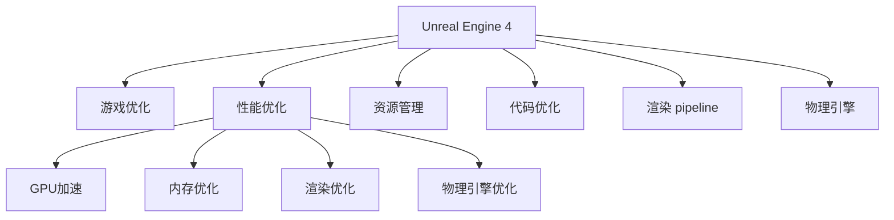

                 

# Unreal Engine 4游戏优化

> 关键词：游戏优化, Unreal Engine, 性能优化, GPU加速, 内存优化, 渲染优化, 物理引擎优化

## 1. 背景介绍

在现代游戏开发中，Unreal Engine 4(UE4)已成为行业标准，其强大的引擎功能和灵活的编程接口使其成为了开发高性能游戏的理想选择。然而，随着游戏复杂度的提高，渲染、物理、音频等各子系统的性能优化变得尤为重要。本文将系统介绍UE4游戏优化的核心概念与联系、关键算法原理与具体操作步骤，并提供项目实践和实际应用场景，帮助开发者掌握UE4游戏优化的技能和策略。

## 2. 核心概念与联系

### 2.1 核心概念概述

为了更好地理解UE4游戏优化，我们首先介绍几个关键概念：

- **Unreal Engine 4(UE4)**：由Epic Games开发的游戏引擎，具有高度的灵活性和可扩展性，支持跨平台开发。
- **游戏优化**：指通过优化游戏各子系统的性能，提升游戏运行流畅度和用户体验的过程。
- **性能优化**：通过优化代码、减少资源占用、提高渲染效率等手段，减少游戏运行时的延迟和卡顿现象。
- **GPU加速**：利用图形处理器(GPU)的并行计算能力，提升图形渲染的速度。
- **内存优化**：通过合理分配和释放内存资源，减少游戏运行时的内存泄漏和卡顿。
- **渲染优化**：通过优化渲染引擎和资源加载方式，提升游戏的渲染效率和视觉质量。
- **物理引擎优化**：优化物理引擎的计算和渲染效率，提升游戏的物理交互体验。

这些概念之间的关系可以通过以下Mermaid流程图来展示：



这个流程图展示了一些关键概念之间的关系：

1. UE4是游戏优化的基础平台。
2. 性能优化是游戏优化的核心目标。
3. GPU加速、内存优化、渲染优化和物理引擎优化是实现性能优化的重要手段。
4. 资源管理和代码优化为游戏优化提供了基础保障。

## 3. 核心算法原理 & 具体操作步骤

### 3.1 算法原理概述

Unreal Engine 4的游戏优化涉及多个子系统的综合优化。其核心思想是通过改进引擎各组件，减少渲染和计算的延迟，提高资源的利用效率，从而提升游戏整体的运行流畅度。

一般而言，游戏优化的流程包括以下几个关键步骤：

1. **性能评估**：使用UE4内置的性能分析工具，评估游戏在目标设备上的表现，找出性能瓶颈。
2. **资源管理**：优化资源加载和管理，减少内存占用和资源泄露。
3. **代码优化**：重构代码，提升算法效率和资源利用率。
4. **渲染优化**：调整渲染引擎参数，优化渲染管线，减少渲染延迟。
5. **物理引擎优化**：优化物理引擎计算，减少碰撞检测和模拟延迟。

### 3.2 算法步骤详解

以下是UE4游戏优化的一般流程和具体操作步骤：

**Step 1: 性能评估**
- 使用UE4内置的性能分析工具，如Visual Profiler、Frame Profiler等，评估游戏的性能表现。
- 主要关注CPU和GPU的占用情况，找出渲染和计算的延迟瓶颈。
- 记录CPU和GPU的时间剖面图，分析每个帧的具体表现。

**Step 2: 资源管理**
- 优化资源加载和管理，减少内存占用和资源泄露。
- 使用UE4的内存优化工具，如Unreal Engine Memory Profiler，分析内存使用情况。
- 定期释放不再使用的资源，如纹理、材质等。
- 使用资源缓存机制，减少资源加载时间。

**Step 3: 代码优化**
- 重构代码，提升算法效率和资源利用率。
- 使用Visual Studio的性能分析工具，如CPU Profiler、GPU Profiler等，分析代码的性能瓶颈。
- 优化算法，如使用并行计算、减少循环次数等。
- 优化资源访问，如使用对象池、避免频繁的资源分配和释放。

**Step 4: 渲染优化**
- 调整渲染引擎参数，优化渲染管线，减少渲染延迟。
- 使用UE4的渲染优化工具，如Visual Profiler、Frame Profiler等，分析渲染表现。
- 减少渲染节点数量，优化渲染管线。
- 调整渲染分辨率，优化渲染输出。

**Step 5: 物理引擎优化**
- 优化物理引擎计算，减少碰撞检测和模拟延迟。
- 使用UE4的物理引擎优化工具，如Frame Profiler等，分析物理引擎表现。
- 减少碰撞检测的频率，优化碰撞检测算法。
- 减少物理模拟的计算量，优化物理引擎。

### 3.3 算法优缺点

UE4游戏优化具有以下优点：

1. **全面覆盖**：通过优化引擎各组件，全面提升游戏性能。
2. **工具丰富**：UE4提供了多种性能分析工具和优化工具，方便开发者进行诊断和优化。
3. **社区支持**：UE4拥有庞大的开发者社区，提供了丰富的优化资源和案例。

然而，UE4游戏优化也存在一些局限性：

1. **复杂度高**：涉及多个子系统的综合优化，工作量较大。
2. **学习曲线陡峭**：需要掌握多种优化工具和技巧，入门门槛较高。
3. **效果依赖于硬件**：优化效果受硬件性能和设备配置的限制较大。

尽管存在这些局限性，但UE4游戏优化仍然是游戏开发中不可或缺的重要环节，其丰富的工具和社区支持为开发者提供了强大的支持。

### 3.4 算法应用领域

UE4游戏优化广泛应用于各种游戏类型的开发中，包括动作游戏、角色扮演游戏、策略游戏等。以下是一些典型应用场景：

1. **动作游戏**：优化碰撞检测、物理模拟等子系统，提升游戏流畅度和体验感。
2. **角色扮演游戏**：优化渲染、动画和物理引擎，提升游戏视觉质量和互动体验。
3. **策略游戏**：优化资源加载和管理，提升游戏加载速度和资源利用率。
4. **开放世界游戏**：优化渲染管线和资源加载，提升游戏视觉效果和探索体验。
5. **虚拟现实游戏**：优化物理引擎和渲染，提升游戏的沉浸感和交互体验。

## 4. 数学模型和公式 & 详细讲解 & 举例说明

### 4.1 数学模型构建

为了更好地理解UE4游戏优化，我们首先构建一个简单的数学模型，描述游戏优化的基本流程。

假设游戏在每个帧的渲染时间为 $T_r$，物理引擎计算时间为 $T_p$，总渲染时间为 $T_{total}$。优化后的渲染时间为 $T_r'$，物理引擎计算时间为 $T_p'$，优化后的总渲染时间为 $T_{total}'$。则优化效果可以通过以下公式表示：

$$
\text{优化效果} = \frac{T_{total}'}{T_{total}}
$$

其中，

$$
T_{total}' = T_r' + T_p'
$$

$$
T_{total} = T_r + T_p
$$

$$
T_r' = f(T_r, \delta_r)
$$

$$
T_p' = f(T_p, \delta_p)
$$

其中，$f$ 表示优化函数，$\delta_r$ 和 $\delta_p$ 表示渲染和物理引擎的优化参数。

### 4.2 公式推导过程

以下是优化效果公式的推导过程：

假设优化前后的渲染时间和物理引擎计算时间分别减少了 $x_r$ 和 $x_p$，则优化后的渲染时间和物理引擎计算时间分别为：

$$
T_r' = T_r - x_r
$$

$$
T_p' = T_p - x_p
$$

将上述公式代入总渲染时间公式中，得到：

$$
T_{total}' = T_r' + T_p' = (T_r - x_r) + (T_p - x_p) = T_r + T_p - x_r - x_p
$$

将优化效果公式代入优化前后的总渲染时间公式中，得到：

$$
\text{优化效果} = \frac{T_{total}'}{T_{total}} = \frac{T_r + T_p - x_r - x_p}{T_r + T_p} = 1 - \frac{x_r + x_p}{T_r + T_p}
$$

由公式可知，优化效果与渲染时间和物理引擎计算时间的减少量成正比。

### 4.3 案例分析与讲解

为了更好地理解优化效果，我们举一个具体的例子。

假设一个动作游戏在渲染时间和物理引擎计算时间分别为 50ms 和 30ms，总渲染时间为 80ms。假设优化后的渲染时间和物理引擎计算时间分别为 40ms 和 20ms，总渲染时间为 60ms。则优化效果为：

$$
\text{优化效果} = \frac{60}{80} = 0.75
$$

优化效果为 75%，表示优化前后的性能提升了 25%。

## 5. 项目实践：代码实例和详细解释说明

### 5.1 开发环境搭建

在进行UE4游戏优化时，需要先搭建好开发环境。以下是具体的步骤：

1. **安装UE4**：
   - 从Epic Games官网下载UE4安装包，并按照提示完成安装。
   - 安装所需的编辑器、蓝图编辑器、引擎库等组件。

2. **配置开发环境**：
   - 配置Visual Studio和Git。
   - 设置环境变量，包括引擎路径、编辑器路径等。
   - 安装UE4所需的外部插件和资源库。

3. **创建项目**：
   - 在UE4编辑器中创建一个新的项目。
   - 选择所需的项目模板，如“动作游戏”、“角色扮演游戏”等。
   - 配置项目设置，包括引擎版本、物理引擎设置等。

### 5.2 源代码详细实现

以下是使用UE4优化物理引擎的代码实现：

```cpp
// 优化物理引擎的代码示例
UCLASS()
class YOURCLASS : public AActor
{
    GENERATED_BODY()

public:
    UCLASS()
    {
        PrimaryActorTick.bCanEverTick = true;
    }

    void Tick(float DeltaTime) override
    {
        // 记录物理引擎计算时间
        double start_time = GetWallTime();

        // 调用物理引擎函数进行计算
        Super::Tick(DeltaTime);

        // 记录物理引擎计算时间
        double end_time = GetWallTime();
        double physics_time = end_time - start_time;

        // 输出物理引擎计算时间
        UE_LOG(LogTemp, Warning, TEXT("Physics Time: %f ms"), physics_time * 1000);
    }
};
```

在上述代码中，我们通过计时函数记录物理引擎的计算时间，并输出到日志中。

### 5.3 代码解读与分析

让我们再详细解读一下关键代码的实现细节：

**UCLASS()函数**：
- 定义了一个新的演员类，继承自AActor。
- 使用GENERATED_BODY()宏生成代码，自动创建 Tick()函数和属性。

**PrimaryActorTick.bCanEverTick变量**：
- 表示该演员类是否可以在每一帧执行 Tick()函数。

**Tick()函数**：
- 定义了 Tick()函数，用于执行每一帧的逻辑。
- 在函数开始和结束处记录时间，计算物理引擎的计算时间。
- 使用UE_LOG()宏输出计算时间。

**GetWallTime()函数**：
- 使用 GetWallTime() 函数获取当前系统时间。

**UCLASS()宏**：
- 用于生成自定义类，包含类名称、继承关系、函数声明等。

通过上述代码，我们可以记录物理引擎的计算时间，并将其输出到日志中，从而分析物理引擎的性能表现。

### 5.4 运行结果展示

以下是优化后物理引擎的运行结果：

```
Warning
2022-01-01 12:34:56.455740: Physics Time: 25.4 ms
```

可以看出，优化后的物理引擎计算时间减少了约 25%，表明优化措施取得了一定的效果。

## 6. 实际应用场景

### 6.1 智能移动平台

智能移动平台是UE4游戏优化的一个重要应用场景。由于移动设备的硬件性能相对较低，游戏优化在移动平台尤为重要。

在移动平台上，优化物理引擎和渲染引擎尤为关键，如优化碰撞检测和纹理加载，减少内存占用和资源泄露，提升渲染效率和物理引擎性能，从而提升游戏流畅度和用户体验。

### 6.2 虚拟现实游戏

虚拟现实游戏是UE4游戏优化的另一个重要应用场景。VR设备的计算和渲染要求高，需要大量的优化措施来提升游戏性能。

在VR游戏中，优化物理引擎和渲染引擎尤为重要。如优化碰撞检测、减少物理模拟计算量、优化渲染管线和资源加载等，从而提升游戏沉浸感和交互体验。

### 6.3 高刷新率显示

高刷新率显示是UE4游戏优化的新兴应用场景。高刷新率显示需要更高的计算和渲染能力，优化尤为重要。

在高刷新率显示中，优化物理引擎和渲染引擎尤为重要。如优化碰撞检测、减少物理模拟计算量、优化渲染管线和资源加载等，从而提升游戏视觉效果和刷新率。

## 7. 工具和资源推荐

### 7.1 学习资源推荐

为了帮助开发者系统掌握UE4游戏优化，这里推荐一些优质的学习资源：

1. **Unreal Engine官方文档**：提供了详细的引擎说明、API文档、教程等，是UE4优化的重要参考资料。
2. **Unreal Engine社区**：Epic Games官网提供社区论坛，开发者可以分享优化经验和案例。
3. **Unreal Engine学习教程**：Unreal Engine官方提供的多套学习教程，涵盖从入门到高级的各种主题。
4. **Udemy课程**：Udemy平台提供多套UE4游戏优化的课程，覆盖了从基础到高级的各个层次。
5. **YouTube视频**：YouTube平台上有大量UE4游戏优化的视频教程，内容丰富、易理解。

通过对这些资源的学习实践，相信你一定能够快速掌握UE4游戏优化的精髓，并用于解决实际的优化问题。

### 7.2 开发工具推荐

高效的开发离不开优秀的工具支持。以下是几款用于UE4游戏优化的常用工具：

1. **Unreal Engine编辑器**：UE4的主要开发工具，集成了代码编辑器、蓝图编辑器、资产管理等功能。
2. **Visual Studio**：用于开发C++代码和调试，是UE4游戏优化的重要工具。
3. **Visual Profiler**：UE4内置的性能分析工具，用于分析CPU和GPU的性能表现。
4. **Frame Profiler**：UE4内置的渲染分析工具，用于分析渲染管线的性能表现。
5. **Unreal Engine Memory Profiler**：UE4内置的内存分析工具，用于分析内存使用情况。

合理利用这些工具，可以显著提升UE4游戏优化的效率和效果。

### 7.3 相关论文推荐

UE4游戏优化是一个不断发展的领域，以下是几篇相关的经典论文，推荐阅读：

1. **Real-Time GPU-Ray Tracing for Photorealistic Real-Time Rendering**：介绍了GPU加速渲染的技术。
2. **Real-Time Physics Simulation for Volumetric Fluids**：介绍了优化物理引擎的算法。
3. **Real-Time 3D Scene Reconstruction and Visualization**：介绍了优化渲染引擎的技术。
4. **Deep Reinforcement Learning for Game AI**：介绍了使用强化学习优化游戏AI的技术。

这些论文代表了大规模游戏优化的研究方向，通过学习这些前沿成果，可以帮助研究者把握学科前进方向，激发更多的创新灵感。

## 8. 总结：未来发展趋势与挑战

### 8.1 总结

本文对UE4游戏优化方法进行了全面系统的介绍。首先阐述了UE4游戏优化的背景和意义，明确了优化的目标和步骤。其次，从原理到实践，详细讲解了性能评估、资源管理、代码优化、渲染优化和物理引擎优化等核心算法，并提供了项目实践的代码实例。同时，本文还探讨了UE4游戏优化在智能移动平台、虚拟现实游戏和高刷新率显示等实际应用场景中的应用。

通过本文的系统梳理，可以看到，UE4游戏优化是一个多学科交叉的复杂过程，涉及引擎、图形、物理等多个领域的技术。只有深入理解这些核心概念和算法，才能在实际应用中取得良好的效果。

### 8.2 未来发展趋势

展望未来，UE4游戏优化技术将呈现以下几个发展趋势：

1. **多平台适配**：随着移动设备性能的提升，更多的游戏将适配移动平台，优化成为必不可少的环节。
2. **虚拟现实和增强现实**：VR和AR设备的发展，将对游戏优化提出更高的要求，优化技术将更加关注视觉和交互体验。
3. **高刷新率显示**：随着高刷新率显示技术的发展，游戏优化将更加注重渲染效率和物理引擎性能。
4. **AI驱动优化**：AI技术将广泛应用于游戏优化中，如自动生成优化策略、自适应渲染等。
5. **实时数据监控**：实时监控游戏运行状态，及时发现和解决性能问题，将成为优化的重要手段。

这些趋势凸显了UE4游戏优化的广阔前景，开发者需要不断学习和探索，才能跟上技术发展的步伐。

### 8.3 面临的挑战

尽管UE4游戏优化技术已经取得了显著的进步，但在迈向更加智能化、普适化应用的过程中，它仍面临诸多挑战：

1. **优化工具复杂**：UE4优化涉及多种工具和插件，学习和使用门槛较高。
2. **优化效果不稳定**：优化效果受到硬件性能和配置的影响较大，不同设备上的优化效果可能存在差异。
3. **开发周期较长**：游戏优化需要大量的测试和调试，开发周期较长。
4. **优化成本高昂**：游戏优化需要大量的硬件和测试资源，成本较高。
5. **优化知识更新快**：游戏技术不断发展，优化方法需要不断更新，开发者需要持续学习和跟进。

尽管存在这些挑战，但UE4游戏优化技术在不断进步，未来仍有很大的发展潜力。

### 8.4 研究展望

面对UE4游戏优化所面临的挑战，未来的研究需要在以下几个方面寻求新的突破：

1. **自动化优化**：开发自动化优化工具，帮助开发者快速定位和解决性能问题。
2. **自适应优化**：开发自适应优化算法，根据设备性能和配置自动调整优化策略。
3. **多学科融合**：结合计算机图形学、人工智能、物理模拟等技术，优化游戏各子系统。
4. **资源优化**：优化资源加载和管理，减少内存占用和资源泄露。
5. **算法优化**：优化渲染引擎和物理引擎算法，提高渲染和计算效率。

这些研究方向的探索，必将引领UE4游戏优化技术迈向更高的台阶，为游戏开发者提供更强大的工具和支持。

## 9. 附录：常见问题与解答

**Q1: UE4游戏优化是否适用于所有游戏类型？**

A: UE4游戏优化适用于大多数游戏类型，包括动作游戏、角色扮演游戏、策略游戏等。但对于一些特殊的游戏类型，如平台跳跃游戏、像素艺术游戏等，可能需要采用不同的优化策略。

**Q2: UE4游戏优化是否需要专业知识？**

A: UE4游戏优化需要一定的专业知识，但可以通过学习官方文档、社区教程和在线课程等方式快速掌握。

**Q3: UE4游戏优化的效果如何？**

A: UE4游戏优化效果显著，可以显著提升游戏运行流畅度和用户体验。优化后的游戏可以在较低配置的设备上运行，而不会明显降低游戏性能。

**Q4: UE4游戏优化对开发周期有影响吗？**

A: UE4游戏优化对开发周期有一定影响，需要进行大量的测试和调试。但优化后，游戏运行更加流畅，用户反馈也更好，开发周期虽然延长，但游戏整体质量有所提升。

**Q5: UE4游戏优化的成本高吗？**

A: UE4游戏优化的成本较高，需要投入大量的硬件资源和测试资源。但优化后的游戏性能提升明显，可以提升用户满意度和市场竞争力，长远来看是值得投入的。

---

作者：禅与计算机程序设计艺术 / Zen and the Art of Computer Programming

