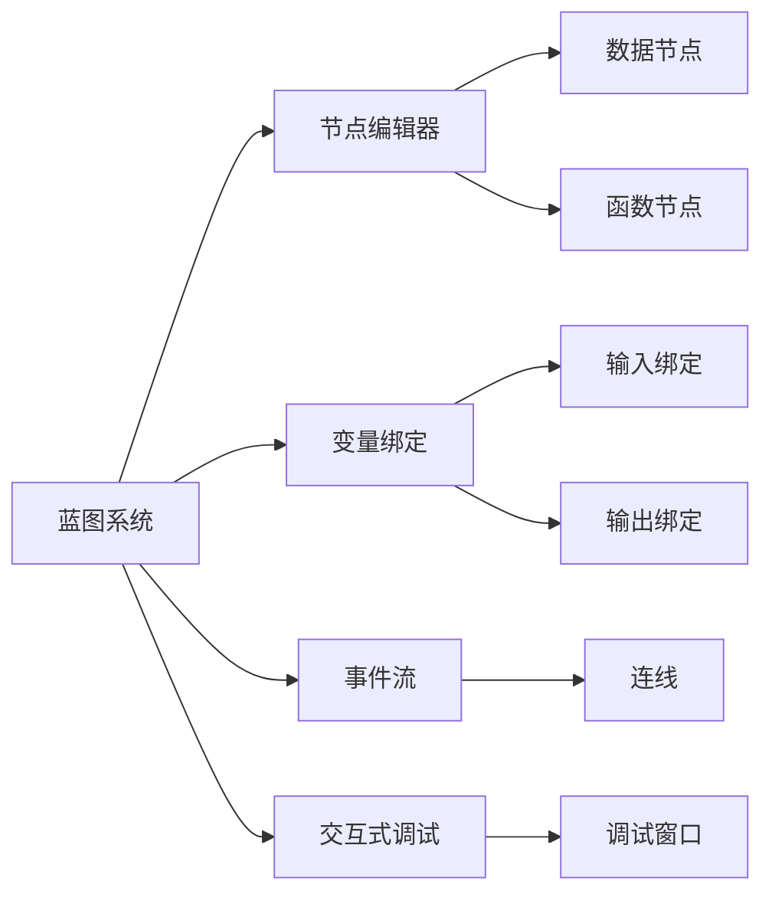
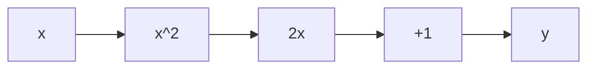
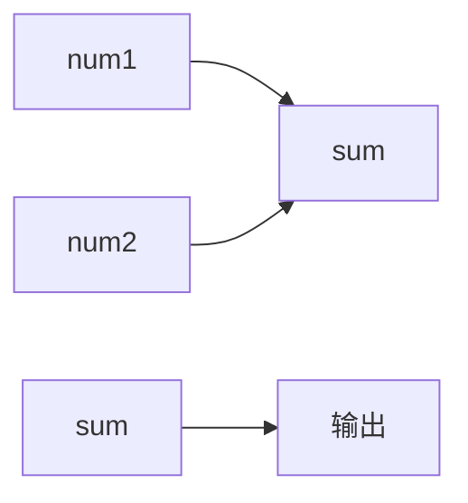

                 

# Unreal Engine 4：蓝图视觉化编程

> 关键词：Unreal Engine 4, 蓝图, 视觉化编程, 游戏开发, 动画设计

## 1. 背景介绍

### 1.1 问题由来
Unreal Engine 4（UE4）是Epic Games开发的一款先进的游戏引擎，支持大规模的游戏开发、动画制作和虚拟现实(VR)应用。它以其强大的功能和灵活性著称，广泛应用于影视、游戏、虚拟现实等多个领域。然而，UE4的编程接口（API）复杂性较高，入门门槛相对较高，尤其是对于初学者来说，学习和上手都非常困难。

为了降低编程门槛，提高开发效率，Unreal Engine 4引入了蓝图（Blueprint）系统。蓝图是一种基于视觉化的编程语言，开发者可以通过拖拽图形节点的方式创建功能，而无需编写代码。蓝图系统的出现极大地简化了开发过程，让编程变得直观且易于理解。

### 1.2 问题核心关键点
蓝图系统通过将编程逻辑图形化，使得开发人员能够以一种更加直观和高效的方式进行编程。通过将复杂的编程任务拆分成一系列可重用的图形节点，蓝图使得开发者无需具备扎实的编程知识，即可快速创建和调试功能模块。蓝图系统支持交互式调试、版本控制和团队协作，适用于各种类型的开发任务，包括但不限于游戏开发、动画制作和虚拟现实应用。

### 1.3 问题研究意义
Unreal Engine 4的蓝图系统对于推动游戏开发、动画制作和虚拟现实技术的发展具有重要意义：

1. 降低开发门槛。蓝图系统的出现使得非编程人员也能快速上手，缩短了开发周期，降低了项目成本。
2. 提高开发效率。通过将编程逻辑图形化，蓝图系统简化了复杂的编程任务，提高了开发效率。
3. 促进团队协作。蓝图系统支持版本控制和团队协作，使得多人开发更加高效和便捷。
4. 提升用户体验。通过蓝图系统，开发者可以创建更丰富、更自然的交互体验，提高用户满意度。
5. 推动技术创新。蓝图系统的灵活性和易用性为开发者提供了更多的创新空间，推动了游戏开发、动画制作和虚拟现实技术的不断进步。

## 2. 核心概念与联系

### 2.1 核心概念概述

为了更好地理解Unreal Engine 4的蓝图系统，本节将介绍几个核心概念及其相互联系：

- **蓝图（Blueprint）**：蓝图是Unreal Engine 4中的视觉化编程系统，开发者可以通过拖拽图形节点的方式创建功能。蓝图系统包括节点编辑器、节点库、变量绑定等组件，支持交互式调试、版本控制和团队协作。

- **节点（Node）**：节点是蓝图中的基本构建块，通常表示一种功能或行为。节点分为数据节点和函数节点，数据节点用于处理输入和输出数据，函数节点用于执行具体的编程逻辑。

- **图形节点编辑器**：节点编辑器是蓝图中的主要工具，开发者可以通过拖拽、连接节点的方式创建和调试功能模块。图形节点编辑器支持自动布局、快捷操作和可视化调试。

- **变量绑定**：变量绑定用于将节点的输入和输出与外部变量或函数绑定，使程序更加模块化和灵活。

- **事件流（Event Flow）**：事件流是蓝图中的关键概念，用于描述程序的执行顺序。事件流由一系列节点组成，节点之间通过连线连接，表示数据流向。

- **交互式调试**：蓝图系统支持交互式调试，开发者可以通过动态修改节点的输入和输出，实时观察程序的运行效果，快速定位问题。

这些核心概念之间通过图形化和编程化的方式紧密联系，共同构成了蓝图系统的框架。通过理解这些概念，我们可以更好地把握蓝图系统的功能和使用方法。

### 2.2 核心概念原理和架构的 Mermaid 流程图

这个流程图展示了蓝图系统的核心概念及其相互联系：

1. 蓝图系统由节点编辑器、变量绑定、事件流和交互式调试等组件组成。
2. 节点编辑器用于拖拽、连接节点，创建功能模块。
3. 变量绑定用于将节点的输入和输出与外部变量或函数绑定，提高程序模块化。
4. 事件流用于描述程序的执行顺序，通过连线连接节点，表示数据流向。
5. 交互式调试用于实时观察程序的运行效果，快速定位问题。

这些概念共同构成了蓝图系统的基础架构，使得开发者能够以一种更加直观和高效的方式进行编程。

## 3. 核心算法原理 & 具体操作步骤
### 3.1 算法原理概述

Unreal Engine 4的蓝图系统通过将编程逻辑图形化，使得开发者能够以一种更加直观和高效的方式进行编程。蓝图系统的核心原理包括：

1. **图形化编程**：开发者可以通过拖拽、连接节点的方式创建功能，而无需编写代码。

2. **模块化设计**：蓝图系统支持将复杂的编程任务拆分成一系列可重用的节点，提高开发效率。

3. **交互式调试**：蓝图系统支持交互式调试，开发者可以通过动态修改节点的输入和输出，实时观察程序的运行效果，快速定位问题。

4. **变量绑定**：变量绑定用于将节点的输入和输出与外部变量或函数绑定，使程序更加模块化和灵活。

5. **事件流**：事件流用于描述程序的执行顺序，通过连线连接节点，表示数据流向。

### 3.2 算法步骤详解

蓝图系统的工作流程可以分为以下几个步骤：

1. **创建蓝图**：在蓝图编辑器中创建一个新的蓝图项目，设置项目名称、类别和默认输入。

2. **添加节点**：在蓝图编辑器中添加所需的节点，拖拽并连接这些节点，形成一个完整的流程图。

3. **调试节点**：在运行环境中测试节点，通过交互式调试观察节点的运行效果，修改节点参数和连接，调整流程图。

4. **保存和导出**：保存蓝图项目，并导出为可执行的二进制文件或蓝图脚本。

5. **部署和发布**：将蓝图脚本部署到游戏引擎或其他应用程序中，并发布到目标平台。

### 3.3 算法优缺点

蓝图系统的优点包括：

1. **易学易用**：蓝图系统通过图形化编程方式降低了编程门槛，使得非编程人员也能快速上手。

2. **高效开发**：蓝图系统支持模块化设计，使得复杂任务可以拆分成可重用的节点，提高了开发效率。

3. **交互式调试**：蓝图系统支持交互式调试，使得开发者能够快速定位问题，提高调试效率。

4. **灵活性高**：蓝图系统支持变量绑定和事件流，使得程序设计更加灵活和模块化。

5. **团队协作**：蓝图系统支持版本控制和团队协作，使得多人开发更加高效和便捷。

蓝图系统的缺点包括：

1. **可视化限制**：虽然蓝图系统降低了编程门槛，但过于图形化的界面可能限制了编程的灵活性。

2. **调试复杂性**：虽然交互式调试提高了调试效率，但调试复杂逻辑时可能需要更多的调试时间和经验。

3. **性能问题**：某些复杂的蓝图脚本可能存在性能问题，需要进行优化。

4. **可读性差**：过长的蓝图脚本可能难以阅读和理解，需要进行模块化设计。

5. **学习曲线**：尽管蓝图系统降低了编程门槛，但学习蓝图系统的编程逻辑和调试技巧仍需一定的时间和经验。

### 3.4 算法应用领域

蓝图系统在多个领域中得到了广泛应用，包括但不限于：

- **游戏开发**：蓝图系统被广泛应用于游戏开发中，支持角色控制、动画制作、物理模拟等多种功能。

- **动画制作**：蓝图系统支持动画节点和事件流，使得动画制作变得更加高效和灵活。

- **虚拟现实（VR）**：蓝图系统支持VR设备和交互逻辑，使得VR应用开发更加便捷和自然。

- **实时渲染**：蓝图系统支持实时渲染和渲染管线，使得实时视觉效果更加逼真和流畅。

- **交互设计**：蓝图系统支持用户界面和交互逻辑，使得界面设计和交互效果更加自然和互动。

## 4. 数学模型和公式 & 详细讲解 & 举例说明

### 4.1 数学模型构建

蓝图系统的核心算法是图形化编程，不涉及复杂的数学模型。然而，为了更好地理解蓝图系统的原理和实现方式，我们可以通过一些简单的数学模型来类比说明。

假设我们有一个简单的数学表达式 $y = x^2 + 2x + 1$，我们可以将其转换为蓝图中的数据节点和函数节点，如下图所示：

这个模型中，A、B、C、D和E分别表示变量节点和函数节点，通过连线连接，表示数据流向。

### 4.2 公式推导过程

蓝图系统的核心算法是通过图形化编程方式实现数据流向和逻辑处理。其核心公式包括：

1. **数据流向**：数据节点通过连线连接，表示数据流向。数据流向可以类比数学中的变量赋值，例如 $x \rightarrow x^2$。

2. **逻辑处理**：函数节点执行具体的编程逻辑，例如 $y = x^2 + 2x + 1$。

3. **交互式调试**：通过交互式调试，开发者可以实时修改节点的输入和输出，观察程序的运行效果，例如在数学表达式中修改$x$的值，观察$y$的变化。

### 4.3 案例分析与讲解

以下是一个简单的蓝图系统案例，演示如何使用蓝图系统实现一个简单的数字求和器：

1. **创建蓝图项目**：在蓝图编辑器中创建一个新的蓝图项目，命名为“数字求和器”，设置项目类别为“Function”。

2. **添加节点**：添加三个数字输入节点，分别命名为“num1”、“num2”、“sum”，并将“sum”节点设置为输出节点。

3. **连接节点**：将“num1”节点的输出连接“sum”节点的输入，将“num2”节点的输出连接“sum”节点的输入，形成如下图所示的流程图：

4. **调试节点**：在运行环境中测试节点，通过交互式调试观察节点的运行效果，例如输入“num1”为2，“num2”为3，输出结果应为5。

5. **保存和导出**：保存蓝图项目，并导出为可执行的二进制文件或蓝图脚本。

6. **部署和发布**：将蓝图脚本部署到游戏引擎或其他应用程序中，并发布到目标平台。

## 5. 项目实践：代码实例和详细解释说明
### 5.1 开发环境搭建

在进行蓝图系统实践前，我们需要准备好开发环境。以下是使用Unreal Engine 4进行蓝图编程的环境配置流程：

1. 下载并安装Unreal Engine 4。从Unreal Engine官网下载最新版，并按照安装向导完成安装。

2. 创建并激活项目。在Unreal Engine中打开项目浏览器，创建一个新的项目，并激活项目。

3. 选择蓝图编辑器。在项目浏览器中，选择“Blueprint Editor”作为默认的编辑器。

4. 导入素材和资源。在项目浏览器中导入所需的素材和资源，如角色、场景、动画等。

5. 设置调试选项。在项目浏览器中，设置调试选项，包括断点设置、调试窗口显示等。

完成上述步骤后，即可在蓝图编辑器中进行蓝图系统开发。

### 5.2 源代码详细实现

以下是一个简单的蓝图系统代码实现，用于演示如何使用蓝图系统实现一个简单的数字求和器：

1. **创建蓝图项目**：在蓝图编辑器中创建一个新的蓝图项目，命名为“数字求和器”，设置项目类别为“Function”。

2. **添加节点**：添加三个数字输入节点，分别命名为“num1”、“num2”、“sum”，并将“sum”节点设置为输出节点。

3. **连接节点**：将“num1”节点的输出连接“sum”节点的输入，将“num2”节点的输出连接“sum”节点的输入，形成如下图所示的流程图：

4. **调试节点**：在运行环境中测试节点，通过交互式调试观察节点的运行效果，例如输入“num1”为2，“num2”为3，输出结果应为5。

5. **保存和导出**：保存蓝图项目，并导出为可执行的二进制文件或蓝图脚本。

6. **部署和发布**：将蓝图脚本部署到游戏引擎或其他应用程序中，并发布到目标平台。

### 5.3 代码解读与分析

让我们再详细解读一下关键代码的实现细节：

1. **创建蓝图项目**：在蓝图编辑器中创建一个新的蓝图项目，设置项目类别为“Function”，表示这是一个函数蓝图，用于执行特定功能的逻辑。

2. **添加节点**：添加三个数字输入节点，分别命名为“num1”、“num2”、“sum”，并将“sum”节点设置为输出节点。这些节点用于表示输入和输出的数据流向。

3. **连接节点**：将“num1”节点的输出连接“sum”节点的输入，将“num2”节点的输出连接“sum”节点的输入。通过这种方式，将两个数字输入求和，形成最终输出。

4. **调试节点**：在运行环境中测试节点，通过交互式调试观察节点的运行效果。在调试窗口中，可以修改节点的输入和输出，实时观察程序的运行效果。

5. **保存和导出**：保存蓝图项目，并导出为可执行的二进制文件或蓝图脚本。导出的蓝图脚本可以部署到其他项目或应用程序中，提高代码复用性。

6. **部署和发布**：将蓝图脚本部署到游戏引擎或其他应用程序中，并发布到目标平台。部署过程需要考虑平台兼容性、性能优化等因素。

## 6. 实际应用场景
### 6.1 智能交互系统

蓝图系统在智能交互系统中的应用非常广泛，可以用于开发各种智能应用，如智能客服、智能助手、智能推荐等。这些应用通过蓝图系统可以创建自然、流畅的用户界面和交互逻辑，提高用户体验。

在智能客服系统中，蓝图系统可以用于创建智能问答系统，自动识别用户意图并提供解决方案。在智能推荐系统中，蓝图系统可以用于创建个性化的推荐引擎，根据用户行为和偏好提供推荐内容。

### 6.2 虚拟现实（VR）应用

蓝图系统在虚拟现实应用中也有广泛的应用。通过蓝图系统，开发者可以创建沉浸式的虚拟现实环境，实现实时交互和动态内容生成。例如，在虚拟旅游应用中，蓝图系统可以用于创建逼真的景观和交互元素，提供自然、流畅的互动体验。

### 6.3 实时渲染和动画制作

蓝图系统支持实时渲染和动画制作，可以用于开发高性能的游戏和动态视觉效果。例如，在实时渲染应用中，蓝图系统可以用于创建高效渲染管线，实现逼真的动态场景和视觉效果。在动画制作应用中，蓝图系统可以用于创建逼真的动画节点和动画控制逻辑，提高动画制作的效率和质量。

### 6.4 未来应用展望

随着蓝图系统的不断发展和完善，其应用场景将更加广泛和深入。未来，蓝图系统有望在以下几个领域取得更大的突破：

1. **增强现实（AR）和混合现实（MR）**：蓝图系统可以用于开发增强现实和混合现实应用，实现虚拟元素和现实环境的融合，提供更丰富、更自然的互动体验。

2. **自动化设计**：蓝图系统可以用于自动化设计流程，实现自动生成和优化设计方案，提高设计效率和质量。

3. **实时数据处理**：蓝图系统可以用于实时数据处理和分析，实现高效的数据可视化和大数据分析。

4. **智能交通**：蓝图系统可以用于智能交通系统的开发，实现智能导航、实时监控等功能，提高交通管理效率和安全性。

5. **健康医疗**：蓝图系统可以用于开发健康医疗应用，实现智能诊断、个性化治疗等功能，提高医疗服务水平。

## 7. 工具和资源推荐
### 7.1 学习资源推荐

为了帮助开发者系统掌握蓝图系统的理论基础和实践技巧，这里推荐一些优质的学习资源：

1. **Unreal Engine官方文档**：Unreal Engine官网提供了详细的蓝图系统文档和示例代码，是学习蓝图系统的必备资源。

2. **《Unreal Engine 4 Blueprints Visual Scripting》书籍**：这本书由Unreal Engine官方认证，系统介绍了蓝图系统的原理和实现方法，是学习蓝图系统的经典教材。

3. **Udemy《Unreal Engine 4 Blueprint Visual Scripting》课程**：这是一门由Unreal Engine官方认证的在线课程，系统讲解了蓝图系统的核心概念和实践技巧，适合初学者入门。

4. **YouTube《Unreal Engine 4 Blueprints》频道**：该频道提供了大量的蓝图系统教程和实战案例，适合通过视频学习。

5. **Unreal Engine开发者社区**：开发者社区是学习蓝图系统的绝佳资源，开发者可以分享经验和代码，解决问题。

通过对这些资源的学习实践，相信你一定能够快速掌握蓝图系统的精髓，并用于解决实际的开发问题。

### 7.2 开发工具推荐

高效的开发离不开优秀的工具支持。以下是几款用于蓝图系统开发的常用工具：

1. **Unreal Engine 4**：Unreal Engine 4是蓝图系统的主要开发平台，提供了强大的功能和丰富的资源库。

2. **Visual Studio**：Visual Studio是Unreal Engine 4的官方IDE，提供了丰富的开发工具和调试功能。

3. **GitLab**：GitLab是一个流行的版本控制系统，支持蓝图项目的版本管理和协作开发。

4. **Code Collaborator**：Code Collaborator是Unreal Engine 4的官方协作工具，支持多人协作编辑蓝图项目。

5. **Unreal Editor**：Unreal Editor是蓝图系统的可视化编辑器，支持拖拽、连接节点，创建功能模块。

合理利用这些工具，可以显著提升蓝图系统开发效率，加快创新迭代的步伐。

### 7.3 相关论文推荐

蓝图系统的研究和应用源于学界的持续研究。以下是几篇奠基性的相关论文，推荐阅读：

1. **“A Survey of Visual Programming Languages”**：这篇综述论文全面介绍了视觉化编程语言的发展历程和应用领域，是理解蓝图系统的理论基础。

2. **“The Impact of Visual Programming Languages on Programming Education”**：这篇论文探讨了视觉化编程语言对编程教育的影响，提供了宝贵的经验和建议。

3. **“Blueprints for High-Level Computation and Reasoning in Interfaces”**：这篇论文探讨了视觉化编程语言在用户界面中的运用，提供了创新的思路和方法。

4. **“Blueprints for Program Understanding and Maintenance”**：这篇论文探讨了视觉化编程语言对程序理解维护的影响，提供了实用的建议和工具。

这些论文代表了大规模蓝图系统的研究和应用进展，为蓝图系统的进一步发展和完善提供了重要参考。

## 8. 总结：未来发展趋势与挑战
### 8.1 总结

本文对Unreal Engine 4的蓝图系统进行了全面系统的介绍。首先阐述了蓝图系统的背景和研究意义，明确了蓝图系统在降低编程门槛、提高开发效率、支持团队协作等方面的独特价值。其次，从原理到实践，详细讲解了蓝图系统的核心概念和操作步骤，给出了蓝图系统开发的具体代码实例。同时，本文还广泛探讨了蓝图系统在智能交互系统、虚拟现实、实时渲染等众多领域的应用前景，展示了蓝图系统的巨大潜力。此外，本文精选了蓝图系统的各类学习资源，力求为读者提供全方位的技术指引。

通过本文的系统梳理，可以看到，蓝图系统通过将编程逻辑图形化，使得开发者能够以一种更加直观和高效的方式进行编程。蓝图系统的应用不仅降低了开发门槛，提高了开发效率，还支持团队协作和版本控制，为游戏开发、动画制作、虚拟现实应用等带来了革命性的变革。未来，伴随蓝图系统的不断演进，其应用场景将更加广泛和深入，为人工智能技术在垂直行业的规模化落地提供了新的思路和方向。

### 8.2 未来发展趋势

展望未来，蓝图系统将呈现以下几个发展趋势：

1. **更加灵活的节点系统**：未来蓝图系统将支持更加灵活和模块化的节点设计，使得开发者能够更自由地组合和重用节点。

2. **智能调试工具**：蓝图系统将引入更多智能调试工具，如自动补全、代码提示、代码重构等，提高开发效率和代码质量。

3. **跨平台支持**：蓝图系统将支持更多平台，包括Web、移动端、桌面端等，实现跨平台开发。

4. **虚拟现实（VR）和增强现实（AR）**：蓝图系统将进一步拓展VR和AR应用，实现更加逼真和互动的用户体验。

5. **自动化设计和生成**：蓝图系统将支持更多自动化设计和生成工具，实现自动生成和优化设计方案，提高设计效率和质量。

6. **实时数据处理和分析**：蓝图系统将支持实时数据处理和分析，实现高效的数据可视化和大数据分析。

这些趋势凸显了蓝图系统的强大潜力和广阔前景，预示着未来蓝图系统将在更多领域得到应用，为人工智能技术的发展提供新的动力。

### 8.3 面临的挑战

尽管蓝图系统已经取得了瞩目成就，但在迈向更加智能化、普适化应用的过程中，仍面临诸多挑战：

1. **编程复杂性**：虽然蓝图系统降低了编程门槛，但复杂的编程逻辑仍需要开发者具备一定的编程基础和经验。

2. **性能瓶颈**：某些复杂的蓝图脚本可能存在性能问题，需要进行优化。

3. **可读性差**：过长的蓝图脚本可能难以阅读和理解，需要进行模块化设计。

4. **版本控制和协作**：蓝图系统需要支持版本控制和团队协作，这对于大规模团队开发来说仍是一大挑战。

5. **学习曲线**：尽管蓝图系统降低了编程门槛，但学习蓝图系统的编程逻辑和调试技巧仍需一定的时间和经验。

6. **跨平台兼容性**：蓝图系统需要支持更多平台，跨平台开发和部署仍需更多优化和改进。

正视蓝图系统面临的这些挑战，积极应对并寻求突破，将是蓝图系统走向成熟的必由之路。相信随着学界和产业界的共同努力，这些挑战终将一一被克服，蓝图系统必将在构建人机协同的智能时代中扮演越来越重要的角色。

### 8.4 研究展望

面对蓝图系统面临的种种挑战，未来的研究需要在以下几个方面寻求新的突破：

1. **引入更多编程概念**：蓝图系统需要在现有图形化编程基础上，引入更多编程概念和语法，提高编程灵活性和可读性。

2. **优化性能和资源占用**：蓝图系统需要进一步优化性能和资源占用，使得复杂的蓝图脚本能够高效运行。

3. **增强跨平台支持**：蓝图系统需要支持更多平台，实现跨平台开发和部署。

4. **引入更多智能工具**：蓝图系统需要引入更多智能工具，如自动补全、代码提示、代码重构等，提高开发效率和代码质量。

5. **支持实时数据处理和分析**：蓝图系统需要支持实时数据处理和分析，实现高效的数据可视化和大数据分析。

6. **引入更多先验知识**：蓝图系统需要引入更多先验知识，如知识图谱、逻辑规则等，与神经网络模型进行融合，提升模型的智能水平。

这些研究方向将进一步拓展蓝图系统的应用边界，推动蓝图系统向更高的台阶发展，为人工智能技术的普及和应用提供新的思路和方向。

## 9. 附录：常见问题与解答

**Q1：蓝图系统和代码编程有什么区别？**

A: 蓝图系统是一种图形化编程方式，开发者可以通过拖拽、连接节点的方式创建功能，而无需编写代码。代码编程则是传统的编程方式，开发者需要编写具体的代码实现功能逻辑。蓝图系统通过图形化编程方式降低了编程门槛，使得非编程人员也能快速上手，但过于图形化的界面可能限制了编程的灵活性。

**Q2：如何高效利用蓝图系统进行编程？**

A: 高效利用蓝图系统进行编程需要掌握以下几个要点：

1. **模块化设计**：将复杂的编程任务拆分成可重用的节点，提高开发效率和代码复用性。

2. **交互式调试**：通过交互式调试，实时修改节点的输入和输出，观察程序的运行效果，快速定位问题。

3. **版本控制和协作**：蓝图系统需要支持版本控制和团队协作，提高代码管理和开发效率。

4. **优化性能和资源占用**：优化蓝图脚本的性能和资源占用，使得复杂的蓝图脚本能够高效运行。

5. **引入更多编程概念**：蓝图系统需要在现有图形化编程基础上，引入更多编程概念和语法，提高编程灵活性和可读性。

**Q3：蓝图系统是否支持复杂逻辑处理？**

A: 蓝图系统支持复杂的逻辑处理，但某些复杂的逻辑可能需要多个节点组合实现。例如，在实现复杂的数学函数时，可能需要多个函数节点组合实现。蓝图系统提供了丰富的节点库和函数库，开发者可以根据实际需求选择合适的节点和函数，实现复杂的逻辑处理。

**Q4：蓝图系统是否支持实时数据处理？**

A: 蓝图系统支持实时数据处理和分析，可以实现高效的数据可视化和大数据分析。例如，在实时渲染应用中，蓝图系统可以用于创建实时渲染管线，实现动态效果的生成。在实时数据处理应用中，蓝图系统可以用于实现数据的实时采集、处理和分析，提供更加灵活和高效的数据处理方式。

**Q5：蓝图系统是否支持跨平台开发？**

A: 蓝图系统支持跨平台开发，可以运行在PC、移动设备、Web等多个平台上。通过蓝图系统，开发者可以创建跨平台的统一接口和逻辑，实现跨平台开发和部署。

这些问题的解答，相信能帮助你更好地理解和使用蓝图系统，拓展其在多个领域的应用。

