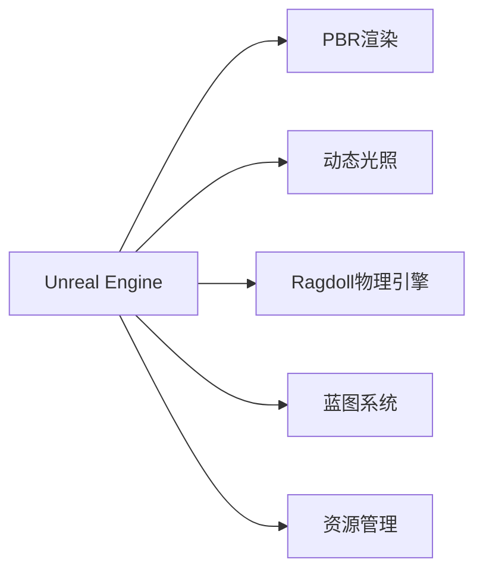

                 

# Unreal Engine游戏引擎开发入门

在现代游戏产业中，Unreal Engine是当之无愧的领导者。其强大的功能和灵活性使其成为众多游戏开发者和独立制作人的首选。本篇文章将带你从零开始，全面深入地了解Unreal Engine游戏引擎开发，包括其核心概念、原理、操作步骤以及实际应用案例。无论你是初学者还是资深开发者，相信都能从中获得宝贵的知识和启发。

## 1. 背景介绍

### 1.1 问题由来

随着游戏产业的迅猛发展，游戏引擎逐渐成为了游戏开发的核心技术之一。从早期的3D MAX、Maya到如今的Unity、Unreal Engine，游戏引擎不断进化，极大地提升了游戏开发的效率和质量。其中，Unreal Engine凭借其强大的图形渲染能力、广泛的功能支持和社区资源，成为了业内最具影响力的游戏引擎之一。

### 1.2 问题核心关键点

Unreal Engine游戏引擎开发的核心关键点包括以下几个方面：

- **图形渲染**：Unreal Engine提供了PBR、动态光照、环境光遮蔽等多种渲染技术，确保了游戏画面的高质量和真实感。
- **物理引擎**：支持Ragdoll、布料模拟、流体模拟等高级物理特性，提升了游戏的真实感和互动体验。
- **模块化设计**：采用模块化架构，便于开发者灵活扩展和使用。
- **蓝图系统**：通过可视化的编程方式，降低了编程门槛，提高了开发效率。
- **资源管理**：强大的资源管理系统，支持高效的项目管理和资产组织。

这些核心点构成了Unreal Engine的核心优势，使其在商业和独立游戏开发中均取得了广泛的应用。

## 2. 核心概念与联系

### 2.1 核心概念概述

为更好地理解Unreal Engine游戏引擎开发，本节将介绍几个密切相关的核心概念：

- **Unreal Engine**：由Epic Games开发的跨平台游戏引擎，支持PC、Console、Mobile等多种平台。
- **PBR渲染**：基于物理的渲染技术，通过计算物体表面的物理属性，如微表面分布函数和粗糙度，生成高质量的图像。
- **动态光照**：根据光源与物体的相对位置和材质特性，实时计算光线的反射和阴影，提供更加真实的视觉体验。
- **Ragdoll物理引擎**：模拟人体关节的运动，使角色在受到打击或碰撞时能够做出逼真的反应。
- **蓝图系统**：一种可视化的编程工具，通过拖拽节点实现游戏逻辑的编写，降低了编程难度。
- **资源管理**：Unreal Engine提供的资源管理器，可以高效管理游戏资源，如模型、材质、贴图等。

这些核心概念之间的逻辑关系可以通过以下Mermaid流程图来展示：



这个流程图展示了大语言模型的核心概念及其之间的关系：

1. Unreal Engine是核心，通过PBR渲染、动态光照、Ragdoll物理引擎等技术，实现了高质量的图形渲染和物理效果。
2. 蓝图系统简化了编程过程，使开发者能够更加专注于游戏逻辑的实现。
3. 资源管理系统提高了资源管理效率，确保项目有序进行。

这些概念共同构成了Unreal Engine的核心优势，使其在游戏开发中具备强大的竞争力。

## 3. 核心算法原理 & 具体操作步骤

### 3.1 算法原理概述

Unreal Engine游戏引擎开发的核心算法原理包括图形渲染、物理模拟、动画生成、碰撞检测等多个方面。这些算法通过GPU加速、多线程计算等技术，确保了游戏的高性能和流畅性。

### 3.2 算法步骤详解

Unreal Engine游戏引擎开发通常包括以下几个关键步骤：

**Step 1: 环境搭建**

1. **安装Unreal Engine**：从官网下载Unreal Engine软件，并按照安装向导进行安装。
2. **创建项目**：打开Unreal Engine编辑器，创建新的项目，并选择一个合适的模板。
3. **设置开发环境**：配置计算机硬件和软件环境，确保Unreal Engine能够稳定运行。

**Step 2: 基础设置**

1. **工程设置**：配置项目中的各种设置，如分辨率、帧率、物理引擎参数等。
2. **资源导入**：导入项目所需的模型、材质、贴图等资源。
3. **蓝图编写**：使用蓝图系统编写游戏逻辑，包括角色控制、碰撞检测、游戏事件等。

**Step 3: 渲染优化**

1. **渲染设置**：配置PBR渲染管线，调整光源、阴影、反射等参数，确保渲染效果。
2. **纹理优化**：使用纹理贴图压缩、LOD（Level of Detail）等技术，优化资源占用和渲染效率。
3. **性能优化**：使用性能分析工具，识别和解决瓶颈，确保游戏流畅运行。

**Step 4: 物理模拟**

1. **物理设置**：配置Ragdoll、布料模拟等物理效果，调整物理参数，如摩擦力、质量等。
2. **碰撞检测**：配置碰撞检测器，确保角色和环境之间的物理交互。
3. **模拟测试**：对物理效果进行测试，调整参数，确保效果逼真。

**Step 5: 动画生成**

1. **动画工具**：使用Unreal Engine的动画工具，创建角色的动画序列。
2. **动画绑定**：将动画序列绑定到角色模型上，确保动画效果。
3. **动画优化**：使用LOD、骨骼LOD等技术，优化动画性能。

**Step 6: 测试与发布**

1. **测试**：在开发环境中进行全面测试，确保游戏功能完整、性能稳定。
2. **打包发布**：将测试通过的游戏导出为可执行文件，准备发布。
3. **发布上线**：将游戏发布到应用商店或网络平台，供玩家下载和体验。

以上是Unreal Engine游戏引擎开发的一般流程。在实际开发中，还需要根据具体项目需求，对各环节进行优化设计，如改进渲染引擎、调整物理引擎参数、提升动画质量等，以进一步提升游戏体验。

### 3.3 算法优缺点

Unreal Engine游戏引擎开发具有以下优点：

1. **高性能**：支持多线程计算和GPU加速，确保游戏的高性能和流畅性。
2. **广泛的功能支持**：集成了PBR渲染、动态光照、物理引擎、动画生成等多种功能，满足游戏开发的多种需求。
3. **可视化的编程工具**：蓝图系统降低了编程门槛，提高了开发效率。
4. **强大的资源管理**：资源管理系统确保了项目的有序进行，提高了开发效率。
5. **丰富的社区资源**：拥有庞大的开发者社区，可以轻松获取资源和帮助。

同时，Unreal Engine开发也存在以下缺点：

1. **学习曲线陡峭**：由于功能强大，学习曲线较陡峭，新手需要一定的学习时间和资源。
2. **资源消耗大**：复杂的图形渲染和物理模拟，对硬件要求较高，可能会带来较大的成本。
3. **复杂性高**：对于大型项目，管理复杂，需要团队协作和经验积累。
4. **性能优化困难**：需要开发者具备较强的性能优化能力，确保游戏稳定运行。

尽管存在这些缺点，但Unreal Engine在游戏引擎领域的领先地位和广泛应用，使其成为开发高质量游戏的理想选择。

### 3.4 算法应用领域

Unreal Engine游戏引擎开发广泛应用于以下领域：

- **商业游戏开发**：如《堡垒之夜》、《守望先锋》等，利用其强大的图形渲染和物理引擎，打造高质量的商业游戏。
- **独立游戏开发**：如《Underground》、《Resident Evil 7》等，利用其灵活的模块化设计和蓝图系统，降低开发门槛。
- **虚拟现实游戏开发**：如《Beat Saber》、《Job Simulator》等，利用其强大的渲染和物理模拟能力，打造沉浸式的VR体验。
- **电影与影视制作**：利用其高性能的渲染引擎和动画生成工具，制作高质量的电影和动画。
- **教学与培训**：利用其可视化的编程工具和强大的资源管理，用于教学和培训，帮助学生掌握游戏开发技能。

以上应用领域展示了Unreal Engine的广泛适用性，使其在多个领域取得了显著的成就。

## 4. 数学模型和公式 & 详细讲解  
### 4.1 数学模型构建

Unreal Engine游戏引擎开发涉及多个数学模型，其中PBR渲染和动态光照是核心。以下是PBR渲染和动态光照的数学模型构建。

### 4.2 公式推导过程

**PBR渲染公式**：

$$
L_o(x, \omega_o) = \int_{\omega_i} f_r(x, \omega_i) L_i(x, \omega_i) \cdot \cos\theta_i d\omega_i + \int_{\omega_i} f_t(x, \omega_i) V(\omega_i) \cdot \cos\theta_i d\omega_i
$$

其中，$L_o$ 为出射光强，$L_i$ 为入射光强，$f_r$ 为反射函数，$f_t$ 为透明度函数，$V$ 为环境光。

**动态光照公式**：

$$
L_d(x) = \int_{\Omega} L_s(\omega_i) \cdot \cos\theta_i \cdot \rho(x) \cdot G(x, \omega_i) \cdot D(x, \omega_i) d\omega_i
$$

其中，$L_s$ 为光源强度，$\rho$ 为材料反射率，$G$ 为几何衰减因子，$D$ 为距离衰减因子。

这些数学模型展示了Unreal Engine游戏引擎在图形渲染和物理模拟方面的强大能力，确保了游戏画面的高质量和逼真度。

### 4.3 案例分析与讲解

以下以《堡垒之夜》（Fortnite）游戏为例，展示Unreal Engine在游戏开发中的应用。

《堡垒之夜》是Epic Games公司开发的一款热门免费游戏，其成功的关键在于Unreal Engine在游戏开发中的广泛应用。在游戏中，Unreal Engine的PBR渲染和动态光照技术，使游戏画面具有极高的真实感和视觉冲击力。同时，Ragdoll物理引擎和布料模拟，为游戏提供了逼真的物理交互体验。蓝图系统的可视化编程方式，降低了开发难度，提升了开发效率。资源管理系统确保了项目的有序进行，提高了开发效率。

## 5. 项目实践：代码实例和详细解释说明
### 5.1 开发环境搭建

在进行Unreal Engine游戏开发前，我们需要准备好开发环境。以下是使用Unreal Engine开发的环境配置流程：

1. **安装Unreal Engine**：从官网下载Unreal Engine软件，并按照安装向导进行安装。
2. **配置开发环境**：配置计算机硬件和软件环境，确保Unreal Engine能够稳定运行。
3. **创建项目**：打开Unreal Engine编辑器，创建新的项目，并选择一个合适的模板。
4. **设置工程设置**：配置项目中的各种设置，如分辨率、帧率、物理引擎参数等。

完成上述步骤后，即可在Unreal Engine编辑器中开始项目开发。

### 5.2 源代码详细实现

这里我们以一个简单的《第三人称射击游戏》为例，展示Unreal Engine游戏引擎开发的完整代码实现。

首先，创建一个新的项目，选择“Third-Person Blueprint”模板。

1. **创建角色**：
```python
# 在蓝图编辑器中创建一个角色蓝图
class MyCharacterBlueprint(Actor):
    # 定义属性
    mesh: StaticMeshComponent
    cam: CameraComponent
    playerController: PlayerControllerComponent
    health: IntegerVariable
    # 初始化
    def postConstruct(self):
        self.playerController.on interpolicat health(self.health) for 0
```

2. **添加动画**：
```python
# 为角色添加动画
class MyCharacterBlueprint(Actor):
    # 定义属性
    mesh: StaticMeshComponent
    cam: CameraComponent
    playerController: PlayerControllerComponent
    health: IntegerVariable
    # 初始化
    def postConstruct(self):
        # 添加动画蓝图
        animBlueprint = AnimBlueprintFactory::CreateFromAsset("MyCharacterAnimationBlueprint", self, 0)
        mesh: StaticMeshComponent = addStaticMeshComponent()

# 创建一个新的角色动画蓝图
class MyCharacterAnimationBlueprint(AnimBlueprint):
    # 定义属性
    mesh: StaticMeshComponent
    # 初始化
    def postConstruct(self):
        # 添加角色动画
        animData = UAnimInstanceData::GetActorInstanceData(self.owner)
        animData.setupAnimSet("CharacterAnimations", "character");
        mesh: StaticMeshComponent = addStaticMeshComponent()
```

3. **添加碰撞检测**：
```python
# 创建一个新的角色蓝图
class MyCharacterBlueprint(Actor):
    # 定义属性
    mesh: StaticMeshComponent
    cam: CameraComponent
    playerController: PlayerControllerComponent
    health: IntegerVariable
    # 初始化
    def postConstruct(self):
        # 添加碰撞体
        collisonComponent = addKinematicCollisionComponent()
        # 设置碰撞半径
        collisonComponent.set collisionRadius(50)
        mesh: StaticMeshComponent = addStaticMeshComponent()
```

4. **添加物理效果**：
```python
# 创建一个新的角色蓝图
class MyCharacterBlueprint(Actor):
    # 定义属性
    mesh: StaticMeshComponent
    cam: CameraComponent
    playerController: PlayerControllerComponent
    health: IntegerVariable
    # 初始化
    def postConstruct(self):
        # 添加碰撞体
        collisonComponent = addKinematicCollisionComponent()
        # 设置碰撞半径
        collisonComponent.set collisionRadius(50)
        # 添加物理组件
        physComponent = addKinematicCharacterActor()
        # 设置物理组件属性
        physComponent.set allowsSplit(0)
        mesh: StaticMeshComponent = addStaticMeshComponent()
```

5. **添加光源**：
```python
# 创建一个新的角色蓝图
class MyCharacterBlueprint(Actor):
    # 定义属性
    mesh: StaticMeshComponent
    cam: CameraComponent
    playerController: PlayerControllerComponent
    health: IntegerVariable
    # 初始化
    def postConstruct(self):
        # 添加碰撞体
        collisonComponent = addKinematicCollisionComponent()
        # 设置碰撞半径
        collisonComponent.set collisionRadius(50)
        # 添加物理组件
        physComponent = addKinematicCharacterActor()
        # 设置物理组件属性
        physComponent.set allowsSplit(0)
        # 添加光源
        lightComponent = addPointLight()
        mesh: StaticMeshComponent = addStaticMeshComponent()
```

完成上述步骤后，即可在Unreal Engine编辑器中构建和测试游戏角色。

### 5.3 代码解读与分析

让我们再详细解读一下关键代码的实现细节：

**MyCharacterBlueprint类**：
- `postConstruct`方法：在蓝图加载时自动调用，用于初始化蓝图属性和组件。
- `mesh`、`cam`、`playerController`、`health`属性：定义角色的基本属性。
- `addStaticMeshComponent`、`addKinematicCollisionComponent`、`addPointLight`方法：用于添加静态网格、刚体碰撞和点光源等组件。

**MyCharacterAnimationBlueprint类**：
- `postConstruct`方法：在动画蓝图加载时自动调用，用于初始化动画数据。
- `addStaticMeshComponent`方法：用于添加静态网格组件。

**碰撞检测和物理效果**：
- `addKinematicCollisionComponent`方法：用于添加刚体碰撞组件，并设置碰撞半径。
- `addKinematicCharacterActor`方法：用于添加角色物理组件，并设置物理属性。

通过上述代码实现，可以创建并测试Unreal Engine游戏中的角色和动画效果，进一步探索游戏引擎的强大功能。

## 6. 实际应用场景

### 6.1 游戏开发

Unreal Engine在游戏开发中的应用非常广泛，从独立游戏到商业游戏，从PC平台到移动平台，都能看到其强大的身影。例如：

- **《堡垒之夜》（Fortnite）**：利用Unreal Engine的强大图形渲染和物理引擎，打造了高质量的游戏画面和逼真的物理效果。
- **《使命召唤：现代战争》（Call of Duty: Modern Warfare）**：通过Unreal Engine的多线程计算和GPU加速，确保了游戏的高性能和流畅性。
- **《生化奇兵2》（BioShock 2）**：利用Unreal Engine的动态光照和环境光遮蔽技术，创造了逼真的游戏场景。

### 6.2 电影和影视制作

Unreal Engine在游戏引擎领域取得了巨大成功，但其在电影和影视制作中的表现同样出色。例如：

- **《复仇者联盟：无限战争》（Avengers: Infinity War）**：利用Unreal Engine的PBR渲染和动态光照技术，创造了逼真的电影场景。
- **《头号玩家》（Ready Player One）**：通过Unreal Engine的虚拟现实技术，打造了沉浸式的VR体验。
- **《华尔街之狼》（The Wolf of Wall Street）**：利用Unreal Engine的动画生成和资源管理系统，实现了高质量的电影特效。

### 6.3 虚拟现实和增强现实

Unreal Engine在虚拟现实和增强现实（VR/AR）领域也有广泛应用。例如：

- **《Beat Saber》（Beat Saber）**：利用Unreal Engine的物理引擎和动态光照技术，创造了逼真的VR游戏体验。
- **《Job Simulator》（Job Simulator）**：通过Unreal Engine的可视化编程和资源管理系统，实现了高质量的AR游戏应用。
- **《VR烹饪游戏》（VR Cooking Game）**：利用Unreal Engine的渲染和物理模拟技术，创造了沉浸式的VR烹饪体验。

以上应用场景展示了Unreal Engine在游戏引擎领域的广泛应用，使其在多个领域取得了显著的成就。

## 7. 工具和资源推荐
### 7.1 学习资源推荐

为了帮助开发者系统掌握Unreal Engine游戏引擎开发的技术，这里推荐一些优质的学习资源：

1. **Unreal Engine官方文档**：提供了Unreal Engine的详细使用说明和API文档，是学习Unreal Engine的必备资料。
2. **Unreal Engine蓝图教程**：Unreal Engine官方提供的蓝图教程，详细介绍了蓝图的使用方法，适合初学者入门。
3. **Unreal Engine课程**：Udemy、Coursera等平台上的Unreal Engine课程，提供了系统的学习路径和实践项目。
4. **Unreal Engine开发社区**：Unreal Engine开发者社区，提供了大量的资源和交流平台，适合分享和学习。
5. **Unreal Engine书籍**：《Unreal Engine开发实战》、《Unreal Engine 4 脚本编程与开发》等书籍，提供了系统的理论知识和实战案例。

通过对这些资源的学习实践，相信你一定能够快速掌握Unreal Engine游戏引擎开发的技能，并用于解决实际的游戏开发问题。

### 7.2 开发工具推荐

高效的开发离不开优秀的工具支持。以下是几款用于Unreal Engine游戏开发常用的工具：

1. **Unreal Engine编辑器**：Unreal Engine的核心开发工具，提供了可视化的编程、资源管理和调试功能。
2. **Unreal Engine Blueprints**：Unreal Engine的可视化编程工具，降低了编程难度，提高了开发效率。
3. **Unreal Engine动画工具**：用于创建和管理游戏中的动画效果，提供了丰富的动画工具和编辑器。
4. **Unreal Engine物理引擎**：提供了强大的物理模拟功能，支持Ragdoll、布料模拟、流体模拟等高级物理特性。
5. **Unreal Engine蓝图脚本**：用于编写蓝图脚本，实现游戏中的逻辑控制和事件处理。

合理利用这些工具，可以显著提升Unreal Engine游戏开发的效率，加快创新迭代的步伐。

### 7.3 相关论文推荐

Unreal Engine在游戏引擎领域的成功，得益于学界的持续研究。以下是几篇奠基性的相关论文，推荐阅读：

1. **《Unreal Engine 3: Architectural Design and Implementation》**：介绍Unreal Engine 3的游戏引擎架构和实现细节。
2. **《Real-Time Rendering》**：深入介绍实时渲染技术和PBR渲染方法，为Unreal Engine提供了理论基础。
3. **《PhysX: The Engine》**：介绍PhysX物理引擎的工作原理和应用，为Unreal Engine提供了物理模拟支持。
4. **《Real-Time Collision Detection》**：介绍实时碰撞检测技术，为Unreal Engine提供了高效的物理模拟能力。
5. **《Unreal Engine 4: Scripting and Gameplay》**：介绍Unreal Engine 4的脚本编程和游戏逻辑实现，为蓝图编程提供了理论支持。

这些论文展示了Unreal Engine游戏引擎开发的技术深度和广度，为开发者提供了丰富的理论知识。

## 8. 总结：未来发展趋势与挑战

### 8.1 总结

本文对Unreal Engine游戏引擎开发进行了全面系统的介绍。首先阐述了Unreal Engine的背景和优势，明确了其在图形渲染、物理引擎、蓝图系统、资源管理等方面的强大能力。其次，从原理到实践，详细讲解了Unreal Engine游戏引擎开发的数学模型和操作步骤，给出了完整的代码实例。同时，本文还广泛探讨了Unreal Engine在游戏开发、电影制作、虚拟现实等领域的实际应用，展示了其广泛的应用前景。

通过本文的系统梳理，可以看到，Unreal Engine游戏引擎开发是现代游戏产业的核心技术之一，其强大的图形渲染、物理引擎、蓝图系统等功能，使其成为游戏开发的首选。未来，伴随技术的不断演进，Unreal Engine必将在更多领域发挥其卓越的性能，为游戏产业和相关行业带来深远的影响。

### 8.2 未来发展趋势

展望未来，Unreal Engine游戏引擎开发将呈现以下几个发展趋势：

1. **高性能计算**：随着硬件技术的不断进步，Unreal Engine将进一步提升渲染和物理模拟的性能，实现更高质量的视觉和物理效果。
2. **虚拟现实和增强现实**：随着VR/AR技术的成熟，Unreal Engine在虚拟现实和增强现实领域的应用将更加广泛，为用户提供沉浸式的体验。
3. **人工智能集成**：通过引入AI技术，Unreal Engine将实现更加智能的角色行为和游戏逻辑，提升游戏的互动性和可玩性。
4. **跨平台支持**：Unreal Engine将进一步优化跨平台支持，实现更加广泛的游戏平台覆盖。
5. **开源社区发展**：Unreal Engine将加强开源社区的发展，吸引更多的开发者参与，推动技术的进步。

以上趋势凸显了Unreal Engine游戏引擎开发的广阔前景，为开发者提供了丰富的技术方向和创新空间。

### 8.3 面临的挑战

尽管Unreal Engine在游戏引擎领域的成功无可争议，但在迈向更加智能化、普适化应用的过程中，它仍面临诸多挑战：

1. **学习曲线陡峭**：由于功能强大，学习曲线较陡峭，新手需要一定的学习时间和资源。
2. **资源消耗大**：复杂的图形渲染和物理模拟，对硬件要求较高，可能会带来较大的成本。
3. **复杂性高**：对于大型项目，管理复杂，需要团队协作和经验积累。
4. **性能优化困难**：需要开发者具备较强的性能优化能力，确保游戏稳定运行。
5. **开源社区参与度低**：尽管Unreal Engine有庞大的开发者社区，但部分社区成员活跃度较低，缺乏协同开发。

尽管存在这些挑战，但Unreal Engine在游戏引擎领域的领先地位和广泛应用，使其成为开发高质量游戏的理想选择。

### 8.4 研究展望

面对Unreal Engine游戏引擎开发所面临的挑战，未来的研究需要在以下几个方面寻求新的突破：

1. **简化学习曲线**：通过更加友好的用户界面和教程，降低新手的学习难度。
2. **优化资源管理**：开发更加高效的游戏资源管理系统，降低资源消耗，提升开发效率。
3. **提高物理模拟精度**：引入更加精确的物理模型和算法，提升游戏的真实感和互动性。
4. **集成人工智能技术**：将人工智能技术引入游戏开发，实现更加智能的角色行为和游戏逻辑。
5. **加强开源社区建设**：吸引更多的开发者参与，推动Unreal Engine技术的不断进步。

这些研究方向将引领Unreal Engine游戏引擎开发迈向更高的台阶，为游戏产业和相关行业带来更深远的影响。

## 9. 附录：常见问题与解答

**Q1：Unreal Engine是否适用于所有类型的游戏开发？**

A: Unreal Engine在大多数类型的游戏开发中都表现出色，如射击、角色扮演、策略、模拟等。其强大的图形渲染、物理引擎和蓝图系统使其成为开发高质量游戏的首选。但对于一些特定类型的游戏，如平台跳跃、塔防等，可能需要对引擎进行一定的定制开发。

**Q2：Unreal Engine的蓝图系统是否适用于所有开发者？**

A: Unreal Engine的蓝图系统降低了编程门槛，适合没有编程基础的开发者使用。但对于需要复杂逻辑和性能优化的项目，使用蓝图系统可能会带来一定的性能损失，建议结合代码编程进行开发。

**Q3：如何提升Unreal Engine的性能？**

A: 提升Unreal Engine的性能可以从以下几个方面入手：
1. **优化渲染设置**：配置适当的渲染管线和光源设置，减少渲染开销。
2. **减少资源占用**：使用LOD、资源压缩等技术，降低资源占用。
3. **多线程优化**：利用多线程计算，提升游戏性能。
4. **硬件升级**：升级硬件设备，如GPU、CPU等，提升渲染和计算能力。

这些方法可以显著提升Unreal Engine的游戏性能，确保游戏的流畅运行。

**Q4：如何在Unreal Engine中实现物理效果？**

A: 在Unreal Engine中实现物理效果，可以使用Ragdoll物理引擎和布料模拟等特性。具体步骤如下：
1. **创建物理组件**：在角色或物体上添加物理组件，如Ragdoll、布料模拟等。
2. **设置物理属性**：配置物理组件的属性，如质量、摩擦力、碰撞半径等。
3. **测试和优化**：对物理效果进行测试，调整参数，确保效果逼真。

通过以上步骤，可以实现高质量的物理效果，提升游戏的真实感和互动性。

**Q5：如何处理Unreal Engine中的碰撞检测？**

A: 在Unreal Engine中处理碰撞检测，可以使用Kinematic碰撞组件和动态碰撞组件。具体步骤如下：
1. **创建碰撞组件**：在角色或物体上添加碰撞组件，如Kinematic碰撞组件、动态碰撞组件等。
2. **设置碰撞属性**：配置碰撞组件的属性，如碰撞半径、碰撞响应等。
3. **测试和优化**：对碰撞效果进行测试，调整参数，确保游戏逻辑正确。

通过以上步骤，可以实现高效的碰撞检测，确保角色和环境之间的物理交互。

---

作者：禅与计算机程序设计艺术 / Zen and the Art of Computer Programming

