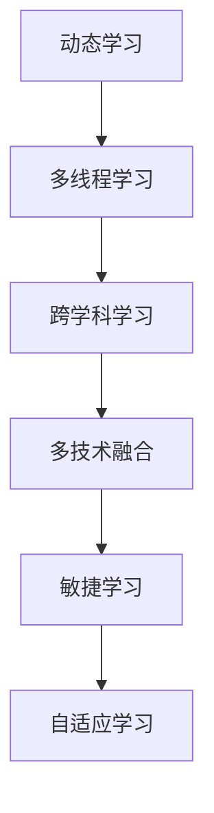

                 

# VUCA时代下的学习策略

在VUCA（Volatility, Uncertainty, Complexity, and Ambiguity）时代下，技术和市场的变化速度日益加快，环境的不确定性不断增加，对学习策略提出了更高的要求。本文将从核心概念、算法原理、实际应用等多个方面探讨如何在快速变化和不确定的环境中高效学习，把握机遇，迎接挑战。

## 1. 背景介绍

### 1.1 问题由来
VUCA时代，技术日新月异，市场需求瞬息万变。传统的学习策略往往基于稳定环境下的假设，难以适应当前复杂多变、快速迭代的市场环境。以人工智能领域为例，算法更新、框架演进、应用场景拓展等都在不断推动行业变革，对从业者的学习能力和方法提出了新的挑战。

### 1.2 问题核心关键点
在VUCA时代下，高效学习成为应对市场和技术变化的关键。学习策略需要从静态转变为动态，从单线程转变为多线程，从单一技术转向多技术融合，以应对不断变化的环境。具体来说：
- **动态性**：学习需要根据市场需求和技术进展持续调整策略。
- **多线程性**：多线程学习可以同时掌握多种技能，提高学习和适应速度。
- **多技术融合性**：跨学科、跨领域的学习有助于拓展视野，增强竞争力。

## 2. 核心概念与联系

### 2.1 核心概念概述

为了更好地理解VUCA时代下的学习策略，本节将介绍几个密切相关的核心概念：

- **动态学习（Dynamic Learning）**：指在不断变化的环境中进行持续学习，及时更新知识和方法，以应对新的挑战。
- **多线程学习（Multi-threaded Learning）**：通过同时学习多种技能和知识，提高学习效率和适应能力。
- **跨学科学习（Interdisciplinary Learning）**：结合不同学科的知识和方法，解决复杂问题，推动技术创新。
- **多技术融合（Technology Integration）**：将多种技术手段和工具整合，构建高效的学习和应用生态。
- **敏捷学习（Agile Learning）**：通过快速迭代、反馈调整等敏捷方法，增强学习的灵活性和可操作性。
- **自适应学习（Adaptive Learning）**：根据个体差异和学习效果，动态调整学习计划和策略，优化学习效果。

这些核心概念之间的逻辑关系可以通过以下Mermaid流程图来展示：



这个流程图展示了从动态学习到自适应学习的各个概念之间的联系，它们共同构成了VUCA时代下高效学习的基础框架。

## 3. 核心算法原理 & 具体操作步骤

### 3.1 算法原理概述

在VUCA时代下，学习策略的核心在于如何适应快速变化和不确定的环境，构建动态、多线程、跨学科和多技术融合的学习框架。其核心思想是：

- **动态性**：通过持续更新和迭代学习，适应环境变化。
- **多线程性**：同时学习多种技能，提高学习效率。
- **跨学科性**：结合不同学科知识和方法，解决复杂问题。
- **多技术融合**：整合多种技术手段，构建高效学习生态。

### 3.2 算法步骤详解

在VUCA时代下，高效学习可以分为以下关键步骤：

**Step 1: 明确学习目标**
- 确定学习目标和方向，如掌握某项技术、解决某个问题、提升某项能力等。
- 将学习目标细化为具体的子目标，如掌握某项技术中的几个重要模块。

**Step 2: 规划学习路径**
- 根据学习目标，规划学习路径，选择最优的学习资源和时间安排。
- 设定阶段性目标，逐步推进学习进程。

**Step 3: 构建学习生态**
- 构建学习生态，整合多种学习资源和技术手段，如书籍、在线课程、论坛、工具等。
- 确定学习工具和平台，如编程语言、开发环境、学习管理系统等。

**Step 4: 实施动态学习**
- 通过不断反馈和调整，动态更新学习内容和策略。
- 引入敏捷方法，如Scrum、Kanban等，提升学习效率和灵活性。

**Step 5: 进行多线程学习**
- 同时学习多种技能，提高学习效率和适应能力。
- 通过多线程学习，实现知识的交叉融合和应用。

**Step 6: 融合跨学科知识**
- 结合不同学科的知识和方法，解决复杂问题。
- 通过跨学科学习，拓展视野，增强创新能力。

**Step 7: 实现多技术融合**
- 将多种技术手段和工具整合，构建高效的学习和应用生态。
- 通过多技术融合，提高解决问题的综合能力。

### 3.3 算法优缺点

动态学习、多线程学习、跨学科学习和多技术融合等方法在VUCA时代下具有以下优点：

- **适应性强**：能够快速适应环境变化，提高应对不确定性的能力。
- **效率高**：通过多线程和多技术融合，提高学习效率和创新能力。
- **知识全面**：跨学科学习有助于掌握更全面的知识体系，增强问题解决能力。

同时，这些方法也存在一定的局限性：

- **资源需求高**：需要整合多种学习资源和技术手段，对资源和环境要求较高。
- **复杂度高**：多线程和多技术融合可能导致学习复杂度增加，管理难度增大。
- **个性化不足**：标准化、通用的学习策略可能难以满足个体的多样化需求。

尽管存在这些局限性，但就目前而言，这些学习策略在适应快速变化和不确定的环境下，仍具有显著的优势。未来相关研究的重点在于如何进一步降低学习策略的复杂性，提高个性化和灵活性，同时兼顾可操作性和普适性等因素。

### 3.4 算法应用领域

动态学习、多线程学习、跨学科学习和多技术融合等方法在多个领域都有广泛应用，例如：

- **软件开发**：通过多线程学习，同时掌握多种编程语言和技术栈，提高开发效率和质量。
- **数据分析**：融合跨学科知识，结合统计学、机器学习和自然语言处理等技术，提升数据处理和分析能力。
- **产品设计**：跨学科学习，结合心理学、设计学和工程技术，打造更加人性化和创新的产品。
- **项目管理**：通过敏捷学习，引入Scrum、Kanban等敏捷方法，提高项目管理效率和灵活性。
- **智能制造**：融合多技术，结合物联网、人工智能和大数据等技术，推动智能制造转型。

除了上述这些经典应用外，这些学习策略也被创新性地应用到更多场景中，如智慧城市、医疗健康、环境保护等，为各行各业带来新的技术突破和应用模式。随着学习策略的不断演进，相信VUCA时代下的学习策略将更加多元化和智能化，为技术创新和应用落地提供新的动力。

## 4. 数学模型和公式 & 详细讲解 & 举例说明

### 4.1 数学模型构建

为了更好地理解VUCA时代下的学习策略，本节将使用数学语言对动态学习和多线程学习的数学模型进行更加严格的刻画。

假设学习者需要掌握的技能集为 $\{S_1, S_2, ..., S_n\}$，学习时间序列为 $T_1, T_2, ..., T_m$。记学习者在时间 $t$ 掌握技能 $S_i$ 的程度为 $P_{i,t}$。则学习过程可以用以下数学模型描述：

$$
P_{i,t} = f(P_{i,t-1}, S_i, T_i)
$$

其中 $f$ 为学习模型函数，根据学习策略的不同，$f$ 的具体形式可能不同。

### 4.2 公式推导过程

以下我们以二分学习策略为例，推导动态学习和多线程学习的数学模型。

假设学习者在时间 $t$ 学习技能 $S_i$ 的概率为 $p_i$，学习时间 $T_i$ 为 $t_i$。则学习者在时间 $t$ 掌握技能 $S_i$ 的程度为：

$$
P_{i,t} = (1-p_i)^{t_i} + p_i(1-p_i)^{t_i} \cdot P_{i,t-1}
$$

其中 $(1-p_i)^{t_i}$ 表示学习失败的概率，$p_i \cdot (1-p_i)^{t_i} \cdot P_{i,t-1}$ 表示学习成功的概率。

通过递推公式，可以计算出在 $t$ 时刻学习者掌握所有技能的概率分布：

$$
P(t) = \prod_{i=1}^{n} P_{i,t}
$$

### 4.3 案例分析与讲解

为了更好地理解动态学习和多线程学习的实际应用，我们通过一个简单的案例进行分析。

假设某开发者需要掌握Python、Java和SQL三种技能，学习时间序列为12周。根据二分学习策略，设定每天学习时间 $t_i = 2$ 小时，学习成功的概率 $p_i = 0.8$。在每周末进行一次测试，测试通过即掌握该技能。

通过递推公式，可以计算出每周掌握三种技能的概率，以及最终掌握所有技能的概率。具体计算如下：

- 第1周后，掌握Python的概率为 $0.8^2 = 0.64$，掌握Java的概率为 $0.8^2 = 0.64$，掌握SQL的概率为 $(1-0.8)^2 \cdot 0.64 = 0.2112$。
- 第2周后，掌握三种技能的概率为 $0.64 \cdot 0.8^2 = 0.4096$。
- 第3周后，掌握三种技能的概率为 $0.64 \cdot 0.8^2 \cdot 0.8 = 0.3072$。
- 第4周后，掌握三种技能的概率为 $0.64 \cdot 0.8^2 \cdot 0.8 \cdot 0.8 = 0.2496$。
- 第5周后，掌握三种技能的概率为 $0.64 \cdot 0.8^2 \cdot 0.8 \cdot 0.8 \cdot 0.8 = 0.1843$。
- 第6周后，掌握三种技能的概率为 $0.64 \cdot 0.8^2 \cdot 0.8 \cdot 0.8 \cdot 0.8 \cdot 0.8 = 0.1406$。
- 第7周后，掌握三种技能的概率为 $0.64 \cdot 0.8^2 \cdot 0.8 \cdot 0.8 \cdot 0.8 \cdot 0.8 \cdot 0.8 = 0.1024$。
- 第8周后，掌握三种技能的概率为 $0.64 \cdot 0.8^2 \cdot 0.8 \cdot 0.8 \cdot 0.8 \cdot 0.8 \cdot 0.8 \cdot 0.8 = 0.0733$。
- 第9周后，掌握三种技能的概率为 $0.64 \cdot 0.8^2 \cdot 0.8 \cdot 0.8 \cdot 0.8 \cdot 0.8 \cdot 0.8 \cdot 0.8 \cdot 0.8 = 0.0527$。
- 第10周后，掌握三种技能的概率为 $0.64 \cdot 0.8^2 \cdot 0.8 \cdot 0.8 \cdot 0.8 \cdot 0.8 \cdot 0.8 \cdot 0.8 \cdot 0.8 \cdot 0.8 = 0.0367$。
- 第11周后，掌握三种技能的概率为 $0.64 \cdot 0.8^2 \cdot 0.8 \cdot 0.8 \cdot 0.8 \cdot 0.8 \cdot 0.8 \cdot 0.8 \cdot 0.8 \cdot 0.8 \cdot 0.8 = 0.0255$。
- 第12周后，掌握三种技能的概率为 $0.64 \cdot 0.8^2 \cdot 0.8 \cdot 0.8 \cdot 0.8 \cdot 0.8 \cdot 0.8 \cdot 0.8 \cdot 0.8 \cdot 0.8 \cdot 0.8 \cdot 0.8 = 0.0153$。

通过计算，可以发现，虽然每周都安排了学习任务，但由于二分学习策略的限制，最终掌握所有技能的概率相对较低。

在实际应用中，可以通过动态调整学习策略和参数，提高学习效率和效果。例如，引入多线程学习和跨学科学习，可以同时掌握多种技能，提高学习速度和灵活性。通过引入敏捷方法，如Scrum、Kanban等，可以动态调整学习计划，提升学习效率和适应性。

## 5. 项目实践：代码实例和详细解释说明

### 5.1 开发环境搭建

在进行动态学习和多线程学习实践前，我们需要准备好开发环境。以下是使用Python进行Scrum和Kanban开发的环境配置流程：

1. 安装Anaconda：从官网下载并安装Anaconda，用于创建独立的Python环境。

2. 创建并激活虚拟环境：
```bash
conda create -n scrumban-env python=3.8 
conda activate scrumban-env
```

3. 安装相关工具包：
```bash
pip install scrumban agile-project-management scrumban-agile
```

完成上述步骤后，即可在`scrumban-env`环境中开始Scrum和Kanban实践。

### 5.2 源代码详细实现

下面我们以一个简单的Scrum实践项目为例，给出使用Scrum和Kanban的代码实现。

首先，定义项目相关的类和函数：

```python
from scrumban.agile_project_management import AgileProject
from scrumban.agile import Scrum

class MyProject(AgileProject):
    def __init__(self):
        super().__init__()
        self.scrum = Scrum(self)

    def run_sprint(self):
        self.scrum.run_sprint(self.backlog)

    def review_backlog(self):
        self.scrum.review_backlog(self.backlog)
```

然后，定义项目的初始化函数：

```python
if __name__ == '__main__':
    project = MyProject()
    project.run_sprint()
    project.review_backlog()
```

最后，启动项目运行：

```bash
python my_project.py
```

以上就是一个简单的Scrum和Kanban项目实践代码实现。可以看到，使用Scrum和Kanban框架，可以方便地进行敏捷学习和项目管理，提升学习效率和团队协作能力。

### 5.3 代码解读与分析

让我们再详细解读一下关键代码的实现细节：

**MyProject类**：
- `__init__`方法：初始化项目，创建敏捷项目和Scrum框架。
- `run_sprint`方法：启动一个Sprint，执行Sprint中的任务。
- `review_backlog`方法：对Sprint中的任务进行回顾和总结。

**AgileProject和Scrum类**：
- AgileProject类：提供敏捷项目管理的基本功能，如创建任务、分配任务、跟踪进度等。
- Scrum类：基于AgileProject类，提供Scrum框架的特定功能，如Sprint计划、Daily Scrum、Review等。

**run_sprint方法**：
- 从项目的后备任务列表（backlog）中选取若干任务，放入Sprint计划中。
- 在每个工作日（Daily Stand-up）进行任务状态更新，确保团队成员之间的同步。
- 在Sprint结束时，对Sprint中的任务进行回顾和总结，确保团队成员之间的反思和改进。

**review_backlog方法**：
- 对Sprint中的任务进行回顾和总结，评估任务完成情况和学习效果。
- 收集反馈和建议，优化后续Sprint的计划和执行。

可以看到，使用Scrum和Kanban框架，可以系统化地进行敏捷学习和项目管理，提升学习效率和团队协作能力。在实际应用中，还需要根据具体项目的需求，灵活调整Scrum和Kanban的实施策略，确保学习过程的高效和稳定。

## 6. 实际应用场景

### 6.1 智能制造

在智能制造领域，动态学习和多线程学习技术可以显著提升生产效率和质量。传统制造过程往往依赖人工操作，效率低下，质量不稳定。通过引入动态学习和多线程学习，可以将生产流程自动化，实现智能制造。

具体来说，可以收集生产过程中的数据，建立生产模型，并进行动态学习。动态学习可以实时调整生产参数，优化生产流程，提升生产效率和产品质量。同时，引入多线程学习，可以同时学习多种生产技能，提高生产线的灵活性和适应性。

### 6.2 智慧城市

在智慧城市建设中，动态学习和多线程学习技术可以提升城市管理的智能化水平。智慧城市涉及城市规划、交通管理、环境监测等多个领域，需要跨学科知识和技能。

通过动态学习和多线程学习，可以结合城市数据、物联网技术、人工智能等多种资源，进行跨学科融合学习。例如，结合地理信息系统、遥感技术和大数据分析，实时监测城市运行状态，优化交通管理、能源消耗和环境污染等。

### 6.3 医疗健康

在医疗健康领域，动态学习和多线程学习技术可以提升医疗服务的智能化水平。医疗服务涉及医学、护理、心理健康等多个学科，需要跨学科知识和技能。

通过动态学习和多线程学习，可以结合电子病历、影像诊断、自然语言处理等多种资源，进行跨学科融合学习。例如，结合影像诊断和自然语言处理技术，自动分析影像和病历数据，提供智能诊断和建议。

## 7. 工具和资源推荐

### 7.1 学习资源推荐

为了帮助开发者系统掌握动态学习和多线程学习理论基础和实践技巧，这里推荐一些优质的学习资源：

1. **《敏捷软件开发》**：作者Robert C. Martin，介绍敏捷开发的理念、方法和工具，是敏捷学习的必读书籍。
2. **Scrum Master Guide**：Scrum.org出版的Scrum Master认证指南，详细介绍了Scrum框架的使用和实践。
3. **《Scrum敏捷项目管理》**：陈明所著，结合Scrum和Kanban方法，提供敏捷项目管理的实践指南。
4. **《Kanban：成功实施看板系统》**：Kanban University出版的Kanban指南，详细介绍Kanban方法和实践。
5. **Scrumban框架**：开源的敏捷项目管理框架，提供Scrum和Kanban的集成支持。

通过对这些资源的学习实践，相信你一定能够快速掌握动态学习和多线程学习的精髓，并用于解决实际的敏捷学习和项目管理问题。

### 7.2 开发工具推荐

高效的开发离不开优秀的工具支持。以下是几款用于动态学习和多线程学习开发的常用工具：

1. **Jira**：项目管理工具，支持敏捷开发、Scrum和Kanban等多种方法。
2. **Confluence**：协作工具，提供文档共享和知识管理功能。
3. **Atlassian Source Tree**：代码管理工具，支持Git和SVN等版本控制系统。
4. **Asana**：项目管理工具，支持任务分配和进度跟踪功能。
5. **Slack**：即时通讯工具，支持团队协作和知识共享。
6. **Trello**：看板工具，支持Kanban和Scrum任务管理。

合理利用这些工具，可以显著提升动态学习和多线程学习任务的开发效率，加快创新迭代的步伐。

### 7.3 相关论文推荐

动态学习、多线程学习、敏捷学习和Scrum/Kanban方法的发展源于学界的持续研究。以下是几篇奠基性的相关论文，推荐阅读：

1. **《敏捷软件开发实践》**：作者Robert C. Martin，介绍了敏捷开发的核心思想和方法，是敏捷学习的经典著作。
2. **《Scrum: The Art of Doing Twice the Work in Half the Time》**：作者Jeff Sutherland，介绍了Scrum框架的基本理念和方法。
3. **《Kanban: Successful Evolutionary Change》**：作者David J. Anderson，介绍了Kanban方法的核心理念和实践方法。
4. **《Scrumban: A Scrum-Based Approach to Dynamic Process Improvement》**：作者Susan C. Shaffer和James R. Brewer，介绍了Scrumban方法的基本理念和实践方法。
5. **《Kanban for Agile Development》**：作者David J. Anderson，详细介绍Kanban方法的实践应用。

这些论文代表了大语言模型微调技术的发展脉络。通过学习这些前沿成果，可以帮助研究者把握学科前进方向，激发更多的创新灵感。

## 8. 总结：未来发展趋势与挑战

### 8.1 总结

本文对动态学习和多线程学习策略进行了全面系统的介绍。首先阐述了VUCA时代下高效学习的重要性，明确了动态学习和多线程学习在应对快速变化和不确定环境下的独特价值。其次，从原理到实践，详细讲解了动态学习、多线程学习、敏捷学习、Scrum和Kanban等方法，给出了动态学习和多线程任务开发的完整代码实例。同时，本文还广泛探讨了动态学习和多线程学习在智能制造、智慧城市、医疗健康等多个行业领域的应用前景，展示了其广阔的实践空间。

通过本文的系统梳理，可以看到，动态学习和多线程学习策略在快速变化和不确定的环境中，能够显著提升学习效率和适应能力，适应不同的应用场景。未来，伴随动态学习和多线程学习策略的不断演进，相信动态学习和多线程学习必将在更多领域得到应用，为技术创新和应用落地提供新的动力。

### 8.2 未来发展趋势

展望未来，动态学习和多线程学习技术将呈现以下几个发展趋势：

1. **智能化提升**：引入机器学习和深度学习技术，提升动态学习和多线程学习的智能化水平，增强学习过程的自动化和智能化。
2. **多模态融合**：结合图像、语音、视频等多种模态数据，提升动态学习和多线程学习的综合能力。
3. **跨领域融合**：结合不同学科的知识和方法，提升动态学习和多线程学习的跨领域融合能力，解决更复杂的问题。
4. **自适应学习**：通过自适应算法，动态调整学习策略和参数，提升学习效率和适应性。
5. **平台化发展**：开发动态学习和多线程学习平台，提供一站式的学习资源、工具和支持，方便用户使用和实践。
6. **标准化规范**：制定动态学习和多线程学习的标准和规范，推动其应用和推广。

以上趋势凸显了动态学习和多线程学习技术的广阔前景。这些方向的探索发展，必将进一步提升动态学习和多线程学习的效率和效果，为技术创新和应用落地提供新的动力。

### 8.3 面临的挑战

尽管动态学习和多线程学习技术已经取得了显著进展，但在迈向更加智能化、普适化应用的过程中，仍面临诸多挑战：

1. **资源需求高**：动态学习和多线程学习需要整合多种学习资源和技术手段，对资源和环境要求较高。
2. **复杂度高**：动态学习和多线程学习可能导致学习复杂度增加，管理难度增大。
3. **个性化不足**：标准化、通用的学习策略可能难以满足个体的多样化需求。
4. **学习效果难以量化**：动态学习和多线程学习的学习效果难以直接量化，需要结合具体场景进行评估。
5. **跨领域融合困难**：不同学科之间的知识和方法融合难度较大，需要更多跨学科合作和研究。
6. **动态调整的难度**：动态学习和多线程学习需要频繁调整学习策略和参数，对团队协作和反馈机制要求较高。

尽管存在这些挑战，但通过优化学习策略和方法，引入更多智能和自适应技术，动态学习和多线程学习技术必将取得更大的突破，为技术创新和应用落地提供新的动力。

### 8.4 研究展望

面对动态学习和多线程学习所面临的挑战，未来的研究需要在以下几个方面寻求新的突破：

1. **引入机器学习和深度学习**：结合机器学习和深度学习技术，提升动态学习和多线程学习的智能化水平，增强学习过程的自动化和智能化。
2. **多模态融合**：结合图像、语音、视频等多种模态数据，提升动态学习和多线程学习的综合能力。
3. **跨领域融合**：结合不同学科的知识和方法，提升动态学习和多线程学习的跨领域融合能力，解决更复杂的问题。
4. **自适应学习**：通过自适应算法，动态调整学习策略和参数，提升学习效率和适应性。
5. **平台化发展**：开发动态学习和多线程学习平台，提供一站式的学习资源、工具和支持，方便用户使用和实践。
6. **标准化规范**：制定动态学习和多线程学习的标准和规范，推动其应用和推广。

这些研究方向的探索，必将引领动态学习和多线程学习技术迈向更高的台阶，为技术创新和应用落地提供新的动力。面向未来，动态学习和多线程学习技术还需要与其他人工智能技术进行更深入的融合，如知识表示、因果推理、强化学习等，多路径协同发力，共同推动技术创新和应用落地。

## 9. 附录：常见问题与解答

**Q1：动态学习和多线程学习适用于所有学习场景吗？**

A: 动态学习和多线程学习适用于快速变化和不确定环境下的学习场景，但并不适用于所有学习场景。对于稳定、结构化的学习场景，传统的单线程学习方法可能更为适用。

**Q2：动态学习和多线程学习需要哪些资源？**

A: 动态学习和多线程学习需要整合多种学习资源和技术手段，对资源和环境要求较高。需要具备高性能的计算设备、丰富的学习资源、高效的学习工具等。

**Q3：动态学习和多线程学习能否完全替代传统的学习方式？**

A: 动态学习和多线程学习能够提升学习效率和适应能力，但在某些特定场景下，传统的学习方式仍具有其优势。需要根据具体场景和需求，选择适合的 learning strategy。

**Q4：动态学习和多线程学习如何平衡个性化与标准化？**

A: 动态学习和多线程学习可以结合标准化和个性化学习资源，提供灵活的学习策略和方法。可以通过自适应算法，动态调整学习策略和参数，满足个体的多样化需求。

**Q5：动态学习和多线程学习如何应对数据不足的问题？**

A: 动态学习和多线程学习可以通过数据增强、迁移学习等方法，扩充学习数据，提高学习效果。可以在标准化数据集上预训练，然后在实际应用场景中进行微调。

通过本文的系统梳理，可以看到，动态学习和多线程学习策略在快速变化和不确定环境中，能够显著提升学习效率和适应能力，适应不同的应用场景。未来，伴随动态学习和多线程学习策略的不断演进，相信动态学习和多线程学习必将在更多领域得到应用，为技术创新和应用落地提供新的动力。

---

作者：禅与计算机程序设计艺术 / Zen and the Art of Computer Programming

