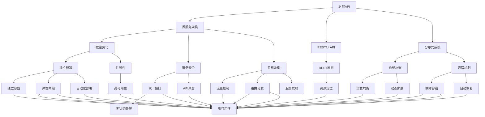

                 

# Web应用架构：从后端API到前端交互

> 关键词：Web应用,后端API,前端交互,微服务,分布式系统,RESTful API,前端框架,API Gateway,中间件

## 1. 背景介绍

### 1.1 问题由来

在互联网时代，Web应用架构已经成为了企业构建数字化业务的核心技术体系。从传统的大型单体应用，到微服务架构、Serverless架构的演进，Web应用架构的设计和实施一直是信息技术领域的热点话题。在Web应用的发展过程中，后端API和前端交互的协同演进起到了至关重要的作用。

后端API是Web应用的核心，它承担了数据存储、业务逻辑处理、跨系统通信等任务。前端的交互则是用户与系统的直接接触面，影响着用户体验和应用的可访问性。如何设计高效、稳定的后端API，并与之适配良好的前端交互，是现代Web应用架构的重要挑战。

### 1.2 问题核心关键点

Web应用架构的设计和实施涉及众多关键点，包括但不限于：

- 后端API的设计原则：如何设计符合RESTful规范、易于维护的API接口。
- 后端API的性能优化：如何确保API的高吞吐量和低延迟。
- 前端框架的选择：如何选择合适的框架，以提高Web应用的性能和用户体验。
- API Gateway的实现：如何通过API Gateway实现服务聚合、负载均衡、安全防护等功能。
- 中间件的应用：如何在Web应用中引入中间件，提升系统的稳定性和可扩展性。
- 分布式系统架构：如何在微服务架构下实现系统的微服务化、自动化和故障容错。
- RESTful API的使用：如何在Web应用中合理使用RESTful API，降低系统复杂度。

这些关键点不仅影响着Web应用的性能和可维护性，更决定了Web应用的业务扩展和创新能力。

## 2. 核心概念与联系

### 2.1 核心概念概述

为更好地理解Web应用架构，本节将介绍几个密切相关的核心概念：

- **后端API（Back-end API）**：指Web应用中的服务器端API接口，负责处理请求和响应，提供数据访问和业务逻辑处理功能。常见的后端API设计包括RESTful API和GraphQL API等。

- **前端框架（Front-end Framework）**：指用于构建Web应用的前端技术栈，通常包含JavaScript框架、模板引擎、样式库等。常见的框架有React、Vue、Angular等。

- **微服务架构（Microservices Architecture）**：指将应用程序分解为多个小型、独立的服务，每个服务负责特定的业务逻辑。微服务架构通过服务间的松耦合和独立部署，提高了系统的可扩展性和容错性。

- **分布式系统（Distributed System）**：指由多个计算机节点组成，通过网络通信实现协同工作的系统。分布式系统通过负载均衡、容错机制等手段，提升了系统的可用性和稳定性。

- **RESTful API（Representational State Transfer）**：指符合REST原则的API设计，包括资源定位、无状态处理、统一接口等特性。RESTful API使得API的设计和使用更加标准化、易维护。

- **API Gateway（API Gateway）**：指用于管理API服务的网关系统，支持API聚合、负载均衡、安全防护等功能。API Gateway通过统一的入口和控制层，简化了系统的管理和扩展。

- **中间件（Middleware）**：指用于增强Web应用功能的软件组件，通常介于Web应用和后端API之间，支持缓存、日志、安全防护等通用功能。

这些核心概念之间的逻辑关系可以通过以下Mermaid流程图来展示：



这个流程图展示了几大核心概念之间的联系，它们共同构成了Web应用架构的技术基础。

## 3. 核心算法原理 & 具体操作步骤
### 3.1 算法原理概述

Web应用架构的设计和实施过程，本质上是一个系统的软件设计和实现过程，涉及众多的技术和方法。其中，后端API和前端交互的设计是整个架构的核心，其算法原理包括以下几个方面：

1. **RESTful API设计**：基于REST原则的API设计，包括资源定位、无状态处理、统一接口等特性，是Web应用架构的基础。

2. **微服务架构设计**：通过将应用程序分解为多个小型、独立的服务，每个服务负责特定的业务逻辑，提高了系统的可扩展性和容错性。

3. **分布式系统设计**：通过负载均衡、容错机制等手段，提升了系统的可用性和稳定性。

4. **中间件应用设计**：通过引入中间件，增强Web应用的功能，提升系统的稳定性和可扩展性。

5. **API Gateway实现**：通过API Gateway实现服务聚合、负载均衡、安全防护等功能，简化了系统的管理和扩展。

### 3.2 算法步骤详解

Web应用架构的设计和实施通常遵循以下步骤：

**Step 1: 需求分析和系统设计**
- 收集用户需求和业务场景，明确系统的功能和性能要求。
- 设计系统的技术架构，包括后端API、微服务、分布式系统等关键组件。
- 选择合适的技术和工具，如后端API框架、前端框架、容器化工具等。

**Step 2: 后端API设计**
- 设计符合RESTful规范的API接口，明确API的资源、操作和状态。
- 设计API的参数、返回值和错误码，确保API的易用性和一致性。
- 考虑API的安全性，引入身份验证、授权、限流等机制。

**Step 3: 前端交互设计**
- 选择合适的前端框架，设计前端页面和用户交互流程。
- 设计API调用方式，如GET、POST、PUT、DELETE等，确保前端和后端API的协同工作。
- 考虑前端性能优化，如代码压缩、缓存、异步加载等。

**Step 4: 微服务架构实现**
- 将应用程序分解为多个小型、独立的服务，每个服务负责特定的业务逻辑。
- 设计服务间的通信协议和数据格式，如HTTP、JSON、Protocol Buffers等。
- 实现服务间的注册和发现机制，如Consul、Eureka等。

**Step 5: 分布式系统实现**
- 设计负载均衡策略，如轮询、权重、哈希等，确保系统的高可用性和扩展性。
- 实现容错机制，如重试、故障转移、自动恢复等，提升系统的稳定性。
- 考虑数据的分布和存储，如分片、复制、缓存等，优化系统的性能。

**Step 6: 中间件应用**
- 选择合适的中间件，如缓存、日志、安全防护等。
- 设计中间件的配置和调优，确保其性能和稳定性。
- 实现中间件的服务化和标准化，方便系统的管理和扩展。

**Step 7: API Gateway实现**
- 设计API Gateway的功能，如API聚合、负载均衡、安全防护等。
- 实现API Gateway的负载均衡和故障容错，确保系统的稳定性和可靠性。
- 设计API Gateway的监控和告警机制，实时监控系统状态。

### 3.3 算法优缺点

Web应用架构的设计和实施过程具有以下优点：

1. 系统可扩展性高：通过微服务架构和分布式系统设计，系统可以灵活扩展，适应不断变化的业务需求。

2. 系统容错性强：通过负载均衡、容错机制等手段，系统可以应对单点故障和流量波动。

3. 系统性能优异：通过缓存、负载均衡、异步处理等优化，系统可以保证高吞吐量和低延迟。

4. 系统易于维护：通过中间件和API Gateway的应用，系统可以简化管理和扩展。

5. 系统易于升级：通过版本控制和容器化部署，系统可以快速迭代和升级。

但同时，Web应用架构也存在以下缺点：

1. 系统复杂度高：微服务架构和分布式系统设计增加了系统的复杂度，需要更多的运维和管理工作。

2. 系统安全性不足：由于系统组件众多，系统安全性的保障难度增加，需要更多的安全防护措施。

3. 系统开发成本高：由于系统组件众多，系统开发和测试的成本增加，需要更多的投入。

4. 系统部署难度大：由于系统组件众多，系统部署和调优的难度增加，需要更多的经验和技术积累。

### 3.4 算法应用领域

Web应用架构的设计和实施已经在众多领域得到了广泛的应用，包括但不限于：

- 电商平台：通过微服务架构和分布式系统设计，实现高性能、高可用的电商系统。
- 社交媒体：通过中间件和API Gateway的应用，实现用户和内容的快速互动和分发。
- 在线教育：通过RESTful API设计，实现用户和课程的灵活管理和互动。
- 金融服务：通过安全防护和容错机制，实现金融交易的高可靠性和稳定性。
- 医疗健康：通过微服务架构和分布式系统设计，实现医疗数据的快速处理和共享。
- 旅游服务：通过API Gateway的设计，实现旅游产品的聚合和个性化推荐。
- 物流仓储：通过中间件的应用，实现物流信息的实时监控和分析。

以上应用场景展示了Web应用架构在不同领域的应用，体现了其在提高系统性能、可扩展性和稳定性方面的显著优势。

## 4. 数学模型和公式 & 详细讲解 & 举例说明
### 4.1 数学模型构建

在Web应用架构的设计和实施过程中，涉及许多数学模型和公式。以下以RESTful API的设计为例，介绍基本的数学模型构建。

假设我们设计了一个RESTful API，用于管理用户的登录和注册信息。API支持两种操作：GET /users获取所有用户信息，POST /users添加新用户信息。我们可以用以下数学模型来描述API的设计：

**资源定位**：
- GET /users：获取所有用户信息
- POST /users：添加新用户信息

**参数和返回值**：
- GET /users：返回用户列表，格式为JSON
- POST /users：返回新用户ID，格式为整数

**状态码**：
- 200：请求成功
- 201：资源创建成功
- 400：请求参数错误
- 401：未授权
- 500：服务器内部错误

### 4.2 公式推导过程

假设我们设计了一个RESTful API，用于管理用户的登录和注册信息。API支持两种操作：GET /users获取所有用户信息，POST /users添加新用户信息。我们可以用以下数学模型来描述API的设计：

**资源定位**：
- GET /users：获取所有用户信息
- POST /users：添加新用户信息

**参数和返回值**：
- GET /users：返回用户列表，格式为JSON
- POST /users：返回新用户ID，格式为整数

**状态码**：
- 200：请求成功
- 201：资源创建成功
- 400：请求参数错误
- 401：未授权
- 500：服务器内部错误

在API的设计过程中，我们需要考虑以下数学公式：

1. **请求参数解析**：解析API请求中的参数，并进行验证和处理。
2. **资源获取和处理**：根据API请求，获取和处理相应的资源数据。
3. **响应生成和发送**：生成API响应，并发送给客户端。

### 4.3 案例分析与讲解

以用户的注册操作为例，我们可以用以下数学公式来描述其过程：

**请求参数解析**：
- 解析POST请求中的用户名、密码和邮箱等参数。
- 验证参数的格式和长度，确保参数的有效性。
- 如果参数无效，返回400错误码。

**资源获取和处理**：
- 获取数据库中的所有用户信息。
- 判断用户名是否已存在，如果存在，返回400错误码。
- 创建新的用户信息，并保存到数据库中。
- 返回新用户ID，格式为整数。

**响应生成和发送**：
- 生成包含新用户ID的JSON响应。
- 设置状态码为201，表示资源创建成功。
- 发送响应给客户端。

通过上述公式的推导和分析，我们可以更好地理解RESTful API的设计过程和数学模型。

## 5. 项目实践：代码实例和详细解释说明
### 5.1 开发环境搭建

在进行Web应用架构设计和实施时，需要选择合适的开发环境。以下是使用Python和Django框架进行Web应用开发的环境配置流程：

1. 安装Python：从官网下载并安装Python，确保版本在3.7以上。

2. 安装Django：在命令行中输入以下命令，安装Django框架：
```bash
pip install django
```

3. 安装数据库：选择MySQL或PostgreSQL等关系型数据库，并安装相应的驱动程序。

4. 创建虚拟环境：在命令行中输入以下命令，创建虚拟环境：
```bash
python -m venv myprojectenv
source myprojectenv/bin/activate
```

5. 配置Django项目：在命令行中输入以下命令，创建Django项目：
```bash
django-admin startproject myproject
```

完成上述步骤后，即可在虚拟环境中进行Web应用开发。

### 5.2 源代码详细实现

下面我们以用户注册功能为例，给出使用Django框架对RESTful API进行开发的PyTorch代码实现。

首先，定义Django应用和路由：

```python
from django.urls import path
from . import views

urlpatterns = [
    path('users/', views.UserView.as_view()),
]
```

然后，定义用户视图和模型：

```python
from django.contrib.auth.models import User
from rest_framework import generics

class UserView(generics.CreateAPIView):
    queryset = User.objects.all()
    serializer_class = UserSerializer

class UserSerializer(serializers.ModelSerializer):
    class Meta:
        model = User
        fields = ['username', 'email', 'password']
```

接着，定义用户注册函数：

```python
from rest_framework.views import APIView
from rest_framework.response import Response
from rest_framework import status

class UserRegistrationView(APIView):
    def post(self, request):
        data = request.data
        
        if 'username' not in data or 'password' not in data or 'email' not in data:
            return Response({'error': 'Missing required fields.'}, status=status.HTTP_400_BAD_REQUEST)
        
        username = data['username']
        password = data['password']
        email = data['email']
        
        if User.objects.filter(username=username).exists():
            return Response({'error': 'Username already exists.'}, status=status.HTTP_400_BAD_REQUEST)
        
        user = User.objects.create_user(username=username, password=password, email=email)
        return Response({'success': True, 'user_id': user.id}, status=status.HTTP_201_CREATED)
```

最后，启动Web应用，并运行测试：

```python
from django.core.wsgi import get_wsgi_application
from rest_framework import routers

router = routers.DefaultRouter()
router.register(r'users', views.UserView)
application = get_wsgi_application()
application = router.application
```

以上就是使用Django框架对RESTful API进行用户注册功能开发的完整代码实现。可以看到，Django框架提供了强大的开发工具和中间件，使得RESTful API的开发变得简单高效。

### 5.3 代码解读与分析

让我们再详细解读一下关键代码的实现细节：

**Django应用和路由**：
- 通过定义Django应用和路由，将用户注册功能映射到URL路径上。

**用户视图和模型**：
- 通过定义用户视图和模型，将用户注册操作封装成RESTful API接口，并使用Django的序列化器进行数据转换。

**用户注册函数**：
- 通过定义用户注册函数，处理POST请求中的用户名、密码和邮箱等参数，并执行数据库操作。
- 使用Django的创建用户函数，确保用户名的唯一性和数据的有效性。
- 返回成功或失败的响应，设置相应的状态码。

**Web应用启动和测试**：
- 通过定义Django的路由器和应用，将用户注册视图注册到路由中。
- 启动Django的WSGI应用，并运行测试，确保API的正确性和稳定性。

可以看到，Django框架提供了丰富的开发工具和中间件，使得RESTful API的开发变得简单高效。开发者可以将更多精力放在业务逻辑和API设计上，而不必过多关注底层的实现细节。

当然，工业级的系统实现还需考虑更多因素，如中间件的引入、数据库的优化、API的接口测试等。但核心的API设计和实现过程与上述类似。

## 6. 实际应用场景
### 6.1 电商平台

电商平台的Web应用架构通常采用微服务架构和分布式系统设计，以实现高性能、高可用的电商系统。系统的前端和后端通过RESTful API进行交互，确保用户和商品的灵活管理和互动。

在技术实现上，电商平台可以采用微服务架构，将商品管理、订单管理、用户管理等模块分解为多个独立的服务。每个服务负责特定的业务逻辑，通过API Gateway进行统一管理和调度。API Gateway可以提供负载均衡、安全防护、监控告警等功能，确保系统的稳定性和可靠性。

### 6.2 社交媒体

社交媒体的Web应用架构通常采用中间件和API Gateway的应用，以实现用户和内容的快速互动和分发。系统的前端和后端通过RESTful API进行交互，确保用户和内容的灵活管理和互动。

在技术实现上，社交媒体平台可以采用中间件，实现用户身份验证、权限控制、缓存等功能。API Gateway可以提供负载均衡、路由分发、服务发现等功能，确保系统的扩展性和可维护性。通过API Gateway，系统可以实现多个API服务的聚合和统一管理，提升系统的稳定性和可靠性。

### 6.3 在线教育

在线教育的Web应用架构通常采用RESTful API设计，以实现用户和课程的灵活管理和互动。系统的前端和后端通过RESTful API进行交互，确保用户和课程的灵活管理和互动。

在技术实现上，在线教育平台可以采用微服务架构，将课程管理、用户管理、学习记录等模块分解为多个独立的服务。每个服务负责特定的业务逻辑，通过API Gateway进行统一管理和调度。API Gateway可以提供负载均衡、安全防护、监控告警等功能，确保系统的稳定性和可靠性。

### 6.4 未来应用展望

随着Web应用架构的发展，未来的应用场景将更加多样和复杂，涉及更多的业务模块和技术组件。以下是一些未来的应用展望：

1. **多端应用**：未来的Web应用将不仅仅局限于PC端和移动端，还将扩展到AR/VR、IoT等新领域，实现更丰富和多样的用户体验。

2. **实时计算**：未来的Web应用将更加注重实时计算能力，通过Serverless架构、事件驱动等技术，实现更高的性能和扩展性。

3. **自动化运维**：未来的Web应用将更加注重自动化运维能力，通过DevOps、CI/CD等技术，实现更高效的开发、测试和部署。

4. **AI集成**：未来的Web应用将更加注重AI技术的集成，通过自然语言处理、计算机视觉等技术，实现更智能和人性化的应用体验。

5. **微服务和容器化**：未来的Web应用将更加注重微服务和容器化的实现，通过Kubernetes等技术，实现更灵活和可靠的云原生架构。

6. **区块链和智能合约**：未来的Web应用将更加注重区块链和智能合约的集成，实现更安全和可信的业务处理和数据存储。

## 7. 工具和资源推荐
### 7.1 学习资源推荐

为了帮助开发者系统掌握Web应用架构的理论基础和实践技巧，这里推荐一些优质的学习资源：

1. **Django官方文档**：Django框架的官方文档，提供了详细的API参考和使用指南，是学习和实践Django的必备资源。

2. **RESTful API设计指南**：这是一本专注于RESTful API设计的经典书籍，提供了详细的API设计原则和实践指南。

3. **微服务架构指南**：这是一本专注于微服务架构的经典书籍，提供了详细的微服务设计原则和实践指南。

4. **Docker官方文档**：Docker容器的官方文档，提供了详细的容器化技术和实践指南，是学习和实践Docker的必备资源。

5. **Kubernetes官方文档**：Kubernetes集群的官方文档，提供了详细的容器编排和实践指南，是学习和实践Kubernetes的必备资源。

通过对这些资源的学习实践，相信你一定能够快速掌握Web应用架构的技术要点，并应用于实际开发中。

### 7.2 开发工具推荐

高效的开发离不开优秀的工具支持。以下是几款用于Web应用架构开发的常用工具：

1. **Django框架**：Django是Python最流行的Web框架之一，提供了丰富的开发工具和中间件，支持RESTful API设计和微服务架构。

2. **Flask框架**：Flask是Python轻量级的Web框架，适用于小规模的Web应用开发，提供了灵活的扩展能力和API设计能力。

3. **Spring Boot框架**：Spring Boot是Java最流行的Web框架之一，提供了丰富的开发工具和中间件，支持RESTful API设计和微服务架构。

4. **Express框架**：Express是Node.js最流行的Web框架之一，适用于Web应用和API开发，提供了灵活的扩展能力和API设计能力。

5. **React框架**：React是JavaScript最流行的前端框架之一，适用于Web应用的UI设计和交互开发，提供了丰富的组件库和开发工具。

6. **Vue框架**：Vue是JavaScript最流行的前端框架之一，适用于Web应用的UI设计和交互开发，提供了灵活的组件库和开发工具。

7. **Angular框架**：Angular是JavaScript最流行的前端框架之一，适用于Web应用的UI设计和交互开发，提供了丰富的开发工具和中间件。

合理利用这些工具，可以显著提升Web应用架构的开发效率，加快创新迭代的步伐。

### 7.3 相关论文推荐

Web应用架构的设计和实施涉及众多研究领域，以下是几篇奠基性的相关论文，推荐阅读：

1. **RESTful Web服务设计指南**：这是一篇专注于RESTful Web服务设计的经典论文，提供了详细的API设计原则和实践指南。

2. **微服务架构的挑战和解决方案**：这是一篇专注于微服务架构的挑战和解决方案的经典论文，提供了详细的微服务设计原则和实践指南。

3. **Docker容器技术与应用**：这是一篇专注于Docker容器技术与应用的研究论文，提供了详细的容器化技术和实践指南。

4. **Kubernetes集群管理与调度**：这是一篇专注于Kubernetes集群管理与调度的研究论文，提供了详细的容器编排和实践指南。

5. **Web应用架构的演化与未来**：这是一篇专注于Web应用架构演化的研究论文，提供了详细的技术趋势和未来展望。

这些论文代表了大Web应用架构的发展脉络。通过学习这些前沿成果，可以帮助研究者把握学科前进方向，激发更多的创新灵感。

## 8. 总结：未来发展趋势与挑战
### 8.1 总结

本文对Web应用架构的设计和实施进行了全面系统的介绍。首先阐述了Web应用架构的背景和意义，明确了后端API和前端交互的设计原则和关键点。其次，从原理到实践，详细讲解了RESTful API设计、微服务架构、分布式系统、中间件应用、API Gateway实现的数学原理和操作步骤。最后，结合实际应用场景，探讨了Web应用架构的未来发展趋势和面临的挑战。

通过本文的系统梳理，可以看到，Web应用架构在提高系统性能、可扩展性和稳定性方面具有显著优势，为现代Web应用的发展提供了坚实的技术基础。未来，随着Web应用架构的不断演进，其应用场景将更加多样和复杂，涉及更多的业务模块和技术组件。

### 8.2 未来发展趋势

展望未来，Web应用架构将呈现以下几个发展趋势：

1. **全栈架构**：未来的Web应用将更加注重全栈架构的设计，通过前端和后端的深度融合，实现更高效和智能的业务处理。

2. **云原生架构**：未来的Web应用将更加注重云原生架构的实现，通过容器化、微服务化等技术，实现更灵活和可靠的云原生架构。

3. **边缘计算**：未来的Web应用将更加注重边缘计算的应用，通过将计算任务分散到边缘设备上，实现更高效和可靠的数据处理和存储。

4. **低代码/无代码开发**：未来的Web应用将更加注重低代码/无代码开发技术的应用，通过拖拽式界面和代码生成器，提升开发效率和业务适配性。

5. **人工智能与Web应用的深度融合**：未来的Web应用将更加注重AI技术的集成，通过自然语言处理、计算机视觉等技术，实现更智能和人性化的应用体验。

6. **区块链与Web应用的融合**：未来的Web应用将更加注重区块链与Web应用的融合，通过智能合约、去中心化存储等技术，实现更安全和可信的业务处理和数据存储。

以上趋势展示了Web应用架构在技术和应用方面的发展方向，必将进一步提升Web应用的功能和用户体验。

### 8.3 面临的挑战

尽管Web应用架构在技术上已经取得了显著进展，但在实施过程中仍然面临诸多挑战：

1. **系统复杂度高**：微服务架构和分布式系统设计增加了系统的复杂度，需要更多的运维和管理工作。

2. **系统安全性不足**：由于系统组件众多，系统安全性的保障难度增加，需要更多的安全防护措施。

3. **系统开发成本高**：由于系统组件众多，系统开发和测试的成本增加，需要更多的投入。

4. **系统部署难度大**：由于系统组件众多，系统部署和调优的难度增加，需要更多的经验和技术积累。

5. **技术更新速度快**：Web应用架构涉及的技术众多，需要不断跟进技术发展，保持技术的先进性。

6. **跨团队协作困难**：微服务架构下，不同服务团队的协作难度增加，需要统一的技术标准和管理规范。

以上挑战需要开发者和运维人员在设计和实施过程中加以关注，并通过技术手段和管理机制加以解决。

### 8.4 研究展望

面对Web应用架构面临的挑战，未来的研究需要在以下几个方面寻求新的突破：

1. **自动化运维技术**：研究自动化运维技术，提升Web应用的系统稳定性和可扩展性。

2. **边缘计算技术**：研究边缘计算技术，提升Web应用的实时计算能力和数据处理效率。

3. **低代码/无代码开发技术**：研究低代码/无代码开发技术，提升Web应用的开发效率和业务适配性。

4. **区块链与Web应用的融合技术**：研究区块链与Web应用的融合技术，提升Web应用的业务处理和数据存储的可靠性。

5. **微服务架构设计技术**：研究微服务架构设计技术，提升Web应用的可扩展性和容错性。

6. **全栈架构设计技术**：研究全栈架构设计技术，提升Web应用的业务处理和用户体验。

这些研究方向的探索，必将引领Web应用架构技术迈向更高的台阶，为构建高性能、高可靠性和高可扩展性的Web应用提供坚实的技术基础。

## 9. 附录：常见问题与解答

**Q1：Web应用架构中的后端API如何设计？**

A: 后端API的设计需要遵循RESTful原则，包括资源定位、无状态处理、统一接口等特性。API的设计需要考虑请求参数、返回值和状态码，确保API的易用性和一致性。

**Q2：如何选择合适的前端框架？**

A: 前端框架的选择需要考虑业务需求、开发团队的技术栈和性能要求。常见的框架有React、Vue、Angular等，需要根据具体场景选择合适的框架。

**Q3：如何实现微服务架构？**

A: 微服务架构的实现需要分解应用程序为多个小型、独立的服务，每个服务负责特定的业务逻辑。服务间的通信协议和数据格式需要设计合理，服务间的注册和发现机制需要实现完善。

**Q4：如何实现分布式系统？**

A: 分布式系统的实现需要设计负载均衡策略、容错机制和数据分布存储方案。负载均衡策略可以采用轮询、权重、哈希等算法，容错机制可以采用重试、故障转移、自动恢复等手段，数据分布存储可以采用分片、复制、缓存等技术。

**Q5：如何使用中间件增强系统功能？**

A: 中间件的选择和应用需要考虑系统需求和性能要求。常见的中间件包括缓存、日志、安全防护等，需要根据具体场景选择合适的中间件，并进行合理的配置和调优。

通过本文的系统梳理，可以看到，Web应用架构在提高系统性能、可扩展性和稳定性方面具有显著优势。未来，随着Web应用架构的不断演进，其应用场景将更加多样和复杂，涉及更多的业务模块和技术组件。开发者和运维人员需要不断跟进技术发展，保持技术的先进性，并通过技术手段和管理机制，解决实施过程中面临的挑战，确保Web应用的高效、可靠和智能。总之，Web应用架构需要从需求分析、系统设计、技术选型、开发实践等多个方面进行全面考虑和优化，方能实现高性能、高可靠性和高可扩展性的Web应用。

