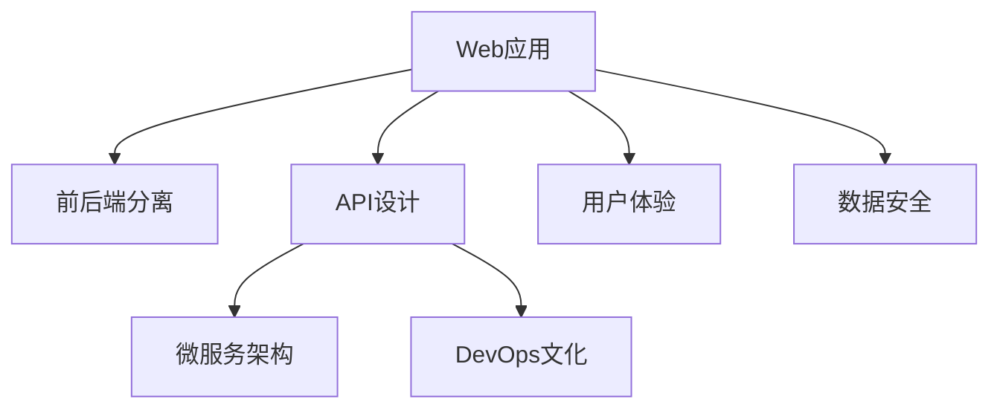

                 

# Web应用架构：从后端API到前端交互

> 关键词：Web应用,API设计,前后端分离,前后端协作,微服务架构,DevOps,用户体验,数据安全

## 1. 背景介绍

### 1.1 问题由来

随着互联网技术的飞速发展，Web应用在各个行业的应用越来越广泛。然而，传统的Web开发方式往往将前后端代码混杂在一起，导致了开发效率低下、维护成本高昂等一系列问题。同时，随着用户对交互体验的要求日益提升，Web应用前后端的分离成为了一种必然的趋势。

本文将介绍Web应用架构的演变，以及如何通过设计良好的API、前后端协作机制、微服务架构等手段，构建高效、稳定、用户体验优异的Web应用系统。

### 1.2 问题核心关键点

Web应用架构的核心关键点包括：

1. **前后端分离**：将前端与后端分离，提高开发效率和系统稳定性。
2. **API设计**：设计良好的API，降低前后端耦合，提供可扩展性。
3. **微服务架构**：通过微服务架构，提高系统的可扩展性、灵活性和可维护性。
4. **DevOps文化**：通过持续集成、持续交付等DevOps实践，加速系统迭代和发布。
5. **用户体验**：注重用户体验设计，提升应用的用户黏性和满意度。
6. **数据安全**：保证数据安全，防止数据泄露和攻击。

这些关键点共同构成了Web应用架构的设计和实践框架，使得Web应用能够适应快速变化的互联网环境，并提供优质的用户体验。

### 1.3 问题研究意义

研究Web应用架构的设计和实践，对于提升Web应用开发效率、降低维护成本、提高用户体验和数据安全，具有重要意义：

1. **提升开发效率**：前后端分离和API设计降低了前后端耦合，允许团队并行开发，提高开发效率。
2. **降低维护成本**：微服务架构和DevOps文化使得系统更易于维护和扩展，减少维护成本。
3. **提高用户体验**：注重用户体验设计，提升应用的用户黏性和满意度，增加商业价值。
4. **保障数据安全**：通过严格的数据安全措施，防止数据泄露和攻击，保护用户隐私和业务数据。

## 2. 核心概念与联系

### 2.1 核心概念概述

为更好地理解Web应用架构，本节将介绍几个密切相关的核心概念：

- **Web应用**：通过浏览器等客户端实现交互的动态网站或应用程序。
- **前后端分离**：将前端代码和后端代码分离，提高开发效率和系统稳定性。
- **API设计**：设计良好的API，降低前后端耦合，提供可扩展性。
- **微服务架构**：通过多个独立运行的服务组成的应用架构，提高系统的可扩展性、灵活性和可维护性。
- **DevOps文化**：通过持续集成、持续交付等DevOps实践，加速系统迭代和发布。
- **用户体验**：注重用户体验设计，提升应用的用户黏性和满意度。
- **数据安全**：保证数据安全，防止数据泄露和攻击。

这些核心概念之间的逻辑关系可以通过以下Mermaid流程图来展示：



这个流程图展示了几大核心概念之间的逻辑关系：

1. Web应用通过前后端分离、API设计等手段，提升开发效率和系统稳定性。
2. 微服务架构进一步提高了系统的可扩展性、灵活性和可维护性。
3. DevOps文化加速了系统的迭代和发布，提高开发效率。
4. 用户体验设计提升了应用的用户黏性和满意度。
5. 数据安全措施保障了用户隐私和业务数据的安全。

## 3. 核心算法原理 & 具体操作步骤
### 3.1 算法原理概述

Web应用架构的设计和实践，其核心算法原理包括前后端分离、API设计、微服务架构、DevOps文化、用户体验设计、数据安全等。以下将详细介绍这些关键点的原理和操作步骤。

### 3.2 算法步骤详解

#### 3.2.1 前后端分离

前后端分离的基本步骤如下：

1. **前端开发**：使用HTML、CSS、JavaScript等技术开发前端页面和交互逻辑。
2. **后端开发**：使用Python、Java、Node.js等技术开发后端API接口，提供数据处理和业务逻辑服务。
3. **接口通信**：前端通过API接口向后端请求数据和业务逻辑服务，实现前后端数据交互。

#### 3.2.2 API设计

API设计的核心步骤包括：

1. **定义接口规范**：确定API接口的请求和响应格式，包括URL、请求方法、请求参数、响应参数等。
2. **实现接口功能**：编写后端代码实现API接口的功能，通常使用RESTful风格。
3. **安全措施**：引入身份验证、权限控制等安全措施，保护API接口的安全性。

#### 3.2.3 微服务架构

微服务架构的核心步骤包括：

1. **服务拆分**：将大型应用拆分为多个独立的微服务，每个微服务负责特定的业务功能。
2. **服务通信**：微服务之间通过API接口进行通信，实现服务间的数据交互。
3. **服务管理**：使用容器化技术（如Docker）和编排工具（如Kubernetes）管理微服务实例。

#### 3.2.4 DevOps文化

DevOps文化的核心步骤包括：

1. **持续集成**：通过自动化测试、代码合并等工具，实现代码的快速迭代和集成。
2. **持续交付**：将经过测试的代码快速部署到生产环境，实现快速的系统发布。
3. **监控告警**：实时监控系统指标，设置告警阈值，及时发现和解决问题。

#### 3.2.5 用户体验设计

用户体验设计的核心步骤包括：

1. **用户研究**：了解用户需求和行为，确定设计目标。
2. **界面设计**：设计直观、易用的前端界面，提升用户体验。
3. **用户测试**：进行用户测试，收集反馈，不断优化界面和功能。

#### 3.2.6 数据安全

数据安全的核心步骤包括：

1. **数据加密**：对敏感数据进行加密处理，防止数据泄露。
2. **访问控制**：实施严格的访问控制措施，防止非法访问。
3. **安全审计**：定期进行安全审计，发现和修复安全漏洞。

### 3.3 算法优缺点

前后端分离和API设计的优点包括：

1. **提高开发效率**：前后端分离降低了前后端耦合，允许团队并行开发，提高开发效率。
2. **降低维护成本**：微服务架构和DevOps文化使得系统更易于维护和扩展，减少维护成本。
3. **提升用户体验**：注重用户体验设计，提升应用的用户黏性和满意度，增加商业价值。
4. **保障数据安全**：通过严格的数据安全措施，防止数据泄露和攻击，保护用户隐私和业务数据。

同时，这些方法也存在一定的局限性：

1. **前后端接口一致性问题**：前后端接口的一致性需要严格维护，否则可能导致数据错误或功能失效。
2. **接口性能瓶颈**：API接口的性能需要优化，否则可能导致系统响应延迟或性能瓶颈。
3. **服务拆分复杂度**：微服务架构的拆分和通信复杂度较高，需要精心设计和管理。

### 3.4 算法应用领域

前后端分离、API设计、微服务架构、DevOps文化、用户体验设计、数据安全等技术，已经在各种Web应用领域得到了广泛的应用，例如：

1. **电商应用**：通过前后端分离、API设计等手段，提升电商应用的响应速度和用户体验。
2. **社交媒体**：通过微服务架构和DevOps文化，实现社交媒体应用的快速迭代和稳定发布。
3. **在线教育**：通过用户体验设计和数据安全措施，提升在线教育应用的用户黏性和数据保护。
4. **金融服务**：通过前后端分离和数据安全措施，保障金融服务的稳定性和数据安全。

除了上述这些经典应用外，Web应用架构的技术也在不断演进，应用于更多场景中，如智能客服、医疗健康、物联网等，为各行各业带来新的技术突破。

## 4. 数学模型和公式 & 详细讲解  
### 4.1 数学模型构建

本节将使用数学语言对Web应用架构的设计和实践进行更加严格的刻画。

设Web应用的服务数为 $N$，每个服务的响应时间为 $t_i$，用户请求数为 $R$，系统总响应时间为 $T$，则Web应用的总响应时间可以表示为：

$$
T = \sum_{i=1}^{N} Rt_i
$$

为了最小化总响应时间 $T$，需要对每个服务的响应时间 $t_i$ 进行优化。在微服务架构中，可以使用负载均衡和容错机制，提高系统的可靠性和响应速度。

### 4.2 公式推导过程

为了推导Web应用的总响应时间公式，我们可以将每个服务视为一个独立的瓶颈。设每个服务的平均响应时间为 $t$，则总响应时间 $T$ 可以表示为：

$$
T = R \times N \times t
$$

进一步简化，得到：

$$
t = \frac{T}{RN}
$$

根据以上公式，可以得出以下结论：

1. 总响应时间 $T$ 与用户请求数 $R$ 成正比。
2. 总响应时间 $T$ 与服务数 $N$ 成反比。
3. 每个服务的平均响应时间 $t$ 与用户请求数 $R$ 成正比，与服务数 $N$ 成反比。

### 4.3 案例分析与讲解

假设一个电商网站有 $N=10$ 个微服务，每个微服务的平均响应时间为 $t=0.5$ 秒，用户请求数为 $R=100$。根据公式计算，总响应时间为：

$$
T = 100 \times 10 \times 0.5 = 500 \text{ 秒}
$$

如果将服务数增加到 $N=20$，则总响应时间可以降低到：

$$
T = 100 \times 20 \times 0.5 = 1000 \text{ 秒}
$$

由此可见，增加服务数可以显著降低总响应时间，提升系统的响应速度和用户体验。

## 5. 项目实践：代码实例和详细解释说明
### 5.1 开发环境搭建

在进行Web应用架构的实践前，我们需要准备好开发环境。以下是使用Python进行Flask开发的环境配置流程：

1. 安装Anaconda：从官网下载并安装Anaconda，用于创建独立的Python环境。

2. 创建并激活虚拟环境：
```bash
conda create -n flask-env python=3.8 
conda activate flask-env
```

3. 安装Flask：
```bash
pip install Flask
```

4. 安装Flask-RESTful：
```bash
pip install Flask-RESTful
```

5. 安装Flask-Admin：
```bash
pip install Flask-Admin
```

完成上述步骤后，即可在`flask-env`环境中开始Web应用架构的实践。

### 5.2 源代码详细实现

下面我们以一个简单的电商应用为例，给出使用Flask进行前后端分离和API设计的PyTorch代码实现。

首先，定义Flask应用：

```python
from flask import Flask, jsonify, request
from flask_restful import Resource, Api

app = Flask(__name__)
api = Api(app)

# 定义API资源
class Product(Resource):
    def get(self, id):
        # 从数据库中查询产品信息
        product = Product.query.get(id)
        if not product:
            return jsonify({'error': 'Product not found'}), 404
        return jsonify(product.to_json())

    def post(self):
        # 创建新的产品
        data = request.get_json()
        product = Product(data)
        db.session.add(product)
        db.session.commit()
        return jsonify({'message': 'Product created'}), 201

    def put(self, id):
        # 更新产品信息
        data = request.get_json()
        product = Product.query.get(id)
        if not product:
            return jsonify({'error': 'Product not found'}), 404
        product.update(data)
        db.session.commit()
        return jsonify({'message': 'Product updated'}), 200

    def delete(self, id):
        # 删除产品
        product = Product.query.get(id)
        if not product:
            return jsonify({'error': 'Product not found'}), 404
        db.session.delete(product)
        db.session.commit()
        return jsonify({'message': 'Product deleted'}), 204

# 注册API资源
api.add_resource(Product, '/product', '/product/<int:id>')

# 启动Flask应用
if __name__ == '__main__':
    app.run(debug=True)
```

然后，定义API接口的请求处理函数：

```python
# 处理GET请求
def get_product(id):
    # 从数据库中查询产品信息
    product = Product.query.get(id)
    if not product:
        return jsonify({'error': 'Product not found'}), 404
    return jsonify(product.to_json())

# 处理POST请求
def create_product():
    # 创建新的产品
    data = request.get_json()
    product = Product(data)
    db.session.add(product)
    db.session.commit()
    return jsonify({'message': 'Product created'}), 201

# 处理PUT请求
def update_product(id):
    # 更新产品信息
    data = request.get_json()
    product = Product.query.get(id)
    if not product:
        return jsonify({'error': 'Product not found'}), 404
    product.update(data)
    db.session.commit()
    return jsonify({'message': 'Product updated'}), 200

# 处理DELETE请求
def delete_product(id):
    # 删除产品
    product = Product.query.get(id)
    if not product:
        return jsonify({'error': 'Product not found'}), 404
    db.session.delete(product)
    db.session.commit()
    return jsonify({'message': 'Product deleted'}), 204

# 注册API接口
api.add_resource(Product, '/product', '/product/<int:id>', methods=['GET', 'POST', 'PUT', 'DELETE'])
```

最后，启动Flask应用：

```python
if __name__ == '__main__':
    app.run(debug=True)
```

以上就是使用Flask进行前后端分离和API设计的完整代码实现。可以看到，通过Flask和Flask-RESTful库，可以快速实现一个简单的API接口，提供数据交互服务。

### 5.3 代码解读与分析

让我们再详细解读一下关键代码的实现细节：

**Flask应用定义**：
- 定义Flask应用对象 `app` 和API对象 `api`。
- 定义API资源类 `Product`，处理产品相关的API请求。
- 注册API资源，使Flask应用能够处理产品相关的API请求。

**API接口请求处理函数**：
- `get_product`函数处理GET请求，从数据库中查询产品信息并返回JSON格式。
- `create_product`函数处理POST请求，创建新的产品并返回JSON格式。
- `update_product`函数处理PUT请求，更新产品信息并返回JSON格式。
- `delete_product`函数处理DELETE请求，删除产品并返回JSON格式。

**Flask应用启动**：
- 使用 `app.run()` 方法启动Flask应用，并设置 `debug=True` 以开启调试模式。

通过上述代码，我们成功实现了一个简单的Web应用架构，其中前后端分离和API设计使得系统具有较高的可扩展性和灵活性。

## 6. 实际应用场景
### 6.1 智能客服系统

基于Web应用架构的智能客服系统，可以通过前后端分离和API设计，实现7x24小时不间断服务，快速响应客户咨询，用自然流畅的语言解答各类常见问题。具体而言，可以收集企业内部的历史客服对话记录，将问题和最佳答复构建成监督数据，在此基础上对预训练模型进行微调。微调后的模型能够自动理解用户意图，匹配最合适的答案模板进行回复。对于客户提出的新问题，还可以接入检索系统实时搜索相关内容，动态组织生成回答。如此构建的智能客服系统，能大幅提升客户咨询体验和问题解决效率。

### 6.2 金融舆情监测

金融机构需要实时监测市场舆论动向，以便及时应对负面信息传播，规避金融风险。传统的人工监测方式成本高、效率低，难以应对网络时代海量信息爆发的挑战。基于Web应用架构的文本分类和情感分析技术，为金融舆情监测提供了新的解决方案。

具体而言，可以收集金融领域相关的新闻、报道、评论等文本数据，并对其进行主题标注和情感标注。在此基础上对预训练语言模型进行微调，使其能够自动判断文本属于何种主题，情感倾向是正面、中性还是负面。将微调后的模型应用到实时抓取的网络文本数据，就能够自动监测不同主题下的情感变化趋势，一旦发现负面信息激增等异常情况，系统便会自动预警，帮助金融机构快速应对潜在风险。

### 6.3 个性化推荐系统

当前的推荐系统往往只依赖用户的历史行为数据进行物品推荐，无法深入理解用户的真实兴趣偏好。基于Web应用架构的个性化推荐系统，可以更好地挖掘用户行为背后的语义信息，从而提供更精准、多样的推荐内容。

在实践中，可以收集用户浏览、点击、评论、分享等行为数据，提取和用户交互的物品标题、描述、标签等文本内容。将文本内容作为模型输入，用户的后续行为（如是否点击、购买等）作为监督信号，在此基础上微调预训练语言模型。微调后的模型能够从文本内容中准确把握用户的兴趣点。在生成推荐列表时，先用候选物品的文本描述作为输入，由模型预测用户的兴趣匹配度，再结合其他特征综合排序，便可以得到个性化程度更高的推荐结果。

### 6.4 未来应用展望

随着Web应用架构技术的不断发展，基于前后端分离、API设计等技术构建的Web应用系统将得到广泛应用，为各行各业带来新的创新和突破。

在智慧医疗领域，基于Web应用架构的医疗问答、病历分析、药物研发等应用将提升医疗服务的智能化水平，辅助医生诊疗，加速新药开发进程。

在智能教育领域，基于Web应用架构的学习管理系统、知识推荐系统等，能够因材施教，促进教育公平，提高教学质量。

在智慧城市治理中，基于Web应用架构的城市事件监测、舆情分析、应急指挥等环节，提高城市管理的自动化和智能化水平，构建更安全、高效的未来城市。

此外，在企业生产、社会治理、文娱传媒等众多领域，基于Web应用架构的Web应用系统也将不断涌现，为经济社会发展注入新的动力。相信随着技术的日益成熟，Web应用架构必将引领新一轮的Web开发潮流，推动互联网应用的全面升级。

## 7. 工具和资源推荐
### 7.1 学习资源推荐

为了帮助开发者系统掌握Web应用架构的设计和实践，这里推荐一些优质的学习资源：

1. **《Web应用架构实战》书籍**：详细介绍了Web应用架构的设计和实践，涵盖前后端分离、API设计、微服务架构、DevOps文化等核心技术。

2. **Flask官方文档**：Flask的官方文档，提供了详细的API设计和前后端分离示例，是快速入门的最佳资料。

3. **Spring Boot官方文档**：Spring Boot的官方文档，介绍了Spring Boot框架的快速开发特性和实战案例。

4. **Django官方文档**：Django的官方文档，提供了完整的Web应用架构设计和开发案例。

5. **Microservices Design Patterns**：关于微服务架构设计的经典书籍，详细介绍了微服务架构的原理和最佳实践。

通过对这些资源的学习实践，相信你一定能够快速掌握Web应用架构的精髓，并用于解决实际的Web开发问题。

### 7.2 开发工具推荐

高效的开发离不开优秀的工具支持。以下是几款用于Web应用架构开发的常用工具：

1. **Flask**：Python微框架，简单易用，支持前后端分离和API设计。
2. **Spring Boot**：Java微框架，提供完整的Web应用开发生态系统。
3. **Django**：Python全栈框架，提供丰富的开发组件和模板，适合快速开发。
4. **React**：JavaScript库，支持前端组件化开发，提高开发效率。
5. **Vue.js**：JavaScript框架，提供丰富的UI组件和状态管理工具，适合构建复杂的前端应用。
6. **Docker**：容器化技术，支持微服务架构和DevOps文化，提高系统可靠性和发布效率。

合理利用这些工具，可以显著提升Web应用架构的开发效率，加速创新迭代的步伐。

### 7.3 相关论文推荐

Web应用架构的发展源于学界的持续研究。以下是几篇奠基性的相关论文，推荐阅读：

1. **《Designing Web Applications for Usability》**：介绍Web应用的用户体验设计方法。

2. **《Microservices: A Personal Perspective》**：探讨微服务架构的设计和实践，提供丰富的案例和最佳实践。

3. **《The Rise of Microservices》**：分析微服务架构的兴起背景和优势，提供微服务架构的详细设计思路。

4. **《Continuous Delivery: Reliable Software Releases through Build, Test, and Deploy Automation》**：介绍持续集成和持续交付的DevOps实践，加速系统迭代和发布。

5. **《Web Application Architecture Patterns: An Analytical Framework for Design and Evaluation》**：提供Web应用架构设计方法和评价标准，帮助开发者构建高质量Web应用系统。

这些论文代表了大语言模型微调技术的发展脉络。通过学习这些前沿成果，可以帮助研究者把握学科前进方向，激发更多的创新灵感。

## 8. 总结：未来发展趋势与挑战

### 8.1 总结

本文对Web应用架构的设计和实践进行了全面系统的介绍。首先阐述了Web应用架构的研究背景和意义，明确了前后端分离、API设计、微服务架构、DevOps文化、用户体验设计、数据安全等核心关键点，以及它们在提升Web应用开发效率、降低维护成本、提高用户体验和数据安全方面的独特价值。其次，从原理到实践，详细讲解了前后端分离、API设计、微服务架构、DevOps文化、用户体验设计、数据安全等关键点的原理和操作步骤，给出了Web应用架构开发的完整代码实例。同时，本文还广泛探讨了Web应用架构在智能客服、金融舆情、个性化推荐等多个行业领域的应用前景，展示了Web应用架构的巨大潜力。

通过本文的系统梳理，可以看到，Web应用架构通过前后端分离、API设计等手段，显著提升了Web应用开发效率和系统稳定性，为各行各业带来新的技术突破。未来，伴随Web应用架构技术的不断发展，Web应用系统将在更多领域得到应用，为经济社会发展注入新的动力。

### 8.2 未来发展趋势

展望未来，Web应用架构将呈现以下几个发展趋势：

1. **微服务架构普及**：微服务架构将得到更广泛的应用，提高系统的可扩展性、灵活性和可维护性。
2. **DevOps文化普及**：DevOps文化将进一步推广，加速系统迭代和发布，提升开发效率。
3. **人工智能融合**：人工智能技术将与Web应用架构进一步融合，提升系统的智能化水平。
4. **用户体验优化**：用户体验设计将得到更重视，提升应用的用户黏性和满意度。
5. **数据安全强化**：数据安全措施将得到进一步强化，保障用户隐私和业务数据的安全。

以上趋势凸显了Web应用架构技术的广阔前景。这些方向的探索发展，必将进一步提升Web应用系统的性能和应用范围，为经济社会发展带来新的动力。

### 8.3 面临的挑战

尽管Web应用架构技术已经取得了瞩目成就，但在迈向更加智能化、普适化应用的过程中，它仍面临着诸多挑战：

1. **前后端接口一致性问题**：前后端接口的一致性需要严格维护，否则可能导致数据错误或功能失效。
2. **接口性能瓶颈**：API接口的性能需要优化，否则可能导致系统响应延迟或性能瓶颈。
3. **服务拆分复杂度**：微服务架构的拆分和通信复杂度较高，需要精心设计和管理。
4. **DevOps实践挑战**：DevOps文化的推广需要时间和实践积累，需要团队持续优化和改进。
5. **用户体验设计挑战**：用户体验设计需要不断优化和迭代，才能满足用户需求。
6. **数据安全挑战**：数据安全措施需要不断更新和加强，才能应对日益复杂的攻击手段。

正视Web应用架构面临的这些挑战，积极应对并寻求突破，将是Web应用架构走向成熟的必由之路。相信随着学界和产业界的共同努力，这些挑战终将一一被克服，Web应用架构必将在构建高效、稳定、用户体验优异的Web应用系统方面发挥重要作用。

### 8.4 研究展望

面向未来，Web应用架构的研究需要在以下几个方面寻求新的突破：

1. **前后端解耦**：进一步探索前后端解耦的实现机制，提升系统的灵活性和可扩展性。
2. **服务治理**：研究微服务治理的机制，提升服务管理的效率和可靠性。
3. **自动化测试**：引入自动化测试工具，提高系统测试的覆盖面和效率。
4. **用户体验设计**：结合心理学和行为学等理论，优化用户体验设计，提升用户满意度。
5. **数据安全机制**：探索新的数据安全机制，保障用户隐私和业务数据的安全。

这些研究方向的探索，必将引领Web应用架构技术迈向更高的台阶，为构建高效、稳定、用户体验优异的Web应用系统铺平道路。面向未来，Web应用架构技术还需要与其他人工智能技术进行更深入的融合，如知识表示、因果推理、强化学习等，多路径协同发力，共同推动Web应用系统的进步。只有勇于创新、敢于突破，才能不断拓展Web应用架构的边界，让Web应用系统更好地服务于人类社会。

## 9. 附录：常见问题与解答

**Q1：Web应用架构如何实现前后端分离？**

A: 前后端分离的实现方式有多种，以下是常用的两种方法：

1. **RESTful API设计**：通过RESTful风格的API接口，实现前后端数据交互。前端使用HTTP请求向后端请求数据，后端提供JSON格式的响应。

2. **Flask框架**：使用Flask框架，定义API资源和请求处理函数，实现前后端数据交互。前端通过Flask API接口向后端请求数据。

**Q2：Web应用架构如何提高接口性能？**

A: 接口性能的提升可以从以下几个方面入手：

1. **缓存机制**：使用缓存技术，如Redis、Memcached等，缓存API接口的响应结果，减少重复计算。
2. **负载均衡**：使用负载均衡技术，如Nginx、HAProxy等，均衡分配请求，提高系统的响应速度。
3. **异步处理**：使用异步处理技术，如Python的asyncio、Node.js的Promise等，提高系统并发处理能力。
4. **性能优化**：优化代码逻辑，减少不必要的计算和IO操作，提升API接口的响应速度。

**Q3：Web应用架构如何实现数据安全？**

A: 数据安全是Web应用架构的重要组成部分，以下是一些常用的数据安全措施：

1. **加密机制**：对敏感数据进行加密处理，防止数据泄露。常用的加密算法包括AES、RSA等。
2. **访问控制**：实施严格的访问控制措施，防止非法访问。常用的访问控制技术包括RBAC、ABAC等。
3. **安全审计**：定期进行安全审计，发现和修复安全漏洞。常用的安全审计工具包括OWASP、SANS等。
4. **DDoS防护**：使用DDoS防护技术，防止大规模网络攻击。常用的DDoS防护工具包括Cloudflare、Akamai等。

通过上述安全措施，可以大大提高Web应用系统的安全性，保障用户隐私和业务数据的安全。

---

作者：禅与计算机程序设计艺术 / Zen and the Art of Computer Programming

