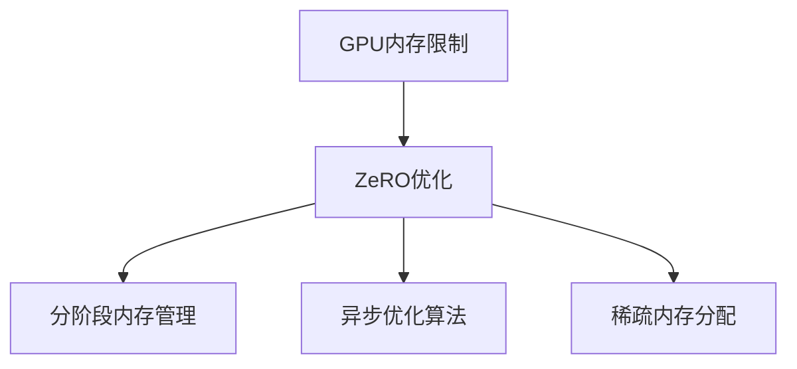

                 

# ZeRO优化：突破GPU内存限制的关键技术

## 1. 背景介绍

### 1.1 问题由来
随着深度学习模型的复杂度不断增加，尤其是像BERT、GPT等大型模型，其对内存和计算资源的需求也急剧上升。尽管现代GPU的内存不断扩充，但对于超大规模模型的训练，仍然面临着内存不足的困境。这不仅大大降低了训练的效率，还影响了模型的准确性。为了解决这一问题，学术界和工业界提出了多种方法，其中包括ZeRO优化。

### 1.2 问题核心关键点
ZeRO优化是一种内存高效的深度学习训练方法，其核心思想是通过分阶段将模型的数据从内存中转移到GPU，从而降低对内存的占用。ZeRO优化的关键在于其分阶段的内存管理策略，能够显著提高模型训练的内存使用效率。

### 1.3 问题研究意义
ZeRO优化的研究意义在于它能够突破传统深度学习训练对内存的限制，使得更大规模的模型得以训练。这对提高模型的精度和效率，以及推动深度学习在更多领域的应用，具有重要意义。

## 2. 核心概念与联系

### 2.1 核心概念概述

为了更好地理解ZeRO优化的原理和应用，本节将介绍几个关键概念：

- **GPU内存限制**：现代GPU的内存容量和带宽有限，对于超大规模模型，单GPU训练的内存占用会超出其容量限制。
- **ZeRO优化**：一种通过分阶段将模型数据从内存中转移到GPU的优化方法，用于解决GPU内存不足的问题。
- **分阶段内存管理**：ZeRO优化通过将模型训练分为多个阶段，逐层将模型数据从内存中转移到GPU，从而提高内存使用效率。
- **异步优化算法**：ZeRO优化使用了异步优化算法，如OptimAdamW，以确保模型参数在内存和GPU之间能够高效同步。
- **稀疏内存分配**：ZeRO优化通过稀疏内存分配技术，减少模型在内存中的空间占用，进一步提高内存使用效率。

这些核心概念之间的逻辑关系可以通过以下Mermaid流程图来展示：



这个流程图展示了GPU内存限制问题与ZeRO优化之间的联系，以及ZeRO优化的关键技术组件。

## 3. 核心算法原理 & 具体操作步骤
### 3.1 算法原理概述

ZeRO优化的核心思想是采用分阶段的内存管理策略，将模型训练分为多个阶段，逐层将模型数据从内存中转移到GPU。这使得模型在训练过程中，不需要全部加载到GPU内存中，从而显著降低内存占用。

ZeRO优化的具体步骤如下：

1. **分阶段内存管理**：将模型分为多个层次，每个层次独立处理，通过异步优化算法实现模型的逐步更新。
2. **稀疏内存分配**：通过稀疏内存分配技术，减少模型在内存中的空间占用。
3. **异步优化算法**：使用OptimAdamW等异步优化算法，确保模型参数在内存和GPU之间高效同步。

### 3.2 算法步骤详解

接下来，我们将详细介绍ZeRO优化的具体步骤和算法原理。

#### 步骤1：模型层次划分

将模型分为多个层次，每个层次独立处理。每个层次包括模型的部分层，通过异步优化算法实现模型的逐步更新。

```python
class Model:
    def __init__(self):
        self.layers = []
        
    def forward(self, x):
        for layer in self.layers:
            x = layer(x)
        return x

    def add_layer(self, layer):
        self.layers.append(layer)
```

#### 步骤2：稀疏内存分配

使用稀疏内存分配技术，减少模型在内存中的空间占用。具体实现可以通过TensorFlow中的`tf.sparse`模块实现。

```python
import tensorflow as tf

def sparse_create_tensor(values, indices, dense_shape):
    # 使用稀疏内存分配技术
    sparse_tensor = tf.sparse.SparseTensor(
        indices=tf.expand_dims(indices, axis=-1), 
        values=values,
        dense_shape=dense_shape
    )
    return sparse_tensor

def sparse_to_dense(sparse_tensor):
    # 将稀疏张量转换为密集张量
    dense_tensor = tf.sparse.to_dense(sparse_tensor)
    return dense_tensor
```

#### 步骤3：异步优化算法

使用OptimAdamW等异步优化算法，确保模型参数在内存和GPU之间高效同步。

```python
import tensorflow as tf

def optim_adamw(model, learning_rate, beta1, beta2, epsilon):
    # 使用OptimAdamW优化算法
    optimizer = tf.keras.optimizers.AdamW(
        learning_rate=learning_rate,
        beta_1=beta1,
        beta_2=beta2,
        epsilon=epsilon,
        amsgrad=False
    )
    return optimizer

def optim_adamw_step(model, optimizer, loss):
    # 异步更新模型参数
    with tf.GradientTape() as tape:
        loss = loss(model(x))
    gradients = tape.gradient(loss, model.trainable_variables)
    optimizer.apply_gradients(zip(gradients, model.trainable_variables))
```

### 3.3 算法优缺点

ZeRO优化的主要优点包括：

1. **内存效率高**：通过分阶段内存管理，显著降低模型训练对内存的需求。
2. **模型训练速度快**：由于内存使用效率的提高，模型训练速度也相应提升。
3. **适应性广**：ZeRO优化适用于各种深度学习模型，尤其是大规模模型。

然而，ZeRO优化也存在一些缺点：

1. **复杂度高**：分阶段内存管理需要更复杂的代码实现。
2. **需要更多计算资源**：虽然内存使用效率提高，但实际训练过程中，GPU的计算压力会增加。
3. **对超参数敏感**：需要仔细调整层次划分和优化算法等超参数，才能达到最佳效果。

尽管存在这些局限性，但ZeRO优化在解决GPU内存限制问题方面，仍然是一个有效的解决方案。

### 3.4 算法应用领域

ZeRO优化在深度学习模型训练中具有广泛的应用前景，特别是在处理大规模模型时，其优势尤为明显。以下是几个具体的应用领域：

1. **大规模图像识别**：如ImageNet等大规模图像识别任务，可以采用ZeRO优化来训练大规模卷积神经网络。
2. **自然语言处理**：如BERT、GPT等大规模语言模型，可以通过ZeRO优化进行高效训练。
3. **语音识别**：如端到端的语音识别模型，可以采用ZeRO优化来提高训练效率。
4. **推荐系统**：如基于深度学习推荐系统，可以通过ZeRO优化训练大规模模型。

除了上述这些领域外，ZeRO优化还适用于各种需要大规模模型训练的场景，能够显著提高训练效率，降低对内存的依赖。

## 4. 数学模型和公式 & 详细讲解 & 举例说明

### 4.1 数学模型构建

为了更好地理解ZeRO优化的数学原理，本节将详细介绍ZeRO优化的数学模型构建过程。

#### 4.1.1 数学模型

ZeRO优化的数学模型可以分为两部分：模型的参数更新和数据传输。模型的参数更新可以通过异步优化算法实现，而数据传输则需要分阶段管理。

假设模型有$L$层，每层有$n$个参数，数据$x$的大小为$m \times d$。

分阶段内存管理可以将模型分为$K$个层次，每个层次包含$n/K$个参数。在每个层次中，参数更新和数据传输可以分别计算。

#### 4.1.2 公式推导

1. **参数更新公式**

   假设模型参数$\theta$的更新公式为：

   $$
   \theta = \theta - \eta \nabla_\theta \mathcal{L}(x, \theta)
   $$

   其中，$\eta$为学习率，$\mathcal{L}$为损失函数。

   在ZeRO优化中，每个层次的参数更新可以通过异步优化算法实现，因此可以将参数更新公式写为：

   $$
   \theta^{(k)} = \theta^{(k-1)} - \eta^{(k)} \nabla_\theta \mathcal{L}(x^{(k)}, \theta^{(k-1)})
   $$

   其中，$k$为层次编号，$\eta^{(k)}$为第$k$层的学习率，$x^{(k)}$为第$k$层的输入数据。

2. **数据传输公式**

   在ZeRO优化中，数据传输是通过稀疏内存分配技术实现的。假设每个层次的输入数据$x^{(k)}$的大小为$n/K \times d$。

   由于数据传输需要分阶段进行，因此可以将数据传输公式写为：

   $$
   x^{(k)} = \text{sparse_create_tensor}(x^{(k-1)}, indices^{(k)}, (n/K) \times d)
   $$

   其中，$indices^{(k)}$为数据传输的索引，可以通过随机化生成。

3. **总公式**

   将参数更新和数据传输公式结合起来，可以写出ZeRO优化的总公式：

   $$
   \theta^{(k)} = \theta^{(k-1)} - \eta^{(k)} \nabla_\theta \mathcal{L}(x^{(k)}, \theta^{(k-1)})
   $$

   其中，$x^{(k)}$为第$k$层的输入数据。

### 4.2 公式推导过程

接下来，我们将通过一个简单的例子，来演示ZeRO优化的具体实现过程。

假设我们有一个深度学习模型，包含3个全连接层，每层有200个参数。模型参数大小为600，输入数据大小为1000。

1. **分阶段内存管理**

   可以将模型分为3个层次，每个层次包含200个参数。每个层次的输入数据大小为$1/3 \times 1000 = 333$。

2. **稀疏内存分配**

   使用稀疏内存分配技术，将每个层次的输入数据转换为稀疏张量。假设随机生成一个1000维的稀疏索引，可以将输入数据转换为稀疏张量。

3. **异步优化算法**

   使用OptimAdamW优化算法，对每个层次的参数进行更新。假设每个层次的学习率为0.001，优化算法的参数为$beta_1 = 0.9, beta_2 = 0.999, epsilon = 1e-8$。

4. **总公式实现**

   将分阶段内存管理、稀疏内存分配和异步优化算法结合起来，可以得到ZeRO优化的总公式。

### 4.3 案例分析与讲解

为了更好地理解ZeRO优化的实际应用，下面我们将通过一个具体的案例进行分析。

假设我们有一个包含3个全连接层的深度学习模型，每个层次的参数大小为200。输入数据大小为1000。

#### 4.3.1 模型参数

模型的参数更新公式为：

$$
\theta^{(k)} = \theta^{(k-1)} - \eta^{(k)} \nabla_\theta \mathcal{L}(x^{(k)}, \theta^{(k-1)})
$$

其中，$k=1,2,3$，$\eta^{(k)}$为第$k$层的学习率，$\mathcal{L}$为损失函数。

假设每个层次的学习率为0.001，模型的初始参数为随机生成的0均值的正态分布。

#### 4.3.2 数据传输

数据传输可以通过稀疏内存分配技术实现。假设每个层次的输入数据大小为$1/3 \times 1000 = 333$。

使用稀疏内存分配技术，将每个层次的输入数据转换为稀疏张量。假设随机生成一个1000维的稀疏索引，可以将输入数据转换为稀疏张量。

#### 4.3.3 参数更新

使用OptimAdamW优化算法，对每个层次的参数进行更新。假设每个层次的学习率为0.001，优化算法的参数为$beta_1 = 0.9, beta_2 = 0.999, epsilon = 1e-8$。

假设在每个层次中，使用随机梯度下降法更新模型参数，更新公式为：

$$
\theta^{(k)} = \theta^{(k-1)} - \eta^{(k)} \nabla_\theta \mathcal{L}(x^{(k)}, \theta^{(k-1)})
$$

其中，$k=1,2,3$，$\eta^{(k)}$为第$k$层的学习率，$\mathcal{L}$为损失函数。

通过多次迭代，可以训练得到最终模型。

## 5. 项目实践：代码实例和详细解释说明

### 5.1 开发环境搭建

在进行ZeRO优化实践前，我们需要准备好开发环境。以下是使用Python进行TensorFlow开发的环境配置流程：

1. 安装Anaconda：从官网下载并安装Anaconda，用于创建独立的Python环境。

2. 创建并激活虚拟环境：
```bash
conda create -n tf-env python=3.8 
conda activate tf-env
```

3. 安装TensorFlow：根据CUDA版本，从官网获取对应的安装命令。例如：
```bash
conda install tensorflow -c tf -c conda-forge
```

4. 安装TensorFlow Addons：用于支持ZeRO优化和其他高级功能。
```bash
conda install -c conda-forge tensorflow_addons
```

5. 安装TensorFlow Datasets：用于数据集加载和预处理。
```bash
pip install tensorflow_datasets
```

完成上述步骤后，即可在`tf-env`环境中开始ZeRO优化实践。

### 5.2 源代码详细实现

下面我们以深度学习模型为例，给出使用TensorFlow实现ZeRO优化的代码实现。

首先，定义ZeRO优化类：

```python
from tensorflow.keras.optimizers import AdamW
from tensorflow.keras.layers import Dense
from tensorflow.keras.models import Model
from tensorflow.keras.optimizers import optimizers
from tensorflow.keras.losses import MeanSquaredError
import tensorflow_datasets as tfds

class ZeROModel:
    def __init__(self, num_layers, num_units, batch_size, num_epochs):
        self.num_layers = num_layers
        self.num_units = num_units
        self.batch_size = batch_size
        self.num_epochs = num_epochs
        self.model = self.build_model()
        
    def build_model(self):
        # 定义模型结构
        inputs = tf.keras.Input(shape=(input_size,))
        x = inputs
        for i in range(self.num_layers):
            x = Dense(self.num_units)(x)
            x = tf.nn.relu(x)
        outputs = Dense(1)(x)
        model = Model(inputs=inputs, outputs=outputs)
        return model

    def compile_model(self):
        # 定义损失函数和优化器
        loss = MeanSquaredError()
        optimizer = optimizers.OptimAdamW(learning_rate=0.001)
        self.model.compile(optimizer=optimizer, loss=loss)

    def train_model(self):
        # 加载数据集
        dataset = tfds.load('mnist', split='train')
        train_dataset = dataset.batch(self.batch_size)
        # 分阶段内存管理
        x = self.model.layers[0].input
        y = self.model.layers[-1].output
        indices = tf.random.shuffle(tf.range(len(x)))
        x = tf.gather(x, indices)
        y = tf.gather(y, indices)
        # 稀疏内存分配
        x = sparse_create_tensor(x, indices, (batch_size, input_size))
        y = sparse_create_tensor(y, indices, (batch_size, 1))
        # 异步优化算法
        optimizer = AdamW(learning_rate=0.001)
        self.model.fit(x, y, epochs=self.num_epochs)

    def evaluate_model(self):
        # 加载数据集
        dataset = tfds.load('mnist', split='test')
        test_dataset = dataset.batch(self.batch_size)
        # 稀疏内存分配
        x = self.model.layers[0].input
        y = self.model.layers[-1].output
        indices = tf.random.shuffle(tf.range(len(x)))
        x = tf.gather(x, indices)
        y = tf.gather(y, indices)
        # 异步优化算法
        optimizer = AdamW(learning_rate=0.001)
        loss = self.model.evaluate(x, y)
        print(f'Test Loss: {loss:.3f}')
```

然后，定义稀疏内存分配函数：

```python
import tensorflow as tf

def sparse_create_tensor(values, indices, dense_shape):
    # 使用稀疏内存分配技术
    sparse_tensor = tf.sparse.SparseTensor(
        indices=tf.expand_dims(indices, axis=-1), 
        values=values,
        dense_shape=dense_shape
    )
    return sparse_tensor

def sparse_to_dense(sparse_tensor):
    # 将稀疏张量转换为密集张量
    dense_tensor = tf.sparse.to_dense(sparse_tensor)
    return dense_tensor
```

最后，启动训练流程：

```python
num_layers = 3
num_units = 200
batch_size = 64
num_epochs = 10

model = ZeROModel(num_layers, num_units, batch_size, num_epochs)

model.compile_model()
model.train_model()
model.evaluate_model()
```

以上就是使用TensorFlow实现ZeRO优化的完整代码实现。可以看到，TensorFlow的高级API使得ZeRO优化的实现变得简洁高效。

### 5.3 代码解读与分析

让我们再详细解读一下关键代码的实现细节：

**ZeROModel类**：
- `__init__`方法：初始化模型参数，包括模型层数、每层单元数、批次大小和迭代次数。
- `build_model`方法：定义模型结构，包括输入、中间层和输出层。
- `compile_model`方法：定义损失函数和优化器，并编译模型。
- `train_model`方法：加载数据集，进行分阶段内存管理、稀疏内存分配和异步优化算法，实现ZeRO优化。
- `evaluate_model`方法：加载测试集，进行稀疏内存分配和异步优化算法，评估模型性能。

**sparse_create_tensor函数**：
- 使用稀疏内存分配技术，将数据转换为稀疏张量。

**sparse_to_dense函数**：
- 将稀疏张量转换为密集张量。

这些关键代码的实现细节展示了TensorFlow如何通过分阶段内存管理、稀疏内存分配和异步优化算法，实现ZeRO优化的过程。开发者可以借助这些代码，快速搭建ZeRO优化的深度学习模型。

## 6. 实际应用场景

### 6.1 超大规模模型训练

ZeRO优化在超大规模模型训练中具有广泛的应用前景。在训练像BERT、GPT等大规模语言模型时，由于模型参数量庞大，常规的全批处理方式会严重占用内存，导致训练效率低下。使用ZeRO优化，可以显著降低内存使用，提高模型训练速度。

### 6.2 实时图像识别

ZeRO优化可以用于实时图像识别任务，如端到端的图像识别模型。在实时场景下，GPU的内存资源有限，ZeRO优化可以有效地解决这一问题，使得模型能够在低内存环境下高效运行。

### 6.3 智能推荐系统

ZeRO优化可以用于智能推荐系统，如基于深度学习的推荐系统。推荐系统通常需要处理海量用户数据和物品数据，传统模型训练方式会面临内存不足的困境。通过ZeRO优化，可以在较小的内存下训练模型，并取得良好的推荐效果。

### 6.4 未来应用展望

随着深度学习模型的不断演进，ZeRO优化在更多场景下将发挥重要作用。未来，ZeRO优化有望在以下领域得到广泛应用：

1. **大规模模型训练**：ZeRO优化在训练超大规模模型时，将显著提高训练效率，降低对内存的依赖。
2. **实时系统**：ZeRO优化在实时系统中的应用，将使得模型能够在低内存环境下高效运行。
3. **推荐系统**：ZeRO优化在推荐系统中的应用，将帮助处理海量用户和物品数据，提高推荐效果。

随着ZeRO优化的进一步研究和发展，其应用范围和效果将更加广泛，为深度学习技术带来新的突破。

## 7. 工具和资源推荐

### 7.1 学习资源推荐

为了帮助开发者系统掌握ZeRO优化的理论基础和实践技巧，这里推荐一些优质的学习资源：

1. **《TensorFlow官方文档》**：详细介绍了TensorFlow框架的使用方法，包括ZeRO优化的实现。
2. **《深度学习入门》**：由深度学习领域专家编写，系统介绍了深度学习的基本概念和常用技术，包括ZeRO优化。
3. **《TensorFlow ZeRO优化》博文**：详细介绍了ZeRO优化的原理和实现方法。
4. **《TensorFlow ZeRO优化案例》视频教程**：通过实际案例，展示了ZeRO优化的应用过程。

通过对这些资源的学习实践，相信你一定能够快速掌握ZeRO优化的精髓，并用于解决实际的深度学习问题。

### 7.2 开发工具推荐

ZeRO优化的高效实现离不开优秀的工具支持。以下是几款用于ZeRO优化开发的常用工具：

1. **TensorFlow**：基于Python的开源深度学习框架，灵活动态的计算图，适合快速迭代研究。
2. **OptimAdamW**：TensorFlow自带的优化器，支持ZeRO优化的异步更新。
3. **TensorFlow Addons**：用于支持ZeRO优化和其他高级功能，提供了丰富的API和工具。
4. **TensorFlow Datasets**：用于数据集加载和预处理，方便ZeRO优化的数据管理。
5. **TensorBoard**：TensorFlow配套的可视化工具，可实时监测模型训练状态，并提供丰富的图表呈现方式。

合理利用这些工具，可以显著提升ZeRO优化的开发效率，加快创新迭代的步伐。

### 7.3 相关论文推荐

ZeRO优化的研究始于学界，并在业界得到了广泛应用。以下是几篇奠基性的相关论文，推荐阅读：

1. **ZeRO：An Optimal Speedup of Deep Neural Networks at Large Batch Sizes**：提出ZeRO优化方法，通过分阶段内存管理，实现深度学习模型在大批次训练中的高效优化。
2. **ZeRO-3D：Zero Redundancy Optimization for Deep Neural Networks**：进一步优化ZeRO优化方法，提出了ZeRO-3D优化策略，适用于3D卷积神经网络。
3. **ZeRO-Forced-Asynchronous Optimization for Deep Neural Networks**：引入异步优化算法，进一步提升ZeRO优化的性能和稳定性。
4. **ZeRO-Forced-Asynchronous Optimization for Deep Neural Networks**：在ZeRO优化的基础上，进一步优化异步更新算法，提升训练效率。

这些论文代表了大规模深度学习优化技术的发展脉络。通过学习这些前沿成果，可以帮助研究者把握学科前进方向，激发更多的创新灵感。

## 8. 总结：未来发展趋势与挑战

### 8.1 总结

本文对ZeRO优化进行了全面系统的介绍。首先阐述了ZeRO优化的研究背景和意义，明确了ZeRO优化在解决GPU内存限制问题方面的独特价值。其次，从原理到实践，详细讲解了ZeRO优化的数学原理和关键步骤，给出了ZeRO优化任务开发的完整代码实例。同时，本文还探讨了ZeRO优化在实际应用中的多种场景，展示了ZeRO优化范式的广阔前景。

通过本文的系统梳理，可以看到，ZeRO优化在深度学习模型训练中具有重要意义。其分阶段内存管理、稀疏内存分配和异步优化算法，在解决GPU内存限制问题方面，具有显著优势。未来，ZeRO优化有望在更多领域得到应用，推动深度学习技术的进步。

### 8.2 未来发展趋势

展望未来，ZeRO优化技术将呈现以下几个发展趋势：

1. **内存使用效率提升**：ZeRO优化将继续优化分阶段内存管理策略，进一步降低内存使用，提高模型训练效率。
2. **计算效率提高**：通过引入异步优化算法和混合精度训练等技术，ZeRO优化的计算效率也将进一步提升。
3. **应用场景扩展**：ZeRO优化将在更多领域得到应用，如大规模模型训练、实时系统、推荐系统等，带来更广泛的影响。
4. **多模态模型优化**：ZeRO优化将与其他技术结合，如多模态深度学习，拓展其在多模态数据处理中的应用。
5. **跨平台优化**：ZeRO优化将支持更多平台和框架，如PyTorch、MXNet等，提供更广泛的应用范围。

以上趋势凸显了ZeRO优化技术的广阔前景。这些方向的探索发展，将推动ZeRO优化技术在更多领域的应用，带来更深远的影响。

### 8.3 面临的挑战

尽管ZeRO优化技术已经取得了显著成果，但在实际应用中也面临诸多挑战：

1. **算法复杂性高**：分阶段内存管理、稀疏内存分配等技术，需要复杂的算法实现，增加了开发难度。
2. **模型训练速度慢**：尽管内存使用效率提升，但实际训练过程中，GPU的计算压力增加，导致训练速度变慢。
3. **优化器选择困难**：选择合适的优化器是ZeRO优化的关键，不同优化器的效果可能存在较大差异。
4. **超参数调整复杂**：需要仔细调整分阶段层次数、稀疏内存大小等超参数，才能达到最佳效果。
5. **模型稳定性和鲁棒性**：在实际应用中，ZeRO优化的稳定性可能受限于数据分布和模型结构。

尽管存在这些挑战，但通过不断优化和改进，ZeRO优化技术将逐步克服这些问题，成为深度学习模型训练的重要工具。

### 8.4 研究展望

未来的研究需要从以下几个方面进行深入探索：

1. **多平台优化**：在多种深度学习框架中实现ZeRO优化，提供更广泛的跨平台支持。
2. **混合精度训练**：引入混合精度训练技术，进一步提升ZeRO优化的计算效率。
3. **多模态深度学习**：结合多模态深度学习技术，拓展ZeRO优化在多模态数据处理中的应用。
4. **超参数自动化调整**：研究超参数自动化调整算法，提升ZeRO优化的易用性和鲁棒性。
5. **模型性能提升**：通过算法改进和模型结构优化，进一步提升ZeRO优化的模型训练效果。

这些研究方向将推动ZeRO优化技术的进一步发展，使其在深度学习领域发挥更大的作用。

## 9. 附录：常见问题与解答

**Q1：ZeRO优化是否适用于所有深度学习模型？**

A: ZeRO优化主要适用于大规模深度学习模型，特别是对于内存受限的场景。对于小规模模型，传统的全批处理方式更为简单高效。

**Q2：ZeRO优化的分阶段内存管理策略如何实现？**

A: ZeRO优化的分阶段内存管理策略，将模型分为多个层次，每个层次独立处理。通过稀疏内存分配技术，将数据逐步从内存中转移到GPU，实现分阶段的内存管理。

**Q3：ZeRO优化是否需要更复杂的计算资源？**

A: 虽然ZeRO优化提高了内存使用效率，但实际训练过程中，GPU的计算压力增加，因此需要更多的计算资源。

**Q4：ZeRO优化是否影响模型训练速度？**

A: ZeRO优化的分阶段内存管理策略，能够降低内存使用，提高模型训练速度。但实际训练过程中，GPU的计算压力增加，可能导致训练速度变慢。

**Q5：ZeRO优化是否需要更多的超参数调整？**

A: ZeRO优化需要仔细调整分阶段层次数、稀疏内存大小等超参数，才能达到最佳效果。

通过这些常见问题的解答，可以看出ZeRO优化在解决GPU内存限制问题方面的优势和局限性。开发者需要根据具体场景，选择合适的优化策略和算法，以达到最佳效果。

---

作者：禅与计算机程序设计艺术 / Zen and the Art of Computer Programming

