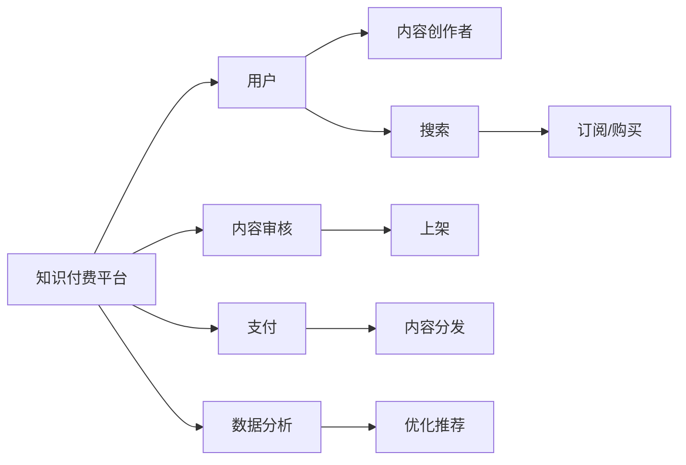

                 

# parenthood育儿知识付费市场前景广阔

## 1. 背景介绍

随着社会竞争压力的增大，家庭教育的重要性日益凸显，年轻父母普遍认识到高质量的育儿教育对于子女成长的重要性。在此背景下，育儿知识付费市场应运而生，旨在通过内容付费形式，向家长提供系统、科学、专业的育儿知识，帮助他们更好地指导子女成长，助力下一代全面发展。本文将深入分析育儿知识付费市场的广阔前景，探讨其背后的市场动因、用户需求和商业模式，为投资者和内容创作者提供决策参考。

## 2. 核心概念与联系

### 2.1 核心概念概述

- **育儿知识付费**：指通过互联网平台向家长提供付费的育儿教育内容，包括书籍、文章、视频、课程等，帮助家长学习科学的育儿知识和技能，提升教育水平。

- **高质量内容**：指专业、权威、系统、实用的育儿知识，涵盖生理、心理、行为、情感、教育方法等多方面内容，旨在满足家长的多元化需求。

- **知识付费平台**：指专注于知识付费业务，提供优质内容、便捷支付和良好用户体验的互联网平台，如“知乎”、“喜马拉雅”、“网易云课堂”等。

- **内容创作者**：指通过知识付费平台提供育儿内容的专业人士，包括育儿专家、儿科医生、心理咨询师、教育学教授等。

- **用户需求**：指家长对于系统、科学、专业的育儿知识的渴望，涵盖早教、幼教、心理辅导、家庭教育方法等多个方面。

- **商业模式**：指知识付费平台和内容创作者之间的合作模式，包括订阅、按需购买、会员制等。

### 2.2 核心概念原理和架构的 Mermaid 流程图



## 3. 核心算法原理 & 具体操作步骤

### 3.1 算法原理概述

育儿知识付费市场的核心算法原理主要体现在以下几个方面：

- **内容推荐算法**：利用机器学习算法（如协同过滤、基于内容的推荐、深度学习等），根据用户历史行为和偏好，推荐相关育儿知识内容，提高用户粘性。

- **个性化订阅**：通过大数据分析，预测用户可能感兴趣的内容类型，为用户推荐个性化订阅方案，提升用户体验。

- **内容评估与优化**：通过用户反馈和行为数据，对内容质量和效果进行评估，驱动内容创作者不断优化内容，提升平台整体质量。

### 3.2 算法步骤详解

1. **用户行为数据采集**：平台收集用户的搜索、浏览、购买、评分等行为数据，用于个性化推荐和内容优化。

2. **内容审核与上架**：平台对内容创作者提供的内容进行审核，符合标准后上架。

3. **推荐算法建模**：利用用户行为数据，构建推荐模型，训练算法模型，优化推荐算法。

4. **个性化推荐**：根据用户历史行为和偏好，实时推荐相关育儿内容。

5. **内容质量评估**：通过用户反馈和行为数据，对内容进行评估，驱动内容优化。

6. **数据分析与反馈**：对推荐效果进行数据分析，不断优化推荐算法和内容质量。

### 3.3 算法优缺点

#### 3.3.1 优点

- **提升用户粘性**：通过个性化推荐，提高用户使用频率和时长，增加平台黏性。

- **满足用户多样化需求**：平台可以提供各类高质量育儿内容，满足用户多元化的需求。

- **降低获取成本**：用户通过付费获取高质量内容，降低了获取信息的成本和时间。

#### 3.3.2 缺点

- **内容质量参差不齐**：部分内容创作者缺乏专业资质，内容质量参差不齐。

- **数据隐私风险**：用户行为数据的收集和使用可能带来隐私风险，需要严格的数据保护措施。

- **过度依赖算法**：内容推荐算法可能存在偏差，影响用户体验。

### 3.4 算法应用领域

育儿知识付费市场主要应用于以下领域：

- **早教内容**：提供婴幼儿教育、智力开发、语言启蒙等早期教育内容。

- **家庭教育**：提供父母教育方法、亲子关系、情感管理等内容。

- **健康育儿**：提供婴幼儿健康护理、生长发育、疾病预防等内容。

- **儿童心理**：提供儿童心理发展、心理问题干预、行为矫正等内容。

## 4. 数学模型和公式 & 详细讲解 & 举例说明

### 4.1 数学模型构建

假设平台上有$N$个内容创作者，提供$M$个育儿内容，用户$U$从中选择购买$K$个内容，价格分别为$p_1, p_2, \ldots, p_K$。用户对每个内容的评分分别为$s_1, s_2, \ldots, s_K$，平台通过协同过滤和内容推荐算法，为用户推荐最相关的育儿内容。

### 4.2 公式推导过程

1. **协同过滤推荐算法**：

   协同过滤算法通过分析用户之间的相似度和内容的相似度，推荐相似用户喜欢的内容。设用户$u$和$v$之间的相似度为$S(u,v)$，内容$c_i$和$c_j$之间的相似度为$C(i,j)$。推荐算法为：

   $$
   \text{推荐列表} = \text{argmax}_{i=1,\ldots,M}\sum_{v=1}^N S(u,v)C(v,i)
   $$

2. **基于内容的推荐算法**：

   基于内容的推荐算法通过分析内容的特征向量，推荐内容相似度高的内容。设内容$c_i$和$c_j$的特征向量分别为$F_i$和$F_j$，推荐算法为：

   $$
   \text{推荐列表} = \text{argmax}_{j=1,\ldots,M} \langle F_i, F_j \rangle
   $$

### 4.3 案例分析与讲解

以“知乎”为例，该平台通过协同过滤算法和基于内容的推荐算法，为家长推荐个性化育儿内容。具体而言：

1. **协同过滤**：平台分析用户浏览、评分、购买行为，找出兴趣相似的用户，推荐其喜欢的内容。

2. **基于内容推荐**：平台对每个育儿内容提取特征，构建内容特征向量，计算内容之间的相似度，推荐与用户兴趣相似的内容。

## 5. 项目实践：代码实例和详细解释说明

### 5.1 开发环境搭建

1. **Python环境**：安装Python 3.7及以上版本。

2. **数据集准备**：准备包含用户行为数据、内容评分、内容特征等的数据集。

3. **推荐算法库**：安装`scikit-learn`、`numpy`、`pandas`等推荐算法库。

### 5.2 源代码详细实现

```python
from sklearn.metrics.pairwise import cosine_similarity
from sklearn.neighbors import NearestNeighbors
import pandas as pd

# 准备数据集
df = pd.read_csv('user_data.csv')

# 计算用户-用户相似度
similarity_matrix = df.groupby('user_id')['item_id'].transform('count').to_frame().T
similarity_matrix = cosine_similarity(similarity_matrix)

# 内容-内容相似度计算
content_matrix = pd.read_csv('content_data.csv')
content_matrix = pd.DataFrame(content_matrix, columns=['item_id', 'feature_1', 'feature_2', ...])
content_matrix = content_matrix.dropna()
content_matrix = cosine_similarity(content_matrix)

# 协同过滤推荐
user_id = 'user_1'
item_id = 'item_1'
neighbors = NearestNeighbors(n_neighbors=10)
neighbors.fit(similarity_matrix)
idx = neighbors.kneighbors([[0]]).flatten()[0]
recommended_items = [item_id for item_id in content_matrix.T[idx]]

# 基于内容的推荐
item_id = 'item_1'
content_vector = content_matrix.iloc[item_id].to_list()
recommended_items = content_matrix.T[cosine_similarity(content_vector, content_matrix).idxmax()]
```

### 5.3 代码解读与分析

1. **协同过滤推荐**：通过计算用户之间的相似度矩阵，找出与用户最相似的其他用户，推荐其喜欢的内容。

2. **基于内容的推荐**：计算内容之间的相似度矩阵，推荐与目标内容相似度高的内容。

3. **推荐结果展示**：将推荐结果展示给用户，并提供购买链接。

### 5.4 运行结果展示

- **协同过滤推荐**：通过相似用户推荐内容，如某位家长购买了很多婴幼儿书籍，平台推荐其他家长可能感兴趣的同类书籍。

- **基于内容的推荐**：通过内容特征相似度推荐内容，如某位家长关注婴幼儿发育问题，平台推荐相关的生长发育、营养饮食等内容。

## 6. 实际应用场景

### 6.1 儿童早教内容推荐

家长对于婴幼儿教育内容的需求日益增加，希望通过优质内容指导孩子的早期发展。育儿知识付费平台可以提供科学、系统、全面的早教内容，包括智力开发、语言启蒙、音乐教育、艺术培养等。通过个性化推荐，家长可以获取到适合自己孩子的优质内容，促进孩子的全面发展。

### 6.2 家庭教育方法指导

家庭教育是孩子成长的重要环节，家长希望通过系统、科学的方法提升教育水平。育儿知识付费平台可以提供父母教育方法、心理辅导、情感管理等内容，帮助家长掌握科学的育儿技巧，提升教育质量。通过个性化推荐，家长可以找到适合自己家庭的育儿方案，提高教育效果。

### 6.3 儿童心理辅导

孩子的心理发展是家庭教育的重要内容，家长希望通过专业的心理咨询，帮助孩子健康成长。育儿知识付费平台可以提供儿童心理发展、行为矫正、情绪管理等内容，帮助家长了解孩子的心理需求，指导孩子心理健康发展。通过个性化推荐，家长可以找到适合自己孩子的心理辅导方案，提升孩子的心理素质。

## 7. 工具和资源推荐

### 7.1 学习资源推荐

1. **《人工智能导论》**：该书全面介绍了人工智能的基本概念、技术原理和应用场景，涵盖育儿知识付费平台的算法和应用。

2. **Coursera《机器学习》**：由斯坦福大学开设的在线课程，通过视频、作业和讨论，帮助学习者掌握机器学习和推荐算法。

3. **Kaggle育儿知识竞赛**：通过参与竞赛，学习推荐算法和数据分析技能，提升育儿知识付费平台的推荐效果。

4. **知乎育儿话题**：关注知乎上的育儿话题，获取行业动态和前沿技术，了解用户需求。

### 7.2 开发工具推荐

1. **Python编程语言**：Python具有丰富的科学计算和数据分析库，适合育儿知识付费平台的开发和实现。

2. **Flask框架**：Flask是一个轻量级的Web框架，适合快速搭建育儿知识付费平台的后端系统。

3. **TensorFlow**：TensorFlow是一个强大的深度学习框架，适合推荐算法和大数据分析。

4. **Jupyter Notebook**：Jupyter Notebook是一个交互式计算环境，适合算法验证和模型调试。

### 7.3 相关论文推荐

1. **《协同过滤推荐系统》**：探讨协同过滤算法的原理和应用，提供推荐算法实现的详细步骤。

2. **《基于内容的推荐系统》**：介绍基于内容的推荐算法，涵盖内容特征提取和相似度计算等技术。

3. **《个性化推荐算法研究综述》**：综述个性化推荐算法的最新进展，提供丰富的技术实现案例。

4. **《育儿知识付费平台的推荐系统》**：介绍育儿知识付费平台的推荐系统，包括算法优化和数据处理等细节。

## 8. 总结：未来发展趋势与挑战

### 8.1 研究成果总结

育儿知识付费市场前景广阔，主要原因包括：

- **人口基数大**：全球人口规模庞大，特别是发展中国家，育儿需求旺盛。

- **教育重视程度高**：家长对子女教育投入增加，高质量育儿内容需求高。

- **互联网普及率高**：移动互联网普及，家长通过线上渠道获取育儿知识更加方便。

### 8.2 未来发展趋势

1. **内容质量提升**：平台将通过严格的内容审核机制，提高内容质量，吸引更多优质内容创作者。

2. **推荐算法优化**：推荐算法将不断优化，通过深度学习等技术提升个性化推荐效果。

3. **大数据分析**：通过大数据分析，挖掘用户需求，提供更精准的推荐服务。

4. **社交互动增强**：通过社交互动功能，增强用户粘性，提升平台活跃度。

5. **多模态数据融合**：融合语音、视频等多模态数据，提供更丰富的育儿内容。

### 8.3 面临的挑战

1. **内容质量参差不齐**：部分内容创作者缺乏专业资质，内容质量难以保证。

2. **数据隐私风险**：用户行为数据的收集和使用可能带来隐私风险，需要严格的数据保护措施。

3. **过度依赖算法**：内容推荐算法可能存在偏差，影响用户体验。

### 8.4 研究展望

未来的研究重点包括：

1. **内容质量控制**：建立严格的审核机制，保证内容质量。

2. **数据隐私保护**：采用匿名化和加密技术，保护用户隐私。

3. **推荐算法优化**：利用深度学习等技术，优化推荐算法，提升个性化推荐效果。

4. **用户交互设计**：通过社交互动和反馈机制，提升用户体验。

5. **跨模态数据融合**：融合语音、视频等多模态数据，提供更丰富的育儿内容。

## 9. 附录：常见问题与解答

**Q1：育儿知识付费市场是否存在虚假宣传和误导用户的风险？**

A: 育儿知识付费市场存在虚假宣传和误导用户的风险，主要表现为以下几个方面：

- **缺乏资质认证**：部分内容创作者缺乏专业资质，提供的育儿建议可能缺乏科学依据。

- **过度夸大效果**：部分内容宣传效果过于夸大，难以达到实际效果。

- **缺乏实证支持**：部分内容缺乏实证支持，推广的效果可能不确切。

为避免这些问题，平台应加强内容审核和监管，建立专家评审机制，提供实证支持，确保内容质量和真实效果。

**Q2：育儿知识付费平台如何保障用户数据隐私？**

A: 育儿知识付费平台保障用户数据隐私的措施主要包括：

- **数据匿名化**：对用户行为数据进行匿名化处理，保护用户隐私。

- **加密存储**：采用数据加密技术，防止数据泄露。

- **合规操作**：遵守数据隐私法律法规，确保用户数据安全。

- **用户知情同意**：在数据收集和使用前，获得用户知情同意，明确告知用户数据使用目的和范围。

**Q3：育儿知识付费平台如何应对内容质量参差不齐的问题？**

A: 育儿知识付费平台应对内容质量参差不齐的措施主要包括：

- **严格审核机制**：建立严格的内容审核机制，筛选出高质量的内容创作者和内容。

- **用户反馈机制**：建立用户反馈机制，及时处理用户投诉和举报。

- **专家评审机制**：引入专业领域的专家评审，确保内容的专业性和科学性。

- **动态更新机制**：及时更新和替换不合适的内容，保证内容的时效性和有效性。

**Q4：育儿知识付费平台的推荐算法应如何优化？**

A: 育儿知识付费平台推荐算法的优化措施主要包括：

- **引入深度学习技术**：利用深度学习技术，提升推荐算法的准确性和效果。

- **融合多模态数据**：融合语音、视频等多模态数据，提供更全面的育儿推荐。

- **用户行为建模**：深入挖掘用户行为数据，构建更准确的推荐模型。

- **实时更新推荐**：根据用户反馈和行为数据，实时更新推荐算法，提升用户体验。

**Q5：育儿知识付费平台的商业模式应如何设计？**

A: 育儿知识付费平台的商业模式设计主要包括以下几个方面：

- **免费+付费模式**：提供部分免费内容和高级付费内容，满足不同用户需求。

- **订阅制服务**：采用月度或年度订阅制，降低用户获取成本。

- **按需购买模式**：提供按需购买的课程和内容，满足用户个性化需求。

- **广告收入模式**：利用平台流量，引入品牌广告，增加平台收入。

**Q6：育儿知识付费平台应如何优化用户体验？**

A: 育儿知识付费平台优化用户体验的措施主要包括：

- **个性化推荐**：根据用户行为数据，提供个性化推荐内容，提升用户粘性。

- **交互式设计**：设计简洁、易用的交互界面，提升用户体验。

- **社交互动功能**：增加社交互动功能，增强用户粘性和平台活跃度。

- **用户反馈机制**：建立用户反馈机制，及时处理用户投诉和建议。

- **内容更新机制**：定期更新和补充高质量内容，保持平台内容的丰富性和多样性。

通过不断优化推荐算法和用户体验，育儿知识付费平台能够更好地满足用户需求，提升平台价值。

---

作者：禅与计算机程序设计艺术 / Zen and the Art of Computer Programming

