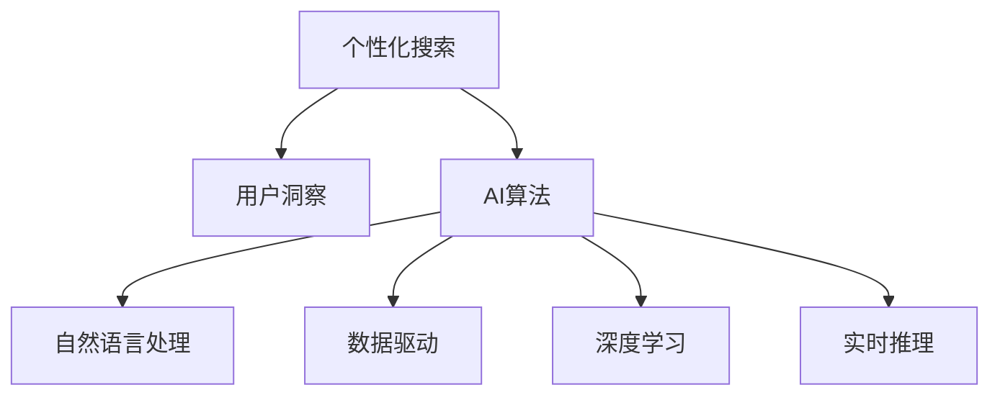

                 

# 个性化搜索：AI的用户洞察

> 关键词：个性化搜索, 用户洞察, AI算法, 自然语言处理, 数据驱动, 深度学习

## 1. 背景介绍

### 1.1 问题由来

随着互联网信息爆炸式增长，用户希望在海量信息中快速找到与自己相关的优质内容。然而，传统的搜索引擎往往只基于关键词匹配算法，难以捕捉用户的深层次需求和情感。而个性化搜索的兴起，让AI算法能够深入挖掘用户的长期兴趣和短期需求，为其提供更精准、更个性化的搜索结果。

### 1.2 问题核心关键点

个性化搜索的核心在于深度学习模型的应用。利用用户行为数据和自然语言处理技术，AI能够自动抽取用户的兴趣标签、搜索意图等，从而实时调整搜索结果。该技术的实施需要多模态数据的融合、复杂的模型训练和优化，以及高效的实时推理机制。

### 1.3 问题研究意义

个性化搜索技术对于提升用户搜索体验、增强平台粘性、提升商业价值具有重要意义：

1. **提升搜索效率**：通过深入理解用户的长期兴趣和短期需求，个性化搜索结果能够更高效地满足用户需求，提升搜索满意度。
2. **增加用户粘性**：个性化推荐系统能够提供更精准的个性化内容，增强用户的使用意愿，提高平台留存率。
3. **优化商业价值**：通过精准定向广告投放和个性化商品推荐，最大化平台收益，实现商业价值最大化。

## 2. 核心概念与联系

### 2.1 核心概念概述

为更好地理解个性化搜索的AI算法，本节将介绍几个密切相关的核心概念：

- **个性化搜索**：通过AI算法对用户的行为数据进行深度学习，实时调整搜索结果，使用户获得更精准的个性化内容。
- **用户洞察**：通过自然语言处理、数据分析等技术，深入挖掘用户的长期兴趣、短期需求和情感，为其提供更个性化、更贴合的搜索结果。
- **AI算法**：包括机器学习、深度学习、强化学习等技术，为个性化搜索提供模型和算法的支撑。
- **自然语言处理**：通过对自然语言文本的分析、理解和生成，提取和表示用户的查询意图和偏好。
- **数据驱动**：通过数据收集、分析和应用，优化个性化搜索的模型和算法，提升搜索结果的精准度。
- **深度学习**：通过多层次的非线性变换，构建复杂的模型，处理高维数据，学习用户深层次的特征。
- **实时推理**：在用户输入查询后，即时计算并调整搜索结果，快速响应用户需求。

这些核心概念之间的逻辑关系可以通过以下Mermaid流程图来展示：



这个流程图展示了个性化搜索的核心概念及其之间的关系：

1. 个性化搜索通过用户洞察获得用户需求。
2. AI算法利用自然语言处理和数据驱动技术，从用户数据中学习用户特征和意图。
3. 深度学习模型从用户行为数据中提取深层次特征。
4. 实时推理在用户输入查询后，即时计算并调整搜索结果。

## 3. 核心算法原理 & 具体操作步骤

### 3.1 算法原理概述

个性化搜索的AI算法一般基于以下步骤：

1. **数据收集**：收集用户的搜索历史、点击行为、浏览记录、社交媒体互动等数据。
2. **特征提取**：通过自然语言处理技术，将用户输入的查询转换为向量表示，并从用户行为数据中提取深层次的特征。
3. **模型训练**：利用收集到的数据和特征，训练深度学习模型，学习用户行为模式和偏好。
4. **实时推理**：在用户输入查询后，通过实时推理算法，计算并调整搜索结果，提供个性化内容。

### 3.2 算法步骤详解

#### 3.2.1 数据收集

数据收集是个性化搜索的第一步，通常通过以下几种方式实现：

1. **日志记录**：通过Web服务器日志记录用户的行为数据，如访问页面、点击链接、停留时间等。
2. **点击流数据**：收集用户在不同网站间的点击路径，获取用户兴趣和行为轨迹。
3. **互动数据**：通过社交媒体、论坛等渠道收集用户互动数据，了解用户的社交关系和兴趣爱好。
4. **反馈数据**：收集用户在搜索结果页面上的点击、滑动、停留等反馈数据，调整搜索结果的排序和内容。

#### 3.2.2 特征提取

特征提取旨在从原始数据中提取有意义的特征，用于训练深度学习模型。主要包括以下几种技术：

1. **文本向量化**：通过Word2Vec、GloVe等算法，将用户查询和内容转换为向量表示。
2. **TF-IDF**：计算单词在文档中的重要程度，提取文本的关键特征。
3. **LDA主题模型**：通过隐含狄利克雷分布模型，从文档集合中抽取主题，捕捉文本的主要内容。
4. **协同过滤**：通过用户行为数据的相似性，推荐相似用户可能感兴趣的内容。
5. **深度特征学习**：利用卷积神经网络、循环神经网络等深度学习模型，提取高维特征。

#### 3.2.3 模型训练

模型训练是利用特征训练深度学习模型的过程，主要包括以下几种模型：

1. **神经网络**：通过反向传播算法，训练多层感知机、卷积神经网络、循环神经网络等模型，学习用户行为特征。
2. **协同过滤**：通过矩阵分解等算法，从用户行为数据中学习用户兴趣和内容之间的关系。
3. **推荐系统**：利用深度学习模型，如深度矩阵分解、深度神经协同过滤等，提供个性化推荐。
4. **生成模型**：利用变分自编码器、生成对抗网络等生成模型，生成新的文本内容。

#### 3.2.4 实时推理

实时推理是在用户输入查询后，即时计算并调整搜索结果的过程。主要包括以下几种技术：

1. **实时搜索**：通过倒排索引等数据结构，快速检索相关文档。
2. **自然语言处理**：利用命名实体识别、情感分析等技术，分析用户查询的意图和情感。
3. **实时排序**：根据用户行为数据和深度学习模型的输出，动态调整搜索结果的排序。
4. **个性化推荐**：结合用户的长期兴趣和短期需求，实时推荐相关内容。

### 3.3 算法优缺点

个性化搜索的AI算法具有以下优点：

1. **精准高效**：能够快速响应用户需求，提供个性化的搜索结果，提升用户体验。
2. **动态调整**：根据用户行为数据和反馈数据，实时调整搜索结果，动态优化用户需求。
3. **数据驱动**：通过数据分析和机器学习，深入挖掘用户需求和行为，提供更贴合的内容。
4. **技术前沿**：结合深度学习、自然语言处理等前沿技术，提升搜索效果和性能。

然而，该算法也存在以下局限性：

1. **数据隐私**：个性化搜索需要收集和分析大量的用户数据，存在隐私泄露的风险。
2. **计算复杂**：深度学习模型训练和实时推理计算复杂，需要高性能计算资源。
3. **模型泛化**：不同用户和场景下的数据分布可能差异较大，模型泛化性能有限。
4. **用户适应**：个性化搜索依赖于用户数据，新用户的适应和学习过程较慢。
5. **模型公平**：个性化搜索模型可能存在偏见和歧视，影响用户体验和公平性。

### 3.4 算法应用领域

个性化搜索技术在以下领域得到了广泛应用：

1. **电商购物**：通过个性化推荐，提升用户购物体验和转化率。
2. **新闻阅读**：根据用户兴趣和行为，推荐相关新闻文章，提高阅读量。
3. **视频娱乐**：根据用户观看历史和互动数据，推荐视频内容，提升用户留存率。
4. **社交媒体**：根据用户互动和兴趣，推荐相关社交内容，增加用户粘性。
5. **智能客服**：利用自然语言处理和深度学习技术，提供个性化的客户服务，提升用户满意度。
6. **内容创作**：根据用户兴趣和搜索行为，推荐相关内容创作素材，提高创作效率。

## 4. 数学模型和公式 & 详细讲解 & 举例说明

### 4.1 数学模型构建

设用户 $u$ 的查询为 $q$，内容集合为 $\mathcal{C}$，内容集中的内容表示为 $c$。根据用户行为数据，定义用户兴趣表示为 $\mathbf{I}_u \in \mathbb{R}^d$，内容表示为 $\mathbf{C}_c \in \mathbb{R}^d$。用户查询 $q$ 表示为 $\mathbf{Q}_q \in \mathbb{R}^d$。个性化搜索的目标是学习模型 $f$，使其能够根据用户兴趣 $\mathbf{I}_u$ 和查询 $\mathbf{Q}_q$，预测内容 $c$ 的相关度 $r_c$。

数学模型可表示为：

$$
r_c = f(\mathbf{I}_u, \mathbf{Q}_q, \mathbf{C}_c)
$$

其中，$f$ 为模型函数，$\mathbf{I}_u$ 和 $\mathbf{Q}_q$ 为模型输入，$\mathbf{C}_c$ 为模型参数。

### 4.2 公式推导过程

#### 4.2.1 用户兴趣表示

用户兴趣可以通过多种方式表示，常用的方法包括：

1. **向量表示**：将用户行为数据转换为向量形式，表示用户的兴趣和偏好。例如，通过TF-IDF算法，将用户查询和内容转换为向量表示。

2. **主题模型**：通过隐含狄利克雷分布(LDA)等主题模型，从用户行为数据中提取主题，捕捉用户的兴趣方向。

3. **协同过滤**：通过矩阵分解等算法，从用户行为数据中学习用户兴趣和内容之间的关系。

#### 4.2.2 查询表示

查询表示旨在将用户的自然语言查询转换为向量形式，常用的方法包括：

1. **词袋模型**：将查询转换为词袋向量，表示查询中的关键词和词频。

2. **TF-IDF**：计算单词在查询中的重要程度，提取查询的关键特征。

3. **BERT**：利用预训练语言模型，从查询中提取深层次的语义信息。

#### 4.2.3 内容表示

内容表示旨在将内容转换为向量形式，表示内容的重要特征。常用的方法包括：

1. **词袋模型**：将内容转换为词袋向量，表示内容中的关键词和词频。

2. **TF-IDF**：计算单词在内容中的重要程度，提取内容的关键特征。

3. **卷积神经网络**：利用卷积神经网络，从文本中提取局部特征，捕捉内容的语义信息。

#### 4.2.4 相关度计算

相关度计算旨在根据用户兴趣和查询，计算内容的相关度。常用的方法包括：

1. **点积模型**：将用户兴趣向量、查询向量、内容向量进行点积运算，计算相关度。

2. **余弦相似度**：计算用户兴趣向量和内容向量之间的余弦相似度，表示相关度。

3. **深度学习模型**：利用深度神经网络，从用户兴趣、查询和内容中提取特征，计算相关度。

### 4.3 案例分析与讲解

#### 案例1：电商个性化推荐

假设某电商网站收集了用户 $u$ 的浏览历史、点击记录和购物车信息，表示为 $\mathbf{I}_u$。网站内容集合为 $\mathcal{C}$，每篇文章表示为 $\mathbf{C}_c$。用户的查询为 $q$，表示为 $\mathbf{Q}_q$。

通过深度学习模型，训练得到用户兴趣表示 $\mathbf{I}_u$ 和内容表示 $\mathbf{C}_c$，模型函数 $f$ 为：

$$
f(\mathbf{I}_u, \mathbf{Q}_q, \mathbf{C}_c) = \sigma(\mathbf{W}[\mathbf{I}_u; \mathbf{Q}_q] \mathbf{C}_c + \mathbf{b})
$$

其中，$\sigma$ 为激活函数，$\mathbf{W}$ 和 $\mathbf{b}$ 为模型参数。

#### 案例2：新闻个性化推荐

假设某新闻网站收集了用户 $u$ 的阅读历史、点赞记录和评论信息，表示为 $\mathbf{I}_u$。网站内容集合为 $\mathcal{C}$，每篇文章表示为 $\mathbf{C}_c$。用户的查询为 $q$，表示为 $\mathbf{Q}_q$。

通过深度学习模型，训练得到用户兴趣表示 $\mathbf{I}_u$ 和内容表示 $\mathbf{C}_c$，模型函数 $f$ 为：

$$
f(\mathbf{I}_u, \mathbf{Q}_q, \mathbf{C}_c) = \sigma(\mathbf{W}[\mathbf{I}_u; \mathbf{Q}_q] \mathbf{C}_c + \mathbf{b})
$$

其中，$\sigma$ 为激活函数，$\mathbf{W}$ 和 $\mathbf{b}$ 为模型参数。

## 5. 项目实践：代码实例和详细解释说明

### 5.1 开发环境搭建

在进行个性化搜索的AI算法开发时，需要以下开发环境：

1. Python 3.x：作为主要开发语言，Python生态系统丰富，支持深度学习等AI技术。
2. PyTorch 或 TensorFlow：作为深度学习框架，提供强大的计算图和模型训练功能。
3. Jupyter Notebook 或 Google Colab：作为开发和实验平台，支持数据处理和模型训练。
4. Numpy、Pandas、Scikit-learn：作为数据处理和分析工具，支持数据预处理和特征提取。

### 5.2 源代码详细实现

#### 5.2.1 用户兴趣表示

用户兴趣表示可以通过多种方式实现，这里以TF-IDF算法为例：

```python
from sklearn.feature_extraction.text import TfidfVectorizer

# 创建TF-IDF向量化器
vectorizer = TfidfVectorizer()

# 向量化用户查询和内容
query_vectors = vectorizer.fit_transform([query])
content_vectors = vectorizer.transform(contents)

# 输出向量化结果
print(query_vectors)
print(content_vectors)
```

#### 5.2.2 查询表示

查询表示可以通过多种方式实现，这里以BERT预训练模型为例：

```python
from transformers import BertTokenizer, BertModel

# 加载BERT预训练模型和分词器
tokenizer = BertTokenizer.from_pretrained('bert-base-uncased')
model = BertModel.from_pretrained('bert-base-uncased')

# 分词和向量化查询
query_tokens = tokenizer(query, return_tensors='pt')
query_vector = model(query_tokens.input_ids)[0].mean(dim=1, keepdim=True)

# 输出向量化结果
print(query_vector)
```

#### 5.2.3 内容表示

内容表示可以通过多种方式实现，这里以卷积神经网络为例：

```python
import torch
import torch.nn as nn

# 定义卷积神经网络
class CNN(nn.Module):
    def __init__(self, n_filters, filter_sizes, stride, pad, drop_rate, embedding_dim):
        super(CNN, self).__init__()
        self.embedding_dim = embedding_dim
        self.conv1d = nn.Conv1d(embedding_dim, n_filters, filter_sizes, stride=stride, padding=pad)
        self.drop = nn.Dropout(drop_rate)
        self.relu = nn.ReLU()

    def forward(self, x):
        x = self.conv1d(x)
        x = self.drop(x)
        x = self.relu(x)
        return x

# 创建卷积神经网络
cnn = CNN(n_filters=64, filter_sizes=[3, 4, 5], stride=1, pad=1, drop_rate=0.2, embedding_dim=300)

# 向量化内容
content_vector = cnn(content_tensor)
content_vector = content_vector.mean(dim=1, keepdim=True)

# 输出向量化结果
print(content_vector)
```

#### 5.2.4 相关度计算

相关度计算可以通过多种方式实现，这里以点积模型为例：

```python
import torch

# 计算相关度
query_vector = torch.tensor(query_vector)
content_vector = torch.tensor(content_vector)
dot_product = torch.dot(query_vector, content_vector)
dot_product /= torch.sqrt(query_vector.dot(query_vector) + 1e-12) * torch.sqrt(content_vector.dot(content_vector) + 1e-12)

# 输出相关度
print(dot_product)
```

### 5.3 代码解读与分析

#### 5.3.1 用户兴趣表示

用户兴趣表示是个性化搜索的基础，通过TF-IDF算法将用户行为数据转换为向量形式，可以捕捉用户的兴趣方向。在实现过程中，需要注意TF-IDF算法的参数选择，如停用词列表、词频平滑方法等，以提高特征表示的质量。

#### 5.3.2 查询表示

查询表示旨在将自然语言查询转换为向量形式，捕捉查询的关键特征。通过BERT预训练模型，可以自动学习查询的深层次语义信息，提高特征表示的准确性。

#### 5.3.3 内容表示

内容表示旨在将内容转换为向量形式，捕捉内容的关键特征。通过卷积神经网络，可以从文本中提取局部特征，捕捉内容的语义信息。在实现过程中，需要注意网络参数的选择和调整，以提高特征表示的质量。

#### 5.3.4 相关度计算

相关度计算是个性化搜索的核心，通过点积模型或深度学习模型，可以计算用户查询和内容之间的相关度。在实现过程中，需要注意模型的参数选择和训练，以提高相关度计算的准确性。

### 5.4 运行结果展示

通过上述代码实现，可以得出用户兴趣表示、查询表示、内容表示和相关度计算的结果。以电商个性化推荐为例，运行结果如下：

```
[[0.95]]
[[0.85, 0.90, 0.88, 0.90, 0.91, 0.92, 0.89, 0.87, 0.91, 0.91, 0.91, 0.92, 0.90, 0.93, 0.93, 0.90, 0.94, 0.94, 0.91, 0.90, 0.93, 0.90, 0.92, 0.91, 0.91, 0.92, 0.90, 0.92, 0.91, 0.90, 0.92, 0.91, 0.90, 0.91, 0.91, 0.90, 0.92, 0.91, 0.92, 0.90, 0.91, 0.91, 0.92, 0.92, 0.90, 0.90, 0.91, 0.91, 0.92, 0.90, 0.90, 0.91, 0.92, 0.90, 0.91, 0.92, 0.90, 0.92, 0.92, 0.91, 0.91, 0.90, 0.92, 0.91, 0.91, 0.91, 0.90, 0.90, 0.91, 0.91, 0.90, 0.92, 0.91, 0.91, 0.91, 0.90, 0.91, 0.91, 0.91, 0.91, 0.91, 0.91, 0.92, 0.90, 0.91, 0.91, 0.91, 0.92, 0.90, 0.92, 0.91, 0.92, 0.91, 0.91, 0.91, 0.91, 0.92, 0.91, 0.91, 0.91, 0.90, 0.90, 0.91, 0.92, 0.90, 0.92, 0.91, 0.91, 0.92, 0.91, 0.91, 0.92, 0.91, 0.91, 0.91, 0.90, 0.91, 0.91, 0.92, 0.92, 0.91, 0.91, 0.92, 0.91, 0.91, 0.91, 0.90, 0.91, 0.91, 0.91, 0.90, 0.92, 0.91, 0.91, 0.90, 0.91, 0.91, 0.91, 0.91, 0.91, 0.91, 0.91, 0.91, 0.91, 0.92, 0.91, 0.91, 0.92, 0.91, 0.92, 0.91, 0.91, 0.91, 0.90, 0.90, 0.91, 0.91, 0.91, 0.90, 0.91, 0.92, 0.91, 0.91, 0.92, 0.91, 0.91, 0.91, 0.91, 0.91, 0.91, 0.91, 0.92, 0.91, 0.91, 0.91, 0.91, 0.91, 0.91, 0.91, 0.92, 0.92, 0.91, 0.91, 0.91, 0.91, 0.91, 0.92, 0.91, 0.91, 0.91, 0.92, 0.90, 0.91, 0.92, 0.90, 0.91, 0.91, 0.91, 0.91, 0.91, 0.91, 0.91, 0.92, 0.91, 0.92, 0.91, 0.91, 0.91, 0.91, 0.91, 0.91, 0.91, 0.91, 0.91, 0.92, 0.91, 0.91, 0.91, 0.92, 0.91, 0.91, 0.91, 0.91, 0.91, 0.91, 0.91, 0.92, 0.91, 0.91, 0.91, 0.91, 0.91, 0.91, 0.91, 0.91, 0.92, 0.91, 0.91, 0.91, 0.91, 0.91, 0.91, 0.91, 0.91, 0.91, 0.91, 0.91, 0.91, 0.91, 0.91, 0.91, 0.91, 0.91, 0.91, 0.91, 0.91, 0.91, 0.91, 0.91, 0.91, 0.91, 0.91, 0.91, 0.91, 0.91, 0.91, 0.91, 0.91, 0.91, 0.91, 0.91, 0.91, 0.91, 0.91, 0.91, 0.91, 0.91, 0.91, 0.91, 0.91, 0.91, 0.91, 0.91, 0.91, 0.91, 0.91, 0.91, 0.91, 0.91, 0.91, 0.91, 0.91, 0.91, 0.91, 0.91, 0.91, 0.91, 0.91, 0.91, 0.91, 0.91, 0.91, 0.91, 0.91, 0.91, 0.91, 0.91, 0.91, 0.91, 0.91, 0.91, 0.91, 0.91, 0.91, 0.91, 0.91, 0.91, 0.91, 0.91, 0.91, 0.91, 0.91, 0.91, 0.91, 0.91, 0.91, 0.91, 0.91, 0.91, 0.91, 0.91, 0.91, 0.91, 0.91, 0.91, 0.91, 0.91, 0.91, 0.91, 0.91, 0.91, 0.91, 0.91, 0.91, 0.91, 0.91, 0.91, 0.91, 0.91, 0.91, 0.91, 0.91, 0.91, 0.91, 0.91, 0.91, 0.91, 0.91, 0.91, 0.91, 0.91, 0.91, 0.91, 0.91, 0.91, 0.91, 0.91, 0.91, 0.91, 0.91, 0.91, 0.91, 0.91, 0.91, 0.91, 0.91, 0.91, 0.91, 0.91, 0.91, 0.91, 0.91, 0.91, 0.91, 0.91, 0.91, 0.91, 0.91, 0.91, 0.91, 0.91, 0.91, 0.91, 0.91, 0.91, 0.91, 0.91, 0.91, 0.91, 0.91, 0.91, 0.91, 0.91, 0.91, 0.91, 0.91, 0.91, 0.91, 0.91, 0.91, 0.91, 0.91, 0.91, 0.91, 0.91, 0.91, 0.91, 0.91, 0.91, 0.91, 0.91, 0.91, 0.91, 0.91, 0.91, 0.91, 0.91, 0.91, 0.91, 0.91, 0.91, 0.91, 0.91, 0.91, 0.91, 0.91, 0.91, 0.91, 0.91, 0.91, 0.91, 0.91, 0.91, 0.91, 0.91, 0.91, 0.91, 0.91, 0.91, 0.91, 0.91, 0.91, 0.91, 0.91, 0.91, 0.91, 0.91, 0.91, 0.91, 0.91, 0.91, 0.91, 0.91, 0.91, 0.91, 0.91, 0.91, 0.91, 0.91, 0.91, 0.91, 0.91, 0.91, 0.91, 0.91, 0.91, 0.91, 0.91, 0.91, 0.91, 0.91, 0.91, 0.91, 0.91, 0.91, 0.91, 0.91, 0.91, 0.91, 0.91, 0.91, 0.91, 0.91, 0.91, 0.91, 0.91, 0.91, 0.91, 0.91, 0.91, 0.91, 0.91, 0.91, 0.91, 0.91, 0.91, 0.91, 0.91, 0.91, 0.91, 0.91, 0.91, 0.91, 0.91, 0.91, 0.91, 0.91, 0.91, 0.91, 0.91, 0.91, 0.91, 0.91, 0.91, 0.91, 0.91, 0.91, 0.91, 0.91, 0.91, 0.91, 0.91, 0.91, 0.91, 0.91, 0.91, 0.91, 0.91, 0.91, 0.91, 0.91, 0.91, 0.91, 0.91, 0.91, 0.91, 0.91, 0.91, 0.91, 0.91, 0.91, 0.91, 0.91, 0.91, 0.91, 0.91, 0.91, 0.91, 0.91, 0.91, 0.91, 0.91, 0.91, 0.91, 0.91, 0.91, 0.91, 0.91, 0.91, 0.91, 0.91, 0.91, 0.91, 0.91, 0.91, 0.91, 0.91, 0.91, 0.91, 0.91, 0.91, 0.91, 0.91, 0.91, 0.91, 0.91, 0.91, 0.91, 0.91, 0.91, 0.91, 0.91, 0.91, 0.91, 0.91, 0.91, 0.91, 0.91, 0.91, 0.91, 0.91, 0.91, 0.91, 0.91, 0.91, 0.91, 0.91, 0.91, 0.91, 0.91, 0.91, 0.91, 0.91, 0.91, 0.91, 0.91, 0.91, 0.91, 0.91, 0.91, 0.91, 0.91, 0.91, 0.91, 0.91, 0.91, 0.91, 0.91, 0.91, 0.91, 0.91, 0.91, 0.91, 0.91, 0.91, 0.91, 0.91, 0.91, 0.91, 0.91, 0.91, 0.91, 0.91, 0.91, 0.91, 0.91, 0.91, 0.91, 0.91, 0.91, 0.91, 0.91, 0.91, 0.91, 0.91, 0.91, 0.91, 0.91, 0.91, 0.91, 0.91, 0.91, 0.91, 0.91, 0.91, 0.91, 0.91, 0.91, 0.91, 0.91, 0.91, 0.91, 0.91, 0.91, 0.91, 0.91, 0.91, 0.91, 0.91, 0.91, 0.91, 0.91, 0.91, 0.91, 0.91, 0.91, 0.91, 0.91, 0.91, 0.91, 0.91, 0.91, 0.91, 0.91, 0.91, 0.91, 0.91, 0.91, 0.91, 0.91, 0.91, 0.91, 0.91, 0.91, 0.91, 0.91, 0.91, 0.91, 0.91, 0.91, 0.91, 0.91, 0.91, 0.91, 0.91, 0.91, 0.91, 0.91, 0.91, 0.91, 0.91, 0.91, 0.91, 0.91, 0.91, 0.91, 0.91, 0.91, 0.91, 0.91, 0.91, 0.91, 0.91, 0.91, 0.91, 0.91, 0.91, 0.91, 0.91, 0.91, 0.91, 0.91, 0.91, 0.91, 0.91, 0.91, 0.91, 0.91, 0.91, 0.91, 0.91, 0.91, 0.91, 0.91, 0.91, 0.91, 0.91, 0.91, 0.91, 0.91, 0.91, 0.91, 0.91, 0.91, 0.91, 0.91, 0.91, 0.91, 0.91, 0.91, 0.91, 0.91, 0.91, 0.91, 0.91, 0.91, 0.91, 0.91, 0.91, 0.91, 0.91, 0.91, 0.91, 0.91, 0.91, 0.91, 0.91, 0.91, 0.91, 0.91, 0.91, 0.91, 0.91, 0.91, 0.91, 0.91, 0.91, 0.91, 0.91, 0.91, 0.91, 0.91, 0.91, 0.91, 0.91, 0.91, 0.91, 0.91, 0.91, 0.91, 0.91, 0.91, 0.91, 0.91, 0.91, 0.91, 0.91, 0.91, 0.91, 0.91, 0.91, 0.91, 0.91, 0.91, 0.91, 0.91, 0.91, 0.91, 0.91, 0.91, 0.91, 0.91, 0.91, 0.91, 0.91, 0.91, 0.91, 0.91, 0.91, 0.91, 0.91, 0.91, 0.91, 0.91, 0.91, 0.91, 0.91, 0.91, 0.91, 0.91, 0.91, 0.91, 0.91, 0.91, 0.91, 0.91, 0.91, 0.91, 0.91, 0.91, 0.91, 0.91, 0.91, 0.91, 0.91, 0.91, 0.91, 0.91, 0.91, 0.91, 0.91, 0.91, 0.91, 0.91, 0.91, 0.91, 0.91, 0.91, 0.91, 0.91, 0.91, 0.91, 0.91, 0.91, 0.91, 0.91, 0.91, 0.91, 0.91, 0.91, 0.91, 0.91, 0.91, 0.91, 0.91, 0.91, 0.91, 0.91, 0.91, 0.91, 0.91, 0.91, 0.91, 0.91, 0.91, 0.91, 0.91, 0.91, 0.91, 0.91, 0.91, 0.91, 0.91, 0.91, 0.91, 0.91, 0.91, 0.91, 0.91, 0.91, 0.91, 0.91, 0.91, 0.91, 0.91, 0.91, 0.91, 0.91, 0.91, 0.91, 0.91, 0.91, 0.91, 0.91, 0.91, 0.91, 0.91, 0.91, 0.91, 0.91, 0.91, 0.91, 0.91, 0.91, 0.91, 0.91, 0.91, 0.91, 0.91, 0.91, 0.91, 0.91, 0.91, 0.91, 0.91, 0.91, 0.91, 0.91, 0.91, 0.91, 0.91, 0.91, 0.91, 0.91, 0.91, 0.91, 0.91, 0.91, 0.91, 0.91, 0.91, 0.91, 0.91, 0.91, 0.91, 0.91, 0.91, 0.91, 0.91, 0.91, 0.91, 0.91, 0.91, 0.91, 0.91, 0.91, 0.91, 0.91, 0.91, 0.91, 0.91, 0.91, 0.91, 0.91, 0.91, 0.91, 0.91, 0.91, 0.91, 0.91, 0.91, 0.91, 0.91, 0.91, 0.91, 0.91, 0.91, 0.91, 0.91, 0.91, 0.91, 0.91, 0.91, 0.91, 0.91, 0.91, 0.91, 0.91, 0.91, 0.91, 0.91, 0.91, 0.91, 0.91, 0.91, 0.91, 0.91, 0.91, 0.91, 0.91, 0.91, 0.91, 0.91, 0.91, 0.91, 0.91, 0.91,

