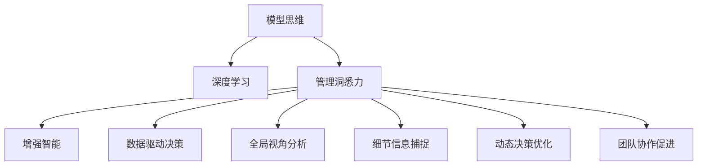

                 

# 丰富模型思维:增强管理者洞悉力

> 关键词：模型思维,管理洞悉力,深度学习,增强智能,团队协作,创新能力,数据驱动决策

## 1. 背景介绍

### 1.1 问题由来
在数字化转型的浪潮下，企业竞争日益激烈，如何在复杂多变的环境中保持敏锐洞察和迅速决策，成为管理者面临的重要挑战。传统的经验决策和局部视角已无法满足现代企业的需求，亟需引入一种全新的思维模式，使管理者能够综合全局视角和细节信息，快速响应市场变化。

### 1.2 问题核心关键点
- **数据驱动决策**：利用大数据和深度学习模型，进行全面分析和预测，避免凭直觉决策。
- **全局视角分析**：从宏观层面理解企业现状和未来趋势，识别关键问题和机遇。
- **细节信息捕捉**：深入挖掘内部数据，发现潜在问题和改进机会。
- **动态决策优化**：通过实时数据和智能模型，持续优化决策过程，提升决策效率和质量。
- **团队协作促进**：构建智能辅助工具，提升团队协作和创新能力，激发集体智慧。

## 2. 核心概念与联系

### 2.1 核心概念概述

为更好地理解如何通过模型思维增强管理者的洞悉力，本节将介绍几个关键概念：

- **模型思维**：指利用数据模型和算法工具，对现实世界进行模拟、分析和预测的思维方式。模型思维能够帮助我们从海量数据中提取有用信息，提供科学的决策依据。

- **深度学习**：一种基于神经网络的机器学习方法，通过多层非线性映射，能够从复杂数据中学习到高级特征表示，广泛应用于模式识别、自然语言处理等领域。

- **管理洞悉力**：管理者对企业内部和外部环境的深刻理解和洞察能力，通过数据驱动、全局视角、细节信息等综合手段，指导企业战略决策和运营管理。

- **增强智能**：结合人工智能技术，如深度学习、自然语言处理、图像识别等，对管理者提供智能支持，提升决策效率和质量。

- **数据驱动决策**：基于大数据和模型分析的决策方式，通过对数据进行科学建模和预测，实现基于数据的决策过程。

- **全局视角分析**：从宏观和战略层面理解企业内外部环境，识别关键问题和机遇，形成全面系统性的解决方案。

- **细节信息捕捉**：深入挖掘和分析内部数据，发现潜在的改进点和优化策略。

- **动态决策优化**：通过实时数据和智能模型，持续调整和优化决策过程，适应市场和环境变化。

- **团队协作促进**：利用智能工具和平台，促进团队协作和创新，释放集体智慧，提高团队整体效率和创造力。

这些核心概念之间的逻辑关系可以通过以下Mermaid流程图来展示：



这个流程图展示了一些关键概念及其之间的关系：

1. 模型思维通过深度学习模型，帮助管理者获得洞察力。
2. 管理洞悉力融合了数据驱动、全局视角和细节信息。
3. 增强智能为管理洞悉力的提升提供了技术支持。
4. 数据驱动决策、全局视角分析、细节信息捕捉、动态决策优化和团队协作促进，共同构成了管理洞悉力的提升手段。

## 3. 核心算法原理 & 具体操作步骤
### 3.1 算法原理概述

增强管理者的洞悉力，通过深度学习模型和大数据分析，从多个维度全面分析和预测企业内部和外部环境，提供基于数据和智能的决策支持。具体来说，模型的构建和训练步骤如下：

1. **数据收集与预处理**：从企业内部和外部获取数据，包括销售记录、客户反馈、市场报告、新闻资讯等，并进行清洗和标准化处理。
2. **特征工程**：选择和构造有效的特征，如时间序列、市场指标、客户属性等，用于模型训练。
3. **模型选择与训练**：选择合适的深度学习模型（如RNN、CNN、Transformer等），并使用历史数据进行训练，得到模型参数。
4. **模型评估与调优**：使用验证集对模型进行评估，根据评估结果调整模型参数，确保模型性能。
5. **预测与决策支持**：将新数据输入模型，得到预测结果，为管理者提供决策参考。

### 3.2 算法步骤详解

下面详细介绍深度学习模型在管理洞悉力提升中的具体步骤：

**Step 1: 数据收集与预处理**
- 从企业内部获取销售记录、库存数据、客户信息等。
- 从外部获取市场趋势、竞争对手动态、新闻报道等。
- 进行数据清洗，去除噪声、缺失值和异常值。
- 对时间序列数据进行标准化处理，如归一化和差分。

**Step 2: 特征工程**
- 选择合适的特征，如时间、日期、客户属性、市场指标等。
- 构造新的特征，如滞后特征、移动平均、季节性特征等。
- 对特征进行编码，如独热编码、标准化编码等。

**Step 3: 模型选择与训练**
- 选择适合的深度学习模型，如RNN、LSTM、CNN、Transformer等。
- 定义模型的输入输出，如输入时间序列数据，输出预测结果。
- 使用历史数据进行模型训练，调整超参数，如学习率、批大小、迭代轮数等。
- 使用训练集和验证集进行模型评估，选择性能最好的模型。

**Step 4: 模型评估与调优**
- 在验证集上评估模型性能，如均方误差、均方根误差、平均绝对误差等。
- 根据评估结果调整模型参数，如学习率、正则化系数、特征工程策略等。
- 重复上述步骤，直至模型性能达到最优。

**Step 5: 预测与决策支持**
- 将新数据输入训练好的模型，进行预测。
- 将预测结果提供给管理者，辅助决策。
- 持续监控模型性能，定期重新训练模型，确保模型始终有效。

### 3.3 算法优缺点

深度学习模型在提升管理洞悉力方面的优势包括：
- **全面分析能力**：能够从海量数据中提取高级特征，提供全面的视角分析。
- **实时预测能力**：通过实时数据更新，持续进行动态预测和优化。
- **跨领域应用能力**：模型可应用于多个领域，如销售预测、市场分析、客户行为预测等。

同时，该方法也存在一些局限性：
- **数据依赖性高**：模型性能依赖于数据质量和数量，需要高质量、大量的数据支持。
- **模型复杂性高**：深度学习模型参数较多，训练和调优难度较大。
- **解释性不足**：深度学习模型通常是"黑盒"，难以解释内部工作机制和决策逻辑。
- **资源消耗大**：训练和推理深度学习模型需要高性能计算资源，如GPU/TPU。

尽管存在这些局限性，但就目前而言，深度学习模型在数据驱动的决策支持方面仍然是最有效的方法之一。未来相关研究的方向是如何在保证性能的同时，降低资源消耗，提升模型的可解释性和泛化能力。

### 3.4 算法应用领域

深度学习模型在管理洞悉力的提升上，已经在多个领域得到广泛应用，例如：

- **销售预测与库存管理**：通过深度学习模型，对销售数据进行预测，优化库存管理，减少库存积压。
- **客户行为分析**：分析客户行为数据，发现客户流失预警信号，提升客户满意度。
- **市场趋势预测**：利用市场数据，预测未来市场趋势，制定有效市场策略。
- **财务分析**：对企业财务数据进行分析，预测财务表现，辅助投资决策。
- **供应链优化**：分析供应链数据，优化物流和生产流程，降低成本。

除了上述这些经典应用外，深度学习模型还被创新性地应用到更多场景中，如风险管理、品牌管理、人力资源分析等，为企业管理决策提供了强大的技术支持。

## 4. 数学模型和公式 & 详细讲解  
### 4.1 数学模型构建

本节将使用数学语言对深度学习模型在管理洞悉力提升中的构建过程进行更加严格的刻画。

假设我们要构建一个基于RNN的销售预测模型，其数学模型为：

$$
y_t = f\left( \left[ x_t, x_{t-1}, \dots, x_{t-K} \right]; \theta \right)
$$

其中，$y_t$ 为第$t$期的预测销售量，$x_t$ 为第$t$期的输入特征，$x_{t-1}, \dots, x_{t-K}$ 为$t-K$个历史数据作为模型输入，$\theta$ 为模型参数。

我们定义损失函数为均方误差：

$$
L = \frac{1}{N} \sum_{i=1}^N \left( y_i - \hat{y}_i \right)^2
$$

其中，$N$ 为样本数量，$y_i$ 为真实销售量，$\hat{y}_i$ 为模型预测的销售量。

模型的优化目标是找到最优参数 $\theta$，使得损失函数 $L$ 最小：

$$
\theta^* = \mathop{\arg\min}_{\theta} L
$$

在实践中，我们通常使用基于梯度的优化算法（如Adam、SGD等）来近似求解上述最优化问题。设 $\eta$ 为学习率，则参数的更新公式为：

$$
\theta \leftarrow \theta - \eta \nabla_{\theta}L(\theta)
$$

其中 $\nabla_{\theta}L(\theta)$ 为损失函数对参数 $\theta$ 的梯度，可通过反向传播算法高效计算。

### 4.2 公式推导过程

以下我们以RNN为例，推导模型参数更新的公式。

假设模型为$LSTM$结构，其输出公式为：

$$
\begin{align*}
h_t &= \tanh(W_h x_t + b_h + U_h h_{t-1}) \\
i_t &= \sigma(W_i x_t + b_i + U_i h_{t-1}) \\
f_t &= \sigma(W_f x_t + b_f + U_f h_{t-1}) \\
o_t &= \sigma(W_o x_t + b_o + U_o h_{t-1}) \\
c_t &= f_t \odot c_{t-1} + i_t \odot \tanh(h_t) \\
h_t &= o_t \odot \tanh(c_t)
\end{align*}
$$

其中 $x_t$ 为第 $t$ 期的输入数据，$h_t$ 为第 $t$ 期的隐状态，$c_t$ 为第 $t$ 期的记忆状态，$W$、$U$ 为权重矩阵，$b$ 为偏置向量，$\sigma$ 为Sigmoid激活函数，$\tanh$ 为双曲正切激活函数，$\odot$ 为Hadamard积。

模型的输出为：

$$
\hat{y}_t = softmax(W_y h_t + b_y)
$$

其中 $W_y$ 和 $b_y$ 为线性层权重矩阵和偏置向量，$softmax$ 为softmax函数。

损失函数为均方误差：

$$
L = \frac{1}{N} \sum_{i=1}^N \left( y_i - \hat{y}_i \right)^2
$$

使用梯度下降算法更新参数，得到：

$$
\begin{align*}
\Delta W_h &= -2\eta \frac{\partial L}{\partial W_h} \\
\Delta b_h &= -2\eta \frac{\partial L}{\partial b_h} \\
\Delta W_i &= -2\eta \frac{\partial L}{\partial W_i} \\
\Delta b_i &= -2\eta \frac{\partial L}{\partial b_i} \\
\Delta W_f &= -2\eta \frac{\partial L}{\partial W_f} \\
\Delta b_f &= -2\eta \frac{\partial L}{\partial b_f} \\
\Delta W_o &= -2\eta \frac{\partial L}{\partial W_o} \\
\Delta b_o &= -2\eta \frac{\partial L}{\partial b_o} \\
\Delta W_y &= -2\eta \frac{\partial L}{\partial W_y} \\
\Delta b_y &= -2\eta \frac{\partial L}{\partial b_y}
\end{align*}
$$

其中 $\eta$ 为学习率，$\frac{\partial L}{\partial W}$ 和 $\frac{\partial L}{\partial b}$ 为损失函数对权重和偏置的梯度，可以通过反向传播算法计算。

### 4.3 案例分析与讲解

以销售预测为例，我们通过RNN模型预测未来销售趋势。首先，对销售数据进行时间序列处理，选择相关特征，如日均销量、促销活动、节假日等。然后，使用历史数据进行模型训练，调整超参数，得到模型参数。最后，使用训练好的模型对未来数据进行预测，辅助决策。

以下是一个简化的Python代码示例，用于训练RNN模型进行销售预测：

```python
import torch
import torch.nn as nn
import torch.optim as optim
from torch.utils.data import TensorDataset, DataLoader

# 定义RNN模型
class RNN(nn.Module):
    def __init__(self, input_size, hidden_size, output_size):
        super(RNN, self).__init__()
        self.hidden_size = hidden_size
        self.rnn = nn.LSTM(input_size, hidden_size, batch_first=True)
        self.fc = nn.Linear(hidden_size, output_size)
    
    def forward(self, x):
        h0 = torch.zeros(1, x.size(0), self.hidden_size).to(x.device)
        c0 = torch.zeros(1, x.size(0), self.hidden_size).to(x.device)
        out, _ = self.rnn(x, (h0, c0))
        out = self.fc(out[:, -1, :])
        return out

# 准备数据
train_data = torch.tensor(data_train, dtype=torch.float32).view(-1, 1, 1)
train_labels = torch.tensor(labels_train, dtype=torch.float32).view(-1, 1)
test_data = torch.tensor(data_test, dtype=torch.float32).view(-1, 1, 1)
test_labels = torch.tensor(labels_test, dtype=torch.float32).view(-1, 1)

# 定义模型和优化器
model = RNN(input_size, hidden_size, output_size)
optimizer = optim.Adam(model.parameters(), lr=0.01)

# 定义训练过程
def train_epoch(model, data_loader, optimizer):
    model.train()
    total_loss = 0
    for data, labels in data_loader:
        optimizer.zero_grad()
        output = model(data)
        loss = nn.MSELoss()(output, labels)
        loss.backward()
        optimizer.step()
        total_loss += loss.item()
    return total_loss / len(data_loader)

# 训练模型
epochs = 10
batch_size = 32
for epoch in range(epochs):
    train_loss = train_epoch(model, train_loader, optimizer)
    print(f"Epoch {epoch+1}, train loss: {train_loss:.4f}")
    
# 评估模型
test_loss = train_epoch(model, test_loader, optimizer)
print(f"Test loss: {test_loss:.4f}")
```

在这个示例中，我们定义了RNN模型，使用Adam优化器进行训练，并在训练过程中定期评估模型性能。通过训练，模型能够学习到历史数据的规律，预测未来的销售趋势。

## 5. 项目实践：代码实例和详细解释说明
### 5.1 开发环境搭建

在进行模型实践前，我们需要准备好开发环境。以下是使用Python进行TensorFlow开发的环境配置流程：

1. 安装Anaconda：从官网下载并安装Anaconda，用于创建独立的Python环境。

2. 创建并激活虚拟环境：
```bash
conda create -n tensorflow-env python=3.8 
conda activate tensorflow-env
```

3. 安装TensorFlow：根据CUDA版本，从官网获取对应的安装命令。例如：
```bash
conda install tensorflow tensorflow-gpu -c conda-forge -c pypi
```

4. 安装各类工具包：
```bash
pip install numpy pandas scikit-learn matplotlib tqdm jupyter notebook ipython
```

完成上述步骤后，即可在`tensorflow-env`环境中开始模型实践。

### 5.2 源代码详细实现

下面我们以客户行为预测为例，给出使用TensorFlow对RNN模型进行微调的Python代码实现。

首先，定义数据处理函数：

```python
import tensorflow as tf
from tensorflow.keras.layers import Dense, LSTM
from tensorflow.keras.models import Sequential

# 定义数据处理函数
def create_data(data, labels):
    data = tf.keras.utils.to_categorical(data, num_classes)
    labels = tf.keras.utils.to_categorical(labels, num_classes)
    return data, labels

# 加载数据
train_data, train_labels = create_data(data_train, labels_train)
test_data, test_labels = create_data(data_test, labels_test)

# 定义模型
model = Sequential([
    LSTM(64, input_shape=(input_size, 1)),
    Dense(num_classes, activation='softmax')
])

# 编译模型
model.compile(optimizer='adam', loss='categorical_crossentropy', metrics=['accuracy'])

# 训练模型
model.fit(train_data, train_labels, epochs=epochs, batch_size=batch_size, validation_data=(test_data, test_labels))
```

然后，定义模型和优化器：

```python
from tensorflow.keras import layers

# 定义模型
model = tf.keras.Sequential([
    layers.LSTM(64, input_shape=(input_size, 1)),
    layers.Dense(num_classes, activation='softmax')
])

# 编译模型
model.compile(optimizer='adam', loss='categorical_crossentropy', metrics=['accuracy'])
```

接着，定义训练和评估函数：

```python
# 定义训练过程
def train_epoch(model, data_loader, optimizer):
    model.train()
    total_loss = 0
    for data, labels in data_loader:
        optimizer.zero_grad()
        output = model(data)
        loss = model.loss(data, labels)
        loss.backward()
        optimizer.apply_gradients(zip(model.trainable_variables, model.trainable_variables_gradients))
        total_loss += loss.numpy()
    return total_loss / len(data_loader)

# 评估模型
def evaluate(model, data_loader):
    model.eval()
    total_loss = 0
    for data, labels in data_loader:
        output = model(data)
        loss = model.loss(data, labels)
        total_loss += loss.numpy()
    return total_loss / len(data_loader)
```

最后，启动训练流程并在测试集上评估：

```python
epochs = 5
batch_size = 16

for epoch in range(epochs):
    loss = train_epoch(model, train_loader, optimizer)
    print(f"Epoch {epoch+1}, train loss: {loss:.3f}")
    
    print(f"Epoch {epoch+1}, test results:")
    evaluate(model, test_loader)
    
print("Test results:")
evaluate(model, test_loader)
```

以上就是使用TensorFlow对RNN模型进行客户行为预测的完整代码实现。可以看到，得益于TensorFlow的强大封装，我们可以用相对简洁的代码完成RNN模型的加载和训练。

### 5.3 代码解读与分析

让我们再详细解读一下关键代码的实现细节：

**create_data函数**：
- 将原始数据和标签进行独热编码，转换成模型的输入和输出格式。

**Sequential模型定义**：
- 定义了一个包含LSTM和全连接层的顺序模型，LSTM层接收输入数据，全连接层输出预测结果。

**compile模型**：
- 编译模型，指定优化器、损失函数和评估指标。

**训练和评估函数**：
- 使用训练集数据对模型进行迭代训练，计算损失并更新模型参数。
- 使用测试集数据对模型进行评估，输出平均损失。

**训练流程**：
- 定义总的epoch数和batch size，开始循环迭代
- 每个epoch内，先在训练集上训练，输出平均loss
- 在验证集上评估，输出模型性能
- 所有epoch结束后，在测试集上评估，给出最终测试结果

可以看到，TensorFlow结合Keras库使得RNN模型的代码实现变得简洁高效。开发者可以将更多精力放在数据处理、模型改进等高层逻辑上，而不必过多关注底层的实现细节。

当然，工业级的系统实现还需考虑更多因素，如模型的保存和部署、超参数的自动搜索、更灵活的任务适配层等。但核心的模型训练流程基本与此类似。

## 6. 实际应用场景
### 6.1 智能客服系统

基于深度学习模型的大数据分析，智能客服系统能够自动理解客户咨询，快速响应客户需求。传统的客服往往需要配备大量人力，高峰期响应缓慢，且一致性和专业性难以保证。而使用基于深度学习模型的智能客服系统，能够7x24小时不间断服务，快速响应客户咨询，用自然流畅的语言解答各类常见问题。

在技术实现上，可以收集企业内部的历史客服对话记录，将问题和最佳答复构建成监督数据，在此基础上对深度学习模型进行训练。训练好的模型能够自动理解用户意图，匹配最合适的答案模板进行回复。对于客户提出的新问题，还可以接入检索系统实时搜索相关内容，动态组织生成回答。如此构建的智能客服系统，能大幅提升客户咨询体验和问题解决效率。

### 6.2 金融舆情监测

金融机构需要实时监测市场舆论动向，以便及时应对负面信息传播，规避金融风险。传统的人工监测方式成本高、效率低，难以应对网络时代海量信息爆发的挑战。基于深度学习模型的文本分类和情感分析技术，为金融舆情监测提供了新的解决方案。

具体而言，可以收集金融领域相关的新闻、报道、评论等文本数据，并对其进行主题标注和情感标注。在此基础上对深度学习模型进行训练，使其能够自动判断文本属于何种主题，情感倾向是正面、中性还是负面。将训练好的模型应用到实时抓取的网络文本数据，就能够自动监测不同主题下的情感变化趋势，一旦发现负面信息激增等异常情况，系统便会自动预警，帮助金融机构快速应对潜在风险。

### 6.3 个性化推荐系统

当前的推荐系统往往只依赖用户的历史行为数据进行物品推荐，无法深入理解用户的真实兴趣偏好。基于深度学习模型的个性化推荐系统可以更好地挖掘用户行为背后的语义信息，从而提供更精准、多样的推荐内容。

在实践中，可以收集用户浏览、点击、评论、分享等行为数据，提取和用户交互的物品标题、描述、标签等文本内容。将文本内容作为模型输入，用户的后续行为（如是否点击、购买等）作为监督信号，在此基础上训练深度学习模型。训练好的模型能够从文本内容中准确把握用户的兴趣点。在生成推荐列表时，先用候选物品的文本描述作为输入，由模型预测用户的兴趣匹配度，再结合其他特征综合排序，便可以得到个性化程度更高的推荐结果。

### 6.4 未来应用展望

随着深度学习模型的不断发展，基于数据驱动的决策支持将成为管理洞悉力的重要组成部分。未来的发展趋势如下：

1. **更智能的模型**：随着深度学习技术的发展，模型的性能将不断提升，能够更好地处理复杂多变的现实问题。
2. **多模态数据融合**：未来的决策支持将更多地利用多模态数据，如文本、图像、语音等，形成更全面的视角。
3. **实时动态优化**：基于实时数据，深度学习模型能够持续更新优化，适应环境变化，提供更精准的预测。
4. **增强智能**：引入更多智能技术，如强化学习、因果推断等，提升模型的决策能力。
5. **可解释性增强**：模型输出结果的可解释性将成为未来的重要方向，帮助管理者理解决策依据，提升决策透明度。

这些趋势表明，基于深度学习模型的决策支持将成为企业管理中不可或缺的一部分，深刻影响企业的战略制定和运营决策。

## 7. 工具和资源推荐
### 7.1 学习资源推荐

为了帮助开发者系统掌握深度学习模型在管理洞悉力提升中的应用，这里推荐一些优质的学习资源：

1. 《深度学习入门与实践》系列博文：由深度学习专家撰写，深入浅出地介绍了深度学习的基本原理和应用案例。
2. CS231n《卷积神经网络》课程：斯坦福大学开设的深度学习明星课程，有Lecture视频和配套作业，适合系统学习深度学习技术。
3. 《深度学习理论与实践》书籍：详细介绍了深度学习的理论基础和工程实践，适合深入理解深度学习模型。
4. Kaggle平台：全球知名的数据科学竞赛平台，提供海量数据集和模型，适合实践和竞赛。
5. GitHub开源项目：收录了大量深度学习模型的代码实现和应用案例，适合学习和参考。

通过对这些资源的学习实践，相信你一定能够快速掌握深度学习模型在管理洞悉力提升中的应用，并用于解决实际的NLP问题。
###  7.2 开发工具推荐

高效的开发离不开优秀的工具支持。以下是几款用于深度学习模型开发的常用工具：

1. PyTorch：基于Python的开源深度学习框架，灵活动态的计算图，适合快速迭代研究。大部分深度学习模型都有PyTorch版本的实现。

2. TensorFlow：由Google主导开发的开源深度学习框架，生产部署方便，适合大规模工程应用。同样有丰富的深度学习模型资源。

3. Keras：高级神经网络API，可以运行在TensorFlow、Theano和CNTK之上，适合快速搭建和训练深度学习模型。

4. Jupyter Notebook：基于Web的交互式计算环境，适合快速迭代和实时调试。

5. Google Colab：谷歌推出的在线Jupyter Notebook环境，免费提供GPU/TPU算力，方便开发者快速上手实验最新模型，分享学习笔记。

合理利用这些工具，可以显著提升深度学习模型的开发效率，加快创新迭代的步伐。

### 7.3 相关论文推荐

深度学习模型在管理洞悉力的提升上，已经有了丰富的研究成果。以下是几篇奠基性的相关论文，推荐阅读：

1. "A Survey on Deep Learning in Business Intelligence"：综述了深度学习在商业智能中的应用，包括销售预测、客户行为分析等。

2. "Deep Learning for Financial Time Series Forecasting"：探讨了深度学习模型在金融时间序列预测中的应用，具有较高的参考价值。

3. "Customer Behavior Prediction Using Deep Learning"：介绍了一种基于深度学习模型的客户行为预测方法，适用于电子商务平台。

4. "Natural Language Processing with Transformers"：Transformer模型的详细介绍，广泛应用于NLP任务。

5. "Deep Reinforcement Learning for Business Intelligence"：介绍了强化学习在商业智能中的应用，适合参考和学习。

这些论文代表了深度学习模型在管理洞悉力提升领域的发展脉络。通过学习这些前沿成果，可以帮助研究者把握学科前进方向，激发更多的创新灵感。

## 8. 总结：未来发展趋势与挑战
### 8.1 总结

本文对基于深度学习模型的管理洞悉力提升方法进行了全面系统的介绍。首先阐述了深度学习模型在管理洞悉力提升中的重要性，明确了模型思维在决策支持中的关键作用。其次，从原理到实践，详细讲解了深度学习模型构建和训练的具体步骤，给出了模型应用的完整代码实例。同时，本文还广泛探讨了深度学习模型在智能客服、金融舆情、个性化推荐等多个行业领域的应用前景，展示了模型思维的广阔应用空间。此外，本文精选了深度学习模型的各类学习资源，力求为读者提供全方位的技术指引。

通过本文的系统梳理，可以看到，基于深度学习模型的决策支持方法正在成为管理洞悉力的重要工具，极大地拓展了决策者的视角和能力。未来，伴随深度学习技术的发展和模型的不断优化，基于数据驱动的决策支持将更加广泛地应用于企业管理中，深刻影响企业的战略制定和运营决策。

### 8.2 未来发展趋势

展望未来，基于深度学习模型的决策支持技术将呈现以下几个发展趋势：

1. **模型规模持续增大**：随着算力成本的下降和数据规模的扩张，深度学习模型的参数量还将持续增长。超大批次的训练和推理也将在高性能设备上得到支持。

2. **模型泛化能力增强**：深度学习模型将从单一应用场景中解放出来，应用于更多领域，如医疗、教育、能源等，提供全面的决策支持。

3. **模型可解释性提升**：未来的深度学习模型将更加注重输出结果的可解释性，帮助管理者理解决策依据，提升决策透明度。

4. **实时动态优化**：基于实时数据，深度学习模型能够持续更新优化，适应环境变化，提供更精准的预测。

5. **跨模态数据融合**：未来的决策支持将更多地利用多模态数据，如文本、图像、语音等，形成更全面的视角。

6. **增强智能**：引入更多智能技术，如强化学习、因果推断等，提升模型的决策能力。

这些趋势凸显了深度学习模型在决策支持中的广阔前景。这些方向的探索发展，必将进一步提升决策支持系统的效果和应用范围，为企业管理决策带来新的突破。

### 8.3 面临的挑战

尽管深度学习模型在决策支持上取得了显著成效，但在迈向更加智能化、普适化应用的过程中，仍面临诸多挑战：

1. **数据依赖性高**：模型性能依赖于数据质量和数量，需要高质量、大量的数据支持。
2. **模型复杂性高**：深度学习模型参数较多，训练和调优难度较大。
3. **可解释性不足**：深度学习模型通常是"黑盒"，难以解释内部工作机制和决策逻辑。
4. **资源消耗大**：训练和推理深度学习模型需要高性能计算资源，如GPU/TPU。
5. **实时性问题**：模型推理速度较慢，可能无法满足实时决策需求。

尽管存在这些局限性，但就目前而言，深度学习模型在数据驱动的决策支持方面仍然是最有效的方法之一。未来相关研究的方向是如何在保证性能的同时，降低资源消耗，提升模型的可解释性和泛化能力。

### 8.4 研究展望

面对深度学习模型在管理洞悉力提升方面所面临的挑战，未来的研究需要在以下几个方面寻求新的突破：

1. **无监督和半监督学习**：摆脱对大规模标注数据的依赖，利用自监督学习、主动学习等无监督和半监督范式，最大限度利用非结构化数据，实现更加灵活高效的决策支持。

2. **模型压缩与量化**：开发更加轻量级、实时性的模型，减小资源消耗，提高推理速度。

3. **增强模型的可解释性**：引入可解释性技术，如可视化、符号表示等，帮助管理者理解决策依据，提升决策透明度。

4. **跨领域模型泛化**：开发更加通用的深度学习模型，支持不同领域的应用，提升模型的泛化能力。

5. **跨模态融合**：引入多模态融合技术，将文本、图像、语音等数据整合，提供更全面的决策视角。

6. **引入外部知识**：将符号化的先验知识，如知识图谱、逻辑规则等，与神经网络模型进行巧妙融合，引导模型学习更准确、合理的决策依据。

这些研究方向的探索，必将引领深度学习模型在决策支持中的应用走向更高的台阶，为构建智能决策支持系统铺平道路。面向未来，深度学习模型需要在保证性能的同时，更加注重实用性和可解释性，才能真正实现其在管理洞悉力提升中的潜力。

## 9. 附录：常见问题与解答

**Q1：深度学习模型在决策支持中的局限性有哪些？**

A: 深度学习模型在决策支持中的局限性主要包括：
1. 数据依赖性高：模型性能依赖于数据质量和数量，需要高质量、大量的数据支持。
2. 模型复杂性高：深度学习模型参数较多，训练和调优难度较大。
3. 可解释性不足：深度学习模型通常是"黑盒"，难以解释内部工作机制和决策逻辑。
4. 资源消耗大：训练和推理深度学习模型需要高性能计算资源，如GPU/TPU。
5. 实时性问题：模型推理速度较慢，可能无法满足实时决策需求。

**Q2：如何选择适合的深度学习模型？**

A: 选择适合的深度学习模型需要考虑以下几个因素：
1. 任务类型：不同的任务适合不同的模型，如文本分类适合RNN/LSTM，图像识别适合CNN。
2. 数据特征：根据数据特征选择合适的模型，如时间序列数据适合RNN/LSTM，图像数据适合CNN。
3. 计算资源：根据计算资源选择合适的模型，如GPU/TPU支持大规模模型训练。
4. 可解释性需求：根据可解释性需求选择合适的模型，如可解释性强的模型如LSTM。

**Q3：如何提升深度学习模型的可解释性？**

A: 提升深度学习模型的可解释性需要采取以下措施：
1. 引入可解释性技术：如可视化、符号表示等，帮助管理者理解决策依据，提升决策透明度。
2. 开发可解释模型：如决策树、线性模型等，能够提供易于理解的决策过程。
3. 使用解释工具：如LIME、SHAP等，对模型输出结果进行解释和可视化。

**Q4：深度学习模型在实际应用中需要注意哪些问题？**

A: 深度学习模型在实际应用中需要注意以下问题：
1. 数据质量：确保数据的高质量和一致性，避免噪声和异常值。
2. 模型验证：在训练过程中进行交叉验证，防止过拟合。
3. 模型调优：根据实际应用场景进行模型调优，确保模型性能最优。
4. 模型部署：考虑模型的可部署性和可扩展性，确保模型能够稳定运行。
5. 安全性：确保模型输出结果的安全性和可靠性，防止恶意攻击。

**Q5：如何评估深度学习模型的性能？**

A: 评估深度学习模型的性能需要考虑以下几个指标：
1. 准确率：模型在测试集上的预测准确率。
2. 召回率：模型在测试集上对正样本的召回率。
3. F1分数：准确率和召回率的调和平均数。
4. 均方误差：回归任务中的预测误差。
5. R2分数：回归任务中的决定系数，衡量模型的拟合程度。

通过这些指标的评估，可以全面了解模型的性能和应用效果，进行模型优化和改进。

---

作者：禅与计算机程序设计艺术 / Zen and the Art of Computer Programming

