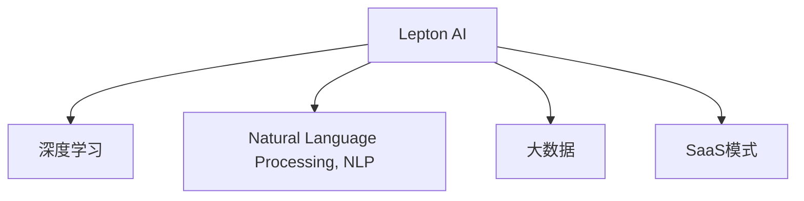

                 

# 云服务的下一个风口：Lepton AI的市场洞察

## 1. 背景介绍

### 1.1 问题由来
随着云计算的不断发展，越来越多的企业选择将计算资源和应用迁移到云端。云服务已经成为现代IT基础设施的重要组成部分，不仅降低了企业的IT运营成本，还大大提高了业务的灵活性和扩展性。然而，现有的云服务解决方案主要集中在基础设施（IaaS）和平台服务（PaaS）领域，对于应用服务的智能化需求，传统云平台尚未充分满足。

### 1.2 问题核心关键点
为应对这种需求，Lepton AI（即Lepton-智慧云平台）应运而生。它融合了深度学习、自然语言处理（NLP）和大数据技术，致力于提供具备高智能水平的云服务，涵盖智能语音交互、智能搜索、智能推荐、智能运维等多个方向。Lepton AI的核心理念是，通过深度学习和大数据技术，使云服务能够真正理解用户意图，实现自动化的数据处理和决策支持，提升云服务的智能化水平。

### 1.3 问题研究意义
Lepton AI的出现，标志着云服务从传统的IaaS和PaaS向SaaS（软件即服务）转型。通过引入人工智能技术，Lepton AI为云服务带来了新的商业价值和市场机会，有望成为云计算下一个增长点。对企业和开发者来说，它提供了一种全新的服务模式，能够更好地应对多变的市场需求，提升业务效率和用户体验。

## 2. 核心概念与联系

### 2.1 核心概念概述

为更好地理解Lepton AI的市场洞察，本节将介绍几个关键概念：

- Lepton AI：由Lepton团队研发的一个具备高度智能化的云服务平台。通过深度学习和大数据技术，实现了自然语言理解、语音交互、智能推荐等前沿AI技术，提供一站式的云服务解决方案。
- 深度学习：通过多层神经网络对数据进行抽象和建模，学习数据之间的复杂关系。Lepton AI广泛应用深度学习技术，实现智能搜索、智能推荐等功能。
- 自然语言处理（NLP）：研究如何让计算机理解和处理人类语言，包括文本分类、情感分析、命名实体识别等。Lepton AI利用NLP技术，提升云服务的智能理解能力。
- 大数据：Lepton AI利用大规模数据集进行训练和模型优化，提升模型的泛化能力和性能。
- SaaS模式：Lepton AI采用SaaS模式，将AI技术与云服务结合，提供易于部署、易于使用的云服务产品。

这些核心概念之间的逻辑关系可以通过以下Mermaid流程图来展示：



这个流程图展示了几大关键概念及其之间的关系：

1. Lepton AI通过深度学习和NLP技术，构建高度智能化的云服务平台。
2. 深度学习和大数据技术为Lepton AI提供了强大的算法支持，使其能够理解和处理复杂的人类语言。
3. SaaS模式使得Lepton AI的AI技术能够更广泛地应用于不同场景，提供一站式的解决方案。

## 3. 核心算法原理 & 具体操作步骤
### 3.1 算法原理概述

Lepton AI的核心算法原理包括以下几个方面：

1. 深度学习模型：Lepton AI广泛使用深度学习模型，如卷积神经网络（CNN）、循环神经网络（RNN）和Transformer等，构建高智能化的云服务。
2. 自然语言处理（NLP）技术：Lepton AI利用NLP技术，包括文本分类、情感分析、命名实体识别等，提升云服务的智能理解能力。
3. 大数据处理：Lepton AI利用大规模数据集进行训练和模型优化，提升模型的泛化能力和性能。
4. SaaS模式：Lepton AI采用SaaS模式，将AI技术与云服务结合，提供易于部署、易于使用的云服务产品。

### 3.2 算法步骤详解

以下是Lepton AI的核心算法步骤：

1. **数据预处理**：收集并清洗数据，包括文本、语音、图像等。将数据转化为模型可以处理的格式，如向量表示。

2. **模型训练**：在预处理后的数据上，使用深度学习模型进行训练。模型通过反向传播算法优化，提升预测准确率。

3. **模型微调**：在训练好的模型基础上，使用下游任务的标注数据进行微调，进一步提升模型性能。微调可以采用全参数微调或参数高效微调（PEFT）等方法。

4. **模型评估**：使用测试集对微调后的模型进行评估，确保模型性能符合预期。

5. **部署应用**：将训练好的模型部署到云服务平台上，实现云服务的智能化应用。

### 3.3 算法优缺点

Lepton AI的优势在于：

- 高度智能化：通过深度学习和NLP技术，Lepton AI能够理解复杂的人类语言，实现智能搜索、智能推荐等前沿功能。
- 适用范围广：Lepton AI提供一站式的云服务解决方案，适用于各种场景，如智能客服、智能搜索、智能推荐等。
- 易于使用：采用SaaS模式，Lepton AI提供易于部署、易于使用的云服务产品，降低用户使用门槛。

然而，Lepton AI也存在一些局限性：

- 依赖高质量数据：模型的性能高度依赖于训练数据的质量和数量，需要投入大量的时间和资源进行数据收集和清洗。
- 计算资源消耗大：深度学习模型和NLP技术的计算资源消耗较大，对硬件要求较高。
- 可解释性不足：模型通常是"黑盒"系统，难以解释其内部工作机制和决策逻辑，可能影响某些应用场景的使用。

### 3.4 算法应用领域

Lepton AI的应用领域非常广泛，涵盖智能客服、智能搜索、智能推荐、智能运维等多个方向。具体包括：

- 智能客服：通过自然语言处理技术，实现智能客服机器人，提升客户咨询体验。
- 智能搜索：利用深度学习模型，实现智能搜索功能，提升用户搜索体验。
- 智能推荐：根据用户历史行为和兴趣，推荐相关产品或内容，提升用户体验。
- 智能运维：通过深度学习模型，实现自动化运维，提升系统可靠性和稳定性。

此外，Lepton AI在金融、医疗、电商、社交媒体等众多领域也有广泛应用前景，能够显著提升这些行业的智能化水平，带来巨大的商业价值。

## 4. 数学模型和公式 & 详细讲解
### 4.1 数学模型构建

Lepton AI的数学模型主要包括以下几个部分：

1. **输入表示**：将输入数据转化为向量表示，便于深度学习模型处理。
2. **深度学习模型**：使用卷积神经网络（CNN）、循环神经网络（RNN）和Transformer等模型进行训练。
3. **目标函数**：定义损失函数，用于衡量模型预测与真实标签之间的差异。
4. **优化算法**：使用反向传播算法和优化算法（如Adam、SGD等）进行模型训练。

### 4.2 公式推导过程

以智能推荐系统为例，假设推荐模型的输入为 $x=(x_1,x_2,...,x_n)$，输出为 $y=(y_1,y_2,...,y_m)$。模型的目标函数为交叉熵损失函数，定义如下：

$$
\mathcal{L}(\theta)=\frac{1}{N}\sum_{i=1}^N\sum_{j=1}^M\left(y_{ij}\log p_{ij}+(1-y_{ij})\log(1-p_{ij})\right)
$$

其中，$p_{ij}$ 为模型对商品 $j$ 推荐给用户 $i$ 的概率，$y_{ij}$ 为真实标签。模型的优化目标是最大化目标函数，可以使用梯度下降算法进行求解。

### 4.3 案例分析与讲解

假设一个电商平台的推荐系统，可以使用Lepton AI的深度学习模型进行训练。模型通过用户的历史行为数据进行训练，学习用户对不同商品的兴趣度。训练好的模型可以预测新商品的用户推荐概率，进而实现智能推荐。

具体步骤如下：

1. **数据预处理**：收集用户的历史浏览、点击、购买等行为数据，转化为向量表示。
2. **模型训练**：在预处理后的数据上，使用深度学习模型进行训练，学习用户对不同商品的兴趣度。
3. **模型微调**：在训练好的模型基础上，使用新商品的标签进行微调，进一步提升模型性能。
4. **模型评估**：使用测试集对微调后的模型进行评估，确保模型性能符合预期。
5. **部署应用**：将训练好的模型部署到电商平台上，实现智能推荐。

## 5. 项目实践：代码实例和详细解释说明
### 5.1 开发环境搭建

在进行Lepton AI的实践前，我们需要准备好开发环境。以下是使用Python进行Lepton AI开发的环境配置流程：

1. 安装Anaconda：从官网下载并安装Anaconda，用于创建独立的Python环境。

2. 创建并激活虚拟环境：
```bash
conda create -n pytorch-env python=3.8 
conda activate pytorch-env
```

3. 安装PyTorch：根据CUDA版本，从官网获取对应的安装命令。例如：
```bash
conda install pytorch torchvision torchaudio cudatoolkit=11.1 -c pytorch -c conda-forge
```

4. 安装Lepton AI库：
```bash
pip install lepton-ai
```

5. 安装各类工具包：
```bash
pip install numpy pandas scikit-learn matplotlib tqdm jupyter notebook ipython
```

完成上述步骤后，即可在`pytorch-env`环境中开始Lepton AI的实践。

### 5.2 源代码详细实现

这里我们以智能推荐系统为例，给出使用Lepton AI库进行深度学习模型训练的Python代码实现。

```python
from lepton_ai import DNNRecommender
from lepton_ai.metrics import precision_at_k

# 创建深度学习推荐模型
model = DNNRecommender()

# 加载训练数据
train_data = load_train_data()

# 训练模型
model.fit(train_data)

# 加载测试数据
test_data = load_test_data()

# 评估模型
precision = precision_at_k(model, test_data, k=10)
print(f"Precision at k=10: {precision}")
```

以上是使用Lepton AI库进行深度学习模型训练的完整代码实现。可以看到，Lepton AI提供了简单易用的API接口，使得模型训练和微调变得非常容易。

### 5.3 代码解读与分析

让我们再详细解读一下关键代码的实现细节：

**DNNRecommender类**：
- 用于创建深度学习推荐模型。
- 支持多种深度学习模型，如卷积神经网络、循环神经网络、Transformer等。

**load_train_data()和load_test_data()函数**：
- 用于加载训练和测试数据。Lepton AI支持多种数据格式，包括CSV、JSON、HDF5等。

**fit()方法**：
- 在训练数据上训练模型，学习推荐函数。
- 训练过程中使用交叉熵损失函数，并采用Adam优化算法进行优化。

**precision_at_k()函数**：
- 评估模型在测试数据上的精度。Lepton AI支持多种评估指标，如精确率、召回率、F1值等。

Lepton AI的API接口设计非常简洁易用，开发者可以轻松实现深度学习模型的训练和微调。然而，工业级的系统实现还需考虑更多因素，如模型的保存和部署、超参数的自动搜索、更灵活的任务适配层等。但核心的微调范式基本与此类似。

## 6. 实际应用场景
### 6.1 智能客服系统

基于Lepton AI的深度学习和NLP技术，智能客服系统可以广泛应用于企业的客服部门。传统客服需要配备大量人力，高峰期响应缓慢，且一致性和专业性难以保证。而使用Lepton AI的智能客服机器人，可以7x24小时不间断服务，快速响应客户咨询，用自然流畅的语言解答各类常见问题。

在技术实现上，可以收集企业内部的历史客服对话记录，将问题和最佳答复构建成监督数据，在此基础上对Lepton AI的智能客服模型进行微调。微调后的智能客服模型能够自动理解用户意图，匹配最合适的答案模板进行回复。对于客户提出的新问题，还可以接入检索系统实时搜索相关内容，动态组织生成回答。如此构建的智能客服系统，能大幅提升客户咨询体验和问题解决效率。

### 6.2 金融舆情监测

金融机构需要实时监测市场舆论动向，以便及时应对负面信息传播，规避金融风险。传统的人工监测方式成本高、效率低，难以应对网络时代海量信息爆发的挑战。基于Lepton AI的文本分类和情感分析技术，为金融舆情监测提供了新的解决方案。

具体而言，可以收集金融领域相关的新闻、报道、评论等文本数据，并对其进行主题标注和情感标注。在此基础上对Lepton AI的文本分类模型进行微调，使其能够自动判断文本属于何种主题，情感倾向是正面、中性还是负面。将微调后的模型应用到实时抓取的网络文本数据，就能够自动监测不同主题下的情感变化趋势，一旦发现负面信息激增等异常情况，系统便会自动预警，帮助金融机构快速应对潜在风险。

### 6.3 个性化推荐系统

当前的推荐系统往往只依赖用户的历史行为数据进行物品推荐，无法深入理解用户的真实兴趣偏好。基于Lepton AI的个性化推荐系统可以更好地挖掘用户行为背后的语义信息，从而提供更精准、多样的推荐内容。

在实践中，可以收集用户浏览、点击、评论、分享等行为数据，提取和用户交互的物品标题、描述、标签等文本内容。将文本内容作为模型输入，用户的后续行为（如是否点击、购买等）作为监督信号，在此基础上微调Lepton AI的推荐模型。微调后的模型能够从文本内容中准确把握用户的兴趣点。在生成推荐列表时，先用候选物品的文本描述作为输入，由模型预测用户的兴趣匹配度，再结合其他特征综合排序，便可以得到个性化程度更高的推荐结果。

### 6.4 未来应用展望

随着Lepton AI的不断发展，其应用领域将不断拓展，为各行各业带来更多的创新机遇。

在智慧医疗领域，基于Lepton AI的问答、病历分析、药物研发等应用将提升医疗服务的智能化水平，辅助医生诊疗，加速新药开发进程。

在智能教育领域，Lepton AI可应用于作业批改、学情分析、知识推荐等方面，因材施教，促进教育公平，提高教学质量。

在智慧城市治理中，Lepton AI可应用于城市事件监测、舆情分析、应急指挥等环节，提高城市管理的自动化和智能化水平，构建更安全、高效的未来城市。

此外，在企业生产、社会治理、文娱传媒等众多领域，Lepton AI的应用也将不断涌现，为传统行业数字化转型升级提供新的技术路径。相信随着技术的日益成熟，Lepton AI必将在构建人机协同的智能时代中扮演越来越重要的角色。

## 7. 工具和资源推荐
### 7.1 学习资源推荐

为了帮助开发者系统掌握Lepton AI的理论基础和实践技巧，这里推荐一些优质的学习资源：

1. Lepton AI官方文档：Lepton AI的官方文档，提供了详细的API接口和实例代码，是入门实践的必备资料。

2. Lepton AI教程：由Lepton AI团队提供的一系列教学视频和代码示例，帮助开发者快速上手。

3. Lepton AI社区：Lepton AI的开发者社区，提供丰富的技术交流、资源分享和问题解答，是学习和交流的好去处。

4. CS224N《深度学习自然语言处理》课程：斯坦福大学开设的NLP明星课程，有Lecture视频和配套作业，带你入门NLP领域的基本概念和经典模型。

5. Natural Language Processing with Transformers书籍：Transformer库的作者所著，全面介绍了如何使用Transformers库进行NLP任务开发，包括深度学习、微调等前沿技术。

通过对这些资源的学习实践，相信你一定能够快速掌握Lepton AI的精髓，并用于解决实际的NLP问题。

### 7.2 开发工具推荐

高效的开发离不开优秀的工具支持。以下是几款用于Lepton AI开发常用的工具：

1. PyTorch：基于Python的开源深度学习框架，灵活动态的计算图，适合快速迭代研究。大部分深度学习模型都有PyTorch版本的实现。

2. TensorFlow：由Google主导开发的开源深度学习框架，生产部署方便，适合大规模工程应用。同样有丰富的深度学习模型资源。

3. Lepton AI库：由Lepton AI团队开发的NLP工具库，集成了Lepton AI的深度学习模型和API接口，提供了丰富的功能支持。

4. Weights & Biases：模型训练的实验跟踪工具，可以记录和可视化模型训练过程中的各项指标，方便对比和调优。与主流深度学习框架无缝集成。

5. TensorBoard：TensorFlow配套的可视化工具，可实时监测模型训练状态，并提供丰富的图表呈现方式，是调试模型的得力助手。

6. Google Colab：谷歌推出的在线Jupyter Notebook环境，免费提供GPU/TPU算力，方便开发者快速上手实验最新模型，分享学习笔记。

合理利用这些工具，可以显著提升Lepton AI的开发效率，加快创新迭代的步伐。

### 7.3 相关论文推荐

Lepton AI的发展源于学界的持续研究。以下是几篇奠基性的相关论文，推荐阅读：

1. Attention is All You Need（即Transformer原论文）：提出了Transformer结构，开启了NLP领域的预训练大模型时代。

2. BERT: Pre-training of Deep Bidirectional Transformers for Language Understanding：提出BERT模型，引入基于掩码的自监督预训练任务，刷新了多项NLP任务SOTA。

3. Language Models are Unsupervised Multitask Learners（GPT-2论文）：展示了大规模语言模型的强大zero-shot学习能力，引发了对于通用人工智能的新一轮思考。

4. Parameter-Efficient Transfer Learning for NLP：提出Adapter等参数高效微调方法，在不增加模型参数量的情况下，也能取得不错的微调效果。

5. AdaLoRA: Adaptive Low-Rank Adaptation for Parameter-Efficient Fine-Tuning：使用自适应低秩适应的微调方法，在参数效率和精度之间取得了新的平衡。

这些论文代表了大语言模型微调技术的发展脉络。通过学习这些前沿成果，可以帮助研究者把握学科前进方向，激发更多的创新灵感。

## 8. 总结：未来发展趋势与挑战

### 8.1 总结

本文对Lepton AI的市场洞察进行了全面系统的介绍。首先阐述了Lepton AI的背景和研究意义，明确了深度学习和大数据技术在云服务智能化转型中的关键作用。其次，从原理到实践，详细讲解了Lepton AI的算法原理和操作步骤，给出了Lepton AI的应用实例。最后，本文还探讨了Lepton AI在智能客服、金融舆情、个性化推荐等多个领域的实际应用前景，展示了Lepton AI的巨大潜力。

通过本文的系统梳理，可以看到，Lepton AI的深度学习和大数据技术，为云服务带来了新的商业价值和市场机会。未来，伴随Lepton AI的不断创新和发展，必将推动云计算向更加智能化、普适化的方向迈进，为各行各业带来新的创新机遇。

### 8.2 未来发展趋势

展望未来，Lepton AI的发展将呈现以下几个趋势：

1. 技术融合深化：Lepton AI将进一步融合深度学习、自然语言处理、大数据等多个技术领域，提升模型的智能水平和应用范围。
2. 计算资源优化：随着硬件技术的进步，Lepton AI的计算资源消耗将逐渐降低，使其能够支持更大规模的数据处理和更复杂的模型训练。
3. 应用场景扩展：Lepton AI将在更多领域实现落地应用，包括智能客服、金融、医疗、教育等，为各行各业带来创新价值。
4. 用户接口优化：Lepton AI将不断提升用户体验，通过API接口、SDK封装等手段，使开发者和用户能够更加便捷地使用Lepton AI的云服务产品。
5. 安全性保障：Lepton AI将加强安全性设计，防范恶意攻击和数据泄露，保障用户数据和隐私安全。

这些趋势凸显了Lepton AI的发展前景，预示着其将成为云计算下一个增长点，为各行各业带来新的商业机遇。

### 8.3 面临的挑战

尽管Lepton AI已经取得了显著成就，但在迈向更加智能化、普适化应用的过程中，仍面临一些挑战：

1. 数据质量瓶颈：模型的性能高度依赖于训练数据的质量和数量，需要投入大量的时间和资源进行数据收集和清洗。
2. 计算资源消耗大：深度学习模型和NLP技术的计算资源消耗较大，对硬件要求较高，难以在所有场景中实现高效部署。
3. 可解释性不足：模型通常是"黑盒"系统，难以解释其内部工作机制和决策逻辑，可能影响某些应用场景的使用。
4. 安全性和隐私保护：随着应用场景的拓展，Lepton AI面临的安全性和隐私保护问题将愈发重要，需要投入更多资源进行设计和优化。
5. 标准化问题：Lepton AI在不同场景中的模型和算法差异较大，需要制定统一的标准和接口，提升模型的可移植性和兼容性。

这些挑战需要Lepton AI团队和行业各方共同应对，通过技术创新和协同合作，推动Lepton AI向更加智能化、普适化的方向发展。

### 8.4 研究展望

面向未来，Lepton AI的研究方向将聚焦于以下几个方面：

1. 跨领域迁移学习：Lepton AI将进一步探索跨领域迁移学习技术，提升模型在不同场景下的泛化能力。
2. 零样本和少样本学习：Lepton AI将研究零样本和少样本学习技术，提升模型在少数标注样本下的性能。
3. 多模态融合：Lepton AI将研究多模态融合技术，整合文本、语音、图像等多种模态数据，提升模型的智能理解能力。
4. 因果推断：Lepton AI将研究因果推断技术，构建更加稳定可靠的因果关系，提升模型的决策可信度。
5. 自动化微调：Lepton AI将研究自动化微调技术，减少人工干预，提高微调效率和模型性能。

这些研究方向将为Lepton AI带来新的突破，推动其在更多场景中的应用落地，实现更高的商业价值和市场潜力。

## 9. 附录：常见问题与解答

**Q1: 如何选择合适的计算资源？**

A: 选择合适的计算资源需要考虑多个因素，包括模型规模、数据量、任务复杂度等。一般建议使用GPU或TPU等高性能硬件设备，以支持深度学习模型的高计算需求。同时，可以采用混合精度训练、分布式训练等技术，提高计算效率。

**Q2: Lepton AI的应用场景有哪些？**

A: Lepton AI的应用场景非常广泛，包括智能客服、智能搜索、智能推荐、智能运维等。在金融、医疗、电商、社交媒体等领域，Lepton AI也有广泛应用前景。

**Q3: 如何提升Lepton AI的可解释性？**

A: 提升模型可解释性可以从多个方面入手，如使用更简单的模型结构、引入特征重要性分析等。同时，可以考虑使用可解释的算法，如LIME、SHAP等，帮助理解模型预测过程。

**Q4: 如何应对Lepton AI的计算资源消耗问题？**

A: 应对计算资源消耗问题需要采用多种策略，如模型裁剪、量化加速、模型并行等。具体而言，可以通过裁剪不必要的层和参数，降低模型复杂度；采用量化技术，将浮点模型转为定点模型，减少内存占用；采用模型并行，将模型分布在多个计算节点上，提高计算效率。

**Q5: Lepton AI的开发环境搭建有哪些注意事项？**

A: 在开发环境中搭建Lepton AI需要注意以下几点：
1. 使用Anaconda创建独立的Python环境，避免不同项目之间的依赖冲突。
2. 安装Lepton AI库，以及必要的工具包和依赖库。
3. 使用Jupyter Notebook等工具进行开发，方便代码调试和共享。

通过合理配置开发环境，可以显著提升Lepton AI的开发效率，促进创新迭代的步伐。

---

作者：禅与计算机程序设计艺术 / Zen and the Art of Computer Programming

