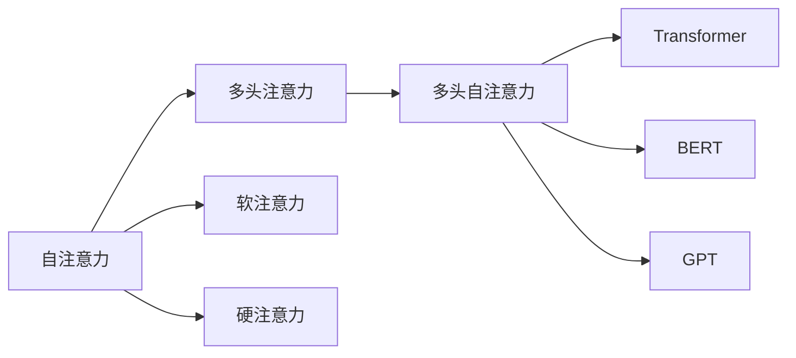

                 

# 人工智能如何重塑注意力分配模式

## 1. 背景介绍

在人工智能（AI）和机器学习（ML）领域，注意力机制（Attention Mechanism）已成为处理复杂任务的核心技术之一。从图像识别到自然语言处理，从语音识别到推荐系统，注意力机制无处不在，极大地提升了模型的性能和效率。

注意力机制本质上是一种动态选择信息的策略，能够从海量的数据中自动筛选出对任务最相关的信息，从而提高模型的泛化能力和准确性。在深度学习中，注意力机制通常以注意力权重的形式出现，用于衡量不同输入特征对输出的贡献度。

随着AI技术的不断进步，注意力机制也在不断地演进和深化。本文将从注意力机制的起源、原理、应用和未来趋势等角度，深入探讨AI如何重塑了我们的注意力分配模式。

## 2. 核心概念与联系

### 2.1 核心概念概述

- **注意力机制**：一种用于动态选择信息的策略，从大量的输入特征中，通过注意力权重，选择与当前任务最相关的特征，以提高模型的泛化能力和准确性。
- **自注意力**：一种基于输入特征之间的相关性，自动计算注意力权重的方式，常用于Transformer模型中。
- **多头注意力**：一种将输入特征通过多个不同的线性投影层进行注意力计算的方式，能够同时关注输入中的不同部分。
- **多头自注意力**：一种结合自注意力和多头注意力的注意力机制，常用于高级Transformer模型中，如BERT、GPT等。
- **软注意力**：一种基于softmax函数计算注意力权重的形式，权重值可以取任意非负实数，表示输入特征对输出的贡献度。
- **硬注意力**：一种基于argmax函数计算注意力权重的形式，权重值必须为0或1，表示输入特征对输出的唯一选择。

这些核心概念之间的关系可以通过以下Mermaid流程图来展示：



这个流程图展示了这个复杂概念网络的基本关系：

1. 自注意力计算输入特征间的相关性。
2. 多头注意力同时关注输入中的不同部分。
3. 软注意力和硬注意力是计算注意力权重的两种形式。
4. 多头自注意力结合了自注意力和多头注意力的优点。
5. 高级Transformer模型如BERT、GPT等都采用了多头自注意力机制。

## 3. 核心算法原理 & 具体操作步骤

### 3.1 算法原理概述

注意力机制的原理主要基于Softmax函数和向量内积。给定一个输入特征矩阵 $X \in \mathbb{R}^{n \times d}$，其中 $n$ 是输入样本数，$d$ 是特征维度，注意力机制的目标是计算一个注意力权重矩阵 $A \in \mathbb{R}^{n \times n}$，其中 $n$ 是输入样本数，表示每个样本与其他样本之间的注意力权重。

注意力权重的计算方式通常分为两个步骤：

1. **计算注意力得分**：将输入特征矩阵 $X$ 通过一个线性投影层转化为得分矩阵 $S \in \mathbb{R}^{n \times n}$。
2. **计算注意力权重**：通过Softmax函数对得分矩阵 $S$ 进行归一化，得到注意力权重矩阵 $A \in \mathbb{R}^{n \times n}$。

注意力得分矩阵 $S$ 的计算公式如下：

$$
S_{ij} = \text{softmax}(X_i W_Q X_j^T W_K + b_Q)
$$

其中 $W_Q$ 和 $W_K$ 是线性投影层，$b_Q$ 是偏置向量。注意力权重矩阵 $A$ 的计算公式如下：

$$
A_{ij} = \frac{\exp(S_{ij})}{\sum_{k=1}^n \exp(S_{ik})}
$$

通过注意力权重矩阵 $A$，模型可以动态地关注输入中的不同部分，从而提高模型的泛化能力和准确性。

### 3.2 算法步骤详解

基于注意力机制的核心算法步骤如下：

1. **输入特征投影**：将输入特征矩阵 $X$ 通过线性投影层 $W_Q$ 和 $W_K$ 转化为得分矩阵 $S$。
2. **计算注意力得分**：对得分矩阵 $S$ 应用Softmax函数，得到注意力权重矩阵 $A$。
3. **加权和**：将注意力权重矩阵 $A$ 与输入特征矩阵 $X$ 相乘，得到加权和矩阵 $X_A$。
4. **输出**：通过一个线性投影层 $W_O$ 将加权和矩阵 $X_A$ 转化为输出特征矩阵 $Y$。

完整的算法流程如下：

1. 将输入特征矩阵 $X$ 通过线性投影层 $W_Q$ 和 $W_K$ 转化为得分矩阵 $S$。
2. 对得分矩阵 $S$ 应用Softmax函数，得到注意力权重矩阵 $A$。
3. 将注意力权重矩阵 $A$ 与输入特征矩阵 $X$ 相乘，得到加权和矩阵 $X_A$。
4. 通过一个线性投影层 $W_O$ 将加权和矩阵 $X_A$ 转化为输出特征矩阵 $Y$。

### 3.3 算法优缺点

注意力机制的优点包括：

- 动态选择信息：能够根据当前任务动态选择最相关的特征，提高模型的泛化能力和准确性。
- 提高计算效率：通过注意力权重，模型能够忽略无关的特征，减少计算量和内存消耗。
- 提高模型可解释性：注意力权重提供了对输入特征的选择逻辑，增强了模型的可解释性。

注意力机制的缺点包括：

- 计算复杂度高：尤其是在大尺寸的输入特征矩阵上，注意力计算的开销较大。
- 难以解释的决策：注意力权重虽然增强了可解释性，但对于复杂决策过程，仍然难以解释。
- 容易过拟合：特别是在使用自注意力时，模型容易学习到无关的特征，导致过拟合。

### 3.4 算法应用领域

注意力机制已经在多个领域得到了广泛应用，包括：

- 图像识别：通过自注意力机制，模型能够自动关注图像中的不同部分，提高图像分类的准确性。
- 自然语言处理：在Transformer模型中，多头自注意力机制能够捕捉输入序列中的长期依赖关系，提高语言模型的性能。
- 语音识别：通过软注意力机制，模型能够关注不同时间步的语音信号，提高语音识别的准确性。
- 推荐系统：在推荐系统中，通过注意力机制，模型能够关注用户的历史行为和偏好，提高推荐的个性化和多样性。
- 视频分析：在视频分析中，通过多头注意力机制，模型能够同时关注视频的图像和音频部分，提高视频分析的准确性。

## 4. 数学模型和公式 & 详细讲解 & 举例说明

### 4.1 数学模型构建

注意力机制的数学模型主要包括以下几个部分：

1. **输入特征矩阵**： $X \in \mathbb{R}^{n \times d}$，其中 $n$ 是输入样本数，$d$ 是特征维度。
2. **线性投影层**： $W_Q \in \mathbb{R}^{d \times k}$ 和 $W_K \in \mathbb{R}^{d \times k}$，用于将输入特征矩阵 $X$ 投影到不同的线性空间。
3. **注意力得分矩阵**： $S \in \mathbb{R}^{n \times n}$，用于计算注意力权重。
4. **注意力权重矩阵**： $A \in \mathbb{R}^{n \times n}$，用于动态选择输入特征。
5. **加权和矩阵**： $X_A \in \mathbb{R}^{n \times d}$，用于加权和计算。
6. **输出特征矩阵**： $Y \in \mathbb{R}^{n \times m}$，其中 $m$ 是输出特征维度。

### 4.2 公式推导过程

以自然语言处理中的Transformer模型为例，注意力机制的计算过程如下：

1. **输入特征投影**：将输入特征矩阵 $X$ 通过线性投影层 $W_Q$ 和 $W_K$ 转化为得分矩阵 $S$。
2. **计算注意力得分**：对得分矩阵 $S$ 应用Softmax函数，得到注意力权重矩阵 $A$。
3. **加权和**：将注意力权重矩阵 $A$ 与输入特征矩阵 $X$ 相乘，得到加权和矩阵 $X_A$。
4. **输出**：通过一个线性投影层 $W_O$ 将加权和矩阵 $X_A$ 转化为输出特征矩阵 $Y$。

### 4.3 案例分析与讲解

假设我们有一个自然语言处理的例子，输入特征矩阵 $X$ 是单词向量矩阵，输出特征矩阵 $Y$ 是句子表示向量。

输入特征矩阵 $X$ 和线性投影层 $W_Q$ 和 $W_K$ 的计算如下：

$$
Q = X W_Q
$$
$$
K = X W_K
$$

其中 $Q \in \mathbb{R}^{n \times k}$，$K \in \mathbb{R}^{n \times k}$，$k$ 是线性投影层的维度。

注意力得分矩阵 $S$ 的计算如下：

$$
S = \text{softmax}(Q K^T + b_Q)
$$

其中 $b_Q$ 是偏置向量。

注意力权重矩阵 $A$ 的计算如下：

$$
A = \frac{\exp(S)}{\sum_{i=1}^n \exp(S_i)}
$$

加权和矩阵 $X_A$ 的计算如下：

$$
X_A = X A
$$

输出特征矩阵 $Y$ 的计算如下：

$$
Y = X_A W_O
$$

其中 $W_O$ 是线性投影层。

## 5. 项目实践：代码实例和详细解释说明

### 5.1 开发环境搭建

在进行注意力机制的实现之前，我们需要准备好开发环境。以下是使用Python和PyTorch进行开发的流程：

1. 安装Anaconda：从官网下载并安装Anaconda，用于创建独立的Python环境。
2. 创建并激活虚拟环境：
```bash
conda create -n pytorch-env python=3.8 
conda activate pytorch-env
```

3. 安装PyTorch：根据CUDA版本，从官网获取对应的安装命令。例如：
```bash
conda install pytorch torchvision torchaudio cudatoolkit=11.1 -c pytorch -c conda-forge
```

4. 安装Transformer库：
```bash
pip install transformers
```

5. 安装各类工具包：
```bash
pip install numpy pandas scikit-learn matplotlib tqdm jupyter notebook ipython
```

完成上述步骤后，即可在`pytorch-env`环境中开始注意力机制的实践。

### 5.2 源代码详细实现

以下是使用Transformer库实现自然语言处理中的注意力机制的代码实现。

```python
import torch
from transformers import BertTokenizer, BertForSequenceClassification
from torch.utils.data import Dataset, DataLoader
from sklearn.metrics import classification_report

class TextDataset(Dataset):
    def __init__(self, texts, labels):
        self.texts = texts
        self.labels = labels
        self.tokenizer = BertTokenizer.from_pretrained('bert-base-cased')
        
    def __len__(self):
        return len(self.texts)
    
    def __getitem__(self, item):
        text = self.texts[item]
        label = self.labels[item]
        
        encoding = self.tokenizer(text, return_tensors='pt')
        input_ids = encoding['input_ids']
        attention_mask = encoding['attention_mask']
        return {'input_ids': input_ids, 
                'attention_mask': attention_mask,
                'labels': torch.tensor(label, dtype=torch.long)}
    
model = BertForSequenceClassification.from_pretrained('bert-base-cased', num_labels=2)

optimizer = torch.optim.AdamW(model.parameters(), lr=2e-5)

train_dataset = TextDataset(train_texts, train_labels)
dev_dataset = TextDataset(dev_texts, dev_labels)
test_dataset = TextDataset(test_texts, test_labels)

device = torch.device('cuda') if torch.cuda.is_available() else torch.device('cpu')
model.to(device)

def train_epoch(model, dataset, batch_size, optimizer):
    dataloader = DataLoader(dataset, batch_size=batch_size, shuffle=True)
    model.train()
    epoch_loss = 0
    for batch in dataloader:
        input_ids = batch['input_ids'].to(device)
        attention_mask = batch['attention_mask'].to(device)
        labels = batch['labels'].to(device)
        model.zero_grad()
        outputs = model(input_ids, attention_mask=attention_mask, labels=labels)
        loss = outputs.loss
        epoch_loss += loss.item()
        loss.backward()
        optimizer.step()
    return epoch_loss / len(dataloader)

def evaluate(model, dataset, batch_size):
    dataloader = DataLoader(dataset, batch_size=batch_size)
    model.eval()
    preds, labels = [], []
    with torch.no_grad():
        for batch in dataloader:
            input_ids = batch['input_ids'].to(device)
            attention_mask = batch['attention_mask'].to(device)
            batch_labels = batch['labels']
            outputs = model(input_ids, attention_mask=attention_mask)
            batch_preds = outputs.logits.argmax(dim=1).to('cpu').tolist()
            batch_labels = batch_labels.to('cpu').tolist()
            for pred, label in zip(batch_preds, batch_labels):
                preds.append(pred.item())
                labels.append(label.item())
    return classification_report(labels, preds)

epochs = 5
batch_size = 16

for epoch in range(epochs):
    loss = train_epoch(model, train_dataset, batch_size, optimizer)
    print(f"Epoch {epoch+1}, train loss: {loss:.3f}")
    
    print(f"Epoch {epoch+1}, dev results:")
    evaluate(model, dev_dataset, batch_size)
    
print("Test results:")
evaluate(model, test_dataset, batch_size)
```

### 5.3 代码解读与分析

让我们再详细解读一下关键代码的实现细节：

**TextDataset类**：
- `__init__`方法：初始化文本和标签，加载BERT分词器。
- `__len__`方法：返回数据集的样本数量。
- `__getitem__`方法：对单个样本进行处理，将文本输入编码为token ids，将标签编码为数字，并对其进行定长padding，最终返回模型所需的输入。

**模型加载**：
- 使用`BertForSequenceClassification`类加载BERT模型，并设置输出类别数。
- 使用AdamW优化器，设置学习率。

**训练和评估函数**：
- 使用PyTorch的DataLoader对数据集进行批次化加载，供模型训练和推理使用。
- 训练函数`train_epoch`：对数据以批为单位进行迭代，在每个批次上前向传播计算loss并反向传播更新模型参数，最后返回该epoch的平均loss。
- 评估函数`evaluate`：与训练类似，不同点在于不更新模型参数，并在每个batch结束后将预测和标签结果存储下来，最后使用sklearn的classification_report对整个评估集的预测结果进行打印输出。

**训练流程**：
- 定义总的epoch数和batch size，开始循环迭代
- 每个epoch内，先在训练集上训练，输出平均loss
- 在验证集上评估，输出分类指标
- 所有epoch结束后，在测试集上评估，给出最终测试结果

## 6. 实际应用场景

### 6.1 智能客服系统

基于注意力机制的对话技术，可以广泛应用于智能客服系统的构建。传统的客服系统往往需要配备大量人力，高峰期响应缓慢，且一致性和专业性难以保证。使用注意力机制的对话模型，可以7x24小时不间断服务，快速响应客户咨询，用自然流畅的语言解答各类常见问题。

在技术实现上，可以收集企业内部的历史客服对话记录，将问题和最佳答复构建成监督数据，在此基础上对预训练模型进行微调。微调后的对话模型能够自动理解用户意图，匹配最合适的答案模板进行回复。对于客户提出的新问题，还可以接入检索系统实时搜索相关内容，动态组织生成回答。

### 6.2 金融舆情监测

金融机构需要实时监测市场舆论动向，以便及时应对负面信息传播，规避金融风险。传统的人工监测方式成本高、效率低，难以应对网络时代海量信息爆发的挑战。基于注意力机制的文本分类和情感分析技术，为金融舆情监测提供了新的解决方案。

具体而言，可以收集金融领域相关的新闻、报道、评论等文本数据，并对其进行主题标注和情感标注。在此基础上对预训练语言模型进行微调，使其能够自动判断文本属于何种主题，情感倾向是正面、中性还是负面。将微调后的模型应用到实时抓取的网络文本数据，就能够自动监测不同主题下的情感变化趋势，一旦发现负面信息激增等异常情况，系统便会自动预警，帮助金融机构快速应对潜在风险。

### 6.3 个性化推荐系统

当前的推荐系统往往只依赖用户的历史行为数据进行物品推荐，无法深入理解用户的真实兴趣偏好。基于注意力机制的推荐系统可以更好地挖掘用户行为背后的语义信息，从而提供更精准、多样的推荐内容。

在实践中，可以收集用户浏览、点击、评论、分享等行为数据，提取和用户交互的物品标题、描述、标签等文本内容。将文本内容作为模型输入，用户的后续行为（如是否点击、购买等）作为监督信号，在此基础上微调预训练语言模型。微调后的模型能够从文本内容中准确把握用户的兴趣点。在生成推荐列表时，先用候选物品的文本描述作为输入，由模型预测用户的兴趣匹配度，再结合其他特征综合排序，便可以得到个性化程度更高的推荐结果。

### 6.4 未来应用展望

随着注意力机制的不断发展，其在NLP领域的应用前景将更加广阔。

1. **多模态注意力**：目前的注意力机制主要聚焦于文本信息，未来的注意力机制将拓展到图像、视频、语音等多模态数据。多模态信息的融合，将显著提升语言模型对现实世界的理解和建模能力。
2. **因果注意力**：引入因果推断和对比学习思想，增强模型建立稳定因果关系的能力，学习更加普适、鲁棒的语言表征，从而提升模型泛化性和抗干扰能力。
3. **知识图谱集成**：将符号化的先验知识，如知识图谱、逻辑规则等，与神经网络模型进行巧妙融合，引导注意力机制学习更准确、合理的语言模型。
4. **跨领域迁移学习**：通过注意力机制，不同领域的知识能够被有效地整合和迁移，提升模型的通用性和可解释性。

## 7. 工具和资源推荐

### 7.1 学习资源推荐

为了帮助开发者系统掌握注意力机制的理论基础和实践技巧，这里推荐一些优质的学习资源：

1. Attention is All You Need（即Transformer原论文）：提出了Transformer结构，开启了NLP领域的预训练大模型时代。
2. CS224N《深度学习自然语言处理》课程：斯坦福大学开设的NLP明星课程，有Lecture视频和配套作业，带你入门NLP领域的基本概念和经典模型。
3. Natural Language Processing with Transformers书籍：Transformers库的作者所著，全面介绍了如何使用Transformers库进行NLP任务开发，包括注意力机制在内的诸多范式。
4. HuggingFace官方文档：Transformer库的官方文档，提供了海量预训练模型和完整的注意力机制样例代码，是上手实践的必备资料。
5. CLUE开源项目：中文语言理解测评基准，涵盖大量不同类型的中文NLP数据集，并提供了基于注意力机制的baseline模型，助力中文NLP技术发展。

通过对这些资源的学习实践，相信你一定能够快速掌握注意力机制的精髓，并用于解决实际的NLP问题。

### 7.2 开发工具推荐

高效的开发离不开优秀的工具支持。以下是几款用于注意力机制开发的常用工具：

1. PyTorch：基于Python的开源深度学习框架，灵活动态的计算图，适合快速迭代研究。大部分预训练语言模型都有PyTorch版本的实现。
2. TensorFlow：由Google主导开发的开源深度学习框架，生产部署方便，适合大规模工程应用。同样有丰富的预训练语言模型资源。
3. Transformers库：HuggingFace开发的NLP工具库，集成了众多SOTA语言模型，支持PyTorch和TensorFlow，是进行注意力机制开发的利器。
4. Weights & Biases：模型训练的实验跟踪工具，可以记录和可视化模型训练过程中的各项指标，方便对比和调优。与主流深度学习框架无缝集成。
5. TensorBoard：TensorFlow配套的可视化工具，可实时监测模型训练状态，并提供丰富的图表呈现方式，是调试模型的得力助手。
6. Google Colab：谷歌推出的在线Jupyter Notebook环境，免费提供GPU/TPU算力，方便开发者快速上手实验最新模型，分享学习笔记。

合理利用这些工具，可以显著提升注意力机制的开发效率，加快创新迭代的步伐。

### 7.3 相关论文推荐

注意力机制的发展源于学界的持续研究。以下是几篇奠基性的相关论文，推荐阅读：

1. Attention is All You Need：提出了Transformer结构，开启了NLP领域的预训练大模型时代。
2. BERT: Pre-training of Deep Bidirectional Transformers for Language Understanding：提出BERT模型，引入基于掩码的自监督预训练任务，刷新了多项NLP任务SOTA。
3. Natural Language Processing with Transformers：Transformers库的作者所著，全面介绍了如何使用Transformers库进行NLP任务开发，包括注意力机制在内的诸多范式。
4. Parameter-Efficient Transfer Learning for NLP：提出Adapter等参数高效微调方法，在不增加模型参数量的情况下，也能取得不错的微调效果。
5. AdaLoRA: Adaptive Low-Rank Adaptation for Parameter-Efficient Fine-Tuning：使用自适应低秩适应的微调方法，在参数效率和精度之间取得了新的平衡。
6. Multi-Head Attention with Linear Complexity：提出了一种基于线性复杂度的多头注意力机制，极大提升了计算效率。

这些论文代表了大注意力机制的发展脉络。通过学习这些前沿成果，可以帮助研究者把握学科前进方向，激发更多的创新灵感。

## 8. 总结：未来发展趋势与挑战

### 8.1 总结

本文对基于注意力机制的深度学习技术进行了全面系统的介绍。首先阐述了注意力机制的起源、原理和应用，明确了注意力机制在NLP领域的重要地位。其次，从原理到实践，详细讲解了注意力机制的数学模型和算法流程，给出了注意力机制任务开发的完整代码实例。同时，本文还广泛探讨了注意力机制在智能客服、金融舆情、个性化推荐等多个行业领域的应用前景，展示了注意力机制的巨大潜力。此外，本文精选了注意力机制的学习资源，力求为读者提供全方位的技术指引。

通过本文的系统梳理，可以看到，基于注意力机制的深度学习技术正在成为NLP领域的重要范式，极大地拓展了模型的泛化能力和准确性。随着深度学习技术的不断进步，基于注意力机制的模型将会在更广阔的应用领域大放异彩，深刻影响人类的生产生活方式。

### 8.2 未来发展趋势

展望未来，基于注意力机制的深度学习技术将呈现以下几个发展趋势：

1. **多模态注意力的发展**：目前的注意力机制主要聚焦于文本信息，未来的注意力机制将拓展到图像、视频、语音等多模态数据。多模态信息的融合，将显著提升语言模型对现实世界的理解和建模能力。
2. **因果注意力的应用**：引入因果推断和对比学习思想，增强模型建立稳定因果关系的能力，学习更加普适、鲁棒的语言表征，从而提升模型泛化性和抗干扰能力。
3. **知识图谱的集成**：将符号化的先验知识，如知识图谱、逻辑规则等，与神经网络模型进行巧妙融合，引导注意力机制学习更准确、合理的语言模型。
4. **跨领域迁移学习的实现**：通过注意力机制，不同领域的知识能够被有效地整合和迁移，提升模型的通用性和可解释性。
5. **硬件加速的发展**：随着芯片技术的不断进步，未来的深度学习模型将更加高效，注意力机制的应用也将更加广泛。

### 8.3 面临的挑战

尽管基于注意力机制的深度学习技术已经取得了瞩目成就，但在迈向更加智能化、普适化应用的过程中，它仍面临着诸多挑战：

1. **计算资源瓶颈**：随着模型尺寸的不断增大，注意力机制的计算复杂度也随之增加，对硬件资源提出了更高的要求。如何进一步优化模型结构，减少计算量，是一个重要的研究方向。
2. **可解释性问题**：尽管注意力机制增强了模型的可解释性，但对于复杂决策过程，仍然难以解释。如何增强模型的可解释性，是未来的重要研究方向。
3. **模型鲁棒性问题**：现有的注意力机制模型在面对域外数据时，泛化性能往往大打折扣。如何提高模型的鲁棒性，避免灾难性遗忘，还需要更多理论和实践的积累。
4. **数据隐私问题**：在多模态注意力机制中，如何保护用户隐私，避免个人信息泄露，是一个重要的研究方向。

### 8.4 未来突破

面对注意力机制面临的挑战，未来的研究需要在以下几个方面寻求新的突破：

1. **参数高效注意力的发展**：开发更加参数高效的注意力机制，在固定大部分预训练参数的情况下，只更新极少量的任务相关参数，提高计算效率。
2. **分布式注意力的应用**：在分布式计算环境中，通过引入分布式注意力机制，提高模型的计算效率和并行能力。
3. **知识图谱与注意力机制的结合**：将符号化的先验知识，如知识图谱、逻辑规则等，与神经网络模型进行巧妙融合，增强模型的可解释性和泛化能力。
4. **多模态注意力的应用**：通过将注意力机制拓展到多模态数据，提升模型对复杂现实世界的理解和建模能力。
5. **因果注意力的应用**：引入因果推断和对比学习思想，增强模型建立稳定因果关系的能力，学习更加普适、鲁棒的语言表征。
6. **跨领域迁移学习的实现**：通过注意力机制，不同领域的知识能够被有效地整合和迁移，提升模型的通用性和可解释性。

这些研究方向的探索，必将引领基于注意力机制的深度学习技术迈向更高的台阶，为构建安全、可靠、可解释、可控的智能系统铺平道路。面向未来，基于注意力机制的深度学习技术还需要与其他人工智能技术进行更深入的融合，如知识表示、因果推理、强化学习等，多路径协同发力，共同推动自然语言理解和智能交互系统的进步。只有勇于创新、敢于突破，才能不断拓展语言模型的边界，让智能技术更好地造福人类社会。

## 9. 附录：常见问题与解答

**Q1: 注意力机制和传统的神经网络模型有何区别？**

A: 传统的神经网络模型通常依赖于特征的静态表示，而注意力机制能够动态地关注输入中的不同部分，根据当前任务选择最相关的特征，从而提高模型的泛化能力和准确性。

**Q2: 注意力机制是否适用于所有NLP任务？**

A: 注意力机制在大多数NLP任务上都能取得不错的效果，特别是对于数据量较小的任务。但对于一些特定领域的任务，如医学、法律等，仅仅依靠通用语料预训练的模型可能难以很好地适应。此时需要在特定领域语料上进一步预训练，再进行微调，才能获得理想效果。

**Q3: 如何缓解注意力机制的过拟合问题？**

A: 过拟合是注意力机制面临的主要挑战，特别是在使用自注意力时，模型容易学习到无关的特征，导致过拟合。常见的缓解策略包括：数据增强、正则化、对抗训练、参数高效微调等。

**Q4: 注意力机制在落地部署时需要注意哪些问题？**

A: 将注意力机制转化为实际应用，还需要考虑以下因素：模型裁剪、量化加速、服务化封装、弹性伸缩、监控告警、安全防护等。

这些问题的解决需要综合考虑模型、数据、算法、工程等多个维度，才能真正实现注意力机制的落地应用。

