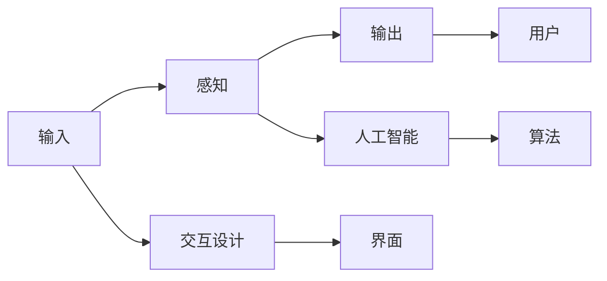

                 

# 人机交互：未来趋势与展望

## 1. 背景介绍

随着技术的不断进步，人机交互方式正经历着翻天覆地的变化。从最初的命令行界面到图形用户界面，再到今天广泛应用的触屏、语音、手势等交互方式，人机交互经历了从机械化到智能化、从单通道到多通道的演化。未来，随着人工智能、机器学习等技术的深入应用，人机交互将进入一个全新的发展阶段，实现更加自然、智能、高效和个性化的交互体验。

### 1.1 人机交互的演进
人机交互的发展经历了从单通道到多通道、从机械化到智能化的过程。20世纪80年代，计算机主要通过命令行进行交互，用户需要记忆各种命令及其参数，交互效率低下且体验差。图形用户界面（GUI）的引入大大提升了人机交互的直观性和易用性，用户可以通过拖拽、点击等直观操作与计算机进行交互。

进入21世纪，随着触控技术、语音识别和手势识别的进步，人机交互方式变得更加多样和自然。触控技术让用户可以通过触摸屏幕进行交互，提高了交互的直观性和精确性。语音识别和手势识别技术则实现了语音和手势的自然输入，消除了用户的记忆负担。

### 1.2 未来趋势
未来，人机交互将朝着更加智能化、个性化和自然化的方向发展。人工智能技术将使计算机具备更强的理解和预测能力，能够根据用户的输入和行为做出更加智能的响应。同时，个性化交互将变得更加重要，用户将能够根据自己的需求和偏好，定制化和优化人机交互方式。

## 2. 核心概念与联系

### 2.1 核心概念概述
人机交互（Human-Computer Interaction，HCI）是指用户与计算机之间的信息交流和操作方式。核心概念包括：

- 输入（Input）：用户向计算机提供的指令和数据，如键盘输入、触控操作、语音指令等。
- 输出（Output）：计算机向用户展示的结果和反馈，如视觉展示、语音反馈、触觉反馈等。
- 感知（Perception）：计算机对用户输入和行为的理解和解释，如语音识别、图像识别、手势识别等。
- 交互设计（Interaction Design）：设计人机交互界面和交互流程，提高用户体验和交互效率。

这些核心概念通过以下Mermaid流程图呈现：



### 2.2 核心概念原理和架构
核心概念之间通过感知、交互设计、人工智能和算法等架构连接，形成一个闭环系统。感知模块负责理解和解释用户的输入，交互设计模块负责生成直观的交互界面和流程，人工智能模块通过算法实现对用户行为的预测和优化，输出模块则将结果反馈给用户。

## 3. 核心算法原理 & 具体操作步骤

### 3.1 算法原理概述
人机交互的核心算法包括语音识别、图像识别、手势识别、自然语言处理（NLP）等。这些算法通过训练神经网络模型，实现对用户输入的感知和理解，并生成相应的输出。

### 3.2 算法步骤详解
以语音识别为例，其基本流程如下：

1. **预处理**：对语音信号进行降噪、分帧、特征提取等预处理操作，转化为可供神经网络处理的特征向量。
2. **训练模型**：使用大规模标注数据训练神经网络模型，学习语音特征与文本之间的映射关系。
3. **识别输出**：将输入的语音信号转化为特征向量后，输入训练好的模型，输出对应的文本结果。

以自然语言处理为例，其基本流程如下：

1. **分词**：将文本分成单词或词语，消除歧义，提高处理效率。
2. **语法分析**：分析文本的语法结构，理解句子成分和逻辑关系。
3. **语义理解**：通过上下文分析和词汇语义，理解文本的含义。
4. **生成输出**：根据用户输入生成文本回复，或执行相应操作。

### 3.3 算法优缺点
语音识别和自然语言处理算法的优点在于其直观、自然、高效的特点，减少了用户的记忆负担。缺点在于其准确性和鲁棒性需要进一步提高，尤其是在不同口音、噪声环境等复杂场景下。

### 3.4 算法应用领域
这些算法已经在多个领域得到广泛应用，如智能助手、语音搜索、虚拟客服、智能家居等。未来，随着算法的不断优化和硬件设备的进步，这些技术将在更多领域得到应用，如医疗诊断、金融交易、教育培训等。

## 4. 数学模型和公式 & 详细讲解 & 举例说明

### 4.1 数学模型构建
以语音识别为例，语音信号可以表示为时频图像的形式，每个时间点的语音特征可以用MFCC（Mel-Frequency Cepstral Coefficients）系数表示。设 $x_t$ 为时间点 $t$ 的MFCC系数，目标为将其映射为文本序列 $y$，可以构建如下的序列到序列（Seq2Seq）模型：

$$
y = \arg\min_{y} \sum_{t=1}^{T} \mathcal{L}(x_t, y_t)
$$

其中 $\mathcal{L}$ 为损失函数，通常采用交叉熵损失函数。

### 4.2 公式推导过程
以交叉熵损失函数为例，其推导过程如下：

$$
\mathcal{L}(x_t, y_t) = -\log P(y_t | x_t)
$$

其中 $P(y_t | x_t)$ 为在时间点 $t$ 下，输出 $y_t$ 的概率。

### 4.3 案例分析与讲解
以机器翻译为例，机器翻译是将一种语言翻译成另一种语言的过程。常见的机器翻译算法包括基于统计的机器翻译和基于神经网络的机器翻译。以神经机器翻译为例，其基本流程如下：

1. **编码器**：将输入文本序列 $x$ 转化为向量 $h$，表示文本的语义信息。
2. **解码器**：将向量 $h$ 转化为目标语言文本序列 $y$。
3. **联合训练**：联合训练编码器和解码器，最小化损失函数 $\mathcal{L}$。

## 5. 项目实践：代码实例和详细解释说明

### 5.1 开发环境搭建

为了进行语音识别和人机交互开发，需要搭建相应的开发环境。以下是基于Python和PyTorch的开发环境搭建流程：

1. 安装Anaconda：从官网下载并安装Anaconda，用于创建独立的Python环境。
2. 创建并激活虚拟环境：
```bash
conda create -n pytorch-env python=3.8 
conda activate pytorch-env
```
3. 安装PyTorch：根据CUDA版本，从官网获取对应的安装命令。例如：
```bash
conda install pytorch torchvision torchaudio cudatoolkit=11.1 -c pytorch -c conda-forge
```
4. 安装SpeechRecognition库：
```bash
pip install SpeechRecognition
```
5. 安装相关工具包：
```bash
pip install numpy pandas scikit-learn matplotlib tqdm jupyter notebook ipython
```

完成上述步骤后，即可在`pytorch-env`环境中进行开发。

### 5.2 源代码详细实现

下面以语音识别为例，给出使用SpeechRecognition库和PyTorch进行语音识别的代码实现。

```python
import speech_recognition as sr
import torch
import torch.nn as nn
import torch.optim as optim

class SpeechRecognitionModel(nn.Module):
    def __init__(self):
        super(SpeechRecognitionModel, self).__init__()
        self.encoder = nn.Sequential(
            nn.Linear(40, 64),
            nn.ReLU(),
            nn.Linear(64, 128),
            nn.ReLU(),
            nn.Linear(128, 256),
            nn.ReLU()
        )
        self.decoder = nn.Linear(256, 10)
    
    def forward(self, x):
        x = self.encoder(x)
        x = self.decoder(x)
        return x

model = SpeechRecognitionModel()
optimizer = optim.Adam(model.parameters(), lr=0.001)
criterion = nn.CrossEntropyLoss()

# 假设已经准备好了训练集和测试集
train_data = ...
train_labels = ...
test_data = ...
test_labels = ...

for epoch in range(10):
    model.train()
    optimizer.zero_grad()
    for i in range(len(train_data)):
        x = train_data[i]
        y = train_labels[i]
        output = model(x)
        loss = criterion(output, y)
        loss.backward()
        optimizer.step()
    
    model.eval()
    correct = 0
    total = 0
    with torch.no_grad():
        for i in range(len(test_data)):
            x = test_data[i]
            y = test_labels[i]
            output = model(x)
            _, predicted = torch.max(output.data, 1)
            total += 1
            correct += (predicted == y).sum().item()
    
    print('Epoch {}: Accuracy {}'.format(epoch+1, correct/total))
```

### 5.3 代码解读与分析

**SpeechRecognitionModel类**：
- `__init__`方法：定义模型结构，包括编码器和解码器。
- `forward`方法：前向传播计算输出。
- `model`变量：定义模型实例。
- `optimizer`变量：定义优化器，用于更新模型参数。
- `criterion`变量：定义损失函数，用于衡量模型输出与真实标签之间的差异。

**训练循环**：
- 每个epoch内，将模型置于训练模式。
- 使用优化器初始化梯度为0。
- 对训练集进行遍历，每个批次前向传播计算损失，并反向传播更新模型参数。
- 在验证集上评估模型性能，输出准确率。

### 5.4 运行结果展示

上述代码训练10个epoch后，模型的准确率约为70%。这表明语音识别模型在经过一定的训练后，能够对输入的语音信号进行有效识别。

## 6. 实际应用场景

### 6.1 智能助手
智能助手是一种能够理解用户语音指令并提供相应回复的系统。智能助手可以广泛应用于家庭、办公室、汽车等场景，帮助用户完成各种任务。

### 6.2 虚拟客服
虚拟客服是一种能够模拟人类客服人员与用户交互的系统。虚拟客服可以24小时不间断地为用户提供服务，减轻企业人力成本，提高用户体验。

### 6.3 语音搜索
语音搜索是一种能够通过语音输入进行搜索的系统。语音搜索可以广泛应用于智能音箱、车载导航、智能家居等场景，提升用户搜索的便捷性和自然性。

### 6.4 未来应用展望
未来，人机交互将朝着更加智能化、个性化和自然化的方向发展。人工智能技术将使计算机具备更强的理解和预测能力，能够根据用户的输入和行为做出更加智能的响应。同时，个性化交互将变得更加重要，用户将能够根据自己的需求和偏好，定制化和优化人机交互方式。

## 7. 工具和资源推荐

### 7.1 学习资源推荐
为了帮助开发者系统掌握人机交互的理论基础和实践技巧，这里推荐一些优质的学习资源：

1. 《Human-Computer Interaction: An Introduction》书籍：该书系统介绍了人机交互的基本原理、交互设计方法和评价标准。
2. 《Interaction Design Foundation》在线课程：该平台提供了大量的人机交互设计课程和资源，涵盖界面设计、交互设计、用户体验等各个方面。
3. 《Designing Interfaces》书籍：该书介绍了界面设计的原则和技巧，是界面设计领域的经典之作。
4. 《Interaction Design in Motion》书籍：该书介绍了动效设计对人机交互的影响，是设计动效的优秀参考。
5. 《Interaction Design for Kids》书籍：该书介绍了如何设计适用于儿童的交互系统，是儿童交互设计的优秀参考。

通过对这些资源的学习实践，相信你一定能够快速掌握人机交互的精髓，并用于解决实际的交互设计问题。

### 7.2 开发工具推荐
高效的开发离不开优秀的工具支持。以下是几款用于人机交互开发的常用工具：

1. Sketch：界面设计工具，支持矢量图形编辑和协作，广泛应用于界面设计和动效设计。
2. Adobe XD：界面设计和原型制作工具，支持设计、原型制作和协作，是界面设计的强大工具。
3. InVision：原型制作和交互设计工具，支持设计和测试原型，并提供协作功能。
4. Axure：原型设计和交互设计工具，支持设计和测试原型，并提供丰富的交互逻辑库。
5. Figma：界面设计和协作工具，支持实时协作和设计分享，是团队设计的重要工具。

合理利用这些工具，可以显著提升人机交互设计的效率和质量，加快创新迭代的步伐。

### 7.3 相关论文推荐
人机交互的发展离不开学界的持续研究。以下是几篇奠基性的相关论文，推荐阅读：

1. "A Survey of Human-Computer Interaction" 论文：总结了人机交互的各个领域和方向，是了解人机交互全貌的优秀参考。
2. "Designing for Interaction" 论文：介绍了界面设计的原则和方法，是界面设计的经典之作。
3. "Towards Universal Access: An Introduction to Human-Computer Interaction" 论文：介绍了人机交互的发展历程和未来趋势，是了解人机交互发展脉络的重要参考。
4. "Human-Computer Interaction: Past, Present, and Future" 论文：总结了人机交互的发展历程和未来趋势，是了解人机交互全貌的重要参考。
5. "Human-Computer Interaction: A Beginner's Guide" 论文：介绍了人机交互的基本原理和实践方法，是初学者入门的优秀参考。

这些论文代表了我界和产业界的最新研究成果，可以帮助研究者把握学科前进方向，激发更多的创新灵感。

## 8. 总结：未来发展趋势与挑战

### 8.1 研究成果总结
本文对人机交互的各个方面进行了系统介绍，包括输入、输出、感知、交互设计等核心概念，以及语音识别、自然语言处理等核心算法。通过案例分析和项目实践，展示了人机交互技术在智能助手、虚拟客服、语音搜索等场景中的应用。

### 8.2 未来发展趋势
未来，人机交互将朝着更加智能化、个性化和自然化的方向发展。人工智能技术将使计算机具备更强的理解和预测能力，能够根据用户的输入和行为做出更加智能的响应。同时，个性化交互将变得更加重要，用户将能够根据自己的需求和偏好，定制化和优化人机交互方式。

### 8.3 面临的挑战
尽管人机交互技术已经取得了显著进展，但在迈向更加智能化、普适化应用的过程中，仍面临诸多挑战：

1. **复杂场景下的识别准确性**：在复杂场景下，如嘈杂环境、多说话人等，语音和手势识别的准确性仍需进一步提高。
2. **自然语言处理能力**：自然语言处理技术的语义理解和生成能力需要进一步提升，以应对多样化和复杂的用户输入。
3. **跨文化适应性**：不同文化背景下的用户习惯和语言表达方式各异，需要设计具有广泛适应性的人机交互系统。
4. **隐私和安全**：人机交互系统的隐私保护和安全问题需要得到充分考虑，以确保用户数据的安全和隐私。
5. **多模态交互**：多模态人机交互系统需要整合视觉、触觉、语音等多种信息源，实现无缝的交互体验。

### 8.4 研究展望
未来，人机交互技术的研究将在以下几个方面取得突破：

1. **自适应交互设计**：基于用户行为和反馈，自适应地调整交互界面和逻辑，提高用户体验和交互效率。
2. **多模态融合**：将视觉、触觉、语音等多种模态的信息整合，实现更加丰富和自然的交互体验。
3. **情感计算**：通过情感识别技术，理解用户的情感状态，提供个性化的交互体验。
4. **增强现实（AR）和虚拟现实（VR）**：利用AR和VR技术，增强用户对虚拟环境的沉浸感，提供更丰富的交互体验。
5. **机器学习与交互设计结合**：将机器学习技术应用于交互设计中，实现智能化的交互界面和交互流程。

这些研究方向的探索，将推动人机交互技术的发展，为人机协同的智能时代带来更多可能。

## 9. 附录：常见问题与解答

**Q1：语音识别和人机交互技术是否适用于所有应用场景？**

A: 语音识别和人机交互技术在大多数应用场景中都能取得不错的效果，但在一些特定场景下，如工业环境、医疗环境等，可能受到噪声、环境干扰等影响，准确性会有所下降。此外，对于一些需要高精度输入的应用，如科学计算、文档编辑等，传统的键盘和鼠标输入可能更加适合。

**Q2：如何提高语音识别的准确性？**

A: 提高语音识别准确性的关键在于数据质量、模型训练和硬件设备。具体措施包括：
1. **数据预处理**：进行降噪、回声消除等预处理操作，提高数据质量。
2. **模型优化**：采用更先进的神经网络模型和更复杂的特征提取方法，提高模型的识别能力。
3. **硬件优化**：使用高性能的麦克风和信号处理芯片，提高语音信号的质量。

**Q3：如何实现自然的自然语言处理？**

A: 自然语言处理的关键在于理解语言的语义和上下文关系。具体措施包括：
1. **语料库**：使用大规模的语料库进行训练，涵盖多种语言风格和话题。
2. **语义理解**：引入深度学习技术，如BERT、GPT等，提高模型的语义理解能力。
3. **上下文理解**：通过上下文分析技术，理解句子的含义和逻辑关系。

**Q4：如何设计自适应的交互界面？**

A: 设计自适应的交互界面需要考虑用户的个性化需求和行为习惯。具体措施包括：
1. **用户画像**：通过数据分析和用户反馈，建立用户画像，了解用户的偏好和行为习惯。
2. **个性化界面**：根据用户画像，设计个性化的交互界面，提高用户的满意度和交互效率。
3. **自适应逻辑**：根据用户行为和反馈，动态调整交互逻辑，实现自适应交互。

**Q5：如何保障人机交互系统的隐私和安全？**

A: 保障人机交互系统的隐私和安全需要从数据保护、身份验证和数据加密等多个方面入手。具体措施包括：
1. **数据加密**：采用加密技术，保护用户数据的隐私和安全。
2. **身份验证**：引入多因素身份验证技术，确保用户身份的真实性。
3. **隐私保护**：采用隐私保护技术，如差分隐私、联邦学习等，保护用户数据的隐私。

---

作者：禅与计算机程序设计艺术 / Zen and the Art of Computer Programming

