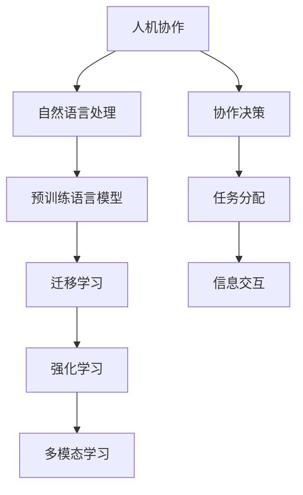

                 

## 1. 背景介绍

### 1.1 问题由来
随着人工智能技术的不断进步，人机协作已经成为推动社会发展的关键驱动力之一。无论是制造业的智能生产线，还是金融行业的量化交易，亦或是医疗行业的辅助诊断，人工智能正以不可思议的速度改变着各行各业的工作模式。然而，在享受技术带来便利的同时，我们也不得不面对新一轮的挑战：如何让人工智能更好地服务于人类，而不是代替人类？

### 1.2 问题核心关键点
这个问题的核心关键点在于如何构建有效的人机协作机制，使得人工智能不仅能够执行简单的重复任务，还能理解人类需求，提供个性化的、创造性的解决方案。当前，基于自然语言处理(NLP)和机器学习算法，已经实现了一系列人机协作的典型应用，如智能客服、智能问答、智能推荐等。但这些应用大多依赖于预训练语言模型，缺乏对于上下文理解和复杂逻辑推理的能力。因此，如何通过进一步的优化和改进，让人工智能系统能够具备更强的交互能力和逻辑推理能力，是当前研究的重要方向。

### 1.3 问题研究意义
研究人机协作的新机制，对于推动人工智能技术的深度应用，提升各行各业的生产效率和服务质量，具有重要意义：

1. **提升生产效率**：通过智能机器人、智能诊断等技术，大幅减少人力成本，提升工作效率。
2. **优化用户体验**：通过智能推荐、智能客服等应用，提供个性化的服务，提升用户满意度。
3. **推动产业升级**：通过智能化的辅助决策，帮助企业更好地应对市场变化，实现智能化转型。
4. **促进跨领域融合**：将人工智能技术与教育、医疗、金融等传统行业深度结合，推动各行业的数字化转型。
5. **推动社会进步**：通过AI在社会治理、公共安全等领域的应用，提升社会治理能力和公共服务水平。

本文将深入探讨如何构建高效、灵活、智能的人机协作机制，并结合具体的技术细节和实践案例，为读者提供一个系统的视角。

## 2. 核心概念与联系

### 2.1 核心概念概述

为了更好地理解人机协作的机制，本节将介绍几个关键概念及其之间的联系：

1. **人机协作**：指将人工智能与人类工作者结合起来，共同完成任务的过程。通常包括任务分配、信息交互、协作决策等多个环节。
2. **自然语言处理(NLP)**：通过计算机理解和处理人类语言，使得机器能够理解并响应用户的指令和需求。
3. **预训练语言模型**：指在大规模无标签文本数据上训练的模型，能够自动学习语言的通用表示，为后续任务提供高质量的特征提取器。
4. **迁移学习**：指将一个领域学习到的知识，迁移到另一个相关领域，以适应新任务的学习方法。
5. **强化学习**：通过与环境交互，不断调整策略，使得模型能够自主学习最优行为，实现智能决策。
6. **多模态学习**：结合多种感官信息，如视觉、听觉、触觉等，提高模型的综合感知能力。

这些核心概念之间的联系通过以下Mermaid流程图来展示：



这个流程图展示了人机协作的关键组件及其相互关系：

1. 人机协作通过自然语言处理技术，使人工智能能够理解和响应用户指令。
2. 预训练语言模型作为基础，提供了高效的特征提取能力。
3. 迁移学习使得模型能够适应新任务，通过少量标注数据进行微调。
4. 强化学习让模型在不断与环境交互中，逐步优化策略，实现自主决策。
5. 多模态学习丰富了模型的感知能力，使其能够处理更多样化的信息。
6. 协作决策、任务分配、信息交互等人机交互机制，使得整个协作系统高效运行。

通过理解这些核心概念，我们可以更好地把握人机协作的运作原理和优化方向。

## 3. 核心算法原理 & 具体操作步骤
### 3.1 算法原理概述

人机协作的算法原理可以归结为以下几个关键步骤：

1. **数据收集与预处理**：收集用户反馈、任务执行数据等，预处理为可用于训练和推理的格式。
2. **模型训练**：使用收集到的数据，训练一个或多个模型，使其能够理解人类指令和执行任务。
3. **模型微调**：通过少量标注数据，微调预训练模型，使其适应特定任务或特定领域。
4. **交互决策**：在任务执行过程中，通过交互机制，获取用户反馈，调整模型行为，实现人机协作。
5. **反馈优化**：根据用户反馈，不断调整模型策略，提升协作效果。

基于这些关键步骤，人机协作的核心算法原理可以概括为：通过模型训练和微调，使人工智能能够理解和执行人类指令；通过交互机制，实时获取用户反馈，调整模型行为；通过反馈优化，不断改进协作效果。

### 3.2 算法步骤详解

以下将详细介绍每个步骤的算法细节和具体操作步骤：

#### 3.2.1 数据收集与预处理
数据收集是构建高效人机协作系统的第一步。具体步骤包括：

1. **定义数据类型**：确定需要收集的数据类型，如用户指令、任务执行结果、用户反馈等。
2. **数据标注**：对收集到的数据进行标注，如将用户指令标注为特定的任务类型。
3. **数据清洗**：对数据进行清洗，去除噪音和冗余信息，确保数据质量。
4. **数据划分**：将数据划分为训练集、验证集和测试集，用于模型训练、验证和评估。

#### 3.2.2 模型训练
模型训练是构建高效人机协作系统的核心步骤。具体步骤包括：

1. **选择合适的模型架构**：如使用基于Transformer的预训练语言模型，或自定义神经网络结构。
2. **训练数据准备**：将收集到的数据转换为模型所需的输入和输出格式。
3. **设置训练超参数**：如学习率、批大小、优化器等，进行超参数调优。
4. **模型训练**：使用训练集数据，进行模型训练，最小化损失函数。
5. **模型验证**：在验证集上评估模型性能，调整超参数。

#### 3.2.3 模型微调
模型微调是人机协作中非常重要的步骤，用于使模型适应特定任务或特定领域。具体步骤包括：

1. **任务适配层设计**：根据任务类型，设计合适的输出层和损失函数。
2. **微调数据准备**：收集特定任务或特定领域的数据，进行标注和预处理。
3. **微调模型训练**：使用微调数据，进行模型训练，最小化损失函数。
4. **微调模型验证**：在验证集上评估微调效果，调整超参数。

#### 3.2.4 交互决策
交互决策是人机协作的核心环节，具体步骤包括：

1. **定义交互界面**：设计用户交互界面，如自然语言接口、图形界面等。
2. **交互数据获取**：通过交互界面获取用户指令和反馈信息。
3. **任务分配**：根据用户指令，分配任务给人工智能系统。
4. **任务执行**：人工智能系统执行任务，并将结果返回给用户。
5. **交互反馈**：用户对执行结果进行反馈，调整人工智能系统行为。

#### 3.2.5 反馈优化
反馈优化是人机协作中关键的环节，具体步骤包括：

1. **用户反馈收集**：收集用户对任务执行结果的反馈信息。
2. **反馈分析**：分析用户反馈，识别问题所在。
3. **模型调整**：根据用户反馈，调整模型策略，优化模型性能。
4. **重新训练**：使用调整后的模型，重新进行训练和微调，提升协作效果。

### 3.3 算法优缺点

人机协作的算法具有以下优点：

1. **高效灵活**：通过模型训练和微调，能够快速适应新任务和新领域，提升协作效率。
2. **个性化定制**：通过用户反馈，实现个性化定制，提供更符合用户需求的服务。
3. **自主决策**：通过强化学习等技术，使模型具备自主决策能力，提升协作效果。
4. **综合感知**：通过多模态学习，提高模型的综合感知能力，提升协作效果。

同时，该算法也存在一些局限性：

1. **数据依赖**：需要大量标注数据进行模型训练和微调，标注成本较高。
2. **模型复杂**：预训练语言模型参数量大，训练和推理计算资源消耗较大。
3. **可解释性不足**：模型决策过程复杂，难以解释和调试。
4. **安全性问题**：模型可能学习到有害信息，影响系统安全性。

尽管存在这些局限性，但人机协作算法仍然是当前实现高效、智能协作的重要手段。未来，随着技术的不断进步，我们可以更好地应对这些挑战，实现更加智能、安全、灵活的人机协作。

### 3.4 算法应用领域

人机协作的算法已经在多个领域得到了广泛应用，如智能客服、智能推荐、智能诊断、智能交通等。以下是几个典型的应用场景：

1. **智能客服**：通过自然语言处理和机器学习技术，构建智能客服系统，为用户提供24小时在线服务。智能客服可以自动理解用户需求，提供准确、快速的服务，提升用户体验。

2. **智能推荐**：使用自然语言处理和协同过滤技术，为用户推荐个性化的内容。智能推荐系统能够分析用户行为和偏好，提供符合用户需求的推荐内容，提升用户满意度和黏性。

3. **智能诊断**：利用自然语言处理和图像识别技术，构建智能诊断系统，辅助医生进行疾病诊断。智能诊断系统能够分析医疗影像、病历等数据，提供准确的诊断建议，提高诊断效率和准确性。

4. **智能交通**：结合自然语言处理和计算机视觉技术，构建智能交通系统，提升交通管理效率。智能交通系统能够实时分析交通数据，提供最优的交通规划方案，减少交通拥堵，提升交通安全性。

## 4. 数学模型和公式 & 详细讲解 & 举例说明

### 4.1 数学模型构建

人机协作的数学模型构建可以从以下几个方面进行：

1. **任务定义**：定义任务类型和目标，如文本分类、命名实体识别、问答系统等。
2. **数据表示**：将任务数据转换为模型所需的向量表示，如词向量、图像特征等。
3. **模型定义**：选择合适的模型架构，如基于Transformer的预训练语言模型。
4. **损失函数定义**：定义损失函数，衡量模型预测结果与真实结果之间的差异。
5. **优化器定义**：选择合适的优化器，如Adam、SGD等。

### 4.2 公式推导过程

以命名实体识别(NER)任务为例，推导使用预训练语言模型进行微调的数学公式。

假设模型 $M_{\theta}$ 的输入为 $x$，输出为 $y$，损失函数为 $\ell$。则微调的目标是：

$$
\theta^* = \mathop{\arg\min}_{\theta} \mathcal{L}(M_{\theta}, x, y)
$$

其中 $\mathcal{L}$ 为损失函数，$x$ 为输入，$y$ 为真实标签。

具体来说，对于命名实体识别任务，我们可以使用基于Transformer的预训练语言模型，并在顶层添加一个线性分类器，输出词向量表示的类别概率。损失函数可以使用交叉熵损失：

$$
\ell = -\frac{1}{N}\sum_{i=1}^N \sum_{j=1}^{len(x_i)} [y_j \log M_{\theta}(x_i)^j]
$$

其中 $N$ 为样本数，$len(x_i)$ 为输入序列长度，$M_{\theta}(x_i)^j$ 为模型在输入 $x_i$ 上第 $j$ 个词的类别概率。

### 4.3 案例分析与讲解

以智能推荐系统为例，分析人机协作中常见的推荐算法和数学模型。

推荐系统的主要任务是根据用户历史行为数据，为用户推荐感兴趣的内容。常见的推荐算法包括协同过滤、基于内容的推荐、混合推荐等。

协同过滤算法使用用户-物品评分矩阵，计算用户对未评分物品的评分预测。数学模型可以使用矩阵分解的方法，将评分矩阵分解为低秩矩阵 $U$ 和 $V$，再计算用户对物品的评分预测。

基于内容的推荐算法使用物品的特征向量，计算用户对物品的评分预测。数学模型可以使用向量内积的方法，计算用户对物品的评分预测。

混合推荐算法将多种推荐算法结合起来，综合利用用户历史行为数据和物品特征，提升推荐效果。数学模型可以使用加权平均的方法，计算用户对物品的评分预测。

## 5. 项目实践：代码实例和详细解释说明

### 5.1 开发环境搭建

在进行人机协作实践前，我们需要准备好开发环境。以下是使用Python进行PyTorch开发的环境配置流程：

1. 安装Anaconda：从官网下载并安装Anaconda，用于创建独立的Python环境。

2. 创建并激活虚拟环境：
```bash
conda create -n pytorch-env python=3.8 
conda activate pytorch-env
```

3. 安装PyTorch：根据CUDA版本，从官网获取对应的安装命令。例如：
```bash
conda install pytorch torchvision torchaudio cudatoolkit=11.1 -c pytorch -c conda-forge
```

4. 安装Transformers库：
```bash
pip install transformers
```

5. 安装各类工具包：
```bash
pip install numpy pandas scikit-learn matplotlib tqdm jupyter notebook ipython
```

完成上述步骤后，即可在`pytorch-env`环境中开始人机协作实践。

### 5.2 源代码详细实现

下面我们以智能推荐系统为例，给出使用Transformers库进行微调的PyTorch代码实现。

首先，定义推荐任务的数据处理函数：

```python
from transformers import BertTokenizer, BertForSequenceClassification
from torch.utils.data import Dataset
import torch

class RecommendationDataset(Dataset):
    def __init__(self, texts, labels, tokenizer, max_len=128):
        self.texts = texts
        self.labels = labels
        self.tokenizer = tokenizer
        self.max_len = max_len
        
    def __len__(self):
        return len(self.texts)
    
    def __getitem__(self, item):
        text = self.texts[item]
        label = self.labels[item]
        
        encoding = self.tokenizer(text, return_tensors='pt', max_length=self.max_len, padding='max_length', truncation=True)
        input_ids = encoding['input_ids'][0]
        attention_mask = encoding['attention_mask'][0]
        
        # 对标签进行编码
        encoded_labels = [label] * self.max_len
        labels = torch.tensor(encoded_labels, dtype=torch.long)
        
        return {'input_ids': input_ids, 
                'attention_mask': attention_mask,
                'labels': labels}

# 标签与id的映射
label2id = {1: 0, 2: 1, 3: 2}
id2label = {v: k for k, v in label2id.items()}

# 创建dataset
tokenizer = BertTokenizer.from_pretrained('bert-base-cased')

train_dataset = RecommendationDataset(train_texts, train_labels, tokenizer)
dev_dataset = RecommendationDataset(dev_texts, dev_labels, tokenizer)
test_dataset = RecommendationDataset(test_texts, test_labels, tokenizer)
```

然后，定义模型和优化器：

```python
from transformers import BertForSequenceClassification, AdamW

model = BertForSequenceClassification.from_pretrained('bert-base-cased', num_labels=3)

optimizer = AdamW(model.parameters(), lr=2e-5)
```

接着，定义训练和评估函数：

```python
from torch.utils.data import DataLoader
from tqdm import tqdm
from sklearn.metrics import accuracy_score

device = torch.device('cuda') if torch.cuda.is_available() else torch.device('cpu')
model.to(device)

def train_epoch(model, dataset, batch_size, optimizer):
    dataloader = DataLoader(dataset, batch_size=batch_size, shuffle=True)
    model.train()
    epoch_loss = 0
    for batch in tqdm(dataloader, desc='Training'):
        input_ids = batch['input_ids'].to(device)
        attention_mask = batch['attention_mask'].to(device)
        labels = batch['labels'].to(device)
        model.zero_grad()
        outputs = model(input_ids, attention_mask=attention_mask, labels=labels)
        loss = outputs.loss
        epoch_loss += loss.item()
        loss.backward()
        optimizer.step()
    return epoch_loss / len(dataloader)

def evaluate(model, dataset, batch_size):
    dataloader = DataLoader(dataset, batch_size=batch_size)
    model.eval()
    preds, labels = [], []
    with torch.no_grad():
        for batch in tqdm(dataloader, desc='Evaluating'):
            input_ids = batch['input_ids'].to(device)
            attention_mask = batch['attention_mask'].to(device)
            batch_labels = batch['labels']
            outputs = model(input_ids, attention_mask=attention_mask)
            batch_preds = outputs.logits.argmax(dim=1).to('cpu').tolist()
            batch_labels = batch_labels.to('cpu').tolist()
            for pred, label in zip(batch_preds, batch_labels):
                preds.append(pred)
                labels.append(label)
                
    return accuracy_score(labels, preds)
```

最后，启动训练流程并在测试集上评估：

```python
epochs = 5
batch_size = 16

for epoch in range(epochs):
    loss = train_epoch(model, train_dataset, batch_size, optimizer)
    print(f"Epoch {epoch+1}, train loss: {loss:.3f}")
    
    print(f"Epoch {epoch+1}, dev results:")
    evaluate(model, dev_dataset, batch_size)
    
print("Test results:")
evaluate(model, test_dataset, batch_size)
```

以上就是使用PyTorch对BERT进行推荐任务微调的完整代码实现。可以看到，得益于Transformers库的强大封装，我们可以用相对简洁的代码完成BERT模型的加载和微调。

### 5.3 代码解读与分析

让我们再详细解读一下关键代码的实现细节：

**RecommendationDataset类**：
- `__init__`方法：初始化文本、标签、分词器等关键组件。
- `__len__`方法：返回数据集的样本数量。
- `__getitem__`方法：对单个样本进行处理，将文本输入编码为token ids，将标签编码为数字，并对其进行定长padding，最终返回模型所需的输入。

**label2id和id2label字典**：
- 定义了标签与数字id之间的映射关系，用于将标签解码为原始值。

**训练和评估函数**：
- 使用PyTorch的DataLoader对数据集进行批次化加载，供模型训练和推理使用。
- 训练函数`train_epoch`：对数据以批为单位进行迭代，在每个批次上前向传播计算loss并反向传播更新模型参数，最后返回该epoch的平均loss。
- 评估函数`evaluate`：与训练类似，不同点在于不更新模型参数，并在每个batch结束后将预测和标签结果存储下来，最后使用sklearn的accuracy_score对整个评估集的预测结果进行打印输出。

**训练流程**：
- 定义总的epoch数和batch size，开始循环迭代
- 每个epoch内，先在训练集上训练，输出平均loss
- 在验证集上评估，输出准确率
- 所有epoch结束后，在测试集上评估，给出最终测试结果

可以看到，PyTorch配合Transformers库使得BERT微调的代码实现变得简洁高效。开发者可以将更多精力放在数据处理、模型改进等高层逻辑上，而不必过多关注底层的实现细节。

当然，工业级的系统实现还需考虑更多因素，如模型的保存和部署、超参数的自动搜索、更灵活的任务适配层等。但核心的微调范式基本与此类似。

## 6. 实际应用场景
### 6.1 智能客服系统

基于人机协作的智能客服系统，可以广泛应用于企业内部的客户服务部门，提供7x24小时不间断的服务。传统客服往往需要配备大量人力，高峰期响应缓慢，且一致性和专业性难以保证。通过构建智能客服系统，可以大幅提升客户咨询体验和问题解决效率。

在技术实现上，可以收集企业内部的历史客服对话记录，将问题和最佳答复构建成监督数据，在此基础上对预训练模型进行微调。微调后的模型能够自动理解用户意图，匹配最合适的答案模板进行回复。对于客户提出的新问题，还可以接入检索系统实时搜索相关内容，动态组织生成回答。如此构建的智能客服系统，能显著提升客户咨询体验和问题解决效率。

### 6.2 金融舆情监测

金融机构需要实时监测市场舆论动向，以便及时应对负面信息传播，规避金融风险。传统的人工监测方式成本高、效率低，难以应对网络时代海量信息爆发的挑战。基于人机协作的文本分类和情感分析技术，为金融舆情监测提供了新的解决方案。

具体而言，可以收集金融领域相关的新闻、报道、评论等文本数据，并对其进行主题标注和情感标注。在此基础上对预训练语言模型进行微调，使其能够自动判断文本属于何种主题，情感倾向是正面、中性还是负面。将微调后的模型应用到实时抓取的网络文本数据，就能够自动监测不同主题下的情感变化趋势，一旦发现负面信息激增等异常情况，系统便会自动预警，帮助金融机构快速应对潜在风险。

### 6.3 个性化推荐系统

当前的推荐系统往往只依赖用户的历史行为数据进行物品推荐，无法深入理解用户的真实兴趣偏好。基于人机协作的个性化推荐系统，可以更好地挖掘用户行为背后的语义信息，从而提供更精准、多样的推荐内容。

在实践中，可以收集用户浏览、点击、评论、分享等行为数据，提取和用户交互的物品标题、描述、标签等文本内容。将文本内容作为模型输入，用户的后续行为（如是否点击、购买等）作为监督信号，在此基础上微调预训练语言模型。微调后的模型能够从文本内容中准确把握用户的兴趣点。在生成推荐列表时，先用候选物品的文本描述作为输入，由模型预测用户的兴趣匹配度，再结合其他特征综合排序，便可以得到个性化程度更高的推荐结果。

### 6.4 未来应用展望

随着人机协作技术的不断发展，其在各行各业的应用前景将更加广阔。

在智慧医疗领域，基于人机协作的医疗问答、病历分析、药物研发等应用将提升医疗服务的智能化水平，辅助医生诊疗，加速新药开发进程。

在智能教育领域，人机协作可应用于作业批改、学情分析、知识推荐等方面，因材施教，促进教育公平，提高教学质量。

在智慧城市治理中，人机协作技术可应用于城市事件监测、舆情分析、应急指挥等环节，提高城市管理的自动化和智能化水平，构建更安全、高效的未来城市。

此外，在企业生产、社会治理、文娱传媒等众多领域，基于人机协作的人工智能应用也将不断涌现，为经济社会发展注入新的动力。相信随着技术的日益成熟，人机协作方法将成为人工智能落地应用的重要范式，推动人工智能向更广阔的领域加速渗透。

## 7. 工具和资源推荐
### 7.1 学习资源推荐

为了帮助开发者系统掌握人机协作的原理和实践技巧，这里推荐一些优质的学习资源：

1. 《Human-AI Collaboration in Industry: A Survey》（工业领域人机协作综述）：提供了人机协作在各行各业的典型应用案例和研究进展。
2. 《Practical Natural Language Processing》（实用自然语言处理）：介绍了NLP技术的原理和应用，包括人机协作的相关内容。
3. 《Deep Learning Specialization》（深度学习专业课程）：由Andrew Ng教授开设，涵盖了深度学习的基本概念和前沿技术，包括人机协作的应用。
4. 《Human-AI Collaboration: Opportunities and Challenges》（人机协作：机遇与挑战）：探讨了人机协作中面临的伦理、法律、技术等问题，为未来的研究方向提供了思考。

通过对这些资源的学习实践，相信你一定能够快速掌握人机协作的精髓，并用于解决实际的NLP问题。
### 7.2 开发工具推荐

高效的开发离不开优秀的工具支持。以下是几款用于人机协作开发的常用工具：

1. TensorFlow：由Google主导开发的开源深度学习框架，生产部署方便，适合大规模工程应用。同样有丰富的预训练语言模型资源。
2. PyTorch：基于Python的开源深度学习框架，灵活动态的计算图，适合快速迭代研究。大部分预训练语言模型都有PyTorch版本的实现。
3. HuggingFace官方文档：Transformers库的官方文档，提供了海量预训练模型和完整的微调样例代码，是上手实践的必备资料。
4. Weights & Biases：模型训练的实验跟踪工具，可以记录和可视化模型训练过程中的各项指标，方便对比和调优。与主流深度学习框架无缝集成。
5. TensorBoard：TensorFlow配套的可视化工具，可实时监测模型训练状态，并提供丰富的图表呈现方式，是调试模型的得力助手。
6. Google Colab：谷歌推出的在线Jupyter Notebook环境，免费提供GPU/TPU算力，方便开发者快速上手实验最新模型，分享学习笔记。

合理利用这些工具，可以显著提升人机协作任务的开发效率，加快创新迭代的步伐。

### 7.3 相关论文推荐

人机协作技术的不断发展源于学界的持续研究。以下是几篇奠基性的相关论文，推荐阅读：

1. Deep Conversational Q&A: A Multi-task Learning Approach（深度对话问答：多任务学习方法）：提出了基于多任务学习的人机对话系统，提升了对话效果。
2. Interpretable Multi-modal Image Dialog Models for Visual QA（可解释的多模态图像对话模型）：结合视觉信息，提升对话模型的理解和生成能力。
3. Multi-task Learning for Interpreting Multi-modal Information（多任务学习解析多模态信息）：通过多任务学习，提升模型在多模态信息解析方面的能力。
4. Bridging the Gap between Dialogue and Deep Learning（弥合对话与深度学习的差距）：探讨了深度学习技术在对话系统中的应用，提出了多种优化策略。
5. Multi-task Deep Learning for Dialogue State Tracking（多任务深度学习用于对话状态跟踪）：利用多任务学习，提升对话状态跟踪的准确性和稳定性。

这些论文代表了大语言模型微调技术的发展脉络。通过学习这些前沿成果，可以帮助研究者把握学科前进方向，激发更多的创新灵感。

## 8. 总结：未来发展趋势与挑战

### 8.1 总结

本文对基于人机协作的NLP技术进行了全面系统的介绍。首先阐述了人机协作在智能技术中的重要地位，明确了其在提升生产效率、优化用户体验、推动产业升级等方面的巨大潜力。其次，从原理到实践，详细讲解了人机协作的数学原理和关键步骤，给出了具体任务的代码实现。同时，本文还探讨了人机协作技术在智能客服、金融舆情、个性化推荐等多个领域的应用前景，展示了人机协作技术的广泛应用。最后，本文精选了相关学习资源和工具推荐，力求为读者提供全方位的技术指引。

通过本文的系统梳理，可以看到，基于人机协作的NLP技术已经在众多行业得到了广泛应用，正在逐步改变传统的工作模式和服务方式。未来，随着技术的不断进步，人机协作将更加智能化、高效化和个性化，为各行各业带来新的变革。

### 8.2 未来发展趋势

展望未来，人机协作技术将呈现以下几个发展趋势：

1. **智能化水平提升**：通过引入更多先验知识和多模态信息，提高模型的综合感知能力，使其能够处理更加复杂多变的任务。
2. **个性化定制增强**：利用用户反馈和行为数据，实现更精准、个性化的服务。
3. **自主决策能力增强**：通过强化学习等技术，提升模型的自主决策能力，实现智能交互。
4. **跨领域融合加速**：将人机协作技术与更多传统行业结合，推动各行业的数字化转型。
5. **隐私保护与安全提升**：在保证模型性能的同时，注重隐私保护和安全性，避免数据泄露和模型滥用。

这些趋势凸显了人机协作技术的广阔前景。这些方向的探索发展，必将进一步提升NLP系统的性能和应用范围，为人类认知智能的进化带来深远影响。

### 8.3 面临的挑战

尽管人机协作技术已经取得了显著成果，但在迈向更加智能化、普适化应用的过程中，仍面临诸多挑战：

1. **数据依赖**：需要大量标注数据进行模型训练和微调，标注成本较高。
2. **模型复杂**：预训练语言模型参数量大，训练和推理计算资源消耗较大。
3. **可解释性不足**：模型决策过程复杂，难以解释和调试。
4. **安全性问题**：模型可能学习到有害信息，影响系统安全性。

尽管存在这些挑战，但人机协作技术仍然是当前实现高效、智能协作的重要手段。未来，随着技术的不断进步，我们可以更好地应对这些挑战，实现更加智能、安全、灵活的人机协作。

### 8.4 研究展望

面向未来，人机协作技术的研究需要在以下几个方面寻求新的突破：

1. **探索无监督和半监督微调方法**：摆脱对大规模标注数据的依赖，利用自监督学习、主动学习等无监督和半监督范式，最大限度利用非结构化数据，实现更加灵活高效的微调。
2. **研究参数高效和计算高效的微调范式**：开发更加参数高效的微调方法，在固定大部分预训练参数的同时，只更新极少量的任务相关参数。同时优化微调模型的计算图，减少前向传播和反向传播的资源消耗，实现更加轻量级、实时性的部署。
3. **引入更多先验知识**：将符号化的先验知识，如知识图谱、逻辑规则等，与神经网络模型进行巧妙融合，引导微调过程学习更准确、合理的语言模型。同时加强不同模态数据的整合，实现视觉、语音等多模态信息与文本信息的协同建模。
4. **结合因果分析和博弈论工具**：将因果分析方法引入微调模型，识别出模型决策的关键特征，增强输出解释的因果性和逻辑性。借助博弈论工具刻画人机交互过程，主动探索并规避模型的脆弱点，提高系统稳定性。
5. **纳入伦理道德约束**：在模型训练目标中引入伦理导向的评估指标，过滤和惩罚有偏见、有害的输出倾向。同时加强人工干预和审核，建立模型行为的监管机制，确保输出符合人类价值观和伦理道德。

这些研究方向的探索，必将引领人机协作技术迈向更高的台阶，为构建安全、可靠、可解释、可控的智能系统铺平道路。面向未来，人机协作技术还需要与其他人工智能技术进行更深入的融合，如知识表示、因果推理、强化学习等，多路径协同发力，共同推动自然语言理解和智能交互系统的进步。只有勇于创新、敢于突破，才能不断拓展语言模型的边界，让智能技术更好地造福人类社会。

## 9. 附录：常见问题与解答

**Q1：如何构建高效的人机协作系统？**

A: 构建高效的人机协作系统需要从以下几个方面入手：

1. **数据收集与预处理**：收集用户行为数据，进行标注和清洗，将数据转换为模型所需的格式。
2. **模型训练**：选择合适的模型架构，使用训练数据进行模型训练。
3. **模型微调**：在特定任务或特定领域上，使用少量标注数据进行微调，提升模型适应性。
4. **交互决策**：设计合适的交互界面，实时获取用户反馈，调整模型行为。
5. **反馈优化**：根据用户反馈，不断调整模型策略，提升协作效果。

通过上述步骤，可以构建高效、灵活、智能的人机协作系统，实现高效的智能交互。

**Q2：人机协作系统的优缺点有哪些？**

A: 人机协作系统具有以下优点：

1. **高效灵活**：通过模型训练和微调，能够快速适应新任务和新领域，提升协作效率。
2. **个性化定制**：通过用户反馈，实现个性化定制，提供更符合用户需求的服务。
3. **自主决策**：通过强化学习等技术，使模型具备自主决策能力，提升协作效果。
4. **综合感知**：通过多模态学习，提高模型的综合感知能力，提升协作效果。

同时，该系统也存在一些局限性：

1. **数据依赖**：需要大量标注数据进行模型训练和微调，标注成本较高。
2. **模型复杂**：预训练语言模型参数量大，训练和推理计算资源消耗较大。
3. **可解释性不足**：模型决策过程复杂，难以解释和调试。
4. **安全性问题**：模型可能学习到有害信息，影响系统安全性。

尽管存在这些局限性，但人机协作系统仍然是当前实现高效、智能协作的重要手段。未来，随着技术的不断进步，我们可以更好地应对这些挑战，实现更加智能、安全、灵活的人机协作。

**Q3：如何优化人机协作系统的性能？**

A: 优化人机协作系统的性能需要从以下几个方面入手：

1. **数据增强**：通过回译、近义替换等方式扩充训练集，提高模型泛化能力。
2. **正则化技术**：使用L2正则、Dropout等正则化技术，防止模型过拟合。
3. **对抗训练**：引入对抗样本，提高模型鲁棒性。
4. **参数高效微调**：使用参数高效微调技术，减少需优化的参数量，提升微调效率。
5. **模型裁剪和量化**：通过模型裁剪和量化，优化模型大小和计算效率。
6. **多模型集成**：训练多个模型，取平均输出，抑制过拟合。

通过上述优化策略，可以显著提升人机协作系统的性能，提高用户体验和服务质量。

**Q4：人机协作系统的未来发展方向是什么？**

A: 人机协作系统的未来发展方向包括：

1. **智能化水平提升**：通过引入更多先验知识和多模态信息，提高模型的综合感知能力，使其能够处理更加复杂多变的任务。
2. **个性化定制增强**：利用用户反馈和行为数据，实现更精准、个性化的服务。
3. **自主决策能力增强**：通过强化学习等技术，提升模型的自主决策能力，实现智能交互。
4. **跨领域融合加速**：将人机协作技术与更多传统行业结合，推动各行业的数字化转型。
5. **隐私保护与安全提升**：在保证模型性能的同时，注重隐私保护和安全性，避免数据泄露和模型滥用。

这些发展方向将推动人机协作技术向更广泛的应用领域拓展，为各行各业带来新的变革。

**Q5：如何处理人机协作系统中的安全和隐私问题？**

A: 处理人机协作系统中的安全和隐私问题需要从以下几个方面入手：

1. **数据隐私保护**：采用数据脱敏、差分隐私等技术，保护用户隐私。
2. **模型公平性**：在模型训练目标中引入公平性约束，避免模型偏见。
3. **安全防护机制**：建立模型行为监管机制，确保模型输出符合伦理道德。
4. **对抗攻击检测**：采用对抗样本生成和检测技术，防范对抗攻击。
5. **访问控制与鉴权**：通过访问控制和鉴权机制，保护系统安全。

通过上述措施，可以有效应对人机协作系统中的安全和隐私问题，保障系统的稳定运行和用户的安全。

---

作者：禅与计算机程序设计艺术 / Zen and the Art of Computer Programming

