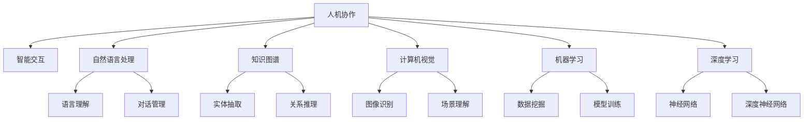

                 

# 人机协作：共创智能未来新世界

> 关键词：人机协作, 智能交互, 人工智能, 人机共生, 机器学习, 神经网络, 深度学习, 自然语言处理, 计算机视觉, 知识图谱

## 1. 背景介绍

### 1.1 问题由来
随着人工智能技术的飞速发展，人机协作（Human-Machine Collaboration）正在迅速成为现代社会的重要组成部分。从简单的自动回复到复杂的决策支持，机器不仅在生产效率上提供了巨大的助力，也在提升人机交互质量方面展现了广阔的前景。但与此同时，机器的介入也带来了新的挑战，如何平衡人机协作中各自的优点，最大化其协同效果，成为当前研究的热点。

### 1.2 问题核心关键点
人机协作的本质是通过技术手段实现人与机器间的无缝沟通与协同，使得机器能够理解人的意图，人的决策能够通过机器得到更好的支持。在实际应用中，实现人机协作的关键点包括：

- 机器的智能化理解能力：机器需要能够理解人类的语言、行为，并能够根据上下文提供准确、及时的回答。
- 人机交互的自然流畅性：交互界面需要易于使用，反馈机制及时，保证用户的使用体验。
- 系统决策的可靠性：机器提供的建议和决策应当可信赖，对风险能够合理控制。

### 1.3 问题研究意义
人机协作技术对于提升工作效率、优化资源配置、改善服务质量等方面具有重要意义。它不仅能够缩短决策时间，还能通过大数据分析提供科学的决策依据，帮助人们更好地应对复杂多变的现实世界。特别是在医疗、金融、教育等关键领域，人机协作技术的落地应用，将极大地提升服务质量和用户体验，加速社会向智能化、自动化转型。

## 2. 核心概念与联系

### 2.1 核心概念概述

为了更清晰地理解人机协作的内涵，本节将介绍几个核心概念：

- 人机协作（Human-Machine Collaboration, HMC）：通过人工智能技术实现人与机器间的协同工作，提升整体效率和质量。
- 智能交互（Intelligent Interaction, II）：指机器能够理解和响应人类自然语言和行为，与人类进行自然、流畅的沟通。
- 自然语言处理（Natural Language Processing, NLP）：使计算机能够理解、处理和生成人类语言的技术，是人机协作中重要的子领域。
- 知识图谱（Knowledge Graph）：以图形化方式表示实体和关系的知识库，为机器提供结构化信息，增强理解能力。
- 计算机视觉（Computer Vision, CV）：使计算机能够通过图像和视频数据进行理解和分析的技术，在人机协作中也扮演重要角色。
- 机器学习（Machine Learning, ML）和深度学习（Deep Learning, DL）：利用数据训练模型，使机器能够自主学习和优化决策。

这些概念共同构成了人机协作的基石，使得人机协作能够跨越语言、视觉等多个维度，实现更为深入、全面的交互。

### 2.2 核心概念原理和架构的 Mermaid 流程图



该流程图展示了人机协作中主要概念和技术间的联系：

1. **人机协作**是目标，通过智能交互、自然语言处理、知识图谱、计算机视觉、机器学习和深度学习等多种技术实现。
2. **智能交互**是人机协作的核心，通过自然语言处理和对话管理技术实现。
3. **自然语言处理**包括语言理解（H）和对话管理（I），旨在使机器能够理解人类语言，提供合适响应。
4. **知识图谱**涉及实体抽取（J）和关系推理（K），通过结构化信息增强机器的理解能力。
5. **计算机视觉**包括图像识别（L）和场景理解（M），使机器能够通过视觉数据进行分析和理解。
6. **机器学习和深度学习**涵盖数据挖掘（N）、模型训练（O）、神经网络（P）和深度神经网络（Q），为各种功能提供技术支撑。

## 3. 核心算法原理 & 具体操作步骤

### 3.1 算法原理概述

人机协作的核心算法原理可以归纳为以下几点：

- **自然语言处理**：通过文本分析、语义理解和情感分析等技术，使机器能够理解并生成人类语言。
- **知识图谱构建**：构建知识图谱以表示实体及其之间的关系，为机器提供结构化信息支持。
- **智能决策**：通过机器学习或深度学习模型，使机器能够根据上下文信息进行智能决策。
- **交互界面设计**：设计直观、易用的用户界面，优化用户与机器的交互体验。

### 3.2 算法步骤详解

人机协作的算法步骤如下：

1. **数据收集与预处理**：
   - 收集用户行为数据，包括语音、文本、图像等。
   - 对数据进行清洗、标注，准备用于训练和评估。

2. **模型训练**：
   - 选择或设计合适的模型架构，如神经网络、深度神经网络、循环神经网络等。
   - 利用标注数据训练模型，优化模型参数。
   - 验证模型性能，通过调整超参数、增加训练数据等方式优化模型。

3. **模型评估与优化**：
   - 使用独立测试数据集评估模型性能。
   - 根据评估结果调整模型架构、训练数据或超参数，进行模型优化。
   - 实施反馈循环，持续改进模型性能。

4. **交互界面设计**：
   - 设计直观、易用的用户界面，保证用户与机器的交互自然流畅。
   - 实现用户反馈机制，及时调整机器的输出策略。

### 3.3 算法优缺点

人机协作算法具有以下优点：

- **高效性**：能够大幅提升决策速度和处理效率，特别是在处理大数据和复杂任务时。
- **可扩展性**：支持多领域应用，能够灵活调整算法以适应不同场景。
- **准确性**：通过模型优化和大量数据训练，能够提供较高的准确性和可靠性。

但同时，也存在以下缺点：

- **依赖高质量数据**：算法效果高度依赖于数据质量和数量，数据偏差可能导致模型输出错误。
- **模型复杂度高**：高复杂度的模型需要大量计算资源和时间，实现难度较大。
- **人机交互的鲁棒性**：在复杂多变的现实环境中，模型的鲁棒性需要进一步提升。

### 3.4 算法应用领域

人机协作技术在多个领域得到了广泛应用：

- **医疗领域**：智能诊断系统利用自然语言处理和知识图谱，结合医疗专家的临床经验，为医生提供辅助诊断和决策支持。
- **金融领域**：智能投资顾问通过深度学习模型，分析市场数据，为投资者提供投资建议和风险控制。
- **教育领域**：智能教育系统利用自然语言处理技术，自动评估学生作业，提供个性化学习建议。
- **制造业**：智能制造系统通过计算机视觉和自然语言处理技术，优化生产流程，提高生产效率。
- **客服领域**：智能客服系统利用自然语言处理技术，解答用户问题，提升客户满意度。

这些应用展示了人机协作技术在不同领域的具体实现，证明了其广泛的适用性和潜力。

## 4. 数学模型和公式 & 详细讲解 & 举例说明

### 4.1 数学模型构建

人机协作的数学模型通常包含以下几个部分：

- **输入表示**：将用户输入的自然语言文本转换为向量表示，以便机器能够理解。
- **语义分析**：通过词向量、上下文向量和注意力机制等，实现对用户输入的理解。
- **决策过程**：利用机器学习模型，对输入进行分类、预测或生成。
- **输出表示**：将模型输出转换为可解释的形式，如自然语言回答或图像数据。

### 4.2 公式推导过程

以**情感分析**为例，推导其数学模型：

假设输入为一段文本 $x$，模型输出为情感标签 $y$，其中 $y \in \{pos, neg, neutral\}$。情感分析的数学模型可以表示为：

$$
P(y|x) = \frac{P(x|y)P(y)}{P(x)}
$$

其中 $P(x|y)$ 为条件概率，即在给定情感标签 $y$ 的条件下，文本 $x$ 的概率；$P(y)$ 为先验概率，即不同情感标签出现的概率；$P(x)$ 为先验概率，即文本 $x$ 出现的概率。

对于分类问题，通常使用softmax函数将输出转化为概率分布：

$$
P(y|x) = \frac{e^{W^T h(x) + b}}{\sum_{k=1}^K e^{W^T h_k(x) + b_k}}
$$

其中 $W$ 和 $b$ 为模型的权重和偏置，$h(x)$ 为输入 $x$ 经过处理后的向量表示。

### 4.3 案例分析与讲解

**案例：智能客服系统中的情感分析**

在智能客服系统中，情感分析用于判断用户情绪，提供针对性的服务。假设输入文本为“为什么我的问题还没人回答？”，输出情感标签为 $pos$ 或 $neg$。

- **输入表示**：将文本转化为词向量，使用BERT等预训练模型。
- **语义分析**：利用注意力机制，对文本中的关键信息进行加权。
- **决策过程**：通过逻辑回归或softmax分类器，对情感进行预测。
- **输出表示**：将预测结果转换为“情绪低落”或“情绪正常”的自然语言输出。

## 5. 项目实践：代码实例和详细解释说明

### 5.1 开发环境搭建

为了进行人机协作的实践开发，首先需要搭建开发环境。以下是Python开发环境的配置流程：

1. **安装Anaconda**：从官网下载并安装Anaconda，用于创建独立的Python环境。
   ```bash
   conda install anaconda
   ```

2. **创建并激活虚拟环境**：
   ```bash
   conda create --name hmc_env python=3.8 
   conda activate hmc_env
   ```

3. **安装必要的库**：
   ```bash
   conda install numpy scipy scikit-learn tensorflow transformers
   ```

4. **启动IDE**：
   ```bash
   jupyter notebook
   ```

### 5.2 源代码详细实现

以下是使用PyTorch进行情感分析的Python代码实现：

```python
import torch
import torch.nn as nn
import torch.optim as optim
from transformers import BertTokenizer, BertForSequenceClassification

# 加载模型和分词器
tokenizer = BertTokenizer.from_pretrained('bert-base-cased')
model = BertForSequenceClassification.from_pretrained('bert-base-cased', num_labels=3)

# 定义训练函数
def train_epoch(model, dataset, optimizer, device):
    model.to(device)
    model.train()
    total_loss = 0
    for batch in dataset:
        inputs = tokenizer(batch['text'], padding=True, truncation=True, max_length=512, return_tensors='pt').to(device)
        labels = batch['label'].to(device)
        outputs = model(**inputs, labels=labels)
        loss = outputs.loss
        optimizer.zero_grad()
        loss.backward()
        optimizer.step()
        total_loss += loss.item()
    return total_loss / len(dataset)

# 定义评估函数
def evaluate(model, dataset, device):
    model.eval()
    total_correct = 0
    total_samples = 0
    for batch in dataset:
        inputs = tokenizer(batch['text'], padding=True, truncation=True, max_length=512, return_tensors='pt').to(device)
        labels = batch['label'].to(device)
        outputs = model(**inputs)
        _, predicted = torch.max(outputs.logits, dim=1)
        total_correct += (predicted == labels).sum().item()
        total_samples += labels.size(0)
    return total_correct / total_samples

# 加载数据集
train_dataset = ...
dev_dataset = ...
test_dataset = ...

# 定义超参数
learning_rate = 2e-5
num_epochs = 5
batch_size = 16

# 初始化优化器
optimizer = optim.AdamW(model.parameters(), lr=learning_rate)

# 训练和评估模型
for epoch in range(num_epochs):
    train_loss = train_epoch(model, train_dataset, optimizer, device)
    print(f'Epoch {epoch+1}, train loss: {train_loss:.4f}')
    
    dev_acc = evaluate(model, dev_dataset, device)
    print(f'Epoch {epoch+1}, dev accuracy: {dev_acc:.4f}')
    
print('Test accuracy:', evaluate(model, test_dataset, device))
```

### 5.3 代码解读与分析

上述代码实现了一个简单的基于BERT模型的情感分析系统：

- **数据集准备**：将数据集分为训练集、验证集和测试集，使用BertTokenizer对文本进行分词和编码。
- **模型加载**：加载预训练的BERT模型和相应的分词器，定义模型结构。
- **训练函数**：在每个epoch内，使用梯度下降算法更新模型参数，并计算训练集上的损失。
- **评估函数**：在验证集和测试集上评估模型的准确率，打印评估结果。
- **模型部署**：在完成训练后，使用测试集评估模型性能，提供最终结果。

## 6. 实际应用场景

### 6.1 医疗领域

人机协作技术在医疗领域具有广泛应用。智能诊断系统能够结合医学知识图谱，对患者的病历进行自动分析，辅助医生诊断。例如，IBM Watson Health利用自然语言处理和知识图谱，帮助医生分析大量医疗文献，快速找到匹配的病例和治疗方案。

### 6.2 金融领域

在金融领域，智能投资顾问通过分析市场数据，提供个性化的投资建议。例如，Investment AI利用深度学习模型，分析历史股票数据，预测股票价格走势，为投资者提供决策支持。

### 6.3 教育领域

智能教育系统能够根据学生的学习行为数据，提供个性化学习建议。例如，Khan Academy利用自然语言处理技术，分析学生的作业和反馈，提供针对性的学习资源和问题解答。

### 6.4 未来应用展望

随着人机协作技术的不断进步，未来将在更多领域得到应用：

- **智能制造**：智能制造系统通过计算机视觉和自然语言处理技术，优化生产流程，提高生产效率。
- **智能客服**：智能客服系统利用自然语言处理技术，解答用户问题，提升客户满意度。
- **智能家居**：智能家居系统通过语音识别和自然语言处理技术，实现人与家居设备的自然交互。
- **智能交通**：智能交通系统利用计算机视觉和自然语言处理技术，优化交通流量，提高道路通行效率。

这些应用展示了人机协作技术的广阔前景，预示着智能时代的到来。

## 7. 工具和资源推荐

### 7.1 学习资源推荐

为了帮助开发者系统掌握人机协作的技术基础和实践技巧，以下是一些优质的学习资源：

1. **《深度学习》课程**：斯坦福大学提供的免费课程，涵盖了深度学习的基本原理和实现方法。
2. **TensorFlow官方文档**：详细的TensorFlow教程和API文档，是学习深度学习框架的重要资源。
3. **PyTorch官方文档**：Python中的深度学习框架，提供了丰富的模型和算法实现。
4. **Kaggle竞赛平台**：提供了大量的数据集和竞赛任务，帮助开发者实践和提升技能。
5. **GitHub**：开源代码库，提供了丰富的人机协作技术实现和资源。

通过这些资源的学习实践，相信你一定能够快速掌握人机协作的精髓，并用于解决实际的NLP问题。

### 7.2 开发工具推荐

高效的人机协作开发离不开优秀的工具支持。以下是几款常用的开发工具：

1. **PyTorch**：Python中的深度学习框架，提供了灵活的动态计算图和丰富的预训练模型。
2. **TensorFlow**：由Google主导的深度学习框架，支持大规模分布式计算，适合生产部署。
3. **Keras**：高级神经网络API，易于上手，适合快速原型开发。
4. **Jupyter Notebook**：免费的交互式编程环境，支持Python和其他编程语言，适合数据科学和机器学习开发。
5. **Anaconda**：Python环境管理工具，支持虚拟环境创建和管理，方便开发者独立开发和部署。

合理利用这些工具，可以显著提升人机协作的开发效率，加快创新迭代的步伐。

### 7.3 相关论文推荐

人机协作技术的发展源于学界的持续研究。以下是几篇奠基性的相关论文，推荐阅读：

1. **Attention is All You Need**：提出Transformer结构，开启了NLP领域的预训练大模型时代。
2. **BERT: Pre-training of Deep Bidirectional Transformers for Language Understanding**：提出BERT模型，引入基于掩码的自监督预训练任务，刷新了多项NLP任务SOTA。
3. **Towards a Unified Theory of Translation and Formal Language Processing**：提出知识图谱的构建方法，为机器提供结构化信息支持。
4. **Deep Neural Networks for Learning in Robotics**：利用深度学习技术，实现机器人的自主学习。
5. **Attention is All You Need**：利用自注意力机制，增强机器对上下文的理解能力。

这些论文代表了大规模人机协作技术的发展脉络，帮助研究者把握学科前进方向，激发更多的创新灵感。

## 8. 总结：未来发展趋势与挑战

### 8.1 研究成果总结

人机协作技术已经取得了显著的进展，广泛应用于多个领域，提高了工作效率和决策质量。然而，也面临着数据质量、模型复杂度、鲁棒性等挑战。未来研究需要进一步优化模型架构，提升数据处理能力，加强模型鲁棒性。

### 8.2 未来发展趋势

展望未来，人机协作技术将呈现以下几个发展趋势：

1. **数据驱动**：基于大规模数据训练的模型，将在各行各业得到广泛应用。
2. **多模态融合**：结合自然语言处理、计算机视觉和知识图谱，实现多模态信息的协同建模。
3. **联邦学习**：在保障数据隐私的前提下，实现跨机构数据共享和协作。
4. **实时计算**：利用分布式计算和边缘计算，实现低延迟、高吞吐的实时计算。
5. **个性化定制**：根据用户需求和行为，提供个性化的交互和决策支持。

### 8.3 面临的挑战

尽管人机协作技术已经取得了显著进展，但在迈向更加智能化、普适化应用的过程中，仍面临以下挑战：

1. **数据隐私和安全**：大规模数据收集和处理可能带来隐私和安全风险。
2. **模型公平性**：模型可能存在偏见，导致不公平的决策结果。
3. **技术普及**：需要进一步降低技术门槛，使更多人能够理解和应用人机协作技术。
4. **伦理和社会影响**：人机协作技术可能带来社会伦理问题，需要制定相应的规范和标准。

### 8.4 研究展望

未来研究需要在以下几个方面寻求新的突破：

1. **多领域应用**：在人机协作技术在不同领域的应用推广中，寻求共性问题和通用解决方案。
2. **跨学科融合**：结合人工智能、心理学、社会学等多学科知识，构建更全面的人机协作模型。
3. **交互体验优化**：优化人机交互界面，提升用户体验和满意度。
4. **伦理和安全**：建立人机协作的伦理框架和规范，确保技术应用的安全和公平。

总之，人机协作技术正在成为推动社会向智能化、自动化转型的重要力量。只有不断创新和优化，才能让人机协作技术在各个领域发挥更大作用，为人类带来更加美好的未来。

## 9. 附录：常见问题与解答

**Q1：人机协作的核心是什么？**

A: 人机协作的核心是利用人工智能技术，实现人与机器的协同工作，提升整体效率和质量。具体而言，通过自然语言处理、知识图谱、计算机视觉等技术，使机器能够理解人类的语言和行为，提供合适的决策和反馈。

**Q2：人机协作的算法实现难点在哪里？**

A: 人机协作算法的实现难点在于如何构建高效、鲁棒的模型。需要考虑模型的复杂度、训练数据的质量和数量、模型的泛化能力等因素。此外，还需要设计直观、易用的用户界面，提升人机交互的自然流畅性。

**Q3：人机协作的伦理和法律问题有哪些？**

A: 人机协作的伦理和法律问题主要包括以下几个方面：
1. 数据隐私和安全：大规模数据收集和处理可能带来隐私和安全风险，需要制定相应的法律法规进行规范。
2. 模型公平性：模型可能存在偏见，导致不公平的决策结果，需要引入公平性评估机制。
3. 算法透明性：需要公开算法的决策过程和依据，确保决策的可解释性和可追溯性。
4. 责任归属：当机器出现错误决策时，需要明确责任归属，制定相应的法律责任机制。

这些问题的解决需要多方面的努力，包括技术、法规和社会共识的共同推动。

**Q4：未来人机协作的发展方向有哪些？**

A: 未来人机协作的发展方向包括：
1. 多领域应用：在人机协作技术在不同领域的应用推广中，寻求共性问题和通用解决方案。
2. 跨学科融合：结合人工智能、心理学、社会学等多学科知识，构建更全面的人机协作模型。
3. 交互体验优化：优化人机交互界面，提升用户体验和满意度。
4. 伦理和安全：建立人机协作的伦理框架和规范，确保技术应用的安全和公平。

总之，人机协作技术正在成为推动社会向智能化、自动化转型的重要力量。只有不断创新和优化，才能让人机协作技术在各个领域发挥更大作用，为人类带来更加美好的未来。

---

作者：禅与计算机程序设计艺术 / Zen and the Art of Computer Programming

