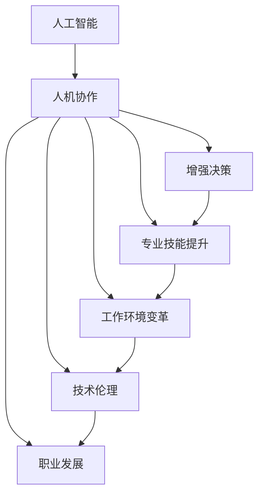

                 

# 人机协作：未来工作的趋势

> 关键词：人工智能(AI)、人机协作、未来工作、自动化、混合智能、增强决策、专业技能提升、工作环境变革、技术伦理、职业发展

## 1. 背景介绍

### 1.1 问题由来

随着人工智能(AI)技术的飞速发展，人类与机器的协作方式正在发生深刻变革。从简单的自动化工具到复杂的智能决策系统，AI正逐渐渗透到各行各业，改变了传统的生产方式和组织结构。企业正加速数字化转型，人工智能成为提升效率和竞争力的重要手段。然而，这种变革也引发了对未来工作的诸多思考：AI将如何影响人类职业，人类将如何在人机协作中共存与发展？

### 1.2 问题核心关键点

本节将详细分析未来人机协作工作趋势的核心关键点：

1. **AI的角色与潜力**：AI技术的进步使机器能够执行复杂的决策和任务，为人类赋能，提升工作效率。
2. **人机协作的实现方式**：人机协作不仅仅是简单的任务分工，更是深度整合双方能力的智能系统。
3. **人机协作的挑战与机遇**：随着技术的演进，人机协作面临新的挑战，如工作岗位的消失、伦理道德问题等，同时也带来了新的发展机遇。
4. **未来工作的模式与趋势**：AI将如何重塑工作流程、组织结构、岗位职责，以及未来职业发展的方向。
5. **应对策略与政策建议**：为应对AI带来的变革，需要制定合理政策，推动人机协作的可持续发展。

## 2. 核心概念与联系

### 2.1 核心概念概述

为了更好地理解人机协作的未来趋势，本节将介绍几个核心概念及其相互联系：

- **人工智能(AI)**：基于计算机科学和数学的算法和系统，能够执行复杂的任务，包括但不限于视觉识别、语言理解、决策制定等。
- **人机协作(Human-AI Collaboration)**：通过智能系统将人类与机器的能力整合，形成优势互补，共同完成任务的协作方式。
- **增强决策(Augmented Decision-Making)**：利用AI技术提升决策质量，提供更好的数据分析、预测和建议，辅助人类做出更优决策。
- **专业技能提升(Enhanced Skill Enhancement)**：AI通过知识图谱、模拟训练等方式，帮助人类提升专业技能和知识水平。
- **工作环境变革(Workplace Transformation)**：AI技术带来自动化、智能化工具，改变工作流程和组织结构，提升整体工作效率。
- **技术伦理(Technological Ethics)**：在人工智能应用过程中，如何处理数据隐私、算法公平性、责任归属等伦理问题，确保技术的安全和道德使用。
- **职业发展(Career Development)**：AI技术带来的工作环境和岗位职责的变化，对人才需求和职业发展路径产生深远影响。

这些核心概念之间的逻辑关系可以通过以下Mermaid流程图来展示：



这个流程图展示了大规模语言模型的核心概念及其之间的关系：

1. 人工智能通过预训练模型和微调技术，获得通用和特定任务的能力。
2. 人机协作将AI与人类深度结合，形成智能系统，实现优势互补。
3. 增强决策和专业技能提升利用AI技术，提升人类在决策和专业技能方面的能力。
4. 工作环境变革引入AI技术，改变工作流程和组织结构，提升整体效率。
5. 技术伦理确保AI应用中的数据隐私、算法公平等问题的处理，保障技术道德。
6. 职业发展反映了AI技术带来的岗位职责变化，引导职业路径调整。

这些概念共同构成了未来工作趋势的研究框架，帮助我们理解AI在各个方面的影响和应用。

## 3. 核心算法原理 & 具体操作步骤
### 3.1 算法原理概述

人机协作的核心在于如何有效整合人类和机器的能力，实现优势互补。这一过程可以概括为以下几个关键步骤：

1. **数据采集与处理**：收集与任务相关的数据，清洗和预处理数据集，为AI模型训练提供数据支持。
2. **模型训练与微调**：利用深度学习模型（如Transformer、BERT等）进行预训练和微调，提升模型在特定任务上的性能。
3. **决策融合**：将机器的预测结果与人类专家的判断融合，形成最终的决策输出。
4. **反馈与优化**：通过不断的反馈和优化，提升协作系统的整体表现。

### 3.2 算法步骤详解

#### 3.2.1 数据采集与处理

- **数据来源**：
  - 历史业务数据
  - 客户反馈数据
  - 实时监测数据
  - 第三方公开数据

- **数据清洗**：
  - 去重、去噪、填补缺失值
  - 标准化数据格式
  - 特征工程，提取和构建有用特征

- **数据增强**：
  - 数据扩充：通过数据生成技术增加样本数量
  - 数据扩维：引入时间、空间等维度
  - 数据增强技术：如对抗样本生成、回译、噪声注入等

#### 3.2.2 模型训练与微调

- **模型选择**：
  - 常见模型：Transformer、BERT、LSTM等
  - 微调策略：全参数微调、参数高效微调、混合微调

- **训练流程**：
  - 划分训练集、验证集和测试集
  - 选择优化器和损失函数
  - 设置超参数，包括学习率、批大小、迭代轮数等
  - 训练过程：前向传播、反向传播、参数更新

- **微调步骤**：
  - 加载预训练模型
  - 添加任务适配层和损失函数
  - 设置微调超参数
  - 执行梯度训练
  - 测试和部署

#### 3.2.3 决策融合

- **融合方法**：
  - 简单平均：将AI预测结果和人类判断简单平均
  - 加权平均：根据AI的可靠性和历史表现，调整权重
  - 序列融合：逐步将AI的预测结果融合到人类判断中

- **融合机制**：
  - 投票机制：多数表决决定最终结果
  - 阈值机制：设定阈值，高于阈值时使用AI结果
  - 多模态融合：结合图像、语音、文本等多种信息进行融合

#### 3.2.4 反馈与优化

- **反馈系统**：
  - 实时反馈：通过监控系统获取反馈数据
  - 历史反馈：分析历史数据，识别改进点
  - 用户反馈：收集用户意见，进行迭代优化

- **优化策略**：
  - 模型调优：调整模型结构和参数
  - 策略优化：调整融合策略和权重设置
  - 数据优化：优化数据采集和增强技术

### 3.3 算法优缺点

**优点**：

- **效率提升**：AI能够自动化处理大量数据，提升工作效率
- **精度提高**：AI模型能够学习和应用复杂的模式和规则，提高决策准确性
- **灵活性增强**：通过微调，AI模型可以适应不同的业务需求和场景
- **成本降低**：部分工作可以由AI自动化完成，减少人力成本

**缺点**：

- **依赖数据质量**：数据采集和处理的准确性直接影响模型性能
- **隐私和安全风险**：AI模型可能泄露数据隐私或被恶意利用
- **技术复杂度**：AI系统的搭建和维护需要较高技术水平
- **伦理和责任问题**：AI决策过程缺乏透明性和可解释性，可能导致责任归属不清

### 3.4 算法应用领域

基于人机协作的算法和系统，已经在多个领域实现了落地应用，具体如下：

- **金融**：风险评估、欺诈检测、投资建议
- **医疗**：疾病诊断、治疗方案、患者管理
- **制造**：质量控制、设备维护、生产调度
- **物流**：路径规划、库存管理、配送优化
- **零售**：客户分析、销售预测、推荐系统

## 4. 数学模型和公式 & 详细讲解 & 举例说明
### 4.1 数学模型构建

人机协作的数学模型可以构建为：

$$
\text{协作结果} = f(\text{AI预测}, \text{人类判断}, \text{决策融合策略})
$$

其中，$f$表示决策融合函数，$\text{AI预测}$和$\text{人类判断}$分别表示AI和人类的决策结果。

### 4.2 公式推导过程

设$\text{AI预测}$和$\text{人类判断}$为$y_A$和$y_H$，决策融合策略为$w$，融合后的协作结果为$y_{\text{协作}}$，则决策融合函数的表达式为：

$$
y_{\text{协作}} = \sum_{i=1}^n w_i(y_A + y_H - y_A \cdot y_H)
$$

其中，$n$为融合策略中不同模型的数量，$w_i$为每个模型的权重。

### 4.3 案例分析与讲解

考虑一个简单的制造业质量检测场景：

- **数据采集**：
  - 采集生产线上的零部件图像和缺陷描述
  - 进行图像预处理和特征提取
  - 构建带有标签的数据集

- **模型训练**：
  - 使用卷积神经网络（CNN）对图像进行特征提取
  - 添加分类层，使用交叉熵损失函数进行训练
  - 进行微调，提升模型在特定缺陷识别任务上的性能

- **决策融合**：
  - 使用投票机制，将AI预测和人类判断融合
  - 设定阈值，仅在AI预测超过阈值时使用AI结果
  - 结合图像和传感器数据进行多模态融合

- **反馈与优化**：
  - 实时监控检测结果，记录反馈数据
  - 定期分析历史数据，识别改进点
  - 根据反馈数据调整模型参数和融合策略

## 5. 项目实践：代码实例和详细解释说明
### 5.1 开发环境搭建

在进行人机协作项目实践前，我们需要准备好开发环境。以下是使用Python进行TensorFlow开发的环境配置流程：

1. 安装Anaconda：从官网下载并安装Anaconda，用于创建独立的Python环境。

2. 创建并激活虚拟环境：
```bash
conda create -n tf-env python=3.8 
conda activate tf-env
```

3. 安装TensorFlow：根据CUDA版本，从官网获取对应的安装命令。例如：
```bash
conda install tensorflow tensorflow-gpu -c tf
```

4. 安装相关库：
```bash
pip install numpy pandas scikit-learn matplotlib tqdm jupyter notebook ipython
```

完成上述步骤后，即可在`tf-env`环境中开始项目实践。

### 5.2 源代码详细实现

下面我们以金融风险评估项目为例，给出使用TensorFlow对AI模型进行人机协作的PyTorch代码实现。

首先，定义风险评估任务的数据处理函数：

```python
import tensorflow as tf
import numpy as np
from tensorflow.keras.preprocessing.text import Tokenizer
from tensorflow.keras.preprocessing.sequence import pad_sequences

class RiskDataset(tf.keras.utils.Sequence):
    def __init__(self, texts, labels, tokenizer, max_len=128):
        self.texts = texts
        self.labels = labels
        self.tokenizer = tokenizer
        self.max_len = max_len
        
    def __len__(self):
        return len(self.texts)
    
    def __getitem__(self, item):
        text = self.texts[item]
        label = self.labels[item]
        
        encoding = self.tokenizer(text, truncating='post', max_length=self.max_len, padding='post')
        input_ids = encoding['input_ids']
        input_ids = tf.keras.utils.to_categorical(input_ids, num_classes=10)
        label = tf.keras.utils.to_categorical(label, num_classes=10)
        
        return {'input_ids': input_ids, 'label': label}

# 定义模型
model = tf.keras.Sequential([
    tf.keras.layers.Embedding(input_dim=10000, output_dim=128),
    tf.keras.layers.Conv1D(64, 3, activation='relu'),
    tf.keras.layers.MaxPooling1D(2),
    tf.keras.layers.Flatten(),
    tf.keras.layers.Dense(32, activation='relu'),
    tf.keras.layers.Dense(10, activation='softmax')
])

# 编译模型
model.compile(optimizer=tf.keras.optimizers.Adam(0.001),
              loss=tf.keras.losses.CategoricalCrossentropy(),
              metrics=[tf.keras.metrics.CategoricalAccuracy()])

# 加载数据
tokenizer = Tokenizer(num_words=10000)
tokenizer.fit_on_texts(train_texts)
train_dataset = RiskDataset(train_texts, train_labels, tokenizer)
val_dataset = RiskDataset(val_texts, val_labels, tokenizer)
test_dataset = RiskDataset(test_texts, test_labels, tokenizer)

# 训练模型
model.fit(train_dataset, validation_data=val_dataset, epochs=10, batch_size=32)

# 评估模型
model.evaluate(test_dataset, verbose=2)
```

### 5.3 代码解读与分析

让我们再详细解读一下关键代码的实现细节：

**RiskDataset类**：
- `__init__`方法：初始化文本、标签、分词器等关键组件。
- `__len__`方法：返回数据集的样本数量。
- `__getitem__`方法：对单个样本进行处理，将文本输入编码为token ids，进行padding，并转换为one-hot编码，最终返回模型所需的输入。

**模型定义**：
- 使用序列模型（Sequential）定义多层网络结构
- 第一层为嵌入层（Embedding），将文本转换为向量表示
- 第二层为卷积层（Conv1D），提取局部特征
- 第三层为池化层（MaxPooling1D），减少特征维度
- 第四层为全连接层（Dense），进行分类
- 最后一层为输出层（Dense），输出概率分布

**模型编译与训练**：
- 使用Adam优化器，设置学习率为0.001
- 定义损失函数为交叉熵损失（CategoricalCrossentropy）
- 定义评估指标为分类准确率（CategoricalAccuracy）
- 使用训练集进行模型训练，设置10个epoch和32个batch size

**数据加载**：
- 使用TensorFlow的Tokenizer类对文本进行分词和编码
- 将编码后的token ids转换为one-hot编码，方便模型训练
- 使用pad_sequences对输入进行padding，确保输入数据长度一致

**模型评估**：
- 使用测试集评估模型性能，输出准确率

## 6. 实际应用场景
### 6.1 智能制造

在智能制造领域，人机协作可以显著提升生产效率和产品质量。通过AI和机器人的深度整合，可以实现智能化生产线的自动化控制和质量检测。

具体而言，可以使用AI模型对生产过程中的图像和传感器数据进行实时分析，识别异常情况，及时调整生产参数。同时，通过人机协作系统，将AI的预测结果与工人专家的经验判断结合，进行精准的质量检测和维修。这种智能化的生产模式，将大大减少人工干预，降低生产成本，提升产品一致性。

### 6.2 医疗诊断

医疗领域也是人机协作的重要应用场景。AI可以通过大数据分析和学习医学知识，辅助医生进行疾病诊断和治疗方案制定。

例如，在肿瘤诊断中，AI可以通过分析影像数据和病理报告，提供初步的诊断结果和风险评估。医生结合AI的建议，进行进一步的检查和确认。在手术规划和康复治疗中，AI可以提供详细的手术步骤和康复建议，辅助医生进行精准治疗。这种人机协作模式，可以提升诊断和治疗的准确性和效率，改善患者的治疗体验。

### 6.3 智能客服

智能客服系统通过人机协作，可以提供24小时不间断的客户服务，提升客户满意度和响应速度。

AI可以通过自然语言处理技术，理解客户的问题和需求，提供自动化的答复和解决方案。同时，系统可以记录客户的互动历史和反馈，不断优化AI模型的预测能力和客户体验。通过人机协作，智能客服系统能够灵活应对复杂的问题和场景，提供高质量的客户服务。

### 6.4 未来应用展望

随着技术的不断演进，人机协作将带来更多创新和变革。未来可能的趋势包括：

- **多模态融合**：结合视觉、听觉、文本等多种信息，提升人机协作系统的感知能力。
- **自适应学习**：通过持续学习和反馈机制，不断优化模型和策略，适应不断变化的任务需求。
- **跨领域协作**：打破行业壁垒，实现跨领域的多模态协作，提升整体系统的智能化水平。
- **人机交互界面优化**：开发更加自然、友好的交互界面，增强用户对AI系统的信任和接受度。
- **伦理和法律保障**：建立数据隐私保护机制和算法公平性评估，确保人机协作系统的道德和法律合规。

这些趋势将推动人机协作技术的进一步发展，为各行各业带来更多智能化、高效化的解决方案。

## 7. 工具和资源推荐
### 7.1 学习资源推荐

为了帮助开发者系统掌握人机协作的理论基础和实践技巧，这里推荐一些优质的学习资源：

1. **《人工智能导论》**：清华大学出版社，提供AI技术的基础知识和前沿动态。
2. **《深度学习与AI应用》**：阿里云开源，涵盖AI技术的实践案例和工程实现。
3. **《AI在医疗中的应用》**：健康医疗大数据联盟，介绍AI在医疗诊断和治疗中的应用。
4. **《智能制造：人机协作的未来》**：中国工程院院士郑念奎，探讨智能制造中的人机协作模式。
5. **《人机协作技术：前沿与挑战》**：全球智能制造论坛，讨论人机协作技术的最新进展和未来趋势。

通过对这些资源的学习实践，相信你一定能够快速掌握人机协作的精髓，并用于解决实际的业务问题。

### 7.2 开发工具推荐

高效的开发离不开优秀的工具支持。以下是几款用于人机协作开发的常用工具：

1. **TensorFlow**：由Google主导开发的开源深度学习框架，生产部署方便，适合大规模工程应用。
2. **PyTorch**：基于Python的开源深度学习框架，灵活动态的计算图，适合快速迭代研究。
3. **Scikit-learn**：Python机器学习库，提供多种数据处理和模型评估工具。
4. **TensorBoard**：TensorFlow配套的可视化工具，可实时监测模型训练状态，并提供丰富的图表呈现方式。
5. **Weights & Biases**：模型训练的实验跟踪工具，可以记录和可视化模型训练过程中的各项指标。

合理利用这些工具，可以显著提升人机协作任务的开发效率，加快创新迭代的步伐。

### 7.3 相关论文推荐

人机协作技术的发展源于学界的持续研究。以下是几篇奠基性的相关论文，推荐阅读：

1. **《多模态人机协作系统》**：LSTM模型在多模态数据融合中的应用，介绍多模态人机协作的实现。
2. **《增强学习在人机协作中的应用》**：基于强化学习的人机协作系统，通过实时反馈优化模型表现。
3. **《数据驱动的人机协作决策》**：通过大数据分析，指导人机协作系统的决策过程。
4. **《基于深度学习的智能制造系统》**：AI技术在智能制造中的应用，实现智能化生产线的自动化控制和质量检测。
5. **《医疗AI系统的人机协作》**：AI在医疗诊断和治疗中的应用，提升诊断和治疗的准确性和效率。

这些论文代表了大规模语言模型微调技术的发展脉络。通过学习这些前沿成果，可以帮助研究者把握学科前进方向，激发更多的创新灵感。

## 8. 总结：未来发展趋势与挑战
### 8.1 研究成果总结

本文对人机协作的未来趋势进行了全面系统的介绍。首先阐述了人机协作在AI技术进步背景下的重要性和应用前景。其次，从原理到实践，详细讲解了人机协作的数学模型和操作步骤，给出了人机协作任务开发的完整代码实例。同时，本文还广泛探讨了人机协作在智能制造、医疗诊断、智能客服等多个行业领域的应用前景，展示了人机协作技术的广阔前景。最后，本文精选了人机协作技术的各类学习资源，力求为读者提供全方位的技术指引。

通过本文的系统梳理，可以看到，人机协作技术正在成为AI技术应用的重要范式，极大地拓展了AI技术的应用边界，为各行各业带来了智能化、高效化的解决方案。未来，伴随AI技术的不断演进，人机协作技术也将不断优化和提升，为构建人机协同的智能时代提供更坚实的基础。

### 8.2 未来发展趋势

展望未来，人机协作技术将呈现以下几个发展趋势：

1. **智能化程度提升**：AI系统将更加智能，能够更好地理解人类需求和情感，提供更加个性化和智能化的服务。
2. **自动化水平提高**：人机协作系统将更加自动化，能够自主进行任务分配、资源调度和管理。
3. **多模态融合深入**：结合视觉、听觉、文本等多种信息，提升人机协作系统的感知能力和决策质量。
4. **自适应学习增强**：通过持续学习和反馈机制，不断优化模型和策略，适应不断变化的任务需求。
5. **跨领域协作扩展**：打破行业壁垒，实现跨领域的多模态协作，提升整体系统的智能化水平。
6. **伦理和法律保障完善**：建立数据隐私保护机制和算法公平性评估，确保人机协作系统的道德和法律合规。

这些趋势凸显了人机协作技术的广阔前景。这些方向的探索发展，必将进一步提升人机协作系统的性能和应用范围，为各行各业带来更多智能化、高效化的解决方案。

### 8.3 面临的挑战

尽管人机协作技术已经取得了瞩目成就，但在迈向更加智能化、普适化应用的过程中，它仍面临着诸多挑战：

1. **技术复杂度增加**：人机协作系统的搭建和维护需要较高的技术水平，特别是在多模态、自适应学习等方面。
2. **伦理和法律问题**：人机协作系统涉及数据隐私、算法公平性、责任归属等问题，需要制定合理政策和法规。
3. **数据质量和隐私保护**：数据采集和处理的准确性直接影响系统性能，同时需要保护用户隐私。
4. **交互界面优化**：人机协作系统的交互界面需要设计得更加自然、友好，提高用户接受度。
5. **跨领域协作**：打破行业壁垒，实现跨领域的多模态协作，需要多方协调和资源共享。

这些挑战需要在技术、伦理、法律等多个层面进行协同解决，推动人机协作技术向更加成熟、可持续的方向发展。

### 8.4 研究展望

未来研究需要重点关注以下几个方向：

1. **多模态人机协作**：结合视觉、听觉、文本等多种信息，提升人机协作系统的感知能力和决策质量。
2. **自适应学习**：通过持续学习和反馈机制，不断优化模型和策略，适应不断变化的任务需求。
3. **跨领域协作**：打破行业壁垒，实现跨领域的多模态协作，提升整体系统的智能化水平。
4. **伦理和法律保障**：建立数据隐私保护机制和算法公平性评估，确保人机协作系统的道德和法律合规。

这些方向的研究和探索，必将引领人机协作技术迈向更高的台阶，为人机协同的智能时代提供更加坚实的基础。

## 9. 附录：常见问题与解答

**Q1：人机协作是否意味着人类将失去工作？**

A: 人机协作并不是取代人类工作，而是通过技术手段提升工作效率，解放人类从事更具创造性和战略性的工作。AI可以承担重复性、低价值的工作，人类则可以专注于更需要判断、情感和创造性的任务。

**Q2：如何提高人机协作系统的适应性？**

A: 通过持续学习和反馈机制，不断优化模型和策略，适应不断变化的任务需求。引入自适应学习算法，如强化学习、在线学习等，提升系统的灵活性和泛化能力。

**Q3：人机协作技术面临的最大挑战是什么？**

A: 技术复杂度和伦理法律问题是人机协作技术面临的最大挑战。需要多方协同解决，制定合理的政策和技术标准，确保系统的安全性和道德性。

**Q4：如何优化人机协作系统的交互界面？**

A: 开发自然、友好的交互界面，使用自然语言处理技术，理解用户需求和情感。通过用户反馈不断优化系统界面，提高用户接受度和满意度。

**Q5：未来人机协作技术的主要方向是什么？**

A: 多模态融合、自适应学习、跨领域协作、伦理和法律保障是人机协作技术的主要方向。通过这些方向的研究和探索，提升系统的智能化水平和道德合规性。

这些问题的解答，希望能帮助你对人机协作技术有更深入的理解和把握。通过持续的研究和探索，相信未来人机协作技术将取得更多突破，为各行各业带来更多智能化、高效化的解决方案。

---

作者：禅与计算机程序设计艺术 / Zen and the Art of Computer Programming

