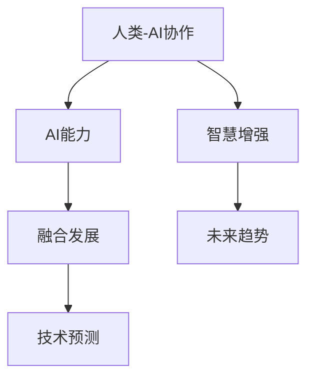

                 

# 人类-AI协作：增强人类智慧与AI能力的融合发展趋势分析预测

> 关键词：人类-AI协作,智慧增强,AI能力,融合发展,未来趋势,技术预测

## 1. 背景介绍

### 1.1 问题由来

随着人工智能(AI)技术的飞速发展，AI与人类社会的融合程度日益加深，标志着人类智慧与AI能力的协作进入了一个新的阶段。AI不仅在各行各业的应用越来越广泛，还逐步成为人们日常生活中不可或缺的助手。这种融合催生了一系列新的问题和挑战，例如如何提升AI与人类协作的效率和质量，如何保护数据隐私和安全，以及如何避免AI伦理风险等。本文旨在分析预测人类-AI协作的发展趋势，探讨智慧增强与AI能力融合的新方向，为未来技术应用提供理论指导和实践建议。

### 1.2 问题核心关键点

本文聚焦于以下核心问题：
- 如何利用AI技术增强人类智慧，提升决策水平？
- AI与人类协作中如何实现数据和知识的有效整合？
- 未来AI能力将如何演变，并与人类智慧协同？
- 人机协作中需要克服的技术瓶颈和挑战有哪些？

这些问题不仅关系到AI技术的进一步发展，也影响到其在各行各业的广泛应用和深入融合。通过深入分析这些问题，可以帮助我们更好地把握人类-AI协作的未来趋势，并指导实际应用的落地。

## 2. 核心概念与联系

### 2.1 核心概念概述

为更好地理解人类-AI协作的发展趋势，本节将介绍几个密切相关的核心概念：

- **人类-AI协作**：AI与人类协同工作，通过知识共享、智能辅助、决策支持等方式，提升人类工作的效率和质量。

- **智慧增强**：利用AI技术，提升人类感知、理解、决策等方面的能力，使其在复杂任务中表现更优。

- **AI能力**：指AI系统在特定任务上的表现能力，包括数据处理、模式识别、决策分析等。

- **融合发展**：AI技术与人类智慧的深度融合，通过协同工作，实现更高效、更智能的系统。

- **未来趋势**：基于当前技术发展态势和应用需求，对人类-AI协作的未来方向进行预测和分析。

- **技术预测**：基于当前研究进展和潜在技术突破，对未来技术应用的趋势进行分析和预判。

这些核心概念之间的逻辑关系可以通过以下Mermaid流程图来展示：



这个流程图展示出人类-AI协作的核心概念及其相互关系：

1. 人类-AI协作通过提升人类智慧，增强AI能力，实现更高效的融合发展。
2. AI能力提升人类智慧，增强感知、理解和决策能力。
3. 未来趋势基于当前融合发展的态势，预测AI与人类协作的未来方向。
4. 技术预测通过分析当前研究进展和潜在技术突破，预判AI技术的应用趋势。

这些概念共同构成了人类-AI协作的基本框架，有助于我们系统地理解AI与人类协作的未来趋势。

## 3. 核心算法原理 & 具体操作步骤

### 3.1 算法原理概述

人类-AI协作的原理可以归纳为以下几点：

1. **知识整合**：AI技术可以处理海量数据，提取知识，与人类经验相结合，提升决策的准确性和全面性。
2. **智能辅助**：AI提供实时分析和预测，辅助人类进行决策，增强处理复杂问题的能力。
3. **人机协同**：通过界面交互和自然语言处理，实现人类与AI的无缝协作。
4. **持续学习**：AI系统通过不断学习新数据和经验，保持与人类智慧的同步更新。

这些原理指导着人类-AI协作的实践，通过技术手段实现智慧增强和能力提升。

### 3.2 算法步骤详解

基于上述原理，人类-AI协作的典型操作步骤如下：

1. **数据收集与清洗**：收集人类专家的知识和经验数据，进行清洗和标注，准备输入AI系统。
2. **模型训练与优化**：使用机器学习算法训练AI模型，优化模型参数，提升其性能。
3. **知识整合与融合**：将AI模型的预测结果与人类专家的知识进行整合，形成更全面、准确的决策建议。
4. **智能辅助与反馈**：AI系统实时提供分析和建议，人类根据反馈进行调整，形成迭代优化过程。
5. **持续学习与更新**：通过不断收集新数据，更新AI模型，保持与人类智慧的同步。

### 3.3 算法优缺点

人类-AI协作在提升决策效率和质量方面具有显著优势，但也存在以下问题：

**优点**：
- 提升决策的准确性和全面性。
- 增强处理复杂问题的能力。
- 降低人力成本和时间投入。

**缺点**：
- 数据隐私和安全问题。
- AI模型的透明度和可解释性不足。
- 数据质量和标注的准确性问题。

### 3.4 算法应用领域

人类-AI协作在多个领域具有广泛的应用前景，如医疗、金融、教育、制造等。具体应用场景包括：

- **医疗**：AI辅助诊断、个性化治疗方案、药物研发等。
- **金融**：风险评估、投资决策、反欺诈检测等。
- **教育**：智能辅导、个性化学习路径、自动评分等。
- **制造**：质量检测、生产优化、设备维护等。

## 4. 数学模型和公式 & 详细讲解 & 举例说明

### 4.1 数学模型构建

假设AI系统的输入为 $X$，输出为 $Y$，人类专家的输入为 $X'$，输出为 $Y'$。人类-AI协作的目标是最大化输出 $Y'$ 的准确性，即：

$$
\max_{\theta} P(Y'|X', Y)
$$

其中 $\theta$ 表示AI模型的参数。通过优化 $\theta$，使得AI系统在结合人类专家知识的基础上，能够更准确地预测 $Y'$。

### 4.2 公式推导过程

根据贝叶斯公式，有：

$$
P(Y'|X', Y) = \frac{P(Y'|X', \theta)P(Y|\theta)}{P(X'|X,\theta)}
$$

即，在给定 $X$ 和人类专家的输出 $Y'$ 的情况下，最大化 $P(Y'|X', \theta)$。进一步，可以将 $P(Y'|X', \theta)$ 表示为：

$$
P(Y'|X', \theta) = \prod_{i=1}^n P(y_i'|x_i', \theta)
$$

其中 $y_i'$ 为输出 $Y'$ 中的第 $i$ 个元素，$x_i'$ 为输入 $X'$ 中的第 $i$ 个元素。

通过最大化上述公式，AI系统可以在结合人类专家知识的基础上，进行更准确的预测和决策。

### 4.3 案例分析与讲解

以医疗领域为例，AI系统可以辅助医生进行疾病诊断。医生的经验和知识可以表示为一系列规则和条件，AI系统可以通过训练学习这些规则，并将其整合到决策过程中。在具体应用中，医生提供症状描述 $X'$，AI系统结合已有的规则和模型预测 $Y'$，医生根据AI系统的建议进行调整，形成最终的诊断结果。

## 5. 项目实践：代码实例和详细解释说明

### 5.1 开发环境搭建

在进行人类-AI协作的实践前，我们需要准备好开发环境。以下是使用Python进行TensorFlow开发的环境配置流程：

1. 安装Anaconda：从官网下载并安装Anaconda，用于创建独立的Python环境。

2. 创建并激活虚拟环境：
```bash
conda create -n aicollab python=3.8 
conda activate aicollab
```

3. 安装TensorFlow：根据CUDA版本，从官网获取对应的安装命令。例如：
```bash
conda install tensorflow tensorflow-gpu=2.7 -c conda-forge
```

4. 安装其他必要的库：
```bash
pip install numpy pandas sklearn scipy pyod scikit-optimize matplotlib seaborn
```

完成上述步骤后，即可在`aicollab`环境中开始项目实践。

### 5.2 源代码详细实现

以下是使用TensorFlow实现人类-AI协作的代码示例：

```python
import tensorflow as tf
from sklearn.model_selection import train_test_split

# 数据准备
data = load_data()
X_train, X_test, y_train, y_test = train_test_split(data['X'], data['y'], test_size=0.2)

# 定义模型
model = tf.keras.Sequential([
    tf.keras.layers.Dense(64, activation='relu', input_shape=(X_train.shape[1],)),
    tf.keras.layers.Dense(32, activation='relu'),
    tf.keras.layers.Dense(1, activation='sigmoid')
])

# 编译模型
model.compile(optimizer='adam', loss='binary_crossentropy', metrics=['accuracy'])

# 训练模型
model.fit(X_train, y_train, epochs=10, batch_size=32, validation_data=(X_test, y_test))

# 测试模型
test_loss, test_acc = model.evaluate(X_test, y_test)
print('Test accuracy:', test_acc)
```

### 5.3 代码解读与分析

让我们再详细解读一下关键代码的实现细节：

**数据准备**：
- `load_data()`：加载预处理后的数据集。
- `train_test_split()`：将数据集划分为训练集和测试集。

**模型定义**：
- `Sequential`：定义一个顺序神经网络模型。
- `Dense`：定义全连接层，包括两个隐层和一个输出层。
- `activation`：定义激活函数，分别为ReLU和Sigmoid。
- `input_shape`：定义输入层的形状。

**模型编译**：
- `compile`：编译模型，定义优化器和损失函数。
- `adam`：使用Adam优化器。
- `binary_crossentropy`：使用二元交叉熵作为损失函数。

**模型训练**：
- `fit`：训练模型，定义训练轮数和批次大小。
- `validation_data`：定义验证集，用于评估模型性能。

**模型测试**：
- `evaluate`：评估模型性能，输出测试损失和准确率。

可以看到，TensorFlow提供了一个简洁高效的框架，使得人类-AI协作模型的开发变得简单快速。开发者可以根据具体任务设计不同的模型结构和训练策略，实现不同的协作效果。

## 6. 实际应用场景

### 6.1 医疗诊断

人类-AI协作在医疗领域的应用可以显著提升诊断的准确性和效率。通过整合医生的经验和AI系统的预测结果，可以生成更加全面、准确的诊断报告。例如，AI系统可以在短时间内处理大量医学影像，识别出病变区域，医生则根据AI系统的建议进行详细诊断和确认。

### 6.2 金融风险评估

在金融领域，人类-AI协作可以用于风险评估和投资决策。AI系统通过分析市场数据和用户行为，预测潜在的风险和收益，提供决策建议。金融分析师则根据AI系统的预测，结合专业知识，进行综合分析，做出最终的决策。

### 6.3 智能制造

在制造领域，人类-AI协作可以实现生产优化和质量检测。AI系统通过分析生产数据，预测设备故障和生产异常，提供维护和改进建议。工程师则根据AI系统的预测，进行设备维护和参数调整，优化生产流程。

### 6.4 未来应用展望

随着人类-AI协作技术的不断进步，未来将有更多领域的广泛应用。以下是一些可能的未来趋势：

- **智能教育**：AI系统可以提供个性化学习路径和智能辅导，帮助学生更好地掌握知识。
- **自动驾驶**：AI系统可以辅助驾驶员进行决策，提升驾驶安全和效率。
- **智能家居**：AI系统可以提供智能推荐和自动化控制，提升家庭生活的便捷性和舒适度。
- **社会治理**：AI系统可以辅助政府进行公共安全和应急管理，提升治理水平和效率。

## 7. 工具和资源推荐

### 7.1 学习资源推荐

为了帮助开发者系统掌握人类-AI协作的理论基础和实践技巧，这里推荐一些优质的学习资源：

1. **深度学习与人工智能基础课程**：涵盖深度学习的基本原理和前沿技术，适合初学者入门。
2. **TensorFlow官方文档**：详细介绍了TensorFlow的使用方法，提供了丰富的API和样例代码。
3. **机器学习实战**：通过实际案例，讲解机器学习和AI协作的实践方法。
4. **《人工智能与人类智慧》书籍**：探讨AI与人类智慧的融合，分析人类-AI协作的未来方向。
5. **《人类-AI协作的未来》系列文章**：分析当前技术进展，预测未来发展趋势。

通过对这些资源的学习实践，相信你一定能够快速掌握人类-AI协作的精髓，并用于解决实际的AI应用问题。

### 7.2 开发工具推荐

高效的开发离不开优秀的工具支持。以下是几款用于人类-AI协作开发的常用工具：

1. **TensorFlow**：基于Google的深度学习框架，支持灵活的模型定义和高效的计算图优化。
2. **PyTorch**：Facebook开发的深度学习框架，提供动态计算图和易于调试的特点。
3. **Jupyter Notebook**：支持交互式编程和数据可视化，方便开发者进行实验和文档编写。
4. **Git**：版本控制系统，帮助开发者管理和协作开发。
5. **TensorBoard**：TensorFlow的可视化工具，实时监测模型训练和推理过程。

合理利用这些工具，可以显著提升人类-AI协作任务的开发效率，加快创新迭代的步伐。

### 7.3 相关论文推荐

人类-AI协作的研究源于学界的持续探索。以下是几篇奠基性的相关论文，推荐阅读：

1. **《人类与AI协作的未来》**：探讨了人类-AI协作的发展方向，分析了当前的研究进展和未来趋势。
2. **《深度学习在人类-AI协作中的应用》**：介绍了深度学习在各个领域的协作应用，并分析了具体的实现方法和效果。
3. **《智慧增强与AI能力融合的理论与实践》**：探讨了智慧增强与AI能力的融合，分析了不同领域的协作应用。
4. **《人机协作的挑战与解决策略》**：分析了人机协作中面临的挑战，提出了具体的解决策略。
5. **《未来人机协作技术展望》**：预测了未来人机协作技术的发展趋势，分析了潜在的技术突破。

这些论文代表了大语言模型微调技术的发展脉络。通过学习这些前沿成果，可以帮助研究者把握学科前进方向，激发更多的创新灵感。

## 8. 总结：未来发展趋势与挑战

### 8.1 总结

本文对人类-AI协作的发展趋势进行了全面系统的分析。首先介绍了人类-AI协作的背景和核心概念，明确了其在提升决策水平、增强知识整合和能力提升方面的独特价值。其次，从原理到实践，详细讲解了人类-AI协作的数学模型和操作步骤，给出了实际应用的代码示例。同时，本文还探讨了人类-AI协作在医疗、金融、制造等多个领域的应用前景，展示了其广阔的应用范围和潜力。最后，本文精选了人类-AI协作的学习资源、开发工具和相关论文，力求为读者提供全方位的技术指引。

通过本文的系统梳理，可以看到，人类-AI协作技术在提升人类智慧和AI能力方面具有巨大的潜力，必将成为未来技术发展的重要方向。随着技术的不断演进和应用深入，人类-AI协作将带来更广泛的社会变革和产业发展。

### 8.2 未来发展趋势

展望未来，人类-AI协作技术将呈现以下几个发展趋势：

1. **智慧增强与AI能力的深度融合**：AI系统将更好地理解人类语言和行为，提升与人类的协作效率和质量。
2. **跨领域的应用拓展**：人类-AI协作将覆盖更多行业和场景，形成更全面、系统的解决方案。
3. **多模态数据的整合**：AI系统将整合视觉、语音、文本等多种模态数据，提升决策的全面性和准确性。
4. **实时交互与动态反馈**：人类-AI协作将实现实时交互和动态反馈，提升协作的响应速度和灵活性。
5. **伦理和安全的保障**：人类-AI协作将注重伦理和安全，保障数据隐私和模型可靠性。

这些趋势凸显了人类-AI协作技术的广阔前景。未来的研究和应用将不断推动其向更高层次发展，为社会带来更深刻的变革。

### 8.3 面临的挑战

尽管人类-AI协作技术已经取得了显著进展，但在迈向更广泛应用的过程中，仍面临诸多挑战：

1. **数据隐私和安全问题**：在数据共享过程中，如何保护用户隐私和数据安全是一个重大挑战。
2. **模型的透明度和可解释性**：AI系统的决策过程缺乏透明度，难以解释其内部工作机制，影响信任度。
3. **技术瓶颈和资源限制**：AI系统在处理大规模数据和复杂问题时，仍存在计算资源和算法瓶颈。
4. **伦理和法律问题**：AI系统在决策过程中可能存在偏见和不公平，需要伦理和法律的规范。
5. **人机协作的协调性**：人类和AI系统在协作过程中需要更好的协调机制，以实现无缝交互。

这些挑战需要多方共同努力，才能推动人类-AI协作技术的健康发展。

### 8.4 研究展望

面对人类-AI协作面临的挑战，未来的研究需要在以下几个方面寻求新的突破：

1. **数据隐私保护**：开发隐私保护技术，保障数据共享过程中的隐私和安全。
2. **模型透明性与可解释性**：提升AI系统的透明度，增强其决策过程的可解释性。
3. **资源优化与高效计算**：开发高效的计算方法和算法，提升AI系统的处理能力和响应速度。
4. **伦理与法律规范**：建立伦理和法律规范，指导AI系统在决策中的行为和应用。
5. **人机协同优化**：设计更好的人机协作机制，提升协作效率和用户体验。

这些研究方向的探索，将推动人类-AI协作技术迈向更高的台阶，为构建安全、可靠、高效、智能的系统奠定基础。

## 9. 附录：常见问题与解答

**Q1：人类-AI协作中如何实现数据和知识的有效整合？**

A: 人类-AI协作中，数据和知识的整合可以通过以下步骤实现：

1. **数据清洗与标注**：对原始数据进行清洗和标注，确保数据质量和准确性。
2. **特征提取与融合**：使用特征提取技术，将数据转化为模型可以理解的格式，并进行特征融合。
3. **模型训练与优化**：通过训练AI模型，学习数据和知识之间的关联，优化模型参数。
4. **知识整合与输出**：将AI模型的预测结果与人类专家的知识进行整合，形成更全面、准确的输出。

**Q2：AI系统在协作过程中如何保证数据隐私和安全？**

A: 在协作过程中，AI系统可以通过以下方法保证数据隐私和安全：

1. **数据脱敏与匿名化**：对敏感数据进行脱敏和匿名化处理，防止数据泄露。
2. **加密技术**：使用加密技术保护数据传输和存储过程中的安全性。
3. **访问控制**：对数据的访问进行严格的权限控制，防止未经授权的访问。
4. **审计与监控**：建立数据访问和使用的审计机制，监控数据使用情况，防止滥用。

**Q3：如何提升AI系统的透明度和可解释性？**

A: 提升AI系统的透明度和可解释性可以通过以下方法实现：

1. **可解释性模型**：选择具有较高可解释性的模型，如决策树、线性回归等。
2. **特征重要性分析**：使用特征重要性分析技术，了解模型对各个特征的依赖程度。
3. **局部可解释性**：针对具体决策，提供局部可解释性，解释模型的决策过程。
4. **模型可视化**：使用可视化工具，展示模型内部的工作机制，增强透明度。

**Q4：如何处理大规模数据和复杂问题？**

A: 处理大规模数据和复杂问题可以通过以下方法实现：

1. **分布式计算**：使用分布式计算框架，如Hadoop、Spark等，处理大规模数据。
2. **模型并行化**：使用模型并行化技术，如TensorFlow的分布式训练，提升模型处理速度。
3. **数据压缩与稀疏化**：对数据进行压缩和稀疏化处理，减少存储空间和计算资源消耗。
4. **特征选择与降维**：使用特征选择和降维技术，减少模型的输入维度，提升模型效率。

**Q5：AI系统在协作中如何实现实时交互和动态反馈？**

A: 实现实时交互和动态反馈可以通过以下方法：

1. **自然语言处理**：使用自然语言处理技术，实现人机之间的自然交互。
2. **实时通信协议**：建立实时通信协议，确保人机之间的快速响应和交互。
3. **动态反馈机制**：设计动态反馈机制，根据人机交互过程中的反馈进行调整。
4. **交互界面优化**：优化交互界面，提升用户体验和响应速度。

这些方法可以确保AI系统在协作过程中实现高效、灵活的实时交互和动态反馈，提升协作效果。

---

作者：禅与计算机程序设计艺术 / Zen and the Art of Computer Programming

