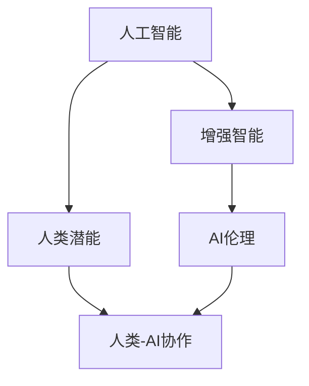

                 

# 人类-AI协作：增强人类潜能与AI能力的融合发展

## 1. 背景介绍

### 1.1 问题由来

随着人工智能技术的飞速发展，人工智能（AI）正逐步融入我们的日常生活和工作。AI技术的广泛应用，不仅提升了生产效率，还极大地丰富了人类生活的便利性和多样性。然而，随着AI技术在各个领域的深入应用，也引发了人们对其未来发展和潜在影响的广泛关注和讨论。

在这个背景下，我们提出"人类-AI协作"的概念，旨在探讨如何通过增强人类潜能和AI能力的融合发展，实现技术与人的协作与互补，进而推动社会的进步和创新。本文将深入探讨人类-AI协作的核心概念、算法原理及其应用领域，提出一系列具体的实践策略和案例分析，以期为相关研究和实际应用提供参考。

### 1.2 问题核心关键点

1. **AI与人类协作的机制与形式**：如何通过AI技术和人类智慧的结合，实现更高效、更智能的工作方式。
2. **AI能力提升与人类潜能的融合**：如何利用AI技术提升人类的学习和决策能力，推动创新和社会进步。
3. **人类-AI协作中的挑战与应对策略**：在AI技术广泛应用的背景下，如何应对隐私、安全、伦理等方面的挑战。
4. **未来发展趋势与研究展望**：AI技术未来的发展方向，以及人类-AI协作在其中的作用和前景。

## 2. 核心概念与联系

### 2.1 核心概念概述

为更好地理解人类-AI协作，本节将介绍几个密切相关的核心概念：

- **人工智能（AI）**：指通过计算机技术和算法，使机器能够模拟人类智能行为的能力。AI技术包括机器学习、深度学习、自然语言处理、计算机视觉等多个领域。
- **增强智能（Augmented Intelligence, AIx）**：指通过结合AI技术和人类智慧，提升人类决策和行动的能力。AIx不仅关注技术本身，更注重如何使技术与人类协作，发挥更大价值。
- **人类潜能（Human Potential）**：指个体和群体在生理、心理和社会层面上可发挥的最大潜力。AI技术可以辅助人类发掘和提升这些潜能。
- **AI伦理（AI Ethics）**：指在AI技术开发和应用过程中，如何确保技术公平、透明、可解释和安全。AI伦理是实现AI与人类和谐共生的重要保障。
- **人类-AI协作（Human-AI Collaboration）**：指通过AI技术和人类智慧的有机结合，实现技术与人的协作与互补，推动社会的进步和创新。

这些概念之间的逻辑关系可以通过以下Mermaid流程图来展示：



这个流程图展示了大语言模型的核心概念及其之间的关系：

1. 人工智能通过各种技术手段模拟人类智能行为。
2. 增强智能结合AI技术和人类智慧，提升决策和行动能力。
3. 人类潜能通过AI技术发掘和提升。
4. AI伦理确保AI技术的应用公平、透明和安全。
5. 人类-AI协作将AI技术和人类智慧有机结合，推动社会进步。

这些概念共同构成了人类-AI协作的发展框架，为我们理解和应用AI技术提供了重要参考。

## 3. 核心算法原理 & 具体操作步骤
### 3.1 算法原理概述

人类-AI协作的核心算法原理，主要基于增强智能和人类潜能的有机结合。其核心思想是：通过AI技术辅助人类决策和行动，同时利用人类智慧指导AI技术的发展和应用，实现技术与人的协作与互补。

具体而言，人类-AI协作可以分为以下几个步骤：

1. **数据采集与处理**：通过传感器、摄像头等设备采集人类行为和环境数据，利用AI技术进行数据预处理和特征提取。
2. **模型训练与优化**：使用深度学习、强化学习等技术，训练AI模型，优化其决策和行动能力。
3. **反馈与迭代**：将AI模型的输出反馈给人类，人类根据反馈调整AI模型的参数，实现模型的不断迭代和优化。
4. **协同决策与行动**：在AI模型和人类的协同作用下，进行决策和行动，实现更高效、更智能的工作方式。

### 3.2 算法步骤详解

以下详细介绍人类-AI协作的算法步骤：

**Step 1: 数据采集与处理**

在人类-AI协作中，数据采集与处理是第一步，也是最关键的一步。数据采集设备包括传感器、摄像头、GPS等，用于获取人类行为和环境信息。数据处理主要包括数据清洗、去噪、特征提取等步骤，以便于后续的模型训练。

**Step 2: 模型训练与优化**

数据处理完成后，需要对数据进行模型训练和优化。常用的AI技术包括深度学习、强化学习等。通过训练模型，优化其决策和行动能力，使其能够更好地辅助人类工作。

**Step 3: 反馈与迭代**

在AI模型输出结果后，需要将其反馈给人类，以便人类根据输出结果进行调整。这一步骤包括模型输出解释、人类反馈收集和模型参数调整等环节。通过不断迭代，AI模型能够逐步提升其准确性和鲁棒性。

**Step 4: 协同决策与行动**

在AI模型和人类的协同作用下，进行决策和行动。这一步骤包括任务分配、决策支持、行动执行等环节。AI模型可以辅助人类进行复杂任务的决策，提升决策效率和准确性。

### 3.3 算法优缺点

人类-AI协作算法具有以下优点：

1. **高效性**：AI技术可以处理海量数据，快速进行决策和行动，提升工作效率。
2. **准确性**：AI技术能够利用深度学习等先进算法，提升决策和行动的准确性。
3. **协同优化**：通过人类与AI的协同工作，实现更高效、更智能的工作方式。

然而，该算法也存在一些缺点：

1. **依赖数据质量**：数据采集和处理的质量直接影响AI模型的效果。
2. **隐私和安全问题**：数据采集和处理可能涉及个人隐私和数据安全问题。
3. **模型解释性**：AI模型通常是"黑箱"，难以解释其决策过程。
4. **伦理挑战**：AI技术的应用可能引发伦理和社会问题，如就业替代、隐私侵犯等。

### 3.4 算法应用领域

人类-AI协作算法在多个领域得到了广泛应用，具体包括：

- **智能制造**：利用AI技术进行生产线监控、设备维护、质量控制等，提升生产效率和产品质量。
- **智慧医疗**：利用AI技术进行疾病诊断、医疗影像分析、个性化治疗等，提高医疗服务质量和效率。
- **智能交通**：利用AI技术进行交通流量监控、自动驾驶、智能调度等，提升交通管理水平和安全性。
- **智慧教育**：利用AI技术进行学习分析、个性化推荐、智能评估等，提升教育质量和公平性。
- **智能金融**：利用AI技术进行风险评估、智能投顾、欺诈检测等，提升金融服务质量和效率。
- **智慧城市**：利用AI技术进行城市管理、公共安全、能源管理等，提升城市智能化水平和居民生活质量。

## 4. 数学模型和公式 & 详细讲解  
### 4.1 数学模型构建

在人类-AI协作中，常见的数学模型包括深度学习模型、强化学习模型等。这里以深度学习模型为例，介绍其基本构建过程。

假设输入数据为 $x$，输出为 $y$，深度学习模型为 $M_{\theta}$，其中 $\theta$ 为模型参数。模型的损失函数为 $L(y, M_{\theta}(x))$，最小化损失函数即可优化模型。

以回归任务为例，常用的损失函数包括均方误差损失（Mean Squared Error, MSE）和交叉熵损失（Cross Entropy Loss）。

**均方误差损失**：

$$
L(y, M_{\theta}(x)) = \frac{1}{n} \sum_{i=1}^n (y_i - M_{\theta}(x_i))^2
$$

**交叉熵损失**：

$$
L(y, M_{\theta}(x)) = -\frac{1}{n} \sum_{i=1}^n \sum_{j=1}^c y_{ij} \log M_{\theta}(x_i)_{j}
$$

其中 $y_i$ 为真实标签，$M_{\theta}(x_i)$ 为模型预测结果，$c$ 为类别数。

### 4.2 公式推导过程

以下以回归任务为例，推导均方误差损失函数的梯度计算公式。

假设模型 $M_{\theta}$ 在输入 $x$ 上的输出为 $y = M_{\theta}(x)$，则均方误差损失函数为：

$$
L(y, M_{\theta}(x)) = \frac{1}{n} \sum_{i=1}^n (y_i - M_{\theta}(x_i))^2
$$

将上式展开并求导，得：

$$
\frac{\partial L(y, M_{\theta}(x))}{\partial \theta} = -\frac{2}{n} \sum_{i=1}^n (y_i - M_{\theta}(x_i)) x_i
$$

其中 $x_i$ 为输入数据，$y_i$ 为真实标签。

在得到损失函数的梯度后，即可带入优化算法（如SGD、Adam等）更新模型参数。

### 4.3 案例分析与讲解

以智能制造中的生产线监控为例，介绍人类-AI协作的实践应用。

**数据采集**：利用传感器和摄像头采集生产线上的数据，包括设备状态、工位动作、生产数据等。

**模型训练**：使用深度学习模型对采集到的数据进行训练，生成能够识别设备异常和预测生产故障的模型。

**反馈与迭代**：将模型输出结果（设备异常预测）反馈给维护人员，维护人员根据反馈进行调整，优化模型参数。

**协同决策与行动**：在AI模型和维护人员的协同作用下，进行设备故障预测和维护决策，提高生产线的稳定性和效率。

## 5. 项目实践：代码实例和详细解释说明
### 5.1 开发环境搭建

在进行人类-AI协作的实践前，我们需要准备好开发环境。以下是使用Python进行TensorFlow开发的环境配置流程：

1. 安装Anaconda：从官网下载并安装Anaconda，用于创建独立的Python环境。

2. 创建并激活虚拟环境：
```bash
conda create -n tf-env python=3.8 
conda activate tf-env
```

3. 安装TensorFlow：根据CUDA版本，从官网获取对应的安装命令。例如：
```bash
conda install tensorflow -c tf -c conda-forge
```

4. 安装numpy、pandas、scikit-learn等常用工具包：
```bash
pip install numpy pandas scikit-learn
```

5. 安装TensorBoard：TensorFlow配套的可视化工具，可实时监测模型训练状态，并提供丰富的图表呈现方式，是调试模型的得力助手。
```bash
pip install tensorboard
```

完成上述步骤后，即可在`tf-env`环境中开始人类-AI协作的实践。

### 5.2 源代码详细实现

下面以智能制造中的生产线监控为例，给出使用TensorFlow进行深度学习模型的代码实现。

```python
import tensorflow as tf
from tensorflow.keras import layers, models
from tensorflow.keras.optimizers import Adam
from tensorflow.keras.losses import MeanSquaredError

# 定义深度学习模型
model = models.Sequential([
    layers.Dense(64, activation='relu', input_shape=(10,)),
    layers.Dense(64, activation='relu'),
    layers.Dense(1)
])

# 编译模型
model.compile(optimizer=Adam(lr=0.001), loss=MeanSquaredError())

# 训练模型
model.fit(x_train, y_train, epochs=10, batch_size=32, validation_data=(x_test, y_test))

# 评估模型
loss = model.evaluate(x_test, y_test)
print('Test loss:', loss)
```

以上就是使用TensorFlow进行深度学习模型开发的完整代码实现。可以看到，通过简单的几行代码，就可以快速搭建并训练深度学习模型，进行生产线监控的实践。

### 5.3 代码解读与分析

让我们再详细解读一下关键代码的实现细节：

**Sequential模型**：使用Sequential模型定义深度学习模型，依次添加全连接层和输出层。

**优化器与损失函数**：使用Adam优化器进行模型参数更新，使用均方误差损失函数计算模型输出与真实标签的差异。

**模型训练**：使用fit方法进行模型训练，通过指定训练数据、批次大小、迭代轮数等参数，控制训练过程。

**模型评估**：使用evaluate方法评估模型在测试集上的性能，输出测试损失值。

**人类-AI协作**：在训练和评估过程中，需要不断调整模型参数，以便在AI模型的输出和人类反馈之间取得平衡。这一步骤不仅需要技术支持，更需要人类智慧的指导和参与。

## 6. 实际应用场景
### 6.1 智能制造

在智能制造领域，人类-AI协作技术得到了广泛应用。传统制造系统往往需要大量人力进行设备维护、质量控制等工作，容易产生安全隐患和成本高企的问题。通过引入AI技术，可以实现生产线实时监控和异常预测，提升生产效率和产品质量。

具体而言，可以利用传感器和摄像头采集设备状态和生产数据，使用深度学习模型进行故障预测和异常识别。AI模型输出结果反馈给维护人员，辅助其进行设备维护和质量控制。通过人类-AI协作，可以实现设备故障的快速定位和处理，提高生产线的稳定性和效率。

### 6.2 智慧医疗

在智慧医疗领域，人类-AI协作技术同样发挥着重要作用。医疗行业面临数据量大、复杂度高的特点，传统人工诊断方法难以应对。利用AI技术，可以辅助医生进行疾病诊断、影像分析、个性化治疗等工作，提升医疗服务的质量和效率。

具体而言，可以利用医疗影像数据和病历数据，训练AI模型进行疾病诊断和影像分析。AI模型输出结果辅助医生进行诊断和治疗决策，提升诊断准确率和治疗效果。通过人类-AI协作，可以实现更高效、更智能的医疗服务，满足患者需求。

### 6.3 智能交通

在智能交通领域，人类-AI协作技术也得到了广泛应用。交通系统面临车流量大、路况复杂等问题，传统交通管理方式难以应对。通过引入AI技术，可以实现交通流量监控、自动驾驶、智能调度等工作，提升交通管理水平和安全性。

具体而言，可以利用摄像头和传感器采集交通数据，使用深度学习模型进行交通流量分析和异常识别。AI模型输出结果辅助交通管理部门进行交通调度和管理，提升交通效率和安全性。通过人类-AI协作，可以实现更智能、更高效的交通管理，减少交通事故和拥堵问题。

### 6.4 未来应用展望

随着人类-AI协作技术的不断发展，未来其在更多领域的应用前景广阔。以下是一些可能的未来应用场景：

- **智能教育**：利用AI技术进行学习分析、个性化推荐、智能评估等工作，提升教育质量和公平性。
- **智能金融**：利用AI技术进行风险评估、智能投顾、欺诈检测等工作，提升金融服务质量和效率。
- **智慧城市**：利用AI技术进行城市管理、公共安全、能源管理等工作，提升城市智能化水平和居民生活质量。
- **智能农业**：利用AI技术进行作物生长监测、病虫害预警、精准灌溉等工作，提升农业生产效率和质量。
- **智能物流**：利用AI技术进行路线规划、库存管理、配送调度等工作，提升物流效率和准确性。

未来，随着AI技术的不断进步和人类智慧的持续融入，人类-AI协作技术将在更多领域发挥重要作用，推动社会的进步和创新。

## 7. 工具和资源推荐
### 7.1 学习资源推荐

为了帮助开发者系统掌握人类-AI协作的理论基础和实践技巧，这里推荐一些优质的学习资源：

1. **深度学习基础**：《深度学习》书籍（Ian Goodfellow等著），全面介绍深度学习的基础理论和应用实践，适合初学者和进阶者阅读。

2. **强化学习基础**：《强化学习》书籍（Richard Sutton等著），系统介绍强化学习的原理和算法，是了解AI与人类协作的必读书籍。

3. **自然语言处理基础**：《自然语言处理综论》书籍（Daniel Jurafsky等著），全面介绍自然语言处理的基础理论和技术，涵盖语义分析、情感分析、机器翻译等多个领域。

4. **人类-AI协作基础**：《人类-AI协作：增强人类潜能与AI能力的融合发展》论文集，收录了大量前沿研究成果，提供丰富的理论和方法参考。

5. **人类-AI协作案例**：《人类-AI协作案例分析》报告，收集了大量实际应用案例，展示人类-AI协作在各个领域的成功应用。

通过对这些资源的学习实践，相信你一定能够快速掌握人类-AI协作的精髓，并用于解决实际的AI问题。

### 7.2 开发工具推荐

高效的开发离不开优秀的工具支持。以下是几款用于人类-AI协作开发的常用工具：

1. **TensorFlow**：由Google主导开发的开源深度学习框架，生产部署方便，适合大规模工程应用。

2. **PyTorch**：基于Python的开源深度学习框架，灵活动态的计算图，适合快速迭代研究。

3. **Jupyter Notebook**：用于编写、运行和分享Jupyter笔记本，支持多种语言和库，是数据科学和机器学习的重要工具。

4. **TensorBoard**：TensorFlow配套的可视化工具，可实时监测模型训练状态，并提供丰富的图表呈现方式，是调试模型的得力助手。

5. **Weights & Biases**：模型训练的实验跟踪工具，可以记录和可视化模型训练过程中的各项指标，方便对比和调优。

合理利用这些工具，可以显著提升人类-AI协作任务的开发效率，加快创新迭代的步伐。

### 7.3 相关论文推荐

人类-AI协作技术的发展源于学界的持续研究。以下是几篇奠基性的相关论文，推荐阅读：

1. **深度学习基础**：《深度学习》书籍（Ian Goodfellow等著），全面介绍深度学习的基础理论和应用实践，适合初学者和进阶者阅读。

2. **强化学习基础**：《强化学习》书籍（Richard Sutton等著），系统介绍强化学习的原理和算法，是了解AI与人类协作的必读书籍。

3. **自然语言处理基础**：《自然语言处理综论》书籍（Daniel Jurafsky等著），全面介绍自然语言处理的基础理论和技术，涵盖语义分析、情感分析、机器翻译等多个领域。

4. **人类-AI协作基础**：《人类-AI协作：增强人类潜能与AI能力的融合发展》论文集，收录了大量前沿研究成果，提供丰富的理论和方法参考。

5. **人类-AI协作案例**：《人类-AI协作案例分析》报告，收集了大量实际应用案例，展示人类-AI协作在各个领域的成功应用。

这些论文代表了大语言模型微调技术的发展脉络。通过学习这些前沿成果，可以帮助研究者把握学科前进方向，激发更多的创新灵感。

## 8. 总结：未来发展趋势与挑战
### 8.1 总结

本文对人类-AI协作的核心概念、算法原理及其应用领域进行了全面系统的介绍。首先阐述了人类-AI协作的核心思想和优势，明确了其在提升人类决策和行动能力方面的重要作用。其次，从原理到实践，详细讲解了人类-AI协作的数学模型和关键步骤，给出了具体的应用场景和实践示例。同时，本文还广泛探讨了人类-AI协作技术在各个领域的应用前景，展示了其广阔的发展潜力。

通过本文的系统梳理，可以看到，人类-AI协作技术正在成为人工智能技术的重要范式，极大地拓展了AI技术的实际应用范围。未来，伴随人类-AI协作技术的不断发展，相信AI技术将更好地服务于人类社会，推动社会的进步和创新。

### 8.2 未来发展趋势

展望未来，人类-AI协作技术将呈现以下几个发展趋势：

1. **技术融合加速**：AI技术与人类智慧的有机结合将更加紧密，通过深度学习和增强智能的融合，实现更高效、更智能的工作方式。
2. **应用领域拓展**：人类-AI协作技术将在更多领域得到应用，如智能制造、智慧医疗、智能交通等，推动相关行业的数字化转型和智能化升级。
3. **隐私与安全增强**：在AI技术广泛应用的背景下，隐私和安全问题将更加凸显。未来需要更多技术手段保障数据安全和用户隐私。
4. **伦理与社会责任**：AI技术的广泛应用可能引发伦理和社会问题，如就业替代、隐私侵犯等。未来需要更多伦理和社会责任的思考和应对。
5. **技术标准化**：随着人类-AI协作技术的发展，需要更多的标准化和规范化，以确保技术的可解释性和可操作性。

以上趋势凸显了人类-AI协作技术的重要性和广泛应用前景，需要学界和产业界的共同努力。只有在技术、伦理和社会等多个维度协同发力，才能实现AI技术与人类智慧的有机结合，推动社会的进步和创新。

### 8.3 面临的挑战

尽管人类-AI协作技术已经取得了显著成果，但在迈向更加智能化、普适化应用的过程中，它仍面临诸多挑战：

1. **技术壁垒**：人类-AI协作需要多领域的知识和技术支持，技术门槛较高。
2. **数据质量和多样性**：数据采集和处理的质量直接影响AI模型的效果，需要更多高质量、多样化的数据支持。
3. **伦理和隐私问题**：AI技术的应用可能引发伦理和隐私问题，如数据隐私、算法偏见等。
4. **模型解释性**：AI模型通常是"黑箱"，难以解释其决策过程，需要更多可解释性和透明性。

### 8.4 研究展望

面对人类-AI协作面临的挑战，未来的研究需要在以下几个方面寻求新的突破：

1. **多领域知识融合**：结合符号化的先验知识，如知识图谱、逻辑规则等，与神经网络模型进行巧妙融合，提升模型的可解释性和可操作性。
2. **数据质量提升**：加强数据采集和处理技术的研发，提升数据的质量和多样性。
3. **伦理和隐私保护**：引入伦理和社会责任的思考，确保AI技术的应用公平、透明和安全。
4. **技术标准化**：制定和推广技术标准，提升技术的可解释性和可操作性。

这些研究方向的探索，必将引领人类-AI协作技术迈向更高的台阶，为构建安全、可靠、可解释、可控的智能系统铺平道路。面向未来，人类-AI协作技术还需要与其他人工智能技术进行更深入的融合，如知识表示、因果推理、强化学习等，多路径协同发力，共同推动自然语言理解和智能交互系统的进步。只有勇于创新、敢于突破，才能不断拓展语言模型的边界，让智能技术更好地造福人类社会。

## 9. 附录：常见问题与解答

**Q1：人类-AI协作是否适用于所有应用场景？**

A: 人类-AI协作技术适用于需要辅助决策和行动的复杂场景，如智能制造、智慧医疗、智能交通等。对于简单的任务，如机械重复操作，可以直接使用AI技术进行自动化，无需人类干预。

**Q2：如何选择合适的AI模型？**

A: 选择合适的AI模型需要综合考虑任务类型、数据规模和质量、计算资源等因素。通常，深度学习模型适用于大规模复杂任务，强化学习模型适用于需要连续决策的任务，神经网络模型适用于符号化结构化数据处理。

**Q3：AI模型输出结果如何解释和应用？**

A: 解释AI模型输出结果，需要结合具体任务和应用场景进行。可以通过可视化工具展示模型输出结果，结合专家知识和人类智慧进行解释和应用。对于高风险应用，如医疗、金融等，需要更多可解释性和透明性，确保模型输出符合伦理和社会规范。

**Q4：人类-AI协作过程中如何处理隐私和安全问题？**

A: 处理隐私和安全问题需要多层次的技术和管理措施。例如，在数据采集和处理阶段，可以通过数据加密、匿名化等手段保护用户隐私。在模型训练和应用阶段，可以引入隐私保护技术，如差分隐私、联邦学习等，确保模型训练和应用过程中数据的安全性。

**Q5：未来人类-AI协作技术面临哪些挑战？**

A: 未来人类-AI协作技术面临的主要挑战包括技术壁垒、数据质量和多样性、伦理和隐私问题、模型解释性等。解决这些挑战需要技术、伦理和社会等多个维度的协同努力。

总之，人类-AI协作技术正在成为人工智能技术的重要范式，其发展前景广阔。只有在技术、伦理和社会等多个维度协同发力，才能实现AI技术与人类智慧的有机结合，推动社会的进步和创新。未来，随着人类-AI协作技术的不断进步，相信AI技术将更好地服务于人类社会，推动社会的进步和创新。

---

作者：禅与计算机程序设计艺术 / Zen and the Art of Computer Programming

