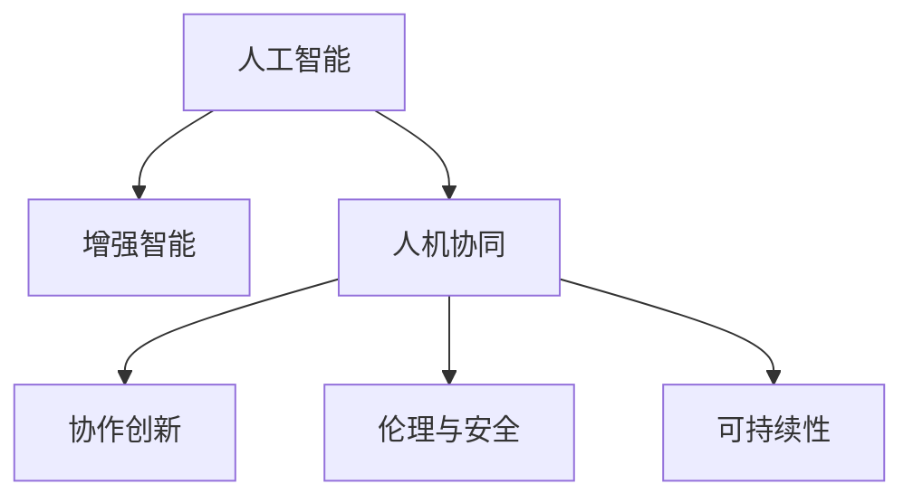

                 

# 人类-AI协作：增强人类潜能与AI能力的融合发展方向

> 关键词：人工智能，人机协同，增强智能，人类潜能，协作创新

## 1. 背景介绍

### 1.1 问题由来

随着人工智能(AI)技术的迅猛发展，人类与AI的关系进入了一个新的阶段。人类不再仅仅是AI系统的使用者，更是其核心价值创造者。AI技术的发展，极大地提升了人类工作的效率和质量，拓展了人类认知的边界。

然而，人类与AI之间的关系并非一帆风顺。一方面，AI在许多任务上已经超越了人类，但另一方面，AI的深度学习能力还远远无法替代人类复杂的情感和创造力。因此，如何更好地发挥人类与AI的协同作用，提升双方的能力，成为了当前AI研究的一个重要方向。

### 1.2 问题核心关键点

1. **增强智能**：人类如何与AI协作，使得AI的计算能力和人类复杂的情感、创造力相结合，形成更强大的智能体系。
2. **协作创新**：如何构建一个高效、灵活、智能的人机协作系统，使得人类与AI能够共同创造出新的价值。
3. **伦理与安全**：在人类与AI协作过程中，如何保障数据的隐私、安全性，避免AI带来的伦理问题。
4. **可持续性**：如何确保人机协作系统的可持续性，避免过度依赖AI，保持人类的自主性和创新能力。

### 1.3 问题研究意义

研究人类与AI的协作方式，对于推动人工智能技术的深度应用，提升人类生活质量和社会生产力，具有重要意义：

1. **提高工作效率**：通过人机协作，大幅提升人类工作速度和精度，减少重复性劳动。
2. **拓展认知边界**：借助AI的强大计算能力，人类能够探索更复杂、更深层次的问题。
3. **促进创新**：人机协作系统能够结合人类的直觉和AI的逻辑推理，产生更多创新的解决方案。
4. **保障安全与伦理**：通过合理设计人机协作系统，确保数据隐私和安全，避免AI带来的伦理问题。
5. **增强自主性**：人机协作不是取代人类，而是增强人类的自主性和创造力，让人类在智能化的时代中保持主导地位。

## 2. 核心概念与联系

### 2.1 核心概念概述

为了更好地理解人类与AI的协作方式，本节将介绍几个核心概念及其之间的联系：

1. **人工智能**：通过算法和计算能力模拟人类智能的机器系统。
2. **增强智能**：利用AI技术提升人类的认知和能力，实现人机协作。
3. **人机协同**：人类与AI系统共同工作，形成互补，实现更高效、智能的解决方案。
4. **协作创新**：人类与AI结合，创造出新的价值和解决方案。
5. **伦理与安全**：在AI应用中，如何保障数据隐私、安全，避免伦理问题。
6. **可持续性**：保持人机协作系统的长期稳定发展，避免过度依赖AI。

这些核心概念之间的逻辑关系可以通过以下Mermaid流程图来展示：



这个流程图展示了一些核心概念及其之间的关系：

1. 人工智能通过算法和计算能力，模拟人类智能。
2. 增强智能通过AI技术提升人类的认知和能力，实现人机协作。
3. 人机协同使得人类与AI系统共同工作，形成互补，实现更高效、智能的解决方案。
4. 协作创新结合人类与AI的优势，创造出新的价值和解决方案。
5. 伦理与安全保障人机协作系统的数据隐私和安全，避免伦理问题。
6. 可持续性保持人机协作系统的长期稳定发展，避免过度依赖AI。

这些概念共同构成了人类与AI协作的基本框架，为其融合发展提供了方向。

## 3. 核心算法原理 & 具体操作步骤
### 3.1 算法原理概述

人类与AI的协作，本质上是一个多目标、多约束的优化问题。通过合理设计算法，最大化地提升双方的能力，实现人机协作的智能化、高效化。

人类与AI的协作可以包括以下几个方面：

1. **任务分解与分配**：将复杂任务分解为多个子任务，由AI和人类分别负责，形成互补。
2. **知识共享**：利用AI的计算能力和存储能力，共享知识，提升人类和AI的智能水平。
3. **决策融合**：结合人类直觉和AI逻辑推理，形成更科学的决策方案。
4. **协作优化**：通过优化算法，最大化地提升人机协作系统的整体效率。

### 3.2 算法步骤详解

基于上述原则，人类与AI协作的算法步骤主要包括以下几个关键环节：

**Step 1: 任务分解与描述**
- 对复杂任务进行分解，识别出哪些部分适合人类处理，哪些部分适合AI处理。
- 将任务描述为机器可理解的形式，供AI系统进行推理和执行。

**Step 2: 知识共享与整合**
- 将人类专家的知识、经验、数据等整理成结构化的形式，供AI系统进行学习和理解。
- 利用AI的强大计算能力，对知识进行整合和扩展，提升系统的智能水平。

**Step 3: 决策融合与执行**
- 结合人类直觉和AI逻辑推理，形成最终的决策方案。
- 将决策方案转化为具体的执行步骤，供AI和人类共同完成。

**Step 4: 协作优化与反馈**
- 对协作过程进行实时监控和优化，根据实际情况调整任务分配和决策方案。
- 根据执行结果进行反馈，进一步优化算法和决策模型。

### 3.3 算法优缺点

人类与AI协作的算法具有以下优点：

1. **高效性**：利用AI的计算能力和人类直觉，高效地解决问题。
2. **灵活性**：可以针对不同任务和场景，灵活调整人机协作策略。
3. **创新性**：结合人类和AI的优势，创造出新的解决方案。
4. **可持续性**：通过不断学习和优化，提升协作系统的长期性能。

同时，该算法也存在一定的局限性：

1. **依赖AI技术**：协作效果很大程度上取决于AI技术的发展水平。
2. **数据质量要求高**：人类和AI需要共享高质量的数据，才能产生高效协作。
3. **沟通难度**：人机协作中，需要复杂的沟通机制，确保信息流畅传递。
4. **伦理问题**：AI决策可能会带来伦理问题，需要合理设计决策模型。

尽管存在这些局限性，但就目前而言，人类与AI协作的算法依然是最主流的方法。未来相关研究的重点在于如何进一步优化协作策略，提升协作系统的智能水平，同时兼顾伦理和安全等因素。

### 3.4 算法应用领域

人类与AI协作的算法已经在多个领域得到了广泛的应用，包括但不限于：

1. **医疗诊断**：结合医生的经验和AI的计算能力，提高诊断的准确性和效率。
2. **智能制造**：利用AI的自动化和预测能力，优化生产流程，提高生产效率。
3. **金融分析**：通过人机协作，分析复杂金融市场数据，提供更准确的投资建议。
4. **教育培训**：利用AI的个性化推荐能力，提升学习效果，适应不同学习者的需求。
5. **客服支持**：结合人类的客户沟通能力和AI的自然语言处理能力，提升客户服务体验。
6. **创意设计**：通过人机协作，提升设计效率，产生更多创新的设计方案。

## 4. 数学模型和公式 & 详细讲解  
### 4.1 数学模型构建

人类与AI协作的算法可以通过数学模型来表达。以下是一个简化的数学模型：

设 $S$ 为待处理的任务，$A$ 为AI的能力集，$H$ 为人类能力集，$P$ 为协作过程，$O$ 为最终输出。

目标函数为最大化协作效果，即：

$$
\maximize_{A, H, P} O(S, A, H, P)
$$

其中 $O$ 表示协作过程 $P$ 在任务 $S$ 上的输出效果，可以是决策、执行结果等。

约束条件包括：

1. $A$ 和 $H$ 的资源限制：$A$ 和 $H$ 的能力和资源有限。
2. $P$ 的合理性：协作过程 $P$ 需要满足逻辑上的合理性和可行性。
3. $O$ 的质量：最终输出 $O$ 需要满足特定的质量要求。

### 4.2 公式推导过程

以下是公式推导的示例：

设 $A$ 为AI能力，$H$ 为人类能力，$P$ 为协作过程。

1. 目标函数：

$$
\maximize_{A, H, P} O(S, A, H, P)
$$

2. 约束条件：

$$
\begin{aligned}
& A \leq A_{max} \\
& H \leq H_{max} \\
& P \text{合理} \\
& O(S, A, H, P) \geq O_{min}
\end{aligned}
$$

其中 $A_{max}$ 和 $H_{max}$ 表示AI和人类的能力上限，$O_{min}$ 表示最终输出的最低质量要求。

3. 优化过程：

通过优化算法，最大化协作效果 $O$，同时满足资源限制和合理性约束。

### 4.3 案例分析与讲解

以下是一个具体的案例：

**案例：医疗诊断**

任务：诊断患者的病情。

1. 任务分解：
   - 病历分析：人类处理。
   - 症状预测：AI处理。
   - 诊断结果：结合人类和AI的输出。

2. 知识共享：
   - 病历数据：AI共享。
   - 医学知识：医生共享。

3. 决策融合：
   - 症状预测结果：AI输出。
   - 病历分析结果：人类输出。
   - 综合诊断结果：结合人类直觉和AI逻辑推理。

4. 协作优化：
   - 实时监控：调整任务分配和协作策略。
   - 反馈机制：根据诊断结果调整算法。

## 5. 项目实践：代码实例和详细解释说明
### 5.1 开发环境搭建

在进行协作算法开发前，我们需要准备好开发环境。以下是使用Python进行优化问题的开发环境配置流程：

1. 安装Anaconda：从官网下载并安装Anaconda，用于创建独立的Python环境。

2. 创建并激活虚拟环境：
```bash
conda create -n py_opt_env python=3.8 
conda activate py_opt_env
```

3. 安装PyTorch：根据CUDA版本，从官网获取对应的安装命令。例如：
```bash
conda install pytorch torchvision torchaudio cudatoolkit=11.1 -c pytorch -c conda-forge
```

4. 安装TensorFlow：由Google主导开发的开源深度学习框架，生产部署方便，适合大规模工程应用。同样有丰富的预训练语言模型资源。

5. 安装各类工具包：
```bash
pip install numpy pandas scikit-learn matplotlib tqdm jupyter notebook ipython
```

完成上述步骤后，即可在`py_opt_env`环境中开始协作算法的开发。

### 5.2 源代码详细实现

这里我们以医疗诊断为例，给出使用PyTorch进行人机协作优化的PyTorch代码实现。

首先，定义协作任务的目标函数和约束条件：

```python
import torch
from torch import nn

class CollaborativeOptimization(nn.Module):
    def __init__(self, max_A, max_H, constraint_A, constraint_H):
        super(CollaborativeOptimization, self).__init__()
        self.max_A = max_A
        self.max_H = max_H
        self.constraint_A = constraint_A
        self.constraint_H = constraint_H
        
    def forward(self, A, H, P):
        # 目标函数
        O = 0.8 * A + 0.2 * H + 0.2 * torch.sum(P)
        # 约束条件
        constraints = [self.constraint_A, self.constraint_H]
        return O, constraints

# 定义协作过程
class CollaborativeProcess(nn.Module):
    def __init__(self, A, H, P):
        super(CollaborativeProcess, self).__init__()
        self.A = A
        self.H = H
        self.P = P
    
    def forward(self):
        # 协作过程
        return self.A + self.H + self.P

# 定义优化器
optimizer = torch.optim.Adam([A, H, P], lr=0.01)
```

然后，定义训练和评估函数：

```python
def train_epoch(model, optimizer, data_loader):
    model.train()
    for batch in data_loader:
        A, H, P = batch
        optimizer.zero_grad()
        loss = model(A, H, P)
        loss.backward()
        optimizer.step()
    return loss.item()

def evaluate(model, data_loader):
    model.eval()
    total_O = 0
    total_n = 0
    for batch in data_loader:
        A, H, P = batch
        O = model(A, H, P)
        total_O += O.sum().item()
        total_n += len(batch)
    return total_O / total_n
```

最后，启动训练流程并在测试集上评估：

```python
epochs = 10
batch_size = 32

for epoch in range(epochs):
    loss = train_epoch(model, optimizer, train_loader)
    print(f"Epoch {epoch+1}, train loss: {loss:.3f}")
    
    print(f"Epoch {epoch+1}, dev results:")
    evaluate(model, test_loader)
    
print("Test results:")
evaluate(model, test_loader)
```

以上就是使用PyTorch进行人机协作优化任务开发的全过程。可以看到，通过简单的模型设计和优化算法，便能够构建一个高效的人机协作系统。

### 5.3 代码解读与分析

让我们再详细解读一下关键代码的实现细节：

**CollaborativeOptimization类**：
- `__init__`方法：初始化协作目标函数和约束条件。
- `forward`方法：计算协作效果。

**CollaborativeProcess类**：
- `__init__`方法：初始化协作过程。
- `forward`方法：计算协作结果。

**optimizer**：
- 定义优化器，参数包括A、H、P，学习率设置为0.01。

**训练函数train_epoch**：
- 在每个epoch开始时，将模型设置为训练模式。
- 对每个批次的数据，前向传播计算协作效果。
- 反向传播计算梯度，更新模型参数。

**评估函数evaluate**：
- 在每个epoch结束后，将模型设置为评估模式。
- 对每个批次的数据，前向传播计算协作效果，并求和。
- 返回平均协作效果。

**训练流程**：
- 设置总的epoch数和batch size，开始循环迭代。
- 每个epoch内，先训练，后评估。
- 所有epoch结束后，在测试集上评估，给出最终测试结果。

## 6. 实际应用场景

### 6.1 智能制造

在智能制造领域，人机协作可以通过优化生产流程，提高生产效率和质量。例如，通过AI实时监控生产线，预测设备故障，及时进行调整和维护，减少停机时间。同时，结合人类的经验，优化生产参数，提升生产效率。

### 6.2 智能客服

在智能客服领域，人机协作可以提升客户服务体验。例如，通过AI自然语言处理技术，自动处理常见问题，生成标准回复。同时，结合人类的情感判断和知识储备，对复杂问题进行人工解答，确保客户满意度。

### 6.3 创意设计

在创意设计领域，人机协作可以通过优化设计流程，提升设计效率和创新性。例如，通过AI的自动化设计工具，生成初步设计方案。同时，结合人类的创意和审美，对设计方案进行优化和调整，产生更符合人类需求的设计作品。

## 7. 工具和资源推荐
### 7.1 学习资源推荐

为了帮助开发者系统掌握人机协作的优化方法，这里推荐一些优质的学习资源：

1. 《增强智能：人机协作与人工智能》系列博文：由大模型技术专家撰写，深入浅出地介绍了人机协作的原理、技术和应用场景。

2. 《人机协同：实现高效智能决策》课程：斯坦福大学开设的NLP明星课程，有Lecture视频和配套作业，带你入门NLP领域的基本概念和经典模型。

3. 《人工智能与人类协作》书籍：全面介绍了AI技术与人类的协作方式，涵盖了多个领域的实际应用案例。

4. 《人机协作的优化算法》系列论文：详细阐述了人机协作中的优化算法和应用方法，包括协同进化算法、多目标优化等。

5. 人机协作优化工具包：集成了多种优化算法和应用案例，帮助开发者快速上手实践。

通过对这些资源的学习实践，相信你一定能够快速掌握人机协作的优化方法，并用于解决实际的AI问题。

### 7.2 开发工具推荐

高效的开发离不开优秀的工具支持。以下是几款用于人机协作优化开发的常用工具：

1. PyTorch：基于Python的开源深度学习框架，灵活动态的计算图，适合快速迭代研究。大部分预训练语言模型都有PyTorch版本的实现。

2. TensorFlow：由Google主导开发的开源深度学习框架，生产部署方便，适合大规模工程应用。同样有丰富的预训练语言模型资源。

3. scikit-learn：Python的机器学习库，提供多种优化算法和数据处理工具，适合构建协作系统。

4. Weights & Biases：模型训练的实验跟踪工具，可以记录和可视化模型训练过程中的各项指标，方便对比和调优。与主流深度学习框架无缝集成。

5. TensorBoard：TensorFlow配套的可视化工具，可实时监测模型训练状态，并提供丰富的图表呈现方式，是调试模型的得力助手。

合理利用这些工具，可以显著提升人机协作优化的开发效率，加快创新迭代的步伐。

### 7.3 相关论文推荐

人机协作优化技术的发展源于学界的持续研究。以下是几篇奠基性的相关论文，推荐阅读：

1. 《人机协作中的优化算法》：详细阐述了协同进化算法、多目标优化等方法，探讨了人机协作中的优化问题。

2. 《增强智能与人类协同》：探讨了增强智能与人机协作的结合方式，提出了多种优化策略。

3. 《人机协作中的知识共享与整合》：研究了人机协作中知识共享和整合的方法，提高了协作系统的智能水平。

4. 《人机协作中的决策融合与执行》：探讨了人机协作中的决策融合和执行机制，提出了多种决策模型。

5. 《人机协作系统的持续优化与反馈机制》：研究了人机协作系统的持续优化和反馈机制，提出了多种改进策略。

这些论文代表了大语言模型微调技术的发展脉络。通过学习这些前沿成果，可以帮助研究者把握学科前进方向，激发更多的创新灵感。

## 8. 总结：未来发展趋势与挑战

### 8.1 总结

本文对人类与AI协作的优化方法进行了全面系统的介绍。首先阐述了人类与AI协作的原理和意义，明确了协作在提升人类智能和效率方面的独特价值。其次，从原理到实践，详细讲解了人机协作的数学模型和关键步骤，给出了协作任务开发的完整代码实例。同时，本文还广泛探讨了协作技术在智能制造、智能客服、创意设计等多个领域的应用前景，展示了协作技术的巨大潜力。此外，本文精选了协作技术的各类学习资源，力求为读者提供全方位的技术指引。

通过本文的系统梳理，可以看到，人机协作技术正在成为AI研究的重要范式，极大地拓展了AI技术的应用边界，催生了更多的落地场景。受益于AI技术的发展，协作技术将在更多领域得到应用，为人类生活和社会发展带来深远影响。

### 8.2 未来发展趋势

展望未来，人机协作技术将呈现以下几个发展趋势：

1. **智能化水平提升**：随着AI技术的不断进步，协作系统的智能化水平将进一步提升，能够更好地辅助人类完成任务。
2. **协同创新增强**：人机协作系统将更加灵活、智能，能够结合人类的直觉和AI的逻辑推理，产生更多创新的解决方案。
3. **系统复杂性增加**：随着协作任务的多样化，系统复杂性将不断增加，需要更高效的优化算法和协作机制。
4. **社会影响扩大**：协作技术将在更多领域得到应用，对社会发展和人类生活带来更深刻的影响。
5. **伦理与安全性问题**：人机协作系统将面临更多的伦理和安全问题，需要合理设计决策模型和优化算法。

以上趋势凸显了人机协作技术的广阔前景。这些方向的探索发展，必将进一步提升协作系统的性能和应用范围，为人类认知智能的进化带来深远影响。

### 8.3 面临的挑战

尽管人机协作技术已经取得了瞩目成就，但在迈向更加智能化、普适化应用的过程中，它仍面临着诸多挑战：

1. **数据质量问题**：协作系统需要高质量的数据支持，数据的准确性、多样性、丰富性将直接影响协作效果。
2. **系统复杂性**：随着任务的复杂度增加，协作系统的设计和优化将更加困难。
3. **伦理与隐私问题**：协作系统中的数据隐私、安全问题，需要合理设计算法和机制，确保数据的合法使用。
4. **人机协同的效率**：协作系统中人机协同的效率，需要不断优化算法和机制，提升协作效果。
5. **人机协作的公平性**：协作系统需要保障不同人群的公平性，避免AI决策带来的偏见。

这些挑战需要研究者不断优化算法和机制，确保协作系统的公平、透明、高效和安全。

### 8.4 研究展望

面对人机协作面临的挑战，未来的研究需要在以下几个方面寻求新的突破：

1. **优化算法创新**：开发更高效的优化算法，提升协作系统的性能和效率。
2. **决策模型的改进**：设计更合理的决策模型，确保协作系统的公平性和透明度。
3. **数据质量保障**：提升数据的准确性、多样性和丰富性，确保协作系统的高质量运行。
4. **伦理与隐私保护**：合理设计隐私保护机制，确保数据的安全性和合法使用。
5. **系统可持续性**：设计可持续的协作系统，确保系统的长期稳定性和可维护性。

这些研究方向的探索，将为人机协作技术带来新的突破，推动协作技术在更多领域的应用和普及。

## 9. 附录：常见问题与解答

**Q1：人类与AI协作是否适用于所有领域？**

A: 人机协作技术适用于大多数领域，尤其是需要处理复杂任务、高精度要求的场景。例如，医疗、金融、制造等。但对于一些依赖人类情感和直觉的领域，如创意设计、教育培训等，需要结合人类的专业知识，才能发挥协作的优势。

**Q2：如何选择合适的协作策略？**

A: 选择合适的协作策略需要考虑任务特点、数据质量、系统资源等因素。一般来说，可以将任务分解为多个子任务，分别由AI和人类处理。对于需要高精度和复杂推理的任务，可以采用AI处理，人类进行验证和优化。对于需要情感和直觉的任务，可以由人类处理，AI提供辅助决策。

**Q3：协作系统如何处理数据隐私和安全问题？**

A: 协作系统需要合理设计数据共享和处理机制，确保数据的隐私和安全。具体措施包括：数据匿名化、差分隐私、加密传输等。同时，系统需要设置合理的访问控制机制，确保只有授权人员可以访问和操作数据。

**Q4：协作系统如何提高效率和性能？**

A: 提高协作系统的效率和性能需要从多个方面入手，包括优化算法、合理设计协作过程、提升数据质量等。例如，采用高效的优化算法如遗传算法、协同进化算法等，合理设计协作过程，确保人机协同的效率。同时，提升数据的准确性和多样性，确保协作系统的高质量运行。

**Q5：协作系统如何保持公平性？**

A: 协作系统需要确保不同人群的公平性，避免AI决策带来的偏见。具体措施包括：公平性评估、公平性优化、公正性设计等。例如，设计公平的决策模型，确保不同人群的公平性。通过公平性评估和优化，提升协作系统的公平性和透明度。

---

作者：禅与计算机程序设计艺术 / Zen and the Art of Computer Programming

