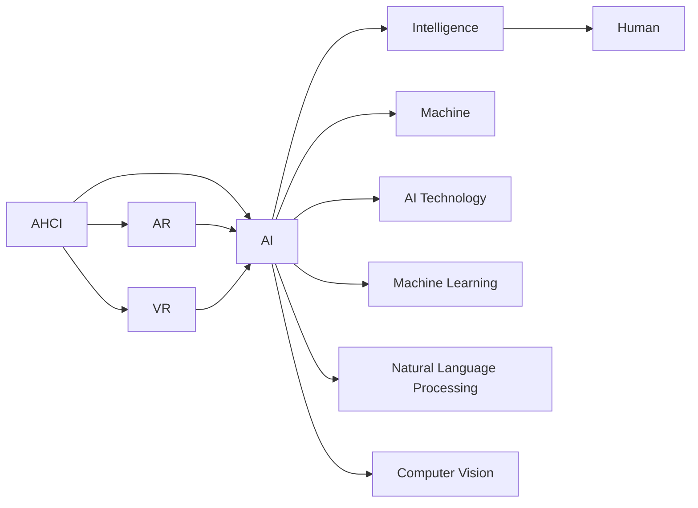
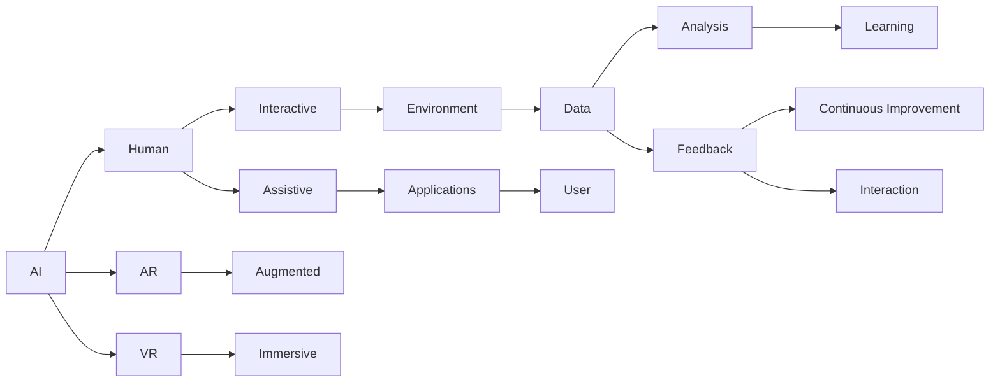
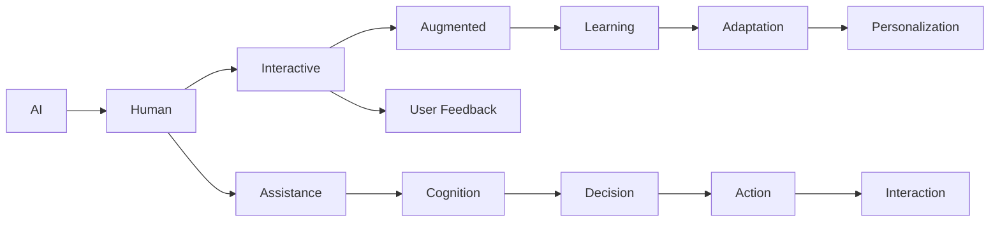
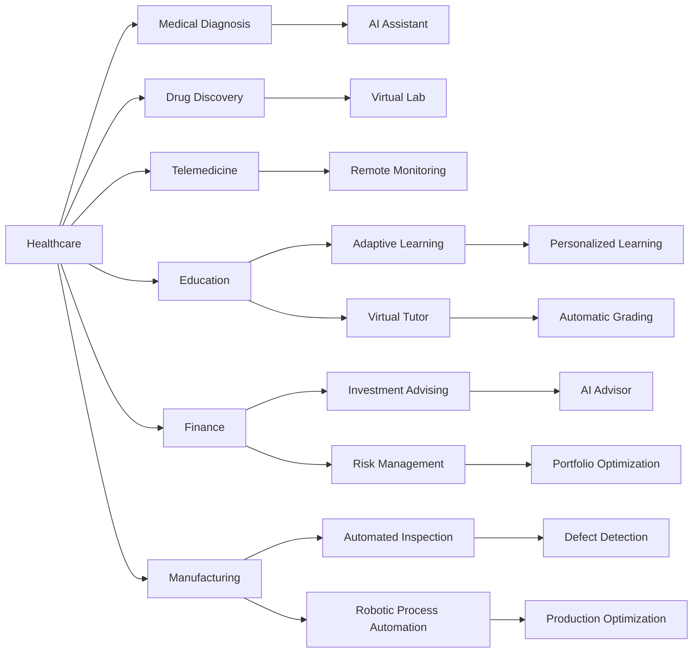

                 

# 人类-AI协作：增强人类潜能与AI能力的融合发展趋势预测分析机遇趋势分析预测

## 1. 背景介绍

### 1.1 问题由来
随着人工智能（AI）技术的飞速发展，AI已经逐渐渗透到各个领域，从制造业到金融业，从医疗健康到教育行业。AI技术的广泛应用，极大地提高了生产效率，降低了运营成本，带来了前所未有的机遇。然而，AI技术的发展也引发了关于AI与人类关系的深入思考。如何在AI发展中更好地发挥人类的潜能，如何将AI技术与人类协作融合，成为了当前AI研究的一个重要方向。

### 1.2 问题核心关键点
在AI与人类协作的融合发展中，我们需要关注以下几个核心关键点：
- **增强人类潜能**：如何利用AI技术提升人类的创造力、决策能力和情感智能，增强人类在复杂任务中的表现。
- **AI能力提升**：如何通过与人类协作，丰富AI模型的知识库，提升AI模型的泛化能力和适应性。
- **融合发展趋势**：AI与人类协作的未来趋势，包括技术融合、应用场景、社会影响等方面。

### 1.3 问题研究意义
研究AI与人类协作的融合发展，具有重要的理论和实践意义：
- **理论意义**：深入探讨AI与人类协作的机制和原理，有助于更好地理解AI和人类的协同工作模式，推动人工智能理论的发展。
- **实践意义**：指导AI技术在实际应用中的有效使用，提升AI系统的表现，促进AI技术在各个领域的广泛应用。
- **社会意义**：通过AI与人类协作的融合，推动社会的可持续发展，提升人类的生活质量。

## 2. 核心概念与联系

### 2.1 核心概念概述

在AI与人类协作的融合发展中，涉及以下几个核心概念：

- **人工智能（AI）**：一种通过计算机程序实现的技术，能够在特定任务上模拟人类智能行为。
- **增强现实（AR）**：一种将数字信息叠加到现实世界中的技术，帮助人类更好地理解复杂信息。
- **虚拟现实（VR）**：一种通过计算机生成虚拟环境的技术，让用户在虚拟空间中体验真实感。
- **人机交互（HCI）**：研究人与计算机之间的信息交流和交互方式，提升交互的自然性和效率。
- **智能系统**：结合了AI技术、AR/VR技术、HCI技术等多种技术的综合性系统，旨在提供更智能化的服务。

这些核心概念之间存在着紧密的联系，如图1所示：



图1 核心概念的联系

### 2.2 核心概念原理和架构的 Mermaid 流程图



图2 核心概念原理和架构的 Mermaid 流程图

## 3. 核心算法原理 & 具体操作步骤

### 3.1 算法原理概述

AI与人类协作的融合发展，涉及多个关键算法和步骤，如图3所示：



图3 核心算法原理概述

### 3.2 算法步骤详解

#### 3.2.1 数据收集和处理

在AI与人类协作的融合发展中，数据收集和处理是第一步。需要收集与特定任务相关的数据，包括用户行为数据、环境数据、任务数据等。数据收集完成后，需要进行数据清洗和预处理，如图4所示：


图4 数据收集和处理流程图

#### 3.2.2 AI模型的训练和优化

在数据处理完成后，需要训练和优化AI模型。AI模型的训练可以分为以下几个步骤：
1. **特征提取**：从原始数据中提取特征，用于训练模型。
2. **模型选择**：选择适合特定任务的AI模型，如神经网络、支持向量机、决策树等。
3. **模型训练**：使用训练数据对AI模型进行训练，最小化损失函数。
4. **模型评估**：使用测试数据对训练好的模型进行评估，选择性能最优的模型。
5. **模型优化**：根据评估结果，对模型进行优化，提升模型性能。

#### 3.2.3 融合发展和协作

在AI模型训练完成后，需要将其与人类协作融合。融合发展的关键步骤包括：
1. **用户交互界面设计**：设计易于使用的用户界面，方便用户与AI系统进行交互。
2. **任务分配和调度**：根据任务难度和用户能力，分配和调度任务，确保任务合理分配。
3. **结果反馈和调整**：根据用户反馈，调整AI系统的行为，提升系统的表现。
4. **持续学习和改进**：根据用户行为和系统表现，进行持续学习和改进，提升系统的智能水平。

### 3.3 算法优缺点

AI与人类协作的融合发展，具有以下优点：
- **提高效率**：通过AI辅助，可以大大提高任务完成效率，减少人力成本。
- **提升质量**：AI系统的智能化决策和推荐，可以提升任务完成的质量和精度。
- **增强用户体验**：通过人机协作，提供更加个性化和智能化的服务，提升用户体验。

同时，也存在一些缺点：
- **数据隐私问题**：在数据收集和处理过程中，可能涉及到用户隐私问题，需要采取措施保护用户隐私。
- **技术复杂性**：AI与人类协作的技术复杂性较高，需要专业知识和技术支持。
- **系统鲁棒性**：AI系统的鲁棒性问题需要解决，避免系统在特定情况下的失效。

### 3.4 算法应用领域

AI与人类协作的融合发展，可以应用于多个领域，如图5所示：



图5 算法应用领域

## 4. 数学模型和公式 & 详细讲解 & 举例说明

### 4.1 数学模型构建

在AI与人类协作的融合发展中，可以构建以下数学模型：

#### 4.1.1 用户行为模型

用户行为模型用于描述用户在不同情境下的行为模式，可以通过以下公式表示：

$$
\begin{aligned}
&\text{User Behavior} = f(\text{Context}, \text{User Preferences}, \text{Task Requirements}) \\
&\text{Context} = \{\text{Location}, \text{Time}, \text{User History}\}
\end{aligned}
$$

其中，$\text{Context}$ 表示用户行为的环境和历史信息，$\text{User Preferences}$ 表示用户的偏好，$\text{Task Requirements}$ 表示任务的需求。

#### 4.1.2 AI模型

AI模型的构建，可以通过以下公式表示：

$$
\begin{aligned}
&\text{AI Model} = g(\text{Data}, \text{Features}, \text{Model Parameters}) \\
&\text{Data} = \{(x_i, y_i)\}_{i=1}^N
\end{aligned}
$$

其中，$\text{Data}$ 表示训练数据，$\text{Features}$ 表示特征，$\text{Model Parameters}$ 表示模型的参数。

#### 4.1.3 融合发展模型

融合发展模型用于描述AI与人类协作的过程，可以通过以下公式表示：

$$
\begin{aligned}
&\text{Fusion Development} = h(\text{AI Model}, \text{Human Cognition}, \text{User Feedback}) \\
&\text{Human Cognition} = \{\text{Attention}, \text{Decision Making}\}
\end{aligned}
$$

其中，$\text{Human Cognition}$ 表示人类的认知能力，包括注意力和决策能力。

### 4.2 公式推导过程

#### 4.2.1 用户行为模型推导

根据用户行为模型，可以推导出以下公式：

$$
\begin{aligned}
&\text{User Behavior} = g(\text{Context}, \text{User Preferences}, \text{Task Requirements}) \\
&\text{Context} = \{\text{Location}, \text{Time}, \text{User History}\}
\end{aligned}
$$

#### 4.2.2 AI模型推导

根据AI模型的构建，可以推导出以下公式：

$$
\begin{aligned}
&\text{AI Model} = g(\text{Data}, \text{Features}, \text{Model Parameters}) \\
&\text{Data} = \{(x_i, y_i)\}_{i=1}^N
\end{aligned}
$$

#### 4.2.3 融合发展模型推导

根据融合发展模型，可以推导出以下公式：

$$
\begin{aligned}
&\text{Fusion Development} = h(\text{AI Model}, \text{Human Cognition}, \text{User Feedback}) \\
&\text{Human Cognition} = \{\text{Attention}, \text{Decision Making}\}
\end{aligned}
$$

### 4.3 案例分析与讲解

#### 4.3.1 医疗健康领域

在医疗健康领域，AI与人类协作可以应用于医疗诊断、药物发现、远程监控等多个方面。以医疗诊断为例，可以通过以下步骤实现：
1. **数据收集**：收集患者的历史病历、影像数据、生理数据等，作为训练数据。
2. **模型训练**：使用神经网络等模型，对数据进行训练，构建医疗诊断模型。
3. **任务分配**：根据患者症状和历史数据，分配和调度诊断任务，确保诊断结果的准确性。
4. **结果反馈**：根据医生的反馈，调整诊断模型的行为，提升诊断效果。
5. **持续改进**：根据患者的诊断结果和治疗效果，进行持续学习和改进，提升诊断系统的智能水平。

#### 4.3.2 教育领域

在教育领域，AI与人类协作可以应用于自适应学习、虚拟辅导、自动评分等多个方面。以自适应学习为例，可以通过以下步骤实现：
1. **数据收集**：收集学生的学习历史、成绩数据等，作为训练数据。
2. **模型训练**：使用机器学习模型，对数据进行训练，构建自适应学习模型。
3. **任务分配**：根据学生的学习能力和表现，分配和调度学习任务，确保学习效果。
4. **结果反馈**：根据学生的反馈，调整学习模型的行为，提升学习效果。
5. **持续改进**：根据学生的学习结果，进行持续学习和改进，提升学习系统的智能水平。

## 5. 项目实践：代码实例和详细解释说明

### 5.1 开发环境搭建

在AI与人类协作的融合发展中，开发环境搭建至关重要。以下是使用Python进行开发的环境配置流程：

1. 安装Python：从官网下载并安装Python，选择适合自己系统的版本。
2. 安装所需的库和框架：如TensorFlow、PyTorch、Keras等，用于构建AI模型。
3. 安装所需的工具：如Jupyter Notebook、VS Code等，用于开发和调试。

### 5.2 源代码详细实现

以下是使用TensorFlow实现医疗诊断的代码实现：

```python
import tensorflow as tf
from tensorflow.keras.models import Sequential
from tensorflow.keras.layers import Dense, Dropout, LSTM
from tensorflow.keras.optimizers import Adam

# 构建模型
model = Sequential()
model.add(LSTM(128, input_shape=(None, 100)))
model.add(Dense(64, activation='relu'))
model.add(Dropout(0.2))
model.add(Dense(10, activation='softmax'))

# 编译模型
model.compile(optimizer=Adam(), loss='categorical_crossentropy', metrics=['accuracy'])

# 训练模型
model.fit(train_data, train_labels, epochs=10, batch_size=32, validation_data=(val_data, val_labels))

# 评估模型
test_loss, test_acc = model.evaluate(test_data, test_labels)
print('Test Accuracy:', test_acc)
```

### 5.3 代码解读与分析

#### 5.3.1 构建模型

上述代码实现了使用LSTM构建的神经网络模型。LSTM是一种特殊的神经网络，适用于序列数据的处理。模型包括LSTM层、全连接层和dropout层，用于处理输入数据和生成输出结果。

#### 5.3.2 编译模型

在模型构建完成后，需要对其进行编译，包括选择优化器、损失函数和评估指标等。这里使用Adam优化器和交叉熵损失函数。

#### 5.3.3 训练模型

模型编译完成后，需要对其进行训练。使用训练数据和标签，设置训练轮数和批大小，进行模型训练。在训练过程中，使用验证数据对模型进行评估，确保模型不过拟合。

#### 5.3.4 评估模型

模型训练完成后，需要对模型进行评估，使用测试数据和标签，计算测试集上的损失和准确率。

## 6. 实际应用场景

### 6.1 智能健康监测

在智能健康监测领域，AI与人类协作可以应用于远程健康监测、智能医疗设备等多个方面。以远程健康监测为例，可以通过以下步骤实现：
1. **数据收集**：收集用户的生理数据、运动数据、环境数据等，作为训练数据。
2. **模型训练**：使用深度学习模型，对数据进行训练，构建健康监测模型。
3. **任务分配**：根据用户的生理数据和环境数据，分配和调度监测任务，确保监测结果的准确性。
4. **结果反馈**：根据用户的反馈，调整监测模型的行为，提升监测效果。
5. **持续改进**：根据用户的健康监测结果，进行持续学习和改进，提升监测系统的智能水平。

### 6.2 智能客服

在智能客服领域，AI与人类协作可以应用于智能问答、情感分析、语音识别等多个方面。以智能问答为例，可以通过以下步骤实现：
1. **数据收集**：收集用户的问题和回复，作为训练数据。
2. **模型训练**：使用深度学习模型，对数据进行训练，构建智能问答模型。
3. **任务分配**：根据用户的问题，分配和调度回答任务，确保回答的准确性。
4. **结果反馈**：根据用户的反馈，调整问答模型的行为，提升回答效果。
5. **持续改进**：根据用户的问答结果，进行持续学习和改进，提升问答系统的智能水平。

## 7. 工具和资源推荐

### 7.1 学习资源推荐

为了帮助开发者系统掌握AI与人类协作的理论基础和实践技巧，这里推荐一些优质的学习资源：

1. 《人工智能基础》：斯坦福大学开设的公开课，涵盖AI的基本概念、算法和技术。
2. 《深度学习》：Ian Goodfellow等著，深入讲解深度学习的基础理论和应用。
3. 《人机协作》：Christopher P.那么好，介绍AI与人类协作的理论和实践。
4. 《Python编程》：A. 鲁宾等著，讲解Python编程语言的基础和应用。
5. 《机器学习实战》：Peter Harrington著，提供丰富的机器学习实战案例。

### 7.2 开发工具推荐

高效的开发离不开优秀的工具支持。以下是几款用于AI与人类协作开发的常用工具：

1. TensorFlow：由Google主导开发的深度学习框架，生产部署方便，适合大规模工程应用。
2. PyTorch：基于Python的开源深度学习框架，灵活动态的计算图，适合快速迭代研究。
3. Jupyter Notebook：免费的交互式编程环境，支持Python、R等多种编程语言，适合开发和调试。
4. VS Code：微软开发的轻量级编程环境，支持多种编程语言，适合开发和调试。
5. Scikit-Learn：Python的机器学习库，提供简单易用的机器学习算法和工具。

### 7.3 相关论文推荐

AI与人类协作的发展源于学界的持续研究。以下是几篇奠基性的相关论文，推荐阅读：

1. "Human-AI Collaboration in Decision-Making"：探讨AI与人类协作在决策中的应用。
2. "Adaptive Learning Systems for Smartphones"：介绍基于AI的自适应学习系统。
3. "Intelligent Tutoring Systems"：介绍基于AI的智能辅导系统。
4. "Robot-Aided Surgery"：介绍基于AI的机器人辅助手术系统。
5. "Virtual Reality in Healthcare"：介绍基于AR/VR技术的医疗应用。

## 8. 总结：未来发展趋势与挑战

### 8.1 总结

本文对AI与人类协作的融合发展进行了全面系统的介绍。首先阐述了AI与人类协作的研究背景和意义，明确了融合发展在提升效率、质量和用户体验等方面的重要作用。其次，从原理到实践，详细讲解了AI与人类协作的数学模型、算法步骤和操作步骤，给出了具体的代码实现。同时，本文还广泛探讨了AI与人类协作在医疗健康、智能客服等多个行业领域的应用前景，展示了融合发展的巨大潜力。此外，本文精选了融合发展的各类学习资源，力求为读者提供全方位的技术指引。

通过本文的系统梳理，可以看到，AI与人类协作的融合发展正在成为智能技术的重要范式，极大地拓展了AI系统的应用边界，催生了更多的落地场景。未来，伴随AI技术的发展和普及，AI与人类协作将在更多领域得到应用，为社会带来深远的影响。

### 8.2 未来发展趋势

展望未来，AI与人类协作的融合发展将呈现以下几个趋势：

1. **智能化水平提升**：随着AI技术的不断发展，AI系统的智能化水平将不断提高，能够更好地与人类协作，完成更加复杂和精细的任务。
2. **人机交互的自然化**：通过增强现实、虚拟现实等技术，人机交互将更加自然和高效，提升用户体验。
3. **跨领域应用拓展**：AI与人类协作的应用领域将不断拓展，涵盖医疗、教育、金融等多个领域，带来新的发展机遇。
4. **伦理和法律的规范**：随着AI与人类协作的深入应用，相关伦理和法律问题将受到更多关注，需要制定相应的规范和标准。
5. **持续学习和改进**：AI与人类协作系统将具备持续学习和改进的能力，能够适应不断变化的环境和任务。

### 8.3 面临的挑战

尽管AI与人类协作的融合发展潜力巨大，但在实现过程中仍面临诸多挑战：

1. **技术复杂性**：AI与人类协作的技术复杂性较高，需要专业知识和技术支持。
2. **数据隐私问题**：在数据收集和处理过程中，可能涉及到用户隐私问题，需要采取措施保护用户隐私。
3. **系统鲁棒性**：AI系统的鲁棒性问题需要解决，避免系统在特定情况下的失效。
4. **伦理和法律问题**：AI与人类协作系统的伦理和法律问题需要解决，避免有害行为的出现。
5. **社会接受度**：AI与人类协作系统需要得到社会各界的广泛认可和接受。

### 8.4 研究展望

未来，AI与人类协作的研究需要在以下几个方面寻求新的突破：

1. **融合发展机制**：研究AI与人类协作的融合发展机制，探索更高效、更智能的协作方式。
2. **跨领域应用**：拓展AI与人类协作的应用领域，推动其在更多行业的落地。
3. **伦理和法律规范**：制定AI与人类协作的伦理和法律规范，确保系统的安全和可靠性。
4. **持续学习和改进**：研究持续学习和改进的技术，提升系统的智能水平。
5. **人机交互的自然化**：探索人机交互的自然化技术，提升用户体验。

## 9. 附录：常见问题与解答

**Q1: AI与人类协作在哪些领域具有应用潜力？**

A: AI与人类协作在多个领域具有应用潜力，包括医疗健康、教育、金融、制造业、智能客服等。在医疗健康领域，AI可以辅助诊断和治疗；在教育领域，AI可以提供个性化学习方案；在金融领域，AI可以提供投资建议和风险管理；在制造业，AI可以优化生产流程和质量控制；在智能客服，AI可以提供24/7的客户服务。

**Q2: AI与人类协作的系统设计需要考虑哪些关键因素？**

A: AI与人类协作的系统设计需要考虑以下关键因素：
1. **数据收集和处理**：收集和处理与任务相关的数据，确保数据的质量和多样性。
2. **AI模型的选择和训练**：选择适合的AI模型，使用数据进行训练和优化，确保模型的准确性和鲁棒性。
3. **人机交互设计**：设计易于使用的用户界面，方便用户与AI系统进行交互。
4. **任务分配和调度**：根据任务难度和用户能力，分配和调度任务，确保任务合理分配。
5. **结果反馈和调整**：根据用户反馈，调整AI系统的行为，提升系统的表现。
6. **持续学习和改进**：根据用户行为和系统表现，进行持续学习和改进，提升系统的智能水平。

**Q3: 如何评估AI与人类协作系统的性能？**

A: AI与人类协作系统的性能评估可以从以下几个方面进行：
1. **任务完成效率**：评估系统完成任务的效率和速度。
2. **任务完成质量**：评估系统完成任务的质量和准确性。
3. **用户体验**：评估用户对系统的满意度和使用体验。
4. **系统鲁棒性**：评估系统在不同情况下的鲁棒性和稳定性。
5. **持续学习效果**：评估系统的持续学习和改进效果，确保系统的智能水平不断提高。

**Q4: AI与人类协作系统的设计需要考虑哪些伦理和法律问题？**

A: AI与人类协作系统的设计需要考虑以下伦理和法律问题：
1. **数据隐私**：保护用户隐私，避免数据泄露和滥用。
2. **公平性和透明性**：确保AI系统在决策过程中公平透明，避免偏见和歧视。
3. **安全性**：确保系统的安全性，避免系统被恶意攻击和滥用。
4. **责任归属**：明确AI与人类协作系统在决策过程中的责任归属，避免法律纠纷。
5. **伦理规范**：制定AI与人类协作系统的伦理规范，确保系统的行为符合人类价值观和伦理道德。

**Q5: 如何应对AI与人类协作系统中的技术复杂性问题？**

A: 应对AI与人类协作系统中的技术复杂性问题，可以从以下几个方面进行：
1. **专业知识培训**：为开发团队提供专业知识培训，提高团队的技术水平和协作能力。
2. **工具和框架支持**：使用先进的开发工具和框架，简化开发流程，提高开发效率。
3. **模块化和组件化设计**：采用模块化和组件化设计，降低系统复杂度，提高系统的可维护性。
4. **持续改进和优化**：持续改进和优化系统设计，确保系统不断优化和升级。

**Q6: AI与人类协作系统的设计需要考虑哪些用户需求？**

A: AI与人类协作系统的设计需要考虑以下用户需求：
1. **功能性需求**：确保系统具备完成特定任务的功能，满足用户的基本需求。
2. **可用性需求**：设计易于使用的用户界面，提升系统的可用性和用户体验。
3. **可扩展性需求**：确保系统具备良好的可扩展性，支持未来的功能和需求。
4. **可维护性需求**：设计易于维护的系统，方便开发团队进行系统维护和升级。
5. **安全性需求**：确保系统的安全性，避免系统被恶意攻击和滥用。

**Q7: AI与人类协作系统的设计需要考虑哪些数据需求？**

A: AI与人类协作系统的设计需要考虑以下数据需求：
1. **数据多样性**：收集与任务相关的多样性数据，确保数据的代表性和多样性。
2. **数据质量**：确保数据的质量和准确性，避免数据噪音和偏差。
3. **数据安全性**：确保数据的安全性，避免数据泄露和滥用。
4. **数据存储和处理**：设计高效的数据存储和处理方案，确保数据的可靠性和实时性。
5. **数据隐私保护**：保护用户隐私，避免数据滥用和泄露。

作者：禅与计算机程序设计艺术 / Zen and the Art of Computer Programming

