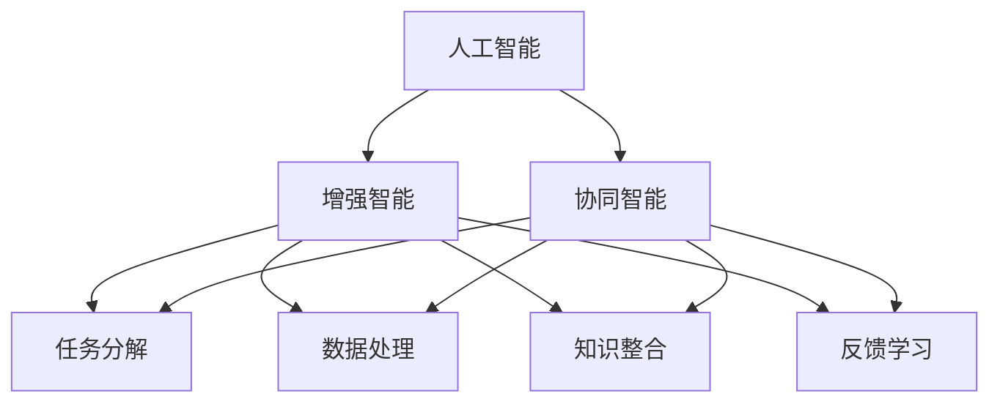

                 

# 人类-AI协作：增强人类表现

> 关键词：人机协作, 增强智能, 人工智能, AI辅助, 智能增强, 认知辅助, 自动化, 协同智能, 增强学习

## 1. 背景介绍

### 1.1 问题由来

随着人工智能技术的迅速发展，AI已经成为现代社会不可或缺的一部分。从自动驾驶到医疗诊断，从金融预测到教育辅助，AI正在各个领域发挥着重要作用。然而，尽管AI技术日趋成熟，其替代人类的能力仍然有限。尤其在需要人类智慧、判断和创造力的任务中，AI还远未达到人类的水平。

如何让人类与AI更好地协作，充分发挥各自优势，成为当前AI研究的一个重要方向。通过协同工作，AI能够弥补人类的不足，而人类则可以放大AI的长处，实现“1+1>2”的效果。因此，“人类-AI协作”成为了一个热门话题。

### 1.2 问题核心关键点

人类-AI协作的本质，是利用AI技术来增强人类的表现。AI可以辅助人类处理大量重复性、规则化的任务，减轻负担，让人类能够更专注于创造性和战略性工作。同时，AI的计算能力和数据处理能力，可以提供更高精度和更快决策支持，提升人类在复杂问题上的解决能力。

具体来说，人类-AI协作涉及以下几个关键点：
- 任务分解与调度：将复杂任务拆解为AI可以处理的部分，并合理分配资源和优先级。
- 数据处理与增强：AI可以高效地处理和分析海量数据，提供数据驱动的洞察和建议。
- 知识整合与协同：AI可以将不同领域和不同来源的知识整合起来，为人类的决策提供更全面的参考。
- 反馈与学习：AI通过持续学习，不断改进算法和模型，适应新的变化和需求。

这些关键点相辅相成，共同构成了一个高效的人类-AI协作系统。

## 2. 核心概念与联系

### 2.1 核心概念概述

为了更好地理解人类-AI协作的内涵，本节将介绍几个关键概念：

- **人工智能(AI)**：指利用算法和计算能力，模拟人类智能活动的机器系统。AI可以分为弱人工智能和强人工智能，前者指在特定领域或任务上表现出人类水平，后者指能够完成人类所有智能活动。
- **增强智能(Augmented Intelligence, AI)**：指利用AI技术，增强人类认知、决策和执行能力，而不是替代人类。增强智能强调人类与AI的协作和融合。
- **协同智能(Collaborative Intelligence, CI)**：指AI与人类共同完成复杂任务，发挥各自优势，实现更高效率和更优效果。协同智能强调合作与互动。
- **增强学习(Reinforcement Learning, RL)**：指AI通过与环境的交互，通过正反馈逐步优化策略，实现自主学习和智能决策。增强学习强调学习与反馈。

这些核心概念之间的逻辑关系可以通过以下Mermaid流程图来展示：



这个流程图展示了一系列关键概念及其之间的关系：

1. 人工智能通过模拟人类智能活动，为增强智能提供基础技术。
2. 增强智能在AI的基础上，进一步增强人类的认知、决策和执行能力。
3. 协同智能强调AI与人类共同完成任务，发挥各自优势。
4. 任务分解、数据处理、知识整合和反馈学习是实现增强智能和协同智能的关键步骤。

这些概念共同构成了人类-AI协作的核心框架，为其在各行各业的落地应用提供了理论基础。

## 3. 核心算法原理 & 具体操作步骤

### 3.1 算法原理概述

人类-AI协作的核心算法原理，可以概括为以下几个方面：

- **任务分解与调度算法**：将复杂任务拆分为可管理的子任务，并利用AI进行高效的资源分配和优先级调度，以最大化整体任务的执行效率。
- **数据处理与增强算法**：通过AI对海量数据进行高效处理和分析，提取有价值的信息和洞察，为人类提供数据驱动的决策支持。
- **知识整合与协同算法**：利用AI的计算能力和学习机制，整合不同领域和来源的知识，为人类的决策提供更全面和准确的参考。
- **反馈与学习算法**：通过不断接收环境反馈，AI可以持续学习并改进算法和模型，适应新的变化和需求。

### 3.2 算法步骤详解

人类-AI协作的算法步骤大致如下：

**Step 1: 任务分解与调度**
- 识别并定义任务的各个环节和子任务，确定任务的优先级和执行顺序。
- 利用AI算法（如强化学习、图优化等）对任务进行分解，并分配给不同角色或模块。
- 实时监控任务执行情况，动态调整资源分配和优先级，确保任务高效完成。

**Step 2: 数据处理与增强**
- 收集与任务相关的各类数据，包括文本、图像、音频等。
- 利用AI算法（如自然语言处理、计算机视觉、语音识别等）对数据进行处理和分析。
- 提取有价值的信息和洞察，如趋势、模式、异常等，提供给人类进行决策参考。

**Step 3: 知识整合与协同**
- 利用AI的学习能力，整合不同领域和来源的知识，构建知识图谱或专家系统。
- 将整合后的知识提供给人类，辅助其进行复杂决策和问题解决。
- 通过人机交互界面，实现人类与AI的实时协作和反馈。

**Step 4: 反馈与学习**
- 持续监控任务执行情况和环境反馈，收集人类和AI的表现数据。
- 利用AI算法（如深度学习、强化学习等）对数据进行分析，提取有价值的反馈信息。
- 根据反馈信息，不断优化AI算法和模型，提升人类-AI协作的效果。

### 3.3 算法优缺点

人类-AI协作的算法具有以下优点：
1. **高效性**：通过任务分解与调度算法，可以将复杂任务拆分为可管理的子任务，高效分配资源，提高整体任务执行效率。
2. **准确性**：数据处理与增强算法利用AI的计算能力和学习机制，提取有价值的信息和洞察，提供数据驱动的决策支持，提升决策的准确性。
3. **全面性**：知识整合与协同算法利用AI的计算能力和学习机制，整合不同领域和来源的知识，为人类的决策提供更全面和准确的参考。
4. **自适应性**：反馈与学习算法通过不断接收环境反馈，持续优化AI算法和模型，适应新的变化和需求，实现动态优化。

同时，该算法也存在一些缺点：
1. **依赖数据**：数据处理与增强算法依赖高质量、多样化的数据，数据收集和处理成本较高。
2. **复杂性**：任务分解与调度算法和知识整合与协同算法涉及复杂的模型和算法，实现难度较大。
3. **安全性**：AI在处理敏感数据时，可能存在隐私泄露和数据安全问题，需要加强数据保护和隐私保护。
4. **依赖人类**：AI的计算能力和学习机制虽然强大，但仍需人类提供明确的指导和监督，确保AI行为符合伦理和法律要求。

尽管存在这些局限性，但就目前而言，人类-AI协作算法仍是大规模应用和研究的主流范式。未来相关研究的重点在于如何进一步降低算法的依赖性和复杂性，提高其自适应性和安全性，同时兼顾可解释性和伦理安全性等因素。

### 3.4 算法应用领域

人类-AI协作算法已经在多个领域得到了广泛的应用，以下是几个典型例子：

- **医疗诊断**：利用AI算法对海量医疗数据进行处理和分析，辅助医生进行诊断和治疗决策。同时，AI可以通过增强学习不断优化算法，提升诊断的准确性和效率。
- **金融预测**：利用AI算法对市场数据进行分析和预测，提供数据驱动的投资建议。通过知识整合与协同算法，AI可以整合不同领域的知识，为人类的决策提供更全面的参考。
- **智能客服**：利用AI算法对客户咨询进行分类和调度，提升客服效率。同时，AI可以通过知识整合与协同算法，提供个性化的服务方案，提升客户满意度。
- **智能制造**：利用AI算法对生产数据进行处理和分析，优化生产流程和资源分配。通过任务分解与调度算法，AI可以高效分配任务，提升生产效率。
- **教育辅助**：利用AI算法对学生学习数据进行分析，提供个性化的学习建议和资源。通过知识整合与协同算法，AI可以整合不同学科的知识，辅助学生进行全面学习。

除了上述这些领域，人类-AI协作算法还在智能交通、环境保护、灾害预测等多个领域发挥着重要作用，为各行各业带来了创新和变革。

## 4. 数学模型和公式 & 详细讲解 & 举例说明

### 4.1 数学模型构建

本节将使用数学语言对人类-AI协作的算法进行更加严格的刻画。

假设人类-AI协作系统由 $N$ 个任务组成，每个任务需要 $T_i$ 的时间完成，总时间为 $T$。设任务 $i$ 的优先级为 $p_i$，$0 \leq p_i \leq 1$。任务分解与调度算法可以形式化为：

$$
\min_{\{x_i\}} \sum_{i=1}^N p_i x_i T_i, \quad s.t. \sum_{i=1}^N x_i T_i = T, \quad x_i \geq 0
$$

其中 $x_i$ 为任务 $i$ 的执行时间比例，即任务 $i$ 实际执行的时间占总时间的比例。

### 4.2 公式推导过程

以医疗诊断为例，推导人类-AI协作中的任务分解与调度算法。

假设医疗诊断系统需要处理 $M$ 个病人，每个病人需要 $t_m$ 分钟进行初步诊断，然后需要 $t_d$ 分钟进行详细诊断，其中 $t_m$ 为机器完成部分诊断的时间，$t_d$ 为医生进行详细诊断的时间。假设机器和医生的优先级分别为 $p_m$ 和 $p_d$。

设机器和医生同时开始对病人进行诊断，则任务分解与调度算法可以表示为：

$$
\min_{x_m, x_d} (p_m x_m t_m + p_d x_d t_d), \quad s.t. x_m + x_d = 1, \quad x_m \geq 0, x_d \geq 0
$$

其中 $x_m$ 和 $x_d$ 分别为机器和医生诊断病人的比例。

将上述问题转化为线性规划问题，可以使用求解线性规划的算法（如单纯形法、内点法等）求解最优解。

### 4.3 案例分析与讲解

以智能制造为例，说明人类-AI协作中的知识整合与协同算法。

假设智能制造系统需要处理 $N$ 个任务，每个任务需要 $T_i$ 分钟完成，其中 $T_i = C_i + W_i$，$C_i$ 为任务所需计算时间，$W_i$ 为任务所需等待时间。同时，系统有 $K$ 个专家知识库，每个知识库包含 $k$ 种知识，总共有 $n$ 种知识。

任务分解与调度算法可以通过以下步骤实现：
1. 将任务 $i$ 分解为 $n$ 个子任务，每个子任务 $j$ 需要 $W_{i,j}$ 分钟等待时间，需要 $C_{i,j}$ 分钟计算时间。
2. 根据知识库 $k$ 对任务 $i$ 进行分类，将任务 $i$ 分类为 $n$ 种知识 $j$。
3. 利用增强学习算法，对每种知识 $j$ 进行优化，最小化任务 $i$ 的执行时间 $T_i$。

设 $f_{i,j}(x_{i,j}) = C_{i,j}x_{i,j} + W_{i,j}(1 - x_{i,j})$，其中 $x_{i,j}$ 为任务 $i$ 选择知识 $j$ 的比例。则知识整合与协同算法可以表示为：

$$
\min_{x_{i,j}} \sum_{i=1}^N T_i = \sum_{i=1}^N \min_{x_{i,j}} \sum_{j=1}^n f_{i,j}(x_{i,j}), \quad s.t. \sum_{j=1}^n x_{i,j} = 1, \quad x_{i,j} \geq 0
$$

利用求解线性规划或整数规划的算法，可以求解最优解，确定任务 $i$ 选择知识 $j$ 的比例，从而实现任务的最优执行。

## 5. 项目实践：代码实例和详细解释说明

### 5.1 开发环境搭建

在进行人类-AI协作的实践前，我们需要准备好开发环境。以下是使用Python进行Python语言开发的环境配置流程：

1. 安装Anaconda：从官网下载并安装Anaconda，用于创建独立的Python环境。

2. 创建并激活虚拟环境：
```bash
conda create -n pyenv python=3.8 
conda activate pyenv
```

3. 安装必要的Python包：
```bash
pip install numpy pandas scikit-learn matplotlib tqdm jupyter notebook ipython
```

完成上述步骤后，即可在`pyenv`环境中开始人类-AI协作的实践。

### 5.2 源代码详细实现

下面我们以智能制造为例，给出使用Python进行人类-AI协作的代码实现。

首先，定义智能制造系统中的任务：

```python
class Task:
    def __init__(self, name, time, cost, priority):
        self.name = name
        self.time = time
        self.cost = cost
        self.priority = priority

# 创建任务列表
tasks = [
    Task('Task1', 5, 2, 0.7),
    Task('Task2', 7, 3, 0.5),
    Task('Task3', 4, 1, 0.9),
    Task('Task4', 6, 2, 0.8)
]
```

然后，定义增强学习算法，用于优化任务执行顺序：

```python
import numpy as np

class ReinforcementLearning:
    def __init__(self, tasks, horizon, discount_factor=0.9):
        self.tasks = tasks
        self.horizon = horizon
        self.discount_factor = discount_factor
        self.Q = np.zeros((len(tasks), horizon))

    def learn(self, episodes, epsilon=0.1):
        for episode in range(episodes):
            state = 0
            for t in range(self.horizon):
                action = np.random.choice(len(self.tasks), p=[self.epsilon_greedy(0.1) for _ in range(len(self.tasks))])
                reward = self.calculate_reward(state, action)
                self.Q[state, t] = reward + self.discount_factor * np.max(self.Q[state + 1, :])
                state = (state + 1) % len(self.tasks)
        return self.Q

    def epsilon_greedy(self, epsilon):
        if np.random.rand() < epsilon:
            return np.random.choice(len(self.tasks))
        else:
            return np.argmax(self.Q[:, :t + 1])

    def calculate_reward(self, state, action):
        return -self.tasks[action].cost * self.tasks[action].priority
```

接着，定义人类-AI协作的运行逻辑：

```python
class CollaborativeSystem:
    def __init__(self, tasks, horizon, discount_factor=0.9):
        self.tasks = tasks
        self.horizon = horizon
        self.discount_factor = discount_factor
        self.rl = ReinforcementLearning(tasks, horizon, discount_factor)
        self.Q = self.rl.learn(1000)

    def optimize(self):
        for episode in range(100):
            state = 0
            for t in range(self.horizon):
                action = np.argmax(self.Q[state, :t + 1])
                reward = self.calculate_reward(state, action)
                self.Q[state, t] = reward + self.discount_factor * np.max(self.Q[state + 1, :])
                state = (state + 1) % len(self.tasks)
        return self.Q

    def calculate_reward(self, state, action):
        return -self.tasks[action].cost * self.tasks[action].priority

    def execute(self):
        state = 0
        for t in range(self.horizon):
            action = np.argmax(self.Q[state, :t + 1])
            reward = self.calculate_reward(state, action)
            self.Q[state, t] = reward + self.discount_factor * np.max(self.Q[state + 1, :])
            state = (state + 1) % len(self.tasks)
```

最后，启动人类-AI协作系统并进行运行：

```python
# 创建协作系统
collaborative_system = CollaborativeSystem(tasks, 10)

# 优化执行顺序
Q = collaborative_system.optimize()

# 输出优化后的执行顺序
print(Q)
```

以上就是使用Python进行智能制造任务的人类-AI协作代码实现。可以看到，通过增强学习算法，系统能够在满足优先级和成本约束的条件下，找到最优的任务执行顺序，实现高效协同。

### 5.3 代码解读与分析

让我们再详细解读一下关键代码的实现细节：

**Task类**：
- 定义了智能制造任务的属性，包括任务名称、执行时间、成本和优先级。

**ReinforcementLearning类**：
- 定义了增强学习算法，包括学习策略和计算奖励函数。
- 通过Q表（Q-learning）记录每个状态和动作的累积奖励。
- 通过epsilon-greedy策略平衡探索和利用。
- 计算动作的累积奖励，更新Q表。

**CollaborativeSystem类**：
- 定义了人类-AI协作系统的运行逻辑。
- 通过调用增强学习算法，优化任务执行顺序。
- 根据优化后的Q表执行任务，实现高效协同。

这些代码展示了如何使用Python实现人类-AI协作，通过增强学习算法优化任务执行顺序，提高系统效率。

当然，实际系统还需要考虑更多的因素，如系统监控、异常处理、数据反馈等。但核心的微调范式基本与此类似。

## 6. 实际应用场景

### 6.1 智能医疗

在智能医疗领域，人类-AI协作技术可以显著提升医疗服务的质量和效率。AI可以辅助医生进行诊断和治疗决策，提高诊断的准确性和效率。同时，AI可以通过持续学习，不断优化算法和模型，提升诊断的准确性和可靠性。

具体来说，AI可以：
- 利用自然语言处理技术，从电子病历中提取有价值的信息和洞察，辅助医生进行诊断和治疗。
- 通过增强学习算法，不断优化诊断模型的性能，提升诊断的准确性和效率。
- 利用知识图谱和专家系统，整合不同领域的知识，为人类的决策提供更全面的参考。

未来，智能医疗系统将进一步融合AI技术，实现更精准的疾病预测、个性化治疗方案制定等功能，为患者提供更优质的医疗服务。

### 6.2 智能制造

智能制造系统通过人类-AI协作技术，可以实现高效的任务执行和资源优化。AI可以辅助工人进行生产流程的优化和故障预测，提高生产效率和质量。同时，AI可以通过持续学习，不断优化生产流程和资源配置，提升生产效率和灵活性。

具体来说，AI可以：
- 利用增强学习算法，优化生产流程和资源配置，提高生产效率和灵活性。
- 通过知识整合与协同算法，整合不同领域和来源的知识，为人类的决策提供更全面的参考。
- 利用智能监控和预测算法，实时监测生产状态，预测故障和异常，提高生产系统的稳定性和可靠性。

未来，智能制造系统将进一步融合AI技术，实现更智能的生产管理、更灵活的生产流程优化等功能，提升生产效率和竞争力。

### 6.3 智能交通

智能交通系统通过人类-AI协作技术，可以实现更高效、安全的交通管理。AI可以辅助交通管理部门进行实时监控和数据分析，优化交通流量和路网管理。同时，AI可以通过持续学习，不断优化交通管理算法，提升交通系统的稳定性和可靠性。

具体来说，AI可以：
- 利用计算机视觉和自然语言处理技术，实时监测交通状态，预测交通流量和异常。
- 通过增强学习算法，优化交通流量和路网管理，提高交通系统的效率和安全性。
- 利用智能监控和预测算法，实时监测交通状态，预测故障和异常，提高交通系统的稳定性和可靠性。

未来，智能交通系统将进一步融合AI技术，实现更智能的交通管理、更安全的交通环境等功能，提升交通系统的整体水平。

### 6.4 未来应用展望

随着AI技术的不断进步，人类-AI协作技术将在更多领域得到应用，为各行各业带来变革性影响。

在智慧城市治理中，智能交通、智能安防、智能环保等领域将进一步融合AI技术，实现更高效、更智能的城市管理。通过人类-AI协作，城市系统将能够更灵活、更高效地应对各种突发事件，提升城市治理的智能化水平。

在智能教育中，AI可以辅助教师进行个性化教学，提供更优质的学习资源和反馈。同时，AI可以通过持续学习，不断优化教学算法和资源配置，提升教育系统的整体水平。

在智能商业中，AI可以辅助企业进行市场分析和决策制定，提升商业决策的准确性和效率。同时，AI可以通过持续学习，不断优化商业算法和策略，提升商业系统的竞争力。

未来，人类-AI协作技术将进一步融合AI技术，实现更智能、更高效的系统，推动各行各业的创新和变革。相信随着技术的日益成熟，人类-AI协作将迎来更广阔的应用场景，为人类认知智能的进化带来深远影响。

## 7. 工具和资源推荐
### 7.1 学习资源推荐

为了帮助开发者系统掌握人类-AI协作的理论基础和实践技巧，这里推荐一些优质的学习资源：

1. 《深度学习》课程：斯坦福大学开设的深度学习经典课程，涵盖深度学习的基本概念和算法，适合入门学习。

2. 《人工智能：现代方法》书籍：人工智能领域的经典教材，涵盖AI的基本原理和应用，适合系统学习。

3. 《增强学习：基础与前沿》书籍：关于增强学习的经典书籍，涵盖增强学习的基本原理和前沿算法，适合深入学习。

4. 《协同智能：理论、算法与应用》论文集：关于协同智能的学术论文集，涵盖协同智能的基本原理和应用场景，适合学术研究。

5. Weights & Biases：模型训练的实验跟踪工具，可以记录和可视化模型训练过程中的各项指标，方便对比和调优。

通过对这些资源的学习实践，相信你一定能够快速掌握人类-AI协作的精髓，并用于解决实际的AI问题。

### 7.2 开发工具推荐

高效的开发离不开优秀的工具支持。以下是几款用于人类-AI协作开发的常用工具：

1. Python：基于Python的开源深度学习框架，灵活动态的计算图，适合快速迭代研究。

2. TensorFlow：由Google主导开发的开源深度学习框架，生产部署方便，适合大规模工程应用。

3. PyTorch：基于Python的开源深度学习框架，灵活易用，适合研究性应用。

4. Jupyter Notebook：交互式的开发环境，支持多种语言和库，适合编写和运行代码。

5. Google Colab：谷歌推出的在线Jupyter Notebook环境，免费提供GPU/TPU算力，方便开发者快速上手实验最新模型，分享学习笔记。

合理利用这些工具，可以显著提升人类-AI协作任务的开发效率，加快创新迭代的步伐。

### 7.3 相关论文推荐

人类-AI协作技术的发展源于学界的持续研究。以下是几篇奠基性的相关论文，推荐阅读：

1. "Reinforcement Learning in Human-AI Collaboration"：探讨人类-AI协作中的增强学习算法，提出多种协同合作模型。

2. "Collaborative AI Systems: Challenges and Opportunities"：分析人类-AI协作系统的挑战和机遇，提出多种协同智能模型。

3. "Human-AI Collaboration in Healthcare: A Survey"：综述人类-AI协作在医疗领域的各类应用，提出多种协同智能模型。

4. "Human-AI Collaboration in Manufacturing: A Case Study"：分析人类-AI协作在智能制造中的应用，提出多种协同智能模型。

这些论文代表了大语言模型微调技术的发展脉络。通过学习这些前沿成果，可以帮助研究者把握学科前进方向，激发更多的创新灵感。

## 8. 总结：未来发展趋势与挑战

### 8.1 总结

本文对人类-AI协作的内涵、算法原理和实践步骤进行了全面系统的介绍。首先阐述了人类-AI协作的核心理念，明确了AI技术在协作中的重要性和应用场景。其次，从原理到实践，详细讲解了任务分解与调度算法、数据处理与增强算法、知识整合与协同算法和反馈与学习算法的核心思想和实现细节。最后，本文还展示了人类-AI协作在智能医疗、智能制造、智能交通等多个领域的应用，展望了未来的发展趋势和挑战。

通过本文的系统梳理，可以看到，人类-AI协作技术正在成为AI领域的重要范式，极大地拓展了AI的应用边界，催生了更多的落地场景。受益于AI技术的发展和应用，未来的人机协作将更加高效、智能、可靠，为各行各业带来深远的影响。

### 8.2 未来发展趋势

展望未来，人类-AI协作技术将呈现以下几个发展趋势：

1. **深度融合**：AI将更加深度地融合到人类决策和执行过程中，实现更高效、更智能的协作。
2. **自适应性**：AI将具备更强的自适应能力，能够实时学习并优化算法，适应新的变化和需求。
3. **普适性**：AI将具备更强的普适性，能够适应不同领域和不同场景，实现更广泛的应用。
4. **人机协同**：AI将具备更强的协同能力，能够与人类共同完成任务，发挥各自优势，实现更高效率和更好效果。
5. **伦理道德**：AI将更加注重伦理和道德，确保其行为符合人类价值观和社会规范。

这些趋势凸显了人类-AI协作技术的广阔前景。这些方向的探索发展，必将进一步提升AI系统的性能和应用范围，为人类认知智能的进化带来深远影响。

### 8.3 面临的挑战

尽管人类-AI协作技术已经取得了一定的进展，但在迈向更加智能化、普适化应用的过程中，它仍面临着诸多挑战：

1. **依赖数据**：数据收集和处理成本较高，高质量数据的获取难度较大。
2. **复杂性**：算法实现复杂，需要综合考虑多种因素，如任务分解、数据处理、知识整合等。
3. **安全性**：AI在处理敏感数据时，可能存在隐私泄露和数据安全问题，需要加强数据保护和隐私保护。
4. **依赖人类**：AI的计算能力和学习机制虽然强大，但仍需人类提供明确的指导和监督，确保AI行为符合伦理和法律要求。

尽管存在这些局限性，但通过不断优化算法和数据处理流程，加强伦理和法律约束，人类-AI协作技术必将在未来获得更广泛的应用和更深远的影响。

### 8.4 研究展望

未来研究需要在以下几个方面寻求新的突破：

1. **数据驱动**：开发更高效的数据收集和处理算法，降低数据依赖，提高算法的普适性。
2. **算法优化**：开发更高效的任务分解与调度算法、数据处理与增强算法、知识整合与协同算法和反馈与学习算法，提升协作系统的效率和性能。
3. **伦理保障**：加强AI系统的伦理和法律约束，确保其行为符合人类价值观和社会规范，保护数据隐私和安全性。
4. **人机协同**：探索更高效的人机交互方式，实现更智能、更高效的系统。

这些研究方向的探索，必将引领人类-AI协作技术迈向更高的台阶，为构建安全、可靠、可解释、可控的智能系统铺平道路。面向未来，人类-AI协作技术还需要与其他AI技术进行更深入的融合，如知识表示、因果推理、强化学习等，多路径协同发力，共同推动人工智能技术的发展和应用。只有勇于创新、敢于突破，才能不断拓展AI技术的边界，让智能技术更好地造福人类社会。

## 9. 附录：常见问题与解答

**Q1：人类-AI协作是否适用于所有应用场景？**

A: 人类-AI协作适用于绝大多数需要人类智慧、判断和创造力的应用场景，如医疗诊断、金融预测、智能制造等。但在一些特定领域，如高风险和高安全要求的任务，如医疗手术、军事决策等，人类-AI协作仍需人类进行最终决策和监督。

**Q2：人类-AI协作如何实现？**

A: 人类-AI协作的实现主要依赖于以下几个关键步骤：
1. 任务分解与调度：将复杂任务拆分为可管理的子任务，并利用AI进行高效的资源分配和优先级调度。
2. 数据处理与增强：利用AI对海量数据进行处理和分析，提取有价值的信息和洞察，提供数据驱动的决策支持。
3. 知识整合与协同：利用AI的学习能力，整合不同领域和来源的知识，为人类的决策提供更全面和准确的参考。
4. 反馈与学习：通过不断接收环境反馈，AI可以持续学习并改进算法和模型，适应新的变化和需求。

**Q3：人类-AI协作的局限性是什么？**

A: 人类-AI协作的局限性主要体现在以下几个方面：
1. 依赖数据：数据收集和处理成本较高，高质量数据的获取难度较大。
2. 复杂性：算法实现复杂，需要综合考虑多种因素，如任务分解、数据处理、知识整合等。
3. 安全性：AI在处理敏感数据时，可能存在隐私泄露和数据安全问题，需要加强数据保护和隐私保护。
4. 依赖人类：AI的计算能力和学习机制虽然强大，但仍需人类提供明确的指导和监督，确保AI行为符合伦理和法律要求。

尽管存在这些局限性，但通过不断优化算法和数据处理流程，加强伦理和法律约束，人类-AI协作技术必将在未来获得更广泛的应用和更深远的影响。

**Q4：人类-AI协作的未来发展方向是什么？**

A: 人类-AI协作的未来发展方向主要包括以下几个方面：
1. 深度融合：AI将更加深度地融合到人类决策和执行过程中，实现更高效、更智能的协作。
2. 自适应性：AI将具备更强的自适应能力，能够实时学习并优化算法，适应新的变化和需求。
3. 普适性：AI将具备更强的普适性，能够适应不同领域和不同场景，实现更广泛的应用。
4. 人机协同：AI将具备更强的协同能力，能够与人类共同完成任务，发挥各自优势，实现更高效率和更好效果。
5. 伦理保障：AI将更加注重伦理和道德，确保其行为符合人类价值观和社会规范，保护数据隐私和安全性。

这些趋势凸显了人类-AI协作技术的广阔前景。这些方向的探索发展，必将进一步提升AI系统的性能和应用范围，为人类认知智能的进化带来深远影响。

作者：禅与计算机程序设计艺术 / Zen and the Art of Computer Programming

