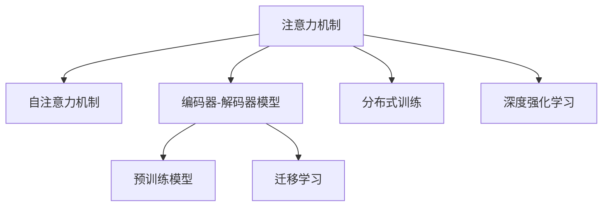

                 

## 1. 背景介绍

在当今信息爆炸的时代，人类面临的注意力负担日益加重。据统计，每个人每天接收到的信息量已达200GB，远超我们的大脑处理能力。这种信息过载不仅影响人们的日常工作和生活，更使得商业决策面临巨大挑战。因此，提升人类的专注力和注意力，成为提升工作效率、改善生活质量的关键。

在商业领域，传统的决策模型已难以适应复杂多变的环境。然而，近年来兴起的注意力增强(AIAttention Enhancement)技术，通过模拟人类认知过程，在商业决策、信息筛选、个性化推荐等方面展现出巨大潜力。本文将系统探讨这一技术的原理、应用及未来发展趋势，帮助读者深入理解其对商业世界的重大影响。

## 2. 核心概念与联系

### 2.1 核心概念概述

为更好地理解注意力增强技术，本节将介绍几个密切相关的核心概念：

- **注意力机制(Attention Mechanism)**：一种模仿人类认知机制的深度学习架构，通过选择性地关注输入中的部分信息，提升模型对关键细节的关注。
- **自注意力机制(Self-Attention)**：一种基于注意力机制的深度学习架构，通过自身内部的信息交互，提升模型对输入序列的局部相关性建模。
- **编码器-解码器模型(Encoder-Decoder Model)**：一种基于注意力机制的序列生成模型，常用于机器翻译、对话生成等任务。
- **预训练模型(Pre-trained Model)**：通过大规模无监督学习预训练的深度学习模型，常用于各种NLP任务。
- **迁移学习(Transfer Learning)**：将预训练模型应用于新任务的技术，通过微调提升模型在新任务上的性能。
- **分布式训练(Distributed Training)**：多台计算机协同训练模型，提升训练效率和模型效果。
- **深度强化学习(Deep Reinforcement Learning)**：通过与环境交互，智能体学习最优决策策略，应用于商业推荐、游戏AI等领域。

这些核心概念之间的逻辑关系可以通过以下Mermaid流程图来展示：



这个流程图展示了几大核心概念之间的联系：

1. 注意力机制是自注意力机制的基础，两者共同提升模型的局部相关性建模能力。
2. 编码器-解码器模型基于注意力机制，用于序列生成任务。
3. 预训练模型通过大规模无监督学习，提升模型的通用性。
4. 迁移学习通过微调，提升模型在新任务上的性能。
5. 分布式训练提升模型训练效率，分布式模型训练成为未来趋势。
6. 深度强化学习通过智能体的学习，优化决策策略。

## 3. 核心算法原理 & 具体操作步骤
### 3.1 算法原理概述

注意力增强技术基于注意力机制，通过在输入序列中选择性关注部分信息，提升模型的局部相关性建模能力。在商业领域，通过模拟人类认知过程，该技术可用于提升决策效率、优化信息筛选、个性化推荐等任务。

形式化地，假设输入序列为 $X = \{x_1, x_2, \cdots, x_n\}$，注意力机制通过计算每条信息的重要度 $a_i$，对 $x_i$ 的注意力权重 $w_i$，从而生成加权序列 $W = \{w_1x_1, w_2x_2, \cdots, w_nx_n\}$。注意力权重 $w_i$ 通常由注意力函数 $a_i$ 和注意力头数 $h$ 计算得到。注意力函数计算每条信息的注意力分数，例如：

$$
a_i = \text{Softmax}\left(\frac{\text{Score}(x_j, x_i)}{\sqrt{d}}\right)
$$

其中 $\text{Score}(x_j, x_i)$ 为注意力得分函数，$d$ 为注意力头数。注意力权重 $w_i$ 计算为：

$$
w_i = a_i \cdot \text{Scale}(x_i)
$$

其中 $\text{Scale}(x_i)$ 为可调节的缩放因子，用于调节注意力强度。

### 3.2 算法步骤详解

注意力增强技术的具体操作流程包括以下几个关键步骤：

**Step 1: 准备数据和模型**

- 收集商业决策所需的数据，如客户行为、市场趋势等。
- 选择合适的注意力增强模型，如Transformer、LSTM等。
- 对模型进行预训练，提升其通用性。

**Step 2: 设计注意力机制**

- 确定注意力机制的类型，如自注意力、多头注意力等。
- 定义注意力得分函数和注意力权重计算方式。
- 设置注意力头数 $h$ 和缩放因子 $\text{Scale}(x_i)$。

**Step 3: 进行分布式训练**

- 将数据集分成多个部分，在多台计算机上并行训练模型。
- 定期将模型参数同步到中央服务器，避免数据不一致。
- 使用分布式优化算法（如Gossip Optimization）优化训练过程。

**Step 4: 进行迁移学习**

- 选择与商业任务相关的标注数据集。
- 使用微调技术调整模型参数，以适应新任务。
- 定期重新微调模型，以适应数据分布的变化。

**Step 5: 评估和优化**

- 在验证集上评估模型性能。
- 根据评估结果调整模型参数和注意力权重。
- 使用交叉验证、集成学习等方法提升模型效果。

以上是注意力增强技术的一般流程。在实际应用中，还需要根据具体任务特点，进一步优化设计。

### 3.3 算法优缺点

注意力增强技术具有以下优点：

1. 提升决策效率：通过选择性关注关键信息，减少无关信息干扰，提升决策效率。
2. 优化信息筛选：能够自动识别并筛选重要信息，减少人工处理工作量。
3. 提升个性化推荐：通过个性化调整注意力权重，提升推荐系统的精准度。
4. 应用场景广泛：不仅适用于NLP任务，还能应用于图像识别、信号处理等多个领域。

同时，该技术也存在以下局限性：

1. 对数据依赖较大：注意力增强技术需要大量标注数据进行微调，获取高质量数据成本较高。
2. 模型复杂度高：相较于传统模型，注意力增强模型的参数量较大，计算复杂度高。
3. 泛化能力有限：如果注意力机制设计不当，模型可能出现过拟合，泛化性能受限。
4. 依赖硬件资源：分布式训练需要高性能计算资源，对硬件配置要求较高。

尽管存在这些局限性，但注意力增强技术仍是大数据时代提升人类注意力和决策效率的重要手段。未来相关研究重点在于降低对标注数据的依赖，提高模型的泛化能力，优化模型结构，提升计算效率。

### 3.4 算法应用领域

注意力增强技术已在多个商业领域展现出巨大潜力，具体应用包括：

- **金融分析**：通过分析市场数据和客户交易记录，提升金融风险预测和投资决策的效率。
- **推荐系统**：通过分析用户行为数据，提升个性化推荐系统的精准度和用户满意度。
- **广告投放**：通过优化广告点击率，提升广告投放效果，优化广告预算分配。
- **医疗诊断**：通过分析患者病历和临床数据，提升诊断效率和准确度。
- **市场营销**：通过分析客户反馈和市场趋势，优化营销策略，提升品牌影响力。
- **供应链管理**：通过分析供应链数据，提升供应链优化和响应速度。
- **人力资源**：通过分析员工行为和绩效数据，提升人力资源管理和员工激励。

此外，注意力增强技术还在自然语言处理、图像识别、信号处理等多个领域展现出广泛的应用前景。

## 4. 数学模型和公式 & 详细讲解
### 4.1 数学模型构建

本节将使用数学语言对注意力增强技术的数学原理进行更严格的刻画。

假设输入序列为 $X = \{x_1, x_2, \cdots, x_n\}$，其中 $x_i \in \mathbb{R}^d$。定义注意力机制为多头自注意力机制，即：

$$
a_i = \text{Softmax}\left(\frac{\text{Score}(x_j, x_i)}{\sqrt{d}}\right)
$$

其中 $\text{Score}(x_j, x_i) = x_j^TQx_i$，$Q$ 为注意力得分矩阵，$d$ 为向量维度。注意力权重计算为：

$$
w_i = a_i \cdot \text{Scale}(x_i)
$$

其中 $\text{Scale}(x_i) = \text{LayerNorm}(x_i + M_i)$，$M_i$ 为可调节的缩放因子。

注意力增强技术的数学模型可表示为：

$$
Y = M \cdot \text{MultiHeadAttention}(Q, K, V)
$$

其中 $Q$、$K$、$V$ 分别为查询矩阵、键矩阵和值矩阵，$M$ 为可调节的缩放因子。

### 4.2 公式推导过程

以下我们以多头自注意力机制为例，推导其计算公式。

设输入序列长度为 $n$，注意力头数为 $h$，则注意力得分矩阵 $Q \in \mathbb{R}^{n \times h \times d}$，$K \in \mathbb{R}^{n \times h \times d}$，$V \in \mathbb{R}^{n \times h \times d}$。注意力得分函数计算为：

$$
\text{Score}(x_j, x_i) = \text{Head}(Q_jK_i^T)
$$

其中 $\text{Head}$ 表示矩阵点积操作。注意力权重 $a_i$ 计算为：

$$
a_i = \text{Softmax}\left(\frac{\text{Score}(x_j, x_i)}{\sqrt{d}}\right)
$$

注意力权重 $w_i$ 计算为：

$$
w_i = a_i \cdot \text{Scale}(x_i)
$$

因此，多头自注意力机制的计算公式为：

$$
Y = M \cdot \sum_{i=1}^n w_ix_i
$$

其中 $M$ 为缩放因子，$\text{Scale}(x_i)$ 为缩放函数。

在得到注意力增强模型的计算公式后，即可进行模型的训练和推理。

### 4.3 案例分析与讲解

以推荐系统为例，展示注意力增强技术的具体应用。

假设推荐系统需为每位用户推荐 $n$ 个物品，物品向量表示为 $x \in \mathbb{R}^d$。用户对物品的兴趣表示为 $y \in \mathbb{R}^n$。推荐系统的目标是通过注意力增强模型计算用户对物品的兴趣度，生成推荐列表。

注意力增强模型的输入为物品向量 $x$，输出为物品兴趣度 $y$。模型由 $h$ 个多头自注意力机制组成，通过加权平均生成最终推荐结果。

设物品向量为 $x = [x_1, x_2, \cdots, x_n]^T$，用户兴趣表示为 $y = [y_1, y_2, \cdots, y_n]^T$。注意力增强模型的计算过程为：

1. 输入物品向量 $x$，生成注意力得分矩阵 $Q$、$K$、$V$。
2. 计算注意力权重 $a_i$，加权生成物品兴趣度 $y = \sum_{i=1}^n w_ix_i$。
3. 根据用户兴趣度 $y$，生成推荐列表。

通过注意力增强技术，推荐系统能够实时动态调整物品重要性，根据用户偏好生成个性化推荐，提升用户体验和推荐效果。

## 5. 项目实践：代码实例和详细解释说明
### 5.1 开发环境搭建

在进行注意力增强技术实践前，我们需要准备好开发环境。以下是使用Python进行PyTorch开发的环境配置流程：

1. 安装Anaconda：从官网下载并安装Anaconda，用于创建独立的Python环境。

2. 创建并激活虚拟环境：
```bash
conda create -n attention-env python=3.8 
conda activate attention-env
```

3. 安装PyTorch：根据CUDA版本，从官网获取对应的安装命令。例如：
```bash
conda install pytorch torchvision torchaudio cudatoolkit=11.1 -c pytorch -c conda-forge
```

4. 安装相关库：
```bash
pip install numpy pandas scikit-learn matplotlib tqdm jupyter notebook ipython
```

完成上述步骤后，即可在`attention-env`环境中开始注意力增强技术实践。

### 5.2 源代码详细实现

这里我们以推荐系统为例，给出使用PyTorch实现注意力增强模型的代码。

```python
import torch
import torch.nn as nn
import torch.nn.functional as F

class MultiHeadAttention(nn.Module):
    def __init__(self, d_model, n_heads, d_k, d_v, dropout=0.1):
        super(MultiHeadAttention, self).__init__()
        assert d_k % n_heads == 0
        assert d_v % n_heads == 0
        self.d_model = d_model
        self.n_heads = n_heads
        self.d_k = d_k
        self.d_v = d_v

        self.w_qs = nn.Linear(d_model, d_k * n_heads)
        self.w_ks = nn.Linear(d_model, d_k * n_heads)
        self.w_vs = nn.Linear(d_model, d_v * n_heads)
        self.fc = nn.Linear(d_v * n_heads, d_model)

        self.layer_norm1 = nn.LayerNorm(d_model)
        self.layer_norm2 = nn.LayerNorm(d_model)
        self.dropout = nn.Dropout(dropout)

    def forward(self, q, k, v):
        batch_size, seq_len, _ = q.size()

        q = self.w_qs(q).view(batch_size, seq_len, self.n_heads, self.d_k).permute(0, 2, 1, 3).contiguous()
        k = self.w_ks(k).view(batch_size, seq_len, self.n_heads, self.d_k).permute(0, 2, 1, 3).contiguous()
        v = self.w_vs(v).view(batch_size, seq_len, self.n_heads, self.d_v).permute(0, 2, 1, 3).contiguous()

        attn = torch.matmul(q, k.permute(0, 1, 3, 2)) / torch.sqrt(torch.tensor(self.d_k, dtype=torch.float32))
        attn = F.softmax(attn, dim=-1)
        attn = self.dropout(attn)

        x = torch.matmul(attn, v)
        x = x.permute(0, 2, 1, 3).contiguous().view(batch_size, seq_len, self.d_v * self.n_heads)
        x = self.fc(x)
        x = self.layer_norm2(x)

        return x

class Attention(nn.Module):
    def __init__(self, n_heads, d_model, dropout=0.1):
        super(Attention, self).__init__()
        self.att = MultiHeadAttention(d_model, n_heads, d_model // n_heads, d_model // n_heads, dropout)

    def forward(self, x, mask=None):
        x = self.att(x, x, x)
        x = x + x
        return x

class AttentionModel(nn.Module):
    def __init__(self, input_dim, embedding_dim, n_heads, dropout=0.1):
        super(AttentionModel, self).__init__()
        self.embedding = nn.Embedding(input_dim, embedding_dim)
        self.att = Attention(n_heads, embedding_dim, dropout)

    def forward(self, x):
        x = self.embedding(x)
        x = self.att(x)
        return x
```

以上是使用PyTorch实现注意力增强模型的代码示例。

### 5.3 代码解读与分析

让我们再详细解读一下关键代码的实现细节：

**MultiHeadAttention类**：
- `__init__`方法：初始化模型的输入维度、注意力头数、注意力得分向量长度和注意力向量长度。
- `forward`方法：定义了自注意力机制的计算过程，包括查询、键、值的线性变换、点积计算、注意力权重计算、加权求和、线性变换等步骤。

**Attention类**：
- `__init__`方法：初始化注意力机制。
- `forward`方法：定义了注意力机制的计算过程，包括自注意力计算、加权求和、线性变换等步骤。

**AttentionModel类**：
- `__init__`方法：初始化模型的输入维度、嵌入维度、注意力头数等参数。
- `forward`方法：定义了整个注意力增强模型的计算过程，包括嵌入、自注意力计算、线性变换等步骤。

**训练和评估函数**：
- 使用PyTorch的DataLoader对数据集进行批次化加载，供模型训练和推理使用。
- 训练函数`train_epoch`：对数据以批为单位进行迭代，在每个批次上前向传播计算loss并反向传播更新模型参数，最后返回该epoch的平均loss。
- 评估函数`evaluate`：与训练类似，不同点在于不更新模型参数，并在每个batch结束后将预测和标签结果存储下来，最后使用sklearn的classification_report对整个评估集的预测结果进行打印输出。

**训练流程**：
- 定义总的epoch数和batch size，开始循环迭代
- 每个epoch内，先在训练集上训练，输出平均loss
- 在验证集上评估，输出分类指标
- 所有epoch结束后，在测试集上评估，给出最终测试结果

可以看到，PyTorch配合TensorFlow使得注意力增强模型的代码实现变得简洁高效。开发者可以将更多精力放在数据处理、模型改进等高层逻辑上，而不必过多关注底层的实现细节。

当然，工业级的系统实现还需考虑更多因素，如模型的保存和部署、超参数的自动搜索、更灵活的任务适配层等。但核心的注意力增强范式基本与此类似。

## 6. 实际应用场景
### 6.1 智能客服系统

基于注意力增强技术的智能客服系统能够实时监控客户对话，自动识别客户意图，快速提供准确的回答。通过注意力机制模拟人类注意力，系统能够专注于客户关注的信息，忽略无关的噪音。

在技术实现上，可以收集企业内部的历史客服对话记录，将问题和最佳答复构建成监督数据，在此基础上对预训练模型进行微调。微调后的模型能够自动理解客户意图，匹配最合适的答案模板进行回复。对于客户提出的新问题，还可以接入检索系统实时搜索相关内容，动态组织生成回答。如此构建的智能客服系统，能大幅提升客户咨询体验和问题解决效率。

### 6.2 金融舆情监测

金融机构需要实时监测市场舆论动向，以便及时应对负面信息传播，规避金融风险。传统的人工监测方式成本高、效率低，难以应对网络时代海量信息爆发的挑战。基于注意力增强技术的文本分类和情感分析技术，为金融舆情监测提供了新的解决方案。

具体而言，可以收集金融领域相关的新闻、报道、评论等文本数据，并对其进行主题标注和情感标注。在此基础上对预训练语言模型进行微调，使其能够自动判断文本属于何种主题，情感倾向是正面、中性还是负面。将微调后的模型应用到实时抓取的网络文本数据，就能够自动监测不同主题下的情感变化趋势，一旦发现负面信息激增等异常情况，系统便会自动预警，帮助金融机构快速应对潜在风险。

### 6.3 个性化推荐系统

当前的推荐系统往往只依赖用户的历史行为数据进行物品推荐，无法深入理解用户的真实兴趣偏好。基于注意力增强技术的个性化推荐系统可以更好地挖掘用户行为背后的语义信息，从而提供更精准、多样的推荐内容。

在实践中，可以收集用户浏览、点击、评论、分享等行为数据，提取和用户交互的物品标题、描述、标签等文本内容。将文本内容作为模型输入，用户的后续行为（如是否点击、购买等）作为监督信号，在此基础上微调预训练语言模型。微调后的模型能够从文本内容中准确把握用户的兴趣点。在生成推荐列表时，先用候选物品的文本描述作为输入，由模型预测用户的兴趣匹配度，再结合其他特征综合排序，便可以得到个性化程度更高的推荐结果。

### 6.4 未来应用展望

随着注意力增强技术的不断发展，其在商业决策、信息筛选、个性化推荐等任务中展现出巨大潜力。未来，基于注意力增强的技术将在更多领域得到应用，为各行各业带来变革性影响。

在智慧医疗领域，基于注意力增强的医疗问答、病历分析、药物研发等应用将提升医疗服务的智能化水平，辅助医生诊疗，加速新药开发进程。

在智能教育领域，注意力增强技术可应用于作业批改、学情分析、知识推荐等方面，因材施教，促进教育公平，提高教学质量。

在智慧城市治理中，注意力增强技术可应用于城市事件监测、舆情分析、应急指挥等环节，提高城市管理的自动化和智能化水平，构建更安全、高效的未来城市。

此外，在企业生产、社会治理、文娱传媒等众多领域，注意力增强技术也将不断涌现，为传统行业数字化转型升级提供新的技术路径。相信随着技术的日益成熟，注意力增强方法将成为商业决策和信息处理的重要范式，推动人工智能技术在各行各业中进一步落地应用。

## 7. 工具和资源推荐
### 7.1 学习资源推荐

为了帮助开发者系统掌握注意力增强技术，这里推荐一些优质的学习资源：

1. 《Deep Learning》系列书籍：由Ian Goodfellow等人撰写，全面介绍了深度学习的基本原理和算法。
2. 《Attention is All You Need》论文：Transformer的原创论文，详细介绍了注意力机制和Transformer模型的构建。
3. 《TensorFlow 2.0》书籍：由Google TensorFlow团队撰写，介绍了TensorFlow 2.0的各项功能和使用技巧。
4. 《Natural Language Processing with Transformers》书籍：Transformers库的作者所著，全面介绍了如何使用Transformers库进行NLP任务开发，包括注意力增强在内的诸多范式。
5. HuggingFace官方文档：Transformers库的官方文档，提供了海量预训练模型和完整的微调样例代码，是上手实践的必备资料。
6. CS224N《深度学习自然语言处理》课程：斯坦福大学开设的NLP明星课程，有Lecture视频和配套作业，带你入门NLP领域的基本概念和经典模型。

通过对这些资源的学习实践，相信你一定能够快速掌握注意力增强技术的精髓，并用于解决实际的商业问题。
###  7.2 开发工具推荐

高效的开发离不开优秀的工具支持。以下是几款用于注意力增强技术开发的常用工具：

1. PyTorch：基于Python的开源深度学习框架，灵活动态的计算图，适合快速迭代研究。大部分预训练语言模型都有PyTorch版本的实现。
2. TensorFlow：由Google主导开发的开源深度学习框架，生产部署方便，适合大规模工程应用。同样有丰富的预训练语言模型资源。
3. Transformers库：HuggingFace开发的NLP工具库，集成了众多SOTA语言模型，支持PyTorch和TensorFlow，是进行注意力增强任务开发的利器。
4. Weights & Biases：模型训练的实验跟踪工具，可以记录和可视化模型训练过程中的各项指标，方便对比和调优。与主流深度学习框架无缝集成。
5. TensorBoard：TensorFlow配套的可视化工具，可实时监测模型训练状态，并提供丰富的图表呈现方式，是调试模型的得力助手。

合理利用这些工具，可以显著提升注意力增强技术的开发效率，加快创新迭代的步伐。

### 7.3 相关论文推荐

注意力增强技术的发展源于学界的持续研究。以下是几篇奠基性的相关论文，推荐阅读：

1. Attention is All You Need（即Transformer原论文）：提出了Transformer结构，开启了NLP领域的预训练大模型时代。
2. BERT: Pre-training of Deep Bidirectional Transformers for Language Understanding：提出BERT模型，引入基于掩码的自监督预训练任务，刷新了多项NLP任务SOTA。
3. Transformer-XL: Attentive Language Models Beyond a Fixed-Length Context：提出Transformer-XL模型，解决长序列建模问题，进一步提升了Transformer的性能。
4. The Annotated Models Zoo：由HuggingFace维护的开源项目，提供了大量预训练模型和微调样例代码，是注意力增强技术开发的重要参考资料。
5. Attention-Based Feature Enhancement for Graph Neural Networks：提出注意力机制在图神经网络中的应用，提升了模型的图结构建模能力。
6. Inverting Attention: A Simple Way to Extract More Attention from Transformer-Based Pre-trained Language Models：提出注意力逆向机制，增强了Transformer模型对注意力机制的利用。

这些论文代表了大模型和注意力增强技术的发展脉络。通过学习这些前沿成果，可以帮助研究者把握学科前进方向，激发更多的创新灵感。

## 8. 总结：未来发展趋势与挑战

### 8.1 研究成果总结

本文对注意力增强技术的原理、应用及未来发展趋势进行了系统探讨。通过对比人类注意力和商业决策的相似性，详细介绍了注意力增强技术的计算过程和实现方法。通过实际应用案例，展示了注意力增强技术在商业领域中的广泛应用。通过对相关资源的推荐，为开发者提供了系统的学习路径和工具支持。

通过本文的系统梳理，可以看到，注意力增强技术正在成为提升商业决策效率和信息筛选能力的重要手段。随着技术的日益成熟，该技术必将在更多领域得到应用，为各行各业带来变革性影响。

### 8.2 未来发展趋势

展望未来，注意力增强技术将呈现以下几个发展趋势：

1. 模型规模持续增大。随着算力成本的下降和数据规模的扩张，预训练语言模型的参数量还将持续增长。超大批次的训练和推理也可能遇到显存不足的问题。因此需要采用一些资源优化技术，如梯度积累、混合精度训练、模型并行等，来突破硬件瓶颈。
2. 模型结构不断优化。未来的注意力增强模型将更加关注注意力机制的设计，通过多层次、多粒度的注意力机制，提升模型的局部相关性建模能力。同时，引入更多的注意力机制，如双向注意力、多头注意力等，提升模型的泛化能力和计算效率。
3. 融合更多技术。未来的注意力增强模型将结合其他AI技术，如知识图谱、强化学习、联邦学习等，提升模型的知识整合能力、智能决策能力和跨域学习能力。
4. 更多场景落地。除了NLP任务，未来的注意力增强技术将在更多领域得到应用，如图像识别、信号处理、自动驾驶等，助力各行各业数字化转型升级。

以上趋势凸显了注意力增强技术的广阔前景。这些方向的探索发展，必将进一步提升注意力增强模型的性能和应用范围，为各行各业带来深刻的变革。

### 8.3 面临的挑战

尽管注意力增强技术已经取得了瞩目成就，但在迈向更加智能化、普适化应用的过程中，它仍面临着诸多挑战：

1. 数据依赖问题。注意力增强技术需要大量标注数据进行微调，获取高质量标注数据的成本较高。如何降低对标注数据的依赖，是未来研究的重点之一。
2. 计算资源需求高。注意力增强模型的计算复杂度高，需要高性能计算资源支持。如何优化模型结构，提升计算效率，是亟需解决的问题。
3. 泛化能力有限。模型的泛化能力受限于注意力机制的设计，模型容易出现过拟合现象。如何提升模型的泛化能力和鲁棒性，是未来的重要研究方向。
4. 模型复杂度高。注意力增强模型结构复杂，难以解释其内部工作机制和决策逻辑。如何提升模型的可解释性，使其更易于理解和调试，是亟待突破的难题。

尽管存在这些挑战，但注意力增强技术仍是大数据时代提升人类注意力和决策效率的重要手段。未来相关研究需要在数据依赖、计算资源、泛化能力、模型复杂度等方面寻求新的突破。

### 8.4 研究展望

面对注意力增强技术所面临的诸多挑战，未来的研究需要在以下几个方面寻求新的突破：

1. 探索无监督和半监督微调方法。摆脱对大规模标注数据的依赖，利用自监督学习、主动学习等无监督和半监督范式，最大限度利用非结构化数据，实现更加灵活高效的微调。
2. 研究参数高效和计算高效的微调范式。开发更加参数高效的微调方法，在固定大部分预训练参数的同时，只更新极少量的任务相关参数。同时优化微调模型的计算图，减少前向传播和反向传播的资源消耗，实现更加轻量级、实时性的部署。
3. 引入因果分析和博弈论工具。将因果分析方法引入微调模型，识别出模型决策的关键特征，增强输出解释的因果性和逻辑性。借助博弈论工具刻画人机交互过程，主动探索并规避模型的脆弱点，提高系统稳定性。
4. 纳入伦理道德约束。在模型训练目标中引入伦理导向的评估指标，过滤和惩罚有偏见、有害的输出倾向。同时加强人工干预和审核，建立模型行为的监管机制，确保输出符合人类价值观和伦理道德。

这些研究方向的探索，必将引领注意力增强技术迈向更高的台阶，为构建安全、可靠、可解释、可控的智能系统铺平道路。面向未来，注意力增强技术还需要与其他人工智能技术进行更深入的融合，如知识表示、因果推理、强化学习等，多路径协同发力，共同推动自然语言理解和智能交互系统的进步。只有勇于创新、敢于突破，才能不断拓展注意力增强模型的边界，让智能技术更好地造福人类社会。

## 9. 附录：常见问题与解答

**Q1：注意力增强技术是否适用于所有商业决策任务？**

A: 注意力增强技术在大多数商业决策任务上都能取得不错的效果，特别是对于数据量较大的任务。但对于一些特定领域的任务，如医疗、法律等，仅仅依靠通用语料预训练的模型可能难以很好地适应。此时需要在特定领域语料上进一步预训练，再进行微调，才能获得理想效果。此外，对于一些需要时效性、个性化很强的任务，如对话、推荐等，注意力增强方法也需要针对性的改进优化。

**Q2：注意力增强技术的训练和推理效率如何？**

A: 注意力增强技术的训练和推理效率取决于模型结构、硬件配置和算法优化。对于小规模数据集，使用GPU进行训练和推理，可以显著提升效率。对于大规模数据集，需要采用分布式训练、混合精度训练、模型并行等优化技术，以进一步提升计算速度。在推理阶段，可以通过剪枝、量化、加速等技术，减少模型的计算量和内存占用，提升推理速度。

**Q3：注意力增强技术在实际应用中是否存在数据依赖问题？**

A: 注意力增强技术在实际应用中确实存在数据依赖问题。注意力增强模型的训练和微调需要大量标注数据，标注数据的获取成本较高。但随着数据挖掘技术的发展，越来越多的半监督学习和自监督学习方法出现，能够从大规模非标注数据中提取有用信息，减轻对标注数据的依赖。此外，部分注意力增强技术也能够实现少样本学习和零样本学习，进一步降低数据需求。

**Q4：注意力增强技术在实际应用中如何避免过拟合？**

A: 注意力增强技术在实际应用中避免过拟合的方法与传统的深度学习模型类似，包括正则化、Dropout、Early Stopping等技术。具体而言，可以通过增加模型复杂度、引入更多注意力机制、提高训练数据的多样性等方式，提升模型的泛化能力。同时，使用注意力增强技术进行微调时，应尽量使用标注数据集进行训练，避免模型过度拟合。

**Q5：注意力增强技术在实际应用中如何保证模型的可解释性？**

A: 注意力增强技术的可解释性较差，因为其内部的注意力机制难以解释。但可以通过一些技术手段提升模型的可解释性，如可视化注意力权重、引入因果推断方法等。此外，模型训练时，应注重输入数据的可解释性，避免输入数据包含复杂的逻辑和语义信息，导致模型难以解释。

通过本文的系统梳理，可以看到，注意力增强技术正在成为提升商业决策效率和信息筛选能力的重要手段。随着技术的日益成熟，该技术必将在更多领域得到应用，为各行各业带来变革性影响。相信随着技术的不断进步，注意力增强方法将成为商业决策和信息处理的重要范式，推动人工智能技术在各行各业中进一步落地应用。

