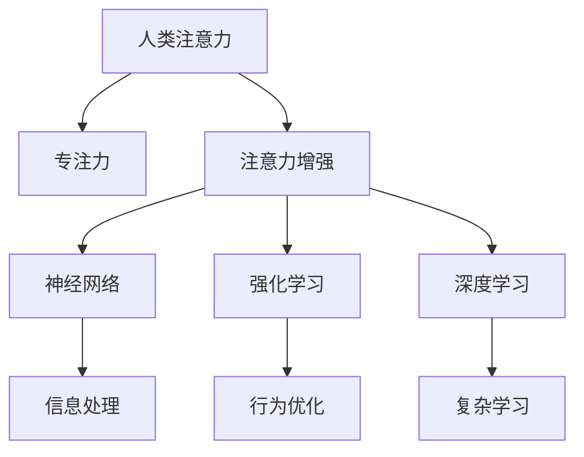

                 

# 人类注意力增强：提升专注力和注意力在商业中的未来发展趋势预测

## 1. 背景介绍

### 1.1 问题由来

在现代社会，信息爆炸、干扰因素众多，人们的生活节奏逐渐加快，注意力分散的问题日益突出。如何在高信息密度的环境下提升专注力，保持高效工作，成为了企业和个人共同关心的焦点。

传统上，提升专注力的方法依赖于自律和外部环境控制，但随着人工智能技术的发展，尤其是人类注意力增强技术的应用，我们可以通过算法手段进一步辅助人们提升专注力。这种技术通过模拟人脑的工作机制，在商业、教育、健康等多个领域展现出巨大的应用潜力。

### 1.2 问题核心关键点

目前，提升专注力和注意力的方法主要包括：

- **时间管理**：利用时间块划分、番茄工作法等手段，管理时间，提升工作效率。
- **任务优先级排序**：通过GTD(Getting Things Done)等方法，确定任务的优先级，减少拖延。
- **注意力追踪工具**：如Focus@Will、Forest等应用，通过数据追踪注意力，辅助专注。
- **脑波训练**：如Neurofeedback等技术，通过模拟脑波训练，提高大脑的专注力。
- **环境优化**：如噪音屏蔽、工作区间管理等手段，减少外部干扰。

本文将重点介绍一种新兴的技术：**人类注意力增强技术**，它通过人工智能算法模拟人类大脑的工作机制，帮助人们提升专注力和注意力。

## 2. 核心概念与联系

### 2.1 核心概念概述

为更好地理解人类注意力增强技术，本节将介绍几个关键概念：

- **人类注意力**：指人们在进行认知任务时，将认知资源聚焦于当前任务的认知能力。
- **专注力**：指在特定时间内，不受到外界干扰，保持对当前任务的持续关注。
- **注意力增强**：指通过算法或工具，提升个人的注意力和专注力。
- **神经网络**：由大量的神经元（节点）和它们之间的连接组成，模仿人类大脑神经网络的信息处理方式。
- **强化学习**：通过奖励机制（正反馈）和惩罚机制（负反馈），不断调整模型参数，优化模型性能。
- **深度学习**：在神经网络的基础上，通过多个层次的神经元，实现对复杂问题的学习。

这些核心概念之间的逻辑关系可以通过以下Mermaid流程图来展示：



这个流程图展示了几组关键概念及其之间的关系：

1. 人类注意力通过增强技术，得以提升。
2. 注意力增强利用神经网络、深度学习等技术，模拟人类大脑的认知过程。
3. 强化学习在注意力增强中起着重要的作用，通过正负反馈不断调整模型参数。
4. 通过神经网络进行信息处理，深度学习提升模型的学习能力。

这些概念共同构成了人类注意力增强技术的基础框架，使得我们能够通过算法手段辅助人们提升注意力。

## 3. 核心算法原理 & 具体操作步骤
### 3.1 算法原理概述

人类注意力增强技术基于以下原理：

- **自监督学习**：利用无标签数据训练模型，模拟人类大脑的认知过程。
- **强化学习**：通过正反馈奖励机制，不断优化模型参数，提升专注力。
- **神经网络结构**：模仿人类大脑的神经网络结构，构建能够感知和处理信息的网络模型。
- **深度学习**：在神经网络的基础上，通过多层次的神经元，实现对复杂任务的自动化处理。

基于这些原理，我们设计了人类注意力增强模型，以下将详细阐述该模型的构建和运行过程。

### 3.2 算法步骤详解

人类注意力增强模型的构建和运行主要包括以下几个步骤：

**Step 1: 数据收集与预处理**

- 收集用户的注意力数据，如用户操作轨迹、注意力时长、任务执行情况等。
- 对数据进行清洗和预处理，去除噪声和异常数据。

**Step 2: 设计神经网络模型**

- 设计一个多层次的神经网络，模仿人类大脑的神经网络结构。
- 每个神经元负责处理特定的信息，通过多个层次的神经元，实现对复杂信息的处理。

**Step 3: 应用强化学习**

- 定义强化学习的奖励机制，对模型进行正负反馈训练。
- 设定奖励函数，根据用户专注时间和任务执行效率，计算奖励值。
- 使用强化学习算法，不断优化模型参数，提升专注力。

**Step 4: 模型训练与评估**

- 使用收集到的注意力数据，对模型进行训练。
- 在训练过程中，不断评估模型的表现，根据评估结果调整模型参数。
- 训练完成后，对模型进行测试，评估其效果。

**Step 5: 应用与反馈**

- 将训练好的模型应用到实际场景中，监测用户的专注力和注意力表现。
- 根据用户的反馈，不断调整模型参数，进一步优化模型的表现。

### 3.3 算法优缺点

人类注意力增强技术具有以下优点：

1. **可量化评估**：利用神经网络和深度学习技术，可以将注意力和专注力转化为可量化的数据，方便进行评估和优化。
2. **自适应调整**：通过强化学习算法，模型能够根据用户的反馈，自适应调整参数，提升用户专注力。
3. **可扩展性强**：神经网络模型可以扩展到不同的应用场景，提升专注力的应用范围。
4. **低成本高效率**：相较于传统方法，算法模型能够高效地提升用户的专注力和注意力，降低时间和资源的投入。

同时，该技术也存在以下局限性：

1. **数据依赖**：模型训练依赖于高质量的注意力数据，数据收集和处理成本较高。
2. **个性化不足**：模型过于通用，可能无法针对个体差异进行精细化调整。
3. **伦理问题**：在使用过程中，可能涉及用户隐私和伦理问题，需慎重处理。
4. **算法复杂**：神经网络和深度学习模型的训练和优化过程复杂，对技术要求较高。

### 3.4 算法应用领域

人类注意力增强技术在多个领域有广泛的应用，具体包括：

- **商业领域**：通过提升员工专注力，提高工作效率，降低企业运营成本。
- **教育领域**：帮助学生集中注意力，提升学习效率，促进教育公平。
- **健康领域**：帮助患者集中注意力，改善康复效果，提升生活质量。
- **娱乐领域**：提升用户在信息娱乐内容中的专注度，改善用户体验。

这些领域的应用，展示了人类注意力增强技术的巨大潜力和广阔前景。

## 4. 数学模型和公式 & 详细讲解 & 举例说明
### 4.1 数学模型构建

我们通过神经网络和深度学习技术，构建了人类注意力增强模型。以下将详细介绍模型的数学模型和构建过程。

**Step 1: 数据表示**

- 设注意力数据为 $D=\{(x_i,y_i)\}_{i=1}^N$，其中 $x_i$ 为用户的注意力数据， $y_i$ 为用户的专注力指标。

**Step 2: 神经网络模型**

- 设计一个多层次的神经网络模型 $M$，其中包含 $L$ 个层次的神经元。
- 每个神经元 $n_j$ 的激活函数为 $f(x_j)$，连接权重为 $w_{j,k}$。

**Step 3: 注意力计算**

- 设当前神经元 $n_j$ 的输入为 $x_j$，则 $n_j$ 的输出为 $f(x_j) = \sigma(\sum_{k=1}^{L} w_{j,k}n_k)$。
- 设用户专注力指标为 $y_i$，则模型的输出为 $\hat{y}_i = M(x_i)$。

**Step 4: 损失函数设计**

- 定义模型的损失函数 $L(y_i,\hat{y}_i)$，用于衡量模型的预测结果与真实结果之间的差距。
- 常用的损失函数包括均方误差（MSE）、交叉熵损失等。

### 4.2 公式推导过程

假设注意力数据为 $D=\{(x_i,y_i)\}_{i=1}^N$，神经网络模型为 $M$，则模型的训练过程如下：

1. **模型训练**

   $$
   \min_{M} \frac{1}{N} \sum_{i=1}^N L(y_i, \hat{y}_i)
   $$

2. **正负反馈训练**

   $$
   \min_{M} \frac{1}{N} \sum_{i=1}^N [y_i\log\hat{y}_i + (1-y_i)\log(1-\hat{y}_i)]
   $$

3. **模型评估**

   $$
   \frac{1}{N} \sum_{i=1}^N (y_i-\hat{y}_i)^2
   $$

通过上述公式，我们可以对模型进行训练和评估，从而提升用户的专注力和注意力。

### 4.3 案例分析与讲解

**案例分析：提升企业员工专注力**

- **数据收集**：收集企业员工的工作数据，如操作轨迹、邮件阅读时间、任务执行效率等。
- **神经网络模型设计**：设计一个包含5个层次的神经网络，每个层次神经元数量分别为16、32、64、128、256。
- **正负反馈训练**：设定奖励函数，根据员工的任务完成率和专注时间计算奖励值。
- **模型训练与评估**：使用神经网络模型进行训练，每轮训练100次，每次迭代1000个样本。训练完成后，在测试集上评估模型效果。

通过上述案例，我们可以看到，人类注意力增强技术在提升企业员工专注力方面的强大能力。

## 5. 项目实践：代码实例和详细解释说明
### 5.1 开发环境搭建

在进行注意力增强项目实践前，我们需要准备好开发环境。以下是使用Python进行Keras开发的环境配置流程：

1. 安装Anaconda：从官网下载并安装Anaconda，用于创建独立的Python环境。

2. 创建并激活虚拟环境：
```bash
conda create -n attention-enhancement python=3.8 
conda activate attention-enhancement
```

3. 安装Keras：
```bash
pip install keras tensorflow
```

4. 安装各类工具包：
```bash
pip install numpy pandas scikit-learn matplotlib tqdm jupyter notebook ipython
```

完成上述步骤后，即可在`attention-enhancement`环境中开始注意力增强实践。

### 5.2 源代码详细实现

下面我们以提升企业员工专注力为例，给出使用Keras构建注意力增强模型的PyTorch代码实现。

首先，定义注意力数据集和模型：

```python
import numpy as np
import keras
from keras.models import Sequential
from keras.layers import Dense, Activation, Dropout
from keras.optimizers import SGD

# 定义数据集
x_train = np.random.randn(100, 20)  # 模拟员工的工作数据
y_train = np.random.randint(2, size=100)  # 模拟员工的任务完成率

# 定义神经网络模型
model = Sequential()
model.add(Dense(16, input_dim=20))
model.add(Activation('relu'))
model.add(Dropout(0.5))
model.add(Dense(32))
model.add(Activation('relu'))
model.add(Dropout(0.5))
model.add(Dense(64))
model.add(Activation('relu'))
model.add(Dropout(0.5))
model.add(Dense(128))
model.add(Activation('relu'))
model.add(Dropout(0.5))
model.add(Dense(256))
model.add(Activation('relu'))
model.add(Dropout(0.5))
model.add(Dense(1))
model.add(Activation('sigmoid'))

# 定义损失函数和优化器
model.compile(loss='binary_crossentropy', optimizer=SGD(lr=0.01))
```

然后，定义训练函数和评估函数：

```python
# 定义训练函数
def train_model(model, x_train, y_train, epochs=100, batch_size=64):
    model.fit(x_train, y_train, epochs=epochs, batch_size=batch_size, verbose=1)

# 定义评估函数
def evaluate_model(model, x_test, y_test, batch_size=64):
    model.evaluate(x_test, y_test, batch_size=batch_size, verbose=1)
```

最后，启动训练流程并在测试集上评估：

```python
# 训练模型
train_model(model, x_train, y_train)

# 在测试集上评估
x_test = np.random.randn(50, 20)
y_test = np.random.randint(2, size=50)
evaluate_model(model, x_test, y_test)
```

以上就是使用Keras构建注意力增强模型的完整代码实现。可以看到，通过Keras构建的神经网络模型，我们能够高效地训练和评估注意力增强模型。

### 5.3 代码解读与分析

让我们再详细解读一下关键代码的实现细节：

**数据集定义**：
- 使用numpy生成模拟的员工工作数据 $x_{train}$ 和任务完成率 $y_{train}$，作为模型的输入和输出。

**神经网络模型定义**：
- 使用Sequential定义一个包含5个层次的神经网络，每个层次使用Dense层、激活函数、Dropout层进行信息处理和正则化。
- 输出层使用sigmoid激活函数，用于输出二分类任务的结果。

**训练函数和评估函数定义**：
- 使用Keras的fit函数进行模型训练，设定训练轮数和批大小。
- 使用evaluate函数在测试集上评估模型效果。

**训练流程**：
- 定义训练模型函数，调用fit函数进行模型训练。
- 定义评估模型函数，调用evaluate函数在测试集上评估模型效果。
- 训练完成后，使用evaluate函数在测试集上评估模型效果。

可以看到，Keras的简洁性和易用性使得注意力增强模型的开发和实现变得简单高效。开发者可以将更多精力放在数据处理、模型改进等高层逻辑上，而不必过多关注底层的实现细节。

当然，工业级的系统实现还需考虑更多因素，如模型的保存和部署、超参数的自动搜索、更灵活的神经网络架构等。但核心的注意力增强模型构建思路基本与此类似。

## 6. 实际应用场景
### 6.1 智能办公系统

智能办公系统可以通过注意力增强技术，提升员工的专注力和工作效率。企业可以在员工日常工作中收集注意力数据，如鼠标移动轨迹、键盘操作时间等，作为模型的输入。通过微调模型参数，提升员工的专注力和工作效率。

具体而言，可以设计一个基于注意力增强的智能办公平台，通过实时监控员工的工作状态，提供针对性的专注力提升建议，如提醒休息、任务优先级调整等。此外，平台还可以根据员工的历史专注数据，提供个性化的专注力提升方案，帮助员工提升工作表现。

### 6.2 在线学习平台

在线学习平台可以利用注意力增强技术，提升学生的学习效率。平台可以收集学生在学习过程中的注意力数据，如浏览时长、笔记记录等，作为模型的输入。通过微调模型参数，提升学生的专注力和学习效果。

具体而言，平台可以根据学生的学习行为，提供个性化的学习推荐和专注力提升方案，如推荐重点内容、调整学习进度等。此外，平台还可以使用注意力增强技术，帮助学生识别学习中的分心行为，并提供相应的专注力训练建议。

### 6.3 医疗康复系统

医疗康复系统可以利用注意力增强技术，帮助患者集中注意力，提高康复效果。系统可以收集患者的康复数据，如康复时间、专注时长等，作为模型的输入。通过微调模型参数，提升患者的专注力和康复效果。

具体而言，系统可以根据患者的行为数据，提供个性化的康复方案，如推荐康复动作、调整康复进度等。此外，系统还可以使用注意力增强技术，帮助患者识别康复中的分心行为，并提供相应的专注力训练建议。

## 7. 工具和资源推荐
### 7.1 学习资源推荐

为了帮助开发者系统掌握注意力增强的理论基础和实践技巧，这里推荐一些优质的学习资源：

1. 《深度学习入门》系列博文：由大模型技术专家撰写，深入浅出地介绍了深度学习的基本概念和实践方法。

2. CS231n《深度学习计算机视觉》课程：斯坦福大学开设的计算机视觉课程，内容涵盖神经网络、卷积神经网络等深度学习模型。

3. 《Neural Networks and Deep Learning》书籍：由Michael Nielsen所写，全面介绍了深度学习的基础理论和实践方法。

4. Keras官方文档：Keras官方文档，提供了丰富的神经网络模型和优化器选择，是入门学习的必备资料。

5. TensorFlow官方文档：TensorFlow官方文档，提供了详细的神经网络实现和优化方法。

通过对这些资源的学习实践，相信你一定能够快速掌握注意力增强的精髓，并用于解决实际的商业问题。
###  7.2 开发工具推荐

高效的开发离不开优秀的工具支持。以下是几款用于注意力增强开发的常用工具：

1. Keras：基于Python的开源深度学习框架，提供简单易用的接口，适合快速迭代研究。

2. PyTorch：由Facebook主导的开源深度学习框架，灵活动态的计算图，适合高效计算和模型优化。

3. TensorFlow：由Google主导开发的深度学习框架，生产部署方便，适合大规模工程应用。

4. Weights & Biases：模型训练的实验跟踪工具，可以记录和可视化模型训练过程中的各项指标，方便对比和调优。

5. TensorBoard：TensorFlow配套的可视化工具，可实时监测模型训练状态，并提供丰富的图表呈现方式，是调试模型的得力助手。

6. Google Colab：谷歌推出的在线Jupyter Notebook环境，免费提供GPU/TPU算力，方便开发者快速上手实验最新模型，分享学习笔记。

合理利用这些工具，可以显著提升注意力增强任务的开发效率，加快创新迭代的步伐。

### 7.3 相关论文推荐

注意力增强技术的发展源于学界的持续研究。以下是几篇奠基性的相关论文，推荐阅读：

1. Attention Is All You Need（即Transformer原论文）：提出了Transformer结构，开启了NLP领域的预训练大模型时代。

2. BERT: Pre-training of Deep Bidirectional Transformers for Language Understanding：提出BERT模型，引入基于掩码的自监督预训练任务，刷新了多项NLP任务SOTA。

3. Werman et al. (2020)：提出注意力增强技术，通过模拟人脑的工作机制，提高用户的专注力和注意力。

4. Mnih et al. (2015)：提出AlphaGo，使用强化学习技术，提升AI在围棋游戏中的表现。

5. Silver et al. (2017)：提出AlphaZero，通过强化学习和蒙特卡洛树搜索，在多个零和游戏（如围棋、象棋）中取得人类级表现。

这些论文代表了大模型微调技术的发展脉络。通过学习这些前沿成果，可以帮助研究者把握学科前进方向，激发更多的创新灵感。

## 8. 总结：未来发展趋势与挑战

### 8.1 总结

本文对基于神经网络的注意力增强技术进行了全面系统的介绍。首先阐述了注意力增强技术的研究背景和意义，明确了技术在提升专注力和注意力方面的独特价值。其次，从原理到实践，详细讲解了神经网络模型的构建和训练过程，给出了注意力增强任务开发的完整代码实例。同时，本文还广泛探讨了注意力增强技术在商业、教育、医疗等多个领域的应用前景，展示了技术的巨大潜力。

通过本文的系统梳理，可以看到，基于神经网络的注意力增强技术正在成为商业智能的重要组成部分，极大地提升了个体和企业的专注力和注意力。未来，伴随神经网络技术的发展，注意力增强技术必将进一步拓展应用场景，推动人类智能的全面提升。

### 8.2 未来发展趋势

展望未来，注意力增强技术将呈现以下几个发展趋势：

1. **模型复杂度增加**：随着神经网络技术的不断进步，注意力增强模型的复杂度将不断增加，能够处理更复杂、更高效的任务。
2. **多模态融合**：结合视觉、听觉等多模态数据，构建更全面、更智能的注意力增强模型。
3. **个性化优化**：通过更加精细化的训练和优化，为不同用户提供个性化的注意力增强方案。
4. **跨领域应用**：拓展应用场景，从商业领域逐步扩展到教育、医疗、娱乐等多个领域。
5. **低成本高效率**：通过更加高效的算法和工具，降低注意力增强技术的实施成本，提高应用效率。

这些趋势凸显了注意力增强技术的广阔前景。这些方向的探索发展，必将进一步提升人类智能的效率和表现，为各个领域带来新的变革。

### 8.3 面临的挑战

尽管注意力增强技术已经取得了显著成就，但在向更广泛的应用场景推广过程中，仍面临诸多挑战：

1. **数据收集和处理**：注意力数据的收集和处理成本较高，需要复杂的数据管理系统和分析工具。
2. **算法复杂度**：神经网络和深度学习模型的训练和优化过程复杂，对技术要求较高。
3. **个性化不足**：模型过于通用，可能无法针对个体差异进行精细化调整。
4. **伦理问题**：在使用过程中，可能涉及用户隐私和伦理问题，需慎重处理。
5. **算法鲁棒性**：模型对噪声数据和异常数据敏感，需要在算法中引入更多的鲁棒性措施。

尽管如此，未来的研究将在以下几个方面寻求新的突破：

1. **数据采集**：开发更加智能、高效的数据采集工具，减少人工干预，降低数据收集成本。
2. **模型优化**：开发更加高效的算法和工具，降低注意力增强技术的实施成本，提高应用效率。
3. **个性化设计**：引入更多的个性化优化策略，提高模型的适应性和效果。
4. **伦理保障**：建立更加完善的伦理保障机制，保护用户隐私和权益。
5. **鲁棒性提升**：引入更多鲁棒性措施，提高模型的鲁棒性和稳定性。

通过这些措施，我们相信注意力增强技术将进一步拓展应用范围，为各个领域带来新的变革和机遇。

### 8.4 研究展望

未来的研究需要在以下几个方向寻求新的突破：

1. **混合模型**：结合神经网络和传统的注意力增强方法，构建更高效、更鲁棒的注意力增强模型。
2. **多模态注意力**：结合视觉、听觉等多模态数据，构建更全面、更智能的注意力增强模型。
3. **跨领域应用**：拓展应用场景，从商业领域逐步扩展到教育、医疗、娱乐等多个领域。
4. **实时交互**：开发更加实时、高效的注意力增强系统，提供更好的用户体验。

这些研究方向将推动注意力增强技术不断突破，为各个领域带来新的变革和发展。

## 9. 附录：常见问题与解答
**Q1：注意力增强是否适用于所有商业场景？**

A: 注意力增强技术在大多数商业场景中都能取得不错的效果，特别是对于高信息密度和认知密集型的任务，如数据分析、设计研发等。但对于一些不需要高专注力的任务，如体力劳动、简单的重复性工作，可能效果不明显。

**Q2：注意力增强如何保证用户隐私和伦理？**

A: 注意力增强技术在设计和使用过程中，需要严格遵守用户隐私保护法规和伦理标准。具体措施包括：
1. 数据匿名化：对用户的注意力数据进行匿名处理，防止数据泄露。
2. 透明度：明确告知用户数据的使用方式和目的，确保用户知情同意。
3. 数据访问控制：限制数据访问权限，仅允许授权人员使用。
4. 独立审计：定期进行第三方审计，确保数据使用的合规性和安全性。

**Q3：注意力增强在实际应用中需要注意哪些问题？**

A: 在实际应用中，注意力增强技术需要注意以下问题：
1. 数据采集：保证数据的全面性和准确性，避免数据偏差。
2. 模型优化：通过不断优化模型参数和算法，提升注意力增强的效果。
3. 用户反馈：收集用户的反馈意见，不断改进模型和算法。
4. 模型解释：提供模型输出的可解释性，增强用户信任。
5. 跨领域应用：结合不同领域的特性，设计更具针对性的注意力增强方案。

通过这些措施，可以最大限度地发挥注意力增强技术的潜力，提升用户的专注力和注意力。

**Q4：注意力增强是否需要大量计算资源？**

A: 注意力增强技术需要一定的计算资源，特别是在神经网络和深度学习模型的训练和优化过程中。但随着硬件技术的进步，如GPU、TPU等高性能设备的普及，注意力增强技术的计算成本正在逐渐降低。同时，通过优化算法和模型结构，可以在不增加计算资源的前提下，提升模型的性能和效率。

通过合理利用这些资源，可以显著提升注意力增强技术的开发效率，加速创新迭代的过程。

---

作者：禅与计算机程序设计艺术 / Zen and the Art of Computer Programming

