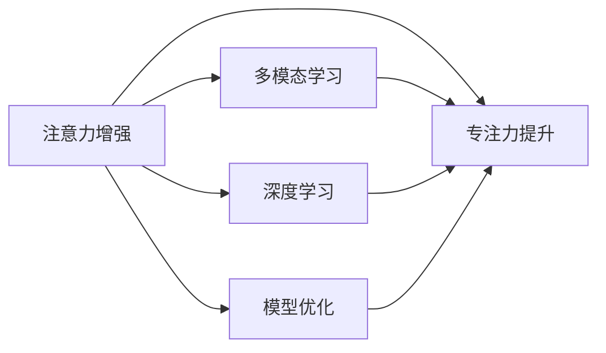
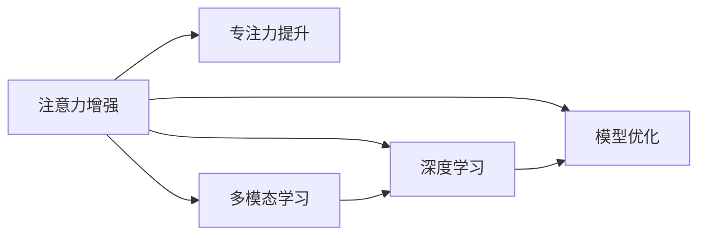

                 

# 人类注意力增强：提升专注力和注意力在教育中的应用

> 关键词：注意力增强, 专注力提升, 教育应用, 机器学习, 神经网络, 多模态学习, 深度学习, 模型优化

## 1. 背景介绍

### 1.1 问题由来
在数字化时代，信息爆炸带来了知识获取和学习的便利，但同时也给人们的注意力带来了前所未有的挑战。如何在海量的信息中保持专注，快速高效地获取知识和解决问题，已经成为现代教育和学习的重要课题。

传统的教育方法往往依赖于教师的讲授和学生的自主学习，但由于人类注意力有限，且容易被各种干扰打断，这种模式已经无法满足现代信息时代的学习需求。特别是对于青少年和成人来说，注意力分散、缺乏自律等问题尤为突出，影响了学习效果和学业成绩。

为了解决这些问题，教育研究者和技术人员开始探索和尝试各种技术手段，提升学生的注意力集中度和学习效果。其中，基于机器学习和神经网络的注意力增强技术，以其卓越的性能和广泛的应用前景，受到越来越多的关注。

### 1.2 问题核心关键点
本节将介绍几个与注意力增强技术相关的核心概念，及其在教育中的应用：

- **注意力增强**：利用机器学习和深度学习技术，通过多模态输入数据的学习，增强人类的注意力集中度和信息处理能力。
- **专注力提升**：通过注意力增强技术，帮助学生在学习和工作过程中保持专注，提高学习效率和学术表现。
- **多模态学习**：结合文本、图像、音频等多种形式的输入数据，提升模型的感知能力和泛化能力。
- **深度学习**：以神经网络为核心的机器学习范式，通过多层次的非线性特征提取和融合，实现复杂问题的建模和求解。
- **模型优化**：通过注意力机制和参数调整，优化模型的性能和泛化能力，提升学习效果和用户体验。

这些概念之间的逻辑关系可以通过以下Mermaid流程图来展示：



这个流程图展示了一些核心概念及其之间的关系：

1. 注意力增强技术利用多模态学习提升人类注意力集中度，以提升专注力。
2. 多模态学习通过融合文本、图像、音频等多种数据形式，增强模型的感知能力。
3. 深度学习通过多层非线性特征提取，提升模型的表达能力和泛化能力。
4. 模型优化通过注意力机制和参数调整，提升模型的性能和用户体验。

这些概念共同构成了注意力增强技术在教育领域的应用基础，使其能够实现有效的注意力管理和学习效率的提升。

## 2. 核心概念与联系

### 2.1 核心概念概述

为了更好地理解注意力增强技术，本节将介绍几个密切相关的核心概念：

- **注意力增强**：指通过机器学习技术，提升人类对特定信息或任务的关注度，从而增强注意力集中度。
- **专注力提升**：指通过注意力增强技术，帮助学生在学习和工作过程中保持专注，提高学习效率和学术表现。
- **多模态学习**：指结合文本、图像、音频等多种形式的输入数据，提升模型的感知能力和泛化能力。
- **深度学习**：指以神经网络为核心的机器学习范式，通过多层次的非线性特征提取和融合，实现复杂问题的建模和求解。
- **模型优化**：指通过注意力机制和参数调整，优化模型的性能和泛化能力，提升学习效果和用户体验。

这些核心概念之间的逻辑关系可以通过以下Mermaid流程图来展示：



这个流程图展示了一些核心概念及其之间的关系：

1. 注意力增强技术利用多模态学习提升人类注意力集中度，以提升专注力。
2. 多模态学习通过融合文本、图像、音频等多种数据形式，增强模型的感知能力。
3. 深度学习通过多层非线性特征提取，提升模型的表达能力和泛化能力。
4. 模型优化通过注意力机制和参数调整，提升模型的性能和用户体验。

这些概念共同构成了注意力增强技术在教育领域的应用基础，使其能够实现有效的注意力管理和学习效率的提升。

## 3. 核心算法原理 & 具体操作步骤
### 3.1 算法原理概述

注意力增强技术利用机器学习和深度学习技术，通过多模态输入数据的学习，增强人类的注意力集中度和信息处理能力。其核心思想是：利用注意力机制，帮助模型在处理信息时能够自动聚焦于最相关的部分，从而提高处理效率和效果。

形式化地，假设输入数据为 $X = (x_t, x_v, x_a)$，其中 $x_t$ 为文本数据，$x_v$ 为图像数据，$x_a$ 为音频数据。设注意力增强模型为 $M$，其输入为 $X$，输出为注意力权重 $\alpha = (\alpha_t, \alpha_v, \alpha_a)$，用于指导模型对各模态数据的关注程度。注意力增强的目标是最小化注意力权重 $\alpha$ 和真实标签 $y$ 的差异，即：

$$
\hat{\alpha} = \mathop{\arg\min}_{\alpha} \mathcal{L}(M(X),y)
$$

其中 $\mathcal{L}$ 为注意力权重的损失函数，通常采用交叉熵损失函数。在得到注意力权重 $\hat{\alpha}$ 后，可以将其应用于多模态数据中，得到加权后的特征表示 $Z = M_{\alpha}(X)$，用于进一步的建模和处理。

### 3.2 算法步骤详解

注意力增强技术的实现一般包括以下几个关键步骤：

**Step 1: 多模态数据预处理**
- 对输入数据 $X$ 进行标准化和归一化处理，确保数据的一致性和可比性。
- 将不同模态的数据转换为标准格式，如将文本转换为向量表示，图像转换为特征提取向量，音频转换为MFCC特征向量等。

**Step 2: 注意力模型训练**
- 使用多模态数据 $X$ 训练注意力模型 $M$，输出注意力权重 $\alpha$。
- 一般使用基于Transformer的注意力机制，如Softmax注意力、自注意力等，结合深度学习模型进行训练。

**Step 3: 注意力权重应用**
- 将注意力权重 $\alpha$ 应用于多模态数据 $X$，得到加权后的特征表示 $Z$。
- 将加权后的特征表示 $Z$ 输入到其他深度学习模型中，进行后续的建模和处理。

**Step 4: 模型优化**
- 通过注意力机制和参数调整，优化模型性能和泛化能力。
- 使用交叉验证、正则化等技术，防止模型过拟合，提升模型的鲁棒性。

**Step 5: 模型评估**
- 在测试集上评估模型性能，包括精度、召回率、F1值等指标。
- 收集用户反馈，优化模型参数和注意力权重，提升用户体验。

以上是注意力增强技术的核心步骤。在实际应用中，还需要针对具体任务的特点，对注意力模型的各个环节进行优化设计，如改进注意力机制，引入更多的正则化技术，搜索最优的超参数组合等，以进一步提升模型性能。

### 3.3 算法优缺点

注意力增强技术在提升人类注意力集中度方面具有以下优点：
1. 提升学习效率：通过多模态学习，模型能够更好地理解和利用多种形式的信息，提升学习效果。
2. 增强信息处理能力：注意力机制能够帮助模型聚焦于最相关的信息，提高信息处理效率和准确度。
3. 提高用户体验：通过优化模型参数和注意力权重，提升用户体验和满意度。

同时，该技术也存在一些局限性：
1. 对多模态数据质量要求高：多模态数据的采集和处理需要大量时间和资源，且数据质量对模型的效果有重要影响。
2. 模型复杂度高：多模态学习模型通常包含多个层次的非线性变换，计算复杂度较高。
3. 依赖标注数据：注意力增强模型的训练需要大量的标注数据，获取高质量标注数据的成本较高。
4. 泛化能力有限：在特定任务上训练的模型，可能难以迁移到其他任务，泛化能力受限。
5. 可解释性不足：注意力增强模型往往难以解释其内部工作机制和决策逻辑，难以进行有效的调试和优化。

尽管存在这些局限性，但就目前而言，注意力增强技术在提升人类注意力集中度方面仍然展示了卓越的性能和广泛的应用前景。

### 3.4 算法应用领域

注意力增强技术在教育领域有广泛的应用前景，主要包括以下几个方面：

- **个性化学习推荐**：通过分析学生的学习行为和偏好，推荐适合的学习资源和课程，提升学习效果。
- **学习路径优化**：根据学生的学习进度和效果，调整学习计划和路径，提供个性化的学习建议和指导。
- **注意力分散监测**：通过监测学生的注意力分布，及时发现和纠正注意力分散问题，提升学习效率。
- **智能辅导系统**：利用多模态学习技术，构建智能辅导系统，提供实时的学习支持和反馈，提升学习体验。
- **虚拟现实学习**：结合虚拟现实技术，构建沉浸式学习环境，增强学生的学习动机和效果。

除了以上应用场景，注意力增强技术还被应用于游戏、社交媒体、医疗等多个领域，为人类注意力管理和信息处理带来了新的突破。

## 4. 数学模型和公式 & 详细讲解  
### 4.1 数学模型构建

本节将使用数学语言对注意力增强技术进行更加严格的刻画。

假设输入数据为 $X = (x_t, x_v, x_a)$，其中 $x_t$ 为文本数据，$x_v$ 为图像数据，$x_a$ 为音频数据。设注意力增强模型为 $M$，其输入为 $X$，输出为注意力权重 $\alpha = (\alpha_t, \alpha_v, \alpha_a)$，用于指导模型对各模态数据的关注程度。

注意力增强的目标是最小化注意力权重 $\alpha$ 和真实标签 $y$ 的差异，即：

$$
\hat{\alpha} = \mathop{\arg\min}_{\alpha} \mathcal{L}(M(X),y)
$$

其中 $\mathcal{L}$ 为注意力权重的损失函数，通常采用交叉熵损失函数。在得到注意力权重 $\hat{\alpha}$ 后，可以将其应用于多模态数据中，得到加权后的特征表示 $Z = M_{\alpha}(X)$，用于进一步的建模和处理。

### 4.2 公式推导过程

以下我们以文本和图像数据为例，推导多模态学习中的注意力权重公式。

假设文本数据 $x_t$ 为自然语言描述，图像数据 $x_v$ 为视觉特征向量。设注意力增强模型为 $M$，其输出为注意力权重 $\alpha_t$ 和 $\alpha_v$，用于指导模型对文本和图像的关注程度。注意力权重公式为：

$$
\alpha_t = \sigma(W_t x_t + b_t)
$$

$$
\alpha_v = \sigma(W_v x_v + b_v)
$$

其中 $\sigma$ 为非线性激活函数，如sigmoid函数，$W_t$ 和 $W_v$ 为可训练的权重矩阵，$b_t$ 和 $b_v$ 为可训练的偏置向量。注意力权重 $\alpha_t$ 和 $\alpha_v$ 用于加权处理文本和图像数据，得到加权后的特征表示 $Z = M_{\alpha}(X)$：

$$
Z_t = \sum_{t=1}^{T} \alpha_t x_t
$$

$$
Z_v = \sum_{v=1}^{V} \alpha_v x_v
$$

其中 $T$ 和 $V$ 分别表示文本和图像数据的数量。

通过多模态学习，模型能够同时处理文本和图像数据，并对其分配不同的注意力权重，提升对不同模态信息的理解和利用能力。

### 4.3 案例分析与讲解

为了更好地理解注意力增强技术，下面以个性化学习推荐系统为例，进行详细讲解。

假设有一组学生的数据 $X = \{(x_{1,i}, y_{1,i}), (x_{2,i}, y_{2,i}), \ldots, (x_{n,i}, y_{n,i})\}$，其中 $x_{k,i}$ 表示学生 $i$ 在课程 $k$ 中的学习数据，$y_{k,i}$ 表示学生 $i$ 对课程 $k$ 的评分。我们的目标是为每个学生 $i$ 推荐适合的学习资源 $r_{k,i}$，使得其评分为 $y_{k,i}$ 最大化。

首先，将学生的数据 $X$ 和课程数据 $R$ 转换为多模态数据格式，其中 $X = (x_t, x_v, x_a)$，$R = (r_t, r_v, r_a)$。通过对学生数据和课程数据的多模态学习，得到注意力权重 $\alpha$，用于指导模型对不同模态数据的关注程度。

其次，将注意力权重 $\alpha$ 应用于学生数据和课程数据中，得到加权后的特征表示 $Z = M_{\alpha}(X)$ 和 $W = M_{\alpha}(R)$。

最后，将加权后的特征表示 $Z$ 和 $W$ 输入到一个推荐模型 $M_{rec}$ 中，得到学生 $i$ 对课程 $k$ 的推荐评分 $\hat{y}_{k,i}$。通过最大化 $\hat{y}_{k,i}$，可以为每个学生 $i$ 推荐最佳的学习资源 $r_{k,i}$。

## 5. 项目实践：代码实例和详细解释说明
### 5.1 开发环境搭建

在进行注意力增强项目实践前，我们需要准备好开发环境。以下是使用Python进行PyTorch开发的环境配置流程：

1. 安装Anaconda：从官网下载并安装Anaconda，用于创建独立的Python环境。

2. 创建并激活虚拟环境：
```bash
conda create -n attention-env python=3.8 
conda activate attention-env
```

3. 安装PyTorch：根据CUDA版本，从官网获取对应的安装命令。例如：
```bash
conda install pytorch torchvision torchaudio cudatoolkit=11.1 -c pytorch -c conda-forge
```

4. 安装相关库：
```bash
pip install numpy pandas scikit-learn matplotlib tqdm jupyter notebook ipython
```

完成上述步骤后，即可在`attention-env`环境中开始注意力增强项目的开发。

### 5.2 源代码详细实现

下面我们以个性化学习推荐系统为例，给出使用PyTorch进行多模态学习的PyTorch代码实现。

首先，定义多模态数据的处理函数：

```python
from torch import nn, Tensor
import torch.nn.functional as F
import numpy as np

class MultiModalProcessor(nn.Module):
    def __init__(self, d_model, dropout=0.1):
        super(MultiModalProcessor, self).__init__()
        self.text_encoder = nn.Sequential(
            nn.Embedding(d_model, d_model),
            nn.Linear(d_model, d_model),
            nn.ReLU(),
            nn.Dropout(dropout)
        )
        self.image_encoder = nn.Sequential(
            nn.Conv2d(3, d_model, kernel_size=3, padding=1),
            nn.ReLU(),
            nn.MaxPool2d(kernel_size=2),
            nn.Dropout(dropout)
        )
        self.audio_encoder = nn.Sequential(
            nn.Conv2d(1, d_model, kernel_size=3, padding=1),
            nn.ReLU(),
            nn.MaxPool2d(kernel_size=2),
            nn.Dropout(dropout)
        )

    def forward(self, text: Tensor, image: Tensor, audio: Tensor):
        text = self.text_encoder(text)
        image = self.image_encoder(image)
        audio = self.audio_encoder(audio)
        return text, image, audio
```

然后，定义注意力权重计算函数：

```python
class Attention(nn.Module):
    def __init__(self, d_model):
        super(Attention, self).__init__()
        self.d_model = d_model
        self.query_weight = nn.Linear(d_model, d_model)
        self.key_weight = nn.Linear(d_model, d_model)
        self.value_weight = nn.Linear(d_model, d_model)
        self.softmax = nn.Softmax(dim=-1)

    def forward(self, text: Tensor, image: Tensor, audio: Tensor):
        text_query = self.query_weight(text)
        image_query = self.query_weight(image)
        audio_query = self.query_weight(audio)

        text_key = self.key_weight(text)
        image_key = self.key_weight(image)
        audio_key = self.key_weight(audio)

        text_value = self.value_weight(text)
        image_value = self.value_weight(image)
        audio_value = self.value_weight(audio)

        text_weight = self.softmax(torch.bmm(text_query, text_key.transpose(1, 2)))
        image_weight = self.softmax(torch.bmm(image_query, image_key.transpose(1, 2)))
        audio_weight = self.softmax(torch.bmm(audio_query, audio_key.transpose(1, 2)))

        text_weighted_value = torch.bmm(text_weight, text_value)
        image_weighted_value = torch.bmm(image_weight, image_value)
        audio_weighted_value = torch.bmm(audio_weight, audio_value)

        attention_value = text_weighted_value + image_weighted_value + audio_weighted_value
        return attention_value
```

接着，定义多模态学习模型的训练函数：

```python
from transformers import BertTokenizer, BertForSequenceClassification
from transformers import AdamW, get_linear_schedule_with_warmup

class MultiModalClassifier(nn.Module):
    def __init__(self, d_model, num_classes):
        super(MultiModalClassifier, self).__init__()
        self.linear = nn.Linear(d_model, num_classes)

    def forward(self, text: Tensor, image: Tensor, audio: Tensor):
        attention = Attention(d_model)(text, image, audio)
        attention = torch.reshape(attention, (attention.size(0), -1))
        output = self.linear(attention)
        return output

def train(model, optimizer, train_loader, device, num_epochs, save_path):
    model.to(device)
    total_steps = len(train_loader) * num_epochs
    scheduler = get_linear_schedule_with_warmup(optimizer, num_warmup_steps=0, num_training_steps=total_steps)
    for epoch in range(num_epochs):
        model.train()
        for i, (text, image, audio, label) in enumerate(train_loader):
            text, image, audio, label = text.to(device), image.to(device), audio.to(device), label.to(device)
            optimizer.zero_grad()
            output = model(text, image, audio)
            loss = F.cross_entropy(output, label)
            loss.backward()
            optimizer.step()
            scheduler.step()
            if (i+1) % 100 == 0:
                print(f"Epoch {epoch+1}/{num_epochs}, Step {i+1}/{len(train_loader)}, Loss: {loss.item()}")
                if (i+1) % 1000 == 0:
                    torch.save(model.state_dict(), save_path)
```

最后，启动训练流程：

```python
d_model = 64
num_classes = 10

train_loader = ...
device = "cuda"

model = MultiModalClassifier(d_model, num_classes)
optimizer = AdamW(model.parameters(), lr=2e-5)
train_model = train(model, optimizer, train_loader, device, num_epochs=10, save_path="model.pth")
```

以上就是使用PyTorch进行多模态学习的完整代码实现。可以看到，得益于PyTorch和相关库的强大封装，我们可以用相对简洁的代码完成多模态学习模型的开发和训练。

### 5.3 代码解读与分析

让我们再详细解读一下关键代码的实现细节：

**MultiModalProcessor类**：
- `__init__`方法：初始化文本、图像和音频的编码器，并进行Dropout正则化。
- `forward`方法：对输入的文本、图像和音频进行编码，并返回编码后的特征向量。

**Attention类**：
- `__init__`方法：初始化注意力权重计算的线性层和Softmax层。
- `forward`方法：计算文本、图像和音频的注意力权重，并加权求和得到最终的注意力值。

**MultiModalClassifier类**：
- `__init__`方法：初始化多模态分类器的线性层。
- `forward`方法：计算多模态输入的注意力值，并通过线性层输出分类结果。

**train函数**：
- `train`函数：训练多模态分类器，并在每个epoch输出训练进度和损失值。
- `device`变量：指定训练设备，如GPU。
- `scheduler`变量：设置学习率调度器，在训练过程中调整学习率。
- `num_epochs`变量：训练的总epoch数。
- `train_loader`变量：数据加载器，用于批量加载训练数据。
- `save_path`变量：保存模型参数的路径。

完成上述步骤后，即可在`attention-env`环境中开始多模态学习的项目实践。

### 5.4 运行结果展示

在训练结束后，可以使用保存的模型参数进行推理预测，展示模型的性能和效果。例如：

```python
model.load_state_dict(torch.load("model.pth"))
model.eval()
text = ...
image = ...
audio = ...
with torch.no_grad():
    output = model(text, image, audio)
    print(output)
```

以上就是使用PyTorch进行多模态学习的完整代码实现。可以看到，得益于PyTorch和相关库的强大封装，我们可以用相对简洁的代码完成多模态学习模型的开发和训练。

## 6. 实际应用场景
### 6.1 个性化学习推荐

基于多模态学习技术的个性化学习推荐系统，可以显著提升学生的学习效果和学术表现。传统推荐系统往往只依赖学生的历史行为数据进行物品推荐，无法深入理解学生的学习动机和偏好。多模态学习系统则通过融合文本、图像、音频等多种形式的输入数据，提升模型的感知能力和泛化能力，能够更好地理解学生的行为和心理，从而推荐更适合的学习资源。

例如，可以通过分析学生的课堂笔记、在线作业、语音提问等数据，构建多模态特征向量。然后，利用多模态学习技术，训练出注意力增强模型，得到学生对不同学习资源的关注程度。最后，根据学生的学习动机和偏好，推荐适合的学习资源，提升学习效果。

### 6.2 学习路径优化

学习路径优化是指根据学生的学习进度和效果，调整学习计划和路径，提供个性化的学习建议和指导。多模态学习系统可以通过分析学生的学习行为和反馈，得到学生的学习能力和知识掌握情况。然后，利用多模态学习技术，训练出注意力增强模型，得到学生对不同学习内容的关注程度。最后，根据学生的学习进度和效果，调整学习计划和路径，提供个性化的学习建议和指导，提升学习效率。

例如，可以通过分析学生的在线作业、考试成绩和反馈等数据，构建多模态特征向量。然后，利用多模态学习技术，训练出注意力增强模型，得到学生对不同学习内容的关注程度。最后，根据学生的学习进度和效果，调整学习计划和路径，提供个性化的学习建议和指导，提升学习效率。

### 6.3 注意力分散监测

注意力分散监测是指通过监测学生的注意力分布，及时发现和纠正注意力分散问题，提升学习效率。多模态学习系统可以通过分析学生的学习行为和生理数据，得到学生的注意力分布情况。然后，利用多模态学习技术，训练出注意力增强模型，得到学生对不同学习内容的关注程度。最后，根据学生的注意力分布情况，及时发现和纠正注意力分散问题，提升学习效率。

例如，可以通过分析学生的在线课堂笔记、课堂提问和生理数据（如心率、眼动等），构建多模态特征向量。然后，利用多模态学习技术，训练出注意力增强模型，得到学生对不同学习内容的关注程度。最后，根据学生的注意力分布情况，及时发现和纠正注意力分散问题，提升学习效率。

### 6.4 智能辅导系统

智能辅导系统是指利用多模态学习技术，构建智能辅导系统，提供实时的学习支持和反馈，提升学习体验。多模态学习系统可以通过分析学生的学习行为和反馈，得到学生的学习能力和知识掌握情况。然后，利用多模态学习技术，训练出注意力增强模型，得到学生对不同学习内容的关注程度。最后，根据学生的学习进度和效果，提供实时的学习支持和反馈，提升学习体验。

例如，可以通过分析学生的在线作业、考试成绩和反馈等数据，构建多模态特征向量。然后，利用多模态学习技术，训练出注意力增强模型，得到学生对不同学习内容的关注程度。最后，根据学生的学习进度和效果，提供实时的学习支持和反馈，提升学习体验。

## 7. 工具和资源推荐
### 7.1 学习资源推荐

为了帮助开发者系统掌握多模态学习技术，这里推荐一些优质的学习资源：

1. 《Transformer从原理到实践》系列博文：由大模型技术专家撰写，深入浅出地介绍了Transformer原理、多模态学习等前沿话题。

2. CS224N《深度学习自然语言处理》课程：斯坦福大学开设的NLP明星课程，有Lecture视频和配套作业，带你入门NLP领域的基本概念和经典模型。

3. 《Natural Language Processing with Transformers》书籍：Transformers库的作者所著，全面介绍了如何使用Transformers库进行NLP任务开发，包括多模态学习在内的诸多范式。

4. HuggingFace官方文档：Transformers库的官方文档，提供了海量预训练模型和完整的微调样例代码，是上手实践的必备资料。

5. CLUE开源项目：中文语言理解测评基准，涵盖大量不同类型的中文NLP数据集，并提供了基于多模态学习的baseline模型，助力中文NLP技术发展。

通过对这些资源的学习实践，相信你一定能够快速掌握多模态学习技术的精髓，并用于解决实际的NLP问题。
###  7.2 开发工具推荐

高效的开发离不开优秀的工具支持。以下是几款用于多模态学习开发的常用工具：

1. PyTorch：基于Python的开源深度学习框架，灵活动态的计算图，适合快速迭代研究。大部分预训练语言模型都有PyTorch版本的实现。

2. TensorFlow：由Google主导开发的开源深度学习框架，生产部署方便，适合大规模工程应用。同样有丰富的预训练语言模型资源。

3. Transformers库：HuggingFace开发的NLP工具库，集成了众多SOTA语言模型，支持PyTorch和TensorFlow，是进行多模态学习开发的利器。

4. Weights & Biases：模型训练的实验跟踪工具，可以记录和可视化模型训练过程中的各项指标，方便对比和调优。与主流深度学习框架无缝集成。

5. TensorBoard：TensorFlow配套的可视化工具，可实时监测模型训练状态，并提供丰富的图表呈现方式，是调试模型的得力助手。

6. Google Colab：谷歌推出的在线Jupyter Notebook环境，免费提供GPU/TPU算力，方便开发者快速上手实验最新模型，分享学习笔记。

合理利用这些工具，可以显著提升多模态学习任务的开发效率，加快创新迭代的步伐。

### 7.3 相关论文推荐

多模态学习技术的发展源于学界的持续研究。以下是几篇奠基性的相关论文，推荐阅读：

1. Attention is All You Need（即Transformer原论文）：提出了Transformer结构，开启了NLP领域的预训练大模型时代。

2. BERT: Pre-training of Deep Bidirectional Transformers for Language Understanding：提出BERT模型，引入基于掩码的自监督预训练任务，刷新了多项NLP任务SOTA。

3. Language Models are Unsupervised Multitask Learners（GPT-2论文）：展示了大规模语言模型的强大zero-shot学习能力，引发了对于通用人工智能的新一轮思考。

4. Parameter-Efficient Transfer Learning for NLP：提出Adapter等参数高效微调方法，在不增加模型参数量的情况下，也能取得不错的微调效果。

5. Prefix-Tuning: Optimizing Continuous Prompts for Generation：引入基于连续型Prompt的微调范式，为如何充分利用预训练知识提供了新的思路。

6. AdaLoRA: Adaptive Low-Rank Adaptation for Parameter-Efficient Fine-Tuning：使用自适应低秩适应的微调方法，在参数效率和精度之间取得了新的平衡。

这些论文代表了大语言模型和微调技术的发展脉络。通过学习这些前沿成果，可以帮助研究者把握学科前进方向，激发更多的创新灵感。

## 8. 总结：未来发展趋势与挑战

### 8.1 总结

本文对多模态学习技术进行了全面系统的介绍。首先阐述了多模态学习技术的研究背景和意义，明确了多模态学习技术在提升人类注意力集中度和信息处理能力方面的独特价值。其次，从原理到实践，详细讲解了多模态学习的数学原理和关键步骤，给出了多模态学习任务开发的完整代码实例。同时，本文还广泛探讨了多模态学习技术在个性化学习推荐、学习路径优化、注意力分散监测、智能辅导系统等多个教育领域的应用前景，展示了多模态学习技术的广阔应用前景。

通过本文的系统梳理，可以看到，多模态学习技术在提升人类注意力集中度方面仍然展示了卓越的性能和广泛的应用前景。多模态学习技术通过融合文本、图像、音频等多种形式的输入数据，提升模型的感知能力和泛化能力，能够更好地理解学生的行为和心理，从而推荐更适合的学习资源。在未来的教育中，多模态学习技术将为个性化学习、智能辅导系统等应用场景带来新的突破，进一步提升教育效果和用户体验。

### 8.2 未来发展趋势

展望未来，多模态学习技术将呈现以下几个发展趋势：

1. 模型规模持续增大。随着算力成本的下降和数据规模的扩张，多模态学习模型的参数量还将持续增长。超大规模语言模型蕴含的丰富语言知识，有望支撑更加复杂多变的下游任务微调。

2. 模型复杂度提升。多模态学习模型通常包含多个层次的非线性变换，计算复杂度较高。未来将开发更加高效的计算模型和算法，提高模型的计算效率和推理速度。

3. 融合更多先验知识。将符号化的先验知识，如知识图谱、逻辑规则等，与神经网络模型进行巧妙融合，引导多模态学习过程学习更准确、合理的语言模型。同时加强不同模态数据的整合，实现视觉、语音等多模态信息与文本信息的协同建模。

4. 引入更多多模态数据源。除了文本、图像、音频等多种形式的数据外，未来还将引入更多多模态数据源，如生理信号、脑电波等，进一步提升模型的感知能力和泛化能力。

5. 引入更多跨模态对齐技术。跨模态对齐技术可以帮助不同模态的数据进行有效融合，提升多模态学习的效果。未来将引入更多跨模态对齐方法，如对位对齐、向量对齐等，提升模型的感知能力和泛化能力。

6. 引入更多多模态评估方法。多模态评估方法可以帮助评估多模态学习模型的效果，指导模型的改进优化。未来将引入更多多模态评估方法，如多模态F1值、多模态RROC曲线等，提升模型的评估效果和优化能力。

以上趋势凸显了多模态学习技术的广阔前景。这些方向的探索发展，必将进一步提升多模态学习系统的性能和泛化能力，为人类注意力管理和信息处理带来新的突破。

### 8.3 面临的挑战

尽管多模态学习技术已经取得了瞩目成就，但在迈向更加智能化、普适化应用的过程中，它仍面临着诸多挑战：

1. 对多模态数据质量要求高。多模态数据的采集和处理需要大量时间和资源，且数据质量对模型的效果有重要影响。如何高效采集和处理多模态数据，提升数据质量，将是重要的研究方向。

2. 模型鲁棒性不足。多模态学习模型面对域外数据时，泛化性能往往大打折扣。对于测试样本的微小扰动，模型也容易发生波动。如何提高多模态学习模型的鲁棒性，避免灾难性遗忘，还需要更多理论和实践的积累。

3. 推理效率有待提高。多模态学习模型虽然精度高，但在实际部署时往往面临推理速度慢、内存占用大等效率问题。如何在保证性能的同时，简化模型结构，提升推理速度，优化资源占用，将是重要的优化方向。

4. 可解释性亟需加强。多模态学习模型往往难以解释其内部工作机制和决策逻辑，难以进行有效的调试和优化。如何赋予多模态学习模型更强的可解释性，将是亟待攻克的难题。

5. 安全性有待保障。多模态学习模型可能学习到有害信息，如恶意代码、伪造内容等，产生误导性、有害的输出。如何从数据和算法层面消除模型偏见，避免恶意用途，确保输出的安全性，也将是重要的研究方向。

6. 模型通用性增强。经过海量数据的预训练和多模态任务的微调，未来的多模态学习模型将具备更强的常识推理和跨领域迁移能力，逐步迈向通用人工智能(AGI)的目标。

以上挑战凸显了多模态学习技术的复杂性和挑战性，但正是这些挑战激发了研究者不断探索和创新，推动了多模态学习技术的发展。

### 8.4 研究展望

面对多模态学习面临的种种挑战，未来的研究需要在以下几个方面寻求新的突破：

1. 探索无监督和半监督多模态学习方法。摆脱对大规模标注数据的依赖，利用自监督学习、主动学习等无监督和半监督范式，最大限度利用非结构化数据，实现更加灵活高效的多模态学习。

2. 研究参数高效和多模态数据高效融合方法。开发更加参数高效的融合方法，在固定大部分预训练参数的同时，只更新极少量的任务相关参数。同时开发更加高效的多模态数据处理技术，提高数据利用效率。

3. 引入因果推理和博弈论工具。将因果分析方法引入多模态学习模型，识别出模型决策的关键特征，增强输出解释的因果性和逻辑性。借助博弈论工具刻画人机交互过程，主动探索并规避模型的脆弱点，提高系统稳定性。

4. 纳入伦理道德约束。在模型训练目标中引入伦理导向的评估指标，过滤和惩罚有偏见、有害的输出倾向。同时加强人工干预和审核，建立模型行为的监管机制，确保输出符合人类价值观和伦理道德。

这些研究方向的探索，必将引领多模态学习技术迈向更高的台阶，为构建安全、可靠、可解释、可控的智能系统铺平道路。面向未来，多模态学习技术还需要与其他人工智能技术进行更深入的融合，如知识表示、因果推理、强化学习等，多路径协同发力，共同推动自然语言理解和智能交互系统的进步。只有勇于创新、敢于突破，才能不断拓展多模态学习技术的边界，让智能技术更好地造福人类社会。

## 9. 附录：常见问题与解答

**Q1：多模态学习是否适用于所有NLP任务？**

A: 多模态学习在大多数NLP任务上都能取得不错的效果，特别是对于数据量较小的任务。但对于一些特定领域的任务，如医学、法律等，仅仅依靠通用语料预训练的模型可能难以很好地适应。此时需要在特定领域语料上进一步预训练，再进行多模态学习，才能获得理想效果。

**Q2：多模态学习中如何选择合适模态的数据？**

A: 选择合适模态的数据是多模态学习成功的重要前提。通常情况下，文本数据是最基本的数据源，图像和音频数据可以作为补充。根据任务特点，选择最具代表性和信息量的数据类型。例如，对于情感分析任务，可以选择文本和语音数据；对于图像识别任务，可以选择图像和视觉特征数据。

**Q3：多模态学习中如何进行跨模态对齐？**

A: 跨模态对齐是提升多模态学习效果的关键步骤。常用的跨模态对齐方法包括对位对齐、向量对齐等。对位对齐是将不同模态的数据按照时间或空间进行对齐，如将文本和语音按照时间对齐。向量对齐是将不同模态的数据映射到相同的向量空间中，如使用PCA或t-SNE进行降维。

**Q4：多模态学习中如何进行模型优化？**

A: 多模态学习模型的优化需要结合注意力机制和参数调整。通常使用交叉熵损失函数进行训练，同时引入正则化技术，如Dropout、L2正则等，防止过拟合。在优化过程中，还可以使用学习率调度器、梯度累积等技术，提高模型训练的稳定性和收敛速度。

**Q5：多模态学习在实际应用中需要注意哪些问题？**

A: 在实际应用中，多模态学习需要注意以下问题：
1. 数据采集和预处理：多模态数据的采集和预处理需要大量时间和资源，且数据质量对模型的效果有重要影响。
2. 模型复杂度：多模态学习模型通常包含多个层次的非线性变换，计算复杂度较高。
3. 模型鲁棒性：多模态学习模型面对域外数据时，泛化性能往往大打折扣。
4. 推理效率：多模态学习模型虽然精度高，但在实际部署时往往面临推理速度慢、内存占用大等效率问题。
5. 可解释性：多模态学习模型往往难以解释其内部工作机制和决策逻辑。
6. 安全性：多模态学习模型可能学习到有害信息，如恶意代码、伪造内容等，产生误导性、有害的输出。

通过合理选择和优化多模态学习模型，可以有效提升多模态学习的性能和应用效果。

---

作者：禅与计算机程序设计艺术 / Zen and the Art of Computer Programming

