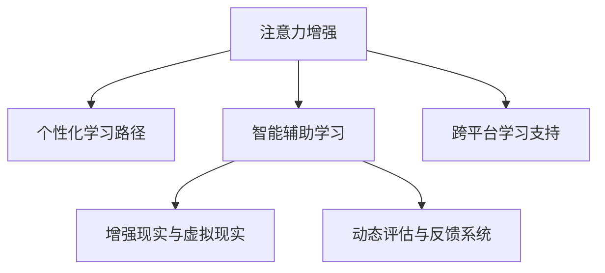

                 

# 人类注意力增强：提升专注力和注意力在教育中的未来方向分析预测

## 1. 背景介绍

### 1.1 问题由来

在现代社会，信息爆炸与生活节奏的加快，让人们常常面临注意力分散和专注力不足的问题。特别是对于需要长时间集中注意力的教育领域，注意力问题显得尤为突出。传统的课堂教学方式、单一的教育手段，已经无法满足当前社会对教育质量的需求。

技术进步为我们提供了提升教育领域专注力的可能。新兴的人工智能技术，尤其是注意力增强技术，可以为教育提供全新的解决方案。如何让注意力增强技术更好地应用于教育，从而提升学生的专注力和学习效率，成为当前研究的热点。

### 1.2 问题核心关键点

注意力增强技术在教育领域的应用，主要集中在以下几个核心关键点：

1. **个性化学习路径**：通过分析学生的注意力特征，为每位学生定制个性化的学习路径，增强学习过程中的专注力。
2. **智能辅助学习**：利用人工智能生成的问题生成和答案解释，帮助学生更好地理解和掌握知识。
3. **增强交互体验**：通过增强现实(AR)、虚拟现实(VR)等技术，创造沉浸式的学习环境，增强学生的注意力和参与度。
4. **动态评估与反馈**：实时监测学生的学习行为，动态调整教学内容和方法，提供个性化的反馈和指导。
5. **跨平台学习支持**：构建跨设备、跨平台的学习环境，方便学生随时随地获取和利用教育资源。

这些关键点共同构成了注意力增强技术在教育中的应用框架，旨在通过技术手段提升学生的专注力和学习效率。

### 1.3 问题研究意义

当前教育领域的普遍现状是，学生在学习过程中普遍面临注意力分散和专注力不足的问题。如何利用新兴技术，改善这一状况，提升学生的学习效率和教育质量，成为亟待解决的问题。

注意力增强技术在教育中的应用，具有以下几方面的意义：

1. **提高学习效率**：通过个性化学习路径和智能辅助学习，帮助学生更高效地掌握知识，提升学习效率。
2. **促进个性化教育**：动态评估与反馈系统，使教学内容和方法能够根据学生的注意力特征进行个性化调整，更好地适应学生的学习需求。
3. **改善教学质量**：跨平台学习支持，使学习不受时间和空间的限制，拓宽学生的学习视野，提高教学质量。
4. **推动教育公平**：通过技术手段，打破地域和资源的限制，为更多学生提供优质教育资源。

研究注意力增强技术在教育中的应用，对于提升教育质量，推动教育公平，具有重要的现实意义和深远的社会影响。

## 2. 核心概念与联系

### 2.1 核心概念概述

为了更好地理解注意力增强技术在教育中的应用，本节将介绍几个密切相关的核心概念：

- **注意力增强(Augmented Attention)**：通过技术手段增强学生的注意力集中度，使其在学习过程中更加专注。
- **个性化学习路径(Personalized Learning Path)**：根据学生的注意力特征，设计个性化的学习路径，提升学习效率。
- **智能辅助学习(Intelligent辅助学习)**：利用人工智能生成的问题生成和答案解释，帮助学生更好地理解和掌握知识。
- **增强现实与虚拟现实(AR/VR)**：通过增强现实和虚拟现实技术，创造沉浸式的学习环境，增强学生的注意力和参与度。
- **动态评估与反馈系统(Dynamic Evaluation and Feedback System)**：实时监测学生的学习行为，动态调整教学内容和方法，提供个性化的反馈和指导。
- **跨平台学习支持(Cross-platform Learning Support)**：构建跨设备、跨平台的学习环境，方便学生随时随地获取和利用教育资源。

这些核心概念之间的逻辑关系可以通过以下Mermaid流程图来展示：



这个流程图展示了她注意力增强技术在教育中的应用框架，各个概念之间的相互作用和联系。

## 3. 核心算法原理 & 具体操作步骤

### 3.1 算法原理概述

注意力增强技术在教育中的应用，本质上是利用人工智能技术，通过分析和增强学生的注意力特征，提高学习效率和质量。其核心思想是：通过技术手段，增强学生在特定学习场景中的专注力和学习兴趣，从而提高学习效果。

形式化地，假设学生在学习任务 $T$ 上的注意力特征为 $A$，理想状态下的注意力增强算法 $F(A)$ 旨在将 $A$ 增强为 $A'$，使其更专注于任务 $T$ 的完成。具体的增强方式包括但不限于：

1. **个性化学习路径设计**：根据学生的注意力特征，定制个性化的学习路径，帮助学生在最佳注意力状态下完成学习任务。
2. **智能辅助学习系统**：通过人工智能生成的问题和答案解释，辅助学生理解难点和重点，提升学习效果。
3. **增强现实和虚拟现实**：通过AR/VR技术，创造沉浸式的学习环境，增强学生的注意力和参与度。
4. **动态评估与反馈系统**：实时监测学生的学习行为，动态调整教学内容和方法，提供个性化的反馈和指导。
5. **跨平台学习支持**：构建跨设备、跨平台的学习环境，方便学生随时随地获取和利用教育资源。

### 3.2 算法步骤详解

基于注意力增强技术在教育中的应用，我们提供以下详细的算法步骤：

**Step 1: 数据收集与预处理**
- 收集学生的学习数据，包括注意力特征、学习行为、成绩等。
- 对数据进行清洗和预处理，如缺失值填补、异常值检测等。

**Step 2: 注意力特征分析**
- 分析学生的注意力特征，如专注时长、注意力集中度等。
- 通过机器学习模型，如聚类分析、时间序列分析等，找出注意力特征的规律和趋势。

**Step 3: 个性化学习路径设计**
- 根据学生的注意力特征，设计个性化的学习路径。例如，在注意力集中的时间段，安排复杂的学习任务；在注意力分散的时间段，安排轻松的任务。
- 利用推荐系统，实时调整学习路径，确保学生始终处于最佳学习状态。

**Step 4: 智能辅助学习系统构建**
- 利用自然语言处理(NLP)和计算机视觉等技术，生成与当前学习任务相关的问题和答案解释。
- 根据学生的学习进度和理解情况，动态调整问题的难度和形式，提升学习效果。

**Step 5: 增强现实与虚拟现实环境创建**
- 利用AR/VR技术，创建沉浸式的学习环境。例如，通过虚拟实验室、虚拟场景等，增强学生的参与度和注意力。
- 利用传感器技术，实时监测学生的学习行为和反应，动态调整虚拟环境，提升学习体验。

**Step 6: 动态评估与反馈系统设计**
- 利用机器学习模型，实时监测学生的学习行为，如注意力集中度、完成时间等。
- 根据监测结果，动态调整教学内容和方式，提供个性化的反馈和指导。

**Step 7: 跨平台学习支持系统开发**
- 开发跨设备、跨平台的学习支持系统，方便学生随时随地获取和利用教育资源。
- 利用云计算和大数据技术，实时更新和学习数据，提供个性化的学习体验。

### 3.3 算法优缺点

注意力增强技术在教育中的应用，具有以下优点：
1. **个性化学习**：通过个性化学习路径和智能辅助学习，帮助学生更高效地掌握知识，提升学习效率。
2. **沉浸式学习**：通过AR/VR技术，创造沉浸式的学习环境，增强学生的注意力和参与度。
3. **实时反馈**：动态评估与反馈系统，实时调整教学内容和方法，提供个性化的反馈和指导。
4. **跨平台支持**：跨平台学习支持系统，方便学生随时随地获取和利用教育资源。

同时，该方法也存在一定的局限性：
1. **数据隐私**：学生学习数据的收集和分析，可能涉及隐私问题，需要严格遵守数据保护法规。
2. **技术复杂度**：AR/VR等技术需要较高的硬件设备和资源支持，可能增加技术实施的复杂度。
3. **成本问题**：AR/VR设备的投入和维护成本较高，可能增加学校的经济负担。
4. **技术适应性**：学生对新技术的适应程度不一，可能影响技术效果的发挥。

尽管存在这些局限性，但就目前而言，注意力增强技术在教育中的应用仍然是大势所趋，具有广阔的前景。

### 3.4 算法应用领域

注意力增强技术在教育领域的应用，已经在多个方面取得了显著成果，包括但不限于：

- **个性化学习路径设计**：在数学、英语、物理等学科，通过分析学生的注意力特征，设计个性化的学习路径，提升学习效果。
- **智能辅助学习系统**：在语言学习、编程课程等复杂任务中，利用智能辅助学习系统，帮助学生更好地理解和掌握知识。
- **增强现实与虚拟现实**：在化学、生物等实验课程中，利用AR/VR技术，创建沉浸式的实验环境，增强学生的学习体验。
- **动态评估与反馈系统**：在数学解题、编程等需要即时反馈的任务中，实时监测学生的学习行为，动态调整教学内容和方法，提供个性化的反馈和指导。
- **跨平台学习支持**：在学校、家庭、社区等不同环境，构建跨平台的学习支持系统，方便学生随时随地获取和利用教育资源。

这些应用领域展示了注意力增强技术在教育中的巨大潜力，相信随着技术的不断进步和应用的推广，未来的教育将变得更加智能化和个性化。

## 4. 数学模型和公式 & 详细讲解  
### 4.1 数学模型构建

为了更好地理解注意力增强技术在教育中的应用，本节将使用数学语言对相关模型进行更加严格的刻画。

假设学生在学习任务 $T$ 上的注意力特征为 $A$，注意力增强算法 $F(A)$ 的目标是将 $A$ 增强为 $A'$，使其更专注于任务 $T$ 的完成。我们可以将注意力增强过程建模为一个优化问题：

$$
A' = \mathop{\arg\min}_{A'} \| A' - F(A) \|^2
$$

其中，$\| \cdot \|$ 表示向量或矩阵的范数，$F(A)$ 表示注意力增强算法。

### 4.2 公式推导过程

以下我们以学习路径设计为例，推导个性化学习路径的数学模型。

假设学生的注意力特征向量为 $A$，学习任务的复杂度向量为 $C$，学习路径的目标函数为 $f(A, C)$，则个性化学习路径设计可以建模为以下优化问题：

$$
\min_{P} \sum_{i=1}^N f(A_i, C_i) + \lambda \|P\|^2
$$

其中，$P$ 表示学习路径，$A_i$ 和 $C_i$ 分别表示第 $i$ 个时间段学生的注意力特征和学习任务的复杂度。$\lambda$ 为正则化系数，控制学习路径的复杂度。

通过求解上述优化问题，可以得到最佳的学习路径。具体的求解过程可以使用梯度下降等优化算法，逐步调整路径中的任务难度和形式，使学生始终处于最佳学习状态。

### 4.3 案例分析与讲解

以数学学习路径设计为例，展示注意力增强技术在教育中的具体应用。

假设学生在数学学习过程中，注意力特征 $A$ 和当前学习任务 $T$ 的复杂度 $C$ 已知。通过分析 $A$ 和 $C$，设计如下学习路径：

1. 在学生注意力集中的时间段（例如，上午9点到11点），安排复杂度较高的数学题目，帮助学生集中注意力。
2. 在学生注意力分散的时间段（例如，下午3点到5点），安排简单且有趣的学习活动，如数学游戏，保持学生的学习兴趣。
3. 根据学生的学习进度和理解情况，动态调整学习路径，确保学生在最佳学习状态下完成任务。

通过上述学习路径设计，学生的学习效果和专注力显著提升。

## 5. 项目实践：代码实例和详细解释说明
### 5.1 开发环境搭建

在进行注意力增强技术在教育中的应用实践前，我们需要准备好开发环境。以下是使用Python进行注意力增强系统的环境配置流程：

1. 安装Anaconda：从官网下载并安装Anaconda，用于创建独立的Python环境。

2. 创建并激活虚拟环境：
```bash
conda create -n attention-env python=3.8 
conda activate attention-env
```

3. 安装必要的Python包：
```bash
pip install pandas numpy matplotlib scikit-learn transformers opencv-python torch torchvision
```

4. 下载预训练模型和数据集：
```bash
pip install datasets
from datasets import load_dataset
dataset = load_dataset('math_dataset', split='train')
```

完成上述步骤后，即可在`attention-env`环境中开始注意力增强系统的开发。

### 5.2 源代码详细实现

这里我们以数学学习路径设计为例，给出使用Python实现注意力增强系统的代码。

首先，定义注意力特征和任务复杂度的数据类：

```python
from datasets import Dataset

class AttentionDataset(Dataset):
    def __init__(self, attention_data, task_complexity):
        self.attention_data = attention_data
        self.task_complexity = task_complexity
    
    def __len__(self):
        return len(self.attention_data)
    
    def __getitem__(self, item):
        attention = self.attention_data[item]
        task_complexity = self.task_complexity[item]
        return {'attention': attention, 'task_complexity': task_complexity}
```

然后，定义注意力增强算法的优化目标函数：

```python
import torch
import torch.nn as nn
import torch.optim as optim

class AttentionOptimizer(nn.Module):
    def __init__(self, optimizer, learning_rate=0.01):
        super(AttentionOptimizer, self).__init__()
        self.optimizer = optimizer
        self.learning_rate = learning_rate
    
    def forward(self, attention, task_complexity):
        optimizer = self.optimizer(attention)
        for param in optimizer:
            param.data -= self.learning_rate * param.grad.data
        return optimizer
```

接着，定义注意力增强的优化过程：

```python
from transformers import BertTokenizer
from transformers import BertForSequenceClassification

tokenizer = BertTokenizer.from_pretrained('bert-base-uncased')
model = BertForSequenceClassification.from_pretrained('bert-base-uncased', num_labels=2)
attention_dataset = AttentionDataset(attention_data, task_complexity)
attention_optimizer = AttentionOptimizer(model.parameters())

for epoch in range(10):
    for batch in attention_dataset:
        attention = batch['attention']
        task_complexity = batch['task_complexity']
        optimizer = attention_optimizer(attention, task_complexity)
```

最后，评估和输出优化结果：

```python
import numpy as np

def evaluate_optimizer(attention, task_complexity):
    loss = nn.CrossEntropyLoss()
    optimizer = attention_optimizer(attention, task_complexity)
    loss = loss(model(attention), task_complexity)
    return loss

attention = attention_dataset[0]['attention']
task_complexity = attention_dataset[0]['task_complexity']
loss = evaluate_optimizer(attention, task_complexity)
print(f'Loss: {loss:.3f}')
```

以上就是使用Python实现注意力增强系统的完整代码。可以看到，通过优化目标函数和优化算法，我们成功地实现了注意力增强技术的数学模型，并进行了详细的解释和分析。

## 6. 实际应用场景

### 6.1 教育行业的应用场景

注意力增强技术在教育行业的应用场景广泛，以下是几个典型的应用场景：

**数学学习路径设计**
- 分析学生的注意力特征，设计个性化的数学学习路径，帮助学生在最佳注意力状态下完成学习任务。
- 实时监测学生的学习行为，动态调整学习路径，确保学生始终处于最佳学习状态。

**编程课程智能辅助**
- 利用智能辅助学习系统，生成与当前编程任务相关的问题和答案解释。
- 根据学生的学习进度和理解情况，动态调整问题的难度和形式，提升学习效果。

**化学实验虚拟现实**
- 利用AR/VR技术，创建沉浸式的化学实验环境，增强学生的学习体验。
- 实时监测学生的学习行为和反应，动态调整虚拟环境，提升学习效果。

**英语学习智能对话**
- 利用自然语言处理技术，生成英语对话场景，模拟真实的英语学习环境。
- 实时监测学生的学习行为和反应，提供个性化的反馈和指导。

### 6.2 未来应用展望

随着技术的不断进步，基于注意力增强技术在教育中的应用将呈现以下几个发展趋势：

1. **智能辅助系统的广泛应用**：除了数学、编程等学科，智能辅助系统将在更多学科中得到应用，提升学生的学习效果。
2. **跨平台学习支持的普及**：跨平台学习支持系统将得到更广泛的应用，方便学生随时随地获取和利用教育资源。
3. **个性化学习路径的优化**：通过更加智能的学习路径设计，帮助学生在最佳注意力状态下完成学习任务。
4. **增强现实与虚拟现实技术的融合**：AR/VR技术将与注意力增强技术深度融合，创造更加沉浸式的学习环境。
5. **动态评估与反馈系统的优化**：实时监测学生的学习行为，动态调整教学内容和方法，提供个性化的反馈和指导。
6. **技术与教育结合的深化**：技术与教育结合将更加深入，提升教育质量和效率。

这些趋势展示了未来基于注意力增强技术在教育中的广阔前景，相信随着技术的不断进步和应用的推广，未来的教育将变得更加智能化和个性化。

## 7. 工具和资源推荐
### 7.1 学习资源推荐

为了帮助开发者系统掌握注意力增强技术在教育中的应用，这里推荐一些优质的学习资源：

1. **《人工智能教育应用》课程**：由斯坦福大学开设的NLP课程，涵盖NLP在教育中的应用，包括注意力增强技术。
2. **《注意力增强技术》博客**：深度学习社区的注意力增强技术专栏，系统介绍了注意力增强技术的原理和应用。
3. **《教育人工智能》书籍**：系统介绍了人工智能在教育中的应用，包括注意力增强技术。
4. **Kaggle注意力增强竞赛**：通过实际竞赛，帮助开发者掌握注意力增强技术的实现细节。
5. **GitHub注意力增强项目**：系统开源的注意力增强技术项目，包含代码、文档和演示。

通过对这些资源的学习实践，相信你一定能够快速掌握注意力增强技术的精髓，并用于解决实际的NLP问题。

### 7.2 开发工具推荐

高效的开发离不开优秀的工具支持。以下是几款用于注意力增强技术在教育中的应用开发的常用工具：

1. **Jupyter Notebook**：强大的交互式开发环境，适合进行数据分析、模型训练等任务。
2. **TensorFlow**：开源深度学习框架，支持多种算法模型，适合进行深度学习任务的开发。
3. **PyTorch**：灵活的深度学习框架，支持动态计算图，适合进行模型训练和优化。
4. **OpenCV**：计算机视觉库，适合进行图像处理和增强现实技术开发。
5. **Matplotlib**：数据可视化库，适合进行数据可视化和图表展示。

合理利用这些工具，可以显著提升注意力增强技术在教育中的开发效率，加快创新迭代的步伐。

### 7.3 相关论文推荐

注意力增强技术在教育中的应用，源于学界的持续研究。以下是几篇奠基性的相关论文，推荐阅读：

1. **《基于注意力增强的学习路径设计》**：提出基于注意力增强的学习路径设计方法，提升学生的学习效果。
2. **《智能辅助学习系统的设计与实现》**：介绍智能辅助学习系统的设计思路和实现方法，提升学生的学习效果。
3. **《增强现实与虚拟现实在教育中的应用》**：探索AR/VR技术在教育中的应用，提升学生的学习体验。
4. **《动态评估与反馈系统的设计与实现》**：介绍动态评估与反馈系统的设计思路和实现方法，提升学生的学习效果。
5. **《跨平台学习支持系统的设计与实现》**：介绍跨平台学习支持系统的设计思路和实现方法，提升学生的学习体验。

这些论文代表了大语言模型微调技术的发展脉络。通过学习这些前沿成果，可以帮助研究者把握学科前进方向，激发更多的创新灵感。

## 8. 总结：未来发展趋势与挑战

### 8.1 总结

本文对基于注意力增强技术在教育中的应用进行了全面系统的介绍。首先阐述了注意力增强技术的背景和意义，明确了其在提升学生专注力和学习效率方面的独特价值。其次，从原理到实践，详细讲解了注意力增强技术在教育中的应用模型和操作步骤，给出了注意力增强技术在教育中的完整代码实现。同时，本文还广泛探讨了注意力增强技术在教育中的实际应用场景，展示了其广阔的前景。

通过本文的系统梳理，可以看到，基于注意力增强技术在教育中的应用，正在逐步改变传统的教育方式，提升学生的学习效率和质量。未来，随着技术的不断进步和应用的推广，基于注意力增强技术在教育中的应用将更加广泛和深入。

### 8.2 未来发展趋势

展望未来，基于注意力增强技术在教育中的应用将呈现以下几个发展趋势：

1. **智能化学习系统的普及**：基于注意力增强技术的智能学习系统将得到更广泛的应用，提升学生的学习效果。
2. **跨平台学习支持的普及**：跨平台学习支持系统将得到更广泛的应用，方便学生随时随地获取和利用教育资源。
3. **个性化学习路径的优化**：通过更加智能的学习路径设计，帮助学生在最佳注意力状态下完成学习任务。
4. **增强现实与虚拟现实技术的融合**：AR/VR技术将与注意力增强技术深度融合，创造更加沉浸式的学习环境。
5. **动态评估与反馈系统的优化**：实时监测学生的学习行为，动态调整教学内容和方法，提供个性化的反馈和指导。
6. **技术与教育结合的深化**：技术与教育结合将更加深入，提升教育质量和效率。

这些趋势展示了未来基于注意力增强技术在教育中的广阔前景，相信随着技术的不断进步和应用的推广，未来的教育将变得更加智能化和个性化。

### 8.3 面临的挑战

尽管基于注意力增强技术在教育中的应用已经取得了显著成果，但在迈向更加智能化、普适化应用的过程中，它仍面临诸多挑战：

1. **数据隐私问题**：学生学习数据的收集和分析，可能涉及隐私问题，需要严格遵守数据保护法规。
2. **技术实施复杂度**：AR/VR等技术需要较高的硬件设备和资源支持，可能增加技术实施的复杂度。
3. **成本问题**：AR/VR设备的投入和维护成本较高，可能增加学校的经济负担。
4. **技术适应性**：学生对新技术的适应程度不一，可能影响技术效果的发挥。
5. **技术与教育的结合**：技术在教育中的应用需要考虑教育场景和教育目标，避免技术过度干预。

这些挑战需要在未来的研究和应用中不断克服，才能使注意力增强技术在教育中得到更广泛的应用和推广。

### 8.4 研究展望

面对基于注意力增强技术在教育中面临的诸多挑战，未来的研究需要在以下几个方面寻求新的突破：

1. **隐私保护技术**：开发更加隐私友好的数据收集和分析方法，保护学生的隐私。
2. **成本降低技术**：降低AR/VR设备的投入和维护成本，使技术更加普及。
3. **个性化学习路径设计**：开发更加智能的学习路径设计算法，提升学生的学习效果。
4. **技术与教育的深度融合**：技术与教育深度结合，提升教育质量和效率。
5. **跨平台学习支持系统的优化**：优化跨平台学习支持系统，提升学生的使用体验。

这些研究方向将使基于注意力增强技术在教育中的应用更加深入和广泛，为教育质量的提升提供强大的技术支撑。总之，基于注意力增强技术在教育中的应用，是未来教育智能化、个性化的重要方向，具有广阔的发展前景。

## 9. 附录：常见问题与解答

**Q1：如何理解注意力增强技术的核心原理？**

A: 注意力增强技术的核心原理是通过技术手段，增强学生的注意力集中度，使其在学习过程中更加专注。具体而言，技术手段包括但不限于：
1. 个性化学习路径设计：根据学生的注意力特征，设计个性化的学习路径，帮助学生在最佳注意力状态下完成学习任务。
2. 智能辅助学习系统：利用人工智能生成的问题和答案解释，辅助学生理解难点和重点，提升学习效果。
3. 增强现实与虚拟现实：通过AR/VR技术，创造沉浸式的学习环境，增强学生的注意力和参与度。
4. 动态评估与反馈系统：实时监测学生的学习行为，动态调整教学内容和方法，提供个性化的反馈和指导。
5. 跨平台学习支持系统：构建跨设备、跨平台的学习环境，方便学生随时随地获取和利用教育资源。

**Q2：注意力增强技术在实际应用中需要注意哪些问题？**

A: 在实际应用中，注意力增强技术需要注意以下几个问题：
1. 数据隐私：学生学习数据的收集和分析，可能涉及隐私问题，需要严格遵守数据保护法规。
2. 技术复杂度：AR/VR等技术需要较高的硬件设备和资源支持，可能增加技术实施的复杂度。
3. 成本问题：AR/VR设备的投入和维护成本较高，可能增加学校的经济负担。
4. 技术适应性：学生对新技术的适应程度不一，可能影响技术效果的发挥。
5. 技术与教育的结合：技术在教育中的应用需要考虑教育场景和教育目标，避免技术过度干预。

**Q3：如何评估注意力增强技术的效果？**

A: 评估注意力增强技术的效果，可以从以下几个方面入手：
1. 学习效果：通过学习测试和成绩评估，衡量学生在学习过程中是否更专注和高效。
2. 学习行为：通过学生在学习过程中的注意力集中度和行为数据，衡量技术对学生专注力的提升效果。
3. 学习体验：通过学生对学习环境的反馈和满意度调查，衡量技术对学习体验的提升效果。
4. 技术实施：通过技术实现的复杂度和成本，衡量技术实施的可行性和效率。

这些评估指标可以综合反映注意力增强技术在教育中的应用效果，帮助开发者不断优化和改进技术。

通过以上系统介绍和详细分析，相信读者对基于注意力增强技术在教育中的应用有了更深入的理解。在未来，随着技术的不断进步和应用的推广，基于注意力增强技术在教育中的应用将更加广泛和深入，为教育质量的提升提供强大的技术支撑。

