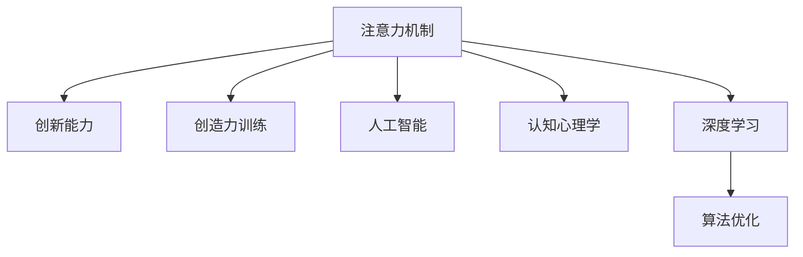

                 

# 人类注意力增强：提升创新能力和创造力训练

> 关键词：人类注意力增强, 创新能力, 创造力训练, 人工智能, 认知心理学, 深度学习, 算法优化

## 1. 背景介绍

### 1.1 问题由来

在现代社会中，随着科技的迅速发展，人类面临着越来越多的信息过载和注意力分散的挑战。大量的信息流涌入我们的感官系统，使得我们很难专注于一项任务，保持长时间的注意力集中。这不仅影响了日常工作和生活的效率，还可能对个人的创新能力和创造力产生负面影响。

在人工智能领域，特别是深度学习和神经网络模型的训练和应用中，人类注意力的增强也被视为提高模型性能和优化决策质量的重要手段。通过对注意力机制的改进和应用，可以提升模型在特定任务上的表现，如视觉识别、自然语言处理、语音识别等。

### 1.2 问题核心关键点

人类注意力的增强涉及多个层面，包括认知心理学、神经科学、人工智能算法等。以下是该问题的核心关键点：

1. 注意力机制的原理和作用：注意力机制如何选择和集中信息，使得模型能够更有效地处理复杂数据。
2. 注意力增强的方法和技术：如何通过算法优化、模型设计、训练策略等手段，提升模型的注意力能力。
3. 注意力增强的应用场景：哪些任务和场景最适合使用增强后的注意力机制。
4. 注意力增强的效果和评估：如何衡量注意力增强后的模型在创新能力、创造力、决策质量等方面的提升效果。

### 1.3 问题研究意义

研究人类注意力的增强对于提升个人和组织的创新能力和创造力具有重要意义：

1. 提高工作效率：通过增强注意力，能够更专注地处理复杂任务，提升工作效率和质量。
2. 促进创新思维：增强注意力有助于打破思维定式，激发新的创意和解决方案。
3. 增强决策能力：通过聚焦关键信息，能够更准确地做出决策，减少错误和失误。
4. 促进知识获取和应用：增强注意力有助于更好地理解和应用新知识，加速知识转化和应用。

## 2. 核心概念与联系

### 2.1 核心概念概述

为了更好地理解人类注意力增强的原理和应用，本节将介绍几个关键概念：

- 注意力机制(Attention Mechanism)：一种用于在输入数据中动态选择和聚焦关键信息的机制。通过权衡不同输入项的重要性，选择对当前任务最为相关的部分进行处理。
- 创新能力(Creativity)：指产生新颖、独特、有价值的想法和解决方案的能力。创新能力通常涉及跨领域知识的应用、思维的灵活性和独创性。
- 创造力(Creativity)：指通过结合已有知识、经验、情感等，产生新的、有创意的想法和作品的能力。创造力通常涉及艺术、科学、工程等领域。
- 人工智能(Artificial Intelligence, AI)：一种通过计算机模拟人类智能的技术，包括感知、推理、学习、决策等能力。
- 认知心理学(Cognitive Psychology)：研究人类思维、认知过程和心理活动的科学，特别是注意力、记忆、决策等方面的研究。
- 深度学习(Deep Learning)：一种基于神经网络的学习方法，通过多层次的特征提取和模式识别，实现复杂数据的自动学习和处理。

这些概念之间的逻辑关系可以通过以下Mermaid流程图来展示：



这个流程图展示了几组关键概念及其之间的关系：

1. 注意力机制是基础，通过选择和聚焦关键信息，提升模型的决策质量和效率。
2. 创新能力和创造力是目标，通过注意力机制的增强，提升个人和组织在创新和创造上的表现。
3. 人工智能和认知心理学提供了理论支持和应用背景，深度学习提供了算法实现基础。
4. 算法优化是关键，通过对注意力机制的算法优化，提升模型的注意力能力和效果。

这些概念共同构成了人类注意力增强的理论框架，为研究和应用提供了清晰的指导。

## 3. 核心算法原理 & 具体操作步骤

### 3.1 算法原理概述

人类注意力的增强涉及对注意力机制的改进和应用。在深度学习中，注意力机制通常通过注意力权重向量来表示不同输入项的重要性，并通过加权求和的方式对关键信息进行提取和融合。

形式化地，假设输入序列为 $x=\{x_i\}_{i=1}^N$，注意力权重向量为 $a=\{a_i\}_{i=1}^N$，则注意力机制的作用可以表示为：

$$
\text{Attention}(x) = \sum_{i=1}^N a_i x_i
$$

其中 $a_i$ 为注意力权重，可以通过某种评分函数 $f(x_i)$ 计算得到，满足 $0 \leq a_i \leq 1$。

在注意力机制的基础上，通过优化算法和训练策略，可以增强模型的注意力能力，从而提升其在特定任务上的表现。

### 3.2 算法步骤详解

基于注意力增强的深度学习模型的构建通常包括以下几个关键步骤：

**Step 1: 定义注意力评分函数**

注意力评分函数 $f(x_i)$ 决定了注意力权重 $a_i$ 的计算方式。常见的评分函数包括点积评分函数（Dot-Product Attention）、加性评分函数（Additive Attention）等。其中，点积评分函数是最常用的方法，其计算公式为：

$$
f(x_i, x_j) = x_i \cdot x_j
$$

在多模态数据处理中，还可以采用更复杂的评分函数，如多模态评分函数（Multi-modal Attention），用于处理不同类型的数据。

**Step 2: 设计注意力权重更新规则**

注意力权重 $a_i$ 的更新通常使用softmax函数进行归一化，确保所有权重之和为1。例如，对于点积评分函数，注意力权重更新公式为：

$$
a_i = \frac{\exp(f(x_i))}{\sum_{j=1}^N \exp(f(x_j))}
$$

其中 $\exp$ 表示指数函数。

**Step 3: 计算注意力输出**

通过将注意力权重与输入项 $x_i$ 进行加权求和，可以得到注意力输出：

$$
\text{Attention}(x) = \sum_{i=1}^N a_i x_i
$$

**Step 4: 集成注意力机制**

将注意力机制集成到深度学习模型中，可以采用多种方式，如串联注意力模块、并联注意力模块、残差连接注意力模块等。在自然语言处理（NLP）中，常见的集成方式是使用Transformer模型。

**Step 5: 训练和优化模型**

在定义好注意力机制后，使用优化算法（如Adam、SGD等）对模型进行训练，通过反向传播更新注意力权重和模型参数，最小化损失函数，提升模型在特定任务上的表现。

### 3.3 算法优缺点

注意力增强的深度学习模型具有以下优点：

1. 增强模型对关键信息的聚焦和处理能力，提升模型的决策质量和效率。
2. 提升模型的泛化能力和鲁棒性，能够更好地适应不同类型和规模的数据。
3. 增强模型的可解释性，使得模型的决策过程更加透明和可理解。

同时，该方法也存在以下局限性：

1. 需要额外的计算资源和时间，尤其是对于大规模数据和复杂模型。
2. 注意力机制的设计和调参需要专业知识，对研究者和开发者提出了较高要求。
3. 注意力增强的效果可能依赖于数据的质量和分布，对于噪声数据和异常值较为敏感。

### 3.4 算法应用领域

注意力增强的深度学习模型已经在多个领域得到了应用，包括：

- 自然语言处理（NLP）：如机器翻译、文本生成、情感分析等。通过注意力机制选择关键信息，提升模型的理解能力和生成质量。
- 计算机视觉（CV）：如图像分类、物体检测、图像生成等。通过多模态注意力机制处理不同类型的数据，提升模型的特征提取和模式识别能力。
- 语音处理（ASR）：如语音识别、语音合成等。通过注意力机制处理时间序列数据，提升模型的特征提取和模型性能。
- 推荐系统（Recommendation System）：通过注意力机制选择用户和物品之间的相关性，提升推荐效果和个性化推荐能力。

## 4. 数学模型和公式 & 详细讲解  
### 4.1 数学模型构建

本节将使用数学语言对基于注意力增强的深度学习模型进行更加严格的刻画。

假设输入序列为 $x=\{x_i\}_{i=1}^N$，注意力权重向量为 $a=\{a_i\}_{i=1}^N$，注意力输出为 $y$，模型的参数为 $\theta$。注意力机制可以表示为：

$$
y = \text{Attention}(x) = \sum_{i=1}^N a_i x_i
$$

其中注意力权重 $a_i$ 可以通过以下评分函数计算：

$$
a_i = \frac{\exp(f(x_i, \theta))}{\sum_{j=1}^N \exp(f(x_j, \theta))}
$$

模型输出可以通过多层神经网络计算：

$$
y = M(x, \theta)
$$

其中 $M$ 表示多层神经网络，可以采用不同的架构，如全连接层、卷积层、循环神经网络（RNN）等。

### 4.2 公式推导过程

以下是注意力机制的详细推导过程：

1. 定义注意力评分函数 $f(x_i, \theta)$：

$$
f(x_i, \theta) = x_i \cdot \theta
$$

其中 $\theta$ 为模型参数。

2. 计算注意力权重 $a_i$：

$$
a_i = \frac{\exp(f(x_i, \theta))}{\sum_{j=1}^N \exp(f(x_j, \theta))}
$$

3. 计算注意力输出 $y$：

$$
y = \sum_{i=1}^N a_i x_i
$$

其中 $x_i$ 为输入序列中的第 $i$ 个元素。

4. 集成注意力机制：

$$
y = M(\text{Attention}(x), \theta)
$$

其中 $M$ 为多层神经网络。

通过上述推导，可以看到，注意力机制的核心在于注意力权重 $a_i$ 的计算，而权重计算依赖于注意力评分函数 $f(x_i, \theta)$ 的设计。不同的评分函数可以影响注意力机制的效果和适用范围。

### 4.3 案例分析与讲解

以Transformer模型为例，详细解释其注意力机制的实现。Transformer模型是一种基于自注意力（Self-Attention）机制的神经网络架构，主要用于处理序列数据，如文本、语音等。

Transformer模型的核心是自注意力机制，其计算过程如下：

1. 计算查询向量 $Q$、键向量 $K$ 和值向量 $V$：

$$
Q = xW^Q, \quad K = xW^K, \quad V = xW^V
$$

其中 $W^Q, W^K, W^V$ 为线性变换矩阵，$x$ 为输入序列 $x$。

2. 计算注意力权重 $a_i$：

$$
a_i = \frac{\exp(\text{Dot-Product}(Q, K_i))}{\sum_{j=1}^N \exp(\text{Dot-Product}(Q, K_j))}
$$

其中 $\text{Dot-Product}$ 表示点积操作，$K_i$ 表示第 $i$ 个键向量。

3. 计算注意力输出 $y$：

$$
y = \sum_{i=1}^N a_i V_i
$$

其中 $V_i$ 表示第 $i$ 个值向量。

通过上述计算过程，可以看到，Transformer模型通过自注意力机制，能够同时考虑输入序列中所有位置的信息，提升模型的处理能力和泛化能力。

## 5. 项目实践：代码实例和详细解释说明
### 5.1 开发环境搭建

在进行注意力增强的深度学习模型开发前，我们需要准备好开发环境。以下是使用Python进行TensorFlow开发的环境配置流程：

1. 安装Anaconda：从官网下载并安装Anaconda，用于创建独立的Python环境。

2. 创建并激活虚拟环境：
```bash
conda create -n tf-env python=3.8 
conda activate tf-env
```

3. 安装TensorFlow：根据CUDA版本，从官网获取对应的安装命令。例如：
```bash
pip install tensorflow
```

4. 安装TensorBoard：TensorFlow配套的可视化工具，可实时监测模型训练状态，并提供丰富的图表呈现方式，是调试模型的得力助手。
```bash
pip install tensorboard
```

5. 安装Keras：TensorFlow的高层API，可以方便地搭建深度学习模型。
```bash
pip install keras
```

完成上述步骤后，即可在`tf-env`环境中开始模型开发。

### 5.2 源代码详细实现

下面以Transformer模型为例，给出使用TensorFlow搭建注意力增强的神经网络模型的Python代码实现。

```python
import tensorflow as tf
from tensorflow.keras.layers import Input, Dense, Embedding, MultiHeadAttention, Dropout, Add, Concatenate
from tensorflow.keras.models import Model

def transformer_model(input_dim, hidden_dim, num_heads, num_layers, output_dim, learning_rate, attention_dropout, learning_rate_schedule):
    input_layer = Input(shape=(None, input_dim))
    embedding = Embedding(input_dim, hidden_dim)(input_layer)
    attention_layer = MultiHeadAttention(num_heads, hidden_dim, dropout=attention_dropout)(embedding, embedding)
    output_layer = Dense(output_dim, activation='softmax')(attention_layer)

    model = Model(inputs=input_layer, outputs=output_layer)

    opt = tf.keras.optimizers.Adam(learning_rate_schedule)
    model.compile(optimizer=opt, loss='categorical_crossentropy', metrics=['accuracy'])

    return model

# 定义模型参数
input_dim = 300
hidden_dim = 256
num_heads = 8
num_layers = 2
output_dim = 100
learning_rate = 0.001
attention_dropout = 0.1
learning_rate_schedule = tf.keras.optimizers.schedules.ExponentialDecay(initial_learning_rate=learning_rate, decay_steps=10000, decay_rate=0.9)

# 创建Transformer模型
model = transformer_model(input_dim, hidden_dim, num_heads, num_layers, output_dim, learning_rate, attention_dropout, learning_rate_schedule)
```

以上是使用TensorFlow构建基于自注意力机制的Transformer模型的基本代码实现。可以看到，通过定义注意力评分函数、计算注意力权重和注意力输出，可以方便地构建深度学习模型，并使用TensorFlow的高级API进行优化和编译。

### 5.3 代码解读与分析

让我们再详细解读一下关键代码的实现细节：

**Transformer_model函数**：
- 定义输入层、嵌入层、注意力层和输出层。
- 使用MultiHeadAttention层实现自注意力机制，计算查询向量、键向量和值向量的点积评分。
- 通过Dropout层和Add层进行正则化，防止过拟合。
- 定义模型输入和输出，并使用Adam优化器编译模型。

**模型参数**：
- 定义模型输入维度、隐藏维度、注意力机制的注意力头数、层数、输出维度、学习率、Dropout率和学习率衰减策略。

**学习率衰减策略**：
- 使用指数衰减学习率，随着训练的进行，逐步降低学习率，以稳定模型的训练过程。

通过上述代码，可以看到，使用TensorFlow搭建基于注意力增强的深度学习模型非常简便，只需要通过简单的函数调用，即可完成模型的定义、编译和训练。

## 6. 实际应用场景
### 6.1 智能客服系统

在智能客服系统中，基于注意力增强的深度学习模型可以提升客户服务的质量和效率。智能客服系统通常需要处理大量的客户咨询，回答各种问题。通过注意力增强，模型能够更专注地处理关键信息，快速理解客户需求，提供更准确的回答。

在实际应用中，可以将客户咨询的对话历史作为输入，通过注意力机制选择关键信息，生成更加精准和个性化的回复。此外，还可以通过模型输出预测客户咨询的主题和情感，提高客服系统的自动化程度和用户体验。

### 6.2 金融舆情监测

在金融舆情监测中，注意力增强的深度学习模型可以帮助金融机构及时监测和分析市场舆情，评估金融风险。通过注意力机制，模型能够更精准地识别出舆情中的关键信息，如市场变化、政策影响、舆情情绪等，从而帮助金融机构做出更准确的决策。

在实际应用中，可以将舆情文本作为输入，通过注意力机制选择关键信息，生成舆情摘要和情感分析结果。此外，还可以通过多模态注意力机制处理新闻、评论、社交媒体等多种数据，提升舆情监测的效果和全面性。

### 6.3 个性化推荐系统

在个性化推荐系统中，注意力增强的深度学习模型可以提升推荐系统的精准度和个性化水平。推荐系统通常需要处理海量用户行为数据，找到用户感兴趣的商品或内容。通过注意力增强，模型能够更专注地处理关键行为信息，提升推荐效果和用户体验。

在实际应用中，可以将用户行为数据作为输入，通过注意力机制选择关键行为信息，生成用户兴趣画像。此外，还可以通过多模态注意力机制处理用户画像和商品特征，提升推荐系统的准确性和多样性。

### 6.4 未来应用展望

随着深度学习和注意力机制的不断发展，基于注意力增强的深度学习模型将在更多领域得到应用，为人类生活和工作带来更多便利和创新。

在智慧医疗领域，注意力增强的深度学习模型可以用于医疗影像分析、疾病预测和诊断等。通过注意力机制，模型能够更精准地识别出关键影像特征，提升医疗影像的自动分析和诊断能力。

在智能教育领域，注意力增强的深度学习模型可以用于学生行为分析、课程推荐和学习效果评估等。通过注意力机制，模型能够更准确地理解学生的需求和行为，提升教育质量和个性化教育的效果。

在智慧城市治理中，注意力增强的深度学习模型可以用于城市事件监测、舆情分析和应急指挥等。通过注意力机制，模型能够更全面地识别出关键事件信息，提高城市管理的自动化和智能化水平。

总之，基于注意力增强的深度学习模型将在更多领域带来变革性影响，推动人工智能技术的不断进步和应用。

## 7. 工具和资源推荐
### 7.1 学习资源推荐

为了帮助开发者系统掌握注意力增强的深度学习模型的理论基础和实践技巧，这里推荐一些优质的学习资源：

1. 《深度学习基础》系列课程：由深度学习领域的知名专家授课，涵盖深度学习的基本原理和实践技巧，适合初学者入门。
2. 《TensorFlow实战深度学习》书籍：深入介绍TensorFlow的使用方法和深度学习模型构建，包括注意力机制的详细讲解。
3. 《自然语言处理入门》课程：介绍自然语言处理的基本概念和应用，涵盖注意力机制在NLP中的具体应用。
4. 《深度学习认知与创造力》论文：研究深度学习如何提升人类的创新能力和创造力，提供了丰富的理论和实证支持。
5. 《认知计算与创新》书籍：从认知计算的角度，探讨人类创新能力和认知过程的关系，提供创新的理论和应用思路。

通过对这些资源的学习实践，相信你一定能够系统掌握注意力增强的深度学习模型的原理和应用，并用于解决实际的NLP问题。

### 7.2 开发工具推荐

高效的开发离不开优秀的工具支持。以下是几款用于注意力增强的深度学习模型开发的常用工具：

1. TensorFlow：由Google主导开发的开源深度学习框架，支持多种深度学习模型的构建和训练。
2. Keras：TensorFlow的高层API，提供简单易用的模型构建和训练功能。
3. PyTorch：Facebook开发的开源深度学习框架，支持动态计算图和灵活的模型构建。
4. JAX：Google开发的自动微分库，支持高效计算和模型优化。
5. MXNet：亚马逊开发的深度学习框架，支持多种分布式计算和模型优化。
6. HuggingFace Transformers库：提供多种预训练语言模型的实现和应用，支持高效构建注意力增强的模型。

合理利用这些工具，可以显著提升注意力增强的深度学习模型的开发效率，加快创新迭代的步伐。

### 7.3 相关论文推荐

注意力增强的深度学习模型的研究涉及多个领域，以下是几篇奠基性的相关论文，推荐阅读：

1. Attention is All You Need（即Transformer原论文）：提出了Transformer结构，开启了深度学习中注意力机制的广泛应用。
2. Multi-Head Attention for Image Feature Learning：提出多模态注意力机制，用于处理不同类型的数据。
3. Transformer-XL: Attentive Language Models Beyond a Fixed-Length Context：提出Transformer-XL模型，提升注意力机制的长期依赖处理能力。
4. Self-Attention with Transformer-Based Architectures for Speech Recognition：提出基于自注意力机制的语音识别模型，提升语音信号处理的效果。
5. Convolutional Recurrent Attention Networks for Image Categorization：提出卷积-循环注意力网络（CRAN），用于图像分类任务。

这些论文代表了大语言模型注意力增强技术的发展脉络。通过学习这些前沿成果，可以帮助研究者把握学科前进方向，激发更多的创新灵感。

## 8. 总结：未来发展趋势与挑战

### 8.1 总结

本文对基于注意力增强的深度学习模型的原理和应用进行了全面系统的介绍。首先阐述了注意力机制的重要性，明确了注意力增强在提升创新能力和创造力方面的独特价值。其次，从原理到实践，详细讲解了注意力增强的深度学习模型的数学模型和实现细节，给出了模型开发的完整代码实例。同时，本文还广泛探讨了注意力增强技术在智能客服、金融舆情、个性化推荐等多个领域的应用前景，展示了注意力增强技术的巨大潜力。此外，本文精选了注意力增强技术的各类学习资源，力求为读者提供全方位的技术指引。

通过本文的系统梳理，可以看到，基于注意力增强的深度学习模型正在成为NLP领域的重要范式，极大地拓展了深度学习模型的应用边界，催生了更多的落地场景。受益于深度学习模型的不断进步，注意力增强技术必将在更多领域得到应用，为人工智能技术的发展注入新的活力。

### 8.2 未来发展趋势

展望未来，注意力增强的深度学习模型将呈现以下几个发展趋势：

1. 模型规模持续增大。随着算力成本的下降和数据规模的扩张，注意力增强的深度学习模型也将不断增长，能够处理更加复杂和多样化的任务。
2. 注意力机制的设计更加灵活。未来的模型将支持更多的注意力评分函数和计算方式，提升模型的灵活性和适应性。
3. 跨模态注意力增强的兴起。多模态数据处理将成为未来的重要研究方向，模型将支持跨模态注意力机制，处理不同类型的数据。
4. 注意力增强的实时性提升。通过优化计算图和算法，未来的模型将具有更高效的推理速度和实时性。
5. 注意力增强的自动化。通过模型优化和自适应算法，未来的模型将具备更强的自动化能力，无需人工干预即可提升模型效果。

以上趋势凸显了注意力增强的深度学习模型的广阔前景。这些方向的探索发展，必将进一步提升NLP系统的性能和应用范围，为人工智能技术的发展注入新的活力。

### 8.3 面临的挑战

尽管注意力增强的深度学习模型已经取得了显著成果，但在迈向更加智能化、普适化应用的过程中，它仍面临着诸多挑战：

1. 数据质量与分布：注意力增强的效果依赖于输入数据的质量和分布，如何获取和处理高质量的训练数据是关键问题。
2. 计算资源限制：大规模注意力机制的实现需要大量的计算资源，如何在有限的资源下高效构建和训练模型是重要课题。
3. 模型复杂性：注意力机制的设计和实现涉及多个层次的复杂计算，需要深入理解和不断优化。
4. 模型可解释性：注意力增强的模型通常比较复杂，难以解释其内部工作机制，如何提高模型的可解释性是重要方向。
5. 对抗攻击风险：注意力增强的模型可能更容易受到对抗样本的攻击，如何提升模型的鲁棒性和安全性是重要课题。

正视这些挑战，积极应对并寻求突破，将是未来研究的重要方向。相信随着学界和产业界的共同努力，这些挑战终将一一被克服，注意力增强的深度学习模型必将在构建智能系统和人机交互中发挥更大的作用。

### 8.4 研究展望

面对注意力增强的深度学习模型所面临的诸多挑战，未来的研究需要在以下几个方面寻求新的突破：

1. 探索无监督和半监督注意力增强方法。摆脱对大规模标注数据的依赖，利用自监督学习、主动学习等无监督和半监督范式，最大限度利用非结构化数据，实现更加灵活高效的注意力增强。
2. 研究参数高效和计算高效的注意力增强方法。开发更加参数高效的注意力增强方法，在固定大部分预训练参数的同时，只更新极少量的任务相关参数。同时优化计算图，减少前向传播和反向传播的资源消耗，实现更加轻量级、实时性的部署。
3. 引入更多先验知识。将符号化的先验知识，如知识图谱、逻辑规则等，与神经网络模型进行巧妙融合，引导注意力增强过程学习更准确、合理的语言模型。同时加强不同模态数据的整合，实现视觉、语音等多模态信息与文本信息的协同建模。
4. 结合因果分析和博弈论工具。将因果分析方法引入注意力增强模型，识别出模型决策的关键特征，增强输出解释的因果性和逻辑性。借助博弈论工具刻画人机交互过程，主动探索并规避模型的脆弱点，提高系统稳定性。
5. 纳入伦理道德约束。在模型训练目标中引入伦理导向的评估指标，过滤和惩罚有偏见、有害的输出倾向。同时加强人工干预和审核，建立模型行为的监管机制，确保输出符合人类价值观和伦理道德。

这些研究方向的探索，必将引领注意力增强的深度学习模型迈向更高的台阶，为构建安全、可靠、可解释、可控的智能系统铺平道路。面向未来，深度学习模型的不断发展将不断拓展注意力增强技术的应用场景，推动人工智能技术的不断进步和应用。

