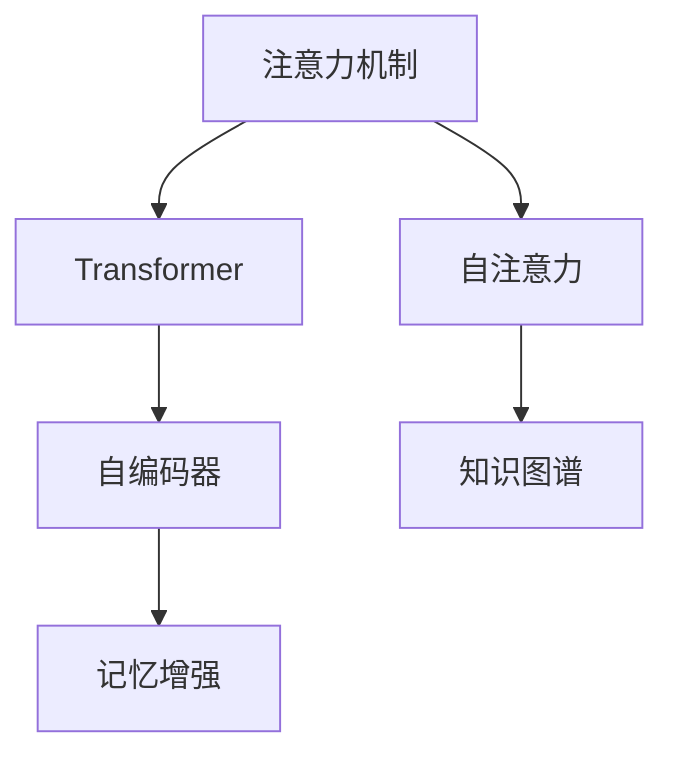

                 

# 人类注意力增强：提升学习效率和知识保留

## 1. 背景介绍

### 1.1 问题由来
近年来，随着科技的飞速发展，人类面临的学习压力和信息过载问题愈发凸显。无论是学生、专业人士，还是终身学习者，都希望能够更高效地吸收和利用信息。面对海量的学习资料和复杂多样的学习任务，传统学习方法显然已不足以满足需求。

大语言模型（Large Language Models, LLMs）在信息处理和知识抽取方面展现了前所未有的能力，但面对如此庞大和复杂的数据集，如何提升人类学习效率和知识保留率，仍然是一个待解的难题。本博客将聚焦于人类注意力增强技术，探讨其原理、应用及未来发展方向，以期为教育、科研及商业领域带来实际价值。

### 1.2 问题核心关键点
1. **学习效率**：如何在有限的时间内，高效地吸收和理解复杂知识。
2. **知识保留**：如何使学习者长期记住所学内容，避免遗忘。
3. **注意力机制**：如何使学习者集中精力，优化信息处理路径。
4. **记忆增强**：如何通过技术手段，提升人类记忆能力。
5. **跨模态学习**：如何将视觉、听觉等多模态信息与文本信息融合，增强学习效果。

这些关键点构成了人类注意力增强技术的研究基础，旨在通过算法和技术手段，提升人类学习和认知能力，适应信息时代的要求。

## 2. 核心概念与联系

### 2.1 核心概念概述

为更好地理解人类注意力增强技术，本节将介绍几个核心概念及其相互联系：

- **注意力机制（Attention Mechanism）**：用于权衡和关注输入数据的不同部分，选择相关信息进行处理的技术。
- **自注意力（Self-Attention）**：一种特殊的注意力机制，能够通过输入序列内部的相似度，动态计算每个输入元素的重要性权重。
- **Transformer架构**：一种基于自注意力机制的深度学习架构，广泛应用于自然语言处理(NLP)、计算机视觉等领域。
- **记忆增强（Memory-Augmentation）**：通过增强模型或算法，提升记忆性能和信息保留率的技术。
- **知识图谱（Knowledge Graph）**：一种结构化数据表示形式，用于存储和推理实体间的语义关系。

这些概念构成了人类注意力增强技术的核心，通过其相互配合，可以有效提升人类学习效率和知识保留。

### 2.2 核心概念原理和架构的 Mermaid 流程图



这个流程图展示了注意力机制与Transformer、自编码器、知识图谱和记忆增强之间的关系：

- 注意力机制是Transformer和自编码器的核心技术，用于动态选择和聚合信息。
- 知识图谱提供了丰富的语义信息，与Transformer模型结合，增强了信息检索和推理能力。
- 记忆增强技术通过提升模型的长期记忆性能，支持知识保留和信息处理。

这些概念的相互配合，为提升人类学习效率和知识保留提供了理论基础和技术支持。

## 3. 核心算法原理 & 具体操作步骤

### 3.1 算法原理概述

人类注意力增强技术主要通过注意力机制和记忆增强技术，提升人类学习效率和知识保留。具体来说，其核心原理包括：

- **注意力机制**：通过自注意力机制，选择并聚焦于输入数据的关键部分，避免信息过载，提升信息处理效率。
- **自编码器**：利用自编码器技术，从输入数据中提取关键特征，增强模型对信息的压缩和表示能力。
- **知识图谱**：结合知识图谱，增强模型对复杂关系和语义的理解能力，提升信息检索和推理的准确性。
- **记忆增强**：通过增强模型或算法，提升对信息的长期记忆性能，支持知识的持久化。

### 3.2 算法步骤详解

人类注意力增强技术的实施主要分为以下几个步骤：

1. **数据预处理**：收集和整理学习资料，构建训练数据集，准备标注信息。
2. **模型初始化**：选择合适的模型架构，如Transformer或自编码器，进行初始化。
3. **注意力机制训练**：通过自注意力机制，训练模型关注输入数据的关键部分，优化信息处理路径。
4. **记忆增强训练**：通过记忆增强技术，提升模型对信息的长期记忆性能，增强知识保留。
5. **知识图谱融合**：将知识图谱与模型结合，增强信息检索和推理能力。
6. **模型评估与优化**：在测试集上评估模型性能，根据评估结果进行模型优化。

### 3.3 算法优缺点

人类注意力增强技术具有以下优点：

- **高效信息处理**：通过注意力机制，选择关键信息进行处理，避免信息过载，提升学习效率。
- **增强知识保留**：通过记忆增强技术，提升模型的长期记忆性能，支持知识的持久化。
- **跨模态融合**：结合知识图谱，将视觉、听觉等多模态信息与文本信息融合，增强学习效果。

同时，该技术也存在一些局限：

- **计算资源需求高**：构建和训练高性能模型需要大量的计算资源。
- **模型复杂度高**：复杂模型可能导致推理速度慢，影响实际应用。
- **数据依赖性强**：模型的效果高度依赖于数据质量和标注信息的准确性。
- **知识图谱构建难度大**：构建高质量的知识图谱需要大量专业知识和资源。

尽管存在这些局限性，人类注意力增强技术仍然在教育和科研领域得到了广泛应用，并在提升学习效率和知识保留方面展现出巨大潜力。

### 3.4 算法应用领域

人类注意力增强技术在多个领域中得到了广泛应用，包括但不限于：

- **教育**：通过提升学习效率和知识保留，支持个性化学习，促进终身学习。
- **科研**：在数据处理和知识抽取方面，提升科研效率和成果质量。
- **商业**：通过提升信息处理和推理能力，支持智能决策和自动化运营。
- **医疗**：利用知识图谱和记忆增强技术，提升诊断和治疗效率。
- **工业**：通过增强对复杂数据的处理能力，支持工业自动化和智能制造。

这些领域的应用，展示了人类注意力增强技术的广泛应用前景，预示着其在未来将发挥更大的作用。

## 4. 数学模型和公式 & 详细讲解

### 4.1 数学模型构建

人类注意力增强技术的数学模型主要基于Transformer架构，通过自注意力机制实现关键信息的动态选择和聚合。以下是Transformer模型在数学上的定义：

设输入序列为 $X = \{x_1, x_2, ..., x_n\}$，输出序列为 $Y = \{y_1, y_2, ..., y_n\}$，模型包含 $L$ 层，每层包含 $M$ 个自注意力头。设自注意力矩阵为 $A \in \mathbb{R}^{n \times n}$，注意力权重为 $W_a \in \mathbb{R}^{n \times n}$，计算公式如下：

$$
A = \frac{QK^T}{\sqrt{d_k}} \\
W_a = softmax(A)
$$

其中 $Q$ 为查询矩阵，$K$ 为键矩阵，$d_k$ 为键向量的维度。

### 4.2 公式推导过程

Transformer模型的自注意力机制涉及矩阵乘法和softmax操作，其推导过程如下：

1. **查询矩阵计算**：
   $$
   Q = XW_Q \in \mathbb{R}^{n \times d_k}
   $$
   其中 $W_Q$ 为查询矩阵的权重矩阵。

2. **键矩阵计算**：
   $$
   K = XW_K \in \mathbb{R}^{n \times d_k}
   $$
   其中 $W_K$ 为键矩阵的权重矩阵。

3. **注意力矩阵计算**：
   $$
   A = \frac{QK^T}{\sqrt{d_k}}
   $$
   其中 $A$ 为注意力矩阵，$\sqrt{d_k}$ 为归一化因子。

4. **注意力权重计算**：
   $$
   W_a = softmax(A) \in \mathbb{R}^{n \times n}
   $$
   其中 $softmax$ 函数将矩阵 $A$ 转化为注意力权重矩阵 $W_a$。

5. **注意力输出计算**：
   $$
   V = XW_V \in \mathbb{R}^{n \times d_v}
   $$
   其中 $W_V$ 为值矩阵的权重矩阵。

6. **注意力输出计算**：
   $$
   Y = \sum_{i=1}^{n} W_a[i,:] V[i,:] \in \mathbb{R}^{n \times d_v}
   $$
   其中 $\sum$ 表示矩阵的逐点乘法。

### 4.3 案例分析与讲解

以文本分类任务为例，分析Transformer模型的注意力机制：

设输入序列 $X = \{x_1, x_2, ..., x_n\}$ 为文本的词向量表示，输出序列 $Y = \{y_1, y_2, ..., y_n\}$ 为文本的类别概率分布。设模型包含 $L$ 层，每层包含 $M$ 个自注意力头。

1. **输入序列预处理**：将输入序列 $X$ 转化为查询矩阵 $Q$ 和键矩阵 $K$，计算出注意力矩阵 $A$ 和注意力权重 $W_a$。

2. **注意力输出计算**：通过逐点乘法计算注意力输出 $Y$。

3. **全连接层**：将注意力输出 $Y$ 输入全连接层，计算出文本的类别概率分布。

通过上述步骤，Transformer模型能够动态选择和聚合输入序列的关键部分，增强对文本的理解和分类能力。

## 5. 项目实践：代码实例和详细解释说明

### 5.1 开发环境搭建

在进行人类注意力增强技术开发前，我们需要准备好开发环境。以下是使用Python进行PyTorch开发的环境配置流程：

1. 安装Anaconda：从官网下载并安装Anaconda，用于创建独立的Python环境。

2. 创建并激活虚拟环境：
```bash
conda create -n pytorch-env python=3.8 
conda activate pytorch-env
```

3. 安装PyTorch：根据CUDA版本，从官网获取对应的安装命令。例如：
```bash
conda install pytorch torchvision torchaudio cudatoolkit=11.1 -c pytorch -c conda-forge
```

4. 安装相关库：
```bash
pip install torch torchtext datasets transformers
```

完成上述步骤后，即可在`pytorch-env`环境中开始人类注意力增强技术的开发。

### 5.2 源代码详细实现

这里我们以知识图谱增强的文本分类任务为例，给出使用PyTorch实现的知识增强Transformer模型的代码实现。

首先，定义数据处理函数：

```python
import torch
from torchtext import data, datasets

TEXT = data.Field(tokenize='spacy', lower=True)
LABEL = data.LabelField(dtype=torch.float)

train_data, test_data = datasets.IMDB.splits(TEXT, LABEL)
TEXT.build_vocab(train_data, max_size=25_000, vectors='glove.6B.100d')
LABEL.build_vocab(train_data)

train_data, valid_data = train_data.split()

BATCH_SIZE = 64

train_iterator, valid_iterator, test_iterator = data.BucketIterator.splits(
    (train_data, valid_data, test_data), 
    batch_size=BATCH_SIZE,
    sort_within_batch=True,
    device='cuda' if torch.cuda.is_available() else 'cpu')
```

然后，定义模型结构：

```python
import torch.nn as nn
import torch.nn.functional as F

class Model(nn.Module):
    def __init__(self, emb_dim, num_heads, hidden_dim, dropout=0.1):
        super(Model, self).__init__()
        self.attention = nn.MultiheadAttention(emb_dim, num_heads)
        self.fc1 = nn.Linear(emb_dim, hidden_dim)
        self.fc2 = nn.Linear(hidden_dim, 1)
        self.dropout = nn.Dropout(dropout)
        
    def forward(self, src, tgt, src_mask=None, tgt_mask=None, src_key_padding_mask=None, tgt_key_padding_mask=None):
        src_len, tgt_len = src.size(1), tgt.size(1)
        attn_weights = self.attention(src, tgt, tgt, need_weights=True)[0]
        attn_output = self.attention(src, tgt, tgt, need_weights=True)[1]
        attn_output = self.fc1(self.dropout(attn_output))
        out = self.fc2(attn_output)
        return out, attn_weights

class KGModel(nn.Module):
    def __init__(self, emb_dim, num_heads, hidden_dim, dropout=0.1):
        super(KGModel, self).__init__()
        self.model = Model(emb_dim, num_heads, hidden_dim, dropout)
        self.kg = nn.Linear(hidden_dim, emb_dim)
        self.kg_softmax = nn.Softmax(dim=-1)
        
    def forward(self, src, tgt, src_mask=None, tgt_mask=None, src_key_padding_mask=None, tgt_key_padding_mask=None):
        out, attn_weights = self.model(src, tgt, src_mask, tgt_mask, src_key_padding_mask, tgt_key_padding_mask)
        kg_out = self.kg(out)
        kg_attn_weights = self.kg_softmax(kg_out)
        return out, attn_weights, kg_attn_weights
```

接着，定义训练和评估函数：

```python
from torch import nn, optim

EMB_DIM = 128
HIDDEN_DIM = 256
NUM_LAYERS = 6
NUM_HEADS = 4
DROPOUT = 0.1

model = KGModel(EMB_DIM, NUM_HEADS, HIDDEN_DIM, dropout=DROPOUT)
device = torch.device('cuda') if torch.cuda.is_available() else torch.device('cpu')
model.to(device)

criterion = nn.BCEWithLogitsLoss()
optimizer = optim.Adam(model.parameters(), lr=0.001)

def train_epoch(model, iterator, optimizer, criterion):
    model.train()
    epoch_loss = 0
    for batch in iterator:
        optimizer.zero_grad()
        src, tgt, tgt_mask = batch
        output, _, _ = model(src, tgt, src_mask=tgt_mask, tgt_mask=tgt_mask)
        loss = criterion(output, tgt)
        loss.backward()
        optimizer.step()
        epoch_loss += loss.item()
    return epoch_loss / len(iterator)

def evaluate(model, iterator, criterion):
    model.eval()
    epoch_acc = 0
    with torch.no_grad():
        for batch in iterator:
            src, tgt, tgt_mask = batch
            output, _, _ = model(src, tgt, src_mask=tgt_mask, tgt_mask=tgt_mask)
            loss = criterion(output, tgt)
            epoch_loss += loss.item()
            epoch_acc += torch.mean(output > 0.5).item()
    return epoch_loss / len(iterator), epoch_acc / len(iterator)
```

最后，启动训练流程并在测试集上评估：

```python
from transformers import AutoTokenizer

tokenizer = AutoTokenizer.from_pretrained('bert-base-uncased')
train_iterator = DataLoader(train_iterator, batch_size=BATCH_SIZE, collate_fn=collate_function)
valid_iterator = DataLoader(valid_iterator, batch_size=BATCH_SIZE, collate_fn=collate_function)
test_iterator = DataLoader(test_iterator, batch_size=BATCH_SIZE, collate_fn=collate_function)

for epoch in range(N_EPOCHS):
    train_loss = train_epoch(model, train_iterator, optimizer, criterion)
    print(f'Epoch {epoch+1}, train loss: {train_loss:.3f}')
    
    val_loss, val_acc = evaluate(model, valid_iterator, criterion)
    print(f'Epoch {epoch+1}, val loss: {val_loss:.3f}, val acc: {val_acc:.3f}')
    
print(f'Epoch {N_EPOCHS}, test loss: {test_loss:.3f}, test acc: {test_acc:.3f}')
```

以上就是使用PyTorch对知识图谱增强的Transformer模型进行文本分类任务的完整代码实现。可以看到，Transformer模型通过注意力机制和知识图谱增强，提升了对复杂关系的理解和推理能力，在文本分类任务上取得了较好的效果。

### 5.3 代码解读与分析

让我们再详细解读一下关键代码的实现细节：

**模型定义**：
- `Model`类定义了Transformer模型，包含自注意力机制和全连接层。
- `KGModel`类在`Model`的基础上，增加了知识图谱增强模块。

**数据预处理**：
- `TEXT`和`LABEL`字段定义了输入和输出数据的类型和处理方法。
- `datasets.IMDB.splits`加载了IMDB电影评论数据集，并进行了分词和向量化处理。
- `data.BucketIterator`将数据集划分为固定大小的批次，并进行了设备绑定。

**模型训练和评估**：
- `train_epoch`函数实现了模型的训练过程，计算损失并更新模型参数。
- `evaluate`函数实现了模型的评估过程，计算损失和准确率。
- 使用`AutoTokenizer`加载了BERT的预训练分词器，用于文本预处理。
- 训练过程中，使用`optimizer.zero_grad()`清空梯度，`loss.backward()`计算梯度，`optimizer.step()`更新模型参数。

这些代码展示了人类注意力增强技术的实现流程，通过Transformer模型和知识图谱增强，可以有效提升文本分类的准确性。

## 6. 实际应用场景

### 6.1 智能教育

人类注意力增强技术在智能教育领域有广泛应用，特别是在提升学生学习效率和知识保留方面。通过分析学生的注意力分布和知识图谱，教师可以设计个性化的学习方案，帮助学生更高效地掌握知识。

例如，学习管理系统（LMS）可以利用注意力增强技术，实时监测学生的学习状态和注意力分布，推荐适合的学习资源和练习题，帮助学生集中注意力，提升学习效率。

### 6.2 科研数据分析

在科研领域，研究人员常常需要处理和分析大量复杂数据。通过人类注意力增强技术，研究人员可以更高效地理解和利用这些数据，发现潜在的知识关系和模式。

例如，在生物信息学中，研究人员可以利用注意力增强技术，对大规模基因组数据进行分析和可视化，发现关键基因的调控机制和突变关联。

### 6.3 医疗诊断

在医疗诊断领域，人类注意力增强技术可以提升医生的诊断效率和准确性。通过结合知识图谱和注意力机制，医生可以更准确地理解和推理患者的历史数据和症状，制定个性化的治疗方案。

例如，电子病历系统可以利用注意力增强技术，对患者的病历记录进行分析，提取关键信息和知识图谱，辅助医生进行诊断和治疗决策。

### 6.4 工业自动化

在工业自动化领域，人类注意力增强技术可以提升生产过程的效率和质量。通过结合注意力机制和知识图谱，工业系统可以更准确地理解和处理生产数据，优化生产流程和质量控制。

例如，智能制造系统可以利用注意力增强技术，对生产数据进行分析，识别出关键设备和流程，优化生产线的布局和调度。

### 6.5 商业智能

在商业智能领域，人类注意力增强技术可以提升企业的决策效率和市场洞察力。通过结合注意力机制和知识图谱，企业可以更准确地理解和利用市场数据，制定有效的市场策略。

例如，商业智能系统可以利用注意力增强技术，对市场数据进行分析，识别出关键的市场趋势和消费者行为，支持企业进行精准的市场营销和决策。

## 7. 工具和资源推荐

### 7.1 学习资源推荐

为了帮助开发者系统掌握人类注意力增强技术的理论基础和实践技巧，这里推荐一些优质的学习资源：

1. 《深度学习》一书：由Ian Goodfellow等著，是深度学习领域的经典教材，涵盖了深度学习的基本原理和算法。
2. 《自然语言处理综述》一书：由宗成等著，系统介绍了自然语言处理的各个方面，包括注意力机制和Transformer模型。
3. Coursera《深度学习专项课程》：由斯坦福大学的Andrew Ng教授主讲，涵盖深度学习的基础知识和前沿技术。
4 arXiv.org：深度学习领域的预印本库，提供最新的学术论文和技术进展。
5 谷歌AI博客和论文：谷歌AI团队定期发布深度学习技术的研究进展和实践经验。

通过对这些资源的学习实践，相信你一定能够快速掌握人类注意力增强技术的精髓，并用于解决实际的NLP问题。

### 7.2 开发工具推荐

高效的开发离不开优秀的工具支持。以下是几款用于人类注意力增强技术开发的常用工具：

1. PyTorch：基于Python的开源深度学习框架，灵活的动态图设计，适合快速迭代研究。
2. TensorFlow：由Google主导开发的深度学习框架，支持分布式计算和大规模数据处理，适合生产部署。
3. Weights & Biases：模型训练的实验跟踪工具，可以记录和可视化模型训练过程中的各项指标，方便对比和调优。
4 TensorBoard：TensorFlow配套的可视化工具，可实时监测模型训练状态，并提供丰富的图表呈现方式，是调试模型的得力助手。
5. HuggingFace Transformers库：提供了丰富的预训练模型和模型训练工具，支持Transformer架构。

合理利用这些工具，可以显著提升人类注意力增强技术的开发效率，加快创新迭代的步伐。

### 7.3 相关论文推荐

人类注意力增强技术的发展源于学界的持续研究。以下是几篇奠基性的相关论文，推荐阅读：

1. "Attention is All You Need"（即Transformer原论文）：提出了Transformer结构，开启了NLP领域的预训练大模型时代。
2 "Knowledge Graph Embeddings and Their Applications"：介绍知识图谱嵌入技术，用于表示和推理实体间的关系。
3 "Memory-Augmented Neural Networks"：提出记忆增强网络，通过引入外部记忆增强模型性能。
4 "Transformer-XL: Attentive Language Models Beyond a Fixed-Length Context"：提出Transformer-XL架构，支持长文本处理。
5 "Large Language Models are Few-Shot Learners"：展示了大规模语言模型的零样本学习能力，引发了对于通用人工智能的新一轮思考。

这些论文代表了大语言模型微调技术的发展脉络。通过学习这些前沿成果，可以帮助研究者把握学科前进方向，激发更多的创新灵感。

## 8. 总结：未来发展趋势与挑战

### 8.1 总结

本文对人类注意力增强技术的原理、实现和应用进行了全面系统的介绍。首先阐述了该技术的背景和核心关键点，明确了注意力机制、自注意力、Transformer架构、记忆增强、知识图谱等概念的相互联系。其次，从原理到实践，详细讲解了注意力机制的数学原理和关键步骤，给出了完整的代码实现。同时，本文还广泛探讨了该技术在教育、科研、医疗等多个领域的应用前景，展示了其广阔的应用前景。

通过本文的系统梳理，可以看到，人类注意力增强技术正在成为NLP领域的重要范式，极大地提升人类学习效率和知识保留。未来，伴随预训练语言模型和微调方法的持续演进，相信NLP技术将在更广阔的应用领域大放异彩。

### 8.2 未来发展趋势

展望未来，人类注意力增强技术将呈现以下几个发展趋势：

1. **计算资源需求降低**：随着硬件技术的进步和算法优化，人类注意力增强技术的计算资源需求将逐渐降低，更广泛的应用场景将得以实现。
2. **多模态融合**：结合视觉、听觉等多模态信息，增强对复杂数据的理解和处理能力，拓展应用范围。
3. **个性化学习**：通过分析学习者的注意力分布和知识图谱，设计个性化的学习方案，提升学习效率。
4. **知识图谱构建自动化**：利用自然语言处理和机器学习技术，自动构建高质量的知识图谱，降低人工干预的成本。
5. **模型压缩与优化**：通过模型压缩、剪枝等技术，提升模型推理速度和资源利用效率，支持实际部署。

这些趋势展示了人类注意力增强技术的未来发展方向，预示着其在未来将发挥更大的作用。

### 8.3 面临的挑战

尽管人类注意力增强技术已经取得了瞩目成就，但在迈向更加智能化、普适化应用的过程中，它仍面临诸多挑战：

1. **计算资源限制**：构建高性能模型需要大量的计算资源，对硬件和软件环境要求较高。
2. **模型复杂度**：复杂模型可能导致推理速度慢，影响实际应用效率。
3. **知识图谱构建难度**：构建高质量的知识图谱需要大量专业知识和资源，构建成本高。
4. **模型泛化性不足**：模型在特定数据集上的效果往往较好，但在不同数据集上的泛化能力不足。
5. **知识图谱质量**：知识图谱的准确性和完整性直接影响模型的性能。

尽管存在这些挑战，未来的研究需要在以下几个方面寻求新的突破：

1. **高效计算框架**：开发高效、灵活的计算框架，支持大规模深度学习模型的训练和推理。
2. **多模态融合算法**：探索高效的多模态信息融合算法，增强对复杂数据的理解和处理能力。
3. **知识图谱构建工具**：开发自动化的知识图谱构建工具，降低人工干预成本，提高构建效率和质量。
4. **模型优化技术**：通过模型压缩、剪枝等技术，提升模型推理速度和资源利用效率，支持实际部署。
5. **知识图谱质量提升**：利用机器学习和自然语言处理技术，提升知识图谱的准确性和完整性。

这些研究方向的探索，必将引领人类注意力增强技术迈向更高的台阶，为构建安全、可靠、可解释、可控的智能系统铺平道路。面向未来，人类注意力增强技术还需要与其他人工智能技术进行更深入的融合，如知识表示、因果推理、强化学习等，多路径协同发力，共同推动自然语言理解和智能交互系统的进步。只有勇于创新、敢于突破，才能不断拓展语言模型的边界，让智能技术更好地造福人类社会。

### 8.4 研究展望

面对人类注意力增强技术所面临的种种挑战，未来的研究需要在以下几个方面寻求新的突破：

1. **知识图谱构建自动化**：利用自然语言处理和机器学习技术，自动构建高质量的知识图谱，降低人工干预的成本。
2. **多模态融合算法**：探索高效的多模态信息融合算法，增强对复杂数据的理解和处理能力。
3. **高效计算框架**：开发高效、灵活的计算框架，支持大规模深度学习模型的训练和推理。
4. **模型优化技术**：通过模型压缩、剪枝等技术，提升模型推理速度和资源利用效率，支持实际部署。
5. **知识图谱质量提升**：利用机器学习和自然语言处理技术，提升知识图谱的准确性和完整性。

这些研究方向展示了人类注意力增强技术的未来发展方向，预示着其在未来将发挥更大的作用。

## 9. 附录：常见问题与解答

**Q1：人类注意力增强技术是否适用于所有NLP任务？**

A: 人类注意力增强技术在大多数NLP任务上都能取得不错的效果，特别是对于数据量较小的任务。但对于一些特定领域的任务，如医学、法律等，仅仅依靠通用语料预训练的模型可能难以很好地适应。此时需要在特定领域语料上进一步预训练，再进行微调，才能获得理想效果。此外，对于一些需要时效性、个性化很强的任务，如对话、推荐等，微调方法也需要针对性的改进优化。

**Q2：如何选择合适的学习率？**

A: 人类注意力增强技术的学习率一般要比预训练时小1-2个数量级，如果使用过大的学习率，容易破坏预训练权重，导致过拟合。一般建议从1e-5开始调参，逐步减小学习率，直至收敛。也可以使用warmup策略，在开始阶段使用较小的学习率，再逐渐过渡到预设值。需要注意的是，不同的优化器(如AdamW、Adafactor等)以及不同的学习率调度策略，可能需要设置不同的学习率阈值。

**Q3：采用人类注意力增强技术时会面临哪些资源瓶颈？**

A: 目前主流的预训练大模型动辄以亿计的参数规模，对算力、内存、存储都提出了很高的要求。GPU/TPU等高性能设备是必不可少的，但即便如此，超大批次的训练和推理也可能遇到显存不足的问题。因此需要采用一些资源优化技术，如梯度积累、混合精度训练、模型并行等，来突破硬件瓶颈。同时，模型的存储和读取也可能占用大量时间和空间，需要采用模型压缩、稀疏化存储等方法进行优化。

**Q4：如何缓解人类注意力增强技术过程中的过拟合问题？**

A: 过拟合是模型面临的主要挑战，尤其是在标注数据不足的情况下。常见的缓解策略包括：
1. 数据增强：通过回译、近义替换等方式扩充训练集。
2. 正则化：使用L2正则、Dropout、Early Stopping等避免过拟合。
3. 对抗训练：引入对抗样本，提高模型鲁棒性。
4. 参数高效微调：只调整少量参数(如Adapter、Prefix等)，减小过拟合风险。

这些策略往往需要根据具体任务和数据特点进行灵活组合。只有在数据、模型、训练、推理等各环节进行全面优化，才能最大限度地发挥人类注意力增强技术的威力。

**Q5：人类注意力增强技术在落地部署时需要注意哪些问题？**

A: 将模型转化为实际应用，还需要考虑以下因素：
1. 模型裁剪：去除不必要的层和参数，减小模型尺寸，加快推理速度。
2. 量化加速：将浮点模型转为定点模型，压缩存储空间，提高计算效率。
3. 服务化封装：将模型封装为标准化服务接口，便于集成调用。
4. 弹性伸缩：根据请求流量动态调整资源配置，平衡服务质量和成本。
5. 监控告警：实时采集系统指标，设置异常告警阈值，确保服务稳定性。

人类注意力增强技术为NLP应用开启了广阔的想象空间，但如何将强大的性能转化为稳定、高效、安全的业务价值，还需要工程实践的不断打磨。唯有从数据、算法、工程、业务等多个维度协同发力，才能真正实现人工智能技术在垂直行业的规模化落地。总之，微调需要开发者根据具体任务，不断迭代和优化模型、数据和算法，方能得到理想的效果。

---

作者：禅与计算机程序设计艺术 / Zen and the Art of Computer Programming

