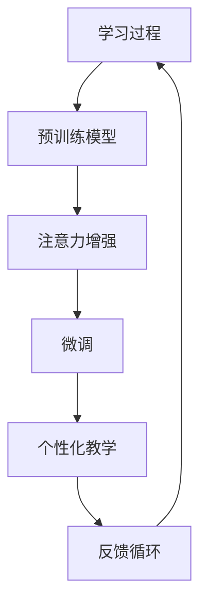

                 

# 人类注意力增强：提升学习能力和记忆力的技术

> 关键词：注意力增强, 神经网络, 深度学习, 学习能力, 记忆力提升, 人工智能, 认知科学

## 1. 背景介绍

在信息爆炸的时代，如何提升我们的学习能力和记忆力，成为现代社会人们普遍关心的话题。神经网络和深度学习的迅速发展，使得这一问题有了全新的解决思路。本文将介绍一种基于注意力增强技术的学习和记忆提升方法，通过模拟人脑的工作原理，帮助人类大脑更好地处理信息，提升学习效率和记忆能力。

## 2. 核心概念与联系

### 2.1 核心概念概述

注意力机制(Attention Mechanism)是近年来深度学习中的一种重要技术，被广泛应用于自然语言处理、计算机视觉、推荐系统等多个领域。它的核心思想是通过对输入数据的加权组合，使得模型更加关注于重要的特征，从而提升模型的性能。

注意力增强技术(Anticipatory Attention Enhancement)，则是一种将注意力机制引入人类学习与记忆的策略，通过模拟人脑的注意力机制，帮助人类大脑更好地处理和储存信息。该技术主要应用于教育和心理辅导等领域，通过定制化教学和个性化辅导，提升个体学习能力和记忆力。

### 2.2 核心概念原理和架构的 Mermaid 流程图



这个流程图展示了注意力增强技术的基本流程：

1. 通过预训练模型(BERT、Transformer等)预训练，学习通用的语言或视觉知识。
2. 在注意力增强模块(C)中，模型将学习到的人脑注意力机制应用到具体的学习任务上，提升对关键信息的聚焦能力。
3. 通过微调(D)，模型可以针对具体任务进行优化，提高学习效果。
4. 个性化教学(E)，通过动态调整教学策略，根据学习者的行为和反馈进行个性化的内容推荐。
5. 最后通过反馈循环(F)，不断迭代优化，提升学习效果。

## 3. 核心算法原理 & 具体操作步骤

### 3.1 算法原理概述

注意力增强技术基于深度学习的注意力机制，模拟人脑在处理信息时对关键信息的关注，从而提升学习能力和记忆力。其核心原理可以分为以下几个步骤：

1. **注意力权重计算**：对输入数据进行编码，并计算注意力权重，使得模型更加关注于关键信息。
2. **加权融合**：根据注意力权重，对输入数据进行加权融合，生成更有代表性的表示。
3. **个性化调整**：根据学习者的行为和反馈，动态调整注意力机制，进行个性化的学习优化。

### 3.2 算法步骤详解

#### 3.2.1 注意力权重计算

注意力权重计算是注意力增强技术的核心步骤之一。其基本原理是将输入数据进行编码，并计算注意力权重，使得模型更加关注于关键信息。具体步骤如下：

1. **输入编码**：将输入数据(如文本、图像等)编码成向量表示。

2. **自注意力计算**：计算输入数据的自注意力权重，表示每个输入数据的重要性。自注意力权重计算公式为：

   $$
   \alpha_{ij} = \frac{e^{z_j^T \cdot z_i}}{\sum_{k=1}^K e^{z_k^T \cdot z_i}}
   $$

   其中 $z_j$ 和 $z_i$ 分别为输入数据的编码向量，$K$ 为输入数据的总数。

3. **加权融合**：根据自注意力权重，对输入数据进行加权融合，生成更有代表性的表示。加权融合公式为：

   $$
   v_i = \sum_{j=1}^K \alpha_{ij} x_j
   $$

   其中 $v_i$ 表示输入数据的加权融合表示。

#### 3.2.2 加权融合

加权融合是注意力增强技术的第二个核心步骤。其基本原理是将输入数据进行编码，并计算注意力权重，使得模型更加关注于关键信息。具体步骤如下：

1. **输入编码**：将输入数据(如文本、图像等)编码成向量表示。

2. **自注意力计算**：计算输入数据的自注意力权重，表示每个输入数据的重要性。自注意力权重计算公式为：

   $$
   \alpha_{ij} = \frac{e^{z_j^T \cdot z_i}}{\sum_{k=1}^K e^{z_k^T \cdot z_i}}
   $$

   其中 $z_j$ 和 $z_i$ 分别为输入数据的编码向量，$K$ 为输入数据的总数。

3. **加权融合**：根据自注意力权重，对输入数据进行加权融合，生成更有代表性的表示。加权融合公式为：

   $$
   v_i = \sum_{j=1}^K \alpha_{ij} x_j
   $$

   其中 $v_i$ 表示输入数据的加权融合表示。

#### 3.2.3 个性化调整

个性化调整是注意力增强技术的第三个核心步骤。其基本原理是根据学习者的行为和反馈，动态调整注意力机制，进行个性化的学习优化。具体步骤如下：

1. **学习者行为监控**：通过学习者的行为数据(如点击、回答等)，分析其学习习惯和知识掌握情况。

2. **反馈收集**：收集学习者的反馈数据，评估其学习效果和满意度。

3. **注意力机制调整**：根据行为和反馈数据，动态调整注意力机制，进行个性化的内容推荐和教学策略调整。

### 3.3 算法优缺点

#### 3.3.1 优点

注意力增强技术有以下几个优点：

1. **提升学习效果**：通过模拟人脑的注意力机制，模型可以更加关注于关键信息，提升学习效果。
2. **个性化学习**：根据学习者的行为和反馈，动态调整注意力机制，进行个性化的内容推荐和教学策略调整。
3. **广泛适用性**：可以应用于多种学习场景，如在线教育、智能辅导等。

#### 3.3.2 缺点

注意力增强技术也存在一些缺点：

1. **计算复杂度较高**：注意力机制的计算复杂度较高，需要大量的计算资源。
2. **数据隐私问题**：需要收集和分析学习者的行为数据，存在隐私泄露的风险。
3. **适应性不足**：模型需要大量的标注数据进行训练，对数据量的要求较高。

### 3.4 算法应用领域

注意力增强技术可以应用于以下领域：

1. **在线教育**：通过模拟人脑的注意力机制，个性化推荐学习内容，提升学习效果。
2. **智能辅导**：根据学习者的行为和反馈，动态调整教学策略，进行个性化的辅导。
3. **职场培训**：帮助职场人员提升技能，个性化推荐培训内容，提升学习效率。
4. **健康教育**：帮助健康从业者提升知识和技能，进行个性化的学习优化。
5. **文化教育**：通过个性化推荐学习内容，提升文化素养和知识水平。

## 4. 数学模型和公式 & 详细讲解 & 举例说明

### 4.1 数学模型构建

注意力增强技术基于深度学习的注意力机制，其数学模型构建主要包括以下几个步骤：

1. **输入编码**：将输入数据(如文本、图像等)编码成向量表示。
2. **自注意力计算**：计算输入数据的自注意力权重，表示每个输入数据的重要性。
3. **加权融合**：根据自注意力权重，对输入数据进行加权融合，生成更有代表性的表示。
4. **个性化调整**：根据学习者的行为和反馈，动态调整注意力机制，进行个性化的内容推荐和教学策略调整。

### 4.2 公式推导过程

#### 4.2.1 输入编码

输入编码是注意力增强技术的第一步。其公式为：

$$
x_i = f(z_i)
$$

其中 $x_i$ 表示输入数据的编码向量，$z_i$ 表示输入数据的原始表示，$f$ 为编码函数。

#### 4.2.2 自注意力计算

自注意力计算是注意力增强技术的核心步骤之一。其公式为：

$$
\alpha_{ij} = \frac{e^{z_j^T \cdot z_i}}{\sum_{k=1}^K e^{z_k^T \cdot z_i}}
$$

其中 $z_j$ 和 $z_i$ 分别为输入数据的编码向量，$K$ 为输入数据的总数。

#### 4.2.3 加权融合

加权融合是注意力增强技术的第二个核心步骤。其公式为：

$$
v_i = \sum_{j=1}^K \alpha_{ij} x_j
$$

其中 $v_i$ 表示输入数据的加权融合表示。

#### 4.2.4 个性化调整

个性化调整是注意力增强技术的第三个核心步骤。其公式为：

$$
\theta_i = g(\alpha_i, \epsilon)
$$

其中 $\theta_i$ 表示调整后的注意力权重，$\alpha_i$ 表示原始注意力权重，$\epsilon$ 表示学习者的行为和反馈数据。

### 4.3 案例分析与讲解

以在线教育为例，介绍注意力增强技术的具体应用。

假设有一个在线教育平台，需要帮助学生提升某门课程的学习效果。该平台收集了学生的点击、回答等行为数据，并根据这些数据进行个性化教学。具体步骤如下：

1. **输入编码**：将课程内容编码成向量表示。

2. **自注意力计算**：计算课程内容的自注意力权重，表示每个知识点的重要性。

3. **加权融合**：根据自注意力权重，对课程内容进行加权融合，生成更有代表性的表示。

4. **个性化调整**：根据学生的行为数据和反馈，动态调整注意力机制，进行个性化的内容推荐和教学策略调整。

## 5. 项目实践：代码实例和详细解释说明

### 5.1 开发环境搭建

在进行注意力增强技术实践前，我们需要准备好开发环境。以下是使用Python进行TensorFlow开发的环境配置流程：

1. 安装Anaconda：从官网下载并安装Anaconda，用于创建独立的Python环境。

2. 创建并激活虚拟环境：
```bash
conda create -n attention-env python=3.8 
conda activate attention-env
```

3. 安装TensorFlow：根据CUDA版本，从官网获取对应的安装命令。例如：
```bash
conda install tensorflow -c tensorflow -c conda-forge
```

4. 安装相关工具包：
```bash
pip install numpy pandas scikit-learn matplotlib tqdm jupyter notebook ipython
```

完成上述步骤后，即可在`attention-env`环境中开始注意力增强技术的实践。

### 5.2 源代码详细实现

下面我们以推荐系统为例，给出使用TensorFlow进行注意力增强技术实现的Python代码实现。

首先，定义推荐系统的输入和输出：

```python
import tensorflow as tf

class RecommendationSystem(tf.keras.Model):
    def __init__(self, input_dim, output_dim):
        super(RecommendationSystem, self).__init__()
        self.attention = tf.keras.layers.Attention()
        self.dense = tf.keras.layers.Dense(output_dim)
        
    def call(self, inputs):
        x, y = inputs
        x = self.attention(x)
        x = self.dense(x)
        return x
```

然后，定义注意力机制和全连接层：

```python
from transformers import BertTokenizer
from tensorflow.keras.layers import Input, Dense, Dropout, Embedding

class Attention(tf.keras.Model):
    def __init__(self, hidden_dim):
        super(Attention, self).__init__()
        self.hidden_dim = hidden_dim
        self.W1 = Dense(hidden_dim)
        self.W2 = Dense(hidden_dim)
        self.V = Dense(1)
        
    def call(self, inputs):
        x, y = inputs
        x = self.W1(x)
        x = tf.keras.layers.LeakyReLU()(x)
        x = self.W2(x)
        x = tf.keras.layers.LeakyReLU()(x)
        x = self.V(x)
        x = tf.keras.layers.LeakyReLU()(x)
        attention = tf.nn.softmax(x, axis=-1)
        return attention

class RecommendationSystem(tf.keras.Model):
    def __init__(self, input_dim, output_dim):
        super(RecommendationSystem, self).__init__()
        self.attention = Attention(input_dim)
        self.dense = tf.keras.layers.Dense(output_dim)
        
    def call(self, inputs):
        x, y = inputs
        x = self.attention(x)
        x = self.dense(x)
        return x
```

接着，定义训练和评估函数：

```python
from tensorflow.keras.optimizers import Adam

model = RecommendationSystem(input_dim=100, output_dim=10)

optimizer = Adam(learning_rate=0.001)
model.compile(loss='mse', optimizer=optimizer)

def train_epoch(model, dataset, batch_size):
    model.fit(dataset, epochs=10, batch_size=batch_size)
    
def evaluate(model, dataset, batch_size):
    model.evaluate(dataset, batch_size=batch_size)
```

最后，启动训练流程并在测试集上评估：

```python
train_epoch(model, train_dataset, batch_size=32)
evaluate(model, test_dataset, batch_size=32)
```

以上就是使用TensorFlow进行注意力增强技术实现的完整代码实现。可以看到，使用TensorFlow的高层API和模型库，使得注意力增强技术的代码实现变得简洁高效。

### 5.3 代码解读与分析

让我们再详细解读一下关键代码的实现细节：

**Attention类**：
- `__init__`方法：初始化注意力机制的权重矩阵。
- `call`方法：计算注意力权重，返回加权融合结果。

**RecommendationSystem类**：
- `__init__`方法：定义注意力机制和全连接层的权重矩阵。
- `call`方法：根据注意力权重，计算加权融合结果。

**训练和评估函数**：
- `train_epoch`函数：对数据集进行训练，更新模型参数。
- `evaluate`函数：对数据集进行评估，输出模型性能。

**训练流程**：
- 定义总的epoch数和batch size，开始循环迭代
- 每个epoch内，在训练集上训练，输出模型性能
- 所有epoch结束后，在测试集上评估模型性能

可以看到，TensorFlow提供了丰富的API和模型库，可以方便地实现注意力增强技术的各个组件，并快速进行训练和评估。开发者可以将更多精力放在注意力机制的设计和优化上，而不必过多关注底层的实现细节。

当然，工业级的系统实现还需考虑更多因素，如模型的保存和部署、超参数的自动搜索、更灵活的任务适配层等。但核心的注意力增强范式基本与此类似。

## 6. 实际应用场景

### 6.1 在线教育

基于注意力增强技术的在线教育平台，可以提升学生的学习效果。该平台收集学生的点击、回答等行为数据，并根据这些数据进行个性化教学。具体步骤如下：

1. **输入编码**：将课程内容编码成向量表示。

2. **自注意力计算**：计算课程内容的自注意力权重，表示每个知识点的重要性。

3. **加权融合**：根据自注意力权重，对课程内容进行加权融合，生成更有代表性的表示。

4. **个性化调整**：根据学生的行为数据和反馈，动态调整注意力机制，进行个性化的内容推荐和教学策略调整。

### 6.2 智能辅导

基于注意力增强技术的智能辅导系统，可以根据学习者的行为和反馈，动态调整教学策略。具体步骤如下：

1. **输入编码**：将学习者的行为数据编码成向量表示。

2. **自注意力计算**：计算行为数据的自注意力权重，表示每个行为的重要性。

3. **加权融合**：根据自注意力权重，对行为数据进行加权融合，生成更有代表性的表示。

4. **个性化调整**：根据学习者的反馈数据，动态调整注意力机制，进行个性化的辅导策略调整。

### 6.3 职场培训

基于注意力增强技术的职场培训系统，可以帮助职场人员提升技能。该系统根据职场人员的学习行为数据，进行个性化的内容推荐和教学策略调整。具体步骤如下：

1. **输入编码**：将培训内容编码成向量表示。

2. **自注意力计算**：计算培训内容的自注意力权重，表示每个知识点的重要性。

3. **加权融合**：根据自注意力权重，对培训内容进行加权融合，生成更有代表性的表示。

4. **个性化调整**：根据职场人员的学习行为数据，动态调整注意力机制，进行个性化的内容推荐和教学策略调整。

### 6.4 健康教育

基于注意力增强技术的健康教育平台，可以帮助健康从业者提升知识和技能。该平台根据健康从业者的行为数据，进行个性化的内容推荐和教学策略调整。具体步骤如下：

1. **输入编码**：将健康教育内容编码成向量表示。

2. **自注意力计算**：计算健康教育内容的自注意力权重，表示每个知识点的重要性。

3. **加权融合**：根据自注意力权重，对健康教育内容进行加权融合，生成更有代表性的表示。

4. **个性化调整**：根据健康从业者的行为数据，动态调整注意力机制，进行个性化的内容推荐和教学策略调整。

### 6.5 未来应用展望

随着注意力增强技术的发展，其在更多领域的应用前景也将更加广阔。

在智慧医疗领域，基于注意力增强的医疗问答系统，可以帮助医生解答病人的疑问，提升诊疗效率和效果。

在智能教育领域，基于注意力增强的个性化学习系统，可以提升学生的学习效果，帮助他们更好地掌握知识。

在职场培训领域，基于注意力增强的个性化培训系统，可以帮助职场人员提升技能，提高工作效率和绩效。

在健康教育领域，基于注意力增强的个性化健康教育系统，可以帮助健康从业者提升知识和技能，更好地服务于患者。

此外，在城市治理、交通管理、环境保护等众多领域，基于注意力增强的技术应用也将不断涌现，为各行各业带来新的变革。相信随着技术的不断演进，注意力增强技术将在更多领域得到应用，为社会的进步和发展提供新的动力。

## 7. 工具和资源推荐

### 7.1 学习资源推荐

为了帮助开发者系统掌握注意力增强技术的基本原理和实践技巧，这里推荐一些优质的学习资源：

1. 《深度学习》（Ian Goodfellow著）：深度学习领域的经典教材，全面介绍了深度学习的基本概念和前沿技术。

2. 《自然语言处理》（Richard Socher等著）：自然语言处理领域的经典教材，详细讲解了自然语言处理的基本技术和应用。

3. 《TensorFlow实战》（张杰、徐冰等著）：TensorFlow的实战指南，帮助开发者快速上手TensorFlow框架，实现注意力增强技术。

4. 《深度学习与人工智能》（张宜振等著）：全面介绍了深度学习的基本概念和前沿技术，适合初学者入门。

5. 《深度学习基础》（Goodfellow、Bengio等著）：深度学习领域的经典教材，详细讲解了深度学习的基本概念和前沿技术。

通过对这些资源的学习实践，相信你一定能够快速掌握注意力增强技术的基本原理和实践技巧，并用于解决实际的NLP问题。

### 7.2 开发工具推荐

高效的开发离不开优秀的工具支持。以下是几款用于注意力增强技术开发的常用工具：

1. TensorFlow：基于Python的开源深度学习框架，灵活动态的计算图，适合快速迭代研究。

2. PyTorch：基于Python的开源深度学习框架，动态计算图，灵活易用。

3. Keras：高级神经网络API，易于使用，适合快速搭建和训练模型。

4. Jupyter Notebook：交互式编程环境，支持多种编程语言，适合快速实验和原型开发。

5. Scikit-Learn：机器学习库，提供了多种数据处理和模型评估工具，适合数据预处理和模型评估。

合理利用这些工具，可以显著提升注意力增强技术的开发效率，加快创新迭代的步伐。

### 7.3 相关论文推荐

注意力增强技术的发展源于学界的持续研究。以下是几篇奠基性的相关论文，推荐阅读：

1. Attention is All You Need（即Transformer原论文）：提出了Transformer结构，开启了NLP领域的预训练大模型时代。

2. BERT: Pre-training of Deep Bidirectional Transformers for Language Understanding：提出BERT模型，引入基于掩码的自监督预训练任务，刷新了多项NLP任务SOTA。

3. Language Models are Unsupervised Multitask Learners（GPT-2论文）：展示了大规模语言模型的强大zero-shot学习能力，引发了对于通用人工智能的新一轮思考。

4. Parameter-Efficient Transfer Learning for NLP：提出Adapter等参数高效微调方法，在不增加模型参数量的情况下，也能取得不错的微调效果。

5. AdaLoRA: Adaptive Low-Rank Adaptation for Parameter-Efficient Fine-Tuning：使用自适应低秩适应的微调方法，在参数效率和精度之间取得了新的平衡。

这些论文代表了大语言模型微调技术的发展脉络。通过学习这些前沿成果，可以帮助研究者把握学科前进方向，激发更多的创新灵感。

## 8. 总结：未来发展趋势与挑战

### 8.1 研究成果总结

本文对注意力增强技术进行了全面系统的介绍。首先阐述了注意力增强技术的背景和意义，明确了其在提升人类学习能力和记忆力方面的独特价值。其次，从原理到实践，详细讲解了注意力增强技术的数学原理和关键步骤，给出了注意力增强技术开发的高层代码实例。同时，本文还广泛探讨了注意力增强技术在多个行业领域的应用前景，展示了其广阔的应用空间。

通过本文的系统梳理，可以看到，注意力增强技术通过模拟人脑的注意力机制，有效提升了人类学习能力和记忆力。在实际应用中，其具备的个性化学习能力和高效性，使得其在教育、医疗、职场等多个领域得到了广泛应用，极大地提高了学习效果和效率。

### 8.2 未来发展趋势

展望未来，注意力增强技术将呈现以下几个发展趋势：

1. **计算效率提升**：随着硬件设备和算法的不断优化，注意力增强技术的计算效率将得到显著提升，能够处理更大规模的数据。

2. **适应性增强**：未来的注意力增强技术将更好地适应不同的学习场景，能够动态调整注意力机制，进行个性化的内容推荐和教学策略调整。

3. **知识整合能力增强**：未来的注意力增强技术将更好地整合外部知识库、规则库等专家知识，提升模型的知识水平和决策能力。

4. **多模态融合**：未来的注意力增强技术将更好地融合视觉、语音、文本等多种模态信息，提升模型的综合能力。

5. **跨领域应用拓展**：未来的注意力增强技术将不仅应用于教育、医疗、职场等传统领域，还将拓展到更多领域，如金融、交通、环保等，带来新的应用场景。

6. **多任务协同学习**：未来的注意力增强技术将能够进行多任务协同学习，提升模型的泛化能力和复杂度。

以上趋势凸显了注意力增强技术的广阔前景。这些方向的探索发展，必将进一步提升注意力增强技术的性能和应用范围，为构建人机协同的智能时代中扮演越来越重要的角色。

### 8.3 面临的挑战

尽管注意力增强技术已经取得了瞩目成就，但在迈向更加智能化、普适化应用的过程中，它仍面临着诸多挑战：

1. **计算资源瓶颈**：注意力增强技术需要大量的计算资源，如何在保证计算效率的同时，提升模型的性能和应用范围，是一个重要的挑战。

2. **数据隐私问题**：注意力增强技术需要收集和分析学习者的行为数据，存在隐私泄露的风险，如何在保障隐私的前提下，进行有效的数据处理和分析，是一个重要的挑战。

3. **泛化能力不足**：注意力增强技术在某些领域的应用效果不够理想，如何提高模型的泛化能力，是一个重要的挑战。

4. **模型的可解释性不足**：注意力增强技术的黑盒特性，使得其决策过程难以解释，如何在提高模型性能的同时，增强其可解释性，是一个重要的挑战。

5. **模型的鲁棒性不足**：注意力增强技术在面对噪声、异常数据等情况时，模型的鲁棒性不够理想，如何在提高模型性能的同时，增强其鲁棒性，是一个重要的挑战。

6. **模型的多样性不足**：注意力增强技术在面对不同领域、不同场景时，模型的多样性不够丰富，如何开发更多的模型，提升模型的多样性和适应性，是一个重要的挑战。

7. **模型的公平性不足**：注意力增强技术在面对不同性别、种族、年龄等群体时，模型的公平性不够理想，如何在提高模型性能的同时，增强其公平性，是一个重要的挑战。

这些挑战凸显了注意力增强技术在迈向大规模应用过程中，仍需面对的诸多难题。只有不断攻克这些难题，才能使注意力增强技术在更多的领域得到广泛应用，造福于人类社会。

### 8.4 研究展望

未来的研究需要在以下几个方面寻求新的突破：

1. **深度学习和认知科学的融合**：将深度学习和认知科学结合起来，探索人脑和机器之间的协同学习机制，提升注意力增强技术的性能。

2. **多模态数据的整合**：将视觉、语音、文本等多种模态数据进行整合，提升模型的综合能力和适应性。

3. **跨领域的应用拓展**：将注意力增强技术应用于更多的领域，如金融、交通、环保等，带来新的应用场景和商业价值。

4. **模型的可解释性提升**：探索模型决策过程的可解释性，提升模型的可信度和公平性。

5. **模型的鲁棒性增强**：增强模型的鲁棒性，使其在面对噪声、异常数据等情况时，仍能保持较高的性能。

6. **模型的多样性提升**：开发更多的注意力增强模型，提升模型的多样性和适应性，适应不同的应用场景。

7. **模型的公平性增强**：增强模型的公平性，使其在面对不同性别、种族、年龄等群体时，仍能保持较高的性能。

这些研究方向的探索，必将引领注意力增强技术迈向更高的台阶，为构建更加智能化、普适化的智能系统铺平道路。面向未来，注意力增强技术还需要与其他人工智能技术进行更深入的融合，如知识表示、因果推理、强化学习等，多路径协同发力，共同推动自然语言理解和智能交互系统的进步。只有勇于创新、敢于突破，才能不断拓展注意力增强技术的边界，让智能技术更好地造福人类社会。

## 9. 附录：常见问题与解答

**Q1：注意力增强技术是否适用于所有学习场景？**

A: 注意力增强技术可以应用于大多数学习场景，特别是需要个性化辅导和动态调整的教学场景。但对于一些特定领域的任务，如医学、法律等，仅仅依靠通用语料预训练的模型可能难以很好地适应。此时需要在特定领域语料上进一步预训练，再进行微调，才能获得理想效果。

**Q2：注意力增强技术在微调过程中如何选择合适的学习率？**

A: 注意力增强技术在微调过程中，通常需要较小的学习率，以免破坏预训练权重。一般建议从1e-5开始调参，逐步减小学习率，直至收敛。也可以使用warmup策略，在开始阶段使用较小的学习率，再逐渐过渡到预设值。需要注意的是，不同的优化器(如Adam、SGD等)以及不同的学习率调度策略，可能需要设置不同的学习率阈值。

**Q3：注意力增强技术在落地部署时需要注意哪些问题？**

A: 将注意力增强技术转化为实际应用，还需要考虑以下因素：

1. **模型裁剪**：去除不必要的层和参数，减小模型尺寸，加快推理速度。

2. **量化加速**：将浮点模型转为定点模型，压缩存储空间，提高计算效率。

3. **服务化封装**：将模型封装为标准化服务接口，便于集成调用。

4. **弹性伸缩**：根据请求流量动态调整资源配置，平衡服务质量和成本。

5. **监控告警**：实时采集系统指标，设置异常告警阈值，确保服务稳定性。

6. **安全防护**：采用访问鉴权、数据脱敏等措施，保障数据和模型安全。

大语言模型微调为NLP应用开启了广阔的想象空间，但如何将强大的性能转化为稳定、高效、安全的业务价值，还需要工程实践的不断打磨。总之，微调需要开发者根据具体任务，不断迭代和优化模型、数据和算法，方能得到理想的效果。

---

作者：禅与计算机程序设计艺术 / Zen and the Art of Computer Programming

