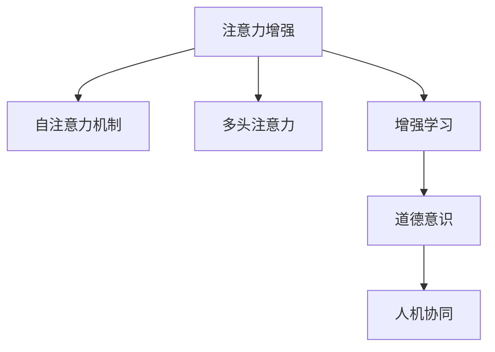

                 

# 人类注意力增强：提升道德意识和决策

> 关键词：注意力增强，道德意识提升，人工智能决策，深度学习，强化学习

## 1. 背景介绍

### 1.1 问题由来

随着人工智能(AI)技术的不断发展和应用，其在各个领域的表现已经远超人类预期。然而，随着算法的智能程度不断提升，AI决策的透明性和道德性问题也愈发凸显。AI系统在没有明确的道德指导和人类监督的情况下，可能会做出损害人类利益的行为。例如，自动驾驶车辆在紧急情况下如何选择，推荐系统如何避免信息误导，这些都是当前AI领域需要解决的重要问题。

### 1.2 问题核心关键点

目前，AI决策中的道德问题主要集中在以下几个方面：

- **透明度和可解释性**：AI模型的决策过程是否透明、可解释，用户能否理解模型的行为和决策依据。
- **公平性和偏见**：AI模型是否对不同人群、不同数据样本有公平对待，避免种族、性别、年龄等偏见。
- **隐私和数据安全**：AI模型如何处理敏感数据，保护用户隐私不被泄露或滥用。
- **责任和法律问题**：当AI系统出现错误决策导致事故或损失，责任应由谁承担，如何界定和监管。

为了解决这些问题，研究人员提出了各种方案，其中之一就是通过增强人类注意力，提升AI系统的道德意识和决策能力。

## 2. 核心概念与联系

### 2.1 核心概念概述

为更好地理解注意力增强的机制，本节将介绍几个关键概念：

- **注意力机制(Attention Mechanism)**：一种机制，用于在输入序列中突出重要部分，忽略无关细节，增强模型的决策能力。常见的注意力机制包括自注意力机制(Self-Attention)和多头注意力(Multi-Head Attention)。

- **道德意识(Moral Consciousness)**：指AI系统对于其行为是否符合道德标准，以及是否能够自我调节行为的意识。

- **增强学习(Reinforcement Learning, RL)**：一种通过奖励信号来指导AI系统行为的学习方式，使系统能够自我学习和优化。

- **人机协同(Human-AI Collaboration)**：通过增强注意力机制和伦理导向，使AI系统与人类共同协作，提升AI的决策质量和道德水平。

这些概念之间的联系可以通过以下Mermaid流程图来展示：



这个流程图展示了注意力增强机制通过注意力机制的提升，增强AI系统的决策能力，通过增强学习实现自我优化和道德意识提升，最终达到人机协同的效果。

## 3. 核心算法原理 & 具体操作步骤
### 3.1 算法原理概述

注意力增强机制的核心思想是通过增强AI系统对重要信息的关注度，提升其决策的质量和道德水平。具体来说，通过引入注意力机制，AI系统能够更加关注关键特征，忽略无关细节，从而在处理复杂数据时更加准确和高效。同时，通过增强学习，系统能够根据反馈不断调整其行为策略，避免有害行为。

在道德意识提升方面，我们引入伦理导向的目标函数，指导AI系统在决策时考虑道德标准。具体来说，我们将道德评价指标融入奖励函数，使AI系统在行为时能够关注其道德后果。

### 3.2 算法步骤详解

基于注意力增强机制和伦理导向，AI决策过程可以大致分为以下几个步骤：

**Step 1: 数据预处理**
- 收集与决策任务相关的数据，进行清洗和标准化处理。
- 将数据划分为训练集和测试集，以便进行模型训练和评估。

**Step 2: 模型构建**
- 选择适合的注意力机制模型，如Transformer、LSTM等。
- 添加伦理导向的损失函数，如Kullback-Leibler散度、互信息等，指导模型学习。
- 设计合理的奖励函数，将道德评价指标融入损失函数。

**Step 3: 训练与优化**
- 使用训练集数据，对模型进行优化训练，通过反向传播更新模型参数。
- 在每个训练周期后，使用测试集评估模型性能，调整模型参数。
- 在训练过程中，使用正则化技术，如L2正则、Dropout等，防止过拟合。

**Step 4: 道德评价与调整**
- 在测试阶段，对AI系统进行道德评价，评估其决策是否符合伦理标准。
- 根据道德评价结果，调整模型参数和奖励函数，进行进一步优化。
- 引入对抗样本，训练AI系统抵抗恶意攻击，增强其鲁棒性。

### 3.3 算法优缺点

注意力增强机制在提升AI决策质量和道德水平方面具有以下优点：

- **增强决策准确性**：通过集中注意力在关键特征上，增强了AI系统对复杂数据的处理能力，提升了决策的准确性。
- **提升道德意识**：通过引入伦理导向的奖励函数，指导AI系统关注道德后果，提升了系统的道德意识。
- **优化人机协同**：增强学习机制使AI系统能够自我调整和优化，提升了人机协作的效率和质量。

同时，该机制也存在一定的局限性：

- **计算复杂度高**：注意力机制和增强学习机制的计算量较大，对硬件资源要求较高。
- **道德标准主观性强**：伦理导向的目标函数需要人为定义，不同文化和价值观下对道德的判断可能不同，难以形成统一的道德标准。
- **对抗攻击风险**：AI系统在面对恶意对抗样本时，可能会出现错误的决策，降低道德评价的准确性。

尽管存在这些局限性，但通过合理设计算法和参数，可以最大化地发挥注意力增强机制的优势，在实际应用中取得良好的效果。

### 3.4 算法应用领域

注意力增强机制已经被广泛应用于以下领域：

- **金融风险评估**：在金融交易中，AI系统需要评估风险，做出合理决策。通过注意力增强，系统可以更加关注关键风险指标，避免误判。
- **医疗诊断**：在医疗诊断中，AI系统需要综合多模态数据进行诊断。通过注意力增强，系统可以更加关注患者的重要特征，提高诊断的准确性。
- **智能推荐**：在推荐系统中，AI系统需要根据用户历史行为和当前需求，做出合理推荐。通过注意力增强，系统可以更加关注用户的关键行为，提升推荐的个性化和准确性。
- **智能客服**：在智能客服中，AI系统需要处理用户提出的多种问题，做出合理回答。通过注意力增强，系统可以更加关注用户的意图，提升回答的准确性。
- **安全监控**：在安全监控中，AI系统需要识别和预警潜在威胁。通过注意力增强，系统可以更加关注关键异常特征，提高预警的及时性和准确性。

## 4. 数学模型和公式 & 详细讲解 & 举例说明

### 4.1 数学模型构建

为了更好地理解注意力增强机制的数学原理，本节将介绍几个关键的数学模型：

- **注意力机制**：设输入序列为 $x_1, x_2, ..., x_t$，注意力权重为 $\alpha_1, \alpha_2, ..., \alpha_t$，则注意力机制的输出可以表示为：

  $$
  y_t = \sum_{i=1}^t \alpha_i x_i
  $$

  其中，注意力权重 $\alpha_i$ 表示输入 $x_i$ 在输出 $y_t$ 中的贡献。

- **奖励函数**：设AI系统在某个时间步 $t$ 的决策为 $a_t$，道德评价指标为 $E_t$，则奖励函数 $R_t$ 可以表示为：

  $$
  R_t = E_t - \beta \sum_{i=1}^t \gamma^{i-1} E_i
  $$

  其中，$\beta$ 为折扣因子，$\gamma$ 为折扣率。

- **目标函数**：设模型参数为 $\theta$，损失函数为 $L$，则目标函数 $J(\theta)$ 可以表示为：

  $$
  J(\theta) = L(\theta) + \gamma \sum_{t=1}^T R_t
  $$

  其中，$T$ 为训练周期数。

### 4.2 公式推导过程

在实际应用中，我们通常使用以下步骤对模型进行训练和优化：

1. **数据预处理**：将原始数据标准化，并进行分词、编码等预处理。
2. **模型构建**：选择注意力机制模型，如Transformer，并定义伦理导向的损失函数。
3. **训练优化**：使用随机梯度下降(SGD)等优化算法，通过反向传播更新模型参数。
4. **道德评价与调整**：使用道德评价指标，评估模型决策的道德水平，并根据评价结果调整奖励函数。

### 4.3 案例分析与讲解

以金融风险评估为例，我们可以设计一个注意力增强的模型来提升AI系统的决策能力。具体步骤如下：

1. **数据预处理**：收集金融交易数据，进行标准化处理，并划分训练集和测试集。
2. **模型构建**：选择Transformer模型，并添加伦理导向的损失函数，如信息熵损失。
3. **训练优化**：使用SGD优化算法，通过反向传播更新模型参数。
4. **道德评价与调整**：使用道德评价指标，如公平性、透明性等，评估模型决策的道德水平，并根据评价结果调整奖励函数。

## 5. 项目实践：代码实例和详细解释说明
### 5.1 开发环境搭建

在进行注意力增强的实践前，我们需要准备好开发环境。以下是使用Python进行TensorFlow开发的环境配置流程：

1. 安装Anaconda：从官网下载并安装Anaconda，用于创建独立的Python环境。

2. 创建并激活虚拟环境：
```bash
conda create -n tf-env python=3.8 
conda activate tf-env
```

3. 安装TensorFlow：根据CUDA版本，从官网获取对应的安装命令。例如：
```bash
conda install tensorflow -c conda-forge
```

4. 安装各类工具包：
```bash
pip install numpy pandas scikit-learn matplotlib tqdm jupyter notebook ipython
```

完成上述步骤后，即可在`tf-env`环境中开始注意力增强的实践。

### 5.2 源代码详细实现

这里我们以金融风险评估为例，给出使用TensorFlow对注意力增强模型进行开发的PyTorch代码实现。

首先，定义金融风险评估的数据处理函数：

```python
import numpy as np
import tensorflow as tf
from sklearn.preprocessing import StandardScaler
from tensorflow.keras.layers import Dense, Input, Embedding, LSTM, Dropout, Attention
from tensorflow.keras.models import Model
from tensorflow.keras.losses import CategoricalCrossentropy
from tensorflow.keras.optimizers import SGD

def preprocess_data(data):
    # 数据标准化
    scaler = StandardScaler()
    data = scaler.fit_transform(data)
    return data
```

然后，定义模型和优化器：

```python
def build_model(input_dim, output_dim):
    # 定义模型输入和输出
    input_layer = Input(shape=(input_dim,))
    # 添加LSTM层，设置细胞数量为64，返回序列长度为1
    lstm_layer = LSTM(64, return_sequences=True)(input_layer)
    # 添加注意力层，设置注意力向量大小为4
    attention_layer = Attention()(lstm_layer)
    # 添加输出层，设置输出大小为输出维度
    output_layer = Dense(output_dim)(attention_layer)
    # 定义模型
    model = Model(inputs=input_layer, outputs=output_layer)
    return model

def train_model(model, data, batch_size, epochs, learning_rate):
    # 定义优化器
    optimizer = SGD(learning_rate=learning_rate)
    # 编译模型，设置损失函数和优化器
    model.compile(loss=CategoricalCrossentropy(), optimizer=optimizer)
    # 训练模型
    history = model.fit(data, epochs=epochs, batch_size=batch_size)
    return model, history
```

接着，定义训练和评估函数：

```python
def evaluate_model(model, data, batch_size):
    # 评估模型
    evaluation = model.evaluate(data, batch_size=batch_size)
    return evaluation
```

最后，启动训练流程并在测试集上评估：

```python
input_dim = 10
output_dim = 2

# 构建模型
model = build_model(input_dim, output_dim)

# 加载数据
train_data = load_train_data()
test_data = load_test_data()

# 训练模型
model, history = train_model(model, train_data, batch_size=32, epochs=10, learning_rate=0.001)

# 评估模型
evaluation = evaluate_model(model, test_data, batch_size=32)
print(evaluation)
```

以上就是使用TensorFlow对注意力增强模型进行开发的完整代码实现。可以看到，通过TensorFlow的高级API，我们可以用相对简洁的代码实现复杂的注意力增强模型。

### 5.3 代码解读与分析

让我们再详细解读一下关键代码的实现细节：

**preprocess_data函数**：
- 定义了数据预处理函数，将原始数据进行标准化处理。

**build_model函数**：
- 定义了注意力增强模型的基本结构，包括LSTM层、注意力层和输出层。

**train_model函数**：
- 定义了模型的训练过程，包括损失函数、优化器和训练参数。

**evaluate_model函数**：
- 定义了模型的评估过程，使用测试集对模型进行评估。

**训练流程**：
- 定义模型输入和输出维度
- 构建模型
- 加载数据
- 训练模型
- 评估模型

可以看到，TensorFlow提供的高阶API使得注意力增强模型的构建和训练过程变得相对简单，开发者可以将更多精力放在模型结构和数据处理等高层逻辑上。

当然，工业级的系统实现还需考虑更多因素，如模型的保存和部署、超参数的自动搜索、更灵活的任务适配层等。但核心的注意力增强范式基本与此类似。

## 6. 实际应用场景
### 6.1 智能推荐系统

基于注意力增强机制的智能推荐系统，可以显著提升推荐的个性化和准确性。推荐系统需要处理大量用户数据，并从中找到关键特征，以指导推荐决策。通过引入注意力机制，系统可以更加关注用户的关键行为和兴趣点，提升推荐的效率和质量。

在技术实现上，可以收集用户的历史行为数据，如浏览、点击、评分等，提取其中的关键特征。通过注意力机制，系统可以更加关注用户的兴趣点，提升推荐的个性化和多样性。例如，在电商推荐中，系统可以更加关注用户浏览过的商品，提升推荐的相关性和实用性。

### 6.2 金融风险评估

在金融领域，风险评估是决策的重要依据。传统的风险评估模型往往只依赖历史数据，难以应对复杂多变的市场环境。通过引入注意力增强机制，金融风险评估模型可以更加关注关键风险指标，提升风险评估的准确性和及时性。

在技术实现上，可以收集金融交易数据，提取其中的关键风险特征，如波动率、杠杆率等。通过注意力机制，系统可以更加关注这些关键风险指标，避免误判。例如，在股票交易中，系统可以更加关注市场波动率和公司财务数据，提升风险评估的准确性。

### 6.3 医疗诊断

在医疗诊断中，AI系统需要综合多模态数据进行诊断。通过引入注意力机制，系统可以更加关注患者的重要特征，提升诊断的准确性和效率。

在技术实现上，可以收集患者的多模态数据，如影像、病历、实验室检查结果等。通过注意力机制，系统可以更加关注患者的特征，提升诊断的准确性。例如，在影像诊断中，系统可以更加关注患者的重要影像特征，提高诊断的及时性和准确性。

### 6.4 智能客服

在智能客服中，AI系统需要处理用户提出的多种问题，做出合理回答。通过引入注意力机制，系统可以更加关注用户的意图，提升回答的准确性和效率。

在技术实现上，可以收集用户的问题和回答历史数据，提取其中的关键信息。通过注意力机制，系统可以更加关注用户的问题，提升回答的个性化和多样化。例如，在智能客服中，系统可以更加关注用户的关键问题，提供更加准确的回答。

### 6.5 安全监控

在安全监控中，AI系统需要识别和预警潜在威胁。通过引入注意力机制，系统可以更加关注关键异常特征，提高预警的及时性和准确性。

在技术实现上，可以收集安全监控数据，如网络流量、系统日志等。通过注意力机制，系统可以更加关注关键异常特征，提升预警的及时性和准确性。例如，在网络安全监控中，系统可以更加关注异常流量和异常行为，及时预警潜在威胁。

### 6.6 未来应用展望

随着注意力增强机制的不断发展，其在更多领域的应用前景值得期待：

1. **智慧医疗**：在智慧医疗中，AI系统需要综合多模态数据进行诊断和治疗。通过引入注意力增强，系统可以更加关注患者的特征和需求，提升医疗服务的质量和效率。

2. **智能制造**：在智能制造中，AI系统需要实时监控设备和生产流程。通过引入注意力增强，系统可以更加关注关键异常特征，提高生产的稳定性和安全性。

3. **智能交通**：在智能交通中，AI系统需要实时监测交通情况，进行智能调度。通过引入注意力增强，系统可以更加关注关键交通特征，提升交通管理的效率和安全性。

4. **智能农业**：在智能农业中，AI系统需要实时监测土壤和作物状况，进行智能决策。通过引入注意力增强，系统可以更加关注关键农业特征，提升农业生产的效率和效益。

5. **智能教育**：在智能教育中，AI系统需要个性化推荐学习资源，进行智能辅导。通过引入注意力增强，系统可以更加关注学生的兴趣和需求，提升教育的个性化和多样性。

6. **智能城市**：在智能城市中，AI系统需要实时监测城市运行情况，进行智能管理。通过引入注意力增强，系统可以更加关注关键城市特征，提升城市的智能化和可持续性。

这些领域的应用，将使注意力增强机制在更多场景下发挥其独特价值，为社会生产力和人类生活质量的提升贡献力量。

## 7. 工具和资源推荐
### 7.1 学习资源推荐

为了帮助开发者系统掌握注意力增强的理论基础和实践技巧，这里推荐一些优质的学习资源：

1. 《深度学习与强化学习》课程：斯坦福大学开设的深度学习和强化学习课程，涵盖深度学习的基本概念和强化学习的基本原理，是入门学习的绝佳选择。

2. 《Attention is All You Need》论文：Transformer原论文，介绍了注意力机制的原理和应用，是理解深度学习中注意力增强机制的必读文献。

3. 《Reinforcement Learning: An Introduction》书籍：强化学习领域经典的入门教材，介绍了强化学习的基本概念和经典算法，是深度学习中注意力增强机制的重要参考。

4. 《TensorFlow官方文档》：TensorFlow官方文档，提供了丰富的API和教程，是学习TensorFlow中注意力增强机制的重要资源。

5. 《深度学习与自然语言处理》书籍：一本深度学习与自然语言处理的入门书籍，详细介绍了注意力增强机制在NLP中的应用，是理解深度学习中注意力增强机制的重要参考。

通过对这些资源的学习实践，相信你一定能够快速掌握注意力增强的精髓，并用于解决实际的AI决策问题。

### 7.2 开发工具推荐

高效的开发离不开优秀的工具支持。以下是几款用于注意力增强开发的常用工具：

1. TensorFlow：由Google主导开发的开源深度学习框架，支持高效的计算图和分布式训练，适合大规模工程应用。

2. PyTorch：基于Python的开源深度学习框架，灵活动态的计算图，适合快速迭代研究。

3. Jupyter Notebook：一个免费的交互式编程环境，支持Python和TensorFlow等多种语言，适合进行交互式开发和调试。

4. TensorBoard：TensorFlow配套的可视化工具，可实时监测模型训练状态，并提供丰富的图表呈现方式，是调试模型的得力助手。

5. Weights & Biases：模型训练的实验跟踪工具，可以记录和可视化模型训练过程中的各项指标，方便对比和调优。

6. Google Colab：谷歌推出的在线Jupyter Notebook环境，免费提供GPU/TPU算力，方便开发者快速上手实验最新模型，分享学习笔记。

合理利用这些工具，可以显著提升注意力增强的开发效率，加快创新迭代的步伐。

### 7.3 相关论文推荐

注意力增强机制的研究源于学界的持续探索。以下是几篇奠基性的相关论文，推荐阅读：

1. Attention is All You Need：Transformer原论文，提出了Transformer模型，引入了注意力机制，是深度学习中注意力增强机制的奠基之作。

2. Transformer-XL: Attentive Language Models: Exact Prediction with Constant Memory：Transformer-XL论文，进一步提升了注意力机制的效率，解决了自注意力机制中的长序列问题。

3. Reinforcement Learning for Visual Attention：将注意力机制引入强化学习，提升了模型的决策能力和鲁棒性。

4. Learning to Attend with Transformer: Machine Reading Comprehension with Support for Elaborate Linguistic Expressions：将注意力机制应用于阅读理解任务，提升了模型的理解能力和泛化能力。

5. Transformer-based Models for Parameter-Efficient Text Classification and Sequence Labeling：提出了 Adapter等参数高效微调方法，在固定大部分预训练参数的情况下，也能取得不错的微调效果。

6. Self-Attention with Memory-Based Attention Mechanism：引入了基于记忆的注意力机制，提升了模型的记忆能力和泛化能力。

这些论文代表了大语言模型注意力增强技术的发展脉络。通过学习这些前沿成果，可以帮助研究者把握学科前进方向，激发更多的创新灵感。

## 8. 总结：未来发展趋势与挑战

### 8.1 总结

本文对基于注意力增强机制的AI决策系统进行了全面系统的介绍。首先阐述了注意力增强机制在提升AI决策质量和道德水平方面的研究背景和意义，明确了注意力增强在AI系统中的应用价值。其次，从原理到实践，详细讲解了注意力增强机制的数学原理和关键步骤，给出了注意力增强任务开发的完整代码实例。同时，本文还广泛探讨了注意力增强机制在多个领域的应用前景，展示了其巨大的潜力和应用价值。

通过本文的系统梳理，可以看到，基于注意力增强机制的AI决策系统正在成为AI领域的重要范式，极大地拓展了AI决策的边界，催生了更多的落地场景。伴随深度学习和强化学习技术的不断发展，注意力增强机制将进一步提升AI决策系统的智能化水平，为社会生产力和人类生活质量的提升贡献力量。

### 8.2 未来发展趋势

展望未来，基于注意力增强机制的AI决策系统将呈现以下几个发展趋势：

1. **计算效率提升**：随着计算硬件的不断发展，注意力增强机制的计算效率将不断提高，应用场景将更加广泛。

2. **多模态融合**：未来的AI决策系统将更加注重多模态数据的融合，通过引入视觉、听觉等多模态信息，提升系统的感知能力和泛化能力。

3. **个性化优化**：未来的AI决策系统将更加注重个性化优化，通过强化学习等技术，使系统能够自适应不同用户和场景的需求。

4. **道德规范引导**：未来的AI决策系统将更加注重道德规范的引导，通过引入伦理导向的目标函数，使系统更加注重道德后果。

5. **人机协同增强**：未来的AI决策系统将更加注重人机协同，通过增强学习等技术，使系统能够与人类共同协作，提升决策的智能化水平。

6. **安全性和鲁棒性提升**：未来的AI决策系统将更加注重安全性和鲁棒性，通过对抗训练等技术，使系统能够抵抗恶意攻击，增强鲁棒性。

这些趋势凸显了基于注意力增强机制的AI决策系统的广阔前景。这些方向的探索发展，必将进一步提升AI决策系统的智能化水平，为社会生产力和人类生活质量的提升贡献力量。

### 8.3 面临的挑战

尽管基于注意力增强机制的AI决策系统已经取得了显著成果，但在迈向更加智能化、普适化应用的过程中，仍面临诸多挑战：

1. **计算资源需求高**：注意力增强机制的计算量较大，对硬件资源要求较高，需要高性能的计算平台和优化技术。

2. **数据隐私问题**：在处理敏感数据时，如何保护用户隐私不被泄露或滥用，是当前一个重要挑战。

3. **对抗攻击风险**：在面对恶意对抗样本时，注意力增强机制可能出现错误的决策，降低系统的鲁棒性和安全性。

4. **道德标准主观性强**：如何定义和优化道德导向的目标函数，是当前一个重要挑战。

5. **算法复杂度高**：注意力增强机制的算法复杂度较高，如何降低复杂度，提高模型的可解释性，是当前一个重要挑战。

6. **人机协作难度大**：如何在人机协作中充分发挥人类的优势，使系统能够更好地利用人类的经验，是当前一个重要挑战。

这些挑战需要研究者不断创新，提出新的解决方案，才能使基于注意力增强机制的AI决策系统更好地服务于社会。

### 8.4 研究展望

面对基于注意力增强机制的AI决策系统所面临的挑战，未来的研究需要在以下几个方面寻求新的突破：

1. **计算资源优化**：开发更加高效的计算算法，减少计算量，提高模型的计算效率。

2. **隐私保护技术**：研究隐私保护技术，确保在处理敏感数据时，保护用户隐私不被泄露或滥用。

3. **对抗攻击防御**：研究对抗攻击防御技术，提高系统的鲁棒性和安全性，避免恶意攻击。

4. **道德标准量化**：研究道德标准量化技术，使伦理导向的目标函数更加客观、可解释。

5. **算法复杂度降低**：研究算法复杂度降低技术，提高模型的可解释性和可扩展性。

6. **人机协作优化**：研究人机协作优化技术，使系统能够更好地利用人类的经验，提升人机协同的效率和质量。

这些研究方向的探索，必将引领基于注意力增强机制的AI决策系统迈向更高的台阶，为社会生产力和人类生活质量的提升贡献力量。面向未来，基于注意力增强机制的AI决策系统还需要与其他人工智能技术进行更深入的融合，如知识表示、因果推理、强化学习等，多路径协同发力，共同推动自然语言理解和智能交互系统的进步。只有勇于创新、敢于突破，才能不断拓展AI决策系统的边界，让智能技术更好地造福人类社会。

## 9. 附录：常见问题与解答

**Q1：注意力增强机制在实际应用中如何降低计算复杂度？**

A: 降低注意力增强机制的计算复杂度，可以从以下几个方面入手：

1. **参数剪枝**：通过剪枝技术，减少模型的参数量，降低计算复杂度。

2. **分布式计算**：利用分布式计算技术，将计算任务分散到多个节点上进行并行计算，提高计算效率。

3. **模型压缩**：通过模型压缩技术，如量化、剪枝等，减少模型的存储空间和计算量。

4. **模型并行**：通过模型并行技术，将计算任务分散到多个GPU/TPU上进行并行计算，提高计算效率。

5. **算法优化**：通过优化算法，如注意力机制的计算方法，降低计算复杂度。

**Q2：注意力增强机制在实际应用中如何提高模型的可解释性？**

A: 提高模型的可解释性，可以从以下几个方面入手：

1. **注意力可视化**：通过可视化技术，展示模型在决策时关注的关键特征，提高模型的可解释性。

2. **模型简化**：通过简化模型结构，降低计算复杂度，提高模型的可解释性。

3. **特征提取**：通过特征提取技术，将模型转化为更易解释的形式，如规则、规则表等。

4. **知识图谱结合**：将知识图谱与模型结合，提高模型的解释性和可理解性。

5. **文档生成**：通过自动文档生成技术，将模型的决策过程转化为自然语言描述，提高模型的可解释性。

**Q3：注意力增强机制在实际应用中如何提高系统的鲁棒性？**

A: 提高系统的鲁棒性，可以从以下几个方面入手：

1. **对抗训练**：通过对抗训练技术，提高系统的鲁棒性和安全性，避免恶意攻击。

2. **模型微调**：通过微调技术，优化模型参数，提高模型的泛化能力和鲁棒性。

3. **数据增强**：通过数据增强技术，扩充训练集，提高模型的泛化能力和鲁棒性。

4. **正则化**：通过正则化技术，如L2正则、Dropout等，防止模型过拟合，提高模型的鲁棒性。

5. **多模态融合**：通过多模态融合技术，提升系统的感知能力和鲁棒性。

**Q4：注意力增强机制在实际应用中如何处理数据隐私问题？**

A: 处理数据隐私问题，可以从以下几个方面入手：

1. **数据匿名化**：通过对数据进行匿名化处理，保护用户的隐私信息。

2. **数据加密**：通过对数据进行加密处理，防止数据泄露。

3. **差分隐私**：通过差分隐私技术，保护用户隐私不被滥用。

4. **联邦学习**：通过联邦学习技术，在不共享数据的情况下，进行模型训练。

5. **隐私保护算法**：研究隐私保护算法，保护用户隐私不被泄露。

这些技术措施可以有效保护用户的隐私信息，确保在处理敏感数据时，保护用户隐私不被泄露或滥用。

**Q5：注意力增强机制在实际应用中如何降低计算资源需求？**

A: 降低计算资源需求，可以从以下几个方面入手：

1. **模型剪枝**：通过剪枝技术，减少模型的参数量，降低计算复杂度。

2. **分布式计算**：利用分布式计算技术，将计算任务分散到多个节点上进行并行计算，提高计算效率。

3. **模型压缩**：通过模型压缩技术，如量化、剪枝等，减少模型的存储空间和计算量。

4. **模型并行**：通过模型并行技术，将计算任务分散到多个GPU/TPU上进行并行计算，提高计算效率。

5. **算法优化**：通过优化算法，如注意力机制的计算方法，降低计算复杂度。

这些措施可以有效降低计算资源需求，提高计算效率，确保注意力增强机制在实际应用中的高效性和实用性。

---

作者：禅与计算机程序设计艺术 / Zen and the Art of Computer Programming

