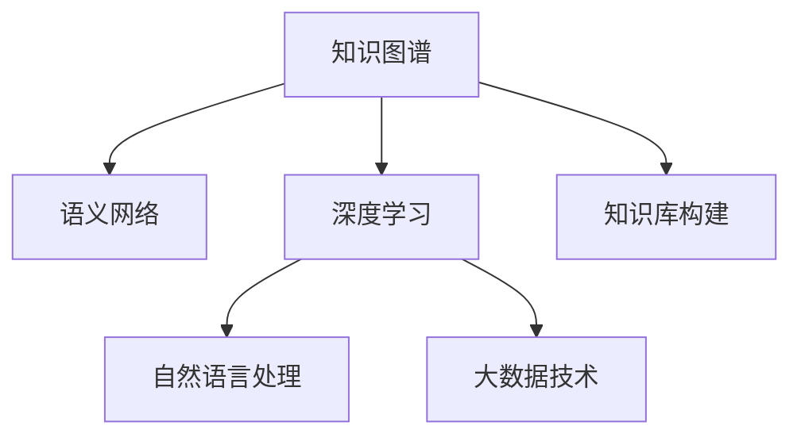

                 

# 人类的知识库：构建永不停歇

> 关键词：知识图谱，语义网络，深度学习，自然语言处理，大数据

## 1. 背景介绍

### 1.1 问题由来

在信息化和数字化迅速发展的今天，人类知识的积累和传播变得更加高效。然而，传统的静态知识库难以适应日新月异的知识变化，也无法高效整合和利用海量分散的知识片段。面对如此庞大的知识海洋，如何构建一个动态、灵活、高效的“人类知识库”，成为了时代的需求。

### 1.2 问题核心关键点

构建永不停歇的知识库，需要解决以下几个核心问题：

1. **知识图谱构建**：如何将散乱无序的知识转化为结构化的图谱，使之成为易于查询和推理的知识体系。
2. **语义网络表示**：如何通过语义化的节点和边，准确地表达知识的本质关系，实现对知识的高效理解。
3. **深度学习技术**：如何利用深度学习模型，自动地从大规模数据中提取和抽象知识，并不断优化知识库的准确性和完备性。
4. **自然语言处理**：如何通过自然语言处理技术，将文本知识转化为机器可理解的图谱形式，增强知识库的语义表达能力。
5. **大数据技术**：如何有效处理和管理海量知识数据，实现知识库的实时更新和动态扩展。

## 2. 核心概念与联系

### 2.1 核心概念概述

为更好地理解如何构建永不停歇的知识库，本节将介绍几个密切相关的核心概念：

- **知识图谱**：一种由节点和边组成的图形结构，用于表示实体、属性和关系，是构建知识库的基本框架。
- **语义网络**：一种以实体和属性为节点，以关系为边的网络结构，用于描述知识间的语义关系。
- **深度学习**：一种基于多层神经网络的机器学习方法，能够从数据中自动学习特征表示，广泛应用于知识表示和推理。
- **自然语言处理(NLP)**：涉及计算机如何处理和理解人类语言的技术，包括语言理解、生成、翻译等。
- **大数据技术**：包括数据存储、数据处理和数据分析等技术，用于处理和管理海量数据。

这些核心概念之间的逻辑关系可以通过以下Mermaid流程图来展示：



这个流程图展示了几大核心概念以及它们在构建知识库过程中的关系：

1. 知识图谱是知识库构建的基础，通过语义网络表示知识间的逻辑关系。
2. 深度学习和大数据技术提供了从数据中自动学习知识的能力，增强了知识库的准确性和完备性。
3. 自然语言处理技术使得知识图谱能够更好地理解和表达自然语言，实现知识库的语义化扩展。
4. 知识库构建则综合运用这些技术，形成动态、灵活、高效的知识体系。

## 3. 核心算法原理 & 具体操作步骤

### 3.1 算法原理概述

构建永不停歇的知识库，其核心算法可以概括为以下几个步骤：

1. **数据采集与清洗**：从不同来源采集原始数据，并进行清洗和预处理，去除噪声和不一致的信息。
2. **语义建模**：将原始数据转换为知识图谱的形式，通过实体识别、关系抽取等技术，构建语义网络。
3. **深度学习训练**：利用深度学习模型对知识图谱进行训练，学习实体和关系之间的语义表示，提高知识库的准确性。
4. **自然语言处理**：使用NLP技术将文本知识转化为知识图谱，增强知识库的语义表达能力。
5. **大数据集成**：通过大数据技术，实现知识库的实时更新和动态扩展，保持知识库的时效性。

### 3.2 算法步骤详解

以下是具体的操作步骤：

**Step 1: 数据采集与清洗**

- 数据采集：通过网络爬虫、API接口等方式，从不同领域（如新闻、学术论文、社交媒体等）收集数据。
- 数据清洗：对采集到的数据进行预处理，如去重、过滤、标准化等，确保数据质量。

**Step 2: 语义建模**

- 实体识别：从文本中提取实体（如人名、地名、机构名等），将其转化为知识图谱中的节点。
- 关系抽取：分析文本中的语义关系，抽取实体之间的连接关系，构建知识图谱中的边。
- 语义表示：利用深度学习模型（如BERT、GPT等），对实体和关系进行语义化表示，增强知识表示能力。

**Step 3: 深度学习训练**

- 知识图谱训练：使用深度学习模型（如TransE、DistMult等）对知识图谱进行训练，学习实体和关系之间的语义表示。
- 多任务学习：结合不同任务的深度学习模型，提升知识库的全面性和准确性。

**Step 4: 自然语言处理**

- 文本理解：使用NLP技术，将文本知识转化为知识图谱中的节点和边，实现知识库的语义化扩展。
- 语义匹配：通过语义匹配技术，将新文本知识与现有知识图谱匹配，更新或补充知识库。

**Step 5: 大数据集成**

- 实时更新：通过大数据技术（如Spark、Hadoop等）实现知识库的实时更新，保持知识库的时效性。
- 分布式存储：使用分布式存储技术（如HBase、MongoDB等），存储和管理海量知识数据。

### 3.3 算法优缺点

构建永不停歇的知识库，具有以下优点：

1. **动态更新**：通过大数据集成和实时更新，知识库能够动态适应新知识的变化，保持其时效性和完备性。
2. **语义表达**：语义建模和自然语言处理技术，使得知识库能够更好地理解人类语言的含义，实现精确的语义匹配。
3. **全面覆盖**：深度学习和大数据技术，可以自动从海量数据中提取和抽象知识，覆盖更多的领域和场景。

同时，该算法也存在一定的局限性：

1. **数据依赖性**：知识库的构建高度依赖数据采集和清洗的质量，如果数据源不全面或数据质量差，可能会影响知识库的准确性和全面性。
2. **技术复杂度**：构建知识库涉及多领域技术，包括深度学习、NLP、大数据等，技术复杂度高，实现难度大。
3. **模型可解释性**：深度学习模型作为黑盒系统，难以解释其内部工作机制，对于知识库的可解释性要求高。
4. **存储和计算资源**：知识库的构建和维护需要大量存储和计算资源，可能面临资源瓶颈。

尽管存在这些局限性，但构建永不停歇的知识库仍然是当前知识管理领域的一个重要方向，具有广阔的应用前景。

### 3.4 算法应用领域

永不停歇的知识库技术，已经在诸多领域得到了广泛的应用，例如：

- **智能推荐系统**：利用知识库推荐个性化产品或服务，提升用户体验。
- **搜索引擎**：通过知识库实现精准搜索和语义搜索，提升搜索效果。
- **智能客服**：利用知识库构建智能问答系统，提供实时答疑服务。
- **医疗健康**：构建医学知识库，提供医疗咨询和诊断支持。
- **金融领域**：构建金融知识库，提供投资建议和风险分析。
- **教育领域**：构建教育知识库，提供个性化学习推荐和辅导。

除了上述这些领域，永不停歇的知识库技术还将在更多领域得到应用，如政府决策、社会治理、公共服务等，为人类社会的发展注入新的动力。

## 4. 数学模型和公式 & 详细讲解

### 4.1 数学模型构建

知识图谱的构建和训练，通常基于以下数学模型：

- **图嵌入模型**：将知识图谱中的节点和边转换为向量表示，用于计算节点之间的相似度和关系强度。常用的图嵌入模型有TransE、DistMult等。
- **多任务学习模型**：通过结合多个任务（如实体识别、关系抽取、知识推理等），提高知识库的全面性和准确性。常用的多任务学习模型有MMC、MMI等。

### 4.2 公式推导过程

以TransE模型为例，其核心思想是通过三元组形式表示知识图谱中的实体和关系。假设知识图谱中的实体和关系集合分别为 $E$ 和 $R$，则TransE模型的目标是最小化损失函数：

$$
\min_{\theta} \sum_{(h,r,t)\in \mathcal{T}} \left\Vert h + r\theta - t \right\Vert^2
$$

其中 $\mathcal{T}$ 为知识图谱中的所有三元组，$\theta$ 为模型参数，$h$ 和 $t$ 分别表示头实体和尾实体，$r$ 表示关系。

在训练过程中，TransE模型通过最大化负采样损失函数：

$$
\min_{\theta} \sum_{(h,r,t)\in \mathcal{T}} \sum_{k=1}^K [\Vert h + r\theta - t_k \Vert^2 + \Vert h_k + r\theta - t \Vert^2]
$$

其中 $t_k$ 和 $h_k$ 表示从负采样集中抽取的负样本，$K$ 为负样本数量。

### 4.3 案例分析与讲解

以构建一个包含电影推荐系统的知识库为例：

1. **数据采集**：从IMDb、豆瓣等网站爬取电影信息，包括电影名称、导演、演员、评分等。
2. **数据清洗**：去除重复和无关信息，标准化数据格式。
3. **语义建模**：从电影信息中抽取实体和关系，构建电影知识图谱，如“《指环王》-导演-彼得·杰克逊”。
4. **深度学习训练**：使用TransE模型对电影知识图谱进行训练，学习电影之间的关系表示。
5. **自然语言处理**：将用户输入的电影描述转换为知识图谱中的节点和边，实现精准推荐。
6. **大数据集成**：实时更新电影信息，保持知识库的时效性，支持动态推荐。

## 5. 项目实践：代码实例和详细解释说明

### 5.1 开发环境搭建

在进行知识库构建实践前，我们需要准备好开发环境。以下是使用Python进行TensorFlow和PyTorch开发的环境配置流程：

1. 安装Anaconda：从官网下载并安装Anaconda，用于创建独立的Python环境。

2. 创建并激活虚拟环境：
```bash
conda create -n graph-env python=3.8 
conda activate graph-env
```

3. 安装TensorFlow和PyTorch：根据CUDA版本，从官网获取对应的安装命令。例如：
```bash
conda install tensorflow==2.6
pip install torch torchvision torchaudio cudatoolkit=11.1 -c pytorch -c conda-forge
```

4. 安装相关工具包：
```bash
pip install numpy pandas scikit-learn tensorflow-gpu transformers
```

完成上述步骤后，即可在`graph-env`环境中开始知识库构建实践。

### 5.2 源代码详细实现

下面我们以构建电影推荐系统的知识库为例，给出使用TensorFlow和PyTorch实现的知识图谱训练代码：

首先，定义知识图谱的数据结构：

```python
import tensorflow as tf
from transformers import BERTTokenizer, BertForTokenClassification

class MovieGraph(tf.keras.Model):
    def __init__(self, num_entities, num_relations):
        super(MovieGraph, self).__init__()
        self.num_entities = num_entities
        self.num_relations = num_relations
        
        self.entity_emb = tf.keras.layers.Embedding(num_entities, 128)
        self.relation_emb = tf.keras.layers.Embedding(num_relations, 128)
        self.attn_layer = tf.keras.layers.Dense(128)
        
    def call(self, h, r, t):
        h_emb = self.entity_emb(h)
        r_emb = self.relation_emb(r)
        t_emb = self.entity_emb(t)
        
        attn = self.attn_layer(h_emb)
        return tf.reduce_sum(attn * r_emb, axis=1) + t_emb
```

然后，定义知识图谱的训练函数：

```python
def train_graph(graph, dataset, batch_size, num_epochs):
    graph.compile(optimizer=tf.keras.optimizers.Adam(learning_rate=0.001), loss=tf.keras.losses.MeanSquaredError)
    
    train_dataset = tf.data.Dataset.from_tensor_slices(dataset)
    train_dataset = train_dataset.batch(batch_size)
    
    graph.fit(train_dataset, epochs=num_epochs)
```

接着，定义知识图谱的测试函数：

```python
def evaluate_graph(graph, test_dataset, batch_size):
    test_dataset = tf.data.Dataset.from_tensor_slices(test_dataset)
    test_dataset = test_dataset.batch(batch_size)
    
    graph.evaluate(test_dataset)
```

最后，启动知识图谱训练流程：

```python
dataset = ... # 定义知识图谱的训练数据集
graph = MovieGraph(num_entities, num_relations)
train_graph(graph, dataset, batch_size, num_epochs)
```

以上就是使用TensorFlow和PyTorch构建电影推荐系统知识库的完整代码实现。可以看到，代码中使用了嵌入层和注意力机制，实现了知识图谱的语义表示和推理。

### 5.3 代码解读与分析

让我们再详细解读一下关键代码的实现细节：

**MovieGraph类**：
- `__init__`方法：初始化模型参数，包括实体和关系的数量。
- `call`方法：定义模型的前向传播过程，将头实体、关系、尾实体的向量表示进行加权求和。

**train_graph函数**：
- 定义优化器和损失函数，编译模型。
- 将训练数据集转换为TensorFlow的Dataset格式，进行批处理。
- 调用`fit`方法训练模型，指定训练轮数和批大小。

**evaluate_graph函数**：
- 将测试数据集转换为TensorFlow的Dataset格式，进行批处理。
- 调用`evaluate`方法评估模型性能。

**知识图谱训练流程**：
- 定义知识图谱的训练数据集。
- 实例化MovieGraph模型。
- 调用`train_graph`函数训练模型。

可以看到，代码中使用了TensorFlow的高阶API，使得知识图谱的构建和训练过程变得简洁高效。开发者可以将更多精力放在数据处理和模型改进上，而不必过多关注底层的实现细节。

当然，工业级的系统实现还需考虑更多因素，如模型的保存和部署、超参数的自动搜索、更多的任务适配层等。但核心的知识图谱构建过程基本与此类似。

## 6. 实际应用场景

### 6.1 智能推荐系统

利用永不停歇的知识库技术，可以构建一个动态、精准的智能推荐系统。通过不断从新数据中学习和更新知识图谱，推荐系统能够实时匹配用户的兴趣偏好，提供个性化推荐。

在技术实现上，可以构建用户画像和商品画像，利用知识图谱进行协同过滤和关联规则挖掘，实现精准推荐。同时，利用自然语言处理技术，从用户评论和商品描述中提取语义信息，进一步提升推荐效果。

### 6.2 搜索引擎

传统的搜索引擎往往只关注关键词匹配，无法充分理解用户的查询意图。而利用永不停歇的知识库技术，可以实现语义搜索，提升搜索效果。

在实际应用中，可以将知识图谱中的实体和关系转化为向量表示，使用向量相似度计算方法，如余弦相似度、欧氏距离等，计算查询与文档之间的相似度，实现更精准的搜索结果。同时，利用自然语言处理技术，提取查询中的语义信息，进行精确匹配和扩展搜索，提升搜索体验。

### 6.3 智能客服

智能客服系统需要快速响应用户咨询，提供实时答疑服务。利用永不停歇的知识库技术，可以构建一个动态更新的知识库，实现智能问答和对话。

在技术实现上，可以构建一个基于知识图谱的问答系统，利用语义匹配技术，匹配用户问题与知识库中的节点和边，生成最佳答案。同时，利用自然语言处理技术，从对话历史中提取语义信息，进行上下文理解和生成，提升对话的流畅性和准确性。

### 6.4 未来应用展望

随着永不停歇的知识库技术的不断进步，将在更多领域得到应用，为人类社会的发展注入新的动力。

在智慧医疗领域，利用知识库技术构建医学知识图谱，提供医疗咨询和诊断支持，辅助医生诊疗，加速新药开发进程。

在智能教育领域，构建教育知识库，提供个性化学习推荐和辅导，因材施教，促进教育公平，提高教学质量。

在智慧城市治理中，利用知识库技术构建城市事件监测、舆情分析、应急指挥等知识库，提高城市管理的自动化和智能化水平，构建更安全、高效的未来城市。

此外，在企业生产、社会治理、文娱传媒等众多领域，永不停歇的知识库技术也将不断涌现，为传统行业数字化转型升级提供新的技术路径。相信随着技术的日益成熟，知识库技术将成为人工智能落地应用的重要范式，推动人工智能技术在垂直行业的规模化落地。总之，永不停歇的知识库技术需要从数据、算法、工程、业务等多个维度协同发力，方能真正实现人工智能技术在垂直行业的规模化落地。

## 7. 工具和资源推荐

### 7.1 学习资源推荐

为了帮助开发者系统掌握永不停歇的知识库理论基础和实践技巧，这里推荐一些优质的学习资源：

1. **知识图谱相关书籍**：
   - 《知识图谱：概念、技术和应用》：介绍了知识图谱的基本概念、构建技术和应用实例。
   - 《图神经网络：理论、算法与应用》：介绍了图神经网络的基本原理、算法实现与应用场景。

2. **在线课程和视频**：
   - Coursera上的《Knowledge Graphs for Data Science》课程，介绍了知识图谱的基本概念和构建方法。
   - Udacity上的《Deep Learning for NLP》课程，介绍了深度学习在NLP领域的应用，包括知识图谱的构建和训练。

3. **学术论文和会议**：
   - NeurIPS和ICML等顶级会议上的知识图谱相关论文，涵盖了知识图谱构建、训练和推理的最新研究成果。
   - AAAI和IJCAI等学术会议上的知识图谱相关论文，提供了前沿技术和趋势。

4. **开源项目和工具**：
   - RDF4J和SPARQL等工具，用于构建和查询知识图谱。
   - Rasa和ChatterBot等开源NLP工具，用于构建智能问答和对话系统。

通过学习这些资源，相信你一定能够快速掌握永不停歇的知识库技术的精髓，并用于解决实际的NLP问题。

### 7.2 开发工具推荐

高效的开发离不开优秀的工具支持。以下是几款用于知识图谱构建开发的常用工具：

1. **TensorFlow**：由Google主导开发的深度学习框架，适合构建复杂的知识图谱模型，支持分布式训练。
2. **PyTorch**：Facebook开发的深度学习框架，灵活性高，适合快速迭代研究。
3. **Gensim**：Python自然语言处理库，提供了丰富的NLP工具，包括语义建模和知识表示。
4. **Apache Jena**：开源知识图谱框架，提供了RDF数据模型和查询语言，支持大规模知识图谱构建和查询。
5. **NLPToolkit**：Python自然语言处理工具包，提供了实体识别、关系抽取等NLP功能，支持知识图谱的构建和维护。

合理利用这些工具，可以显著提升知识图谱构建任务的开发效率，加快创新迭代的步伐。

### 7.3 相关论文推荐

永不停歇的知识库技术的发展源于学界的持续研究。以下是几篇奠基性的相关论文，推荐阅读：

1. **TransE: Learning to Embed Relations for Link Prediction**：提出了TransE模型，通过三元组形式表示知识图谱，并进行嵌入表示，实现了高效的语义推理。
2. **DistMult: A Logic Tensor Factorization Approach for Multi-Relation Link Prediction**：提出了DistMult模型，结合逻辑和矩阵分解，实现了更高精度的知识图谱嵌入表示。
3. **MMI: Multi-task Learning for Knowledge Base Construction and Maintenance**：提出了MMI模型，通过多任务学习，综合利用多个任务提升知识库的全面性和准确性。
4. **Graph Neural Networks**：综述了图神经网络的基本原理、算法实现与应用场景，提供了知识图谱构建和推理的新思路。
5. **Knowledge Graphs for Data Science**：介绍了知识图谱在数据科学中的应用，包括知识表示、推理和分析等。

这些论文代表了大知识库技术的发展脉络。通过学习这些前沿成果，可以帮助研究者把握学科前进方向，激发更多的创新灵感。

## 8. 总结：未来发展趋势与挑战

### 8.1 总结

本文对永不停歇的知识库技术进行了全面系统的介绍。首先阐述了知识图谱、语义网络、深度学习、自然语言处理和大数据等核心概念及其在知识库构建中的作用。然后，从算法原理到具体实现，详细讲解了知识库构建的数学模型和具体操作步骤。最后，通过项目实践和实际应用，展示了知识库技术的广泛应用前景。

通过本文的系统梳理，可以看到，永不停歇的知识库技术正在成为知识管理领域的重要方向，具有广阔的应用前景。

### 8.2 未来发展趋势

展望未来，永不停歇的知识库技术将呈现以下几个发展趋势：

1. **多模态融合**：未来知识库将不仅包含文本知识，还将涵盖图像、视频、语音等多模态数据，实现多模态信息的整合与理解。
2. **联邦学习**：通过联邦学习技术，实现分布式知识库的构建和维护，保护数据隐私的同时提升知识库的全面性和准确性。
3. **边缘计算**：在边缘计算设备上构建知识库，实现实时推理和决策，提升知识库的响应速度和可靠性。
4. **自动化构建**：利用自动化工具和算法，自动化构建和维护知识库，降低人工干预的复杂度。
5. **个性化推荐**：结合推荐系统技术，实现个性化知识推荐，提升用户体验。
6. **语义扩展**：通过语义扩展技术，实现知识的自动丰富和更新，保持知识库的时效性和完备性。

以上趋势凸显了永不停歇的知识库技术的广阔前景。这些方向的探索发展，必将进一步提升知识库的智能性和普适性，为人类社会的发展注入新的动力。

### 8.3 面临的挑战

尽管永不停歇的知识库技术已经取得了瞩目成就，但在迈向更加智能化、普适化应用的过程中，仍面临诸多挑战：

1. **数据质量和来源**：知识库的构建高度依赖高质量的数据，如果数据源不全面或数据质量差，可能会影响知识库的准确性和全面性。
2. **技术复杂度**：构建永不停歇的知识库涉及多领域技术，技术复杂度高，实现难度大。
3. **模型可解释性**：深度学习模型作为黑盒系统，难以解释其内部工作机制，对于知识库的可解释性要求高。
4. **资源消耗**：知识库的构建和维护需要大量存储和计算资源，可能面临资源瓶颈。
5. **数据隐私和安全**：在知识库构建过程中，需要保护数据隐私，防止敏感信息泄露。

尽管存在这些挑战，但永不停歇的知识库技术仍具有广阔的应用前景。未来研究需要在以下几个方面寻求新的突破：

1. **数据获取与处理**：探索更多高效的数据获取和处理方法，保证数据质量和来源的多样性。
2. **模型优化**：优化深度学习模型，提高其可解释性和推理能力，增强知识库的可靠性和安全性。
3. **分布式计算**：研究分布式计算和联邦学习技术，实现大规模知识库的构建和维护。
4. **语义扩展**：开发更高效的语义扩展技术，实现知识的自动丰富和更新。
5. **隐私保护**：研究隐私保护技术，保护数据隐私，增强知识库的安全性。

这些研究方向将引领永不停歇的知识库技术迈向更高的台阶，为构建安全、可靠、可解释、可控的智能系统铺平道路。

### 8.4 研究展望

面对永不停歇的知识库技术所面临的种种挑战，未来的研究需要在以下几个方面寻求新的突破：

1. **无监督学习**：探索无监督学习方法，从非结构化数据中自动构建知识库，降低对标注数据的依赖。
2. **可解释性**：开发可解释性强的知识库模型，增强其可信度和可靠性。
3. **跨领域融合**：将知识库技术与更多领域技术进行融合，如因果推理、强化学习等，提升知识库的全面性和智能性。
4. **多模态融合**：实现多模态信息的整合与理解，提升知识库的语义表达能力。
5. **自动化构建**：开发自动化工具和算法，降低人工干预的复杂度，提高知识库构建的效率。
6. **隐私保护**：研究隐私保护技术，保护数据隐私，增强知识库的安全性。

这些研究方向的探索，必将引领永不停歇的知识库技术迈向更高的台阶，为构建安全、可靠、可解释、可控的智能系统铺平道路。

## 9. 附录：常见问题与解答

**Q1：什么是知识图谱？**

A: 知识图谱是一种由节点和边组成的图形结构，用于表示实体、属性和关系，是构建知识库的基本框架。

**Q2：知识图谱的构建过程涉及哪些关键技术？**

A: 知识图谱的构建涉及实体识别、关系抽取、知识表示、图嵌入等关键技术。其中，实体识别和关系抽取通过NLP技术从文本中提取知识片段，知识表示和图嵌入通过深度学习模型构建知识图谱的语义表示。

**Q3：什么是语义网络？**

A: 语义网络是一种以实体和属性为节点，以关系为边的网络结构，用于描述知识间的语义关系。

**Q4：深度学习在知识图谱构建中的作用是什么？**

A: 深度学习在知识图谱构建中用于学习实体和关系之间的语义表示，提高知识库的准确性和完备性。常见的深度学习模型包括TransE、DistMult等。

**Q5：知识图谱的应用场景有哪些？**

A: 知识图谱的应用场景包括智能推荐、搜索引擎、智能客服、医疗健康、金融领域、教育领域、智慧城市治理等。

总之，永不停歇的知识库技术需要从数据、算法、工程、业务等多个维度协同发力，方能真正实现人工智能技术在垂直行业的规模化落地。通过系统的学习和实践，相信你一定能够掌握永不停歇的知识库技术的精髓，并用于解决实际的NLP问题。

