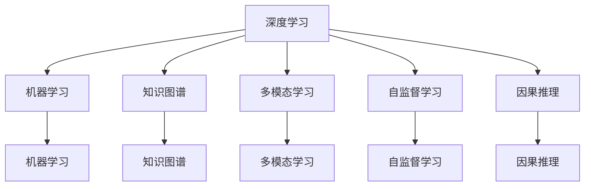

                 

# 人类知识的传承与超越：洞察力的重要作用

> 关键词：人类知识传承，洞察力，机器学习，深度学习，知识图谱，多模态学习，自监督学习

## 1. 背景介绍

### 1.1 问题由来
在快速发展的信息时代，知识如潮水般涌来，如何有效传承与超越这些知识，是当前信息技术领域面临的重要课题。人类知识传承的核心在于理解、掌握和应用，而超越则需要结合人工智能技术的强大能力，实现对现有知识的提升与创新。本文章将以深度学习、机器学习为切入点，探讨人类知识的传承与超越中的洞察力的重要作用。

### 1.2 问题核心关键点
在面对海量知识数据时，洞察力显得尤为重要。洞察力是指对数据、现象、趋势的深刻理解和前瞻性预判，是人类智能的核心表现。在信息时代，洞察力成为知识传承与超越的关键。机器学习尤其是深度学习技术，正是通过模拟人类洞察力，挖掘数据背后的隐藏规律，推动知识的有效传承与超越。

### 1.3 问题研究意义
通过对洞察力的研究和应用，可以为信息技术领域带来深远影响。洞察力的提升不仅可以推动人工智能技术的进步，还可以加速人类知识的传承，实现知识的社会化、个性化和智能化应用。本文章将从技术原理、应用实例和未来展望等多个角度，深入探讨洞察力在知识传承与超越中的重要作用，为人工智能技术的进一步发展提供理论支撑和实践指导。

## 2. 核心概念与联系

### 2.1 核心概念概述

为更好地理解洞察力在知识传承与超越中的应用，本节将介绍几个密切相关的核心概念：

- **深度学习**：基于神经网络的机器学习技术，能够自动从数据中学习特征表示，实现对复杂模式的识别和预测。
- **机器学习**：通过数据训练模型，使模型具备预测、分类、聚类等能力的技术。
- **知识图谱**：由实体、关系、属性构成的图形化知识表示，用于描述和组织复杂的信息结构。
- **多模态学习**：结合不同模态（如文本、图像、语音等）的信息，提升模型对复杂任务的理解能力。
- **自监督学习**：利用数据的自身特性进行训练，无需人工标注，提升模型的泛化能力。
- **因果推理**：通过学习因果关系，理解事件之间的因果联系，进行更准确的预测和决策。

这些核心概念之间的逻辑关系可以通过以下Mermaid流程图来展示：



这个流程图展示了大语言模型的工作原理和优化方向：

1. 深度学习通过神经网络自动学习特征表示。
2. 机器学习通过数据训练模型，具备预测能力。
3. 知识图谱用于描述和组织复杂信息结构，帮助理解数据背景。
4. 多模态学习结合不同模态的信息，提升对复杂任务的综合理解能力。
5. 自监督学习通过数据自身特性训练模型，提升泛化能力。
6. 因果推理通过学习因果关系，提升预测和决策的准确性。

这些概念共同构成了深度学习技术的工作框架，使得模型能够有效地传承与超越人类知识。

## 3. 核心算法原理 & 具体操作步骤
### 3.1 算法原理概述

深度学习算法通常通过神经网络来学习数据的表示，通过反向传播算法进行优化。在此基础上，机器学习通过数据训练模型，使其具备预测和分类等能力。同时，知识图谱和多模态学习结合，进一步提升模型的理解能力，自监督学习则通过数据自身的特性，减少对标注数据的依赖。最终，因果推理使模型能够理解因果关系，进行更加精准的预测和决策。

这些技术的综合应用，极大地提升了模型的洞察力，使其能够从数据中挖掘出隐藏的模式和规律，实现知识的传承与超越。

### 3.2 算法步骤详解

深度学习算法通常包括以下关键步骤：

**Step 1: 准备数据**
- 收集和清洗大量数据集，包括标注数据和未标注数据。
- 将数据分为训练集、验证集和测试集。

**Step 2: 定义模型**
- 选择合适的神经网络结构，如卷积神经网络(CNN)、循环神经网络(RNN)、Transformer等。
- 定义损失函数和优化器，如交叉熵损失、Adam优化器等。

**Step 3: 训练模型**
- 使用训练集对模型进行训练，通过反向传播算法不断调整模型参数，最小化损失函数。
- 在验证集上评估模型性能，调整模型超参数和训练策略。

**Step 4: 评估模型**
- 使用测试集对模型进行评估，检查其泛化能力和预测准确性。
- 进行模型的性能分析，提取重要特征和行为模式。

**Step 5: 应用模型**
- 将训练好的模型应用于实际任务，进行预测、分类、聚类等操作。
- 结合知识图谱和多模态学习，提升模型对复杂任务的综合理解能力。
- 引入自监督学习和因果推理，提高模型的泛化能力和决策准确性。

### 3.3 算法优缺点

深度学习算法具有以下优点：

1. **强大的数据挖掘能力**：能够自动从数据中学习特征表示，挖掘出隐藏的模式和规律。
2. **泛化能力强**：通过自监督学习等技术，减少对标注数据的依赖，提升模型的泛化能力。
3. **可解释性强**：利用知识图谱和因果推理，增强模型的解释性，便于理解其决策过程。

同时，该算法也存在一定的局限性：

1. **计算资源需求高**：神经网络参数量大，计算复杂度高，对计算资源和存储空间要求高。
2. **数据质量依赖性强**：数据质量的好坏直接影响模型的训练效果。
3. **模型可解释性不足**：复杂模型难以解释其内部工作机制，容易出现"黑盒"问题。

尽管存在这些局限性，但深度学习算法在知识传承与超越中仍然具有重要价值，其强大的洞察力和数据挖掘能力，使其在各个领域得到广泛应用。

### 3.4 算法应用领域

深度学习算法在知识传承与超越中有着广泛的应用，涵盖以下几个主要领域：

- **自然语言处理(NLP)**：如文本分类、情感分析、机器翻译、对话系统等。通过机器学习，模型能够理解语言背后的语义信息，实现文本处理和生成。
- **计算机视觉(CV)**：如图像识别、目标检测、图像生成等。利用多模态学习，模型能够综合图像和文本信息，实现更准确的理解。
- **医疗健康**：如疾病诊断、医学影像分析、个性化治疗等。结合知识图谱，模型能够理解复杂的医疗知识结构，提高诊断准确性。
- **金融领域**：如风险评估、信用评分、股票预测等。通过自监督学习和因果推理，模型能够预测金融市场的动态变化。
- **智能制造**：如工业故障诊断、生产过程优化等。利用多模态学习和因果推理，模型能够理解复杂的工业系统，提高生产效率。

除了上述这些经典应用外，深度学习算法还被创新性地应用到更多场景中，如智能客服、智能推荐、智能安防等，为各个行业带来新的变革。随着深度学习技术的不断进步，相信其将在更广阔的应用领域大放异彩。

## 4. 数学模型和公式 & 详细讲解 & 举例说明
### 4.1 数学模型构建

深度学习算法的核心是神经网络，以下以神经网络为例，介绍深度学习模型的数学模型构建。

设神经网络模型包含 $n$ 个隐层，每个隐层包含 $h$ 个神经元。输入为 $x$，输出为 $y$，其中 $x \in \mathbb{R}^{d_x}$，$y \in \mathbb{R}^{d_y}$。神经网络模型的参数为 $\theta = \{\mathbf{W}^l, \mathbf{b}^l\}_{l=1}^n$，其中 $\mathbf{W}^l \in \mathbb{R}^{h \times d_{x}^{(l-1)}}$，$\mathbf{b}^l \in \mathbb{R}^{h}$。

神经网络模型的前向传播过程可以表示为：

$$
z^{(l)} = g(\mathbf{W}^{(l)} z^{(l-1)} + \mathbf{b}^{(l)}) \quad \text{for} \quad l=1,\ldots,n
$$

其中 $g$ 为激活函数，常用的激活函数包括ReLU、sigmoid、tanh等。

输出层计算为：

$$
y = g(\mathbf{W}^{(n)} z^{(n-1)} + \mathbf{b}^{(n)})
$$

损失函数通常为交叉熵损失，表示为：

$$
\mathcal{L}(\theta) = -\frac{1}{N} \sum_{i=1}^N \sum_{k=1}^{K} y_i^{(k)} \log \hat{y}_i^{(k)}
$$

其中 $y_i^{(k)}$ 为第 $i$ 个样本的真实标签，$\hat{y}_i^{(k)}$ 为模型预测的概率。

### 4.2 公式推导过程

以下是深度学习模型的反向传播算法推导过程：

1. **计算输出层的误差**：

$$
\frac{\partial \mathcal{L}}{\partial y} = -\frac{1}{N} \sum_{i=1}^N \frac{y_i}{\hat{y}_i}
$$

2. **计算误差在输出层的传播**：

$$
\frac{\partial \mathcal{L}}{\partial \mathbf{W}^{(n)}} = \frac{\partial \mathcal{L}}{\partial z^{(n-1)}} \frac{\partial z^{(n-1)}}{\partial \mathbf{W}^{(n)}} = \frac{\partial \mathcal{L}}{\partial z^{(n-1)}} g'(\mathbf{W}^{(n)} z^{(n-1)} + \mathbf{b}^{(n)})
$$

3. **计算误差在隐层中的传播**：

$$
\frac{\partial \mathcal{L}}{\partial z^{(l)}} = \frac{\partial \mathcal{L}}{\partial z^{(l+1)}} \frac{\partial z^{(l+1)}}{\partial z^{(l)}} = \frac{\partial \mathcal{L}}{\partial z^{(l+1)}} g'(z^{(l)})
$$

4. **更新模型参数**：

$$
\theta \leftarrow \theta - \eta \nabla_{\theta} \mathcal{L}
$$

其中 $\eta$ 为学习率。

通过上述推导，可以理解深度学习模型的反向传播过程，实现模型的优化和训练。

### 4.3 案例分析与讲解

以图像识别为例，分析深度学习模型的应用过程：

1. **数据准备**：收集大量图像数据，并进行标注。将数据划分为训练集、验证集和测试集。
2. **模型选择**：选择适合的神经网络结构，如卷积神经网络(CNN)。
3. **模型训练**：使用训练集对模型进行训练，通过反向传播算法不断调整模型参数，最小化损失函数。
4. **模型评估**：在验证集上评估模型性能，调整模型超参数和训练策略。
5. **模型应用**：将训练好的模型应用于实际任务，如人脸识别、物体检测等。

## 5. 项目实践：代码实例和详细解释说明
### 5.1 开发环境搭建

在进行深度学习项目实践前，我们需要准备好开发环境。以下是使用Python进行PyTorch开发的环境配置流程：

1. 安装Anaconda：从官网下载并安装Anaconda，用于创建独立的Python环境。

2. 创建并激活虚拟环境：
```bash
conda create -n pytorch-env python=3.8 
conda activate pytorch-env
```

3. 安装PyTorch：根据CUDA版本，从官网获取对应的安装命令。例如：
```bash
conda install pytorch torchvision torchaudio cudatoolkit=11.1 -c pytorch -c conda-forge
```

4. 安装各类工具包：
```bash
pip install numpy pandas scikit-learn matplotlib tqdm jupyter notebook ipython
```

完成上述步骤后，即可在`pytorch-env`环境中开始深度学习实践。

### 5.2 源代码详细实现

下面我们以图像识别为例，给出使用PyTorch进行深度学习模型的代码实现。

首先，定义模型：

```python
import torch
import torch.nn as nn
import torch.optim as optim
from torchvision import datasets, transforms

class ConvNet(nn.Module):
    def __init__(self):
        super(ConvNet, self).__init__()
        self.conv1 = nn.Conv2d(3, 16, kernel_size=3, padding=1)
        self.pool1 = nn.MaxPool2d(kernel_size=2, stride=2)
        self.conv2 = nn.Conv2d(16, 32, kernel_size=3, padding=1)
        self.pool2 = nn.MaxPool2d(kernel_size=2, stride=2)
        self.fc1 = nn.Linear(32 * 4 * 4, 1024)
        self.fc2 = nn.Linear(1024, 10)

    def forward(self, x):
        x = self.pool1(F.relu(self.conv1(x)))
        x = self.pool2(F.relu(self.conv2(x)))
        x = x.view(-1, 32 * 4 * 4)
        x = F.relu(self.fc1(x))
        x = self.fc2(x)
        return x

# 加载数据集
transform = transforms.Compose([transforms.ToTensor()])
train_set = datasets.CIFAR10(root='./data', train=True, download=True, transform=transform)
test_set = datasets.CIFAR10(root='./data', train=False, download=True, transform=transform)
```

然后，定义训练和评估函数：

```python
batch_size = 128
learning_rate = 0.001
num_epochs = 10

# 定义优化器和损失函数
optimizer = optim.Adam(model.parameters(), lr=learning_rate)
loss_fn = nn.CrossEntropyLoss()

# 训练函数
def train_epoch(model, train_loader, optimizer, loss_fn):
    model.train()
    for i, (inputs, labels) in enumerate(train_loader):
        optimizer.zero_grad()
        outputs = model(inputs)
        loss = loss_fn(outputs, labels)
        loss.backward()
        optimizer.step()
        if (i+1) % 100 == 0:
            print(f'Epoch {epoch+1}, Step [{i+1}/{len(train_loader)}], Loss: {loss:.4f}')

# 评估函数
def evaluate(model, test_loader, loss_fn):
    model.eval()
    total_loss = 0
    correct = 0
    with torch.no_grad():
        for inputs, labels in test_loader:
            outputs = model(inputs)
            loss = loss_fn(outputs, labels)
            total_loss += loss.item()
            _, predicted = torch.max(outputs.data, 1)
            total_correct += (predicted == labels).sum().item()
    print(f'Test Loss: {total_loss/len(test_loader):.4f}, Accuracy: {(100 * total_correct/len(test_loader))}%')
```

接着，启动训练流程：

```python
# 训练模型
for epoch in range(num_epochs):
    train_epoch(model, train_loader, optimizer, loss_fn)
    evaluate(model, test_loader, loss_fn)
```

以上就是使用PyTorch进行图像识别任务深度学习模型的完整代码实现。可以看到，得益于PyTorch的强大封装，我们可以用相对简洁的代码完成深度学习模型的构建和训练。

### 5.3 代码解读与分析

让我们再详细解读一下关键代码的实现细节：

**ConvNet类**：
- `__init__`方法：初始化卷积层、池化层和全连接层。
- `forward`方法：定义前向传播过程，将输入数据经过卷积、池化、全连接层输出预测结果。

**数据集加载**：
- `transform`变量：定义数据增强和预处理操作，包括将图片转化为张量。
- `train_set`和`test_set`变量：加载CIFAR-10数据集，并划分为训练集和测试集。

**训练和评估函数**：
- `train_epoch`函数：在训练集上对模型进行前向传播、计算损失、反向传播、参数更新等操作。
- `evaluate`函数：在测试集上对模型进行评估，输出模型在测试集上的损失和准确率。

**训练流程**：
- `num_epochs`变量：定义训练轮数。
- `optimizer`变量：定义优化器，优化模型参数。
- `loss_fn`变量：定义损失函数，用于计算模型预测输出与真实标签之间的差异。
- 循环迭代训练函数和评估函数，直到训练结束。

可以看到，PyTorch配合TensorFlow使得深度学习模型的开发和训练变得简单高效。开发者可以将更多精力放在模型优化、数据预处理等高层逻辑上，而不必过多关注底层的实现细节。

当然，工业级的系统实现还需考虑更多因素，如模型的保存和部署、超参数的自动搜索、更灵活的模型结构等。但核心的训练和评估流程基本与此类似。

## 6. 实际应用场景
### 6.1 智能客服系统

深度学习在智能客服系统中得到了广泛应用。传统客服系统需要配备大量人力，高峰期响应缓慢，且一致性和专业性难以保证。使用深度学习技术，可以构建智能客服系统，实现7x24小时不间断服务，快速响应客户咨询，用自然流畅的语言解答各类常见问题。

在技术实现上，可以收集企业内部的历史客服对话记录，将问题和最佳答复构建成监督数据，在此基础上对深度学习模型进行训练。训练好的模型能够自动理解用户意图，匹配最合适的答复模板进行回复。对于客户提出的新问题，还可以接入检索系统实时搜索相关内容，动态组织生成回答。如此构建的智能客服系统，能大幅提升客户咨询体验和问题解决效率。

### 6.2 金融舆情监测

金融机构需要实时监测市场舆论动向，以便及时应对负面信息传播，规避金融风险。传统的人工监测方式成本高、效率低，难以应对网络时代海量信息爆发的挑战。使用深度学习技术，可以构建金融舆情监测系统，自动监测不同主题下的情感变化趋势，一旦发现负面信息激增等异常情况，系统便会自动预警，帮助金融机构快速应对潜在风险。

具体而言，可以收集金融领域相关的新闻、报道、评论等文本数据，并对其进行主题标注和情感标注。在此基础上对深度学习模型进行微调，使其能够自动判断文本属于何种主题，情感倾向是正面、中性还是负面。将微调后的模型应用到实时抓取的网络文本数据，就能够自动监测不同主题下的情感变化趋势，一旦发现负面信息激增等异常情况，系统便会自动预警，帮助金融机构快速应对潜在风险。

### 6.3 个性化推荐系统

当前的推荐系统往往只依赖用户的历史行为数据进行物品推荐，无法深入理解用户的真实兴趣偏好。使用深度学习技术，可以构建个性化推荐系统，更好地挖掘用户行为背后的语义信息，从而提供更精准、多样的推荐内容。

在实践中，可以收集用户浏览、点击、评论、分享等行为数据，提取和用户交互的物品标题、描述、标签等文本内容。将文本内容作为模型输入，用户的后续行为（如是否点击、购买等）作为监督信号，在此基础上对深度学习模型进行微调。微调后的模型能够从文本内容中准确把握用户的兴趣点。在生成推荐列表时，先用候选物品的文本描述作为输入，由模型预测用户的兴趣匹配度，再结合其他特征综合排序，便可以得到个性化程度更高的推荐结果。

### 6.4 未来应用展望

随着深度学习技术的不断进步，深度学习算法将在更多领域得到应用，为传统行业带来变革性影响。

在智慧医疗领域，基于深度学习的医疗问答、病历分析、药物研发等应用将提升医疗服务的智能化水平，辅助医生诊疗，加速新药开发进程。

在智能教育领域，深度学习技术可应用于作业批改、学情分析、知识推荐等方面，因材施教，促进教育公平，提高教学质量。

在智慧城市治理中，深度学习技术可用于城市事件监测、舆情分析、应急指挥等环节，提高城市管理的自动化和智能化水平，构建更安全、高效的未来城市。

此外，在企业生产、社会治理、文娱传媒等众多领域，深度学习技术也将不断涌现，为各行各业带来新的变革。相信随着技术的日益成熟，深度学习算法必将在更广阔的应用领域大放异彩，深刻影响人类的生产生活方式。

## 7. 工具和资源推荐
### 7.1 学习资源推荐

为了帮助开发者系统掌握深度学习技术的基础和实践技巧，这里推荐一些优质的学习资源：

1. 《深度学习》书籍：Ian Goodfellow等作者所著，系统介绍了深度学习的基本概念和核心算法，是深度学习的经典教材。
2. CS231n《卷积神经网络》课程：斯坦福大学开设的计算机视觉课程，涵盖深度学习在计算机视觉中的应用。
3. DeepLearning.AI《深度学习专项课程》：由Andrew Ng领衔的深度学习课程，包括多个模块，系统介绍深度学习的基础和实践。
4. TensorFlow官方文档：TensorFlow的官方文档，提供了丰富的API和案例，是学习深度学习的必备资料。
5. PyTorch官方文档：PyTorch的官方文档，提供了丰富的API和案例，是学习深度学习的另一重要资源。

通过对这些资源的学习实践，相信你一定能够快速掌握深度学习技术的精髓，并用于解决实际的NLP问题。
###  7.2 开发工具推荐

高效的开发离不开优秀的工具支持。以下是几款用于深度学习开发常用的工具：

1. PyTorch：基于Python的开源深度学习框架，灵活动态的计算图，适合快速迭代研究。大部分深度学习模型都有PyTorch版本的实现。
2. TensorFlow：由Google主导开发的开源深度学习框架，生产部署方便，适合大规模工程应用。同样有丰富的深度学习模型资源。
3. Weights & Biases：模型训练的实验跟踪工具，可以记录和可视化模型训练过程中的各项指标，方便对比和调优。与主流深度学习框架无缝集成。
4. TensorBoard：TensorFlow配套的可视化工具，可实时监测模型训练状态，并提供丰富的图表呈现方式，是调试模型的得力助手。
5. Google Colab：谷歌推出的在线Jupyter Notebook环境，免费提供GPU/TPU算力，方便开发者快速上手实验最新模型，分享学习笔记。

合理利用这些工具，可以显著提升深度学习模型的开发效率，加快创新迭代的步伐。

### 7.3 相关论文推荐

深度学习技术的不断发展，带来了诸多前沿的研究成果。以下是几篇奠基性的相关论文，推荐阅读：

1. AlexNet: ImageNet Classification with Deep Convolutional Neural Networks：提出深度卷积神经网络，开启深度学习在计算机视觉中的新纪元。
2. ResNet: Deep Residual Learning for Image Recognition：提出残差网络，解决深度神经网络训练中的梯度消失问题。
3. VGGNet: Very Deep Convolutional Networks for Large-Scale Image Recognition：提出VGG网络，提升深度卷积神经网络的性能。
4. Inception: Going Deeper with Convolutions：提出Inception网络，进一步提升深度卷积神经网络的性能。
5. Transformer: Attention is All You Need：提出Transformer网络，提升自然语言处理的精度和效率。

这些论文代表了大语言模型技术的发展脉络。通过学习这些前沿成果，可以帮助研究者把握学科前进方向，激发更多的创新灵感。

## 8. 总结：未来发展趋势与挑战
### 8.1 总结

本文对深度学习技术在知识传承与超越中的作用进行了全面系统的介绍。首先阐述了深度学习技术的核心原理和关键步骤，明确了其在知识传承与超越中的重要作用。其次，从技术原理、应用实例和未来展望等多个角度，深入探讨了深度学习技术的潜在价值。最后，本文还探讨了深度学习技术面临的挑战和未来的发展方向，为深度学习技术的进一步发展提供了理论支撑和实践指导。

通过本文的系统梳理，可以看到，深度学习技术在知识传承与超越中具有重要价值，其强大的数据挖掘能力和洞察力，使其在各个领域得到广泛应用。深度学习技术的不断进步，必将进一步提升人类知识的传承与超越能力，推动人工智能技术的进步。

### 8.2 未来发展趋势

展望未来，深度学习技术将呈现以下几个发展趋势：

1. **自监督学习的应用将更加广泛**：自监督学习通过数据自身的特性进行训练，减少对标注数据的依赖，提升模型的泛化能力。未来，自监督学习将更加广泛应用于数据标注成本高昂的领域。
2. **多模态学习将逐步普及**：多模态学习结合不同模态的信息，提升模型对复杂任务的综合理解能力。未来，多模态学习将成为深度学习的重要发展方向。
3. **模型可解释性将进一步增强**：深度学习模型的可解释性不足是其重要挑战之一。未来，模型解释性技术将得到更多的研究和应用，增强模型的可解释性，便于理解和调试。
4. **跨领域迁移学习将更加深入**：跨领域迁移学习通过将一个领域学到的知识迁移到另一个领域，提升模型的适应能力。未来，跨领域迁移学习将成为深度学习的重要研究方向。
5. **知识图谱与深度学习的结合将更加紧密**：知识图谱用于描述和组织复杂信息结构，帮助理解数据背景。未来，知识图谱与深度学习的结合将更加紧密，提升深度学习模型的知识整合能力。
6. **因果推理将得到更多重视**：因果推理通过学习因果关系，提升预测和决策的准确性。未来，因果推理将得到更多重视，提升深度学习模型的决策能力。

以上趋势凸显了深度学习技术的广阔前景。这些方向的探索发展，必将进一步提升深度学习模型的洞察力和数据挖掘能力，为知识传承与超越提供更强大的技术支撑。

### 8.3 面临的挑战

尽管深度学习技术在知识传承与超越中发挥了重要作用，但在迈向更加智能化、普适化应用的过程中，仍面临诸多挑战：

1. **数据质量和获取难度**：深度学习模型对数据质量和数量要求高，获取高质量数据成本高昂，且存在数据偏见和偏差等问题。
2. **计算资源需求高**：深度学习模型参数量大，计算复杂度高，对计算资源和存储空间要求高。
3. **模型可解释性不足**：复杂模型难以解释其内部工作机制，容易出现"黑盒"问题。
4. **泛化能力有限**：深度学习模型对数据分布的改变敏感，泛化能力有限。
5. **伦理和安全问题**：深度学习模型可能存在偏见和歧视，对隐私和安全问题带来潜在风险。

尽管存在这些挑战，但深度学习技术在知识传承与超越中的价值不可忽视，其强大的洞察力和数据挖掘能力，使其在各个领域得到广泛应用。

### 8.4 研究展望

面对深度学习技术面临的诸多挑战，未来的研究需要在以下几个方面寻求新的突破：

1. **开发更加高效的模型结构**：如知识蒸馏、模型压缩等技术，减小深度学习模型的计算资源需求。
2. **引入更多先验知识**：将符号化的先验知识，如知识图谱、逻辑规则等，与神经网络模型进行巧妙融合，提升模型的知识整合能力。
3. **开发更加通用的模型**：开发更加通用、鲁棒的深度学习模型，提升其在不同任务和数据分布上的泛化能力。
4. **增强模型的可解释性**：通过因果推理、符号学习等技术，增强深度学习模型的可解释性，便于理解和调试。
5. **提高数据质量**：通过数据增强、多源数据融合等技术，提高深度学习模型的数据质量和泛化能力。
6. **解决伦理和安全问题**：开发公平性、透明性和安全性更高的深度学习模型，保障用户隐私和数据安全。

这些研究方向的探索，必将引领深度学习技术迈向更高的台阶，为知识传承与超越提供更强大的技术支撑。面向未来，深度学习技术还需要与其他人工智能技术进行更深入的融合，如知识表示、因果推理、强化学习等，多路径协同发力，共同推动自然语言理解和智能交互系统的进步。只有勇于创新、敢于突破，才能不断拓展深度学习模型的边界，让智能技术更好地造福人类社会。

## 9. 附录：常见问题与解答

**Q1：深度学习算法是否适用于所有NLP任务？**

A: 深度学习算法在大多数NLP任务上都能取得不错的效果，特别是对于数据量较小的任务。但对于一些特定领域的任务，如医学、法律等，仅仅依靠通用语料预训练的模型可能难以很好地适应。此时需要在特定领域语料上进一步预训练，再进行微调，才能获得理想效果。此外，对于一些需要时效性、个性化很强的任务，如对话、推荐等，深度学习算法也需要针对性的改进优化。

**Q2：深度学习算法在实际应用中是否存在挑战？**

A: 深度学习算法在实际应用中确实存在一些挑战，主要包括以下几个方面：
1. 数据质量和获取难度：深度学习模型对数据质量和数量要求高，获取高质量数据成本高昂，且存在数据偏见和偏差等问题。
2. 计算资源需求高：深度学习模型参数量大，计算复杂度高，对计算资源和存储空间要求高。
3. 模型可解释性不足：复杂模型难以解释其内部工作机制，容易出现"黑盒"问题。
4. 泛化能力有限：深度学习模型对数据分布的改变敏感，泛化能力有限。
5. 伦理和安全问题：深度学习模型可能存在偏见和歧视，对隐私和安全问题带来潜在风险。

尽管存在这些挑战，但深度学习算法在知识传承与超越中的价值不可忽视，其强大的洞察力和数据挖掘能力，使其在各个领域得到广泛应用。

**Q3：深度学习算法在实际应用中如何提高泛化能力？**

A: 深度学习算法的泛化能力可以通过以下方式提高：
1. 数据增强：通过回译、近义替换等方式扩充训练集。
2. 正则化技术：使用L2正则、Dropout、Early Stopping等避免过拟合。
3. 对抗训练：加入对抗样本，提高模型鲁棒性。
4. 参数高效微调：只调整少量参数(如Adapter、Prefix等)，减小过拟合风险。
5. 多模型集成：训练多个深度学习模型，取平均输出，抑制过拟合。

这些策略往往需要根据具体任务和数据特点进行灵活组合。只有在数据、模型、训练、推理等各环节进行全面优化，才能最大限度地发挥深度学习算法的威力。

**Q4：深度学习算法在实际应用中如何解决伦理和安全问题？**

A: 深度学习算法在实际应用中如何解决伦理和安全问题，主要包括以下几个方面：
1. 公平性：通过公平性约束和公平性审计，确保模型在不同人群上的表现一致，避免偏见和歧视。
2. 透明性：通过模型解释性技术，增强模型的可解释性，便于理解和调试。
3. 安全性：通过隐私保护技术，如数据脱敏、差分隐私等，保障用户隐私和数据安全。

这些措施可以有效提高深度学习算法的公平性和安全性，使其在实际应用中更加可靠和可信。

作者：禅与计算机程序设计艺术 / Zen and the Art of Computer Programming

