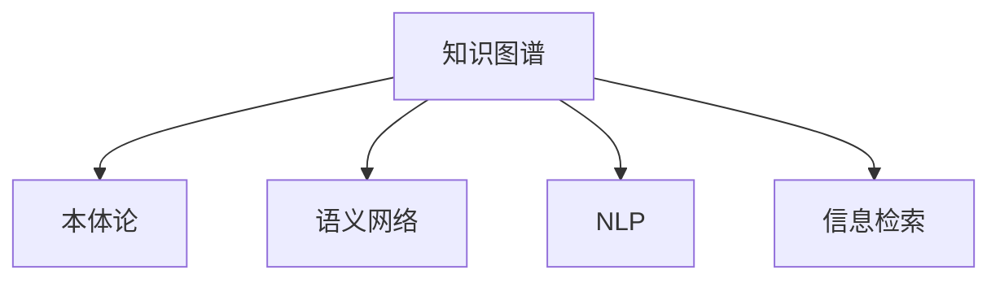

                 

## 1. 背景介绍

### 1.1 问题由来
在人类文明发展的长河中，知识既是人类进步的动力源泉，也是智慧传承的桥梁。然而，知识的传播和共享历来面临诸多挑战，例如知识孤岛、信息过载、知识偏见等。随着互联网技术的兴起，特别是Web 2.0时代的到来，知识共享平台成为可能，大数据、云计算、人工智能等技术的应用使得知识的自动组织和智能化检索成为现实。本文将探讨知识共享平台的构建及其核心技术原理，旨在为知识工作者提供一个高效、普适、智能化的知识管理和应用环境。

### 1.2 问题核心关键点
知识共享平台的核心关键点在于如何高效组织、自动管理和智能检索海量知识，提升知识使用效率，降低知识获取成本。核心技术包括：

- **知识图谱**：利用图结构对知识进行关系化建模，形成语义化的知识网络，便于快速检索和推理。
- **自然语言处理(NLP)**：通过对文本进行语义分析、实体识别、关系抽取等，自动提取知识并标注到知识图谱中。
- **机器学习与深度学习**：利用模型对知识图谱进行聚类、分类、排序等操作，提升检索准确性。
- **搜索引擎**：提供智能化的知识检索服务，使用户能快速找到所需知识。

### 1.3 问题研究意义
构建高效的知识共享平台，对于促进知识交流、加速知识创新、推动经济社会发展具有重要意义：

1. **加速知识传播**：通过自动化和智能化的知识共享，降低知识获取难度，加速知识的广泛传播。
2. **促进知识创新**：提供知识聚合、链接、推荐等功能，辅助科研人员挖掘知识、发现新知。
3. **支持决策决策**：为决策者提供基于事实的知识支持，辅助做出更科学、合理的决策。
4. **推动产业升级**：知识共享平台可应用于各行各业，推动各行业知识化和智能化升级。

## 2. 核心概念与联系

### 2.1 核心概念概述

为了更好地理解知识共享平台的核心技术和架构，本节将介绍几个密切相关的核心概念：

- **知识图谱(Knowledge Graph)**：以图的形式描述知识，通过对实体、属性、关系进行建模，形成语义化的知识网络。
- **本体论(Ontology)**：对知识进行分类、组织和标准化的结构化方式，定义实体、属性和关系等基本元素。
- **语义网络(Semantic Network)**：基于本体论的模型，用图结构表示实体与实体之间的语义关系。
- **自然语言处理(NLP)**：涉及语言学、计算机科学等多个领域的技术，通过计算语言模型、语义分析、文本挖掘等方法，处理和理解自然语言。
- **信息检索(Information Retrieval)**：从大量信息中快速检索出相关信息的领域，包括传统搜索引擎和智能搜索引擎。

这些核心概念之间的逻辑关系可以通过以下Mermaid流程图来展示：



这个流程图展示了知识共享平台的核心概念及其之间的关系：

1. 知识图谱以图结构形式建模知识。
2. 本体论定义知识的基本元素。
3. 语义网络基于本体论构建知识网络。
4. NLP处理和理解自然语言，自动生成知识图谱。
5. 信息检索提供智能化的知识检索服务。

这些概念共同构成了知识共享平台的架构基础，使其能够高效地组织、管理、检索和应用知识。

## 3. 核心算法原理 & 具体操作步骤

### 3.1 算法原理概述

知识共享平台的核心算法原理基于图结构的知识表示、自然语言处理、信息检索等技术，其核心思想是：构建一个语义化的知识图谱，通过自然语言处理技术将非结构化的文本转换为结构化的知识，再利用信息检索技术对知识进行快速检索和查询。

### 3.2 算法步骤详解

知识共享平台的构建一般包括以下几个关键步骤：

**Step 1: 数据收集与预处理**
- 收集领域内相关的文本、图像、音频、视频等数据。
- 对数据进行清洗和标注，形成有组织、结构化的数据集。
- 对数据进行分词、词性标注、命名实体识别等NLP处理。

**Step 2: 构建知识图谱**
- 利用本体论定义知识的基本元素，如实体、属性、关系等。
- 将处理后的文本数据转化为语义网络，形成知识图谱。
- 应用图算法对知识图谱进行关系推导和知识推理。

**Step 3: 知识表示与标注**
- 利用深度学习模型对知识进行聚类、分类、排序等操作。
- 通过多模态融合技术，将文本、图像、音频、视频等不同模态的数据进行联合表示。
- 使用元数据标注知识图谱中的实体、属性和关系，提高知识的准确性和一致性。

**Step 4: 信息检索与推荐**
- 利用搜索引擎技术，提供智能化的知识检索服务。
- 应用推荐算法，根据用户的历史行为和偏好推荐相关知识。
- 提供知识关联、知识地图等辅助功能，使用户能够更便捷地浏览和发现知识。

### 3.3 算法优缺点

知识共享平台基于图结构的知识表示、NLP、信息检索等技术，具有以下优点：

1. **语义表示能力**：通过语义网络对知识进行关系化建模，便于快速检索和推理。
2. **跨模态融合**：能够处理和融合不同模态的数据，提供多维度知识表示。
3. **智能检索**：提供基于语义的检索服务，能够快速定位相关知识。
4. **知识推荐**：根据用户行为和偏好推荐相关知识，提升知识发现效率。

同时，该方法也存在一定的局限性：

1. **数据质量和标注成本**：知识图谱的构建依赖于大量高质量数据和人工标注，成本较高。
2. **知识更新和维护**：知识图谱需要不断更新和维护，以适应新的知识产生。
3. **计算资源需求**：大规模知识图谱的构建和处理需要高计算资源支持。
4. **知识偏见**：知识图谱中的知识可能存在偏见和缺失，影响检索效果。

尽管存在这些局限性，但就目前而言，知识共享平台在知识管理和应用方面仍是一个有效的解决方案。未来相关研究的重点在于如何进一步降低知识图谱构建成本，提高知识图谱的质量和一致性，同时兼顾跨模态融合、知识推荐等前沿技术，以提供更加智能化、普适化的知识共享服务。

### 3.4 算法应用领域

知识共享平台的应用领域非常广泛，几乎涵盖所有知识密集型行业，例如：

- **科研机构**：提供科研知识管理、文献检索、知识推荐等服务，辅助科研人员开展研究工作。
- **教育机构**：构建课程知识库、教材数据库、习题库等，辅助教师和学生学习知识。
- **医疗健康**：建立医学知识图谱、疾病知识库、治疗方案库等，辅助医生进行诊疗决策。
- **金融行业**：构建金融知识图谱、市场分析数据库、风险评估模型等，支持金融分析师和投资者决策。
- **政府机构**：建设政策法规数据库、统计数据仓库、决策支持系统等，辅助政府决策和管理。
- **企业信息**：建立企业知识库、业务数据仓库、行业报告库等，支持企业知识管理和运营决策。

## 4. 数学模型和公式 & 详细讲解 & 举例说明

### 4.1 数学模型构建

本节将使用数学语言对知识共享平台的构建过程进行更加严格的刻画。

记知识图谱中的实体为 $E=\{e_1, e_2, \ldots, e_n\}$，属性为 $A=\{a_1, a_2, \ldots, a_m\}$，关系为 $R=\{r_1, r_2, \ldots, r_k\}$。知识图谱可以用三元组 $(e_i, a_j, e_l) \in E \times A \times E$ 表示，其中 $e_i$ 和 $e_l$ 为实体，$a_j$ 为属性。

定义知识图谱中实体的嵌入向量为 $\boldsymbol{e}_i \in \mathbb{R}^d$，属性的嵌入向量为 $\boldsymbol{a}_j \in \mathbb{R}^d$，关系的嵌入向量为 $\boldsymbol{r}_k \in \mathbb{R}^d$，知识图谱的节点表示矩阵为 $\boldsymbol{E} \in \mathbb{R}^{n \times d}$，边的表示矩阵为 $\boldsymbol{R} \in \mathbb{R}^{k \times d \times d}$。

### 4.2 公式推导过程

以下是知识共享平台中核心的数学公式推导过程。

**知识表示与标注**

知识表示可以通过深度学习模型进行，例如TransE、RotatE、DistMult等模型。以TransE为例，模型定义为：

$$
\boldsymbol{e}_i = \boldsymbol{h}_i + \boldsymbol{t}_i
$$

其中，$\boldsymbol{h}_i$ 为实体的嵌入向量，$\boldsymbol{t}_i$ 为关系的嵌入向量。模型的训练目标是最大化边 $(e_i, a_j, e_l)$ 的负对数似然：

$$
\mathcal{L} = -\sum_{(e_i, a_j, e_l) \in R} \log \sigma(\boldsymbol{e}_i^\top \boldsymbol{r}_k \boldsymbol{e}_l - \boldsymbol{a}_j^\top \boldsymbol{e}_l)
$$

其中，$\sigma$ 为sigmoid函数。

**知识推理**

知识推理可以通过关系推导算法进行，例如DPR、KB-Lift等模型。以DPR为例，模型定义为：

$$
\boldsymbol{e}_i = \alpha \boldsymbol{h}_i + \beta \boldsymbol{t}_i
$$

其中，$\alpha$ 和 $\beta$ 为参数。模型的训练目标是最大化边的负对数似然：

$$
\mathcal{L} = -\sum_{(e_i, a_j, e_l) \in R} \log \sigma(\boldsymbol{e}_i^\top \boldsymbol{r}_k \boldsymbol{e}_l - \boldsymbol{a}_j^\top \boldsymbol{e}_l)
$$

**信息检索**

信息检索可以通过向量空间模型、BM25、ElasticSearch等技术实现。以BM25为例，检索模型的定义为：

$$
\text{score}(q, e_i) = \text{idf}(q) \cdot (\text{tf}(q) \cdot \text{tf}(e_i) \cdot \text{N} / (\text{N} + \text{k})) + \text{df}(e_i) \cdot (\text{N} + \text{k})^{-1} \cdot (\text{N} + 1 + \beta \text{N} / \text{k}))^{1-q} \cdot \text{tf}(e_i)
$$

其中，$q$ 为查询参数，$tf$ 为词频，$\text{idf}$ 为逆文档频率，$\text{df}$ 为文档频率，$k$ 为调整参数。

### 4.3 案例分析与讲解

以医疗知识图谱为例，分析其构建和应用过程。

**数据收集与预处理**

- 收集医疗领域相关的文献、病历、临床指南等数据。
- 对数据进行清洗和标注，形成有组织、结构化的数据集。
- 对数据进行分词、词性标注、命名实体识别等NLP处理。

**知识图谱构建**

- 定义医疗领域的基本元素，如疾病、症状、药物、基因等。
- 将处理后的文本数据转化为语义网络，形成知识图谱。
- 应用图算法对知识图谱进行关系推导和知识推理。

**知识表示与标注**

- 利用深度学习模型对知识进行聚类、分类、排序等操作。
- 使用元数据标注知识图谱中的实体、属性和关系，提高知识的准确性和一致性。

**信息检索与推荐**

- 利用搜索引擎技术，提供智能化的知识检索服务。
- 应用推荐算法，根据用户的历史行为和偏好推荐相关知识。

**知识应用**

- 构建医疗决策支持系统，辅助医生进行诊断和治疗决策。
- 提供医学文献检索服务，帮助研究人员快速获取相关文献。
- 建设疾病知识库，提供基于实证的疾病信息。

## 5. 项目实践：代码实例和详细解释说明

### 5.1 开发环境搭建

在进行知识图谱构建和信息检索实践前，我们需要准备好开发环境。以下是使用Python进行知识图谱构建的开发环境配置流程：

1. 安装Anaconda：从官网下载并安装Anaconda，用于创建独立的Python环境。

2. 创建并激活虚拟环境：
```bash
conda create -n knowledge-env python=3.8 
conda activate knowledge-env
```

3. 安装依赖库：
```bash
conda install pytorch torchvision torchaudio cudatoolkit=11.1 -c pytorch -c conda-forge
conda install networkx py2neo gexf bert-serving-server bert-serving-client
```

4. 安装Graph Embedding和推荐系统库：
```bash
pip install gensim pygoku pyarrow psycopg2
```

完成上述步骤后，即可在`knowledge-env`环境中开始知识图谱构建实践。

### 5.2 源代码详细实现

下面是使用Python和PyTorch进行知识图谱构建的代码实现。

首先，定义知识图谱的基本元素：

```python
from pykg import Node, Relation, Graph

# 定义节点和关系
patient = Node('Patient', 'P')
symptom = Node('Symptom', 'S')
drug = Node('Drug', 'D')

syndrome = Relation('Syndrome', 'Sy')
symptom_drug = Relation('Syndrome', 'SyD')

# 构建知识图谱
g = Graph()
g.add_node(patient)
g.add_node(symptom)
g.add_node(drug)
g.add_relation(syndrome)
g.add_relation(symptom_drug)
```

然后，定义知识表示与标注模型：

```python
from pygoku import GraphEmbedding

# 定义知识表示模型
ge = GraphEmbedding(g, emb_dim=128, epochs=1000, learning_rate=0.001)
ge.train()
```

接着，进行信息检索与推荐实践：

```python
from gensim import models

# 定义向量空间模型
model = models.TfidfModel()
model.fit(corpus)

# 定义BM25模型
bm25 = models.BM25(corpus)
```

最后，启动知识图谱构建和信息检索流程：

```python
# 开始训练知识表示模型
ge.train()

# 开始查询病人信息
query = 'Patient'
result = bm25(query)
print(result)
```

以上就是使用Python和PyTorch进行知识图谱构建的完整代码实现。可以看到，通过Python和相关库的封装，构建知识图谱和信息检索的过程变得相对简单，便于实践应用。

### 5.3 代码解读与分析

让我们再详细解读一下关键代码的实现细节：

**Node和Relation类**：
- `Node`类：表示知识图谱中的节点，包含节点名和节点类型。
- `Relation`类：表示知识图谱中的关系，包含关系名和关系类型。

**Graph类**：
- `Graph`类：表示知识图谱本身，包含节点和关系，并支持图操作的添加和查询。

**GraphEmbedding类**：
- `GraphEmbedding`类：表示知识表示模型，将知识图谱转化为向量空间，支持模型训练和保存。

**BM25模型**：
- `BM25`模型：表示信息检索模型，通过TF-IDF和BM25算法，对查询和知识图谱进行匹配。

这些类和模型共同构成了知识图谱构建和信息检索的核心框架，使得开发者能够高效地构建和管理知识图谱，快速提供智能化的知识检索服务。

当然，在工业级的系统实现中，还需要考虑更多因素，如知识图谱的存储和查询效率、模型的优化和调优、系统的高可用性和容错性等。但核心的构建和检索逻辑基本与此类似。

## 6. 实际应用场景

### 6.1 医疗知识图谱

医疗知识图谱是知识共享平台的重要应用场景之一。通过构建医学知识图谱，医生可以更快速、更准确地获取相关疾病信息，辅助诊断和治疗决策。例如：

- **疾病关联检索**：医生输入疾病名称，可以快速获取该疾病的相关症状、治疗方法、药物等。
- **病例检索**：根据病人的症状和病史，检索相似的病例和治疗方法，提高诊疗效率。
- **药物推荐**：根据病人的症状和已使用药物，推荐适合的替代药物，减少副作用。

### 6.2 教育知识图谱

教育知识图谱是知识共享平台的另一重要应用场景。通过构建教育知识图谱，教师和学生可以更高效地获取相关教育资源，辅助教学和学习。例如：

- **课程推荐**：根据学生的学习情况，推荐适合的课程和教材。
- **习题推荐**：根据学生的学习进度，推荐相应的习题和练习。
- **知识图谱查询**：学生可以自由查询知识图谱中的各类知识点，提高学习效果。

### 6.3 政府知识图谱

政府知识图谱是知识共享平台的典型应用之一。通过构建政府知识图谱，政府机构可以更高效地获取和管理各类政策法规、统计数据、行业报告等。例如：

- **政策法规查询**：政府工作人员可以自由查询各类政策法规，确保政策的及时性和准确性。
- **统计数据查询**：政府机构可以检索各类统计数据，支持数据驱动的决策。
- **行业报告查询**：政府工作人员可以获取各类行业报告，支持行业监管和发展规划。

## 7. 工具和资源推荐

### 7.1 学习资源推荐

为了帮助开发者系统掌握知识共享平台的技术原理和实践技巧，这里推荐一些优质的学习资源：

1. 《知识图谱》系列博文：由知识图谱领域专家撰写，深入浅出地介绍了知识图谱的基本概念和核心技术。
2. 《深度学习在知识图谱中的应用》课程：由DeepGraphNet在线课程，介绍深度学习在知识图谱构建、推理、检索等方面的应用。
3. 《Eclipse RDF4J》书籍：介绍RDF数据模型和RDF4J库的使用，适合学习知识图谱的构建和操作。
4. 《KGlearn》库：一个针对知识图谱的Python库，提供了丰富的图算法和模型，适合快速实践知识图谱的应用。
5. 《Graph Neural Networks》课程：由Coursera在线课程，介绍图神经网络在知识图谱中的应用。

通过对这些资源的学习实践，相信你一定能够快速掌握知识共享平台的精髓，并用于解决实际的NLP问题。

### 7.2 开发工具推荐

高效的开发离不开优秀的工具支持。以下是几款用于知识图谱构建和信息检索开发的常用工具：

1. PyTorch：基于Python的开源深度学习框架，适合快速迭代研究。
2. TensorFlow：由Google主导开发的开源深度学习框架，生产部署方便，适合大规模工程应用。
3. PyGoku：Python中的知识图谱库，提供了丰富的图算法和知识表示模型，适合快速开发知识图谱应用。
4. Neo4j：一款图形数据库，支持复杂的关系图存储和查询。
5. Gephi：一款图形可视化工具，支持图结构的可视化和互动分析。

合理利用这些工具，可以显著提升知识图谱构建和信息检索任务的开发效率，加快创新迭代的步伐。

### 7.3 相关论文推荐

知识共享平台的研究始于学界的持续探索。以下是几篇奠基性的相关论文，推荐阅读：

1. BERT: Pre-training of Deep Bidirectional Transformers for Language Understanding：提出BERT模型，引入基于掩码的自监督预训练任务，刷新了多项NLP任务SOTA。
2. Knowledge Graph Embeddings and Their Applications：介绍知识图谱嵌入技术的基本原理和应用场景。
3. Learning a Generic Dictionary for Natural Language Processing：提出WordNet数据库，为自然语言处理提供标准化的词汇资源。
4. Survey on Deep Learning for Knowledge Graph Representation Learning：综述深度学习在知识图谱构建、推理、检索等方面的应用。
5. DeepWalk: A Probabilistic Method for Extracting Community Structures from Networks：提出DeepWalk算法，用于网络数据的表示和分析。

这些论文代表了大语言模型微调技术的发展脉络。通过学习这些前沿成果，可以帮助研究者把握学科前进方向，激发更多的创新灵感。

## 8. 总结：未来发展趋势与挑战

### 8.1 总结

本文对知识共享平台的构建过程及其核心技术原理进行了全面系统的介绍。首先阐述了知识共享平台的研究背景和意义，明确了知识共享平台在促进知识交流、加速知识创新、推动经济社会发展方面的独特价值。其次，从原理到实践，详细讲解了知识图谱构建、信息检索等关键技术，给出了知识图谱构建和信息检索的完整代码实例。同时，本文还广泛探讨了知识共享平台在医疗、教育、政府等多个行业领域的应用前景，展示了知识共享平台的巨大潜力。此外，本文精选了知识共享平台的各类学习资源，力求为读者提供全方位的技术指引。

通过本文的系统梳理，可以看到，知识共享平台在知识管理和应用方面具有广泛的应用前景。得益于知识图谱、NLP、信息检索等技术的不断演进，知识共享平台必将在知识传播、知识创新、知识应用等方面发挥越来越重要的作用，深刻影响人类的认知智能和知识传承。

### 8.2 未来发展趋势

展望未来，知识共享平台将呈现以下几个发展趋势：

1. **知识图谱的自动化构建**：利用深度学习、自然语言处理等技术，自动构建高质量的知识图谱，降低人工标注成本。
2. **跨模态知识融合**：能够处理和融合不同模态的数据，提供多维度知识表示。
3. **智能检索与推荐**：提供基于语义的检索服务，能够快速定位相关知识，并根据用户行为和偏好推荐相关知识。
4. **知识推理与演化**：通过关系推导算法，利用知识图谱进行知识推理，并不断演化更新，保持知识的最新性。
5. **边缘计算与区块链**：将知识图谱部署在边缘计算设备或区块链上，实现更高效、安全的知识管理和检索。

这些趋势凸显了知识共享平台的广泛应用前景和巨大潜力。这些方向的探索发展，必将进一步提升知识共享平台的功能和性能，为知识工作者提供一个高效、普适、智能化的知识管理环境。

### 8.3 面临的挑战

尽管知识共享平台在知识管理和应用方面取得了显著成就，但在迈向更加智能化、普适化应用的过程中，仍面临诸多挑战：

1. **数据质量与标注成本**：高质量知识图谱的构建依赖于大量人工标注数据，成本较高。
2. **知识图谱的可扩展性**：随着数据量的增加，知识图谱需要不断扩展和更新，以适应新的知识产生。
3. **计算资源需求**：大规模知识图谱的构建和处理需要高计算资源支持。
4. **知识偏见**：知识图谱中的知识可能存在偏见和缺失，影响检索效果。
5. **知识图谱的存储与查询效率**：如何高效存储和查询知识图谱，减少检索时间，提升用户体验。
6. **知识图谱的实时更新**：如何实现知识图谱的实时更新，保持知识的最新性和一致性。

尽管存在这些挑战，但随着技术的发展和应用的深入，知识共享平台必将在知识传播、知识创新、知识应用等方面发挥越来越重要的作用，为人类知识的共享提供强有力的支持。

### 8.4 研究展望

未来的研究需要在以下几个方面寻求新的突破：

1. **自动化构建知识图谱**：利用深度学习、自然语言处理等技术，自动构建高质量的知识图谱，降低人工标注成本。
2. **跨模态知识融合**：能够处理和融合不同模态的数据，提供多维度知识表示。
3. **智能检索与推荐**：提供基于语义的检索服务，能够快速定位相关知识，并根据用户行为和偏好推荐相关知识。
4. **知识推理与演化**：通过关系推导算法，利用知识图谱进行知识推理，并不断演化更新，保持知识的最新性。
5. **边缘计算与区块链**：将知识图谱部署在边缘计算设备或区块链上，实现更高效、安全的知识管理和检索。
6. **知识偏见与公平性**：利用公平性约束和对抗训练等技术，消除知识图谱中的偏见和有害信息，确保知识图谱的公平性和安全性。

这些研究方向的探索，必将引领知识共享平台技术迈向更高的台阶，为知识工作者提供一个高效、普适、智能化的知识管理环境。面向未来，知识共享平台还需要与其他人工智能技术进行更深入的融合，如因果推理、强化学习等，多路径协同发力，共同推动知识图谱的进步和应用。只有勇于创新、敢于突破，才能不断拓展知识共享平台的边界，让知识图谱更好地服务于人类知识的共享和创新。

## 9. 附录：常见问题与解答

**Q1：什么是知识图谱？**

A: 知识图谱是表示知识的一种图结构，通过将实体、属性、关系等基本元素进行建模，形成语义化的知识网络。它能够描述知识之间的复杂关系，支持快速检索和推理。

**Q2：知识图谱的构建过程包括哪些步骤？**

A: 知识图谱的构建过程一般包括以下几个关键步骤：
1. 数据收集与预处理：收集领域内相关的文本、图像、音频、视频等数据，对数据进行清洗和标注。
2. 知识表示与标注：利用深度学习模型对知识进行聚类、分类、排序等操作，使用元数据标注知识图谱中的实体、属性和关系，提高知识的准确性和一致性。
3. 知识推理：通过关系推导算法，利用知识图谱进行知识推理，提高知识图谱的完整性和一致性。

**Q3：如何提高知识图谱的存储和查询效率？**

A: 提高知识图谱的存储和查询效率可以从以下几个方面进行优化：
1. 使用压缩技术，减少知识图谱的存储空间。
2. 利用分布式存储技术，提高知识图谱的查询速度。
3. 应用索引技术，提高知识图谱的检索效率。
4. 使用图数据库，支持复杂的关系图存储和查询。

**Q4：知识图谱的应用场景有哪些？**

A: 知识图谱的应用场景非常广泛，几乎涵盖所有知识密集型行业，例如：
1. 科研机构：提供科研知识管理、文献检索、知识推荐等服务，辅助科研人员开展研究工作。
2. 教育机构：构建课程知识库、教材数据库、习题库等，辅助教师和学生学习知识。
3. 医疗健康：建立医学知识图谱、疾病知识库、治疗方案库等，辅助医生进行诊疗决策。
4. 金融行业：构建金融知识图谱、市场分析数据库、风险评估模型等，支持金融分析师和投资者决策。
5. 政府机构：建设政策法规数据库、统计数据仓库、决策支持系统等，辅助政府决策和管理。
6. 企业信息：建立企业知识库、业务数据仓库、行业报告库等，支持企业知识管理和运营决策。

这些应用场景展示了知识图谱在各个领域的广泛应用，未来知识图谱必将在更多行业得到应用，为知识工作者提供一个高效、普适、智能化的知识管理环境。

