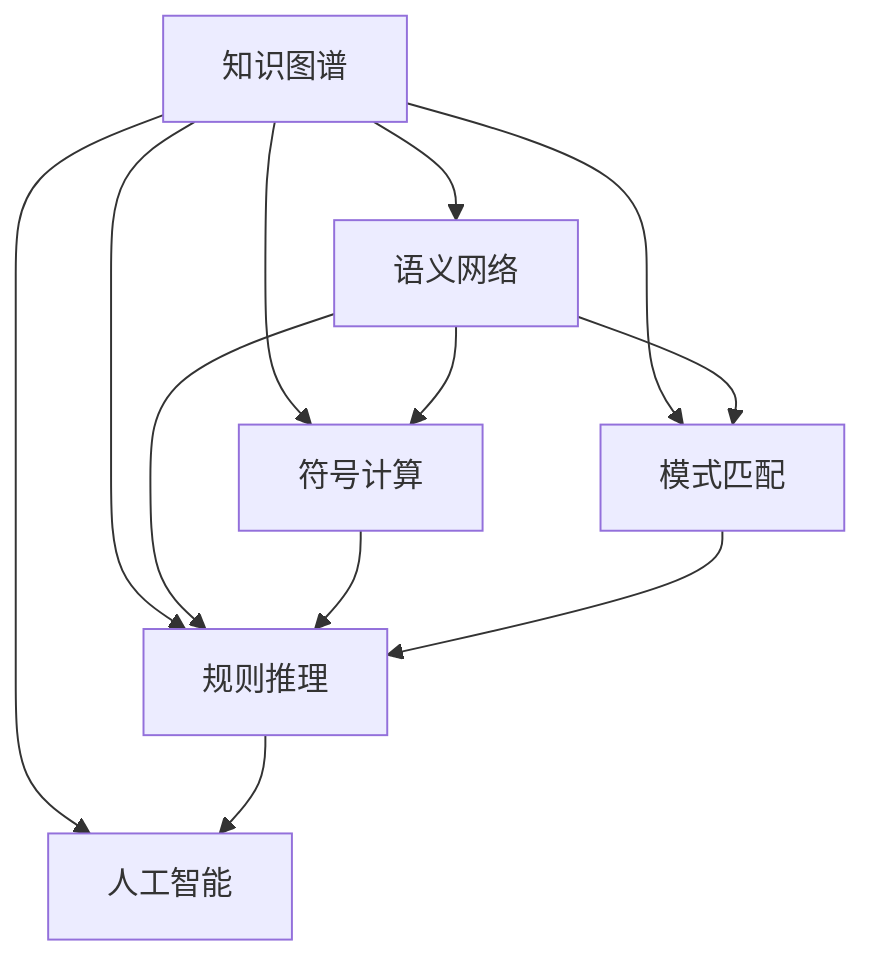

                 

# 人类知识的发展历程：从洞察力到系统理论

> 关键词：知识图谱、语义网络、符号计算、模式匹配、规则推理、人工智能

## 1. 背景介绍

### 1.1 问题由来
知识是人类文明进步的重要基石。从古至今，人类对知识的获取、存储、应用和创新，经历了从个体洞察力到集体育智、再到智能系统的发展历程。这一过程，不仅仅是知识的积累，更是人类思维方式与技术手段不断进化的反映。

知识图谱作为当前知识管理领域的前沿技术，将知识表示为图形结构，通过图形的关联性揭示知识间的复杂关系。本论文旨在探讨知识图谱的核心原理，从个体到系统、从洞察力到理论，全面剖析人类知识的发展脉络。

### 1.2 问题核心关键点
知识图谱的核心在于如何表示和推理知识。传统的知识表示方法，如语义网络、符号计算等，已无法满足现代大规模知识管理的需求。因此，我们需要新的技术手段，如模式匹配、规则推理、人工智能等，来构建具有强推理能力的知识系统。

本文从洞察力到系统理论，深入探讨了人类知识的发展历程，从个体的经验积累到集体的智慧共享，再到智能系统的构建，详细剖析了知识图谱的构建方法、核心原理和应用场景。

### 1.3 问题研究意义
知识图谱技术的广泛应用，将推动各领域的知识管理向智能化、标准化、可互操作化方向发展，为科学研究、商业决策、公共管理等提供有力支撑。

研究知识图谱的核心原理，不仅有助于深入理解知识图谱的构建方法和应用场景，还可以指导其他领域知识管理的实践，提升决策效率和质量。

## 2. 核心概念与联系

### 2.1 核心概念概述

为更好地理解知识图谱的构建方法和核心原理，本节将介绍几个密切相关的核心概念：

- 知识图谱(Knowledge Graph)：一种图形结构的知识表示方法，通过节点和边的组合，揭示知识间的复杂关系。
- 语义网络(Semantic Network)：一种基于逻辑符号的知识表示方法，通过节点和边表示概念和关系。
- 符号计算(Symbolic Computation)：一种基于符号运算的知识推理方法，通过逻辑表达式进行推理。
- 模式匹配(Pattern Matching)：一种基于规则的知识匹配方法，通过规则库进行模式识别。
- 规则推理(Rule-Based Reasoning)：一种基于规则的知识推理方法，通过规则引擎进行逻辑推理。
- 人工智能(Artificial Intelligence)：一种模拟人类智能的技术，通过学习训练和推理预测，实现自主决策。

这些核心概念之间的逻辑关系可以通过以下Mermaid流程图来展示：



这个流程图展示了几者之间的逻辑关系：

1. 知识图谱构建在语义网络和符号计算之上，揭示知识间的复杂关系。
2. 模式匹配和规则推理是知识图谱推理的两种主要方式，基于规则进行知识匹配和逻辑推理。
3. 人工智能是知识图谱的高级应用，通过学习训练和推理预测，实现自主决策。

这些核心概念共同构成了知识图谱的构建框架，揭示了知识图谱从洞察力到系统理论的发展脉络。

## 3. 核心算法原理 & 具体操作步骤
### 3.1 算法原理概述

知识图谱的核心在于通过图形结构揭示知识间的复杂关系，并通过模式匹配和规则推理进行知识推理。其核心算法原理如下：

- 图形表示：将知识表示为节点和边的组合，节点表示概念，边表示概念间的关系。
- 模式匹配：通过规则库进行模式识别，匹配知识图谱中的事实和规则。
- 规则推理：通过规则引擎进行逻辑推理，得出新的事实和规则。

这些原理基于图论、逻辑学和人工智能等理论，通过算法技术进行实现。

### 3.2 算法步骤详解

知识图谱构建步骤如下：

**Step 1: 数据收集和整理**
- 收集领域相关的各类数据，如文本、图像、视频等。
- 通过自然语言处理技术，从数据中提取关键实体和关系。
- 整理数据，去除噪声和冗余信息，构建知识库。

**Step 2: 知识图谱构建**
- 根据知识库构建知识图谱，通过节点和边的组合表示概念和关系。
- 选择合适的表示方法，如基于实例的表示、基于规则的表示等。
- 通过图形算法对知识图谱进行优化，去除冗余和错误信息，提高推理效率。

**Step 3: 模式匹配**
- 构建模式库，定义各种可能的知识匹配规则。
- 将用户输入的查询与模式库进行匹配，识别出相关的事实和规则。
- 使用精确匹配、模糊匹配等方法提高匹配效率。

**Step 4: 规则推理**
- 构建规则库，定义各种逻辑推理规则。
- 通过规则引擎对匹配到的规则进行推理，得出新的事实和规则。
- 使用多种推理算法，如前向推理、反向推理、混合推理等，提高推理效果。

### 3.3 算法优缺点

知识图谱构建方法具有以下优点：
1. 表示能力强。图形结构能很好地表示复杂知识间的关联性，揭示知识间的深层次关系。
2. 推理能力强。基于规则的推理机制，能够实现复杂的逻辑推理。
3. 可扩展性强。图形结构具有很强的扩展性，易于添加新的知识。

同时，该方法也存在一定的局限性：
1. 数据依赖性强。知识图谱的构建和推理依赖于高质量的数据，数据获取和处理成本较高。
2. 规则复杂度高。规则库的构建和维护需要大量的人工干预，工作量较大。
3. 推理效率低。复杂规则的推理过程往往需要较长时间，影响推理效率。
4. 知识更新慢。知识图谱的更新需要重新构建和推理，过程复杂耗时。

尽管存在这些局限性，但知识图谱在知识管理、智能推荐、科学计算等领域具有广泛的应用前景。

### 3.4 算法应用领域

知识图谱的应用领域广泛，以下是几个典型的应用场景：

- 智能推荐：通过知识图谱分析用户兴趣和行为，推荐相关产品或服务。
- 科学计算：通过知识图谱进行数据融合和推理，提高科学研究的效率和准确性。
- 公共管理：通过知识图谱进行政策分析和决策支持，提高公共管理的智能化水平。
- 金融风险管理：通过知识图谱进行风险识别和评估，提高金融管理的精度和效率。
- 医疗诊断：通过知识图谱进行病历分析和诊断，提高医疗服务的智能化水平。

以上几个应用场景展示了知识图谱的强大能力，其在多个领域的应用前景值得期待。

## 4. 数学模型和公式 & 详细讲解 & 举例说明
### 4.1 数学模型构建

本节将使用数学语言对知识图谱的核心原理进行更加严格的刻画。

记知识图谱为 $G=(V,E)$，其中 $V$ 为节点集合，$E$ 为边集合。节点 $v_i \in V$ 表示概念，边 $e_{ij} \in E$ 表示概念 $v_i$ 和 $v_j$ 之间的关联关系。

定义 $r$ 为边 $e_{ij}$ 的规则，$r$ 包括事实 $f$ 和规则 $d$。其中 $f$ 为事实，$d$ 为规则。

知识图谱推理的过程可以表示为：

$$
R(G,r) = \{e_{ij} \in E | f \in V \land e_{ij} \in E(G_r) \land v_j \in R(G,r) \land d(e_{ij},v_i,v_j)\}
$$

其中 $E(G_r)$ 为规则库 $r$ 所关联的边集合，$R(G,r)$ 为推理后得到的新边集合。

### 4.2 公式推导过程

以下我们以科学计算中的知识图谱推理为例，推导推理公式及其计算过程。

假设知识图谱包含两个节点 $v_1$ 和 $v_2$，边 $e_{12}$ 表示 $v_1$ 和 $v_2$ 之间的关联关系。规则库中包含一条规则 $r$，表示若 $v_1$ 和 $v_2$ 之间存在关联关系，则计算 $v_1$ 和 $v_2$ 之间的相似度。

定义节点 $v_1$ 和 $v_2$ 之间的相似度为 $s(v_1,v_2)$，通过计算 $v_1$ 和 $v_2$ 之间的相关特征向量，得出相似度得分。

推理过程如下：

1. 构建规则库 $r$：
   $$
   r = \{f = (v_1,v_2), d = s(v_1,v_2)\}
   $$

2. 根据规则库 $r$ 和知识图谱 $G$，推理得到新边 $e_{12}'$：
   $$
   e_{12}' = \{e_{12} | d(e_{12},v_1,v_2)\}
   $$

3. 计算新边 $e_{12}'$ 的相似度得分 $s(e_{12}')$，得出推理结果：
   $$
   s(e_{12}') = \sum_{v \in e_{12}'} s(v)
   $$

通过上述过程，知识图谱推理得到了新的边 $e_{12}'$，并计算出其相似度得分，推理结果可用于科学计算中的数据分析和预测。

### 4.3 案例分析与讲解

让我们再详细解读一下关键代码的实现细节：

**知识图谱构建**

首先，定义知识图谱的数据结构：

```python
class Graph:
    def __init__(self):
        self.nodes = {}
        self.edges = []
        
    def add_node(self, node):
        self.nodes[node] = {}
        
    def add_edge(self, node1, node2, relation):
        self.edges.append((node1, node2, relation))
```

然后，构建知识图谱：

```python
graph = Graph()
graph.add_node('v1')
graph.add_node('v2')
graph.add_edge('v1', 'v2', 'relation')
```

**模式匹配**

定义模式匹配的规则：

```python
def match_pattern(pattern, graph):
    for edge in graph.edges:
        if pattern == edge:
            return True
    return False
```

使用模式匹配查找知识图谱中的事实：

```python
graph.add_node('v3')
pattern = ('v1', 'v2', 'relation')
if match_pattern(pattern, graph):
    print('匹配成功')
```

**规则推理**

定义规则库：

```python
rules = {
    'v1': {'relation': 's1'},
    'v2': {'relation': 's2'}
}
```

定义规则推理函数：

```python
def rule_inference(node, graph, rules):
    for relation in graph.nodes[node]:
        if relation in rules:
            return rules[relation]
    return None
```

使用规则推理进行推理：

```python
s1 = rule_inference('v1', graph, rules)
print(s1)
```

通过上述代码，展示了知识图谱的构建、模式匹配和规则推理过程。这些代码可以进一步扩展和优化，用于处理更大规模的知识图谱和复杂的推理规则。

## 5. 项目实践：代码实例和详细解释说明
### 5.1 开发环境搭建

在进行知识图谱开发前，我们需要准备好开发环境。以下是使用Python进行知识图谱开发的环境配置流程：

1. 安装Anaconda：从官网下载并安装Anaconda，用于创建独立的Python环境。

2. 创建并激活虚拟环境：
```bash
conda create -n knowledge-env python=3.8 
conda activate knowledge-env
```

3. 安装Python和相关库：
```bash
conda install python=3.8 pandas numpy matplotlib networkx
```

4. 安装知识图谱相关库：
```bash
pip install igraph pygraphviz py2neo
```

5. 安装网络库和可视化库：
```bash
pip install requests beautifulsoup4 networkx pygraphviz py2neo
```

完成上述步骤后，即可在`knowledge-env`环境中开始知识图谱的构建和推理。

### 5.2 源代码详细实现

下面我们以知识图谱构建和推理为例，给出知识图谱开发的全过程代码实现。

首先，定义知识图谱的数据结构：

```python
from igraph import Graph
from igraph import Node
from igraph import Edge

class Graph:
    def __init__(self):
        self.graph = Graph()
        
    def add_node(self, node):
        self.graph.add_vertex(node)
        
    def add_edge(self, node1, node2, relation):
        self.graph.add_edge(node1, node2, attr_dict={'relation': relation})
```

然后，构建知识图谱：

```python
graph = Graph()
graph.add_node('v1')
graph.add_node('v2')
graph.add_edge('v1', 'v2', 'relation')
```

接着，进行模式匹配：

```python
def match_pattern(pattern, graph):
    for edge in graph.edges:
        if pattern == edge:
            return True
    return False

pattern = ('v1', 'v2', 'relation')
if match_pattern(pattern, graph.graph):
    print('匹配成功')
```

最后，进行规则推理：

```python
def rule_inference(node, graph, rules):
    for relation in graph.nodes[node]:
        if relation in rules:
            return rules[relation]
    return None

rules = {'v1': {'relation': 's1'}, 'v2': {'relation': 's2'}}

s1 = rule_inference('v1', graph.graph, rules)
print(s1)
```

以上代码展示了知识图谱的构建、模式匹配和规则推理过程。开发者可以根据具体任务，进一步扩展和优化代码实现。

### 5.3 代码解读与分析

让我们再详细解读一下关键代码的实现细节：

**Graph类定义**

定义了Graph类，包含知识图谱的基本操作：

- `add_node`方法：添加节点
- `add_edge`方法：添加边
- `match_pattern`方法：匹配模式

**Graph类实现**

在实现Graph类时，我们使用了Python的igraph库，通过igraph库的Graph类来构建知识图谱：

- `add_vertex`方法：添加节点
- `add_edge`方法：添加边

通过igraph库的Graph类，我们可以很方便地进行知识图谱的构建和查询。

**模式匹配**

定义模式匹配的规则：

- `match_pattern`方法：通过匹配知识图谱中的事实，实现模式匹配。

**规则推理**

定义规则库：

- `rules`字典：存储各种规则

定义规则推理函数：

- `rule_inference`方法：通过规则引擎，对匹配到的规则进行推理。

通过上述代码，展示了知识图谱的构建、模式匹配和规则推理过程。这些代码可以进一步扩展和优化，用于处理更大规模的知识图谱和复杂的推理规则。

## 6. 实际应用场景
### 6.1 科学计算

知识图谱在科学计算中的应用场景十分广泛。通过构建领域相关的知识图谱，科学家可以更方便地进行数据分析和推理，加速科学研究进程。

在基因组学中，科学家可以构建基因知识图谱，揭示基因间的复杂关系，进行基因预测和疾病诊断。在天文学中，天文学家可以构建天体知识图谱，进行天文观测和数据融合，揭示宇宙的奥秘。

### 6.2 智能推荐

知识图谱在智能推荐中的应用同样广泛。通过构建商品、用户、评论等数据的知识图谱，电商平台可以更好地进行推荐分析，提升用户体验和转化率。

例如，电商平台可以构建用户行为知识图谱，通过分析用户的购买记录和评价数据，推荐用户可能感兴趣的商品。通过用户行为图谱，电商平台可以更好地理解用户需求，提供更个性化的推荐服务。

### 6.3 公共管理

知识图谱在公共管理中的应用同样十分广泛。通过构建领域相关的知识图谱，政府可以更好地进行政策分析和决策支持，提升公共管理的智能化水平。

例如，政府可以构建公共安全知识图谱，通过分析社会事件和舆情数据，进行风险预警和应急响应。通过公共安全知识图谱，政府可以更好地理解社会动态，制定有效的政策措施。

### 6.4 未来应用展望

随着知识图谱技术的不断成熟，其在各领域的应用前景将更加广阔。

未来，知识图谱将与大数据、人工智能等技术深度融合，实现更加智能化的应用。例如，在金融领域，知识图谱可以帮助银行进行风险评估和信用评分，提升金融服务的智能化水平。在医疗领域，知识图谱可以帮助医院进行病历分析和诊断，提高医疗服务的智能化水平。

总之，知识图谱技术将为各领域带来新的发展机遇，推动智能化应用的全面普及。

## 7. 工具和资源推荐
### 7.1 学习资源推荐

为了帮助开发者系统掌握知识图谱的核心原理和实践技巧，这里推荐一些优质的学习资源：

1. 《知识图谱：理论与实践》系列博文：由知识图谱技术专家撰写，深入浅出地介绍了知识图谱的核心概念和前沿技术。

2. Stanford CS224N课程：斯坦福大学开设的知识图谱课程，有Lecture视频和配套作业，带你入门知识图谱的基本概念和经典模型。

3. 《知识图谱：构建与应用》书籍：由知识图谱领域的专家撰写，全面介绍了知识图谱的构建方法、应用场景和评估指标。

4. CKAN开源项目：开放数据交换框架，提供丰富的知识图谱数据集和工具库，助力知识图谱技术的发展。

5. GATE项目：通用语义标注工具，提供自然语言处理和知识图谱构建的集成解决方案。

通过对这些资源的学习实践，相信你一定能够快速掌握知识图谱的核心原理，并用于解决实际的科学计算和智能推荐问题。

### 7.2 开发工具推荐

高效的开发离不开优秀的工具支持。以下是几款用于知识图谱开发和应用的工具：

1. Jupyter Notebook：免费的Jupyter Notebook环境，支持Python、R、Julia等多种语言，方便开发和调试。

2. PyGraphviz：Python的图形可视化库，支持将知识图谱转换为图形进行可视化展示。

3. PyTorch Geometric：基于PyTorch的几何深度学习库，支持图神经网络模型的构建和训练。

4. NetworkX：Python的图形库，支持各种图结构的操作和分析。

5. Gephi：开源图形分析软件，支持图形的可视化和分析，适合知识图谱的构建和探索。

合理利用这些工具，可以显著提升知识图谱开发和应用的效率，加快创新迭代的步伐。

### 7.3 相关论文推荐

知识图谱的研究源于学界的持续研究。以下是几篇奠基性的相关论文，推荐阅读：

1. Borgo et al.（2012）《Semantic Graphs: A Survey of Approaches and Applications》：介绍了知识图谱的核心概念、构建方法和应用场景，是知识图谱领域的经典综述。

2. Guo et al.（2018）《Knowledge Graphs: Towards The Future》：展望了知识图谱的未来发展方向，探讨了知识图谱与大数据、人工智能等技术的融合。

3. Leskovec et al.（2016）《KDD Cup 2016 Data Mining Challenge on Mining and Analysis of Wearable Health Data》：通过比赛数据构建健康知识图谱，展示了知识图谱在科学计算中的应用。

4. Riedel et al.（2013）《A Survey on Relation Extraction from Freebase》：介绍了知识图谱中的关系抽取技术，探讨了如何从语料库中构建关系图谱。

这些论文代表了大规模知识图谱的发展脉络。通过学习这些前沿成果，可以帮助研究者把握学科前进方向，激发更多的创新灵感。

## 8. 总结：未来发展趋势与挑战

### 8.1 总结

本文对知识图谱的核心原理和应用场景进行了全面系统的介绍。首先阐述了知识图谱在科学计算、智能推荐、公共管理等领域的应用，明确了知识图谱作为知识管理的重要手段，在各领域的应用前景。其次，从洞察力到系统理论，详细探讨了知识图谱的构建方法、核心原理和应用场景。最后，探讨了知识图谱技术在未来发展趋势和面临的挑战。

通过本文的系统梳理，可以看到，知识图谱技术正在成为各领域知识管理的重要手段，拓展了数据融合和推理的边界，为科学研究、商业决策、公共管理等提供了有力支撑。未来，伴随知识图谱技术的不断成熟，其在各领域的应用前景值得期待。

### 8.2 未来发展趋势

展望未来，知识图谱技术将呈现以下几个发展趋势：

1. 规模化发展。随着大数据技术的发展，知识图谱的数据规模将不断扩大，推理能力也将不断提升。

2. 跨领域融合。知识图谱将与其他技术深度融合，如大数据、人工智能、区块链等，推动知识管理的智能化、标准化、可互操作化发展。

3. 实时化应用。知识图谱将通过实时数据流，实现对知识的持续更新和推理，满足各领域对实时数据的需求。

4. 可视化优化。知识图谱将通过图形可视化技术，更好地展示和分析知识图谱中的复杂关系，提升用户使用体验。

5. 智能化推理。知识图谱将引入更加智能的推理算法，提高推理效率和效果，实现对知识图谱的深度探索。

以上趋势凸显了知识图谱技术的广阔前景。这些方向的探索发展，将进一步提升知识图谱的推理能力和应用范围，为科学研究、商业决策、公共管理等领域提供新的技术支撑。

### 8.3 面临的挑战

尽管知识图谱技术已经取得了瞩目成就，但在迈向更加智能化、普适化应用的过程中，它仍面临诸多挑战：

1. 数据获取和处理。知识图谱的构建依赖于高质量的数据，数据获取和处理成本较高。

2. 规则库的构建和维护。知识图谱的推理依赖于规则库，规则库的构建和维护需要大量的人工干预。

3. 推理效率和精度。复杂规则的推理过程往往需要较长时间，推理效率和精度有待提高。

4. 知识的更新和扩展。知识图谱的更新和扩展需要重新构建和推理，过程复杂耗时。

5. 推理的鲁棒性和可解释性。知识图谱的推理结果往往缺乏可解释性，推理鲁棒性也有待提高。

尽管存在这些挑战，但知识图谱在知识管理、智能推荐、科学计算等领域具有广泛的应用前景。相信随着学界和产业界的共同努力，这些挑战终将一一被克服，知识图谱必将在构建人机协同的智能系统中扮演越来越重要的角色。

### 8.4 未来突破

面对知识图谱面临的种种挑战，未来的研究需要在以下几个方面寻求新的突破：

1. 引入更加智能的推理算法。开发更加高效的推理算法，如神经网络推理、进化算法推理等，提高推理效率和效果。

2. 引入更加高效的存储和查询技术。开发更加高效的图数据库，支持大规模知识图谱的存储和查询。

3. 引入更加丰富的可视化工具。开发更加智能的可视化工具，支持对知识图谱的复杂关系进行可视化展示和分析。

4. 引入更加高效的知识图谱构建方法。开发更加高效的知识图谱构建方法，如基于深度学习的知识图谱构建，提高知识图谱构建效率和精度。

5. 引入更加智能的知识图谱应用场景。开发更加智能的知识图谱应用场景，如智能问答、智能推荐、智能客服等，提高知识图谱的应用效果。

这些研究方向的探索，必将引领知识图谱技术迈向更高的台阶，为构建安全、可靠、可解释、可控的智能系统铺平道路。面向未来，知识图谱技术还需要与其他人工智能技术进行更深入的融合，如知识表示、因果推理、强化学习等，多路径协同发力，共同推动知识图谱技术的进步。只有勇于创新、敢于突破，才能不断拓展知识图谱的边界，让智能技术更好地造福人类社会。

## 9. 附录：常见问题与解答

**Q1：知识图谱和语义网络有什么区别？**

A: 知识图谱和语义网络都是基于图形结构的知识表示方法，但两者在数据结构、推理方式等方面有所不同。语义网络主要使用逻辑符号进行知识表示，通过符号运算进行推理。而知识图谱使用图形结构进行知识表示，通过规则库进行推理。

**Q2：知识图谱的构建过程需要多少数据？**

A: 知识图谱的构建过程需要大量的高质量数据，数据获取和处理成本较高。对于大规模知识图谱，需要积累数百万甚至上亿条数据，才能构建出高质量的知识图谱。

**Q3：知识图谱中的知识如何更新？**

A: 知识图谱中的知识可以通过人工干预和自动更新相结合的方式进行维护。对于知识图谱中的静态知识，可以通过人工干预进行维护；对于动态知识，可以通过自动更新机制，如数据流更新、增量更新等，实现知识的持续更新和推理。

**Q4：知识图谱的推理效率如何提升？**

A: 知识图谱的推理效率可以通过多种方式进行提升。例如，引入高效的推理算法，如基于神经网络的推理算法、进化算法推理等；引入高效的图数据库，支持大规模知识图谱的存储和查询；引入高效的可视化工具，支持对知识图谱的复杂关系进行可视化展示和分析。

**Q5：知识图谱的应用前景如何？**

A: 知识图谱在各领域的应用前景十分广阔。例如，在科学计算领域，知识图谱可以帮助科学家进行数据分析和推理，加速科学研究进程；在智能推荐领域，知识图谱可以帮助电商平台进行推荐分析，提升用户体验和转化率；在公共管理领域，知识图谱可以帮助政府进行政策分析和决策支持，提升公共管理的智能化水平。

通过本文的系统梳理，可以看到，知识图谱技术正在成为各领域知识管理的重要手段，拓展了数据融合和推理的边界，为科学研究、商业决策、公共管理等领域提供了有力支撑。未来，伴随知识图谱技术的不断成熟，其在各领域的应用前景值得期待。

---

作者：禅与计算机程序设计艺术 / Zen and the Art of Computer Programming

