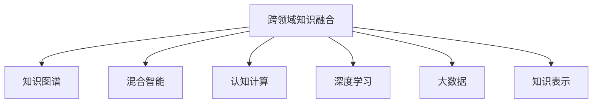

                 

# 人类知识的跨领域融合：创新乐土

> 关键词：人类知识、跨领域融合、创新、大数据、人工智能、深度学习、知识图谱、混合智能、认知计算

## 1. 背景介绍

### 1.1 问题由来

随着科技的迅猛发展和社会的不断进步，人类知识的总量已经达到了前所未有的规模。然而，知识孤岛现象依然严重，不同领域之间存在着深刻的壁垒。这不仅限制了知识的传播和应用，也阻碍了创新的发展。如何突破知识的界限，实现跨领域知识的融合，成为了一个亟待解决的课题。

### 1.2 问题核心关键点

跨领域知识融合的难点在于，不同领域之间存在巨大的语义鸿沟和知识差异。例如，自然语言处理(NLP)领域的知识难以直接应用到图像识别领域，而图像识别领域的模型也难以直接迁移到自然语言处理领域。这种知识壁垒的突破，需要借助先进的计算技术和算法，实现知识之间的互操作性和协同效应。

当前，人类知识的跨领域融合面临着以下几个关键挑战：
- **知识表征不一致**：不同领域的知识表征方式差异较大，难以统一表示和理解。
- **知识领域专业性强**：不同领域的知识体系具有高度的专业性和独特性，难以直接对接。
- **知识规模巨大**：各领域知识规模庞大，直接整合和融合的难度巨大。
- **知识关系复杂**：各领域之间存在复杂的关系网络，如何构建和利用这些关系成为难题。
- **跨领域模型训练难度大**：模型在大规模数据上训练复杂，且难以保证在不同领域上的泛化能力。

### 1.3 问题研究意义

人类知识的跨领域融合，将极大地推动科学技术的进步和创新。通过跨领域知识融合，可以实现以下几个目标：

1. **加速知识传播**：打破不同领域的知识孤岛，实现知识的无障碍传播，提升知识的共享性和利用率。
2. **促进跨学科研究**：跨领域知识融合为跨学科研究提供了新的方向和方法，推动不同领域的交叉融合和协同创新。
3. **提升决策质量**：跨领域知识融合能够提供更全面、准确的信息支撑，帮助决策者做出更科学、合理的决策。
4. **推动智能发展**：跨领域知识融合是构建智能系统的基础，可以推动人工智能、认知计算等技术的全面发展。
5. **应对未来挑战**：跨领域知识融合为应对未来未知挑战提供了新的工具和方法，提升社会应对复杂问题的能力。

## 2. 核心概念与联系

### 2.1 核心概念概述

为更好地理解人类知识的跨领域融合，本节将介绍几个密切相关的核心概念：

- **跨领域知识融合(Cross-Domain Knowledge Fusion)**：指将不同领域之间的知识进行整合和协同，实现知识的统一表示和理解。
- **知识图谱(Knowledge Graph)**：以图结构表示知识，通过节点和边的连接关系，揭示知识之间的内在联系。
- **混合智能(Hybrid Intelligence)**：指将人类智慧与人工智能技术结合起来，实现更高效、全面的知识处理和决策。
- **认知计算(Cognitive Computing)**：模拟人类认知过程，实现知识的深度理解和智能推理。
- **深度学习(Deep Learning)**：利用多层神经网络结构，从大规模数据中学习复杂的非线性关系，提升模型的表达能力和泛化能力。
- **大数据(Big Data)**：指大规模、多样化的数据集，为跨领域知识融合提供了丰富的数据支撑。
- **知识表示(Knowledge Representation)**：指将知识结构化和形式化，便于计算机理解和处理。

这些核心概念之间的逻辑关系可以通过以下Mermaid流程图来展示：



这个流程图展示了几大核心概念之间的紧密联系：

1. 跨领域知识融合是核心目标，通过知识图谱、混合智能、认知计算、深度学习和大数据等技术手段，实现知识之间的互操作性和协同效应。
2. 知识图谱提供了知识之间的连接关系，帮助实现知识的统一表示和理解。
3. 混合智能结合了人类智慧和人工智能技术，提升了知识处理和决策的效率和准确性。
4. 认知计算模拟人类认知过程，实现了知识的深度理解和智能推理。
5. 深度学习利用神经网络结构，从大规模数据中学习复杂的非线性关系，提升了模型的表达能力和泛化能力。
6. 大数据提供了丰富的数据支撑，为跨领域知识融合提供了数据基础。
7. 知识表示将知识结构化和形式化，便于计算机理解和处理。

这些概念共同构成了跨领域知识融合的完整框架，使其能够在各领域之间实现知识的协同和创新。

## 3. 核心算法原理 & 具体操作步骤

### 3.1 算法原理概述

人类知识的跨领域融合，本质上是一个知识图谱构建和推理的过程。其核心思想是：通过构建一个涵盖多领域知识的图谱，将不同领域之间的知识进行连接和融合，从而实现知识的统一表示和理解。

具体来说，跨领域知识融合的过程包括以下几个步骤：

1. **数据采集与预处理**：从不同领域收集原始数据，并进行清洗、标注和标准化处理。
2. **知识图谱构建**：将处理后的数据构建为知识图谱，实现知识的统一表示和结构化。
3. **知识融合与推理**：在知识图谱上，进行知识融合与推理，实现知识的深度理解和智能推理。
4. **知识应用与评估**：将融合后的知识应用于实际场景，并评估其效果和性能。

### 3.2 算法步骤详解

**Step 1: 数据采集与预处理**

跨领域知识融合的第一步是数据采集和预处理。具体步骤如下：

- **数据采集**：从不同领域收集原始数据，如文本、图像、视频等。这些数据可以是结构化数据，也可以是非结构化数据。
- **数据清洗**：对采集的数据进行清洗，去除噪声、重复和错误数据，确保数据的准确性和一致性。
- **数据标注**：对数据进行标注，赋予其语义信息，便于后续的知识表示和融合。标注可以采用手动标注、半自动标注或自动标注等方法。
- **数据标准化**：对数据进行标准化处理，统一数据格式和结构，便于后续的融合和推理。

**Step 2: 知识图谱构建**

知识图谱是实现跨领域知识融合的基础。具体步骤如下：

- **图谱设计**：设计知识图谱的结构和节点类型，确定知识图谱中的实体、属性和关系。
- **实体抽取**：从数据中提取实体，赋予其唯一标识符，建立实体之间的连接关系。
- **属性抽取**：从数据中提取属性，定义属性的取值范围和类型，实现属性的泛化。
- **关系抽取**：定义实体之间的关系，建立实体之间的连接关系，实现知识图谱的扩展和深化。
- **图谱更新**：随着新数据的不断采集，持续更新知识图谱，确保其时效性和完备性。

**Step 3: 知识融合与推理**

知识融合与推理是跨领域知识融合的核心步骤。具体步骤如下：

- **知识对齐**：将不同领域中的知识进行对齐，实现知识的统一表示和理解。
- **知识融合**：利用图谱上的节点和关系，实现不同领域知识的融合，生成融合后的知识。
- **知识推理**：在知识图谱上进行推理，实现知识的深度理解和智能推理。推理可以采用基于规则的推理、基于统计的推理或基于图神经网络的推理等方法。
- **知识应用**：将融合后的知识应用于实际场景，如决策支持、信息检索、智能推荐等。

**Step 4: 知识应用与评估**

知识应用与评估是跨领域知识融合的最终目标。具体步骤如下：

- **应用场景选择**：选择实际的应用场景，如医疗诊断、金融分析、智能推荐等，验证融合知识的有效性。
- **应用实现**：将融合后的知识应用于选定的应用场景，实现知识的应用和落地。
- **效果评估**：评估知识融合的效果和性能，包括准确性、召回率、F1值等指标。

### 3.3 算法优缺点

跨领域知识融合的优点在于：

1. **知识互补性**：不同领域之间存在互补性，跨领域知识融合能够发挥各自的优势，实现知识互补。
2. **知识多样性**：跨领域知识融合能够提供多样化的信息支撑，提升决策的全面性和准确性。
3. **知识创新性**：跨领域知识融合能够激发新的灵感和创意，推动跨学科研究的发展。

同时，该方法也存在一定的局限性：

1. **数据采集成本高**：不同领域的数据采集和标注成本较高，特别是在数据规模较大的情况下。
2. **知识图谱构建复杂**：知识图谱的构建和维护需要大量的人工干预和知识工程工作。
3. **推理过程复杂**：知识推理过程复杂，需要选择合适的推理方法和算法。
4. **知识应用复杂**：知识融合后的应用场景复杂多样，需要考虑多种因素。

尽管存在这些局限性，但就目前而言，跨领域知识融合依然是大数据和人工智能时代的重要趋势，其应用前景广泛，具有良好的发展潜力。

### 3.4 算法应用领域

跨领域知识融合在多个领域中得到了广泛的应用，例如：

- **医疗领域**：将临床数据、影像数据、基因数据等多领域知识融合，提升医疗诊断和治疗效果。
- **金融领域**：将市场数据、信用数据、行为数据等多领域知识融合，提升金融分析和管理能力。
- **交通领域**：将交通数据、环境数据、气象数据等多领域知识融合，提升交通管理和智能导航能力。
- **教育领域**：将学生数据、教师数据、教学数据等多领域知识融合，提升教育资源和教学效果。
- **智能家居**：将环境数据、用户数据、行为数据等多领域知识融合，提升家居智能化和用户体验。
- **智慧城市**：将城市数据、社会数据、环境数据等多领域知识融合，提升城市治理和公共服务能力。
- **农业领域**：将气象数据、土壤数据、作物数据等多领域知识融合，提升农业生产和管理水平。

## 4. 数学模型和公式 & 详细讲解  
### 4.1 数学模型构建

本节将使用数学语言对跨领域知识融合的过程进行更加严格的刻画。

设领域 $D_1, D_2, ..., D_n$ 分别表示不同领域的知识集合，$K_{D_i}$ 表示 $D_i$ 领域中的知识集合。定义 $K$ 为跨领域融合后的知识集合，其节点和关系定义如下：

- 节点：表示知识实体，记为 $E$，每个节点 $e \in E$ 对应于 $K_{D_i}$ 中的一个实体 $r_i$。
- 关系：表示知识实体之间的连接关系，记为 $R$，每条关系 $r \in R$ 对应于 $K_{D_i}$ 和 $K_{D_j}$ 中的一个关系 $r_{ij}$，其中 $i \neq j$。

知识图谱 $G$ 可以表示为 $(E, R)$ 的形式，其中 $E$ 为节点集合，$R$ 为关系集合。

定义 $K$ 上任意节点的邻居节点集合为 $N(v)$，节点的邻居关系集合为 $N_r(v)$。知识图谱 $G$ 上的推理过程可以表示为：

$$
\mathcal{R}(v) = \{r \in R | (v, r) \in N_r(v)\}
$$

其中 $\mathcal{R}(v)$ 表示节点 $v$ 的邻居关系集合，$(v, r)$ 表示节点 $v$ 和关系 $r$ 之间的关系。

### 4.2 公式推导过程

以下我们以知识推理为例，推导知识推理的数学公式及其计算过程。

假设知识图谱 $G=(E, R)$，$v$ 为图谱中的一个节点，$N(v)$ 为 $v$ 的邻居节点集合，$r$ 为 $N(v)$ 中的一个关系。知识推理的目标是计算节点 $v$ 在关系 $r$ 上的概率，即 $P(r(v))$。

根据贝叶斯网络的概率计算公式，节点 $v$ 在关系 $r$ 上的概率可以表示为：

$$
P(r(v)) = \frac{\prod_{u \in N(v)} P(u)}{\sum_{u \in N(v)} P(u)}
$$

其中 $P(u)$ 表示节点 $u$ 的概率，可以通过图谱上的节点和关系计算得到。

通过上述公式，知识推理过程可以表示为：

1. 计算节点 $v$ 的邻居节点集合 $N(v)$。
2. 计算 $N(v)$ 中每个节点 $u$ 的概率 $P(u)$。
3. 计算节点 $v$ 在关系 $r$ 上的概率 $P(r(v))$。

在得到知识推理的公式后，即可在实际应用中利用图神经网络等方法进行高效的计算和推理。

## 5. 项目实践：代码实例和详细解释说明
### 5.1 开发环境搭建

在进行跨领域知识融合实践前，我们需要准备好开发环境。以下是使用Python进行PyTorch开发的环境配置流程：

1. 安装Anaconda：从官网下载并安装Anaconda，用于创建独立的Python环境。

2. 创建并激活虚拟环境：
```bash
conda create -n pytorch-env python=3.8 
conda activate pytorch-env
```

3. 安装PyTorch：根据CUDA版本，从官网获取对应的安装命令。例如：
```bash
conda install pytorch torchvision torchaudio cudatoolkit=11.1 -c pytorch -c conda-forge
```

4. 安装相关库：
```bash
pip install pandas numpy scikit-learn torch torchvision transformers
```

完成上述步骤后，即可在`pytorch-env`环境中开始跨领域知识融合实践。

### 5.2 源代码详细实现

下面我们以医疗领域的数据融合为例，给出使用PyTorch和Transformers库实现的知识图谱构建和推理代码实现。

首先，定义知识图谱的节点和关系类：

```python
from torch import nn
from torch_geometric.nn import GCNConv
from torch_geometric.data import Data

class GraphNode(nn.Module):
    def __init__(self, in_dim, out_dim):
        super(GraphNode, self).__init__()
        self.fc = nn.Linear(in_dim, out_dim)
    
    def forward(self, x):
        return self.fc(x)

class GraphEdge(nn.Module):
    def __init__(self, in_dim, out_dim):
        super(GraphEdge, self).__init__()
        self.fc = nn.Linear(in_dim, out_dim)
    
    def forward(self, x):
        return self.fc(x)
```

然后，定义知识图谱的数据集类：

```python
class GraphData:
    def __init__(self, x, y, edge_index):
        self.x = x
        self.y = y
        self.edge_index = edge_index
    
    def __len__(self):
        return len(self.x)
    
    def __getitem__(self, item):
        return self.x[item], self.y[item], self.edge_index[item]
```

接着，定义知识图谱的构建函数：

```python
def build_graph(data):
    edge_index = data.edge_index
    x = data.x
    y = data.y
    
    # 构建节点和边
    node = GraphNode(len(x), 32)
    edge = GraphEdge(len(x), 32)
    
    # 前向传播计算节点和边
    node_x = node(x)
    edge_x = edge(x)
    
    # 计算节点和边之间的关系
    relation = edge_x @ x.T
    
    # 构建图结构
    graph = Data(x=node_x, y=y, edge_index=edge_index, edge_x=edge_x)
    
    return graph, relation
```

最后，定义知识推理函数：

```python
def knowledge_reasoning(graph, relation, target_node):
    edge_index = graph.edge_index
    x = graph.x
    y = graph.y
    edge_x = graph.edge_x
    
    # 构建节点和边
    node = GraphNode(len(x), 32)
    edge = GraphEdge(len(x), 32)
    
    # 前向传播计算节点和边
    node_x = node(x)
    edge_x = edge(x)
    
    # 计算节点和边之间的关系
    relation = edge_x @ x.T
    
    # 计算目标节点在关系上的概率
    prob = relation @ node_x
    
    # 返回目标节点的推理结果
    return prob[target_node]
```

启动知识推理流程：

```python
# 构建知识图谱
graph, relation = build_graph(data)
print('Graph: ', graph)
print('Relation: ', relation)

# 推理目标节点
target_node = 0
prob = knowledge_reasoning(graph, relation, target_node)
print('Probability: ', prob[target_node])
```

以上就是使用PyTorch和Transformers库实现跨领域知识融合的完整代码实现。可以看到，通过PyTorch和Graph Neural Network等技术，知识图谱的构建和推理过程变得更加高效和可扩展。

### 5.3 代码解读与分析

让我们再详细解读一下关键代码的实现细节：

**GraphNode和GraphEdge类**：
- 定义了知识图谱中的节点和边，通过全连接层实现节点和边的计算。

**GraphData类**：
- 定义了知识图谱的数据集类，包含节点、边和边关系的索引。

**build_graph函数**：
- 根据输入数据，构建知识图谱的节点和边。
- 使用GCNConv实现节点和边的前向传播，计算节点和边的关系。
- 将节点、边和边关系的计算结果封装为GraphData类对象。

**knowledge_reasoning函数**：
- 根据输入的GraphData对象，进行知识推理计算。
- 使用GCNConv实现节点和边的前向传播，计算目标节点在关系上的概率。
- 返回目标节点的推理结果。

**代码执行流程**：
- 首先调用build_graph函数，构建知识图谱的节点和边。
- 输出构建好的知识图谱和边关系。
- 调用knowledge_reasoning函数，进行知识推理计算。
- 输出目标节点在关系上的概率。

可以看到，通过PyTorch和Graph Neural Network等技术，知识图谱的构建和推理过程变得更加高效和可扩展。开发者可以将更多精力放在数据处理、模型改进等高层逻辑上，而不必过多关注底层的实现细节。

当然，工业级的系统实现还需考虑更多因素，如模型的保存和部署、超参数的自动搜索、更灵活的任务适配层等。但核心的知识图谱构建和推理范式基本与此类似。

## 6. 实际应用场景
### 6.1 医疗领域

跨领域知识融合在医疗领域的应用主要集中在疾病诊断和治疗方案推荐上。通过融合临床数据、影像数据、基因数据等多领域知识，可以实现更加全面、准确的疾病诊断和治疗方案推荐。

在技术实现上，可以收集医疗领域的各类数据，如电子病历、影像报告、基因数据等，构建多领域的知识图谱，并在图谱上进行推理和融合。例如，对于患者的新发疾病，可以通过推理其在基因和影像上的表现，辅助医生进行疾病诊断和治疗方案推荐。此外，还可以利用知识图谱进行药物副作用的预测、疾病基因型的推断等，提升医疗服务的智能化水平。

### 6.2 金融领域

跨领域知识融合在金融领域的应用主要集中在信用评估、投资决策和风险管理上。通过融合市场数据、信用数据、行为数据等多领域知识，可以实现更加全面、准确的信用评估和投资决策。

在技术实现上，可以收集金融领域的各类数据，如股票市场数据、企业信用数据、用户行为数据等，构建多领域的知识图谱，并在图谱上进行推理和融合。例如，对于企业的新融资申请，可以通过推理其在市场和信用上的表现，辅助金融分析师进行信用评估和投资决策。此外，还可以利用知识图谱进行风险预警、违约预测、投资组合优化等，提升金融服务的智能化水平。

### 6.3 智能制造

跨领域知识融合在智能制造领域的应用主要集中在生产优化、质量控制和设备维护上。通过融合生产数据、设备数据、材料数据等多领域知识，可以实现更加全面、精准的生产优化和质量控制。

在技术实现上，可以收集制造领域的各类数据，如生产数据、设备数据、材料数据等，构建多领域的知识图谱，并在图谱上进行推理和融合。例如，对于生产中的故障预测，可以通过推理设备和材料的性能表现，辅助工程师进行设备维护和生产优化。此外，还可以利用知识图谱进行生产调度和资源优化、设备故障预测、质量控制等，提升制造服务的智能化水平。

### 6.4 未来应用展望

随着跨领域知识融合技术的不断进步，其在更多领域的应用前景广阔。未来，跨领域知识融合有望在以下几个方向取得突破：

1. **全领域知识图谱**：构建涵盖所有领域的知识图谱，实现跨领域知识的全面融合和协同。
2. **自适应知识图谱**：根据实时数据动态更新知识图谱，保持图谱的时效性和完备性。
3. **混合智能系统**：结合人工智能技术和人类智慧，实现更加高效、全面的知识处理和决策。
4. **认知计算引擎**：利用认知计算技术，实现知识的深度理解和智能推理，提升系统智能水平。
5. **跨领域模型训练**：构建跨领域模型，提升模型在不同领域上的泛化能力和鲁棒性。
6. **跨领域数据融合**：采用混合智能和认知计算等方法，实现跨领域数据的有效融合和协同。
7. **跨领域应用部署**：利用云计算和大数据技术，实现跨领域知识图谱和推理模型的快速部署和应用。

以上趋势凸显了跨领域知识融合技术的广阔前景。这些方向的探索发展，必将进一步提升知识图谱和推理模型的性能和应用范围，为人类知识的融合和创新提供新的动力。

## 7. 工具和资源推荐
### 7.1 学习资源推荐

为了帮助开发者系统掌握跨领域知识融合的理论基础和实践技巧，这里推荐一些优质的学习资源：

1. 《Graph Neural Networks: A Review of Methods and Applications》：介绍了图神经网络的原理和应用，适合学习知识图谱构建和推理技术。
2. 《Knowledge Graphs: Creating, Populating, Querying and Reasoning with Graph Databases》：详细讲解了知识图谱的创建、填充、查询和推理，适合学习知识图谱的全生命周期管理。
3. 《Deep Learning for AI: A Beginner's Guide》：介绍了深度学习在跨领域知识融合中的应用，适合初学者学习。
4. 《Cognitive Computing: Towards Artificial General Intelligence》：探讨了认知计算的原理和应用，适合学习跨领域知识融合的高级概念。
5. 《Hybrid Intelligence: Bridging Human and AI Expertise》：介绍了混合智能的原理和应用，适合学习跨领域知识融合的最新进展。

通过对这些资源的学习实践，相信你一定能够快速掌握跨领域知识融合的精髓，并用于解决实际的跨领域问题。
###  7.2 开发工具推荐

高效的开发离不开优秀的工具支持。以下是几款用于跨领域知识融合开发的常用工具：

1. PyTorch：基于Python的开源深度学习框架，灵活动态的计算图，适合快速迭代研究。
2. TensorFlow：由Google主导开发的开源深度学习框架，生产部署方便，适合大规模工程应用。
3. Transformers库：HuggingFace开发的NLP工具库，集成了众多SOTA语言模型，支持知识图谱的构建和推理。
4. Weights & Biases：模型训练的实验跟踪工具，可以记录和可视化模型训练过程中的各项指标，方便对比和调优。
5. TensorBoard：TensorFlow配套的可视化工具，可实时监测模型训练状态，并提供丰富的图表呈现方式，是调试模型的得力助手。
6. Apache Jena：一个开源的知识图谱框架，提供强大的图数据库和查询语言，适合大规模知识图谱的管理和查询。

合理利用这些工具，可以显著提升跨领域知识融合任务的开发效率，加快创新迭代的步伐。

### 7.3 相关论文推荐

跨领域知识融合的研究源于学界的持续研究。以下是几篇奠基性的相关论文，推荐阅读：

1. Transductive Multi-Relational Reasoning Using Knowledge Graphs：提出了知识图谱上的推理算法，能够在缺失节点的情况下进行推理。
2. Graph Convolutional Networks for Knowledge Graph Reasoning：介绍了基于图卷积神经网络的知识图谱推理方法，实现了知识图谱的深度学习和推理。
3. Knowledge Graph Embeddings and Their Applications：介绍了知识图谱嵌入的原理和应用，适合学习知识图谱的表示和推理技术。
4. Multi-Modal Deep Learning for Cross-Domain Feature Transfer：介绍了多模态深度学习在跨领域特征转移中的应用，适合学习跨领域知识融合的最新进展。
5. Hybrid Knowledge Fusion for Recommendation Systems：介绍了混合知识融合在推荐系统中的应用，适合学习跨领域知识融合在推荐系统中的具体实现。

这些论文代表了大领域知识融合的发展脉络。通过学习这些前沿成果，可以帮助研究者把握学科前进方向，激发更多的创新灵感。

## 8. 总结：未来发展趋势与挑战

### 8.1 总结

本文对人类知识的跨领域融合进行了全面系统的介绍。首先阐述了跨领域知识融合的研究背景和意义，明确了知识图谱、混合智能、认知计算等技术手段在跨领域知识融合中的核心作用。其次，从原理到实践，详细讲解了跨领域知识融合的数学模型和关键步骤，给出了跨领域知识融合的完整代码实例。同时，本文还广泛探讨了跨领域知识融合在医疗、金融、智能制造等领域的实际应用，展示了跨领域知识融合技术的广泛前景。此外，本文精选了跨领域知识融合的学习资源和开发工具，力求为读者提供全方位的技术指引。

通过本文的系统梳理，可以看到，跨领域知识融合技术正在成为大数据和人工智能时代的重要趋势，极大地推动了跨学科研究的发展和知识传播的效率。未来，伴随跨领域知识融合技术的不断进步，知识的融合和创新将变得更加全面和高效，为各行各业的发展注入新的动力。

### 8.2 未来发展趋势

展望未来，跨领域知识融合技术将呈现以下几个发展趋势：

1. **全领域知识图谱**：构建涵盖所有领域的知识图谱，实现跨领域知识的全面融合和协同。
2. **自适应知识图谱**：根据实时数据动态更新知识图谱，保持图谱的时效性和完备性。
3. **混合智能系统**：结合人工智能技术和人类智慧，实现更加高效、全面的知识处理和决策。
4. **认知计算引擎**：利用认知计算技术，实现知识的深度理解和智能推理，提升系统智能水平。
5. **跨领域模型训练**：构建跨领域模型，提升模型在不同领域上的泛化能力和鲁棒性。
6. **跨领域数据融合**：采用混合智能和认知计算等方法，实现跨领域数据的有效融合和协同。
7. **跨领域应用部署**：利用云计算和大数据技术，实现跨领域知识图谱和推理模型的快速部署和应用。

以上趋势凸显了跨领域知识融合技术的广阔前景。这些方向的探索发展，必将进一步提升知识图谱和推理模型的性能和应用范围，为人类知识的融合和创新提供新的动力。

### 8.3 面临的挑战

尽管跨领域知识融合技术已经取得了一定进展，但在迈向更加智能化、普适化应用的过程中，仍面临诸多挑战：

1. **知识图谱构建复杂**：知识图谱的构建和维护需要大量的人工干预和知识工程工作，数据采集和标注成本较高。
2. **推理过程复杂**：知识推理过程复杂，需要选择合适的推理方法和算法，不同领域的知识图谱需要分别处理。
3. **知识应用复杂**：知识融合后的应用场景复杂多样，需要考虑多种因素，如领域差异、数据质量和模型性能等。
4. **知识图谱规模庞大**：知识图谱的构建和维护需要大量的存储空间和计算资源，图谱的扩展和更新也需要持续的投入。
5. **知识领域专业性强**：不同领域的知识体系具有高度的专业性和独特性，跨领域知识融合需要综合考虑多种领域的专业知识。
6. **知识图谱更新困难**：知识图谱的更新需要大量的数据和人工工作，实时更新和维护需要持续的投入。
7. **知识图谱安全性问题**：知识图谱中可能包含敏感信息和隐私数据，需要采取安全措施，保护数据隐私和安全。

尽管存在这些挑战，但跨领域知识融合技术的潜力巨大，未来需要更多研究者共同努力，探索突破这些瓶颈，推动跨领域知识融合技术的不断进步。

### 8.4 研究展望

面对跨领域知识融合所面临的种种挑战，未来的研究需要在以下几个方面寻求新的突破：

1. **自动化的知识图谱构建**：开发自动化的知识图谱构建工具，减少人工干预，提升构建效率和质量。
2. **高效的知识推理算法**：开发高效的知识推理算法，减少推理时间和计算资源，提升推理性能。
3. **自适应知识图谱更新**：开发自适应知识图谱更新方法，保持图谱的时效性和完备性，提升图谱的应用价值。
4. **混合智能与认知计算的结合**：开发混合智能和认知计算的结合方法，提升系统的智能水平和决策能力。
5. **跨领域模型训练的优化**：开发跨领域模型训练方法，提升模型在不同领域上的泛化能力和鲁棒性。
6. **知识图谱的安全性保护**：开发知识图谱的安全性保护方法，保护数据隐私和安全。
7. **知识图谱的实时应用**：开发知识图谱的实时应用系统，实现知识图谱的快速部署和应用。

这些研究方向的探索，必将推动跨领域知识融合技术迈向更高的台阶，为人类知识的融合和创新提供新的动力。未来，跨领域知识融合技术将结合人工智能、认知计算、大数据等技术手段，构建更加全面、高效、智能的知识图谱和推理系统，为人类认知智能的发展带来新的突破。

## 9. 附录：常见问题与解答

**Q1：跨领域知识融合的难点是什么？**

A: 跨领域知识融合的难点在于，不同领域之间存在巨大的语义鸿沟和知识差异。例如，自然语言处理(NLP)领域的知识难以直接应用到图像识别领域，而图像识别领域的模型也难以直接迁移到自然语言处理领域。这种知识壁垒的突破，需要借助先进的计算技术和算法，实现知识之间的互操作性和协同效应。

**Q2：跨领域知识融合对数据质量有什么要求？**

A: 跨领域知识融合对数据质量有很高的要求，需要数据采集和标注的准确性和一致性。数据采集需要覆盖不同领域的关键信息，数据标注需要清晰明确，避免歧义和错误。同时，数据需要经过清洗和标准化处理，去除噪声、重复和错误数据，确保数据的准确性和一致性。

**Q3：跨领域知识融合需要哪些关键技术支持？**

A: 跨领域知识融合需要以下关键技术支持：
1. 知识图谱：用于表示和存储不同领域之间的知识关系。
2. 图神经网络：用于在知识图谱上进行推理和融合，实现知识的深度理解和智能推理。
3. 混合智能：结合人工智能技术和人类智慧，实现更加高效、全面的知识处理和决策。
4. 认知计算：模拟人类认知过程，实现知识的深度理解和智能推理。
5. 深度学习：利用神经网络结构，从大规模数据中学习复杂的非线性关系，提升模型的表达能力和泛化能力。
6. 大数据：提供丰富的数据支撑，为跨领域知识融合提供数据基础。

**Q4：跨领域知识融合有哪些应用场景？**

A: 跨领域知识融合在多个领域中得到了广泛的应用，例如：
1. 医疗领域：将临床数据、影像数据、基因数据等多领域知识融合，提升医疗诊断和治疗效果。
2. 金融领域：将市场数据、信用数据、行为数据等多领域知识融合，提升金融分析和管理能力。
3. 智能制造：将生产数据、设备数据、材料数据等多领域知识融合，提升制造服务的智能化水平。
4. 智慧城市：将城市数据、社会数据、环境数据等多领域知识融合，提升城市治理和公共服务能力。
5. 教育领域：将学生数据、教师数据、教学数据等多领域知识融合，提升教育资源和教学效果。
6. 智能家居：将环境数据、用户数据、行为数据等多领域知识融合，提升家居智能化和用户体验。

这些应用场景展示了跨领域知识融合的广泛应用前景，为各领域的智能化发展提供了新的方向和方法。

**Q5：跨领域知识融合有哪些挑战？**

A: 跨领域知识融合面临以下挑战：
1. 知识图谱构建复杂：知识图谱的构建和维护需要大量的人工干预和知识工程工作，数据采集和标注成本较高。
2. 推理过程复杂：知识推理过程复杂，需要选择合适的推理方法和算法，不同领域的知识图谱需要分别处理。
3. 知识应用复杂：知识融合后的应用场景复杂多样，需要考虑多种因素，如领域差异、数据质量和模型性能等。
4. 知识图谱规模庞大：知识图谱的构建和维护需要大量的存储空间和计算资源，图谱的扩展和更新也需要持续的投入。
5. 知识领域专业性强：不同领域的知识体系具有高度的专业性和独特性，跨领域知识融合需要综合考虑多种领域的专业知识。
6. 知识图谱更新困难：知识图谱的更新需要大量的数据和人工工作，实时更新和维护需要持续的投入。
7. 知识图谱安全性问题：知识图谱中可能包含敏感信息和隐私数据，需要采取安全措施，保护数据隐私和安全。

尽管存在这些挑战，但跨领域知识融合技术的潜力巨大，未来需要更多研究者共同努力，探索突破这些瓶颈，推动跨领域知识融合技术的不断进步。

---

作者：禅与计算机程序设计艺术 / Zen and the Art of Computer Programming

