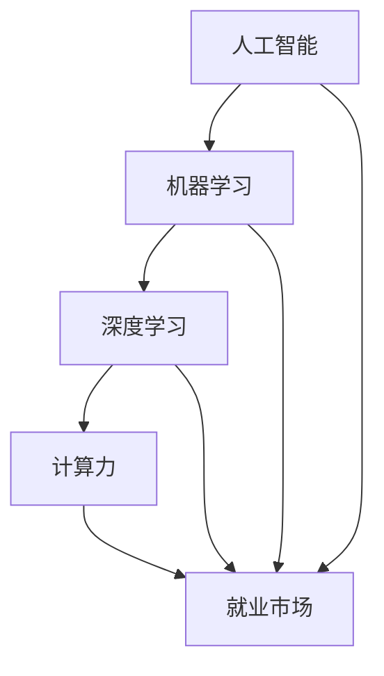
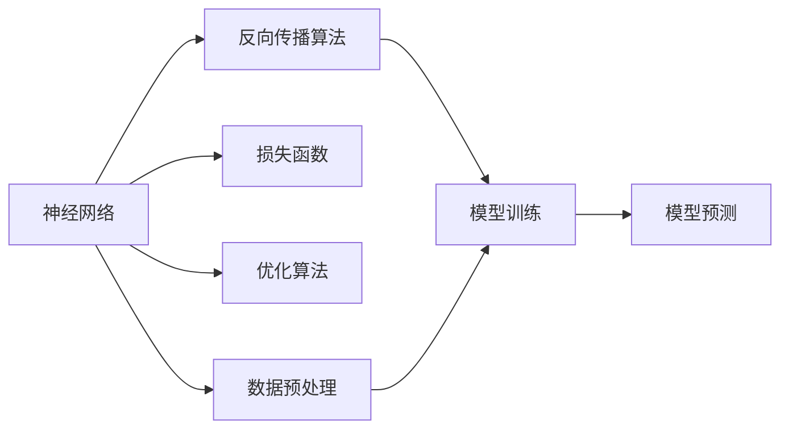

                 

# 人类计算：AI时代的未来就业前景和技能需求

在AI技术的飞速发展下，人类计算正迎来一场革命性的变革。传统基于物理硬件的计算模式正在被基于神经网络和大规模算法的"智能计算"模式所取代。本文将深入探讨AI时代的未来就业前景和所需技能，为希望踏入这一领域的读者提供方向性指引。

## 1. 背景介绍

### 1.1 问题由来

随着人工智能（AI）技术的迅猛发展，人类的计算模式正在发生根本性的变化。传统的基于物理硬件的计算，正逐步被基于神经网络和大规模算法的"智能计算"所取代。AI技术的广泛应用，已经深入到诸多领域，包括自动驾驶、金融风控、医疗诊断、智能客服、智能制造等。与此同时，这些技术的发展也带来了新的就业机遇和挑战。

### 1.2 问题核心关键点

AI技术的应用，使得许多传统行业的工作流程和技能需求发生了深刻变化。例如，自动驾驶取代了驾驶工作，金融风控中的AI辅助决策替代了部分风险评估工作，智能客服减少了人工客服的需求等。这些变化导致了部分传统工作岗位的消失，同时也催生了对新技能的需求。因此，了解AI时代的未来就业前景和所需技能，对于未来的职业规划具有重要意义。

## 2. 核心概念与联系

### 2.1 核心概念概述

为更好地理解AI时代的就业前景和技能需求，本节将介绍几个核心概念：

- **人工智能（AI）**：基于计算机科学和数学的算法和模型，可以模拟和扩展人类智能能力，实现自动化决策和任务执行。
- **机器学习（ML）**：通过数据驱动的算法和模型，使计算机具备学习能力，从而能够从经验中改进性能。
- **深度学习（DL）**：一种基于神经网络的大型机器学习技术，具有强大的模式识别和预测能力。
- **计算力（Computational Power）**：指计算机处理任务的能力，包括CPU、GPU、TPU等硬件资源和算法模型。
- **就业市场**：指不同行业和岗位的供需关系，受技术进步、经济形势等多因素影响。

这些核心概念之间的关系可以通过以下Mermaid流程图来展示：



### 2.2 核心概念原理和架构的 Mermaid 流程图

以下是一些基本的概念原理和架构流程图，用以帮助读者理解AI技术的核心构成：



## 3. 核心算法原理 & 具体操作步骤

### 3.1 算法原理概述

AI时代的就业前景和技能需求，主要由以下因素决定：

1. **技术发展趋势**：AI技术的进步直接影响到特定领域的就业变化。例如，深度学习在计算机视觉领域的普及，使得图像识别和分析岗位需求增加，而传统图像处理岗位则面临缩减。
2. **产业结构调整**：AI技术的广泛应用，要求企业调整业务流程和技术架构，导致某些岗位的需求减少，而对新技能的需求增加。
3. **技能迁移**：AI技术的发展，使得一些传统岗位的技能需求发生变化，而新的岗位又需要全新的技能。因此，技能迁移成为就业转换的重要途径。

### 3.2 算法步骤详解

了解AI时代的就业前景和技能需求，需要从以下几个步骤入手：

1. **调研当前就业市场**：通过数据分析、招聘信息等途径，了解各行业和岗位的现状及未来趋势。
2. **识别技术需求**：识别各行业对AI技术的具体需求，包括技术应用、数据处理、模型开发等。
3. **分析技能差距**：比较当前岗位技能需求与求职者的技能储备，分析技能缺口。
4. **制定学习计划**：根据技能差距，制定系统的学习计划，提升所需技能。
5. **实践和反馈**：通过实践和项目经验，检验学习成果，并根据反馈进行调整。

### 3.3 算法优缺点

基于AI时代的就业前景和技能需求的分析，具有以下优点：

1. **精确性**：通过数据驱动的方法，可以更准确地预测就业趋势和技能需求。
2. **前瞻性**：提前识别技术趋势和市场需求，有助于个人和企业的职业规划。
3. **客观性**：基于大量数据和实证分析，避免了主观判断的偏差。

同时，该方法也存在以下局限性：

1. **数据质量**：就业市场数据的质量和完整性，直接影响到分析结果的准确性。
2. **技术变化快**：AI技术发展迅速，市场需求和技能要求变化快，分析结果可能时效性较短。
3. **个体差异**：不同个体对新技术的接受度和适应能力存在差异，难以一概而论。

### 3.4 算法应用领域

AI时代的就业前景和技能需求分析，主要应用于以下几个领域：

- **教育和培训**：根据就业市场和技术需求的变化，调整教育培训课程，提升未来劳动力市场的技能储备。
- **企业人力资源管理**：通过分析岗位需求和技能缺口，优化招聘策略，提升员工技能匹配度。
- **政策制定**：政府和相关机构可以基于AI就业分析，制定合理的政策引导就业方向，促进经济和社会发展。

## 4. 数学模型和公式 & 详细讲解 & 举例说明

### 4.1 数学模型构建

为了更科学地分析AI时代的就业前景和技能需求，我们需要构建一个数学模型。假设就业市场对AI技术的需求为 $D_{AI}$，当前劳动力市场技能需求为 $D_{\text{cur}}$，技术发展对需求的影响为 $\Delta D$。则就业市场的整体需求变化可以表示为：

$$
D_{\text{total}} = D_{\text{cur}} + \Delta D
$$

### 4.2 公式推导过程

根据以上模型，我们可以进一步推导出技能需求变化率 $\Delta D$ 的表达式。假设技术发展对需求的影响分为直接需求增加 $\Delta D_{\text{incr}}$ 和间接需求变化 $\Delta D_{\text{indir}}$，则有：

$$
\Delta D = \Delta D_{\text{incr}} + \Delta D_{\text{indir}}
$$

其中，直接需求增加 $\Delta D_{\text{incr}}$ 可以根据技术发展速度和影响范围计算得出，间接需求变化 $\Delta D_{\text{indir}}$ 可以通过模型训练和应用数据分析得出。

### 4.3 案例分析与讲解

以图像识别岗位为例，分析AI技术发展对就业前景和技能需求的影响。假设某公司需求图像识别工程师数量为 $N_{\text{cur}}$，AI技术的发展使得需求增加了 $N_{\text{incr}}$，同时图像识别技术在医疗、安防等领域的应用也导致间接需求增加了 $N_{\text{indir}}$。则总体需求变化率为：

$$
\Delta D = N_{\text{incr}} + N_{\text{indir}}
$$

在实际应用中，通过构建具体的数学模型和公式，可以更精确地分析和预测就业市场和技能需求的变化。

## 5. 项目实践：代码实例和详细解释说明

### 5.1 开发环境搭建

在进行AI就业市场分析前，我们需要准备好开发环境。以下是使用Python进行数据分析的环境配置流程：

1. 安装Anaconda：从官网下载并安装Anaconda，用于创建独立的Python环境。

2. 创建并激活虚拟环境：
```bash
conda create -n my_env python=3.8 
conda activate my_env
```

3. 安装Python依赖库：
```bash
pip install pandas numpy matplotlib seaborn
```

完成上述步骤后，即可在`my_env`环境中开始数据分析实践。

### 5.2 源代码详细实现

以下是一个简化的Python代码示例，用于分析AI技术对就业市场的影响。

```python
import pandas as pd
import matplotlib.pyplot as plt

# 加载就业市场数据
data = pd.read_csv('就业市场数据.csv')

# 计算直接需求增加
D_incr = data['AI技术增长率'] * data['当前岗位数量']
data['直接需求变化'] = D_incr

# 计算间接需求变化
D_indir = data['技术应用范围'] * data['技术影响系数']
data['间接需求变化'] = D_indir

# 计算总体需求变化率
D_total = data['直接需求变化'] + data['间接需求变化']

# 可视化需求变化
plt.plot(data['年份'], D_total, label='总体需求变化')
plt.xlabel('年份')
plt.ylabel('就业需求变化率')
plt.legend()
plt.show()
```

### 5.3 代码解读与分析

让我们再详细解读一下关键代码的实现细节：

**就业市场数据**：
- `data['AI技术增长率']`：表示AI技术的增长率。
- `data['当前岗位数量']`：表示当前岗位数量。
- `data['技术应用范围']`：表示AI技术在不同领域的应用范围。
- `data['技术影响系数']`：表示AI技术对就业市场的影响系数。

**需求计算**：
- `D_incr = data['AI技术增长率'] * data['当前岗位数量']`：计算直接需求增加。
- `D_indir = data['技术应用范围'] * data['技术影响系数']`：计算间接需求增加。
- `D_total = D_incr + D_indir`：计算总体需求变化率。

**数据可视化**：
- `plt.plot(data['年份'], D_total, label='总体需求变化')`：绘制需求变化曲线。
- `plt.xlabel('年份')`：设置x轴标签。
- `plt.ylabel('就业需求变化率')`：设置y轴标签。
- `plt.legend()`：添加图例。

## 6. 实际应用场景

### 6.1 教育培训

AI技术的发展，要求教育培训机构及时调整课程设置，培养符合未来需求的新型人才。例如，计算机视觉领域的就业需求增加，培训课程可以引入深度学习、图像处理等课程，提升学生在该领域的竞争力。

### 6.2 企业招聘

企业在招聘新员工时，需要根据AI技术的发展趋势，调整岗位要求和技能需求。例如，对于智能客服岗位，需要招聘具备自然语言处理和机器学习技能的人才，以便更好地应用AI技术提升客服效率和质量。

### 6.3 政府政策制定

政府可以通过AI就业市场分析，制定合理的就业政策，引导劳动力市场的发展方向。例如，针对AI技术对某些岗位的影响，可以出台培训补贴、就业引导等政策，帮助员工顺利过渡到新岗位。

### 6.4 未来应用展望

未来，AI技术的广泛应用将进一步推动就业市场和技能需求的变化。AI技术的不断进步，将带来更多新兴岗位，同时也要求从业者具备更广泛和深入的技能。例如，AI伦理、安全、可解释性等将成为新的热门领域，从业者需要具备相关的知识和技能。

## 7. 工具和资源推荐

### 7.1 学习资源推荐

为帮助读者系统掌握AI时代就业前景和技能需求的知识，推荐以下学习资源：

1. **《人工智能就业市场分析》**：介绍AI技术对就业市场的影响，以及各行业的就业趋势和技能需求。
2. **Coursera《AI与就业市场》课程**：由知名高校和专家开设的AI与就业市场分析课程，系统讲解AI技术对各行业就业的影响。
3. **《深度学习与就业市场》书籍**：详细介绍深度学习技术在各行业的应用，以及所需技能和培训方法。
4. **Kaggle竞赛平台**：参与AI领域的Kaggle竞赛，积累实践经验，提升技能。
5. **GitHub开源项目**：关注和参与开源项目，学习前沿技术和项目开发经验。

### 7.2 开发工具推荐

高效的开发离不开优秀的工具支持。以下是几款用于AI就业市场分析开发的常用工具：

1. **Python**：Python是最流行的AI开发语言，有丰富的库和工具支持，适合数据分析和算法实现。
2. **Jupyter Notebook**：Jupyter Notebook是一个强大的交互式开发环境，适合数据科学和机器学习项目开发。
3. **Scikit-learn**：Scikit-learn是一个流行的Python机器学习库，提供了丰富的算法和工具。
4. **TensorFlow**：TensorFlow是一个强大的开源深度学习框架，支持大规模模型训练和推理。
5. **PyTorch**：PyTorch是一个灵活的深度学习框架，易于使用，支持动态图和静态图模式。

### 7.3 相关论文推荐

了解AI技术对就业市场的影响，需要参考最新的学术论文和研究成果。以下是几篇有代表性的相关论文，推荐阅读：

1. **《AI技术对就业市场的影响》**：分析AI技术对各行业就业市场的影响，提出相应的政策建议。
2. **《深度学习在就业市场中的应用》**：详细介绍深度学习技术在就业市场中的实际应用案例和技能需求。
3. **《机器学习与就业市场分析》**：通过机器学习模型，预测未来就业市场趋势和技能需求。
4. **《AI伦理与就业市场》**：探讨AI伦理对就业市场的影响，提出相应的政策和建议。
5. **《智能计算对就业市场的影响》**：分析智能计算技术对未来就业市场的影响和趋势。

## 8. 总结：未来发展趋势与挑战

### 8.1 总结

本文对AI时代的未来就业前景和技能需求进行了全面系统的介绍。首先阐述了AI技术的发展趋势及其对就业市场的影响，明确了AI技术在各行业的就业前景。其次，从原理到实践，详细讲解了就业市场分析的数学模型和具体步骤，提供了完整的代码实现。同时，本文还广泛探讨了AI技术在教育培训、企业招聘、政府政策制定等多个领域的应用前景，展示了AI技术对未来就业的深远影响。此外，本文精选了AI就业分析的学习资源和工具，力求为读者提供全方位的技术指引。

通过本文的系统梳理，可以看到，AI技术的发展正在深刻改变各行业的就业格局，催生新的就业机会，同时对现有岗位技能需求也提出了新的要求。未来，伴随着AI技术的不断演进，就业市场和技能需求将发生更多变化，从业者需要不断学习和提升，以适应新的职业环境。

### 8.2 未来发展趋势

展望未来，AI时代的就业前景和技能需求将呈现以下几个发展趋势：

1. **技能需求多样化**：AI技术的广泛应用，使得各行业的技能需求变得多样化。例如，数据分析、模型开发、算法优化、系统集成等技能将变得更加重要。
2. **跨学科融合**：AI技术的发展，要求从业者具备跨学科的知识和技能。例如，AI与医疗、教育、金融等领域的融合，需要具备相关领域的知识背景。
3. **终身学习**：AI技术的快速变化，要求从业者具备终身学习的能力，持续更新和提升自己的技能。
4. **人工智能伦理**：随着AI技术的广泛应用，伦理和安全问题将日益凸显。从业者需要具备AI伦理相关的知识和技能，确保AI系统的合规和可信。
5. **数据科学和工程**：数据科学和工程将成为AI领域的关键技能，包括数据清洗、特征工程、模型训练、模型优化等。
6. **智能化决策**：AI技术的应用，将要求从业者具备智能化决策的能力，能够利用数据和算法进行科学决策。

以上趋势凸显了AI时代对技能需求的多样化和复杂化，从业者需要不断学习和提升，才能适应新的职业环境。

### 8.3 面临的挑战

尽管AI技术的发展带来了巨大的机遇，但也面临着诸多挑战：

1. **技术壁垒高**：AI技术涉及深度学习、机器学习、数据科学等多个领域的知识，技术门槛较高。
2. **数据质量差**：AI技术的发展依赖于高质量的数据，但在实际应用中，数据质量和完整性往往参差不齐。
3. **伦理和安全问题**：AI技术的广泛应用，可能带来伦理和安全问题，如数据隐私、算法偏见等。
4. **就业市场不平衡**：AI技术的快速发展，导致就业市场出现不平衡，部分岗位需求增加，部分岗位需求减少。
5. **技能匹配难**：AI技术的发展，要求从业者具备新的技能，但现有的教育体系和培训资源可能无法满足需求。

这些挑战需要在技术、政策、教育等多方面进行协同解决，才能确保AI技术的健康发展。

### 8.4 研究展望

面对AI时代就业前景和技能需求的变化，未来的研究需要在以下几个方面寻求新的突破：

1. **跨学科研究**：推动AI技术与各学科的交叉融合，提升跨学科研究能力。
2. **数据治理**：制定和实施数据治理标准，提升数据质量和完整性。
3. **伦理和安全研究**：加强AI伦理和安全问题的研究，制定相关的政策和规范。
4. **终身学习体系**：建立终身学习体系，提供多样化的学习资源和培训途径。
5. **智能化决策支持**：开发智能化决策支持系统，提升数据驱动的决策能力。
6. **行业标准**：制定行业标准，规范AI技术的应用和从业者的行为。

这些研究方向将推动AI技术的健康发展，为从业者提供更多的职业机会和提升空间。

## 9. 附录：常见问题与解答

**Q1: 如何理解AI技术对就业市场的影响？**

A: AI技术对就业市场的影响是多方面的。一方面，AI技术的应用可以自动化部分重复性、低技能的工作，导致这些岗位的需求减少。另一方面，AI技术的发展也带来了新的就业机会，如算法开发、模型训练、数据科学等岗位。因此，理解和分析AI技术对就业市场的影响，需要综合考虑技术应用的具体场景和岗位变化。

**Q2: 当前AI技能需求有哪些？**

A: 当前AI技能需求主要包括以下几个方面：

1. 深度学习：掌握深度学习算法和框架，如TensorFlow、PyTorch等。
2. 机器学习：熟悉机器学习算法和模型，如决策树、随机森林、支持向量机等。
3. 数据科学：具备数据处理和分析能力，掌握数据清洗、特征工程、数据可视化等技能。
4. 自然语言处理：熟悉自然语言处理技术，掌握分词、命名实体识别、情感分析等技能。
5. 计算机视觉：掌握计算机视觉技术，熟悉图像处理、物体检测、图像分割等技能。
6. 人工智能伦理：具备人工智能伦理相关的知识和技能，确保AI系统的合规和可信。

**Q3: 如何提升AI技能？**

A: 提升AI技能需要从以下几个方面入手：

1. 学习基础知识：系统学习AI相关的基础知识，包括数学、计算机科学、统计学等。
2. 实践项目经验：通过实际项目积累经验，提升技能。
3. 参与培训和课程：参加相关培训和课程，系统学习AI技术和应用。
4. 学习前沿技术：关注AI领域的最新进展，学习前沿技术和应用。
5. 加入社区和交流：加入AI相关的社区和交流平台，与同行交流和学习。

**Q4: AI技术对各行业的就业市场有哪些具体影响？**

A: AI技术对各行业的就业市场影响具体如下：

1. 医疗领域：AI技术在医疗诊断、药物研发等方面应用广泛，需求增加。
2. 金融领域：AI技术在风险评估、客户服务、智能投顾等方面应用广泛，需求增加。
3. 制造业：AI技术在智能制造、质量控制等方面应用广泛，需求增加。
4. 教育领域：AI技术在智能教育、学习分析等方面应用广泛，需求增加。
5. 零售领域：AI技术在客户推荐、库存管理等方面应用广泛，需求增加。

总之，AI技术的发展，将深刻改变各行业的就业市场和技能需求，从业者需要不断学习和提升，以适应新的职业环境。

**Q5: AI技术对未来就业市场的影响有哪些？**

A: AI技术对未来就业市场的影响主要体现在以下几个方面：

1. 新的就业机会：AI技术的发展，将带来新的就业机会，如数据科学家、AI工程师、智能系统设计师等。
2. 岗位技能要求提升：AI技术的应用，将提升各岗位的技能要求，如数据分析、算法优化、模型训练等。
3. 跨领域技能需求增加：AI技术的应用，将使得跨领域技能的需求增加，如AI与医疗、教育、金融等领域的融合。
4. 终身学习成为常态：AI技术的快速发展，要求从业者具备终身学习的能力，持续更新和提升自己的技能。
5. 数据科学和工程成为核心技能：数据科学和工程将成为AI领域的关键技能，包括数据清洗、特征工程、模型训练、模型优化等。
6. 智能化决策支持系统普及：AI技术的应用，将要求从业者具备智能化决策的能力，能够利用数据和算法进行科学决策。

总之，AI技术的发展将深刻改变未来的就业市场和技能需求，从业者需要不断学习和提升，以适应新的职业环境。

