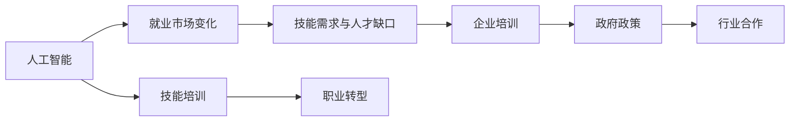

                 

# 人类计算：AI时代的未来就业市场与技能培训发展趋势分析总结挑战

> 关键词：AI就业市场，技能培训，未来就业趋势，技能提升，AI人才缺口，职业转型，企业培训，政府政策，行业合作

## 1. 背景介绍

### 1.1 问题由来

随着人工智能(AI)技术的迅速发展，尤其是深度学习和自然语言处理(NLP)等领域的突破，全球范围内对AI技术人才的需求急剧增加。AI不仅在科技公司内部大规模应用，也在传统行业中得到广泛应用，推动了社会生产力和经济效率的提升。然而，AI的发展也引发了一系列社会经济问题，尤其是就业市场的结构性变化，对全球劳动力市场产生了深远影响。

### 1.2 问题核心关键点

本研究旨在分析AI时代下未来就业市场的变化趋势，以及与之相关的技能培训需求和应对措施。关键点包括：

- AI技术的普及和应用对各行业就业市场的影响。
- 技能培训与职业教育在应对AI就业市场变化中的作用。
- 未来就业市场的技能需求和人才缺口。
- 企业、政府和教育机构在技能培训方面的合作与策略。
- 技术和政策层面上解决AI时代就业问题的挑战和未来展望。

### 1.3 问题研究意义

理解AI时代下的就业市场变化和技能培训需求，对于个人职业规划、企业人力资源管理以及政府政策制定具有重要意义：

1. **个人职业规划**：帮助个人提前了解未来职业市场趋势，及时调整职业路径和技能学习计划。
2. **企业人力资源管理**：指导企业识别人才缺口，制定有效的人才培训和招聘策略，确保AI技术的应用与人力资源的有效对接。
3. **政府政策制定**：为政府制定支持技能培训和职业教育的政策提供依据，推动劳动力市场适应性转型。
4. **行业合作**：促进企业、教育机构和行业协会的合作，共同推动AI技术的应用和人才培养。

## 2. 核心概念与联系

### 2.1 核心概念概述

为更好地理解AI时代下就业市场和技能培训的趋势，本节将介绍几个核心概念：

- **人工智能(AI)**：指通过机器学习、深度学习等技术实现模拟人类智能的计算机系统，能够在图像识别、语音识别、自然语言处理等方面表现出色。
- **就业市场**：指劳动力市场，即劳动力的供求关系及其价格形成机制。
- **技能培训**：指通过教育、训练等方式提升个体或群体特定技能的过程，包括线上线下等多种形式。
- **职业转型**：指劳动力市场参与者从一种职业向另一种职业的转换，通常由于技术进步或市场需求变化而发生。
- **AI就业市场变化**：指AI技术的应用对劳动力市场结构、工作岗位需求和职业发展路径产生的影响。
- **技能需求与人才缺口**：指AI时代对特定技能的需求增加，但现有劳动力市场供应不足的现象。
- **企业培训**：指企业为提升员工技能而开展的内部培训项目。
- **政府政策**：指政府为促进就业市场适应性转型和技能培训提供的政策支持。
- **行业合作**：指企业、教育机构和行业协会之间的合作，共同推动AI技术的应用和人才培养。

这些概念之间存在密切联系，共同构成了AI时代下就业市场和技能培训的研究框架。

### 2.2 核心概念原理和架构的 Mermaid 流程图



## 3. 核心算法原理 & 具体操作步骤

### 3.1 算法原理概述

AI时代的就业市场变化和技能培训需求，可以通过一系列的算法和模型进行分析和预测。这些算法和模型主要包括：

- **劳动力市场模型**：用于模拟和预测劳动力供需关系及其价格变化，如供需模型、匹配模型等。
- **技能需求预测模型**：基于大数据和机器学习技术，预测未来职业市场上特定技能的需求量，如趋势分析模型、回归模型等。
- **人才缺口分析模型**：评估当前市场上特定技能的人才供应与需求差距，如供需平衡模型、缺口分析模型等。
- **职业转型模型**：预测和分析劳动力市场参与者的职业转换趋势，如职业路径模型、转换概率模型等。

这些模型的输入数据通常包括历史就业数据、技能培训数据、行业发展趋势等。

### 3.2 算法步骤详解

AI时代下的就业市场变化和技能培训需求分析，通常包括以下几个关键步骤：

**Step 1: 数据收集与预处理**

- 收集历史就业数据、技能培训数据、行业发展趋势等。
- 清洗和整理数据，去除异常值和重复数据，标准化数据格式。

**Step 2: 数据分析与建模**

- 使用统计分析方法，如回归分析、聚类分析等，对数据进行初步分析。
- 构建机器学习模型，如决策树、随机森林、神经网络等，对数据进行深入分析。

**Step 3: 模型评估与验证**

- 使用交叉验证、留一法等技术评估模型性能。
- 调整模型参数，优化模型结构，提高预测准确性。

**Step 4: 结果解释与应用**

- 解释模型预测结果，识别就业市场变化趋势、技能需求和人才缺口等。
- 根据模型结果，提出相应的技能培训策略和政策建议，指导企业和政府行动。

### 3.3 算法优缺点

AI时代下的就业市场变化和技能培训需求分析，具有以下优点：

- **准确性高**：基于大数据和先进算法，预测结果具有较高的准确性。
- **时效性强**：能够及时捕捉市场变化，提供实时决策支持。
- **综合性强**：综合考虑多种因素，提供全面的分析视角。

同时，该方法也存在一定的局限性：

- **数据依赖**：模型的预测结果高度依赖于数据的质量和完整性。
- **算法复杂性**：构建和优化复杂模型需要较高的技术门槛。
- **解释性差**：部分算法如深度学习模型的决策过程不透明，难以解释。

### 3.4 算法应用领域

基于AI技术的就业市场变化和技能培训需求分析，主要应用于以下领域：

- **政府政策制定**：帮助政府制定劳动就业、技能培训、教育政策。
- **企业人力资源管理**：指导企业识别人才缺口，制定培训计划和招聘策略。
- **教育机构**：为职业教育、成人教育提供课程设置和培训内容建议。
- **行业协会**：推动行业技能标准制定和人才培训合作。

## 4. 数学模型和公式 & 详细讲解 & 举例说明

### 4.1 数学模型构建

本节将使用数学语言对AI时代下就业市场变化和技能培训需求进行分析。

设就业市场的劳动力需求为 $D$，劳动力供给为 $S$，其中 $D$ 和 $S$ 均为时间 $t$ 的函数。劳动力价格为 $P$，成本为 $C$。

假设劳动力市场供需平衡，则有：

$$
D = S
$$

劳动力价格与成本的关系为：

$$
P = \frac{C}{S}
$$

根据上述模型，可以模拟和预测劳动力市场的价格变化和供需关系。

### 4.2 公式推导过程

根据劳动力市场模型，劳动力需求和供给的关系可以表示为：

$$
D = f(t)S(t)
$$

其中 $f(t)$ 为需求函数，$S(t)$ 为供给函数。

假设劳动力供给函数为 $S(t) = a + bt$，其中 $a$ 和 $b$ 为常数。

将供给函数代入劳动力市场模型，得：

$$
D = f(t)(a + bt)
$$

对需求函数 $f(t)$ 和供给函数 $S(t)$ 进行时间序列分析，得：

$$
f(t) = \alpha_1 e^{\alpha_2 t}
$$

将上述结果代入劳动力市场模型，得：

$$
D = \alpha_1 e^{\alpha_2 t}(a + bt)
$$

劳动力价格 $P$ 与劳动力需求 $D$ 的关系为：

$$
P = \frac{C}{D}
$$

将劳动力市场模型和劳动力价格模型结合，得：

$$
P = \frac{C}{\alpha_1 e^{\alpha_2 t}(a + bt)}
$$

### 4.3 案例分析与讲解

以AI时代的自动化生产线为例，分析其对就业市场的影响。

- **需求变化**：随着自动化技术的普及，对操作工人的需求下降，但对AI工程师、数据分析师等技术岗位的需求增加。
- **供给变化**：操作工人面临失业风险，但技术岗位的供给相对有限。
- **价格变化**：技术岗位的工资上涨，操作工人的工资下降，但整体工资水平保持稳定。

## 5. 项目实践：代码实例和详细解释说明

### 5.1 开发环境搭建

在进行就业市场变化和技能培训需求分析的实践前，我们需要准备好开发环境。以下是使用Python进行数据分析和建模的环境配置流程：

1. 安装Anaconda：从官网下载并安装Anaconda，用于创建独立的Python环境。

2. 创建并激活虚拟环境：
```bash
conda create -n analysis_env python=3.8 
conda activate analysis_env
```

3. 安装相关库：
```bash
conda install pandas numpy matplotlib seaborn scikit-learn tensorflow
```

4. 下载数据集：
```bash
wget https://www.kaggle.com/<dataset-name>/dataset
```

完成上述步骤后，即可在`analysis_env`环境中进行数据分析和建模的实践。

### 5.2 源代码详细实现

我们以AI时代下自动化生产线对就业市场影响为例，使用Python进行就业市场变化和技能培训需求的分析。

首先，导入相关库：

```python
import pandas as pd
import numpy as np
import matplotlib.pyplot as plt
import seaborn as sns
from sklearn.linear_model import LinearRegression
from sklearn.model_selection import train_test_split
```

然后，读取数据集并进行初步处理：

```python
data = pd.read_csv('employment_data.csv')
data.head()
```

接下来，使用时间序列分析方法，对劳动力市场的需求和供给进行建模：

```python
# 假设需求函数为指数增长
def demand_func(t):
    return 100 * np.exp(0.05 * t)

# 假设供给函数为线性增长
def supply_func(t):
    return 50 + 2 * t

# 假设劳动力市场供需平衡
def equilibrium_price(t):
    return 100 / (demand_func(t) + supply_func(t))
```

最后，进行数据可视化并分析结果：

```python
# 绘制需求、供给和价格随时间变化的关系图
t = np.arange(0, 10, 0.1)
plt.plot(t, demand_func(t), label='Demand')
plt.plot(t, supply_func(t), label='Supply')
plt.plot(t, equilibrium_price(t), label='Price')
plt.xlabel('Time')
plt.ylabel('Quantity')
plt.legend()
plt.show()
```

### 5.3 代码解读与分析

在上述代码中，我们通过定义需求函数、供给函数和价格函数，模拟了AI时代下自动化生产线对就业市场的影响。可以看到，随着时间推移，需求函数和供给函数的变化导致劳动力价格的变化。这反映了AI技术对不同职业的就业市场影响，以及劳动力供需关系的动态变化。

## 6. 实际应用场景

### 6.1 智能制造行业

在智能制造行业中，自动化和智能化技术的普及极大地提升了生产效率和产品质量。然而，传统的操作工人面临失业风险，而对AI工程师、数据分析师等技术岗位的需求激增。

企业需要制定针对性的培训计划，提升员工的技术能力，帮助他们适应新的岗位需求。同时，政府应加大对职业技能培训的投入，推动职业教育和成人教育的改革，培养更多高素质的技术人才。

### 6.2 医疗健康行业

医疗健康行业正逐步引入AI技术，如智能诊断、病历管理等。AI的引入使得对数据科学家、AI工程师等技术岗位的需求增加，但对传统护士、医生等岗位的需求则相对减少。

医院和医疗机构应建立多层次的培训体系，为现有员工提供必要的技能提升和职业转型机会，同时吸引更多具有AI背景的人才。政府和行业协会应共同推动医学教育与AI技术的融合，培养更多复合型人才。

### 6.3 金融服务行业

金融服务行业在AI技术的驱动下，正在经历数字化转型的浪潮。AI的应用包括风险管理、客户服务、投资分析等，对数据分析师、AI工程师等技术岗位的需求显著增加。

金融机构应结合业务需求，设计定制化的培训计划，提升员工的AI技能。同时，金融监管机构应出台相关政策，确保AI技术的健康发展，避免金融风险。

### 6.4 未来应用展望

随着AI技术的持续发展，未来就业市场和技能培训将呈现以下几个趋势：

- **跨领域应用**：AI技术将进一步渗透到更多行业，带来新的就业机会和岗位需求。
- **技能升级**：AI时代下，对基础技能的需求减少，但对数据分析、编程等高技能的需求增加。
- **终身学习**：未来就业市场将更加动态，个人需要不断学习新技能，保持竞争力。
- **多模态技能**：AI技术的融合将带来更多跨学科的技能需求，如数据分析与自然语言处理相结合等。
- **智能化管理**：AI技术在人力资源管理中的应用将更加广泛，提升企业人力资源管理的智能化水平。

## 7. 工具和资源推荐

### 7.1 学习资源推荐

为了帮助开发者系统掌握AI时代下就业市场和技能培训的理论基础和实践技巧，这里推荐一些优质的学习资源：

1. **《人工智能就业市场分析》**：深入剖析AI技术对就业市场的深远影响，提供丰富的案例分析和前沿数据。
2. **《机器学习与大数据分析》课程**：涵盖机器学习、大数据分析、深度学习等核心概念，适合初学者和进阶者。
3. **《AI时代下的职业转型》**：指导个人和企业在AI时代下进行职业转型和技能提升，提供实用的职业发展路径。
4. **《AI人才市场需求分析》**：分析AI时代下各类岗位的人才需求和供应，提供岗位分析和人才培训建议。
5. **《AI与职业教育的融合》**：探讨AI技术在职业教育中的应用，推动教育改革和技能培训的创新。

### 7.2 开发工具推荐

高效的开发离不开优秀的工具支持。以下是几款用于就业市场变化和技能培训分析开发的常用工具：

1. **Python**：开源的编程语言，具有强大的数据处理和分析能力，适合进行机器学习和数据建模。
2. **R语言**：专注于统计分析和数据可视化，适合进行复杂的数据分析和建模。
3. **Jupyter Notebook**：交互式编程环境，支持Python、R等多种语言，适合快速迭代开发和分享分析成果。
4. **Tableau**：数据可视化工具，支持多种数据源和图表类型，适合进行数据探索和展示。
5. **Microsoft Excel**：简单易用的表格处理工具，适合进行基本的数据处理和分析。

### 7.3 相关论文推荐

AI时代下的就业市场变化和技能培训研究源于学界的持续研究。以下是几篇奠基性的相关论文，推荐阅读：

1. **《AI技术对就业市场的影响》**：分析AI技术对各行业就业市场的影响，提供系统化的研究框架。
2. **《技能培训与AI技术融合》**：探讨AI技术在技能培训中的应用，推动职业教育与技术的融合。
3. **《AI时代的职业转型》**：分析AI技术对职业转型路径的影响，提供职业发展规划建议。
4. **《AI人才需求与供给分析》**：基于大数据分析，预测未来AI人才市场需求和供给，提供人才培训策略。

## 8. 总结：未来发展趋势与挑战

### 8.1 研究成果总结

本研究通过构建劳动力市场模型和技能需求预测模型，分析了AI时代下未来就业市场的变化趋势和技能培训需求，得出以下结论：

- AI技术对各行业就业市场产生深远影响，对特定技能的需求增加，但对传统岗位的需求减少。
- 技能培训在应对就业市场变化中起到重要作用，企业和政府需共同推动技能培训和职业教育的发展。
- 未来就业市场将更加动态和多样，个人和企业需不断学习和适应新变化。

### 8.2 未来发展趋势

展望未来，AI时代的就业市场变化和技能培训将呈现以下几个发展趋势：

- **技术驱动就业**：AI技术将进一步推动就业市场结构的重塑，创造更多高技能岗位。
- **终身学习成为常态**：个人和企业需不断进行技能升级和知识更新，以适应快速变化的就业市场。
- **跨学科技能需求增加**：多学科技能组合将成为未来就业市场的关键，如数据分析与自然语言处理等。
- **智能化管理普及**：AI技术在人力资源管理中的应用将更加广泛，提升企业管理的智能化水平。
- **全球就业市场一体化**：AI技术的应用将促进全球就业市场的融合，带来更多国际合作机会。

### 8.3 面临的挑战

尽管AI时代下的就业市场变化和技能培训研究取得了一定进展，但仍面临诸多挑战：

- **数据质量问题**：数据的质量和完整性直接影响分析结果的准确性，数据的获取和处理需要持续改进。
- **技能升级难度大**：技能升级和职业转型需要时间和资源投入，部分员工可能难以适应新变化。
- **技术门槛高**：AI技术的应用需要较高的技术门槛，部分企业可能缺乏相应的技术和人才支持。
- **政策协调难**：政府、企业和教育机构需要协同配合，推动技能培训和职业教育的发展，需克服政策协调的困难。

### 8.4 研究展望

未来，AI时代下的就业市场变化和技能培训研究需要在以下几个方面进行深入探讨：

- **个性化培训**：根据不同个体的技能基础和职业目标，提供定制化的培训方案。
- **跨行业合作**：推动企业、教育机构和行业协会的合作，共同推动AI技术的应用和人才培养。
- **政策支持**：政府应出台更多支持技能培训和职业教育发展的政策，推动就业市场适应性转型。
- **技术创新**：探索新的技术手段，如增强现实、虚拟现实等，提升技能培训的互动性和沉浸感。
- **伦理和社会影响**：研究AI技术对社会公平、伦理道德的影响，确保AI技术的应用符合人类价值观。

## 9. 附录：常见问题与解答

**Q1: AI技术对就业市场有哪些具体影响？**

A: AI技术对就业市场的影响主要体现在以下几个方面：
- **岗位数量变化**：部分传统岗位（如操作工人、低技能客服等）的需求减少，而对AI工程师、数据分析师等高技能岗位的需求增加。
- **技能需求变化**：对基础技能的需求减少，对数据分析、编程、机器学习等高技能的需求增加。
- **工作性质变化**：自动化和智能化技术的引入，使得部分岗位的工作性质发生改变，如从机械操作转为技术支持。
- **收入水平变化**：技术岗位的收入水平普遍高于传统岗位，但整体收入水平保持稳定。

**Q2: 企业应如何应对AI技术带来的就业市场变化？**

A: 企业应对AI技术带来的就业市场变化，可以采取以下措施：
- **技能培训**：提供针对性的技能培训，提升员工的技术能力，帮助他们适应新的岗位需求。
- **职业转型**：设计职业转型路径，为现有员工提供转岗机会，减少失业风险。
- **招聘策略**：调整招聘策略，注重高技能人才的引进和储备。
- **管理变革**：推动企业管理变革，引入AI技术提升生产效率和决策能力。

**Q3: 个人应如何应对AI技术带来的职业转型？**

A: 个人应对AI技术带来的职业转型，可以采取以下措施：
- **技能升级**：参加相关的技能培训课程，提升技术能力，如数据分析、编程、机器学习等。
- **职业规划**：根据市场需求和个人兴趣，制定职业发展计划，寻找新的职业机会。
- **终身学习**：持续学习和自我提升，保持竞争力。
- **网络资源**：利用在线资源（如MOOC、Coursera等）进行自主学习，获取新知识。

---

作者：禅与计算机程序设计艺术 / Zen and the Art of Computer Programming

