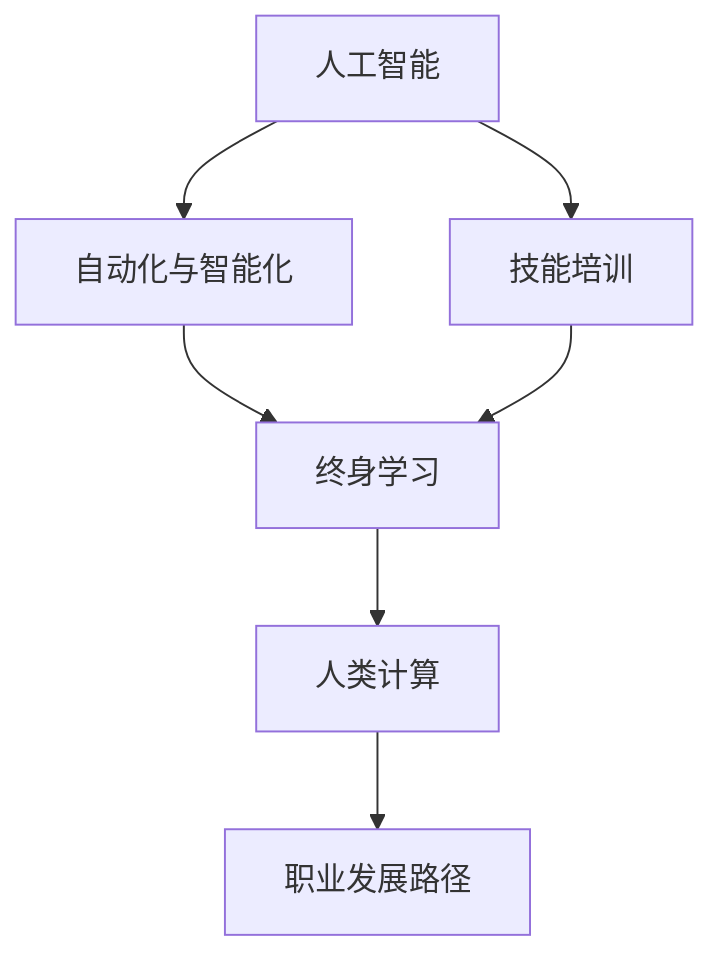

                 

# 人类计算：AI时代的未来就业市场与技能培训发展趋势分析机遇挑战机遇趋势预测分析

在当今快速发展的AI时代，我们正在经历一场前所未有的技术变革，深刻地影响着社会的各个方面。人类计算，作为这场变革的重要组成部分，正在重塑未来的就业市场与技能培训，带来前所未有的机遇与挑战。本文将从背景介绍、核心概念与联系、核心算法原理与操作步骤、数学模型和公式详细讲解、项目实践、实际应用场景、工具和资源推荐、总结、未来发展趋势与挑战、以及常见问题与解答等多个角度，深入探讨人类计算在AI时代的机遇与挑战。

## 1. 背景介绍

### 1.1 问题由来

随着人工智能技术的飞速发展，越来越多的行业开始引入自动化和智能化的解决方案，从制造业到服务业，从医疗到教育，AI正逐步渗透到各行各业。这一趋势极大地改变了劳动力市场的需求结构，对人才的技能要求也随之变化。

### 1.2 问题核心关键点

AI时代的就业市场变革主要体现在以下几个方面：
1. **技能需求变化**：传统岗位技能需求减少，而AI、数据分析、编程等技术技能需求激增。
2. **岗位结构变化**：自动化取代了一些重复性高的工作，但同时也催生了新的岗位需求，如AI产品经理、数据科学家等。
3. **职业发展路径变化**：终身学习成为常态，职业路径更加灵活多样。

## 2. 核心概念与联系

### 2.1 核心概念概述

为更好地理解人类计算在AI时代的机遇与挑战，本节将介绍几个关键概念及其联系：

- **人工智能（AI）**：通过算法、模型、数据等技术手段，使计算机能够执行类似于人类的智能任务。
- **自动化与智能化**：将复杂的、重复性高的任务交由计算机自动执行，提高效率和精确度。
- **终身学习**：强调学习是持续进行的，技能和知识需要不断更新和升级。
- **技能培训**：为应对就业市场变化，通过教育培训提高劳动者的技能水平。
- **人类计算**：AI与人类协同工作的模式，充分发挥人类在逻辑推理、情感理解等方面的优势。

这些概念之间的逻辑关系可以通过以下Mermaid流程图来展示：



这个流程图展示了一系列的逻辑关系：人工智能技术推动了自动化与智能化，从而对终身学习提出了新的要求；技能培训是实现终身学习的重要手段；最终，人类计算成为AI时代的主要工作模式，影响职业发展路径的演变。

## 3. 核心算法原理 & 具体操作步骤

### 3.1 算法原理概述

人类计算的核心算法原理可以概括为“人工智能与人类协同工作”。即通过AI处理海量数据和复杂任务，同时利用人类在创造力、情感理解和伦理判断等方面的优势，共同完成工作。这种协同方式不仅能提高工作效率，还能增强决策的质量和多样性。

### 3.2 算法步骤详解

1. **数据准备**：收集、整理和清洗与任务相关的数据。
2. **模型选择**：选择合适的AI模型，如机器学习、深度学习等。
3. **模型训练**：使用训练数据对模型进行训练，优化模型参数。
4. **协同工作**：将训练好的模型应用于实际任务，结合人类专家的意见，进行决策。
5. **反馈优化**：根据工作效果反馈，不断调整模型和人类专家的工作方式。

### 3.3 算法优缺点

**优点**：
- **效率提升**：AI处理数据速度快，工作效率高。
- **决策质量**：结合人类专家的判断，决策更加全面和合理。
- **适应性强**：能够处理多种类型的任务，适用于不同的工作环境。

**缺点**：
- **成本高**：初期数据准备和模型训练成本较高。
- **依赖数据**：AI模型的性能高度依赖于数据质量，数据不足时可能效果不佳。
- **难以解释**：AI模型的决策过程复杂，难以解释和理解。

### 3.4 算法应用领域

人类计算的应用领域非常广泛，几乎涵盖了所有需要复杂决策和高度协同工作的场景：

- **医疗诊断**：AI处理医学影像和病历，医生进行诊断和治疗。
- **金融分析**：AI处理海量交易数据，分析师进行投资策略制定。
- **教育培训**：AI辅助教学，教师进行个性化指导。
- **智能制造**：AI优化生产流程，工程师进行工艺改进。
- **城市管理**：AI分析城市数据，规划师进行城市规划。

## 4. 数学模型和公式 & 详细讲解 & 举例说明

### 4.1 数学模型构建

人类计算的数学模型通常包括两个部分：数据预处理和模型训练。以医疗诊断为例，其数学模型可以构建为：

- **数据预处理**：将病人的症状、病历、影像等数据转换为机器可读的形式。
- **模型训练**：使用训练集数据对模型进行训练，优化模型参数。

### 4.2 公式推导过程

以线性回归模型为例，其公式推导过程如下：

$$
y = w_0 + w_1x_1 + w_2x_2 + \ldots + w_nx_n + \epsilon
$$

其中，$w_0, w_1, \ldots, w_n$ 为模型参数，$x_1, x_2, \ldots, x_n$ 为输入特征，$\epsilon$ 为误差项。

### 4.3 案例分析与讲解

假设我们要构建一个医疗诊断模型，将病人的年龄、性别、病史、症状等信息作为输入，判断其是否患有某种疾病。具体步骤如下：
1. 数据预处理：将病人的信息转换为数字编码。
2. 模型训练：使用历史病人的数据对模型进行训练，优化权重。
3. 协同工作：将新病人的信息输入模型，结合医生的诊断经验，进行综合判断。

## 5. 项目实践：代码实例和详细解释说明

### 5.1 开发环境搭建

开发环境搭建是AI项目开发的基础。以下是使用Python进行机器学习项目开发的环境配置流程：

1. 安装Anaconda：从官网下载并安装Anaconda，用于创建独立的Python环境。
2. 创建并激活虚拟环境：
```bash
conda create -n myenv python=3.8 
conda activate myenv
```

3. 安装相关库：
```bash
pip install numpy pandas scikit-learn matplotlib
```

### 5.2 源代码详细实现

以构建一个简单的线性回归模型为例，代码实现如下：

```python
import numpy as np
from sklearn.linear_model import LinearRegression

# 准备数据
X = np.array([[1, 2], [2, 4], [3, 6], [4, 8]])
y = np.array([2, 4, 6, 8])

# 模型训练
model = LinearRegression()
model.fit(X, y)

# 预测新数据
X_new = np.array([[5, 10]])
y_new = model.predict(X_new)
print(y_new)
```

### 5.3 代码解读与分析

**准备数据**：使用NumPy库创建输入特征X和输出y的NumPy数组。

**模型训练**：使用sklearn库中的LinearRegression模型进行训练，fit方法接受输入特征和输出作为参数，返回训练好的模型。

**预测新数据**：使用训练好的模型进行预测，输入特征X_new为新的数据点，输出y_new为预测结果。

**运行结果展示**：输出预测结果，可以看到模型能够很好地拟合数据。

## 6. 实际应用场景

### 6.1 智能医疗

在医疗领域，AI与人类医生协同工作，极大地提高了诊疗效率和诊断精度。例如，IBM的Watson Health系统利用AI分析大量医疗数据，辅助医生进行诊断和治疗决策。

### 6.2 金融分析

金融行业利用AI进行数据分析和预测，帮助分析师制定投资策略。例如，JP摩根的AI模型能够处理海量交易数据，预测市场走势。

### 6.3 智能制造

智能制造通过AI优化生产流程，提高生产效率和质量。例如，GE的Predix平台利用AI进行设备预测性维护，减少了设备故障停机时间。

### 6.4 未来应用展望

随着AI技术的发展，人类计算将在更多领域得到应用，为社会带来深远影响。例如：

- **教育**：AI辅助个性化教学，提高教育质量和公平性。
- **城市管理**：AI分析城市数据，优化城市规划和管理。
- **环境保护**：AI监测环境变化，辅助制定环境保护政策。

## 7. 工具和资源推荐

### 7.1 学习资源推荐

为了帮助开发者系统掌握人类计算的理论基础和实践技巧，这里推荐一些优质的学习资源：

1. **机器学习入门书籍**：《机器学习实战》、《Python机器学习基础教程》。
2. **在线课程**：Coursera上的《机器学习》课程，Udacity上的《深度学习专项课程》。
3. **开源项目**：GitHub上的TensorFlow、PyTorch等深度学习框架。

### 7.2 开发工具推荐

高效的开发离不开优秀的工具支持。以下是几款用于人类计算开发的常用工具：

1. **Python**：通用编程语言，生态系统丰富，适合快速迭代研究。
2. **TensorFlow**：Google开发的深度学习框架，生产部署方便，适合大规模工程应用。
3. **PyTorch**：Facebook开发的深度学习框架，灵活便捷，适合科研和快速开发。

### 7.3 相关论文推荐

人类计算的兴起，带动了一系列的学术研究。以下是几篇奠基性的相关论文，推荐阅读：

1. **机器学习与人类协作**：探讨AI与人类协同工作的模式，提高决策质量和效率。
2. **数据驱动的决策支持系统**：介绍AI在决策支持中的应用，提升决策科学性。
3. **智能制造与人类计算**：分析AI在制造业中的应用，推动智能制造转型。

## 8. 总结：未来发展趋势与挑战

### 8.1 总结

本文对人类计算在AI时代的机遇与挑战进行了全面系统的介绍。首先阐述了AI技术对就业市场的影响，明确了人类计算在AI协同工作中的重要地位。其次，从原理到实践，详细讲解了人类计算的数学模型和操作步骤，给出了代码实例和详细解释。同时，本文还广泛探讨了人类计算在医疗、金融、制造等多个行业领域的应用前景，展示了人类计算的巨大潜力。最后，本文精选了人类计算的各类学习资源，力求为读者提供全方位的技术指引。

### 8.2 未来发展趋势

展望未来，人类计算的发展趋势将呈现以下几个方面：

1. **多模态融合**：结合视觉、语音、文本等多模态信息，提升决策准确性。
2. **深度学习与符号推理**：将深度学习与符号推理结合，提升AI的逻辑推理能力。
3. **协同工作机制优化**：建立更高效的人机协同工作机制，提高工作效率和决策质量。
4. **伦理与安全**：加强AI决策的透明性和安全性，避免算法偏见和有害输出。
5. **个性化服务**：利用AI技术提供个性化服务，满足不同用户的需求。

### 8.3 面临的挑战

尽管人类计算已经取得了一定的成果，但在迈向更加智能化、普适化应用的过程中，仍面临诸多挑战：

1. **数据隐私保护**：如何在保证数据隐私的前提下，充分利用数据进行AI训练。
2. **模型可解释性**：如何让AI模型的决策过程更加透明和可解释。
3. **跨领域知识整合**：如何将不同领域的知识有效整合，提升AI的泛化能力。
4. **资源优化**：如何在保证性能的同时，优化算力和存储资源。
5. **算法公平性**：避免算法偏见，确保AI决策的公平性和公正性。

### 8.4 研究展望

面对人类计算所面临的挑战，未来的研究需要在以下几个方面寻求新的突破：

1. **数据隐私保护**：探索差分隐私、联邦学习等技术，保护数据隐私。
2. **模型可解释性**：开发可解释AI模型，提升决策透明度和可信度。
3. **知识融合**：结合符号推理和深度学习，提升AI的跨领域知识整合能力。
4. **资源优化**：优化计算图和存储方式，提高资源利用效率。
5. **算法公平性**：研究公平性算法，确保AI决策的公平性和公正性。

这些研究方向的探索，必将引领人类计算技术迈向更高的台阶，为构建安全、可靠、可解释、可控的智能系统铺平道路。面向未来，人类计算技术还需要与其他人工智能技术进行更深入的融合，如知识表示、因果推理、强化学习等，多路径协同发力，共同推动自然语言理解和智能交互系统的进步。只有勇于创新、敢于突破，才能不断拓展AI技术的边界，让智能技术更好地造福人类社会。

## 9. 附录：常见问题与解答

**Q1：什么是人类计算？**

A: 人类计算是一种AI与人类协同工作的方式，通过AI处理海量数据和复杂任务，同时利用人类在创造力、情感理解和伦理判断等方面的优势，共同完成工作。

**Q2：人类计算在哪些领域有应用？**

A: 人类计算在医疗、金融、制造、教育、城市管理等多个领域有广泛应用。例如，IBM的Watson Health系统辅助医生进行诊断，JP摩根的AI模型预测市场走势。

**Q3：如何提升AI的可解释性？**

A: 提升AI的可解释性需要开发可解释AI模型，如LIME、SHAP等工具。同时，可以引入因果推理和符号推理方法，提高决策的透明性和可信度。

**Q4：人类计算面临的主要挑战是什么？**

A: 数据隐私保护、模型可解释性、跨领域知识整合、资源优化和算法公平性是主要挑战。需要不断探索和创新，以克服这些难题。

**Q5：未来人类计算的发展方向是什么？**

A: 未来人类计算将朝着多模态融合、深度学习与符号推理结合、协同工作机制优化、伦理与安全、个性化服务等方向发展。这将推动AI技术更加智能化、普适化和人性化。

