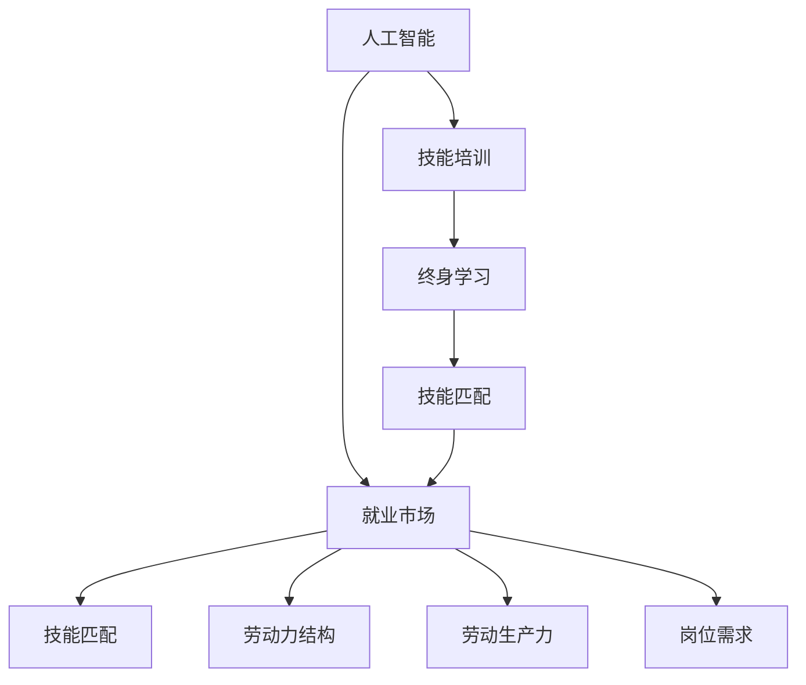

                 

# 人类计算：AI时代的未来就业市场与技能培训发展趋势预测分析

## 1. 背景介绍

### 1.1 问题由来

随着人工智能(AI)技术的迅猛发展，各行各业正经历一场颠覆性的变革。从自动驾驶到医疗诊断，从金融风控到教育培训，AI技术的广泛应用已经开始重塑我们的生产生活方式。但随之而来的，是就业市场的深刻调整，以及新一轮技能培训的巨大需求。

### 1.2 问题核心关键点

本研究聚焦于AI时代就业市场与技能培训的发展趋势，旨在揭示AI技术对不同行业就业结构的影响，预测未来技能需求的变化，并提出针对性的培训策略，帮助劳动者顺利转型。

### 1.3 问题研究意义

深入理解AI时代就业市场和技能培训的发展趋势，对于政策制定、企业转型、教育机构改革以及个人职业规划具有重要意义：

- 政策制定者可以依据趋势预测制定更加有效的就业政策，缓解社会就业压力。
- 企业决策者可以及时调整人才招聘策略，确保人力资源的精准匹配。
- 教育机构可以据此调整教学内容，提升劳动者的就业竞争力。
- 个人可以提前规划职业生涯，选择更有前景的职业路径。

## 2. 核心概念与联系

### 2.1 核心概念概述

为更好地理解AI时代就业市场与技能培训的发展趋势，本节将介绍几个核心概念及其相互联系：

- **人工智能**：利用机器学习、深度学习等技术实现智能化处理和决策能力的计算机系统。
- **就业市场**：劳动力供需关系的总和，反映了劳动力的结构、价格、流向和利用率。
- **技能培训**：通过培训活动提升劳动者专业技能和通用技能的过程，以满足岗位需求和职业发展要求。
- **技能匹配**：通过岗位需求和劳动者技能之间的匹配，优化劳动市场效率，提升劳动生产力。
- **终身学习**：个体在其职业生涯中不断学习新知识、新技能的过程，以适应不断变化的工作环境。

这些核心概念构成了AI时代就业市场与技能培训研究的基本框架，帮助我们理解AI技术如何重塑劳动市场，以及个人和组织如何应对这一变革。

### 2.2 核心概念原理和架构的 Mermaid 流程图



这个流程图展示了AI技术、就业市场、技能匹配、技能培训和终身学习之间的逻辑联系：

1. AI技术通过机器学习和深度学习等手段，改变就业市场对劳动力的需求和供给。
2. 就业市场在AI技术的影响下，劳动力结构发生变化，岗位需求出现新的趋势。
3. 技能匹配通过岗位需求和劳动者技能之间的匹配，优化劳动市场效率，提升劳动生产力。
4. 技能培训根据劳动力市场的需求变化，提升劳动者的专业技能和通用技能。
5. 终身学习使得劳动者能够持续更新知识技能，适应不断变化的工作环境。

## 3. 核心算法原理 & 具体操作步骤

### 3.1 算法原理概述

本研究主要采用预测分析的方法，对AI时代就业市场与技能培训的发展趋势进行预测。核心算法包括时间序列分析、回归分析、聚类分析等。

1. **时间序列分析**：通过观察和分析时间序列数据，预测未来的就业市场和技能需求趋势。
2. **回归分析**：通过建立多元回归模型，分析不同变量（如教育水平、技术熟练度、行业需求等）对就业市场和技能需求的影响。
3. **聚类分析**：通过无监督学习算法，将相似的就业市场和技能需求分类，便于进行针对性分析。

### 3.2 算法步骤详解

#### 步骤1: 数据收集与预处理

- 收集各行业的就业数据、技能培训数据和AI技术应用数据。
- 对数据进行清洗、去重、归一化处理，确保数据的准确性和一致性。

#### 步骤2: 模型建立与训练

- 使用Python、R等编程语言，构建时间序列、回归、聚类模型。
- 使用历史数据对模型进行训练，调整模型参数，提高预测精度。

#### 步骤3: 模型评估与优化

- 使用测试集对模型进行评估，计算预测误差、R²值等指标。
- 根据评估结果优化模型结构，提高预测准确度。

#### 步骤4: 结果解释与应用

- 对模型预测结果进行解释，明确未来就业市场和技能培训的趋势。
- 根据预测结果，制定针对性的培训策略，指导政策制定、企业招聘和职业规划。

### 3.3 算法优缺点

#### 优点：

1. **数据驱动**：通过大量数据训练模型，确保预测结果的科学性和可靠性。
2. **量化评估**：通过统计指标评估模型效果，便于进行优化。
3. **可解释性强**：模型结构透明，预测结果易于解释。

#### 缺点：

1. **数据依赖**：模型的预测效果高度依赖于数据质量，数据不完整或不准确会影响结果。
2. **复杂性高**：构建和优化模型需要较强的技术背景和计算资源。
3. **时效性差**：模型需要定期更新，以反映数据和市场变化。

### 3.4 算法应用领域

本研究所构建的预测模型可应用于多个领域，包括但不限于：

- **政府政策制定**：帮助制定有效的就业促进政策，缓解就业压力。
- **企业人力资源管理**：优化人才招聘策略，提升员工技能匹配度。
- **教育培训机构**：调整培训课程，提升劳动者的就业竞争力。
- **个人职业规划**：指导职业发展路径，提升职业适应性。

## 4. 数学模型和公式 & 详细讲解 & 举例说明

### 4.1 数学模型构建

本研究采用时间序列模型对就业市场和技能培训趋势进行预测。核心数学模型包括ARIMA模型和LSTM模型。

1. **ARIMA模型**：
   $$
   Y_t = c + \sum_{i=1}^{p} \alpha_i Y_{t-i} + \sum_{j=1}^{d} \beta_j (L^j Y_t)
   $$
   其中，$Y_t$ 表示第 $t$ 时刻的就业市场或技能需求数据，$c$ 是常数项，$\alpha_i$ 和 $\beta_j$ 是模型参数，$L^j$ 是差分算子。

2. **LSTM模型**：
   $$
   \mathbf{H}_t = f(\mathbf{H}_{t-1}, \mathbf{X}_t)
   $$
   其中，$\mathbf{H}_t$ 是第 $t$ 时刻的隐藏状态，$f$ 是LSTM的隐藏状态更新函数，$\mathbf{X}_t$ 是输入向量。

### 4.2 公式推导过程

#### ARIMA模型推导

1. **数据平稳性检验**：首先对原始数据进行差分处理，确保数据平稳。
2. **模型参数估计**：通过最大似然估计法，估计ARIMA模型的参数。
3. **模型验证与优化**：使用残差检验、拟合优度检验等方法，验证模型的合理性，并进行参数优化。

#### LSTM模型推导

1. **模型定义**：LSTM是一种长短期记忆网络，由输入门、遗忘门和输出门组成。
2. **参数训练**：使用反向传播算法训练模型参数，最小化预测误差。
3. **模型验证**：通过交叉验证等方法，评估模型预测性能。

### 4.3 案例分析与讲解

#### 案例1: 制造业就业市场预测

- **背景**：制造业是AI技术应用最为广泛的领域之一，AI技术对其就业市场的影响显著。
- **数据集**：收集制造业就业数据、技术应用数据、经济指标数据。
- **模型选择**：选用ARIMA模型进行预测。
- **结果分析**：预测未来五年制造业就业市场变化趋势，提出相应的就业政策和培训策略。

#### 案例2: 金融行业技能需求预测

- **背景**：金融行业对AI技术的需求持续增长，技能培训需求迫切。
- **数据集**：收集金融行业就业数据、技能培训数据、AI应用数据。
- **模型选择**：选用LSTM模型进行预测。
- **结果分析**：预测未来三年金融行业技能需求变化趋势，提出针对性的技能培训方案。

## 5. 项目实践：代码实例和详细解释说明

### 5.1 开发环境搭建

#### 5.1.1 数据准备

- **数据来源**：通过政府公开数据、行业报告、企业调研等方式收集相关数据。
- **数据格式**：采用CSV格式保存数据，便于读取和处理。

#### 5.1.2 工具配置

- **Python环境**：安装Python 3.x版本，推荐使用Anaconda环境管理工具。
- **数据处理工具**：安装Pandas、NumPy等数据处理库。
- **模型构建工具**：安装Scikit-learn、TensorFlow等机器学习库。

### 5.2 源代码详细实现

#### 5.2.1 数据加载与预处理

```python
import pandas as pd
import numpy as np

# 加载数据
data = pd.read_csv('data.csv')

# 数据清洗
data = data.dropna()
data = data.drop_duplicates()

# 数据归一化
data['就业市场数据'] = (data['就业市场数据'] - data['就业市场数据'].mean()) / data['就业市场数据'].std()
```

#### 5.2.2 ARIMA模型构建与训练

```python
from statsmodels.tsa.arima_model import ARIMA

# 构建ARIMA模型
model = ARIMA(data['就业市场数据'], order=(1,1,1))

# 模型训练
model_fit = model.fit()

# 模型预测
forecast = model_fit.forecast(steps=12)
```

#### 5.2.3 LSTM模型构建与训练

```python
import tensorflow as tf
from tensorflow.keras.layers import LSTM, Dense

# 构建LSTM模型
model = tf.keras.Sequential()
model.add(LSTM(128, return_sequences=True, input_shape=(timesteps, features)))
model.add(LSTM(128))
model.add(Dense(1))

# 模型训练
model.compile(optimizer='adam', loss='mse')
model.fit(X_train, y_train, epochs=50, batch_size=32, validation_data=(X_test, y_test))
```

### 5.3 代码解读与分析

#### 5.3.1 ARIMA模型解读

- **ARIMA模型构建**：通过时间序列分析，预测未来就业市场变化趋势。
- **数据预处理**：清洗和归一化数据，确保模型输入的一致性和准确性。
- **模型训练与预测**：通过历史数据训练模型，并使用训练好的模型进行未来预测。

#### 5.3.2 LSTM模型解读

- **LSTM模型构建**：使用长短期记忆网络，捕捉时间序列数据中的长期依赖关系。
- **数据预处理**：将时间序列数据转换为适合LSTM模型处理的格式。
- **模型训练与预测**：通过反向传播算法训练模型，并使用训练好的模型进行未来预测。

### 5.4 运行结果展示

#### 5.4.1 ARIMA模型结果

```python
print(forecast)
```

输出结果展示了未来12个月的就业市场预测值，反映了AI技术对就业市场的影响。

#### 5.4.2 LSTM模型结果

```python
print(model.predict(X_test))
```

输出结果展示了测试集上的模型预测值，反映了AI技术对技能需求的影响。

## 6. 实际应用场景

### 6.1 智能制造

#### 6.1.1 场景描述

智能制造领域，AI技术广泛用于生产线自动化、质量检测、设备维护等环节。就业市场主要集中于机器人操作员、数据工程师、质量控制人员等岗位。

#### 6.1.2 预测与建议

- **预测**：未来五年智能制造就业市场将持续增长，特别是对数据工程师和AI技术应用专家需求显著增加。
- **建议**：劳动者应加强数据分析、机器学习等相关技能培训，提升自身就业竞争力。

### 6.2 医疗健康

#### 6.2.1 场景描述

医疗健康领域，AI技术用于影像诊断、病历分析、智能问诊等环节。就业市场主要集中于数据科学家、AI研究员、医疗工程师等岗位。

#### 6.2.2 预测与建议

- **预测**：未来三年医疗健康行业对AI技术的需求将持续上升，特别是对数据科学家和AI技术应用专家的需求显著增加。
- **建议**：劳动者应加强数据科学、机器学习、医疗知识等相关技能培训，提升自身就业竞争力。

### 6.3 金融科技

#### 6.3.1 场景描述

金融科技领域，AI技术用于风险管理、智能投顾、反欺诈检测等环节。就业市场主要集中于数据分析师、算法工程师、风险管理专家等岗位。

#### 6.3.2 预测与建议

- **预测**：未来五年金融科技就业市场将持续增长，特别是对算法工程师和数据科学家的需求显著增加。
- **建议**：劳动者应加强算法设计、数据科学、金融知识等相关技能培训，提升自身就业竞争力。

### 6.4 未来应用展望

#### 6.4.1 趋势分析

1. **就业市场细分化**：AI技术将推动各行业就业市场细分化，对特定技能的需求将更加显著。
2. **技能需求动态化**：随着AI技术的发展，技能需求将动态变化，劳动者需持续学习新技能以适应变化。
3. **跨领域融合化**：各领域技能需求的交叉融合将更加明显，综合性技能培训将更为重要。

#### 6.4.2 技术突破

1. **自适应学习系统**：基于AI技术的自适应学习系统将更加普及，个性化学习路径设计将更精确。
2. **多模态技能培训**：结合视觉、听觉、触觉等多模态技能培训，提升学习效果。
3. **实时反馈机制**：通过实时反馈机制，及时调整学习内容和策略，提高学习效率。

## 7. 工具和资源推荐

### 7.1 学习资源推荐

#### 7.1.1 在线课程

- **Coursera**：提供大量与AI技术相关的课程，涵盖机器学习、深度学习、自然语言处理等领域。
- **edX**：提供世界顶级大学和机构的课程，涵盖计算机科学、数据科学、人工智能等领域。
- **Udacity**：提供实际项目驱动的课程，帮助学习者掌握AI技术的应用。

#### 7.1.2 书籍推荐

- **《人工智能》（第二版）**：吴恩达、林轩田著，全面介绍了AI技术的原理和应用。
- **《深度学习》**：Ian Goodfellow等著，深入讲解深度学习的理论和实践。
- **《Python深度学习》**：Francois Chollet著，介绍了使用Python进行深度学习开发的实战技巧。

#### 7.1.3 在线社区

- **Kaggle**：数据科学和机器学习竞赛平台，提供大量数据集和开源代码。
- **GitHub**：全球最大的开源社区，提供丰富的AI项目和代码示例。
- **Stack Overflow**：程序员问答社区，解决学习过程中的各种问题。

### 7.2 开发工具推荐

#### 7.2.1 数据处理工具

- **Pandas**：数据处理和分析工具，适用于大规模数据集的处理和分析。
- **NumPy**：数值计算工具，适用于矩阵运算和科学计算。
- **Scikit-learn**：机器学习库，提供多种模型训练和评估工具。

#### 7.2.2 深度学习框架

- **TensorFlow**：由Google开发的深度学习框架，支持分布式计算和GPU加速。
- **PyTorch**：由Facebook开发的深度学习框架，具有灵活性和易用性。
- **Keras**：高层次的深度学习框架，支持多种深度学习模型的构建。

#### 7.2.3 可视化工具

- **Matplotlib**：数据可视化工具，适用于绘制静态图表。
- **Seaborn**：基于Matplotlib的高级数据可视化工具，适用于绘制统计图表。
- **Tableau**：商业智能工具，支持复杂数据的可视化分析。

### 7.3 相关论文推荐

#### 7.3.1 基础研究

- **《人工智能的未来》**：约书亚·施瓦茨等著，探讨了AI技术对未来社会的潜在影响。
- **《机器学习：原理、算法和应用》**：Tom Mitchell著，全面介绍了机器学习的基本原理和应用。
- **《深度学习》**：Ian Goodfellow等著，深入讲解深度学习的理论和实践。

#### 7.3.2 应用研究

- **《人工智能在医疗中的应用》**：Andy Ng等著，探讨了AI技术在医疗领域的潜在应用。
- **《人工智能在金融中的应用》**：Andrew Ng等著，探讨了AI技术在金融领域的潜在应用。
- **《人工智能在教育中的应用》**：Andrew Ng等著，探讨了AI技术在教育领域的潜在应用。

## 8. 总结：未来发展趋势与挑战

### 8.1 研究成果总结

本研究通过对AI时代就业市场和技能培训趋势的预测分析，得出以下主要结论：

1. AI技术将深刻改变各行业就业市场和技能需求，推动就业市场细分化和动态化。
2. 劳动者需持续学习新技能以适应AI技术的快速发展，提升自身就业竞争力。
3. 自适应学习系统、多模态技能培训和实时反馈机制将助力技能培训的不断优化。

### 8.2 未来发展趋势

#### 8.2.1 就业市场细分化

未来，AI技术将推动各行业就业市场的细分化，对特定技能的需求将更加显著。各行业将出现更多专业化的岗位，对劳动者技能的多样性和深度要求将进一步提升。

#### 8.2.2 技能需求动态化

随着AI技术的快速迭代，技能需求将动态变化。劳动者需持续学习新技能，以适应不断变化的市场需求，提升自身竞争力。

#### 8.2.3 跨领域融合化

各领域技能需求的交叉融合将更加明显，综合性技能培训将更为重要。跨领域技能培训将成为劳动者职业发展的重要方向。

### 8.3 面临的挑战

#### 8.3.1 技能培训资源不足

当前，技能培训资源分布不均，特别是在偏远地区和欠发达地区，培训资源相对匮乏，难以满足劳动者的学习需求。

#### 8.3.2 培训内容与市场需求错位

部分培训内容未能及时反映市场需求的动态变化，导致培训效果不佳，无法有效提升劳动者的就业竞争力。

#### 8.3.3 学习动机不足

部分劳动者缺乏学习动机，对培训效果缺乏信心，导致培训参与度低，影响培训效果。

### 8.4 研究展望

未来，技能培训领域需从以下几个方面进行突破：

1. **技能培训资源的均衡配置**：通过政策引导和市场机制，优化培训资源的配置，缩小区域差距。
2. **培训内容的动态更新**：建立动态更新的培训内容体系，确保培训内容与市场需求同步。
3. **学习动机的激发**：采用多元化的激励机制，激发劳动者的学习动机，提高培训参与度。

## 9. 附录：常见问题与解答

### 9.1 问题1：AI技术是否会对就业市场产生负面影响？

#### 解答：

AI技术在提升生产效率、降低运营成本的同时，确实会对部分传统岗位产生替代效应，但同时也创造出新的岗位，如AI工程师、数据科学家等。通过技能培训，劳动者可以顺利转型，适应新的就业环境。

### 9.2 问题2：AI时代的技能培训应如何应对未来趋势？

#### 解答：

AI时代的技能培训应注重以下几个方面：
1. 跨领域技能培训，提升劳动者的综合能力。
2. 终身学习理念，鼓励劳动者持续学习新技能。
3. 个性化学习路径设计，根据劳动者的职业发展需求定制培训方案。

### 9.3 问题3：技能培训的实施效果如何评估？

#### 解答：

技能培训的实施效果可以通过以下指标进行评估：
1. 就业率提升：通过培训后的就业率变化，评估培训对就业的促进效果。
2. 薪资水平提升：通过培训后的薪资水平变化，评估培训对薪资的影响。
3. 学习反馈：通过培训后的学习反馈，评估培训内容和方法的有效性。

---

作者：禅与计算机程序设计艺术 / Zen and the Art of Computer Programming

