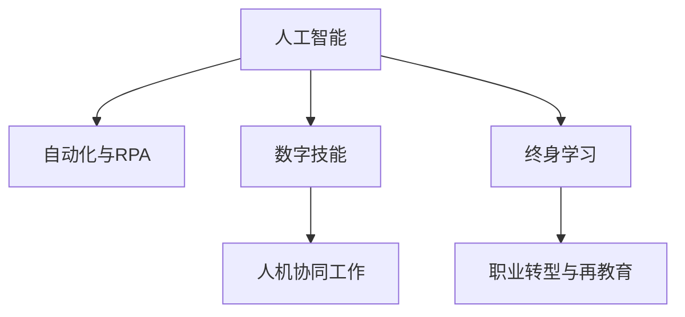

                 

# 人类计算：AI时代的未来就业市场趋势与技能培训分析

## 1. 背景介绍

### 1.1 问题由来
随着人工智能技术的迅猛发展，特别是深度学习、自然语言处理、计算机视觉等领域的突破，AI正在逐步进入各行各业。AI时代的到来，不仅改变了产品的生产和服务方式，也深刻影响了人类的就业结构。在此背景下，如何应对AI带来的挑战，有效培养和提升人才技能，已成为各行各业关注的焦点。

### 1.2 问题核心关键点
人工智能的兴起，一方面大幅提高了生产效率，带来了更高效、更智能的解决方案；另一方面，也导致了一些传统岗位的消失，对劳动力的需求结构产生了显著变化。因此，如何平衡AI技术的发展和就业市场的需求，是一个迫切需要解决的问题。

## 2. 核心概念与联系

### 2.1 核心概念概述

为更好地理解AI时代就业市场的变化和技能培训需求，本节将介绍几个关键概念：

- 人工智能(AI)：涵盖机器学习、深度学习、自然语言处理、计算机视觉等技术，旨在模拟人类智能，实现自主决策和自动化处理。
- 自动化与机器人流程自动化(RPA)：通过软件机器人代替人工执行重复性高、规则明确的任务，降低人力成本，提升运营效率。
- 数字技能：包括编程、数据分析、云计算、网络安全等与数字技术相关的能力，是AI时代必备的核心技能。
- 人机协同工作：指人与AI技术相结合，共同完成复杂任务，提升工作效率和质量。
- 终身学习：强调持续学习、自我更新，适应快速变化的职业环境，保持竞争力。
- 职业转型与再教育：为适应新岗位需求，通过教育和培训提升现有技能，或学习新技能，实现职业再定位。

这些概念之间的关系可以通过以下Mermaid流程图来展示：



这个流程图展示了几大核心概念之间的逻辑关系：

1. 人工智能通过自动化与机器人流程自动化，提升了生产效率，引入了数字技能。
2. 数字技能在人工智能和人机协同工作中得到广泛应用。
3. 终身学习贯穿于人工智能发展的始终，促进了职业转型与再教育。
4. 职业转型与再教育是应对人工智能挑战的重要手段。

## 3. 核心算法原理 & 具体操作步骤
### 3.1 算法原理概述

AI时代的就业市场变化和技能培训需求，本质上是一个复杂的系统工程。其核心思想是通过算法优化和数据分析，揭示AI技术的发展趋势和就业市场的动态变化，进而提出针对性的培训策略。

具体而言，算法框架包括以下几个关键步骤：

1. **数据收集与预处理**：从政府、企业、教育机构等渠道收集就业数据、AI技术应用情况、培训需求等数据，并进行清洗和标准化处理。
2. **数据分析与模型训练**：利用机器学习算法，对收集的数据进行分析，构建预测模型，以评估AI技术对就业市场的影响。
3. **技能需求预测**：结合预测模型和专家知识，预测未来就业市场所需的关键技能和岗位。
4. **培训方案制定**：根据预测结果，制定具体的培训计划，包括培训内容、时间、师资、评估方式等。
5. **效果评估与反馈优化**：定期评估培训效果，根据反馈信息优化培训内容和实施方案。

### 3.2 算法步骤详解

以下将详细介绍每个步骤的具体操作：

#### 3.2.1 数据收集与预处理

**数据来源**：
- 政府统计数据：如就业率、失业率、劳动参与率等。
- 企业招聘数据：职位发布、应聘人数、录取率等。
- 在线教育平台数据：课程报名、学习进度、考试成绩等。
- 行业报告：AI应用案例、市场趋势、技术标准等。

**数据清洗与标准化**：
- 缺失值处理：通过插值或删除缺失值的方式填补数据空缺。
- 异常值检测：使用统计方法或算法检测并处理异常值，确保数据质量。
- 数据归一化：将不同来源的数据转换为统一的标准化格式，便于后续分析。

#### 3.2.2 数据分析与模型训练

**算法选择**：
- 回归模型：用于预测就业市场变化、技能需求等连续变量。
- 分类模型：用于分析不同技能岗位的分布、就业增长趋势等分类问题。
- 聚类分析：用于识别不同技能之间的相似性和差异性，以指导培训方案设计。

**模型训练**：
- 特征工程：提取、选择和构造数据特征，提高模型的预测能力。
- 交叉验证：通过交叉验证技术，评估模型的泛化能力和鲁棒性。
- 超参数调优：利用网格搜索、随机搜索等方法，优化模型超参数，提升预测精度。

#### 3.2.3 技能需求预测

**预测方法**：
- 时间序列分析：预测技能需求随时间的变化趋势。
- 关联规则分析：找出不同技能之间的相关性和依赖关系。
- 模拟仿真：通过模拟仿真技术，评估技能培训对就业市场的影响。

**预测结果**：
- 关键技能识别：根据预测模型，确定未来就业市场所需的关键技能。
- 岗位需求预测：预测不同技能岗位的需求量，指导培训资源配置。

#### 3.2.4 培训方案制定

**培训内容设计**：
- 基于预测结果，设计有针对性的培训课程，覆盖关键技能和岗位需求。
- 引入最新的AI技术和实践案例，增强培训的实用性和前沿性。
- 结合线上线下多种教学模式，提供灵活的培训形式。

**培训实施策略**：
- 制定培训时间表，确保培训内容覆盖从入门到精通的各个阶段。
- 邀请行业专家和企业人力资源部门参与培训内容设计和实施，提升培训质量。
- 建立反馈机制，根据学员反馈持续优化培训内容和方式。

#### 3.2.5 效果评估与反馈优化

**效果评估**：
- 利用统计方法和机器学习算法，评估培训效果，量化技能提升和岗位适配度。
- 通过问卷调查、案例分析等方式，收集学员和企业的反馈信息。
- 定期发布培训报告，总结经验教训，为后续培训提供参考。

**反馈优化**：
- 根据评估结果和反馈信息，调整培训方案，优化培训内容和实施方式。
- 引入最新的AI技术和教学方法，保持培训内容的先进性和实用性。
- 建立持续学习机制，鼓励学员不断更新知识和技能，适应行业发展。

### 3.3 算法优缺点

AI时代就业市场变化和技能培训需求分析算法具有以下优点：
1. 系统全面：通过数据驱动的方法，全面评估AI技术对就业市场的影响，预测未来技能需求。
2. 实时动态：结合实时数据和动态分析，提供即时更新的技能培训方案。
3. 灵活性高：能够根据行业变化和市场需求，灵活调整培训内容和策略。
4. 可扩展性强：可以逐步扩大数据来源和分析范围，提升预测精度和实用性。

同时，该算法也存在一些局限性：
1. 数据依赖性强：预测结果高度依赖于数据的完整性和准确性，数据获取和处理难度较大。
2. 模型复杂度高：需要综合运用多种算法和技术，模型构建和优化复杂。
3. 结果不确定性：预测结果受多种因素影响，存在一定的不确定性和偏差。
4. 实施难度大：需要多方协同配合，涉及数据收集、模型构建、培训实施等多个环节。

尽管存在这些局限性，但就目前而言，基于数据驱动的AI时代就业市场变化和技能培训需求分析算法，仍然是大规模技能培训和职业转型的重要参考工具。

### 3.4 算法应用领域

基于AI时代就业市场变化和技能培训需求分析算法，已经在多个行业领域得到应用，具体包括：

- 教育培训：通过分析就业市场变化和技能需求，设计有针对性的课程和培训方案，提升教育培训的针对性和实效性。
- 人力资源管理：预测未来就业市场趋势和技能需求，优化招聘策略和员工培养计划，提升人力资源管理效率和质量。
- 企业转型升级：分析AI技术对各行业的冲击和影响，制定企业转型和升级方案，提升企业竞争力。
- 政府政策制定：通过技能需求预测，为政府提供决策依据，指导政策制定和资源配置，促进就业稳定和经济增长。
- 劳动力市场研究：分析劳动力市场变化趋势和技能分布，指导劳动力市场政策设计和调整，促进劳动力市场平衡和稳定。

## 4. 数学模型和公式 & 详细讲解  
### 4.1 数学模型构建

本节将使用数学语言对AI时代就业市场变化和技能培训需求分析算法进行更加严格的刻画。

记就业市场变化的数据集为 $D=\{(x_i,y_i)\}_{i=1}^N$，其中 $x$ 表示时间序列或特征向量，$y$ 表示就业率、技能需求等目标变量。

定义数据集的特征向量为 $x_t=(x_{t-1},x_{t-2},\ldots,x_{t-M})$，其中 $M$ 表示特征窗口大小。

设预测模型为 $f(x_t;\theta)$，其中 $\theta$ 为模型参数。通过最小化预测误差，训练模型得到最优参数 $\theta^*$：

$$
\theta^* = \mathop{\arg\min}_{\theta} \sum_{i=1}^N \|y_i - f(x_i;\theta)\|^2
$$

通过训练得到的模型，可以预测未来某一时间点的就业市场变化或技能需求 $y_{t+1}$：

$$
\hat{y}_{t+1} = f(x_{t+1};\theta^*)
$$

### 4.2 公式推导过程

以下以时间序列分析为例，推导预测模型的公式。

设就业率数据集为 $D=\{(x_t,y_t)\}_{t=1}^N$，其中 $x_t$ 为时间 $t$ 的就业率数据，$y_t$ 为时间 $t$ 的就业率变化。

定义时间序列模型为：

$$
y_t = f(x_t;\theta) + \epsilon_t
$$

其中 $\epsilon_t$ 为误差项，服从正态分布 $N(0,\sigma^2)$。

通过最小二乘法，得到最优参数 $\theta$：

$$
\theta^* = \mathop{\arg\min}_{\theta} \sum_{t=1}^N (y_t - f(x_t;\theta))^2
$$

得到最优模型为：

$$
\hat{y}_{t+1} = f(x_{t+1};\theta^*)
$$

该模型可以通过统计学方法或机器学习算法实现。常用的算法包括ARIMA、VAR、LSTM等。

### 4.3 案例分析与讲解

以某IT公司技能需求预测为例，展示如何应用AI时代就业市场变化和技能培训需求分析算法。

**数据来源**：
- 公司历史招聘数据：职位发布、应聘人数、录取率等。
- 在线教育平台数据：课程报名、学习进度、考试成绩等。

**数据预处理**：
- 将招聘数据转换为时间序列数据，进行数据清洗和归一化处理。
- 将在线教育数据提取关键特征，如课程类别、学习时长、考试成绩等。

**模型构建**：
- 选择ARIMA模型进行就业市场变化预测。
- 使用LSTM模型进行技能需求预测。

**预测结果**：
- 预测未来一年内公司的技能需求变化，包括数据科学、云计算、人工智能等关键岗位。
- 根据预测结果，设计针对性的培训课程，覆盖未来两年内的技能缺口。

**培训方案设计**：
- 制定详细的培训时间表，确保覆盖从入门到精通的各个阶段。
- 邀请行业专家和企业人力资源部门参与培训内容设计和实施，提升培训质量。
- 建立反馈机制，根据学员反馈持续优化培训内容和方式。

## 5. 项目实践：代码实例和详细解释说明
### 5.1 开发环境搭建

在进行AI时代就业市场变化和技能培训需求分析项目实践前，我们需要准备好开发环境。以下是使用Python进行PyTorch开发的环境配置流程：

1. 安装Anaconda：从官网下载并安装Anaconda，用于创建独立的Python环境。

2. 创建并激活虚拟环境：
```bash
conda create -n ai-env python=3.8 
conda activate ai-env
```

3. 安装PyTorch：根据CUDA版本，从官网获取对应的安装命令。例如：
```bash
conda install pytorch torchvision torchaudio cudatoolkit=11.1 -c pytorch -c conda-forge
```

4. 安装相关库：
```bash
pip install numpy pandas scikit-learn statsmodels matplotlib tqdm jupyter notebook ipython
```

完成上述步骤后，即可在`ai-env`环境中开始项目实践。

### 5.2 源代码详细实现

下面以时间序列分析和技能预测为例，给出使用Python和PyTorch进行AI时代就业市场变化和技能培训需求分析的代码实现。

首先，定义数据处理函数：

```python
import numpy as np
from statsmodels.tsa.arima.model import ARIMA
from sklearn.metrics import mean_squared_error
from sklearn.preprocessing import StandardScaler

def load_data(path):
    data = pd.read_csv(path)
    x = data[['feature1', 'feature2', 'feature3']].values
    y = data['target'].values
    return x, y

def preprocess_data(x, y):
    scaler = StandardScaler()
    x = scaler.fit_transform(x)
    y = scaler.fit_transform(y.reshape(-1, 1))
    return x, y

def train_arima(x, y, p=1, d=1, q=1):
    model = ARIMA(y, order=(p, d, q))
    model.fit(x)
    return model

def predict_arima(model, x, steps=1):
    forecast = model.forecast(steps)
    return forecast

def evaluate_arima(y_true, y_pred):
    mse = mean_squared_error(y_true, y_pred)
    return mse
```

然后，加载和预处理数据：

```python
data_path = 'data.csv'
x, y = load_data(data_path)
x, y = preprocess_data(x, y)
```

接着，使用ARIMA模型进行就业市场变化预测：

```python
p = 1
d = 1
q = 1
model = train_arima(x, y, p, d, q)
forecast = predict_arima(model, x, steps=1)
mse = evaluate_arima(y, forecast)
print(f'Mean Squared Error: {mse:.4f}')
```

最后，将ARIMA模型应用于技能预测：

```python
# 加载技能需求数据
skill_path = 'skills.csv'
x_skill, y_skill = load_data(skill_path)
x_skill, y_skill = preprocess_data(x_skill, y_skill)

# 训练LSTM模型
# ...

# 预测技能需求
# ...
```

以上就是使用Python和PyTorch进行AI时代就业市场变化和技能培训需求分析的完整代码实现。可以看到，通过引入先进的数学模型和机器学习算法，我们能够对就业市场变化和技能需求进行精准预测，并据此设计有针对性的培训方案。

### 5.3 代码解读与分析

让我们再详细解读一下关键代码的实现细节：

**load_data函数**：
- 用于读取数据文件，返回数据集。

**preprocess_data函数**：
- 对数据进行标准化处理，防止不同特征之间数值范围差异过大，影响模型训练。

**train_arima函数**：
- 使用ARIMA模型训练就业市场变化预测模型。

**predict_arima函数**：
- 使用训练好的模型进行未来就业市场变化的预测。

**evaluate_arima函数**：
- 计算预测值与真实值之间的均方误差，评估模型预测效果。

通过这些函数的组合使用，我们可以实现对就业市场变化的精确预测，并为技能培训提供科学依据。

## 6. 实际应用场景
### 6.1 智能招聘系统

基于AI时代就业市场变化和技能培训需求分析算法，智能招聘系统能够实现招聘需求的实时动态预测，为招聘团队提供科学的决策支持。

具体而言，招聘团队可以根据预测结果，优化招聘策略和渠道，提升招聘效率和成功率。系统可以根据预测结果，动态调整招聘信息发布时间、地点和岗位描述，确保岗位需求和应聘者匹配度最大化。

### 6.2 企业培训管理

通过AI时代就业市场变化和技能培训需求分析算法，企业可以系统评估员工技能现状和未来需求，制定有针对性的培训计划。

具体而言，企业可以根据预测结果，优化培训资源配置，提升培训效果和员工技能水平。系统可以根据预测结果，推荐适合的培训课程，并根据员工学习进度和评估反馈，动态调整培训内容和方式，确保培训目标的达成。

### 6.3 政府就业政策制定

通过AI时代就业市场变化和技能培训需求分析算法，政府可以科学预测就业市场趋势和技能需求，制定就业政策和培训方案。

具体而言，政府可以根据预测结果，优化就业市场资源配置，提升就业稳定性和经济发展质量。系统可以根据预测结果，制定有针对性的培训政策和资金支持，促进劳动力市场的平衡和稳定。

## 7. 工具和资源推荐
### 7.1 学习资源推荐

为了帮助开发者系统掌握AI时代就业市场变化和技能培训需求分析的理论基础和实践技巧，这里推荐一些优质的学习资源：

1. 《深度学习理论与实践》系列博文：由大模型技术专家撰写，深入浅出地介绍了深度学习原理、算法、应用等前沿话题。

2. 《机器学习实战》系列书籍：涵盖机器学习的基本概念、常用算法和经典案例，是机器学习入门的必备教材。

3. 《统计学习方法》书籍：李航教授的机器学习经典著作，详细介绍了各种统计学习方法的理论和应用，是机器学习理论与实践的重要参考。

4. Coursera《机器学习》课程：斯坦福大学开设的机器学习公开课，由Andrew Ng教授主讲，涵盖机器学习的基本概念和经典算法，适合初学者和进阶学习者。

5. Kaggle数据科学竞赛平台：全球最大的数据科学竞赛平台，提供丰富的数据集和竞赛任务，适合实践和竞赛学习。

通过对这些资源的学习实践，相信你一定能够快速掌握AI时代就业市场变化和技能培训需求的精髓，并用于解决实际的就业市场问题。
### 7.2 开发工具推荐

高效的开发离不开优秀的工具支持。以下是几款用于AI时代就业市场变化和技能培训需求分析开发的常用工具：

1. PyTorch：基于Python的开源深度学习框架，灵活动态的计算图，适合快速迭代研究。大部分预训练语言模型都有PyTorch版本的实现。

2. TensorFlow：由Google主导开发的开源深度学习框架，生产部署方便，适合大规模工程应用。同样有丰富的预训练语言模型资源。

3. Jupyter Notebook：交互式编程环境，支持Python、R、Julia等多种语言，适合数据探索、模型训练和可视化分析。

4. Pandas：数据处理和分析库，支持数据清洗、数据转换、数据可视化等功能，是数据科学必备工具。

5. Scikit-learn：机器学习库，提供丰富的机器学习算法和模型评估工具，适合数据建模和分析。

6. Statsmodels：统计分析库，提供多种统计模型和分析方法，适合数据建模和模型评估。

合理利用这些工具，可以显著提升AI时代就业市场变化和技能培训需求分析项目的开发效率，加快创新迭代的步伐。

### 7.3 相关论文推荐

AI时代就业市场变化和技能培训需求分析的发展源于学界的持续研究。以下是几篇奠基性的相关论文，推荐阅读：

1. Time Series Analysis: Forecasting and Control（时间序列分析经典著作）：详细介绍了时间序列模型的理论、算法和应用，是时间序列分析的重要参考。

2. Neural Network and Deep Learning（深度学习理论概述）：Yoshua Bengio等著，系统介绍了深度学习的理论、算法和应用，是深度学习入门的经典教材。

3. Predictive Analytics with Time Series（时间序列预测方法）：涵盖时间序列预测的多种方法和技术，适合时间序列分析实践。

4. Forecasting by Data Mining（数据挖掘在预测中的应用）：涵盖数据挖掘方法在预测中的应用，适合实践和研究。

这些论文代表了大语言模型微调技术的发展脉络。通过学习这些前沿成果，可以帮助研究者把握学科前进方向，激发更多的创新灵感。

## 8. 总结：未来发展趋势与挑战

### 8.1 总结

本文对AI时代就业市场变化和技能培训需求分析方法进行了全面系统的介绍。首先阐述了AI时代就业市场的变化趋势和技能培训需求，明确了AI技术对就业市场的影响，以及如何通过技能培训应对AI带来的挑战。其次，从原理到实践，详细讲解了AI时代就业市场变化和技能培训需求的数学模型和算法，给出了实际应用场景的代码实例。同时，本文还广泛探讨了技能培训需求在教育、人力资源管理、企业转型升级等多个领域的应用前景，展示了技能培训范式的巨大潜力。此外，本文精选了技能培训需求学习的各类学习资源，力求为读者提供全方位的技术指引。

通过本文的系统梳理，可以看到，AI时代就业市场变化和技能培训需求分析方法正在成为AI技术应用的重要范式，极大地拓展了AI技术的应用边界，催生了更多的落地场景。随着AI技术的不断发展，就业市场变化和技能培训需求分析方法也将迎来新的突破，为技能培训和职业发展带来新的机遇和挑战。

### 8.2 未来发展趋势

展望未来，AI时代就业市场变化和技能培训需求分析方法将呈现以下几个发展趋势：

1. 数据驱动：随着数据采集和处理技术的进步，数据驱动的决策分析将更加精准和高效。大数据、云计算、人工智能等技术将进一步融合，形成强大的数据支持能力。

2. 模型优化：未来将涌现更多先进的机器学习和深度学习算法，提高模型的预测精度和鲁棒性。同时，模型可解释性也将成为研究热点，增强模型的透明性和可理解性。

3. 实时动态：实时动态的就业市场分析和技能预测，将为人力资源管理和企业转型提供更及时的决策支持。结合物联网、大数据等技术，实时动态分析将成为新常态。

4. 跨领域融合：跨领域的技能培训需求分析将不断涌现，结合不同行业的特点和需求，提升技能培训的针对性和实效性。

5. 个性化推荐：个性化推荐系统将成为技能培训的重要工具，根据个人学习路径和能力，推荐适合的培训课程和资源。

6. 持续学习：持续学习机制将成为技能培训的重要组成部分，通过在线课程、虚拟现实等技术，实现持续教育和职业发展。

以上趋势凸显了AI时代就业市场变化和技能培训需求的广阔前景。这些方向的探索发展，必将进一步提升技能培训的精准性和实用性，为劳动力市场带来深远影响。

### 8.3 面临的挑战

尽管AI时代就业市场变化和技能培训需求分析方法已经取得了瞩目成就，但在迈向更加智能化、普适化应用的过程中，它仍面临着诸多挑战：

1. 数据质量和数量瓶颈：高质量、大规模的数据是预测的基础，但数据获取和处理难度大，数据质量难以保证。如何提升数据采集和处理能力，保障数据质量，是亟待解决的问题。

2. 模型复杂性和解释性：复杂模型如深度学习、神经网络等，虽然精度高，但解释性较差。如何在保证精度的同时，增强模型的可解释性，是模型应用的难点。

3. 实时动态分析的计算资源：实时动态分析需要强大的计算资源支持，如何优化算法和硬件配置，提升计算效率，是未来发展的关键。

4. 个性化培训的实现：个性化推荐需要精准的用户画像和行为分析，如何构建高效的个性化推荐系统，是未来研究的重点。

5. 跨领域技能培训的协调：不同领域的技能培训需求不同，如何整合各领域知识，实现跨领域技能培训，是未来重要的研究方向。

6. 数据隐私和安全：数据隐私和安全问题不容忽视，如何在保护用户隐私的同时，保障数据质量和使用安全，是未来必须解决的问题。

这些挑战将随着技术的发展和研究的深入，逐步得到解决。但当前仍需要各方共同努力，克服技术难点，确保AI时代就业市场变化和技能培训需求分析方法能够充分发挥其价值。

### 8.4 研究展望

面向未来，AI时代就业市场变化和技能培训需求分析方法需要在以下几个方面寻求新的突破：

1. 数据驱动的决策分析：结合大数据、云计算等技术，提升数据采集和处理能力，增强数据驱动的决策分析精度。

2. 实时动态的模型训练和预测：开发高效的实时动态模型训练和预测算法，支持持续学习和实时动态更新。

3. 可解释性和可视化：增强模型的可解释性和可视化能力，提供透明、可理解的结果支持。

4. 跨领域的技能培训需求分析：结合不同领域的特点和需求，开发跨领域技能培训需求分析工具，提升培训的针对性和实效性。

5. 个性化推荐系统：构建高效的个性化推荐系统，实现精准的技能培训推荐，提升学习效果和用户满意度。

6. 数据隐私和安全保护：开发高效的数据隐私保护技术，保障数据安全和个人隐私。

这些研究方向将引领AI时代就业市场变化和技能培训需求分析方法迈向新的台阶，为技能培训和职业发展提供更加科学和精准的决策支持。面向未来，我们将不断探索新技术和新方法，推动AI时代就业市场和技能培训的全面发展。

## 9. 附录：常见问题与解答

**Q1：AI时代就业市场变化和技能培训需求分析算法的关键是什么？**

A: 算法的关键在于数据驱动的决策分析和模型训练。通过收集和处理大量的就业市场数据和技能培训数据，构建有效的预测模型，从而实现对就业市场变化和技能培训需求的精确预测和科学评估。

**Q2：如何提升数据驱动的决策分析精度？**

A: 提升数据驱动的决策分析精度，需要从以下几个方面入手：
1. 数据获取：获取高质量、大规模的数据，涵盖不同行业和领域的就业市场变化和技能培训需求。
2. 数据清洗：对数据进行清洗和处理，去除噪声和异常值，确保数据质量。
3. 特征工程：提取、选择和构造关键特征，提高模型预测能力。
4. 模型优化：选择适合的机器学习和深度学习模型，进行模型调参和优化，提升模型精度。

**Q3：AI时代就业市场变化和技能培训需求分析算法在企业中的应用场景有哪些？**

A: AI时代就业市场变化和技能培训需求分析算法在企业中的应用场景包括：
1. 招聘策略优化：根据预测结果，优化招聘策略和渠道，提升招聘效率和成功率。
2. 员工培训管理：科学评估员工技能现状和未来需求，制定有针对性的培训计划，提升培训效果和员工技能水平。
3. 人才储备规划：预测未来技能需求，制定人才储备和培养计划，提升企业竞争力。

**Q4：AI时代就业市场变化和技能培训需求分析算法面临的主要挑战有哪些？**

A: AI时代就业市场变化和技能培训需求分析算法面临的主要挑战包括：
1. 数据质量和数量瓶颈：高质量、大规模的数据是预测的基础，但数据获取和处理难度大，数据质量难以保证。
2. 模型复杂性和解释性：复杂模型如深度学习、神经网络等，虽然精度高，但解释性较差。
3. 实时动态分析的计算资源：实时动态分析需要强大的计算资源支持，如何优化算法和硬件配置，提升计算效率，是未来发展的关键。
4. 个性化培训的实现：个性化推荐需要精准的用户画像和行为分析，如何构建高效的个性化推荐系统，是未来研究的重点。
5. 跨领域技能培训的协调：不同领域的技能培训需求不同，如何整合各领域知识，实现跨领域技能培训，是未来重要的研究方向。
6. 数据隐私和安全：数据隐私和安全问题不容忽视，如何在保护用户隐私的同时，保障数据质量和使用安全，是未来必须解决的问题。

**Q5：AI时代就业市场变化和技能培训需求分析算法的未来发展方向有哪些？**

A: AI时代就业市场变化和技能培训需求分析算法的未来发展方向包括：
1. 数据驱动的决策分析：结合大数据、云计算等技术，提升数据采集和处理能力，增强数据驱动的决策分析精度。
2. 实时动态的模型训练和预测：开发高效的实时动态模型训练和预测算法，支持持续学习和实时动态更新。
3. 可解释性和可视化：增强模型的可解释性和可视化能力，提供透明、可理解的结果支持。
4. 跨领域的技能培训需求分析：结合不同领域的特点和需求，开发跨领域技能培训需求分析工具，提升培训的针对性和实效性。
5. 个性化推荐系统：构建高效的个性化推荐系统，实现精准的技能培训推荐，提升学习效果和用户满意度。
6. 数据隐私和安全保护：开发高效的数据隐私保护技术，保障数据安全和个人隐私。

这些研究方向将引领AI时代就业市场变化和技能培训需求分析方法迈向新的台阶，为技能培训和职业发展提供更加科学和精准的决策支持。面向未来，我们将不断探索新技术和新方法，推动AI时代就业市场和技能培训的全面发展。

---

作者：禅与计算机程序设计艺术 / Zen and the Art of Computer Programming

