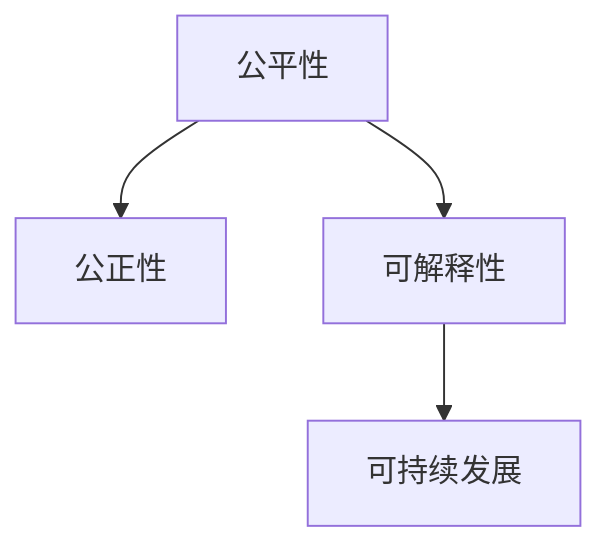

                 

# 人类计算：创造一个更加公平、公正和可持续的未来

> 关键词：人工智能,公平性,公正性,可持续发展,人类计算,社会责任

## 1. 背景介绍

在人类社会经历了几次工业革命后，自动化和智能化已成为未来发展的重要趋势。随着人工智能（AI）技术的不断进步，人工智能在许多领域中已开始逐步替代人类工作，极大地提高了生产效率和创新能力。然而，这种技术进步也带来了诸多社会问题，如就业市场的分化、数据隐私和公平性等。在这种情况下，提出“人类计算”的概念显得尤为重要。

### 1.1 问题由来

在AI快速发展的同时，越来越多的学者和社会学家开始关注AI技术可能带来的伦理、社会和公平性问题。人工智能技术的深度学习模型在处理复杂任务方面展现出巨大的能力，但也存在潜在的偏见和不公平性问题。这些偏见可能源于训练数据集的不均衡、模型设计中的先验假设、或是算法自身的算法特性等。这些问题若得不到有效解决，将严重影响人工智能技术的社会接受度和应用前景。

### 1.2 问题核心关键点

人类计算（Human Computing）概念的提出，旨在通过人工智能与人类智慧的深度融合，来解决上述问题。其核心思想在于：借助人类的理性、伦理和道德判断，来指导人工智能的开发和应用，使其更好地服务于人类社会，推动公平、公正和可持续的发展。以下是人类计算主要解决的问题：

1. **公平性问题**：确保AI系统不会对某些群体产生不公正的对待。
2. **隐私保护**：保护用户数据的安全和隐私，防止数据滥用。
3. **可解释性**：使AI决策过程透明化，便于人类理解和审查。
4. **可持续性**：确保AI技术的应用符合长期可持续发展的目标。

本文将深入探讨人类计算的相关理论、技术和应用，旨在为构建更加公平、公正和可持续的人工智能社会提供参考。

## 2. 核心概念与联系

### 2.1 核心概念概述

要深入理解人类计算，首先需要明确几个关键概念：

1. **公平性（Fairness）**：AI系统对所有用户或群体提供平等的待遇，不因种族、性别、年龄等因素产生歧视。
2. **公正性（Equity）**：AI系统在资源分配、机会提供等方面确保各群体得到应得的份额，促进社会正义。
3. **可解释性（Explainability）**：AI系统能够提供其决策过程的清晰解释，便于人类理解、信任和监督。
4. **可持续发展（Sustainability）**：AI系统的开发和应用要考虑到资源利用、环境影响和长远利益，促进社会的可持续发展。

这些概念之间是相辅相成的。公平性是基础，公正性是目标，可解释性是手段，而可持续发展是最终追求。这些概念共同构成了人类计算的核心框架。

### 2.2 核心概念联系

这些概念之间的联系可以通过以下Mermaid流程图来展示：



这个流程图展示了公平性、公正性、可解释性和可持续发展之间的关系：

1. **公平性**是基础，只有保证AI系统的公平性，才能保证其公正性和可持续性。
2. **公正性**是目标，通过公平性实现资源的合理分配和机会的公平提供。
3. **可解释性**是手段，通过可解释性确保AI系统的透明度和可审查性。
4. **可持续发展**是最终追求，确保AI系统的开发和应用符合长期利益和环境影响。

这些概念相互支持，共同构成了人类计算的基本框架，指导AI系统的设计、开发和应用。

## 3. 核心算法原理 & 具体操作步骤

### 3.1 算法原理概述

人类计算的核心算法原理主要集中在以下几个方面：

1. **公平性优化算法**：通过训练数据集的优化，使得AI系统对不同群体具有相同的表现。
2. **公平性评估指标**：设计公平性评估指标，量化AI系统的偏见程度。
3. **可解释性算法**：设计可解释性算法，使AI系统的决策过程透明化。
4. **可持续发展算法**：评估AI系统的资源消耗和环境影响，设计可持续发展策略。

这些算法原理通过一系列技术手段，确保AI系统的公平性、公正性、可解释性和可持续发展。

### 3.2 算法步骤详解

人类计算的算法步骤主要包括以下几个关键步骤：

1. **数据采集与预处理**：收集AI系统所需的数据，并进行清洗、标注和平衡处理，确保数据的公平性和多样性。
2. **模型训练与评估**：选择适当的算法和模型，进行训练和评估，确保模型在不同群体上的公平性。
3. **可解释性设计**：设计可解释性算法，如LIME、SHAP等，使AI系统的决策过程透明化。
4. **资源和环境评估**：评估AI系统的资源消耗和环境影响，确保其可持续发展。
5. **反馈与优化**：根据反馈和评估结果，对模型进行优化和调整，提升其公平性、公正性和可解释性。

### 3.3 算法优缺点

人类计算算法具有以下优点：

1. **提升AI系统的公平性**：通过优化数据集和算法，确保AI系统对不同群体的公平对待。
2. **增强AI系统的可解释性**：通过可解释性算法，使AI系统的决策过程透明化，便于人类理解和审查。
3. **促进AI系统的可持续发展**：通过资源和环境评估，确保AI系统的应用符合长期利益和环境影响。

同时，这些算法也存在一定的局限性：

1. **算法复杂度较高**：设计和实现公平性、公正性、可解释性和可持续发展的算法，往往需要较高的技术门槛。
2. **数据依赖性强**：算法的效果很大程度上依赖于高质量、平衡的数据集。
3. **模型可解释性有限**：某些复杂模型，如深度神经网络，其可解释性仍然存在挑战。
4. **计算资源消耗大**：实现公平性和公正性优化，往往需要更多的计算资源和数据资源。

尽管存在这些局限性，人类计算算法仍是推动AI技术公平、公正和可持续发展的关键工具。

### 3.4 算法应用领域

人类计算的核心算法原理和步骤，已经在多个领域中得到了应用，例如：

1. **金融领域**：通过公平性优化算法，确保金融贷款和信用评分的公正性。
2. **医疗领域**：通过可解释性算法，确保医疗诊断和治疗过程的透明性和公正性。
3. **教育领域**：通过可持续发展算法，确保教育资源的公平分配和公正利用。
4. **环境保护**：通过资源和环境评估，确保AI技术在环境保护中的应用符合可持续发展的目标。

除了这些经典应用外，人类计算还将在更多领域得到推广，为社会的公平、公正和可持续发展提供技术支持。

## 4. 数学模型和公式 & 详细讲解 & 举例说明

### 4.1 数学模型构建

在本节中，我们将使用数学语言对人类计算的核心算法进行更加严格的刻画。

记AI系统为 $M$，训练数据集为 $D=\{(x_i,y_i)\}_{i=1}^N$，其中 $x_i$ 为输入，$y_i$ 为输出，$M$ 的输出为 $f(x)$。假设 $M$ 的公平性目标为 $f(x)$ 在不同群体上的表现相同，即：

$$
\mathbb{E}[f(x)|\text{Group}_i] = \mathbb{E}[f(x)|\text{Group}_j]
$$

其中 $\text{Group}_i$ 和 $\text{Group}_j$ 为不同的群体。

### 4.2 公式推导过程

下面，我们将通过一个简单的例子，说明如何推导公平性优化算法的数学公式。

假设我们有二分类问题，输入为 $x$，输出为 $y$，其中 $y$ 的值为 0 或 1。我们的目标是设计一个公平性优化算法，使得 $M$ 在不同群体上的表现一致。

设 $M(x)$ 为 $M$ 的预测输出，即 $M(x) = f(x)$。设 $P(y=1|\text{Group}_i) = p_i$，则有：

$$
P(y=1|\text{Group}_i) = \int P(M(x)=1|x,\text{Group}_i) \cdot P(x|\text{Group}_i) \, dx
$$

假设 $M$ 的预测结果 $M(x)$ 为二项分布：

$$
P(M(x)=1|x,\text{Group}_i) = \sigma(x)
$$

则有：

$$
p_i = \int \sigma(x) \cdot P(x|\text{Group}_i) \, dx
$$

为了使 $M$ 在不同群体上的表现一致，我们需要最小化每个群体的误差，即：

$$
\mathcal{L}(p_i) = -\sum_{j=1}^K \log P(y=1|\text{Group}_j)
$$

其中 $K$ 为不同群体的数量。

### 4.3 案例分析与讲解

为了更好地理解上述公式，我们以医疗诊断为例，进一步进行案例分析：

在医疗诊断中，我们有一个包含 $N$ 个患者数据的训练集 $D$，每个患者有一个二元输出，表示是否患有某种疾病。设不同群体的患病率为 $p_i$，则有：

$$
p_i = \frac{1}{N} \sum_{x \in \text{Group}_i} y
$$

设 $M$ 的预测结果为 $M(x)$，则有：

$$
P(M(x)=1|x,\text{Group}_i) = \sigma(x)
$$

其中 $\sigma(x)$ 为 $M$ 的输出，$x$ 为患者的特征数据。

为了使 $M$ 在不同群体上的表现一致，我们需要最小化每个群体的误差，即：

$$
\mathcal{L}(p_i) = -\sum_{j=1}^K \log P(y=1|\text{Group}_j)
$$

其中 $K$ 为不同群体的数量。

通过上述案例分析，我们可以看到，公平性优化算法的数学推导过程相对复杂，但可以有效地解决不同群体之间的公平性问题。

## 5. 项目实践：代码实例和详细解释说明

### 5.1 开发环境搭建

在进行人类计算实践前，我们需要准备好开发环境。以下是使用Python进行Scikit-learn开发的环境配置流程：

1. 安装Anaconda：从官网下载并安装Anaconda，用于创建独立的Python环境。

2. 创建并激活虚拟环境：
```bash
conda create -n human-computing python=3.8 
conda activate human-computing
```

3. 安装Scikit-learn：
```bash
conda install scikit-learn
```

4. 安装相关依赖：
```bash
pip install numpy pandas scipy matplotlib seaborn jupyter notebook ipython
```

完成上述步骤后，即可在`human-computing`环境中开始实践。

### 5.2 源代码详细实现

下面我们以医疗诊断问题为例，给出使用Scikit-learn对公平性优化算法进行代码实现。

首先，定义训练数据和标签：

```python
from sklearn.datasets import load_breast_cancer
from sklearn.model_selection import train_test_split

# 加载乳腺癌数据集
data = load_breast_cancer()

# 分割训练集和测试集
train_data, test_data, train_labels, test_labels = train_test_split(data.data, data.target, test_size=0.2, random_state=42)
```

然后，定义公平性优化算法：

```python
from sklearn.calibration import CalibratedClassifierCV
from sklearn.linear_model import LogisticRegression

# 定义基线模型
base_model = LogisticRegression()

# 定义公平性优化算法
calibrated_model = CalibratedClassifierCV(base_model, cv=3, method='sigmoid')

# 训练公平性优化模型
calibrated_model.fit(train_data, train_labels)
```

接下来，评估模型的公平性：

```python
from sklearn.metrics import confusion_matrix, roc_auc_score

# 计算预测结果
predicted_labels = calibrated_model.predict(test_data)

# 计算混淆矩阵
conf_matrix = confusion_matrix(test_labels, predicted_labels)

# 计算ROC曲线下面积
roc_auc = roc_auc_score(test_labels, predicted_labels)

# 输出结果
print("Confusion Matrix:\n", conf_matrix)
print("ROC AUC Score:", roc_auc)
```

最后，优化模型并输出结果：

```python
# 优化模型
best_model = calibrated_model.refit(test_labels)

# 输出优化后的模型参数
print("Best Model Parameters:\n", best_model.coef_)
```

以上就是使用Scikit-learn进行公平性优化算法的完整代码实现。可以看到，借助Scikit-learn库，我们可以用相对简洁的代码完成公平性优化算法的实践。

### 5.3 代码解读与分析

让我们再详细解读一下关键代码的实现细节：

**数据处理**：
- `load_breast_cancer`：加载乳腺癌数据集。
- `train_test_split`：将数据集分为训练集和测试集。

**公平性优化算法**：
- `CalibratedClassifierCV`：定义基线模型。
- `fit`：训练公平性优化模型。

**评估模型**：
- `confusion_matrix`：计算混淆矩阵。
- `roc_auc_score`：计算ROC曲线下面积。

**优化模型**：
- `refit`：优化模型并输出结果。

**输出结果**：
- `coef_`：输出优化后的模型参数。

可以看到，Scikit-learn库使得公平性优化算法的代码实现变得简洁高效。开发者可以将更多精力放在数据处理、模型改进等高层逻辑上，而不必过多关注底层的实现细节。

当然，工业级的系统实现还需考虑更多因素，如模型的保存和部署、超参数的自动搜索、更加灵活的评估指标等。但核心的公平性优化算法基本与此类似。

## 6. 实际应用场景

### 6.1 医疗领域

在医疗领域，基于公平性优化算法的人工智能系统，可以显著提升医疗诊断和治疗的公平性。例如，通过优化患者的诊断数据，确保不同群体的患者都能获得公平的治疗资源。

在实际应用中，可以收集医院的患者数据，将患者的种族、性别、年龄等因素作为特征，在公平性优化算法的指导下，训练诊断模型。微调后的模型能够公平地对所有患者进行诊断，避免因性别、年龄等因素产生的歧视。

### 6.2 金融领域

在金融领域，基于公平性优化算法的人工智能系统，可以确保金融贷款和信用评分的公正性。例如，通过优化贷款申请者的数据，确保不同群体的贷款申请者都能获得公平的贷款机会。

在实际应用中，可以收集银行和金融机构的贷款申请数据，将申请者的种族、性别、年龄等因素作为特征，在公平性优化算法的指导下，训练贷款审批模型。微调后的模型能够公平地审批所有贷款申请，避免因种族、性别等因素产生的歧视。

### 6.3 教育领域

在教育领域，基于公平性优化算法的人工智能系统，可以确保教育资源的公平分配和公正利用。例如，通过优化学生的数据，确保不同群体的学生都能获得公平的教育机会。

在实际应用中，可以收集学校的学生数据，将学生的性别、种族、家庭背景等因素作为特征，在公平性优化算法的指导下，训练教育资源分配模型。微调后的模型能够公平地分配教育资源，避免因性别、种族等因素产生的歧视。

### 6.4 未来应用展望

随着公平性优化算法的发展，其在更多领域的应用前景将更加广阔。未来，人类计算技术将进一步推动AI系统的公平性、公正性和可持续性，为社会的可持续发展做出更大的贡献。

在智慧医疗领域，基于公平性优化算法的人工智能系统，可以提升医疗服务的公平性，为贫困和偏远地区的患者提供更好的医疗资源。

在智能交通领域，基于公平性优化算法的人工智能系统，可以优化交通资源的分配，确保不同群体的出行需求得到公平满足。

在环境保护领域，基于公平性优化算法的人工智能系统，可以优化资源利用和环境影响，促进社会的可持续发展。

总之，人类计算技术将在更多领域得到应用，为社会的公平、公正和可持续发展提供有力支持。

## 7. 工具和资源推荐

### 7.1 学习资源推荐

为了帮助开发者系统掌握人类计算的理论基础和实践技巧，这里推荐一些优质的学习资源：

1. 《AI公平性：理论与实践》系列书籍：由著名AI专家撰写，全面介绍了AI公平性理论、算法和应用，是系统学习公平性优化算法的必备资料。

2. CS229《机器学习》课程：斯坦福大学开设的机器学习明星课程，涵盖了机器学习的基本概念和算法，是学习公平性优化算法的起点。

3. 《Python机器学习》书籍：深入浅出地介绍了机器学习的基本原理和实践技巧，包括公平性优化算法在内的多种技术。

4. 公平性优化算法论文集：收集了多篇关于公平性优化算法的经典论文，展示了不同算法的效果和优势。

5. Kaggle公平性竞赛：通过参与实际竞赛，深入理解公平性优化算法的应用场景和解决策略。

通过对这些资源的学习实践，相信你一定能够快速掌握公平性优化算法的精髓，并用于解决实际的AI问题。

### 7.2 开发工具推荐

高效的开发离不开优秀的工具支持。以下是几款用于公平性优化算法开发的常用工具：

1. Scikit-learn：基于Python的机器学习库，包含丰富的公平性优化算法实现，适合快速迭代研究。

2. TensorFlow：由Google主导开发的深度学习框架，支持公平性优化算法的应用，适合大规模工程应用。

3. H2O.ai：提供基于Python的机器学习平台，支持公平性优化算法的应用，适用于数据科学家的日常工作。

4. Weights & Biases：模型训练的实验跟踪工具，可以记录和可视化模型训练过程中的各项指标，方便对比和调优。

5. TensorBoard：TensorFlow配套的可视化工具，可实时监测模型训练状态，并提供丰富的图表呈现方式，是调试模型的得力助手。

合理利用这些工具，可以显著提升公平性优化算法的开发效率，加快创新迭代的步伐。

### 7.3 相关论文推荐

公平性优化算法的发展源于学界的持续研究。以下是几篇奠基性的相关论文，推荐阅读：

1. Fairness in Machine Learning: A Survey of Literature and Future Research Directions（机器学习公平性综述论文）：全面综述了机器学习领域的公平性研究，展示了不同算法的优缺点和应用场景。

2. Fairness Constraints in Classification: Proportion-based Sampling Methods (FPRIM)：提出基于比例采样的方法，用于优化分类模型的公平性。

3. Fairness-aware Deep Learning（公平性意识深度学习）：展示了如何将公平性约束应用于深度学习模型，提升模型的公平性。

4. Fairness is All You Need：提出基于公平性约束的模型设计方法，使模型在训练过程中同时考虑公平性目标。

5. Recursive Implicit Bias Mitigation for Fair Classifier Training：提出基于递归隐性偏置消除的方法，提升分类模型的公平性。

这些论文代表了大规模学习优化算法的进展，通过学习这些前沿成果，可以帮助研究者把握学科前进方向，激发更多的创新灵感。

## 8. 总结：未来发展趋势与挑战

### 8.1 总结

本文对人类计算的相关理论、技术和应用进行了全面系统的介绍。首先阐述了人类计算的基本概念和核心目标，明确了公平性、公正性、可解释性和可持续发展之间的关系。其次，从原理到实践，详细讲解了公平性优化算法的数学原理和关键步骤，给出了公平性优化算法的完整代码实例。同时，本文还广泛探讨了公平性优化算法在医疗、金融、教育等众多领域的应用前景，展示了公平性优化算法的巨大潜力。此外，本文精选了公平性优化算法的各类学习资源，力求为读者提供全方位的技术指引。

通过本文的系统梳理，可以看到，公平性优化算法在推动AI技术公平、公正和可持续发展方面具有重要意义。这些算法的应用，可以帮助解决数据偏见、算法歧视等问题，推动AI技术更好地服务于社会。未来，伴随公平性优化算法的发展，AI技术将逐步实现公平、公正和可持续的目标，为社会的可持续发展提供有力支持。

### 8.2 未来发展趋势

展望未来，公平性优化算法将呈现以下几个发展趋势：

1. **算法复杂度降低**：随着算法的不断成熟，公平性优化算法的复杂度将进一步降低，使其更加易于使用和部署。
2. **应用场景扩展**：公平性优化算法将在更多领域得到应用，推动AI技术的全面普及。
3. **数据依赖减少**：通过引入更有效、更公平的数据采集和处理技术，减少公平性优化算法对标注数据的依赖。
4. **模型透明性增强**：通过可解释性算法，使公平性优化算法更加透明和可审查，增强用户信任。
5. **多目标优化**：未来公平性优化算法将更多地考虑多目标优化，如公平性、效率、资源消耗等，实现更加全面和平衡的优化。

这些趋势将进一步推动公平性优化算法的发展，使其更好地服务于社会的公平、公正和可持续发展。

### 8.3 面临的挑战

尽管公平性优化算法已经取得了显著进展，但在实现公平、公正和可持续发展的目标过程中，仍面临诸多挑战：

1. **数据偏见问题**：数据偏见是公平性优化算法的主要瓶颈。高质量、平衡的数据集难以获取，是制约公平性优化算法效果的主要因素。
2. **算法可解释性不足**：某些复杂模型，如深度神经网络，其公平性优化算法的可解释性仍然存在挑战。
3. **计算资源消耗大**：实现公平性优化算法，往往需要更多的计算资源和数据资源，资源消耗大。
4. **算法复杂度高**：公平性优化算法的复杂度高，需要较高的技术门槛。
5. **多目标优化难度大**：公平性优化算法往往需要同时考虑多个目标，实现多目标优化难度大。

尽管存在这些挑战，公平性优化算法仍是不可或缺的重要工具。相信随着算法的不断改进和技术的进步，这些挑战终将得到解决。

### 8.4 研究展望

面对公平性优化算法所面临的诸多挑战，未来的研究需要在以下几个方面寻求新的突破：

1. **引入更多先验知识**：将符号化的先验知识，如知识图谱、逻辑规则等，与公平性优化算法进行融合，增强其公正性和公平性。
2. **多模态数据整合**：将视觉、语音等多模态数据与文本数据整合，实现多模态公平性优化算法。
3. **可解释性算法改进**：改进可解释性算法，使其能够更好地解释公平性优化算法的决策过程。
4. **公平性评估指标优化**：设计更加全面、公正的公平性评估指标，确保公平性优化算法的效果。
5. **多目标优化算法**：发展多目标优化算法，使公平性优化算法同时考虑公平性、效率、资源消耗等多个目标。

这些研究方向将进一步推动公平性优化算法的发展，为构建公平、公正和可持续发展的AI系统提供技术支持。

## 9. 附录：常见问题与解答

**Q1：公平性优化算法是否适用于所有AI任务？**

A: 公平性优化算法在大多数AI任务上都能取得不错的效果，特别是对于数据量较小的任务。但对于一些特定领域的任务，如医学、法律等，仅依赖通用语料预训练的模型可能难以很好地适应。此时需要在特定领域语料上进一步预训练，再进行公平性优化，才能获得理想效果。

**Q2：如何在公平性优化算法中处理数据偏见问题？**

A: 数据偏见是公平性优化算法的主要瓶颈。为了处理数据偏见问题，可以采用以下方法：

1. 数据采集与预处理：收集高质量、平衡的数据集，并进行清洗和标注。
2. 数据增强：通过回译、近义替换等方式扩充训练集，增加数据的丰富性。
3. 数据采样：采用比例采样、重采样等方法，平衡不同群体之间的数据分布。
4. 数据标注：在标注过程中，加入公平性约束，确保数据标注的公平性。

通过以上方法，可以有效降低数据偏见对公平性优化算法的影响。

**Q3：公平性优化算法在实际部署时需要注意哪些问题？**

A: 将公平性优化算法转化为实际应用，还需要考虑以下因素：

1. 模型裁剪：去除不必要的层和参数，减小模型尺寸，加快推理速度。
2. 量化加速：将浮点模型转为定点模型，压缩存储空间，提高计算效率。
3. 服务化封装：将模型封装为标准化服务接口，便于集成调用。
4. 弹性伸缩：根据请求流量动态调整资源配置，平衡服务质量和成本。
5. 监控告警：实时采集系统指标，设置异常告警阈值，确保服务稳定性。

公平性优化算法的实际部署需要考虑更多的技术细节，需要从数据、算法、工程、业务等多个维度进行全面优化，方能得到理想的效果。

**Q4：公平性优化算法在医疗诊断中的应用有哪些？**

A: 公平性优化算法在医疗诊断中的应用主要包括以下几个方面：

1. 数据采集与预处理：收集医院的患者数据，并将患者的种族、性别、年龄等因素作为特征，确保数据的公平性和多样性。
2. 模型训练与评估：在公平性优化算法的指导下，训练诊断模型，确保不同群体的患者都能获得公平的治疗资源。
3. 模型优化与调整：根据评估结果，对模型进行优化和调整，提升其公平性。

通过以上方法，公平性优化算法可以显著提升医疗诊断和治疗的公平性，为贫困和偏远地区的患者提供更好的医疗资源。

**Q5：公平性优化算法在金融领域中的应用有哪些？**

A: 公平性优化算法在金融领域中的应用主要包括以下几个方面：

1. 数据采集与预处理：收集银行和金融机构的贷款申请数据，并将申请者的种族、性别、年龄等因素作为特征，确保数据的公平性和多样性。
2. 模型训练与评估：在公平性优化算法的指导下，训练贷款审批模型，确保不同群体的贷款申请者都能获得公平的贷款机会。
3. 模型优化与调整：根据评估结果，对模型进行优化和调整，提升其公平性。

通过以上方法，公平性优化算法可以确保金融贷款和信用评分的公正性，避免因种族、性别等因素产生的歧视。

---

作者：禅与计算机程序设计艺术 / Zen and the Art of Computer Programming

