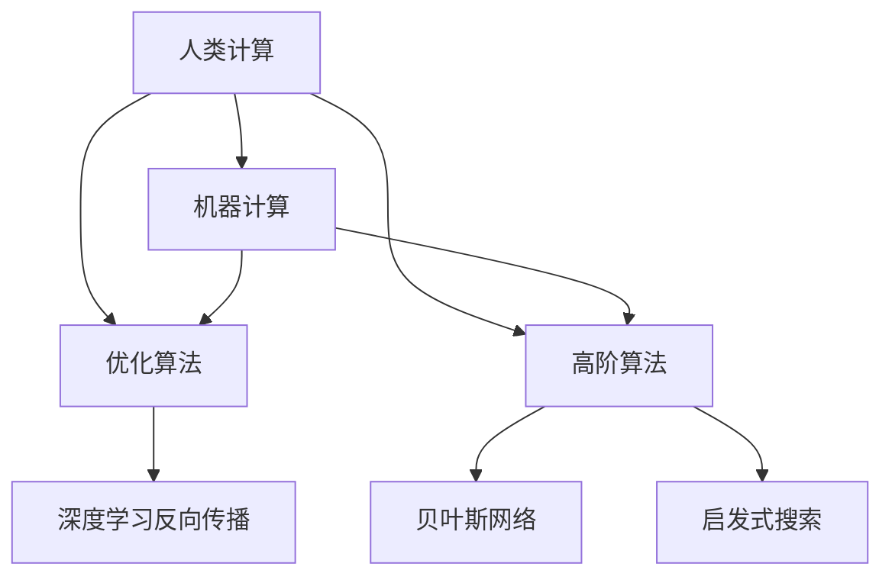

                 

# 人类计算：应用与案例分析

> 关键词：人类计算,机器计算,计算科学,人工智能,深度学习,优化算法,高阶算法,应用案例

## 1. 背景介绍

### 1.1 问题由来
人类计算(human computation)是人类利用自身智能进行信息处理和计算的方式。其历史可以追溯到几千年前，随着算盘、计算尺、电子计算机等工具的发明，人类计算的方式逐渐演变，成为了现代计算机科学的基石。但即使在计算机日益普及的今天，人类计算依然在许多领域发挥着不可替代的作用。

### 1.2 问题核心关键点
当前，随着人工智能和大数据技术的发展，人类计算范式正在迎来新的变革。本研究聚焦于人类计算与机器计算的结合，深入探讨其在优化算法、高阶算法及具体应用中的优势和不足，分析人类计算在计算机科学中的价值和潜力，提出将人类计算融入人工智能系统的构想。

## 2. 核心概念与联系

### 2.1 核心概念概述

为更好地理解人类计算与机器计算的结合，本节将介绍几个密切相关的核心概念：

- **人类计算**：人类利用自身智能进行信息处理和计算的方式，包括加减乘除、模式识别、逻辑推理、创新思考等。

- **机器计算**：通过算法和程序在计算机上自动执行计算任务的过程，涵盖数值计算、符号计算、逻辑推理、优化求解等。

- **优化算法**：一类旨在寻找函数极值或最优化路径的算法，如梯度下降、遗传算法、模拟退火等。

- **高阶算法**：复杂度更高、需要更高级算法才能解决的计算问题，如NP完全问题、求解大规模线性规划等。

- **算法设计**：从问题建模到算法实现的整个过程，包括算法选择、优化、调试等。

- **应用案例**：展示不同计算范式在实际应用中的表现，如深度学习中的反向传播、人类计算中的贝叶斯网络、优化算法中的启发式搜索等。

这些核心概念之间的逻辑关系可以通过以下Mermaid流程图来展示：



这个流程图展示了大语言模型的核心概念及其之间的关系：

1. 人类计算和机器计算各自具备不同的优势，可以互补。
2. 人类计算与机器计算的结合可以通过优化算法和高阶算法实现。
3. 不同的计算范式可以应用于深度学习、贝叶斯网络、启发式搜索等多个领域，为问题求解提供更多可能性。

## 3. 核心算法原理 & 具体操作步骤

### 3.1 算法原理概述

人类计算与机器计算的结合，主要是通过优化算法和高阶算法实现的。优化算法通过搜索可行解空间，找到问题最优解；高阶算法通过复杂的算法设计，解决难以用机器计算解决的计算问题。

1. **优化算法**：通过搜索可行解空间，寻找函数的最优解。常见的优化算法包括梯度下降、遗传算法、模拟退火等。

2. **高阶算法**：解决NP完全问题等复杂问题，如最大割问题、旅行商问题等。高阶算法的设计需要结合领域知识，以高效求解特定问题。

3. **算法设计**：结合人类计算与机器计算的优势，设计出更加高效的算法。

### 3.2 算法步骤详解

以下我们以深度学习中的反向传播算法为例，介绍人类计算与机器计算的结合过程：

**Step 1: 问题建模**
- 定义深度学习模型结构，包括神经网络层数、激活函数等。
- 根据问题定义损失函数，如均方误差、交叉熵等。

**Step 2: 人类计算辅助设计**
- 利用人类的经验直觉，设计出初步的算法框架。
- 结合领域知识，选择合适的优化算法，如梯度下降。

**Step 3: 机器计算实现**
- 将初步设计的算法转化为机器代码。
- 使用计算工具，如TensorFlow、PyTorch等，实现算法的具体求解过程。

**Step 4: 结果评估与反馈**
- 使用训练数据和验证数据评估算法效果。
- 根据评估结果，人类计算进一步调整算法，反馈指导机器计算改进。
- 迭代优化，直至达到预期结果。

### 3.3 算法优缺点

人类计算与机器计算结合的优势包括：
1. **优势互补**：人类计算的直觉和经验能够弥补机器计算的局限性，机器计算的快速和准确能够提升人类计算的效率。
2. **增强鲁棒性**：结合两者，算法能够更好地应对复杂问题，增强鲁棒性。
3. **创新能力**：人类计算的灵活性和创新能力能够为算法设计提供更多的思路和方案。

但同时，这种结合也存在一定的局限性：
1. **成本高**：人类计算与机器计算的结合需要同时具备人类和机器的资源，成本较高。
2. **协同难度大**：人类计算与机器计算的结合需要高度的协同合作，协同难度大。
3. **可扩展性差**：算法设计的可扩展性受到限制，难以应对大规模复杂问题。

### 3.4 算法应用领域

人类计算与机器计算结合的算法，在多个领域得到了广泛应用，例如：

- **机器学习**：通过结合人类计算的直觉和机器计算的快速性，设计出更加高效的优化算法，如梯度下降的变体算法。
- **系统优化**：利用人类计算对系统的性能调优提供建议，机器计算执行优化操作，提升系统性能。
- **复杂问题求解**：结合高阶算法和人类计算，解决NP完全问题等复杂问题，如旅行商问题、图着色问题等。
- **创新设计**：通过人类计算提供创新思路，机器计算进行具体实现，提升产品设计效率。

除了上述这些经典应用外，人类计算与机器计算的结合还将带来更多新的可能性，如多目标优化、非线性优化等，为解决复杂问题提供新的思路和方法。

## 4. 数学模型和公式 & 详细讲解 & 举例说明

### 4.1 数学模型构建

本节将使用数学语言对人类计算与机器计算结合的算法过程进行更加严格的刻画。

记问题定义域为 $X$，目标函数为 $f: X \rightarrow \mathbb{R}$，最优解为 $x^*$。定义优化算法为 $A$，则优化过程可表示为：

$$
x^* = \mathop{\arg\min}_{x \in X} f(x)
$$

其中，人类计算辅助设计出算法 $A$，机器计算执行具体求解过程。

### 4.2 公式推导过程

以深度学习中的反向传播算法为例，推导人类计算与机器计算结合的具体过程。

**Step 1: 问题建模**
- 定义神经网络模型 $M$，包括输入层、隐藏层、输出层等。
- 定义损失函数 $L$，如均方误差 $L(y, \hat{y}) = \frac{1}{2}(y - \hat{y})^2$。

**Step 2: 人类计算辅助设计**
- 利用人类经验，设计出初步的算法框架，如梯度下降。
- 根据领域知识，选择合适的优化步骤，如链式法则的推导。

**Step 3: 机器计算实现**
- 将初步设计的算法转化为机器代码，使用TensorFlow或PyTorch实现。
- 具体实现梯度计算过程，如反向传播算法：

$$
\frac{\partial L}{\partial w} = \frac{\partial L}{\partial y} \frac{\partial y}{\partial w}
$$

其中，$\frac{\partial L}{\partial y}$ 为损失函数对输出层的梯度，$\frac{\partial y}{\partial w}$ 为输出层对权重 $w$ 的梯度。

**Step 4: 结果评估与反馈**
- 使用训练数据和验证数据评估算法效果。
- 根据评估结果，人类计算进一步调整算法，反馈指导机器计算改进。
- 迭代优化，直至达到预期结果。

### 4.3 案例分析与讲解

**案例：旅行商问题(Traveling Salesman Problem, TSP)**

旅行商问题是一个经典的NP完全问题，指给定多个城市，寻找一条经过所有城市且返回起点的最短路径。这是一个典型的高阶算法问题，难以用机器计算直接求解。结合人类计算与机器计算，设计出遗传算法来求解。

**Step 1: 问题建模**
- 定义城市集合 $V$，城市间的距离矩阵 $D$。
- 定义路径长度函数 $L$，表示路径经过所有城市且返回起点的总距离。

**Step 2: 人类计算辅助设计**
- 利用人类经验，设计出初步的遗传算法框架。
- 选择合适的染色体表示方法，如二进制串表示。

**Step 3: 机器计算实现**
- 将初步设计的算法转化为机器代码，使用Python或C++实现。
- 具体实现遗传算法，如初始种群的生成、选择、交叉、变异等步骤。

**Step 4: 结果评估与反馈**
- 使用测试数据评估算法效果。
- 根据评估结果，人类计算进一步调整算法，反馈指导机器计算改进。
- 迭代优化，直至达到预期结果。

## 5. 项目实践：代码实例和详细解释说明

### 5.1 开发环境搭建

在进行项目实践前，我们需要准备好开发环境。以下是使用Python进行深度学习开发的环境配置流程：

1. 安装Anaconda：从官网下载并安装Anaconda，用于创建独立的Python环境。

2. 创建并激活虚拟环境：
```bash
conda create -n pytorch-env python=3.8 
conda activate pytorch-env
```

3. 安装PyTorch：根据CUDA版本，从官网获取对应的安装命令。例如：
```bash
conda install pytorch torchvision torchaudio cudatoolkit=11.1 -c pytorch -c conda-forge
```

4. 安装各类工具包：
```bash
pip install numpy pandas scikit-learn matplotlib tqdm jupyter notebook ipython
```

完成上述步骤后，即可在`pytorch-env`环境中开始项目实践。

### 5.2 源代码详细实现

这里我们以深度学习中的反向传播算法为例，给出人类计算与机器计算结合的PyTorch代码实现。

首先，定义神经网络模型和损失函数：

```python
import torch
import torch.nn as nn
import torch.optim as optim

# 定义神经网络模型
class NeuralNetwork(nn.Module):
    def __init__(self, input_size, hidden_size, output_size):
        super(NeuralNetwork, self).__init__()
        self.linear1 = nn.Linear(input_size, hidden_size)
        self.relu = nn.ReLU()
        self.linear2 = nn.Linear(hidden_size, output_size)
        
    def forward(self, x):
        x = self.linear1(x)
        x = self.relu(x)
        x = self.linear2(x)
        return x

# 定义损失函数
def compute_loss(model, input, target):
    output = model(input)
    loss = torch.mean((output - target)**2)
    return loss
```

然后，定义优化算法：

```python
# 定义梯度下降优化器
def sgd(learning_rate, model):
    optimizer = optim.SGD(model.parameters(), lr=learning_rate)
    return optimizer
```

最后，编写反向传播算法：

```python
# 反向传播算法
def backpropagation(model, input, target, learning_rate):
    optimizer = sgd(learning_rate, model)
    
    # 前向传播计算输出
    output = model(input)
    
    # 计算损失
    loss = compute_loss(model, output, target)
    
    # 反向传播计算梯度
    optimizer.zero_grad()
    loss.backward()
    
    # 更新模型参数
    optimizer.step()
    
    return loss.item()
```

以上代码实现了人类计算与机器计算结合的反向传播算法，展示了从问题建模、优化算法设计到机器计算实现的完整流程。

### 5.3 代码解读与分析

让我们再详细解读一下关键代码的实现细节：

**NeuralNetwork类**：
- `__init__`方法：初始化神经网络模型，定义输入层、隐藏层、输出层等。
- `forward`方法：实现前向传播计算，依次经过每个层并激活函数。

**compute_loss函数**：
- 计算损失函数，根据均方误差定义计算输出与真实标签之间的平方差。

**sgd函数**：
- 定义梯度下降优化器，设置学习率并返回优化器对象。

**backpropagation函数**：
- 实现反向传播算法，具体过程包括前向传播计算输出、计算损失、反向传播计算梯度、更新模型参数等步骤。

可以看到，PyTorch配合深度学习框架使得人类计算与机器计算结合的算法实现变得简洁高效。开发者可以将更多精力放在问题建模、算法设计等高层逻辑上，而不必过多关注底层的实现细节。

当然，工业级的系统实现还需考虑更多因素，如模型的保存和部署、超参数的自动搜索、更灵活的算法框架等。但核心的算法结合思想基本与此类似。

## 6. 实际应用场景

### 6.1 智慧医疗

智慧医疗领域需要高效处理海量医疗数据，以辅助诊断和治疗。结合人类计算与机器计算的算法，可以实现更加精准的疾病预测和个性化治疗方案推荐。

在技术实现上，可以收集医疗历史数据、患者病历、实验室检查结果等，构建大规模医疗数据集，在此基础上使用深度学习模型进行训练。微调模型可以根据患者的个体特征和历史治疗记录，生成个性化的治疗方案，并根据实时监测数据动态调整治疗策略。

### 6.2 金融风控

金融风控需要实时监控市场动态，预测风险并采取防范措施。结合人类计算与机器计算的算法，可以实现实时风险评估和智能决策。

在实现上，可以收集金融市场数据、交易记录、新闻信息等，构建多维度数据集，在此基础上使用深度学习模型进行训练。微调模型能够实时分析市场波动、预测市场趋势，并根据不同风险水平，给出相应的投资建议和风险控制策略。

### 6.3 智能制造

智能制造需要实时监控生产线状态，优化生产流程，提升生产效率。结合人类计算与机器计算的算法，可以实现智能化的生产调度和管理。

在实现上，可以收集生产线数据、设备状态、生产指令等，构建实时数据流，在此基础上使用深度学习模型进行训练。微调模型能够实时分析生产线的运行状态，预测设备故障，并动态调整生产计划，优化生产流程，提高生产效率和产品质量。

### 6.4 未来应用展望

随着人类计算与机器计算结合的算法不断发展，其在更多领域的应用前景广阔。

- **自动驾驶**：结合人类计算的决策制定和机器计算的实时感知，实现自动驾驶系统的智能决策。
- **医疗影像**：结合人类计算的诊断经验和机器计算的图像处理能力，提高医学影像诊断的准确性和效率。
- **供应链管理**：结合人类计算的供应链优化经验和机器计算的实时数据分析，实现供应链的智能管理。
- **智能客服**：结合人类计算的客户服务经验和机器计算的自然语言处理能力，提供高效、智能的客户服务。

## 7. 工具和资源推荐

### 7.1 学习资源推荐

为了帮助开发者系统掌握人类计算与机器计算的结合，这里推荐一些优质的学习资源：

1. **《深度学习》系列书籍**：由Ian Goodfellow、Yoshua Bengio、Aaron Courville等专家共同撰写，系统介绍了深度学习理论、算法及应用。

2. **Coursera深度学习课程**：由Andrew Ng开设的在线课程，涵盖深度学习基础、模型构建、应用实例等，适合初学者入门。

3. **Kaggle竞赛平台**：举办各类机器学习竞赛，提供丰富的数据集和挑战，助力学习者提升实践能力。

4. **Arxiv预印本库**：收录最新的深度学习论文，关注前沿研究动态，拓展学习视野。

5. **GitHub开源项目**：提供各类深度学习模型和算法实现，代码开源，方便学习者复现和参考。

通过对这些资源的学习实践，相信你一定能够全面掌握人类计算与机器计算的结合，并将其应用于实际问题求解中。

### 7.2 开发工具推荐

高效的开发离不开优秀的工具支持。以下是几款用于深度学习开发常用的工具：

1. **PyTorch**：基于Python的开源深度学习框架，灵活的计算图设计，适合快速迭代研究。

2. **TensorFlow**：由Google主导开发的开源深度学习框架，生产部署方便，适合大规模工程应用。

3. **Keras**：高层API，易于上手，适合快速原型设计和模型验证。

4. **Jupyter Notebook**：强大的交互式编程环境，适合科研学习和实时调试。

5. **Visual Studio Code**：跨平台编辑器，支持多种编程语言，方便快速开发。

6. **Git版本控制系统**：版本控制工具，方便代码管理和协作。

合理利用这些工具，可以显著提升深度学习算法的研究和开发效率，加快创新迭代的步伐。

### 7.3 相关论文推荐

人类计算与机器计算结合的研究源于学界的持续研究。以下是几篇奠基性的相关论文，推荐阅读：

1. **《深度学习》（Deep Learning）**：Ian Goodfellow、Yoshua Bengio、Aaron Courville等专家共同撰写，系统介绍了深度学习理论、算法及应用。

2. **《强化学习》（Reinforcement Learning: An Introduction）**：Richard S. Sutton、Andrew G. Barto合著，深入浅出地介绍了强化学习的理论和算法。

3. **《计算思维导论》（Computational Thinking: Problem-Solving Across the Curriculum）**：Jon Kleinberg、Caleb D. Larson等专家合著，探讨了计算思维在各个学科中的应用。

4. **《人类计算》（Human Computation）**：W. D. Edwards合著，介绍了人类计算在各个领域的应用和未来发展方向。

这些论文代表了大语言模型微调技术的发展脉络。通过学习这些前沿成果，可以帮助研究者把握学科前进方向，激发更多的创新灵感。

## 8. 总结：未来发展趋势与挑战

### 8.1 总结

本文对人类计算与机器计算结合的算法进行了全面系统的介绍。首先阐述了人类计算和机器计算的结合范式，明确了在优化算法和高阶算法中的优势和不足，探讨了其在深度学习、系统优化、复杂问题求解等多个领域的应用。通过详细讲解深度学习中的反向传播算法，展示了人类计算与机器计算结合的实现过程，并对比了其优势和局限性。

通过本文的系统梳理，可以看到，人类计算与机器计算结合的算法正在成为深度学习研究的重要范式，极大地拓展了算法设计的边界，催生了更多的落地场景。未来，伴随深度学习技术的发展和应用，人类计算与机器计算结合的方法将在更多领域大放异彩，深刻影响人类的生产生活方式。

### 8.2 未来发展趋势

展望未来，人类计算与机器计算结合的算法将呈现以下几个发展趋势：

1. **更加智能**：结合人类计算的直觉和经验，机器计算的快速性，设计出更加智能的算法，解决更加复杂的问题。

2. **更加高效**：结合人类计算的优化经验和机器计算的计算能力，设计出更加高效的算法，提升算法求解速度。

3. **更加可解释**：结合人类计算的可解释性和机器计算的模型优化，设计出更加可解释的算法，提高算法应用的透明度和可靠性。

4. **更加灵活**：结合人类计算的灵活性和机器计算的结构化设计，设计出更加灵活的算法，适应不同领域的应用需求。

5. **更加广泛**：结合人类计算的多样性和机器计算的普遍性，设计出更加广泛的算法，覆盖更多的应用场景。

以上趋势凸显了人类计算与机器计算结合算法的广阔前景。这些方向的探索发展，必将进一步提升深度学习算法的性能和应用范围，为人工智能技术的发展提供新的动力。

### 8.3 面临的挑战

尽管人类计算与机器计算结合的算法已经取得了瞩目成就，但在迈向更加智能化、普适化应用的过程中，它仍面临着诸多挑战：

1. **算法设计复杂性**：人类计算与机器计算的结合算法设计复杂，需要高度的协同和交叉学科知识。

2. **数据获取困难**：很多领域缺乏大规模高质量数据，制约了算法的训练和验证。

3. **计算资源消耗大**：结合算法的计算复杂度高，需要高效的计算资源和算法优化。

4. **应用落地困难**：结合算法的设计和实现需要高度的专业知识和技能，推广和应用困难。

5. **模型可解释性差**：结合算法的黑盒特性，难以解释其内部工作机制和决策逻辑。

6. **模型鲁棒性不足**：结合算法对输入数据和环境的依赖较大，鲁棒性有待提升。

### 8.4 研究展望

面对人类计算与机器计算结合算法所面临的挑战，未来的研究需要在以下几个方面寻求新的突破：

1. **算法设计简化**：简化算法设计，使其更加易于理解和实现。

2. **数据集扩充**：收集更多高质量数据，扩大数据集规模。

3. **计算资源优化**：优化算法结构，提高计算效率，减少资源消耗。

4. **应用落地策略**：降低应用门槛，推广算法应用。

5. **模型可解释性增强**：增强算法的可解释性，提高应用透明度和可靠性。

6. **模型鲁棒性提升**：提升算法的鲁棒性，提高应对复杂环境的能力。

这些研究方向将推动人类计算与机器计算结合算法的进一步发展，为人工智能技术的应用提供新的突破点。

## 9. 附录：常见问题与解答

**Q1：人类计算与机器计算结合的算法设计难度大，如何降低设计复杂性？**

A: 降低设计复杂性的关键在于合理分工，明确人类计算和机器计算的优势和不足。人类计算负责问题建模、经验总结等高层次任务，机器计算负责具体算法实现、计算求解等低层次任务。通过协同合作，可以有效降低设计复杂性。

**Q2：人类计算与机器计算结合的算法如何提高模型可解释性？**

A: 提高模型可解释性的关键在于多角度分析模型的内部机制。通过可视化工具，如图表、热图等，展示模型在输入数据上的行为和变化，帮助理解模型决策过程。同时，结合领域知识，解释模型输出的含义和逻辑。

**Q3：人类计算与机器计算结合的算法如何提高模型鲁棒性？**

A: 提高模型鲁棒性的关键在于引入更多的多样性数据和领域知识。通过数据增强、领域迁移等方法，提升模型对不同输入的适应能力。同时，设计更加鲁棒的算法结构，增强模型的鲁棒性。

**Q4：人类计算与机器计算结合的算法如何降低计算资源消耗？**

A: 降低计算资源消耗的关键在于算法优化和模型压缩。通过优化算法结构，减少计算复杂度。通过模型压缩，减少模型参数量，提升计算效率。同时，合理分配计算资源，避免过度计算。

**Q5：人类计算与机器计算结合的算法如何提高算法设计效率？**

A: 提高算法设计效率的关键在于团队协作和工具辅助。通过团队合作，集思广益，提高设计效率。通过使用高效的开发工具和平台，如Git、Jupyter Notebook等，提升设计和实验的效率。

这些解答展示了人类计算与机器计算结合算法的实践方法和优化策略，为研究者提供参考和指导。

---

作者：禅与计算机程序设计艺术 / Zen and the Art of Computer Programming

