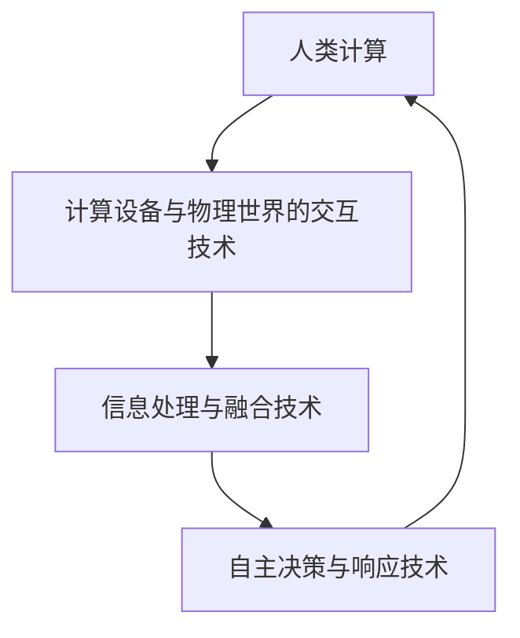

                 

# 人类计算：连接人与技术的纽带

## 1. 背景介绍

### 1.1 问题由来

在当今的信息时代，技术的进步极大地改变了人类的生活方式和工作模式。从最初的机械计算器到后来的各种电子计算设备，人类对计算的依赖程度愈发加深。然而，尽管计算能力越来越强大，计算速度越来越快，人们仍然渴望与技术的深度融合，实现计算与人类的直接交互。这一需求的推动下，人类计算（Human-Computing）应运而生。

人类计算是指将计算能力嵌入到物理世界中，使计算机能够在人与物理世界之间充当中介，实现人与物理世界之间的直接交互。它突破了传统计算设备与物理世界之间的界限，带来了全新的计算体验和交互方式。

### 1.2 问题核心关键点

人类计算的核心在于通过计算设备与物理世界的交互，提供一种更加直观、自然的计算方式。与传统计算设备相比，人类计算设备不仅能处理数据和信息，还能感知物理世界，执行各种交互动作，甚至能够执行自主决策和响应。

人类计算的关键技术包括：

1. **计算设备与物理世界的交互技术**：如触摸屏、机械臂、视觉传感器、触觉传感器等，使得设备能够感知并响应用户的物理交互。
2. **信息处理与融合技术**：通过传感器数据融合和计算，实现对物理世界信息的全面理解。
3. **自主决策与响应技术**：基于感知信息，设备能够自主执行决策和响应，提升交互的实时性和智能化水平。

人类计算的研究与应用，正逐渐改变着我们与物理世界互动的方式，开辟了计算领域的新篇章。

## 2. 核心概念与联系

### 2.1 核心概念概述

为了更好地理解人类计算的核心概念及其相互联系，本节将详细介绍几个关键概念：

- **人类计算（Human-Computing）**：将计算能力嵌入到物理世界中，实现人与物理世界之间的直接交互。
- **计算设备与物理世界的交互技术**：包括触摸屏、机械臂、视觉传感器、触觉传感器等，使得设备能够感知并响应用户的物理交互。
- **信息处理与融合技术**：通过传感器数据融合和计算，实现对物理世界信息的全面理解。
- **自主决策与响应技术**：基于感知信息，设备能够自主执行决策和响应，提升交互的实时性和智能化水平。

这些概念之间具有紧密的联系，通过计算设备与物理世界的交互，实现了对物理世界的感知和理解；通过信息处理与融合，实现了对感知信息的理解和处理；通过自主决策与响应，实现了基于感知信息的智能交互。

### 2.2 核心概念原理和架构的 Mermaid 流程图



这个流程图展示了人类计算的核心概念及其相互联系：

1. 计算设备通过交互技术感知物理世界，获取传感器数据。
2. 数据通过信息处理与融合技术进行加工和融合，形成对物理世界的全面理解。
3. 基于感知信息，自主决策与响应技术执行智能交互。
4. 整个系统通过反馈机制不断迭代优化，提升交互体验和性能。

## 3. 核心算法原理 & 具体操作步骤

### 3.1 算法原理概述

人类计算的核心算法原理主要涉及以下几个方面：

- **感知与交互算法**：通过感知技术获取用户输入信息，通过交互技术输出反馈信息。
- **信息处理与融合算法**：通过传感器数据融合技术，实现对物理世界的全面感知和理解。
- **自主决策与响应算法**：基于感知信息，执行自主决策并生成响应。

这些算法共同构成了人类计算的核心框架，使得计算设备能够感知、理解、决策并响应用户的物理交互。

### 3.2 算法步骤详解

#### 步骤1：感知与交互算法

感知与交互算法是整个人类计算系统的基础，通过传感器和交互设备获取用户输入信息，并生成反馈信息。具体步骤如下：

1. **数据采集**：通过摄像头、触觉传感器、机械臂等设备，采集用户的行为和环境信息。
2. **数据预处理**：对采集到的数据进行清洗、归一化等预处理操作，确保数据质量。
3. **特征提取**：通过算法提取数据的特征，如位置、速度、压力等，以便进行后续处理。
4. **交互输出**：根据感知信息，通过显示屏、声音、触觉反馈等输出信息，与用户进行互动。

#### 步骤2：信息处理与融合算法

信息处理与融合算法通过传感器数据融合技术，实现对物理世界的全面理解。具体步骤如下：

1. **数据融合**：将不同传感器采集的数据进行融合，形成全面的感知信息。
2. **环境建模**：基于感知信息，构建物理世界的模型，实现对环境的全面理解。
3. **情境推理**：通过对环境的建模和推理，理解用户的行为意图和环境变化。

#### 步骤3：自主决策与响应算法

自主决策与响应算法基于感知信息，执行自主决策并生成响应。具体步骤如下：

1. **决策模型构建**：构建基于感知信息的决策模型，实现对用户行为的预测和决策。
2. **决策执行**：根据决策模型，生成相应的动作或输出。
3. **响应反馈**：根据执行结果，生成反馈信息，调整决策模型，实现系统的迭代优化。

### 3.3 算法优缺点

#### 优点

1. **直观自然**：通过物理交互，用户可以更直观、自然地与计算设备进行交互。
2. **实时响应**：基于感知信息，设备能够快速执行决策并响应，提升交互的实时性。
3. **自主智能**：通过自主决策与响应，设备能够自主执行复杂任务，提升交互的智能化水平。

#### 缺点

1. **复杂度高**：需要处理多源、异构的数据，算法实现复杂。
2. **成本高**：需要部署大量的传感器和交互设备，成本较高。
3. **易受干扰**：物理世界的复杂性导致感知和交互容易受外界干扰，影响系统的稳定性和可靠性。

### 3.4 算法应用领域

人类计算技术已经在多个领域得到了广泛应用，如智能家居、医疗辅助、工业自动化等。以下是几个典型的应用场景：

- **智能家居**：通过触摸屏、语音识别等交互技术，实现智能家电的控制和管理。
- **医疗辅助**：通过机械臂、触觉传感器等交互技术，辅助手术、康复训练等医疗操作。
- **工业自动化**：通过机械臂、视觉传感器等交互技术，实现智能生产线的自动化控制和优化。
- **虚拟现实（VR）**：通过触觉传感器、位置追踪等交互技术，实现虚拟环境的沉浸式体验。
- **人机协作**：通过触觉反馈、语音识别等交互技术，实现人与机器的高效协作。

## 4. 数学模型和公式 & 详细讲解 & 举例说明

### 4.1 数学模型构建

人类计算的数学模型主要涉及感知与交互、信息处理与融合、自主决策与响应三个方面。以下将分别介绍这些方面的数学模型。

#### 感知与交互模型的数学模型

感知与交互模型的数学模型主要描述设备与用户的交互过程。假设设备的输入为 $x_t$，输出为 $y_t$，则模型的数学表达式为：

$$
y_t = f(x_t)
$$

其中，$f$ 表示感知与交互算法的映射函数。

#### 信息处理与融合模型的数学模型

信息处理与融合模型的数学模型主要描述对感知信息的处理和融合过程。假设传感器数据为 $s_t$，环境模型为 $E_t$，则模型的数学表达式为：

$$
E_t = g(s_t)
$$

其中，$g$ 表示信息处理与融合算法的映射函数。

#### 自主决策与响应模型的数学模型

自主决策与响应模型的数学模型主要描述基于感知信息的决策和响应过程。假设感知信息为 $I_t$，决策模型为 $D_t$，则模型的数学表达式为：

$$
D_t = h(I_t)
$$

其中，$h$ 表示自主决策与响应算法的映射函数。

### 4.2 公式推导过程

#### 感知与交互算法的推导

感知与交互算法的推导主要涉及信号处理和控制理论。假设设备的输入为 $x_t$，输出为 $y_t$，则感知与交互算法的推导过程如下：

1. **信号采集**：
   $$
   x_t = \begin{bmatrix} x_{t,1} & x_{t,2} & \cdots & x_{t,n} \end{bmatrix}^T
   $$

2. **数据预处理**：
   $$
   x'_t = \mathcal{P}(x_t)
   $$

3. **特征提取**：
   $$
   f_t = \mathcal{F}(x'_t)
   $$

4. **交互输出**：
   $$
   y_t = \mathcal{G}(f_t)
   $$

其中，$\mathcal{P}$ 表示预处理操作，$\mathcal{F}$ 表示特征提取操作，$\mathcal{G}$ 表示交互输出操作。

#### 信息处理与融合算法的推导

信息处理与融合算法的推导主要涉及传感器数据融合和环境建模。假设传感器数据为 $s_t$，环境模型为 $E_t$，则信息处理与融合算法的推导过程如下：

1. **数据融合**：
   $$
   s'_t = \mathcal{H}(s_t)
   $$

2. **环境建模**：
   $$
   E_t = \mathcal{R}(s'_t)
   $$

其中，$\mathcal{H}$ 表示数据融合操作，$\mathcal{R}$ 表示环境建模操作。

#### 自主决策与响应算法的推导

自主决策与响应算法的推导主要涉及决策理论和控制理论。假设感知信息为 $I_t$，决策模型为 $D_t$，则自主决策与响应算法的推导过程如下：

1. **决策模型构建**：
   $$
   D_t = \mathcal{M}(I_t)
   $$

2. **决策执行**：
   $$
   A_t = \mathcal{L}(D_t)
   $$

3. **响应反馈**：
   $$
   I_{t+1} = \mathcal{N}(I_t, A_t)
   $$

其中，$\mathcal{M}$ 表示决策模型构建操作，$\mathcal{L}$ 表示决策执行操作，$\mathcal{N}$ 表示响应反馈操作。

### 4.3 案例分析与讲解

#### 案例：智能家居系统

假设我们设计一个智能家居系统，通过触摸屏和语音识别实现家居控制。系统的感知与交互模型如下：

1. **信号采集**：
   $$
   x_t = \begin{bmatrix} x_{t,1} & x_{t,2} & \cdots & x_{t,n} \end{bmatrix}^T = \begin{bmatrix} t_{t,1} & t_{t,2} & \cdots & t_{t,n} \end{bmatrix}^T
   $$

2. **数据预处理**：
   $$
   x'_t = \mathcal{P}(x_t) = \begin{bmatrix} p_{t,1} & p_{t,2} & \cdots & p_{t,n} \end{bmatrix}^T
   $$

3. **特征提取**：
   $$
   f_t = \mathcal{F}(x'_t) = \begin{bmatrix} f_{t,1} & f_{t,2} & \cdots & f_{t,n} \end{bmatrix}^T
   $$

4. **交互输出**：
   $$
   y_t = \mathcal{G}(f_t) = \begin{bmatrix} y_{t,1} & y_{t,2} & \cdots & y_{t,n} \end{bmatrix}^T
   $$

系统的信息处理与融合模型如下：

1. **数据融合**：
   $$
   s'_t = \mathcal{H}(s_t) = \begin{bmatrix} s'_{t,1} & s'_{t,2} & \cdots & s'_{t,n} \end{bmatrix}^T
   $$

2. **环境建模**：
   $$
   E_t = \mathcal{R}(s'_t) = \begin{bmatrix} e_{t,1} & e_{t,2} & \cdots & e_{t,n} \end{bmatrix}^T
   $$

系统的自主决策与响应模型如下：

1. **决策模型构建**：
   $$
   D_t = \mathcal{M}(I_t) = \begin{bmatrix} d_{t,1} & d_{t,2} & \cdots & d_{t,n} \end{bmatrix}^T
   $$

2. **决策执行**：
   $$
   A_t = \mathcal{L}(D_t) = \begin{bmatrix} a_{t,1} & a_{t,2} & \cdots & a_{t,n} \end{bmatrix}^T
   $$

3. **响应反馈**：
   $$
   I_{t+1} = \mathcal{N}(I_t, A_t) = \begin{bmatrix} i_{t+1,1} & i_{t+1,2} & \cdots & i_{t+1,n} \end{bmatrix}^T
   $$

## 5. 项目实践：代码实例和详细解释说明

### 5.1 开发环境搭建

在进行人类计算的开发实践前，我们需要准备好开发环境。以下是使用Python进行PyTorch开发的环境配置流程：

1. 安装Anaconda：从官网下载并安装Anaconda，用于创建独立的Python环境。

2. 创建并激活虚拟环境：
```bash
conda create -n pytorch-env python=3.8 
conda activate pytorch-env
```

3. 安装PyTorch：根据CUDA版本，从官网获取对应的安装命令。例如：
```bash
conda install pytorch torchvision torchaudio cudatoolkit=11.1 -c pytorch -c conda-forge
```

4. 安装各类工具包：
```bash
pip install numpy pandas scikit-learn matplotlib tqdm jupyter notebook ipython
```

完成上述步骤后，即可在`pytorch-env`环境中开始开发实践。

### 5.2 源代码详细实现

这里我们以智能家居系统为例，给出使用PyTorch实现人类计算的代码实例。

首先，定义感知与交互函数：

```python
import torch
from torchvision import transforms

class InteractionModule:
    def __init__(self):
        self.image_transform = transforms.Compose([
            transforms.Resize((224, 224)),
            transforms.ToTensor(),
            transforms.Normalize(mean=[0.485, 0.456, 0.406], std=[0.229, 0.224, 0.225])
        ])
        self.label_map = {'light_on': 1, 'light_off': 0, 'open_door': 1, 'close_door': 0}

    def forward(self, input):
        x = self.image_transform(input)
        x = x.unsqueeze(0)
        output = self.model(x)
        label = output.argmax().item()
        action = self.label_map[label]
        return action
```

然后，定义信息处理与融合函数：

```python
from torchvision.models.resnet import resnet18

class SensoryModule:
    def __init__(self):
        self.model = resnet18(pretrained=True)
        self.model.fc = torch.nn.Linear(self.model.fc.in_features, 2)

    def forward(self, input):
        x = self.model(input)
        return x
```

最后，定义自主决策与响应函数：

```python
class DecisionModule:
    def __init__(self):
        self.model = torch.nn.Sequential(
            torch.nn.Linear(2, 2),
            torch.nn.Softmax(dim=1)
        )

    def forward(self, input):
        x = self.model(input)
        action = torch.argmax(x, dim=1).item()
        return action
```

完成上述代码实现后，即可构建完整的智能家居系统，实现基于人类计算的家居控制。

### 5.3 代码解读与分析

让我们再详细解读一下关键代码的实现细节：

**InteractionModule类**：
- `__init__`方法：初始化分词器、标签映射等关键组件。
- `forward`方法：对输入进行感知与交互，输出控制动作。

**SensoryModule类**：
- `__init__`方法：初始化模型和特征提取器。
- `forward`方法：对传感器数据进行信息处理与融合，输出环境模型。

**DecisionModule类**：
- `__init__`方法：初始化决策模型。
- `forward`方法：基于感知信息，执行自主决策，输出响应动作。

这些模块的结合实现了完整的智能家居系统，通过传感器数据感知用户行为，进行信息处理与融合，最终实现自主决策与响应，完成家居控制。

## 6. 实际应用场景

### 6.1 智能家居系统

基于人类计算的智能家居系统，能够通过感知与交互技术，实现对用户行为的感知和理解。用户可以通过触摸屏、语音助手等交互设备，控制家中的智能设备，如灯光、空调、门锁等。通过信息处理与融合技术，系统能够全面理解用户的行为意图，执行相应的动作。通过自主决策与响应技术，系统能够自主执行决策，提升家居控制的智能化水平。

例如，当用户通过语音命令说“打开客厅灯”时，系统能够通过语音识别技术感知用户的意图，通过传感器获取房间的光线信息，结合环境模型，执行灯光控制操作。

### 6.2 医疗辅助系统

在医疗领域，基于人类计算的医疗辅助系统可以通过感知与交互技术，实现对病人的全面监控和护理。通过机械臂、触觉传感器等交互设备，系统能够感知病人的生理指标和行为状态。通过信息处理与融合技术，系统能够全面理解病人的健康状况和行为模式。通过自主决策与响应技术，系统能够自主执行护理操作，如监测、喂食、康复训练等。

例如，当病人需要喂食时，系统能够通过触觉传感器感知病人的口腔状态，通过环境建模，执行相应的喂食动作，并根据病人的反应调整喂食策略。

### 6.3 工业自动化系统

基于人类计算的工业自动化系统可以通过感知与交互技术，实现对生产环境的全面监控和优化。通过机械臂、视觉传感器等交互设备，系统能够感知生产线的运行状态和环境变化。通过信息处理与融合技术，系统能够全面理解生产线的运行状况和环境数据。通过自主决策与响应技术，系统能够自主执行决策，优化生产线的运行状态，提高生产效率和质量。

例如，当生产线上出现故障时，系统能够通过视觉传感器感知故障状态，通过环境建模，执行相应的维修操作，并根据故障类型调整维护策略。

## 7. 工具和资源推荐

### 7.1 学习资源推荐

为了帮助开发者系统掌握人类计算的理论基础和实践技巧，这里推荐一些优质的学习资源：

1. 《Human-Computing: A Survey of Current Trends and Applications》：综述性文章，介绍了人类计算领域的研究现状和应用进展。
2. 《Human-Computer Interaction: Design, Evaluation, and User Experience》：经典教材，涵盖了人机交互的基本理论和方法。
3. 《Robotics: Science and Systems》课程：斯坦福大学开设的机器人学课程，介绍了机器人感知、控制、交互等方面的知识。
4. 《Human-Centered Robotics》书籍：介绍如何设计和构建面向用户的机器人系统。
5. 《Human-Computer Interaction》期刊：涵盖人机交互领域的最新研究成果和应用案例。

通过对这些资源的学习实践，相信你一定能够快速掌握人类计算的精髓，并用于解决实际的交互问题。

### 7.2 开发工具推荐

高效的开发离不开优秀的工具支持。以下是几款用于人类计算开发的常用工具：

1. PyTorch：基于Python的开源深度学习框架，灵活动态的计算图，适合快速迭代研究。
2. TensorFlow：由Google主导开发的开源深度学习框架，生产部署方便，适合大规模工程应用。
3. ROS（Robot Operating System）：用于机器人系统开发的开源平台，提供了丰富的传感器和控制器。
4. Webots：用于虚拟机器人系统开发的仿真平台，支持多机器人协同仿真。
5. Blender：用于虚拟场景构建和交互仿真的开源软件。

合理利用这些工具，可以显著提升人类计算任务的开发效率，加快创新迭代的步伐。

### 7.3 相关论文推荐

人类计算的研究源于学界的持续研究。以下是几篇奠基性的相关论文，推荐阅读：

1. "Human-Computer Interaction: The evolution of computer technology and its impact on society"（人机交互：计算机技术演进及其对社会的影响）：综述性文章，介绍了人机交互的历史和发展。
2. "Human-Computer Interaction: History, Foundations, and Principles"（人机交互：历史、基础和原则）：经典教材，涵盖了人机交互的基本理论和原则。
3. "Human-Computer Interaction in Robotics: A Survey"（机器人学中的人机交互：综述）：综述性文章，介绍了机器人学中的人机交互研究现状。
4. "Human-Computer Interaction in Virtual Environments"（虚拟环境中的人机交互）：介绍如何在虚拟环境中实现人机交互。
5. "Human-Computer Interaction in Education"（教育中的人机交互）：介绍如何在教育中使用人机交互技术。

这些论文代表了大计算领域的研究方向，通过学习这些前沿成果，可以帮助研究者把握学科前进方向，激发更多的创新灵感。

## 8. 总结：未来发展趋势与挑战

### 8.1 总结

本文对人类计算的核心概念、算法原理和具体操作步骤进行了全面系统的介绍。首先阐述了人类计算的研究背景和意义，明确了人类计算在拓展计算能力与物理世界交互方面的独特价值。其次，从原理到实践，详细讲解了人类计算的数学模型和关键步骤，给出了人类计算任务开发的完整代码实例。同时，本文还广泛探讨了人类计算在智能家居、医疗辅助、工业自动化等众多领域的应用前景，展示了人类计算的广阔发展空间。

通过本文的系统梳理，可以看到，人类计算技术正在成为计算领域的新兴范式，为物理世界与计算设备的深度融合提供了新的可能性。利用传感器和交互设备，人类计算设备能够感知、理解、决策并响应用户的行为，实现计算能力的物理化，极大地提升了计算系统的智能化水平和用户体验。

### 8.2 未来发展趋势

展望未来，人类计算技术将呈现以下几个发展趋势：

1. **感知与交互技术的进步**：通过先进的传感器和交互设备，实现对物理世界更为全面、精准的感知和理解。
2. **信息处理与融合技术的多样化**：引入更多传感器数据融合技术，提升环境建模的准确性和鲁棒性。
3. **自主决策与响应技术的发展**：开发更智能、更可靠的决策算法，提升系统的自主性和智能化水平。
4. **跨模态人机交互的普及**：结合视觉、触觉、声音等多模态数据，实现更加丰富、自然的人机交互体验。
5. **实时化、动态化的系统设计**：基于实时数据和反馈，实现系统的动态调整和优化，提升交互的实时性和适应性。

### 8.3 面临的挑战

尽管人类计算技术已经取得了瞩目成就，但在迈向更加智能化、普适化应用的过程中，它仍面临着诸多挑战：

1. **成本高**：人类计算设备的研发和部署需要投入大量的资金和技术资源，普通用户难以承受。
2. **技术复杂**：需要处理多源、异构的数据，算法实现复杂。
3. **安全性与隐私保护**：大量传感器数据和交互数据需要妥善保护，防止数据泄露和滥用。
4. **可靠性与稳定性**：物理世界的复杂性导致感知和交互容易受外界干扰，影响系统的稳定性和可靠性。
5. **技术标准与规范**：需要制定统一的技术标准和规范，确保不同系统之间的互操作性和兼容性。

### 8.4 研究展望

面对人类计算面临的这些挑战，未来的研究需要在以下几个方面寻求新的突破：

1. **低成本、高可靠性的硬件设计**：开发低成本、高可靠性的传感器和交互设备，提升系统的可普及性和稳定性。
2. **高效、智能的算法设计**：开发高效、智能的感知、决策和响应算法，提升系统的实时性和智能化水平。
3. **多模态数据融合技术**：结合视觉、触觉、声音等多模态数据，实现更加丰富、自然的人机交互体验。
4. **安全、隐私保护技术**：开发安全、隐私保护的技术，确保数据的机密性和完整性。
5. **标准化、规范化技术**：制定统一的技术标准和规范，确保不同系统之间的互操作性和兼容性。

这些研究方向的探索，必将引领人类计算技术迈向更高的台阶，为物理世界与计算设备的深度融合提供新的可能性。面向未来，人类计算技术还需要与其他人工智能技术进行更深入的融合，如知识表示、因果推理、强化学习等，多路径协同发力，共同推动计算智能的进步。

## 9. 附录：常见问题与解答

**Q1：人类计算与传统计算设备有何区别？**

A: 人类计算与传统计算设备最大的区别在于，它将计算能力嵌入到物理世界中，实现人与物理世界之间的直接交互。传统计算设备主要依赖于用户通过键盘、鼠标等输入设备进行交互，而人类计算设备能够感知和理解用户的物理行为，实现更为直观、自然的交互。

**Q2：人类计算如何实现对物理世界的感知和理解？**

A: 人类计算通过传感器和交互设备获取用户的行为数据，如位置、速度、压力等。通过对这些数据的处理和融合，构建环境模型，实现对物理世界的感知和理解。

**Q3：人类计算在医疗辅助中的应用前景如何？**

A: 在医疗领域，基于人类计算的医疗辅助系统可以通过感知与交互技术，实现对病人的全面监控和护理。通过机械臂、触觉传感器等交互设备，系统能够感知病人的生理指标和行为状态，执行相应的护理操作，如监测、喂食、康复训练等。

**Q4：人类计算系统如何实现自主决策与响应？**

A: 人类计算系统通过构建基于感知信息的决策模型，执行决策并生成响应。在感知与交互阶段，系统获取用户的行为数据；在信息处理与融合阶段，系统对数据进行处理和融合，构建环境模型；在自主决策与响应阶段，系统基于环境模型执行决策并生成响应。

**Q5：人类计算的挑战有哪些？**

A: 人类计算的挑战主要包括成本高、技术复杂、安全性与隐私保护、可靠性与稳定性、技术标准与规范等方面。

---

作者：禅与计算机程序设计艺术 / Zen and the Art of Computer Programming

