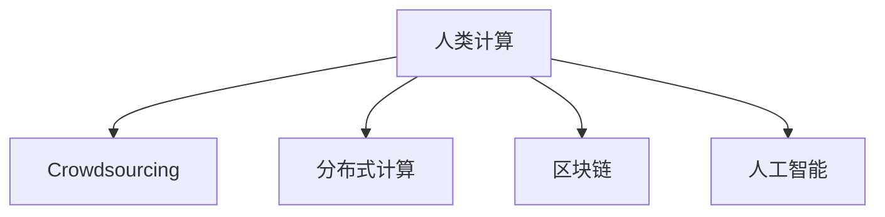

                 

# 人类计算：释放集体智慧的力量

> 关键词：人类计算，众包，协作，集体智慧，分布式计算，区块链，人工智能

## 1. 背景介绍

### 1.1 问题由来
在过去的几十年里，计算机技术飞速发展，信息技术已经成为现代社会不可或缺的一部分。然而，尽管计算机硬件越来越强，人工智能算法越来越精妙，我们依然面临着许多复杂而棘手的问题，这些问题远远超出了计算机自身的解决能力。这些问题包括但不限于：网络安全、金融风险预测、医疗诊断、城市规划、气候变化预测等等。这些问题的解决，需要跨学科的知识、人类经验、直觉和创造力，这些正是计算机所缺乏的。

面对这些问题，人们开始探索如何利用人类的智慧来弥补机器的不足。人类计算（Human Computation）的概念应运而生。人类计算强调利用人类的智慧和经验，与计算机的计算能力相结合，共同解决问题。这不仅有助于解决传统计算难以处理的复杂问题，还可以激发新的思考方式，推动科学、技术、艺术、商业等领域的创新发展。

### 1.2 问题核心关键点
人类计算的核心在于如何有效地利用人类的智慧和计算机的计算能力，协同解决复杂问题。这种计算方式与传统的集中式计算不同，它打破了地域、时间、成本的限制，将计算任务分配给全球范围内的人类工作者，充分利用他们的知识、经验和创造力。

实现人类计算的关键在于以下几个方面：
- **任务设计**：如何设计任务，使普通人能够轻松理解并参与。
- **众包平台**：如何构建众包平台，有效地分配任务和支付报酬。
- **数据隐私**：如何保护用户隐私，确保数据安全。
- **激励机制**：如何激励用户参与，提高工作质量和参与度。
- **自动化工具**：如何利用自动化工具，提高工作效率。

### 1.3 问题研究意义
研究人类计算的意义在于：
- **解决复杂问题**：人类计算能够解决传统计算难以处理的复杂问题，推动科技进步和社会发展。
- **激发创造力**：人类计算需要人类的智慧和创造力，能够激发新的思考方式和解决方案。
- **降低成本**：人类计算能够降低计算成本，特别是在处理大规模数据和复杂问题时。
- **提升效率**：人类计算通过利用全球范围内的智慧，可以大幅提高问题解决的效率。
- **增强信任**：人类计算能够增强用户对技术的信任，提升技术应用的可接受性。

## 2. 核心概念与联系

### 2.1 核心概念概述

为更好地理解人类计算，本节将介绍几个密切相关的核心概念：

- **人类计算（Human Computation）**：利用人类的智慧和计算机的计算能力，协同解决复杂问题的一种计算方式。
- **众包（Crowdsourcing）**：通过互联网将任务分配给非专业的个人完成，充分利用人类的智慧和经验。
- **分布式计算（Distributed Computing）**：将计算任务分配给多台计算机协同完成，以提高计算效率和处理能力。
- **区块链（Blockchain）**：一种去中心化的分布式账本技术，用于保护数据安全和防止欺诈。
- **人工智能（AI）**：通过机器学习、深度学习等技术，使计算机能够模拟人类的智能行为。

这些核心概念之间的逻辑关系可以通过以下Mermaid流程图来展示：



这个流程图展示了几个人类计算的核心概念及其之间的关系：

1. **人类计算**：核心概念，强调利用人类的智慧和计算机的计算能力，协同解决问题。
2. **众包**：人类计算的一种实现方式，通过互联网将任务分配给非专业的个人完成。
3. **分布式计算**：与人类计算紧密相关，通过多台计算机协同工作，提高计算效率。
4. **区块链**：用于保护数据安全和防止欺诈的技术，对人类计算至关重要。
5. **人工智能**：与人类计算相辅相成，通过机器学习等技术，使计算机能够更好地理解和利用人类的智慧。

这些概念共同构成了人类计算的基本框架，为人类计算的应用提供了理论基础。

## 3. 核心算法原理 & 具体操作步骤
### 3.1 算法原理概述

人类计算的原理是利用分布式协作，将复杂的计算任务分解为多个简单的子任务，分配给全球范围内的人类工作者完成。这些子任务通常不需要高深的专业知识，只需基本的计算和识别能力。通过协同工作，所有工作者可以共同解决复杂问题，产生比单个人工智能或单个计算机更强大的计算能力。

### 3.2 算法步骤详解

基于人类计算的计算过程，一般包括以下几个关键步骤：

**Step 1: 任务设计**
- 确定问题的本质和要求。
- 设计简单的子任务，使其易于理解和执行。
- 将任务分解为多个子任务，分配给不同的工作者。

**Step 2: 平台搭建**
- 构建众包平台，用于任务分配和结果收集。
- 开发自动化工具，提高工作效率。

**Step 3: 数据准备**
- 收集和处理所需数据，确保数据质量和完整性。
- 对数据进行标注和预处理，准备任务执行。

**Step 4: 任务分配**
- 将任务分配给不同的工作者。
- 确定工作者的报酬和激励机制，提高工作质量和参与度。

**Step 5: 协同工作**
- 工作者独立执行任务。
- 通过平台进行协同工作，共享数据和成果。

**Step 6: 结果收集与验证**
- 收集工作者提交的结果。
- 对结果进行验证和筛选，确保质量。

**Step 7: 数据分析与优化**
- 分析结果，提取有用信息。
- 对任务和执行过程进行优化，提高效率和质量。

**Step 8: 结果交付**
- 向客户或用户交付最终结果。
- 提供后续支持和维护。

### 3.3 算法优缺点

基于人类计算的算法具有以下优点：
1. 利用全球范围内的人力资源，能够快速解决复杂问题。
2. 成本低廉，特别是对于需要大量计算资源的任务。
3. 能够激发新的思考方式，推动技术创新。
4. 能够提高用户的信任和接受度。

同时，这种算法也存在一些局限性：
1. 需要设计合适的任务，使其易于理解和执行。
2. 数据质量和标注的准确性对结果有重要影响。
3. 平台和工具的开发需要一定的时间和资源。
4. 工作者的参与度和质量可能受到激励机制的影响。
5. 数据的隐私和安全问题需要谨慎处理。

尽管存在这些局限性，但就目前而言，人类计算仍然是一种高效、灵活、可行的解决方案，适用于许多复杂问题的解决。

### 3.4 算法应用领域

人类计算已经在许多领域得到了应用，例如：

- **医学研究**：利用众包平台进行药物筛选、疾病预测和基因组分析等任务。
- **金融分析**：通过分布式计算进行风险评估、市场预测和欺诈检测。
- **环境保护**：利用人类计算进行气候变化预测、生物多样性保护和自然灾害监测。
- **公共安全**：在城市规划、交通管理、灾害预警等方面，利用人类计算提高应急响应和资源调度效率。
- **艺术创作**：通过众包平台进行音乐创作、绘画、设计等艺术作品的创作和评价。
- **科学研究**：利用人类计算进行天文学、物理学、化学等领域的研究。

除了这些经典应用外，人类计算还被创新性地应用到更多场景中，如社会研究、教育、商业智能等，为各行各业带来了新的解决思路。

## 4. 数学模型和公式 & 详细讲解 & 举例说明

### 4.1 数学模型构建

人类计算的数学模型可以简化为以下形式：

设问题 $P$ 需要解决，可以将问题 $P$ 分解为 $n$ 个子任务 $T_1, T_2, ..., T_n$，每个子任务 $T_i$ 可以通过某种方式完成，需要 $t_i$ 时间，且 $t_i$ 满足 $t_i \in [t_{\min}, t_{\max}]$。

令 $N$ 为参与任务的人数，$S$ 为每个任务完成者的人数，$P_i$ 为完成者 $i$ 的任务分配，$R_i$ 为完成者 $i$ 的任务结果，$C_i$ 为完成者 $i$ 的报酬。

则人类计算的优化目标为：

$$
\min_{P_i, R_i, C_i} \sum_{i=1}^N C_i
$$

其中 $C_i$ 为完成者 $i$ 的报酬，通常是完成工作量与时间的倒数。

### 4.2 公式推导过程

在上述模型中，完成者 $i$ 的任务分配 $P_i$ 和结果 $R_i$ 可以表示为：

$$
P_i = \sum_{j=1}^N \delta_{ij} \cdot P_j
$$

$$
R_i = \sum_{j=1}^N \delta_{ij} \cdot R_j
$$

其中 $\delta_{ij}$ 为分配矩阵，表示完成者 $i$ 的任务分配情况。

完成者 $i$ 的任务报酬 $C_i$ 可以表示为：

$$
C_i = \frac{1}{t_i} \cdot \frac{R_i}{P_i}
$$

优化目标可以进一步简化为：

$$
\min_{P_i, R_i, C_i} \sum_{i=1}^N C_i
$$

通过优化分配矩阵和报酬，使总报酬最小化，即可达到人类计算的目标。

### 4.3 案例分析与讲解

假设有一项任务需要利用人类计算解决，任务分解为 $n$ 个子任务，每个子任务需要 $t_i$ 时间完成。有 $N$ 名工作者参与任务，每个工作者可以同时完成 $S$ 个子任务。设每个工作者的报酬为 $C_i$，完成者的任务分配为 $P_i$，完成者的任务结果为 $R_i$。

为了最小化总报酬，可以通过优化分配矩阵和报酬来实现。例如，可以利用遗传算法优化分配矩阵，通过迭代寻找最优的分配方案。同时，可以通过调整报酬系数，平衡工作质量和效率。

## 5. 项目实践：代码实例和详细解释说明
### 5.1 开发环境搭建

在进行人类计算项目实践前，我们需要准备好开发环境。以下是使用Python进行PyTorch开发的环境配置流程：

1. 安装Anaconda：从官网下载并安装Anaconda，用于创建独立的Python环境。

2. 创建并激活虚拟环境：
```bash
conda create -n human_computation python=3.8 
conda activate human_computation
```

3. 安装PyTorch：根据CUDA版本，从官网获取对应的安装命令。例如：
```bash
conda install pytorch torchvision torchaudio cudatoolkit=11.1 -c pytorch -c conda-forge
```

4. 安装相关库：
```bash
pip install numpy pandas sklearn tqdm
```

完成上述步骤后，即可在`human_computation-env`环境中开始项目实践。

### 5.2 源代码详细实现

这里我们以众包平台任务分配为例，给出使用Python实现人类计算的代码。

```python
import numpy as np
from scipy.optimize import linprog

class TaskAssignment:
    def __init__(self, tasks, workers, max_time):
        self.tasks = tasks
        self.workers = workers
        self.max_time = max_time
        self.allocation_matrix = np.zeros((self.workers, len(self.tasks)))
        self报酬系数 = np.ones(self.workers)
        self报酬 = None
        self求解结果 = None
    
    def allocate_tasks(self):
        # 构建目标函数
        objective_function = np.dot(self.allocation_matrix, self报酬系数)
        
        # 构建约束条件
        constraints = []
        for task in self.tasks:
            constraints.append(self.allocation_matrix[:, task] <= 1)
            constraints.append(self.allocation_matrix[:, task] >= 0)
        
        # 构建线性规划问题
        linear_progr = linprog(objective_function, constraints)
        
        # 求解线性规划问题
        self.allocation_matrix = linear_progr.x
        self报酬 = self求解结果.fun
        
        return self报酬
    
    def set_reward_coefficients(self, reward_coefficients):
        self报酬系数 = reward_coefficients
    
    def get_allocation(self):
        return self.allocation_matrix
    
    def get_reward(self):
        return self报酬
```

### 5.3 代码解读与分析

让我们再详细解读一下关键代码的实现细节：

**TaskAssignment类**：
- `__init__`方法：初始化任务、工作者、最大时间等关键组件，并初始化分配矩阵、报酬系数、报酬、求解结果等属性。
- `allocate_tasks`方法：通过线性规划求解任务分配方案，并返回最优报酬。
- `set_reward_coefficients`方法：设置报酬系数，调整报酬分配策略。
- `get_allocation`方法：获取任务分配矩阵。
- `get_reward`方法：获取最优报酬。

**分配矩阵和报酬系数**：
- 分配矩阵是一个二维数组，表示每个工作者完成每个任务的概率。
- 报酬系数是一个一维数组，表示每个工作者的报酬权重。

**线性规划求解**：
- 利用SciPy库中的linprog函数求解线性规划问题，找到最优的分配矩阵和报酬。
- 在求解过程中，通过设置约束条件，确保每个任务只能由一个工作者完成，并且每个工作者的任务分配概率之和为1。

**求解结果分析**：
- 通过调用`allocate_tasks`方法，可以得到最优的任务分配方案和报酬。
- 根据分配矩阵，可以可视化每个工作者完成每个任务的概率。
- 根据报酬，可以评估任务分配策略的效益。

## 6. 实际应用场景
### 6.1 智能客服系统

基于人类计算的智能客服系统，可以广泛应用于金融机构、电信运营商、电商平台等客户服务领域。传统客服系统依赖于人工客服，需要耗费大量人力和物力资源，且响应速度和处理能力有限。而利用人类计算，可以在全球范围内招募大量客服人员，实时解答客户咨询，提升客户满意度和服务质量。

在技术实现上，可以构建众包平台，发布客户咨询任务，并通过自动化工具（如机器人客服）辅助处理。微调后的模型可以用于客户意图的自然语言理解和情感分析，快速生成并回复客户。如此构建的智能客服系统，能够大幅提升客户服务效率，降低运营成本。

### 6.2 金融数据分析

金融领域需要处理大量的数据，包括交易记录、市场数据、财务报表等。传统金融分析师往往需要耗费大量时间和精力，才能完成数据处理和分析。而利用人类计算，可以在短时间内完成大规模数据分析任务，发现市场趋势和投资机会。

在具体应用中，可以构建众包平台，发布数据处理任务，并利用自动化工具进行数据清洗和处理。利用微调后的模型，可以自动分析金融数据，识别异常交易、预测市场走势、评估风险等。这不仅可以提升金融分析的效率和精度，还可以为投资者提供更加准确的决策支持。

### 6.3 环境保护

环境保护领域面临许多复杂的科学和工程问题，如气候变化预测、生物多样性保护、自然灾害监测等。这些问题通常需要跨学科的知识和大量的计算资源。而利用人类计算，可以充分利用全球范围内的智慧和资源，解决这些复杂问题。

在具体应用中，可以构建众包平台，发布环境保护任务，并通过自动化工具进行数据分析和处理。利用微调后的模型，可以自动分析和预测环境变化，识别关键生态区域，制定保护措施。这不仅可以提高环境保护的效率和科学性，还可以为政府和组织提供重要的决策支持。

### 6.4 未来应用展望

随着技术的发展，人类计算将有更广阔的应用前景。未来的趋势包括：

1. **更高效的任务设计**：通过智能推荐和自动生成，使任务设计更加智能化、个性化。
2. **更灵活的众包平台**：构建更智能、更灵活的众包平台，提高任务分配的效率和质量。
3. **更安全的数据保护**：利用区块链等技术，确保数据安全和隐私保护。
4. **更广泛的应用场景**：利用人类计算解决更多的复杂问题，推动科学、技术、艺术等领域的发展。
5. **更高效的自动化工具**：开发更智能、更高效的自动化工具，提高工作效率。

## 7. 工具和资源推荐
### 7.1 学习资源推荐

为了帮助开发者系统掌握人类计算的理论基础和实践技巧，这里推荐一些优质的学习资源：

1. **《Human Computation and Crowdsourcing》系列书籍**：详细介绍了人类计算和众包的基本原理、方法和应用。
2. **Coursera《Human Computation》课程**：斯坦福大学开设的课程，涵盖人类计算的各个方面，包括任务设计、众包平台、数据保护等。
3. **Google Cloud提供的众包工具**：提供各种人类计算的API和工具，帮助开发者构建和优化众包平台。
4. **Human Computation Lab网站**：由多个大学联合创建的网站，提供各种资源和工具，帮助开发者进行人类计算研究。

通过对这些资源的学习实践，相信你一定能够快速掌握人类计算的精髓，并用于解决实际的复杂问题。

### 7.2 开发工具推荐

高效的开发离不开优秀的工具支持。以下是几款用于人类计算开发的常用工具：

1. **AWS SageMaker**：亚马逊提供的机器学习平台，支持各种分布式计算任务，并提供了丰富的API和工具。
2. **Google Cloud Functions**：谷歌提供的服务器无状态函数，可以快速部署和执行各种任务。
3. **TensorFlow**：由谷歌主导开发的深度学习框架，支持各种分布式计算任务，并提供了丰富的API和工具。
4. **PyTorch**：由Facebook主导开发的深度学习框架，支持各种分布式计算任务，并提供了丰富的API和工具。
5. **Amazon Mechanical Turk**：亚马逊提供的众包平台，支持各种任务分配和支付。

合理利用这些工具，可以显著提升人类计算任务的开发效率，加快创新迭代的步伐。

### 7.3 相关论文推荐

人类计算和众包技术的发展源于学界的持续研究。以下是几篇奠基性的相关论文，推荐阅读：

1. **《The Crowdsourcing Platform Amazon Mechanical Turk》**：由Amazon发表的论文，介绍了Amazon Mechanical Turk平台的开发和应用。
2. **《Human Computation: Functional Diversity》**：由William J. Cook等发表的论文，介绍了人类计算和众包的基本原理和应用。
3. **《The Rise of Human Computation》**：由Tim Roughgarden发表的论文，介绍了人类计算和众包的历史和发展趋势。
4. **《Crowdsourcing Platforms: Amazon Mechanical Turk》**：由Benjamin Choi等发表的论文，介绍了Amazon Mechanical Turk平台的实现和技术。
5. **《Human Computation: From Crowds to Crowdsourcing》**：由P.G. Saffin等发表的论文，介绍了人类计算和众包的基本概念和应用。

这些论文代表了大规模人类计算技术的发展脉络。通过学习这些前沿成果，可以帮助研究者把握学科前进方向，激发更多的创新灵感。

## 8. 总结：未来发展趋势与挑战
### 8.1 总结

本文对人类计算进行了全面系统的介绍。首先阐述了人类计算的背景和意义，明确了人类计算在解决复杂问题中的独特价值。其次，从原理到实践，详细讲解了人类计算的数学模型和核心算法，给出了人类计算任务开发的完整代码实例。同时，本文还广泛探讨了人类计算在智能客服、金融数据分析、环境保护等多个行业领域的应用前景，展示了人类计算范式的巨大潜力。此外，本文精选了人类计算技术的各类学习资源，力求为读者提供全方位的技术指引。

通过本文的系统梳理，可以看到，人类计算作为一种计算范式，正在成为解决复杂问题的有效手段，极大地拓展了人工智能技术的应用边界。利用全球范围内的智慧和资源，人类计算有望在更多领域得到应用，推动人工智能技术的发展和产业化进程。

### 8.2 未来发展趋势

展望未来，人类计算将呈现以下几个发展趋势：

1. **更高效的任务设计**：通过智能推荐和自动生成，使任务设计更加智能化、个性化。
2. **更灵活的众包平台**：构建更智能、更灵活的众包平台，提高任务分配的效率和质量。
3. **更安全的数据保护**：利用区块链等技术，确保数据安全和隐私保护。
4. **更广泛的应用场景**：利用人类计算解决更多的复杂问题，推动科学、技术、艺术等领域的发展。
5. **更高效的自动化工具**：开发更智能、更高效的自动化工具，提高工作效率。

### 8.3 面临的挑战

尽管人类计算已经取得了一定的成果，但在迈向更加智能化、普适化应用的过程中，它仍面临着诸多挑战：

1. **任务设计的复杂性**：如何设计合适的任务，使其易于理解和执行，是实现人类计算的重要难题。
2. **数据质量的影响**：数据质量和标注的准确性对结果有重要影响，需要严格的数据预处理和标注。
3. **工作者的激励和质量**：如何激励工作者参与，提高工作质量和参与度，是实现人类计算的关键。
4. **平台和工具的开发**：开发高效、灵活的众包平台和自动化工具，需要大量的时间和资源。
5. **数据隐私和安全**：在利用众包平台进行数据处理时，如何保护用户隐私和数据安全，是实现人类计算的重要保障。

尽管存在这些挑战，但通过不断的技术创新和实践探索，人类计算有望在更多领域得到应用，推动人工智能技术的发展和产业化进程。

### 8.4 研究展望

未来的研究需要在以下几个方面寻求新的突破：

1. **更智能的任务设计**：利用自然语言处理、机器学习等技术，使任务设计更加智能化、个性化。
2. **更灵活的众包平台**：构建更智能、更灵活的众包平台，提高任务分配的效率和质量。
3. **更安全的数据保护**：利用区块链等技术，确保数据安全和隐私保护。
4. **更广泛的应用场景**：利用人类计算解决更多的复杂问题，推动科学、技术、艺术等领域的发展。
5. **更高效的自动化工具**：开发更智能、更高效的自动化工具，提高工作效率。

这些研究方向的探索，必将引领人类计算技术迈向更高的台阶，为构建安全、可靠、可解释、可控的智能系统铺平道路。面向未来，人类计算技术还需要与其他人工智能技术进行更深入的融合，如知识表示、因果推理、强化学习等，多路径协同发力，共同推动人工智能技术的进步。

## 9. 附录：常见问题与解答

**Q1：人类计算和众包的区别是什么？**

A: 人类计算是一种利用全球范围内智慧和资源，协同解决复杂问题的计算方式。众包是实现人类计算的一种手段，通过互联网将任务分配给非专业的个人完成。

**Q2：人类计算面临的主要挑战有哪些？**

A: 人类计算面临的主要挑战包括任务设计的复杂性、数据质量的影响、工作者的激励和质量、平台和工具的开发、数据隐私和安全等。

**Q3：人类计算有哪些实际应用场景？**

A: 人类计算已经在许多领域得到了应用，如智能客服系统、金融数据分析、环境保护、公共安全、艺术创作、科学研究等。

**Q4：人类计算的前景和趋势是什么？**

A: 人类计算的前景和趋势包括更高效的任务设计、更灵活的众包平台、更安全的数据保护、更广泛的应用场景、更高效的自动化工具等。

---

作者：禅与计算机程序设计艺术 / Zen and the Art of Computer Programming

