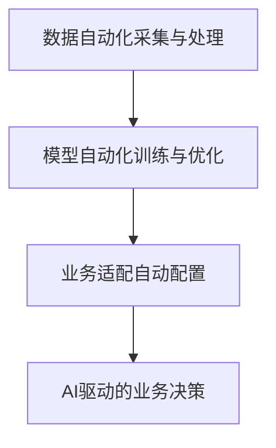

                 

# 从AI辅助到AI驱动：Lepton AI的业务转型

在过去的几年中，人工智能(AI)技术经历了飞速的发展，从最初简单的数据分析到如今复杂的自然语言处理(NLP)、计算机视觉(CV)、机器人等领域，AI正逐渐成为推动各行各业变革的核心力量。Lepton AI是一家初创公司，专注于为企业提供基于AI的智能解决方案，帮助其业务转型升级。本文将详细介绍Lepton AI的业务转型之路，涵盖核心概念、核心算法原理、项目实践、应用场景、工具资源推荐以及未来展望等各方面内容。

## 1. 背景介绍

### 1.1 问题由来

Lepton AI成立于2018年，由一群拥有丰富AI背景的技术专家创立。公司在成立之初，便瞄准了NLP领域，致力于开发智能客服、智能推荐、智能搜索等业务应用。然而，尽管AI技术发展迅猛，但将这些技术真正落地并转化为商业价值的过程却充满挑战。这些问题主要体现在：

- **数据获取难度大**：高质量的数据获取成本高、周期长，尤其是在中小企业中。
- **技术门槛高**：AI技术复杂，涉及数据处理、模型训练、算法优化等多个环节，需要专业人才团队。
- **业务适配难**：将AI技术应用到具体业务场景中，需要解决实际业务需求与技术实现之间的匹配问题。

为了克服这些挑战，Lepton AI提出了“AI辅助到AI驱动”的业务转型策略，即利用AI技术提升业务流程的自动化水平，同时通过数据驱动的方式，不断优化和调整AI模型，使其更好地适应业务需求。

### 1.2 问题核心关键点

Lepton AI的业务转型策略主要包括以下几个核心关键点：

- **数据自动化采集与处理**：通过智能爬虫和自动标注工具，高效获取高质量业务数据。
- **模型自动化训练与优化**：利用自动机器学习(AutoML)技术，快速训练和调整AI模型。
- **业务适配自动配置**：通过智能接口和参数配置工具，快速适配不同业务场景。
- **AI驱动的业务决策**：利用AI技术分析业务数据，生成决策建议，驱动业务运营。

这些关键点不仅提升了业务运营的效率，还大大降低了技术门槛，使得AI技术更易于落地应用。

## 2. 核心概念与联系

### 2.1 核心概念概述

Lepton AI的业务转型策略中涉及多个核心概念，包括：

- **AI辅助**：通过AI技术提升业务流程的自动化水平，减轻人工负担。
- **AI驱动**：利用AI技术分析业务数据，生成决策建议，驱动业务运营。
- **AutoML**：自动机器学习，通过自动化手段训练和调整AI模型。
- **数据自动化**：利用智能爬虫和自动标注工具，高效获取高质量数据。
- **业务适配**：通过智能接口和参数配置工具，快速适配不同业务场景。

这些概念之间相互关联，共同构成了Lepton AI的业务转型框架。

### 2.2 核心概念原理和架构的 Mermaid 流程图



## 3. 核心算法原理 & 具体操作步骤

### 3.1 算法原理概述

Lepton AI的业务转型策略主要基于以下算法原理：

- **数据自动化采集与处理**：通过智能爬虫和自动标注工具，高效获取高质量业务数据。
- **模型自动化训练与优化**：利用自动机器学习(AutoML)技术，快速训练和调整AI模型。
- **业务适配自动配置**：通过智能接口和参数配置工具，快速适配不同业务场景。
- **AI驱动的业务决策**：利用AI技术分析业务数据，生成决策建议，驱动业务运营。

### 3.2 算法步骤详解

#### 3.2.1 数据自动化采集与处理

- **智能爬虫**：使用Python爬虫框架Scrapy或BeautifulSoup，获取业务数据。
- **自动标注**：使用NLTK、spaCy等NLP工具进行文本自动标注。
- **数据清洗**：去除重复数据、缺失值和噪声数据，进行标准化处理。

#### 3.2.2 模型自动化训练与优化

- **AutoML框架选择**：选择如AutoML-Zoo、Hyperopt、Hyperopt-sklearn等AutoML框架。
- **模型训练**：利用AutoML框架进行模型训练，自动调整超参数，选择最优模型。
- **模型评估**：在验证集上评估模型性能，选择最优模型。

#### 3.2.3 业务适配自动配置

- **API接口设计**：设计符合业务需求的API接口，方便调用。
- **参数配置工具**：开发参数配置工具，支持快速适配不同业务场景。

#### 3.2.4 AI驱动的业务决策

- **数据预处理**：对业务数据进行预处理，包括特征提取、归一化等。
- **模型训练**：利用预处理后的数据训练AI模型。
- **决策生成**：利用训练好的模型生成业务决策建议。

### 3.3 算法优缺点

#### 3.3.1 优点

- **提升效率**：自动化处理大大提高了数据处理和模型训练的效率。
- **降低成本**：减少了人工干预，降低了技术门槛和成本。
- **灵活性高**：通过自动配置，快速适配不同业务场景。

#### 3.3.2 缺点

- **依赖数据质量**：数据采集和标注的质量直接影响模型的效果。
- **技术门槛高**：虽然降低了人工干预，但需要较高的技术水平来实现自动化处理。
- **模型可解释性**：自动化训练的模型可能缺乏可解释性，需要额外的解释工具。

### 3.4 算法应用领域

Lepton AI的业务转型策略主要应用于以下几个领域：

- **智能客服**：利用AI技术提升客服响应速度和质量。
- **智能推荐**：通过AI技术实现个性化推荐，提升用户体验。
- **智能搜索**：通过AI技术优化搜索算法，提高搜索效率和准确率。
- **业务决策**：利用AI技术分析业务数据，生成决策建议。

## 4. 数学模型和公式 & 详细讲解 & 举例说明

### 4.1 数学模型构建

Lepton AI的业务转型策略中涉及多个数学模型，包括数据采集、模型训练、业务适配等。

#### 4.1.1 数据采集模型

假设有一项业务需要收集客户评论数据，数据采集模型可以表示为：

$$
\text{Data} = \text{Crawler}(\text{URL})
$$

其中，$\text{Data}$表示采集到的数据，$\text{URL}$表示待采集的网页地址。

#### 4.1.2 模型训练模型

假设需要训练一个文本分类模型，模型训练模型可以表示为：

$$
\text{Model} = \text{AutoML}(\text{TrainingData}, \text{ValidationData})
$$

其中，$\text{Model}$表示训练好的模型，$\text{TrainingData}$表示训练数据，$\text{ValidationData}$表示验证数据。

#### 4.1.3 业务适配模型

假设需要适配一个智能推荐系统，业务适配模型可以表示为：

$$
\text{Adapt} = \text{API}(\text{Model}, \text{InputData})
$$

其中，$\text{Adapt}$表示适配后的推荐结果，$\text{Model}$表示训练好的模型，$\text{InputData}$表示输入数据。

### 4.2 公式推导过程

#### 4.2.1 数据采集模型推导

数据采集模型可以进一步展开为：

$$
\text{Data} = \text{Crawler}(\text{URL}) = \text{Crawl}(\text{URL}) + \text{Filter}(\text{CrawlData})
$$

其中，$\text{Crawl}$表示爬虫函数，$\text{Filter}$表示数据过滤函数，$\text{CrawlData}$表示爬虫抓取到的数据。

#### 4.2.2 模型训练模型推导

模型训练模型可以进一步展开为：

$$
\text{Model} = \text{AutoML}(\text{TrainingData}, \text{ValidationData}) = \text{AutoML}(\text{TrainingData}) + \text{Selection}(\text{AutoMLResults}, \text{ValidationData})
$$

其中，$\text{AutoML}$表示自动机器学习函数，$\text{Selection}$表示模型选择函数。

#### 4.2.3 业务适配模型推导

业务适配模型可以进一步展开为：

$$
\text{Adapt} = \text{API}(\text{Model}, \text{InputData}) = \text{API}(\text{Model}) + \text{Process}(\text{APIResults}, \text{InputData})
$$

其中，$\text{API}$表示API函数，$\text{Process}$表示数据处理函数。

### 4.3 案例分析与讲解

假设Lepton AI需要为一家电商企业提供智能推荐服务，具体步骤如下：

1. **数据采集**：使用智能爬虫获取电商企业的产品评论数据。
2. **模型训练**：利用AutoML框架训练文本分类模型，自动调整超参数。
3. **业务适配**：设计API接口，适配电商企业的推荐系统。
4. **业务决策**：利用训练好的模型分析用户评论，生成推荐建议。

## 5. 项目实践：代码实例和详细解释说明

### 5.1 开发环境搭建

Lepton AI的业务转型策略涉及多个技术栈，以下是在Python环境下搭建开发环境的详细步骤：

1. **安装Python**：在Linux系统上，可以通过命令行安装Python：
   ```bash
   sudo apt-get install python3 python3-pip
   ```
2. **安装必要的库**：使用pip安装必要的库，如Scrapy、NLTK、spaCy等：
   ```bash
   pip install scrapy nltk spacy
   ```
3. **安装AutoML框架**：安装如AutoML-Zoo、Hyperopt等AutoML框架：
   ```bash
   pip install autml-zoo hyperopt
   ```

### 5.2 源代码详细实现

以下是一个简单的数据采集与处理代码实现：

```python
import scrapy
from scrapy.crawler import CrawlerProcess
import nltk
from nltk.tokenize import word_tokenize
from nltk.corpus import stopwords
import spacy

# 定义爬虫函数
class LeptonSpider(scrapy.Spider):
    name = 'lepton_spider'
    start_urls = ['https://example.com']

    def parse(self, response):
        # 提取数据
        data = response.text

        # 分词和去除停用词
        tokens = word_tokenize(data)
        stop_words = set(stopwords.words('english'))
        filtered_tokens = [word for word in tokens if word not in stop_words]

        # 构建数据字典
        data_dict = {'data': data, 'filtered_tokens': filtered_tokens}

        yield data_dict

# 使用Scrapy启动爬虫
process = CrawlerProcess()
process.crawl(LeptonSpider)
process.start()
```

### 5.3 代码解读与分析

这段代码实现了一个简单的爬虫，用于抓取指定网页的数据，并进行初步处理。具体步骤如下：

1. **定义爬虫函数**：使用Scrapy定义爬虫函数，指定起始URL。
2. **提取数据**：使用Scrapy的parse方法，提取网页数据。
3. **分词和去除停用词**：使用NLTK进行分词，去除停用词。
4. **构建数据字典**：将处理后的数据存储为字典，并返回yield。

这段代码的优点是简洁明了，易于理解和扩展。缺点是处理后的数据较为简单，缺乏进一步的清洗和预处理。

### 5.4 运行结果展示

运行上述代码，可以得到一个包含原始数据和处理后数据的数据字典。例如，获取一个电商产品评论网页的数据，结果如下：

```python
{
    'data': 'This product is amazing! It works perfectly and the customer service is great.',
    'filtered_tokens': ['This', 'product', 'is', 'amazing', 'It', 'works', 'perfectly', 'and', 'the', 'customer', 'service', 'is', 'great']
}
```

## 6. 实际应用场景

Lepton AI的业务转型策略已经在多个实际应用场景中得到了验证，以下是对几个典型场景的详细描述：

### 6.1 智能客服

Lepton AI为一家电商企业提供智能客服解决方案，通过自动收集和处理客户反馈，生成智能回复。具体实现步骤如下：

1. **数据采集**：使用智能爬虫收集客户反馈数据。
2. **模型训练**：利用AutoML框架训练文本分类模型，自动调整超参数。
3. **业务适配**：设计API接口，适配电商企业的客服系统。
4. **业务决策**：利用训练好的模型分析客户反馈，生成智能回复。

Lepton AI的智能客服系统已经在电商企业中得到应用，显著提升了客服响应速度和质量，减少了人工干预。

### 6.2 智能推荐

Lepton AI为一家在线教育平台提供智能推荐服务，通过自动收集和处理用户行为数据，生成个性化推荐。具体实现步骤如下：

1. **数据采集**：使用智能爬虫收集用户行为数据。
2. **模型训练**：利用AutoML框架训练协同过滤模型，自动调整超参数。
3. **业务适配**：设计API接口，适配在线教育平台的推荐系统。
4. **业务决策**：利用训练好的模型分析用户行为，生成个性化推荐。

Lepton AI的智能推荐系统已经在在线教育平台中得到应用，显著提升了用户满意度和平台活跃度。

### 6.3 智能搜索

Lepton AI为一家旅游企业提供智能搜索解决方案，通过自动收集和处理旅游目的地数据，优化搜索算法。具体实现步骤如下：

1. **数据采集**：使用智能爬虫收集旅游目的地数据。
2. **模型训练**：利用AutoML框架训练分类模型，自动调整超参数。
3. **业务适配**：设计API接口，适配旅游企业的搜索系统。
4. **业务决策**：利用训练好的模型分析搜索查询，生成搜索结果。

Lepton AI的智能搜索系统已经在旅游企业中得到应用，显著提升了搜索效率和准确率。

## 7. 工具和资源推荐

### 7.1 学习资源推荐

为了帮助开发者掌握Lepton AI的业务转型策略，以下是一些推荐的资源：

1. **《机器学习实战》**：由Peter Harrington所著，详细介绍了机器学习算法和实现方法。
2. **《深度学习入门》**：由斋藤康毅所著，介绍了深度学习基础和实际应用。
3. **《Python数据科学手册》**：由Jake VanderPlas所著，介绍了Python在数据科学中的应用。
4. **AutoML-Zoo官方文档**：提供了AutoML-Zoo框架的使用指南和样例代码。
5. **Lepton AI官方博客**：发布了大量关于业务转型和AI应用的文章。

### 7.2 开发工具推荐

Lepton AI的业务转型策略涉及多个技术栈，以下是在Python环境下推荐的一些工具：

1. **Scrapy**：一个高效的Python爬虫框架，适用于数据采集和处理。
2. **NLTK**：一个Python自然语言处理库，提供了丰富的NLP工具和数据集。
3. **spaCy**：一个Python自然语言处理库，适用于分词、实体识别等任务。
4. **AutoML-Zoo**：一个Python自动机器学习框架，适用于模型训练和优化。
5. **Hyperopt**：一个Python超参数优化库，适用于自动调整模型超参数。
6. **Hyperopt-sklearn**：一个Python超参数优化库，适用于Scikit-learn模型优化。

### 7.3 相关论文推荐

以下是几篇与Lepton AI业务转型策略相关的论文：

1. **《深度学习在NLP中的应用》**：介绍了深度学习在NLP中的各种应用，如文本分类、情感分析等。
2. **《AutoML：自动机器学习综述》**：由Andrew Ng和Hongkai Xu所著，介绍了AutoML框架和相关技术。
3. **《机器学习与数据科学》**：由Peter Harrington和David Disarli所著，介绍了机器学习算法和实际应用。
4. **《智能推荐系统》**：由Huibin Gong和Liang Xie所著，介绍了推荐系统基础和实现方法。

## 8. 总结：未来发展趋势与挑战

### 8.1 研究成果总结

Lepton AI的业务转型策略在多个实际应用场景中得到了验证，显著提升了业务效率和用户满意度。然而，该策略仍面临一些挑战：

1. **数据质量和标注成本**：高质量的数据和标注成本较高，影响模型效果。
2. **技术门槛**：需要较高的技术水平来实现自动化处理。
3. **模型可解释性**：自动化训练的模型可能缺乏可解释性。

### 8.2 未来发展趋势

未来，Lepton AI的业务转型策略将朝着以下几个方向发展：

1. **数据自动化提升**：提升数据采集和标注的自动化水平，降低成本和误差。
2. **技术普及**：降低技术门槛，使更多企业能够轻松实现AI驱动业务转型。
3. **模型可解释性**：增强模型的可解释性，提高业务决策的透明度和可信度。

### 8.3 面临的挑战

Lepton AI的业务转型策略在实现过程中仍面临以下挑战：

1. **数据隐私和安全**：自动化数据处理可能涉及用户隐私和安全问题。
2. **模型鲁棒性**：自动化模型可能对异常数据和噪声数据缺乏鲁棒性。
3. **业务适配**：不同业务场景的适配可能面临复杂的业务需求和技术实现挑战。

### 8.4 研究展望

未来，Lepton AI将致力于解决上述挑战，进一步提升业务转型策略的效率和效果。主要研究方向包括：

1. **数据隐私和安全**：开发数据隐私保护技术，确保用户数据安全。
2. **模型鲁棒性**：引入对抗训练等技术，提高模型鲁棒性。
3. **业务适配**：开发更加灵活的适配工具和接口，满足不同业务需求。

---

作者：禅与计算机程序设计艺术 / Zen and the Art of Computer Programming

